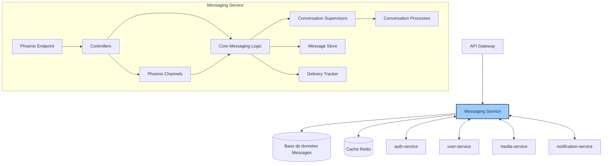
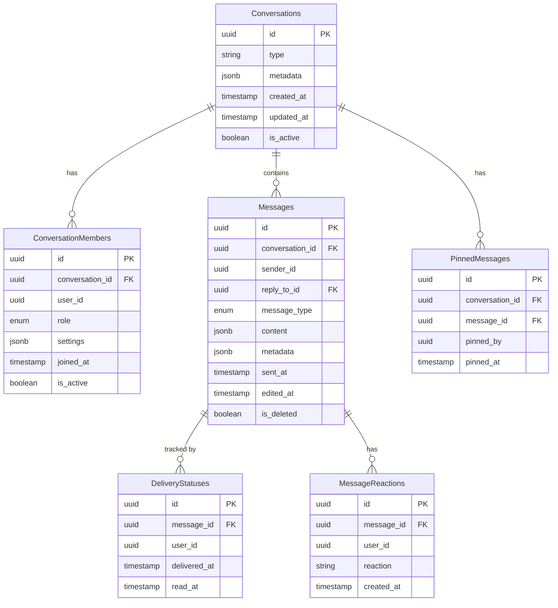
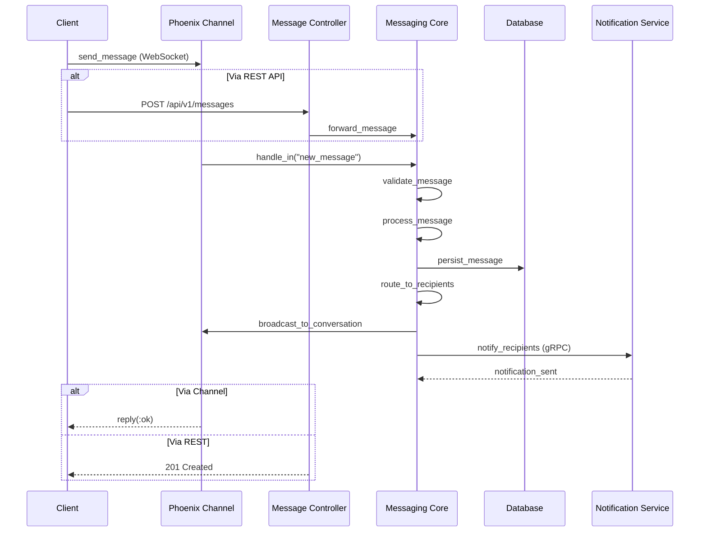
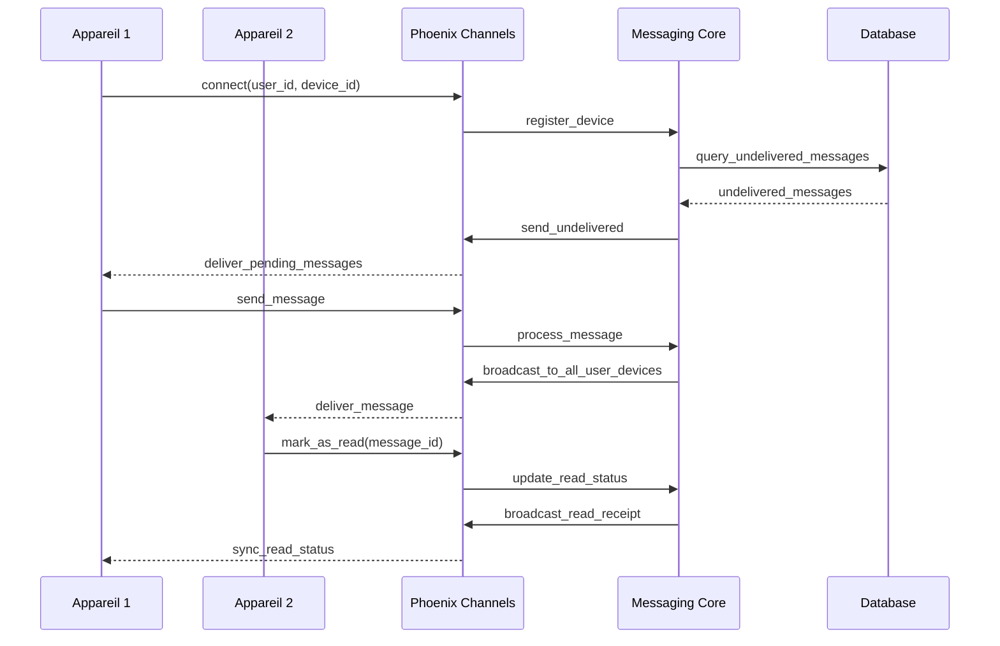
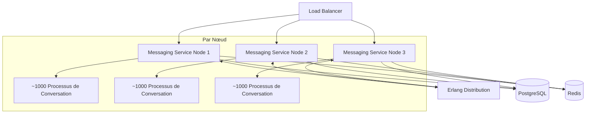

# Messaging Service (`messaging-service`) - System Design Document

## 1. Introduction

### 1.1 Objectif du Document
Ce document décrit l'architecture et la conception technique du service de messagerie (Messaging Service) de l'application Whispr. Il sert de référence pour l'équipe de développement et les parties prenantes du projet.

### 1.2 Périmètre du Service
Le Messaging Service est responsable de la gestion des conversations, des messages, de la communication en temps réel, et de la synchronisation multi-appareils. Il assure la livraison fiable et sécurisée des messages textuels et multimédias tout en préservant leur chiffrement de bout en bout.

### 1.3 Relations avec les Autres Services
Le Messaging Service interagit avec plusieurs autres microservices de l'écosystème Whispr :
- **auth-service** : pour la validation des identités et l'autorisation
- **user-service** : pour les informations sur les utilisateurs et groupes
- **media-service** : pour le traitement et le stockage des médias partagés
- **notification-service** : pour alerter les utilisateurs des nouveaux messages
- **moderation-service** : pour l'analyse des médias avant partage

## 2. Architecture Globale

### 2.1 Vue d'Ensemble de l'Architecture

Le service de messagerie repose sur une architecture Elixir/OTP avec isolation des composants via le modèle d'Acteurs :



### 2.2 Principes Architecturaux

- **Modèle Acteur** : Utilisation du modèle d'acteurs d'Erlang/OTP pour la concurrence
- **Tolérance aux pannes** : Structure de supervision permettant l'auto-guérison des processus
- **Approche événementielle** : Communication asynchrone via PubSub pour les notifications
- **Stateful par conception** : Maintien de l'état des conversations dans des processus dédiés
- **Haute disponibilité** : Distribution des processus dans le cluster pour éviter les points uniques de défaillance
- **Scaling horizontal** : Capacité à ajouter des nœuds pour augmenter la capacité
- **Persistance garantie** : Messages persistés avant confirmation de réception

## 3. Choix Technologiques

### 3.1 Stack Technique

- **Langage** : Elixir
- **Framework** : Phoenix (framework web pour Elixir)
- **Communication temps réel** : Phoenix Channels pour les WebSockets
- **Base de données** : PostgreSQL avec Ecto
- **Cache** : Redis pour les données temporaires et les sessions
- **Communication inter-services** : gRPC pour les appels synchrones, PubSub pour les événements
- **ORM** : Ecto avec repositories
- **API** : REST avec documentation OpenAPI pour l'API externe
- **WebSockets** : Phoenix Channels pour les communications temps réel
- **Queues** : Intégration avec des files d'attente pour les opérations asynchrones
- **Testing** : ExUnit pour les tests unitaires et d'intégration

### 3.2 Infrastructure

- **Containerisation** : Docker
- **Orchestration** : Kubernetes (GKE)
- **CI/CD** : GitHub Actions
- **Service Cloud** : Google Cloud Platform (GCP)
- **Monitoring** : Prometheus + Grafana
- **Logging** : Loki
- **Tracing** : OpenTelemetry
- **Distribution** : Clustering Erlang/OTP pour le scaling horizontal

## 4. Composants Principaux

### 4.1 Structure Phoenix/OTP

L'architecture du service est organisée comme suit :

```
lib/
├── whispr_messaging/              # Core domain logic
│   ├── application.ex             # OTP Application entry point
│   ├── conversations/             # Conversation management
│   │   ├── conversation.ex        # Conversation struct and logic
│   │   ├── supervisor.ex          # Conversation process supervisor
│   │   └── registry.ex            # Registry for conversation processes
│   ├── messages/                  # Message handling
│   │   ├── message.ex             # Message struct and validations
│   │   ├── store.ex               # Message persistence layer
│   │   └── delivery.ex            # Message delivery tracking
│   ├── presence/                  # User presence tracking
│   └── encryption/                # E2E encryption helpers (client verification)
├── whispr_messaging_web/          # Web layer
│   ├── endpoint.ex                # Phoenix endpoint
│   ├── router.ex                  # Route definitions
│   ├── controllers/               # REST API controllers
│   ├── channels/                  # WebSocket channels
│   │   ├── conversation_channel.ex # Per-conversation channel
│   │   └── user_channel.ex        # Per-user notifications channel
│   ├── views/                     # Response formatting
│   └── plugs/                     # Custom request processing
├── whispr_messaging_grpc/         # gRPC service implementations for inter-service communication
│   ├── server.ex                  # gRPC server setup
│   └── services/                  # gRPC service implementations
└── whispr_messaging_workers/      # Background workers for async tasks
    ├── message_cleanup.ex         # Message retention policies
    └── metrics_reporter.ex        # Telemetry reporting
```

### 4.2 Processus OTP et Superviseurs

Le service utilise une hiérarchie de supervision pour garantir la résilience :

- **Application Supervisor** : Superviseur racine de l'application
  - **Endpoint Supervisor** : Gère le point d'entrée Phoenix
  - **ConversationSupervisor** : Supervision dynamique des processus de conversation
  - **PresenceSupervisor** : Gestion des informations de présence utilisateur
  - **WorkersSupervisor** : Gestion des tâches de fond
  - **gRPC Server Supervisor** : Supervision du serveur gRPC

Chaque conversation est gérée par un processus GenServer distinct permettant l'isolation et le scaling de chaque conversation individuellement.

### 4.3 Phoenix Channels

Les channels Phoenix gèrent les connexions WebSocket pour la communication en temps réel :

- **UserChannel** : Communication utilisateur-spécifique (notifs, présence)
- **ConversationChannel** : Communication dans une conversation spécifique
  - Abonnement aux événements de la conversation
  - Envoi et réception de messages
  - Indicateurs de frappe et présence
  - Statuts de lecture des messages

### 4.4 Controllers (API Layer)

Les controllers Phoenix exposent les endpoints RESTful :
- **ConversationController** : Gestion des conversations
- **MessageController** : Envoi/réception/modification des messages
- **GroupController** : Interactions avec les groupes de conversation
- **StatusController** : Gestion des statuts de livraison et lecture

### 4.5 Modèle des Données

Les structures de données principales :
- **Conversation** : Métadonnées de conversation (participants, type, etc.)
- **Message** : Contenu des messages avec métadonnées
- **DeliveryStatus** : Statut de livraison et lecture par destinataire
- **ConversationMember** : Relation utilisateur-conversation

### 4.6 Système de Distribution des Messages

Le cœur du service s'articule autour d'un système de distribution de messages :
- **MessageRouter** : Détermine les destinataires d'un message
- **DeliveryTracker** : Suit l'état de livraison des messages
- **MessageStore** : Persiste les messages dans la base de données
- **PubSubBroker** : Distribue les messages aux différents nœuds du cluster

### 4.7 Communication avec les autres services

- **gRPC Client/Server** pour l'intégration avec les autres services
- Interfaces gRPC exposées pour les autres services :
  - Interface pour le user-service : notifications de création de groupe
  - Interface pour le notification-service : déclenchement de notifications push
  - Interface pour le media-service : liaison des médias aux messages

## 5. Modèle de Données

### 5.1 Schéma de Base de Données



### 5.2 Structures Ecto

Exemple de définition des principales structures Ecto :

```elixir
# Exemple de schéma Conversation
defmodule WhisprMessaging.Conversations.Conversation do
  use Ecto.Schema
  import Ecto.Changeset

  @primary_key {:id, :binary_id, autogenerate: true}
  schema "conversations" do
    field :type, :string  # "direct", "group"
    field :metadata, :map, default: %{}
    field :is_active, :boolean, default: true
    
    has_many :members, WhisprMessaging.Conversations.ConversationMember
    has_many :messages, WhisprMessaging.Messages.Message
    has_many :pinned_messages, WhisprMessaging.Messages.PinnedMessage

    timestamps()
  end
  
  def changeset(conversation, attrs) do
    conversation
    |> cast(attrs, [:type, :metadata, :is_active])
    |> validate_required([:type])
    |> validate_inclusion(:type, ["direct", "group"])
  end
end

# Exemple de schéma Message
defmodule WhisprMessaging.Messages.Message do
  use Ecto.Schema
  import Ecto.Changeset

  @primary_key {:id, :binary_id, autogenerate: true}
  schema "messages" do
    field :sender_id, :binary_id
    field :message_type, :string  # "text", "media", "system"
    field :content, :map
    field :metadata, :map, default: %{}
    field :sent_at, :utc_datetime
    field :edited_at, :utc_datetime
    field :is_deleted, :boolean, default: false
    
    belongs_to :conversation, WhisprMessaging.Conversations.Conversation, type: :binary_id
    belongs_to :reply_to, WhisprMessaging.Messages.Message, type: :binary_id
    has_many :delivery_statuses, WhisprMessaging.Messages.DeliveryStatus
    has_many :reactions, WhisprMessaging.Messages.MessageReaction

    timestamps()
  end
  
  def changeset(message, attrs) do
    message
    |> cast(attrs, [:conversation_id, :sender_id, :reply_to_id, :message_type, :content, :metadata, :sent_at])
    |> validate_required([:conversation_id, :sender_id, :message_type, :content, :sent_at])
    |> validate_inclusion(:message_type, ["text", "media", "system"])
  end
end
```

## 6. Fonctionnalités Principales et Flux

### 6.1 Envoi de Messages



#### Processus détaillé
1. Message reçu via WebSocket ou API REST
2. Validation du message et vérification des permissions
3. Enrichissement avec métadonnées (horodatage, ID, etc.)
4. Persistance dans la base de données
5. Distribution aux destinataires connectés via PubSub
6. Notification des utilisateurs non connectés via notification-service
7. Tracking des statuts de livraison

### 6.2 Gestion des Conversations

#### Créer une conversation
1. Réception des données de la conversation (type, participants)
2. Validation des participants (via user-service)
3. Création de la conversation en base de données
4. Démarrage d'un processus GenServer dédié à la conversation
5. Notification aux participants de la nouvelle conversation

#### Processus de conversation
Chaque conversation est gérée par un processus GenServer dédié qui :
- Maintient l'état courant de la conversation
- Gère les abonnements des utilisateurs connectés
- Coordonne la distribution des messages
- Optimise les performances avec un état en mémoire

### 6.3 Gestion de la Synchronisation Multi-appareils



Caractéristiques principales :
- Livraison fiable à tous les appareils de l'utilisateur
- Synchronisation des statuts de lecture entre appareils
- Gestion des paramètres spécifiques par appareil
- Optimisation de la consommation batterie pour les appareils mobiles

### 6.4 Gestion des Messages Programmés

1. Réception d'une demande de message programmé
2. Validation et stockage avec une date d'envoi future
3. Ajout dans une file d'attente prioritaire par date d'envoi
4. Processus périodique vérifiant les messages à envoyer
5. Distribution standard au moment prévu

### 6.5 Fonctionnalités de Lecture et Statuts

1. Tracking des accusés de réception (livraison)
2. Tracking des statuts de lecture
3. Indication de frappe ("X est en train d'écrire...")
4. Présence des utilisateurs (en ligne, dernière connexion)
5. Propagation des statuts entre tous les appareils

## 7. Scaling et Performances

### 7.1 Architecture de Scaling



### 7.2 Caractéristiques de Scaling

- **Clustering Erlang natif** : Les nœuds Elixir forment un cluster via distribution Erlang
- **Distribution des processus de conversation** : Répartition équilibrée via partitionnement consistent
- **State répliqué** : État critique répliqué via :ETS ou Mnesia pour la redondance
- **Location-aware routing** : Routage des messages vers le nœud optimal
- **Hot-code reloading** : Mise à jour du code sans interruption de service

### 7.3 Optimisations de Performance

- **Processus légers Erlang** : Utilisation de milliers de processus concurrents
- **Caching intelligent** :
  - Conversations récentes en mémoire
  - Mise en cache des messages fréquemment consultés
  - Distribution des caches via Redis
- **Batch processing** : Traitement par lots pour les opérations coûteuses
- **Back-pressure** : Mécanismes pour gérer les surcharges
- **Early filtering** : Filtrage précoce des messages en fonction des permissions

### 7.4 Benchmarks et Limites

| Métrique | Cible |
|----------|-------|
| Temps de livraison message 1:1 | < 100ms (P99) |
| Temps de livraison message groupe | < 300ms (P99 pour 100 membres) |
| Capacité par nœud | 100,000 connexions WebSocket simultanées |
| Messages par seconde | 10,000+ par nœud |
| Latence de récupération historique | < 200ms pour les 50 derniers messages |

## 8. Sécurité

### 8.1 Principes de Sécurité du Service

- **Séparation stricte des conversations** : Isolation complète des données entre conversations
- **Validation du chiffrement E2E** : Vérification des signatures client sans accès au contenu
- **Zero-knowledge design** : Le service ne peut déchiffrer le contenu des messages
- **Authentification forte** : Tokens JWT validés à chaque opération via auth-service
- **Autorisations granulaires** : Vérification des droits d'accès par conversation et action

### 8.2 Gestion des Clés et Chiffrement

Le service supporte le chiffrement bout-en-bout via le protocole Signal :
- Les messages sont chiffrés côté client avant transmission
- Le service transmet et stocke uniquement des données chiffrées
- Le service vérifie l'intégrité cryptographique des messages sans les déchiffrer
- Support pour la distribution de clés publiques et prékeys
- Mécanismes pour la rotation des clés et forward secrecy

### 8.3 Protection Contre les Abus

- Rate limiting par utilisateur et par conversation
- Détection des comportements suspects (volume anormal de messages)
- Intégration avec le moderation-service pour l'analyse des contenus médias
- Mécanismes de blocage et de signalement intégrés
- Isolation des utilisateurs bloqués par vérification croisée avec user-service

## 9. Monitoring et Observabilité

### 9.1 Telemetry et Métriques

- **Métriques de performance** :
  - Temps de traitement des messages
  - Taux de livraison
  - Latence de distribution
  - Nombre de messages par conversation
  - Charge par nœud
- **Métriques business** :
  - Nombre de messages envoyés par période
  - Nombre de conversations actives
  - Taux d'utilisation des fonctionnalités
  - Messages par type (texte, média, etc.)

### 9.2 Logging

- Logs structurés avec metadonnées de contexte
- Niveaux de log différenciés selon la criticité
- Traces d'exécution pour debug (désactivées en production)
- Corrélation des logs entre nœuds et services
- Rotation automatique des logs

### 9.3 Alerting

- Alertes sur anomalies de performance
- Alertes sur erreurs système répétées
- Alertes sur problèmes de connectivité inter-services
- Tableaux de bord Grafana pour visualisation en temps réel
- Notification des équipes on-call

## 10. Résilience et Disponibilité

### 10.1 Stratégies de Tolérance aux Pannes

- **Supervision OTP** : Redémarrage automatique des processus défaillants
- **Circuit breakers** : Protection contre les défaillances en cascade
- **Hot-swapping** : Mise à jour sans interruption de service
- **Partitionnement** : Isolation des défaillances par conversation
- **Dégradation gracieuse** : Maintien des fonctionnalités essentielles en cas de surcharge

### 10.2 Stratégies de Reprise

- **Persévérance des messages** : Garantie de non-perte des messages
- **Stratégie de reconnexion** : Gestion optimisée des déconnexions client
- **Transactions ACID** : Pour les opérations critiques
- **Sauvegardes régulières** : De la base de données avec point de récupération contrôlé
- **Procédures de restauration** : Pour différents scénarios de défaillance

### 10.3 SLAs et Métriques de Disponibilité

- Disponibilité cible de 99% (downtime maximum de 7h par mois)
- RPO (Recovery Point Objective) : maximum 1 heure
- RTO (Recovery Time Objective) : maximum 2 heures
- Latence maximale en 99e percentile : 500ms

## 11. Tests et Validation

### 11.1 Stratégie de Test

- **Tests unitaires** : Avec ExUnit pour les composants individuels
- **Tests d'intégration** : Pour les interactions entre modules
- **Tests de property** : Avec PropEr pour tester des propriétés invariantes
- **Tests de charge** : Simulation de milliers de clients simultanés
- **Fuzzing** : Tests aléatoires pour découvrir des cas limites
- **Chaos testing** : Introduction de défaillances pour tester la résilience

### 11.2 Outils et Environnements de Test

- **Environnement de staging** : Configuration identique à la production
- **Simulateurs de charge** : Outils spécifiques pour tester les WebSockets à grande échelle
- **Mocks pour services externes** : Simulation des autres microservices
- **Benchmarking automatisé** : Mesure régulière des performances

## 12. Considérations Opérationnelles

### 12.1 Déploiement

- **Stratégie de déploiement** : Rolling updates sans interruption
- **Versionnement** : Semantic versioning pour les API
- **Migrations de données** : Scripts automatisés et réversibles
- **Canary releases** : Déploiement progressif pour tester en production limitée

### 12.2 Configuration

- **Configuration externalisée** : Via variables d'environnement
- **Gestion des secrets** : Stockage sécurisé avec rotation régulière
- **Configuration par environnement** : Dev, Staging, Production
- **Feature flags** : Activation/désactivation de fonctionnalités à chaud

### 12.3 Maintenance

- **Fenêtres de maintenance** : Planifiées et annoncées à l'avance
- **Purge des anciennes données** : Selon politique de rétention
- **Optimisation de base de données** : Maintenance régulière des index
- **Monitoring proactif** : Détection précoce des problèmes potentiels

---

## Appendices

### A. Glossaire Technique

| Terme | Description |
|-------|-------------|
| OTP | Open Telecom Platform, l'ensemble des bibliothèques et principes d'Erlang |
| GenServer | Comportement OTP pour créer des processus serveur |
| Supervisor | Comportement OTP pour surveiller et redémarrer des processus |
| Phoenix Channel | Abstraction WebSocket dans Phoenix |
| PubSub | Système de publication/abonnement |
| E2EE | Chiffrement bout-en-bout (End-to-End Encryption) |

### B. Estimation des Ressources

| Ressource | Estimation Initiale |
|-----------|---------------------|
| Nœuds Elixir | 3 instances |
| CPU par nœud | 2 vCPU |
| Mémoire par nœud | 4 GB RAM |
| Stockage PostgreSQL | 100 GB initial (haute croissance) |
| Stockage Redis | 10 GB |
| Bande passante mensuelle | 500 GB |

### C. Références

- [Documentation Phoenix](https://hexdocs.pm/phoenix/overview.html)
- [Documentation Ecto](https://hexdocs.pm/ecto/Ecto.html)
- [Best Practices Elixir](https://github.com/christopheradams/elixir_style_guide)
- [Protocole Signal](https://signal.org/docs/)
- [OTP Design Principles](https://erlang.org/doc/design_principles/des_princ.html)
- [Guide de supervision OTP](https://elixir-lang.org/getting-started/mix-otp/supervisor-and-application.html)