# Spécification Fonctionnelle - Modération et Anti-abus

## 1. Vue d'ensemble

### 1.1 Objectif

Cette spécification détaille les mécanismes de protection contre les utilisations malveillantes de l'application Whispr. Elle couvre la limitation de débit (rate limiting), la détection automatique de spam, le système de signalement communautaire, et l'intégration avec le service de modération par intelligence artificielle. Ces fonctionnalités maintiennent un environnement sain et sécurisé tout en respectant la confidentialité et le chiffrement bout-en-bout.

### 1.2 Principes clés

- **Protection proactive**: Prévention des abus avant qu'ils n'impactent les utilisateurs
- **Respect de la confidentialité**: Modération sans compromettre le chiffrement E2E
- **Approche graduée**: Escalade progressive des mesures selon la gravité
- **Transparence contrôlée**: Information claire sur les actions de modération
- **Faux positifs minimisés**: Réduction des erreurs d'interprétation automatique
- **Appel et contestation**: Processus de révision des décisions automatiques
- **Adaptation continue**: Amélioration des modèles basée sur les retours
- **Performance maintenue**: Protection sans impact sur l'expérience utilisateur

### 1.3 Architecture de modération multi-niveaux

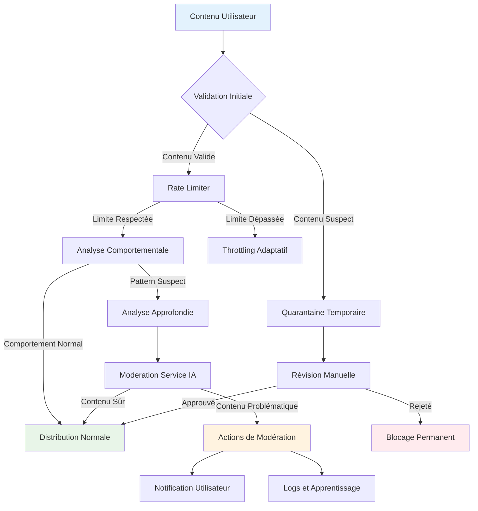
```mermaid
graph TD
    A[Contenu Utilisateur] --> B{Validation Initiale}
    
    B -->|Contenu Valide| C[Rate Limiter]
    B -->|Contenu Suspect| D[Quarantaine Temporaire]
    
    C -->|Limite Respectée| E[Analyse Comportementale]
    C -->|Limite Dépassée| F[Throttling Adaptatif]
    
    E -->|Comportement Normal| G[Distribution Normale]
    E -->|Pattern Suspect| H[Analyse Approfondie]
    
    H --> I[Moderation Service IA]
    I -->|Contenu Sûr| G
    I -->|Contenu Problématique| J[Actions de Modération]
    
    J --> K[Notification Utilisateur]
    J --> L[Logs et Apprentissage]
    
    D --> M[Révision Manuelle]
    M -->|Approuvé| G
    M -->|Rejeté| N[Blocage Permanent]
    
    style A fill:#e3f2fd
    style G fill:#e8f5e8
    style J fill:#fff3e0
    style N fill:#ffebee
```

### 1.4 Types de protections implémentées

| Niveau | Protection | Scope | Automatisation | Impact Utilisateur |
|--------|------------|-------|----------------|-------------------|
| **Réseau** | Rate limiting par IP | Globale | 100% | Minimal |
| **Utilisateur** | Quotas et seuils | Par compte | 95% | Faible |
| **Contenu** | Analyse par IA | Messages/médias | 90% | Modéré |
| **Comportement** | Pattern detection | Actions utilisateur | 85% | Faible |
| **Communauté** | Signalements | Contenu signalé | 60% | Variable |
| **Manuel** | Révision humaine | Cas complexes | 0% | Élevé |

### 1.5 Intégration avec l'écosystème Whispr

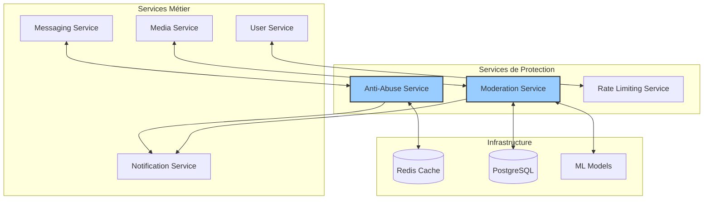
```mermaid
graph TB
    subgraph "Services de Protection"
        MS[Moderation Service]
        AAS[Anti-Abuse Service]
        RLS[Rate Limiting Service]
    end
    
    subgraph "Services Métier"
        MSG[Messaging Service]
        MED[Media Service]
        USR[User Service]
        NOT[Notification Service]
    end
    
    subgraph "Infrastructure"
        RDS[(Redis Cache)]
        PG[(PostgreSQL)]
        ML[ML Models]
    end
    
    MSG <--> AAS
    MED <--> MS
    USR <--> RLS
    
    AAS <--> RDS
    MS <--> ML
    MS <--> PG
    
    MS --> NOT
    AAS --> NOT
    
    style MS fill:#9cf,stroke:#333,stroke-width:2px
    style AAS fill:#9cf,stroke:#333,stroke-width:2px
```

### 1.6 Composants fonctionnels

Le système de modération comprend sept processus principaux :
1. **Rate limiting adaptatif**: Limitation intelligente du débit d'actions
2. **Détection de spam automatique**: Identification des contenus indésirables
3. **Analyse comportementale**: Détection des patterns d'usage anormaux
4. **Modération de contenu par IA**: Analyse automatique des médias et textes
5. **Système de signalement communautaire**: Processus de rapport d'abus
6. **Gestion des sanctions**: Application graduée des mesures correctives
7. **Processus d'appel**: Révision et contestation des décisions

## 2. Rate Limiting Adaptatif

### 2.1 Architecture de limitation de débit

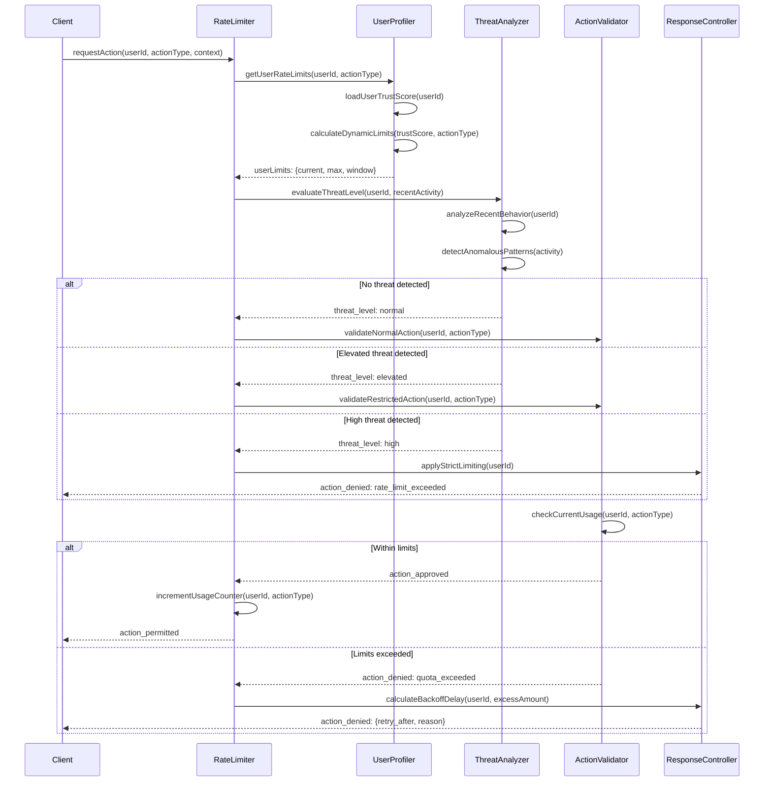
```mermaid
sequenceDiagram
    participant Client
    participant RateLimiter
    participant UserProfiler
    participant ThreatAnalyzer
    participant ActionValidator
    participant ResponseController
    
    Client->>RateLimiter: requestAction(userId, actionType, context)
    RateLimiter->>UserProfiler: getUserRateLimits(userId, actionType)
    
    UserProfiler->>UserProfiler: loadUserTrustScore(userId)
    UserProfiler->>UserProfiler: calculateDynamicLimits(trustScore, actionType)
    UserProfiler-->>RateLimiter: userLimits: {current, max, window}
    
    RateLimiter->>ThreatAnalyzer: evaluateThreatLevel(userId, recentActivity)
    ThreatAnalyzer->>ThreatAnalyzer: analyzeRecentBehavior(userId)
    ThreatAnalyzer->>ThreatAnalyzer: detectAnomalousPatterns(activity)
    
    alt No threat detected
        ThreatAnalyzer-->>RateLimiter: threat_level: normal
        RateLimiter->>ActionValidator: validateNormalAction(userId, actionType)
        
    else Elevated threat detected
        ThreatAnalyzer-->>RateLimiter: threat_level: elevated
        RateLimiter->>ActionValidator: validateRestrictedAction(userId, actionType)
        
    else High threat detected
        ThreatAnalyzer-->>RateLimiter: threat_level: high
        RateLimiter->>ResponseController: applyStrictLimiting(userId)
        ResponseController-->>Client: action_denied: rate_limit_exceeded
    end
    
    ActionValidator->>ActionValidator: checkCurrentUsage(userId, actionType)
    
    alt Within limits
        ActionValidator-->>RateLimiter: action_approved
        RateLimiter->>RateLimiter: incrementUsageCounter(userId, actionType)
        RateLimiter-->>Client: action_permitted
        
    else Limits exceeded
        ActionValidator-->>RateLimiter: action_denied: quota_exceeded
        RateLimiter->>ResponseController: calculateBackoffDelay(userId, excessAmount)
        ResponseController-->>Client: action_denied: {retry_after, reason}
    end
```

### 2.2 Limites dynamiques par type d'action

| Action | Utilisateur Normal | Utilisateur Vérifié | Utilisateur Suspect | Fenêtre Temporelle |
|--------|-------------------|---------------------|-------------------|-------------------|
| **Messages texte** | 1000/heure | 2000/heure | 100/heure | Glissante 1h |
| **Envoi médias** | 100/heure | 200/heure | 10/heure | Glissante 1h |
| **Création groupe** | 10/jour | 25/jour | 2/jour | Fixe 24h |
| **Ajout contacts** | 50/jour | 100/jour | 5/jour | Fixe 24h |
| **Signalements** | 20/jour | 50/jour | 5/jour | Fixe 24h |
| **Recherches** | 500/heure | 1000/heure | 100/heure | Glissante 1h |

### 2.3 Algorithme de rate limiting adaptatif

**Algorithme de calcul de limites dynamiques (pseudo-code):**

```
FUNCTION calculateDynamicRateLimit(userId, actionType, baseLimit):
    userProfile = getUserProfile(userId)
    
    // Facteur de confiance (0.1 à 2.0)
    trustFactor = calculateTrustFactor(userProfile)
    
    // Facteur d'activité récente (0.5 à 1.5)
    activityFactor = calculateActivityFactor(userId, timeWindow: 7_DAYS)
    
    // Facteur de signalements reçus (0.1 à 1.0)
    reputationFactor = calculateReputationFactor(userProfile.reports_received)
    
    // Facteur temporel (plus strict en heures de pointe)
    temporalFactor = calculateTemporalFactor(getCurrentTime())
    
    // Calcul de la limite adaptée
    adaptedLimit = baseLimit * trustFactor * activityFactor * reputationFactor * temporalFactor
    
    // Contraintes min/max
    finalLimit = clamp(adaptedLimit, baseLimit * 0.1, baseLimit * 3.0)
    
    RETURN Math.floor(finalLimit)
END FUNCTION

FUNCTION checkRateLimit(userId, actionType):
    currentLimit = calculateDynamicRateLimit(userId, actionType, getBaseLimit(actionType))
    currentUsage = getCurrentUsage(userId, actionType)
    
    IF currentUsage >= currentLimit:
        backoffTime = calculateExponentialBackoff(currentUsage - currentLimit)
        RETURN {allowed: false, retry_after: backoffTime, limit: currentLimit}
    ELSE:
        incrementUsage(userId, actionType)
        RETURN {allowed: true, remaining: currentLimit - currentUsage - 1}
    END IF
END FUNCTION
```

### 2.4 Rate limiting distribué

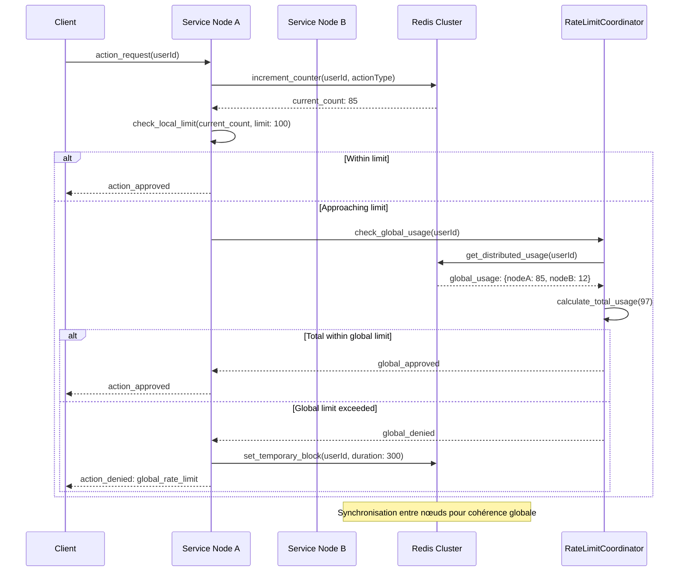
```mermaid
sequenceDiagram
    participant Client
    participant NodeA as Service Node A
    participant NodeB as Service Node B
    participant RedisCluster as Redis Cluster
    participant RateLimitCoordinator
    
    Client->>NodeA: action_request(userId)
    NodeA->>RedisCluster: increment_counter(userId, actionType)
    RedisCluster-->>NodeA: current_count: 85
    
    NodeA->>NodeA: check_local_limit(current_count, limit: 100)
    
    alt Within limit
        NodeA-->>Client: action_approved
        
    else Approaching limit
        NodeA->>RateLimitCoordinator: check_global_usage(userId)
        RateLimitCoordinator->>RedisCluster: get_distributed_usage(userId)
        RedisCluster-->>RateLimitCoordinator: global_usage: {nodeA: 85, nodeB: 12}
        
        RateLimitCoordinator->>RateLimitCoordinator: calculate_total_usage(97)
        
        alt Total within global limit
            RateLimitCoordinator-->>NodeA: global_approved
            NodeA-->>Client: action_approved
            
        else Global limit exceeded
            RateLimitCoordinator-->>NodeA: global_denied
            NodeA->>RedisCluster: set_temporary_block(userId, duration: 300)
            NodeA-->>Client: action_denied: global_rate_limit
        end
    end
    
    Note over RedisCluster: Synchronisation entre nœuds pour cohérence globale
```

## 3. Détection de Spam Automatique

### 3.1 Analyse multi-dimensionnelle du spam

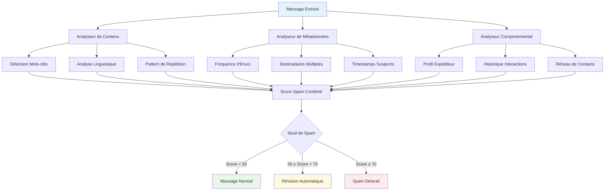
```mermaid
graph TD
    A[Message Entrant] --> B[Analyseur de Contenu]
    A --> C[Analyseur de Métadonnées]
    A --> D[Analyseur Comportemental]
    
    B --> E[Détection Mots-clés]
    B --> F[Analyse Linguistique]
    B --> G[Pattern de Répétition]
    
    C --> H[Fréquence d'Envoi]
    C --> I[Destinataires Multiples]
    C --> J[Timestamps Suspects]
    
    D --> K[Profil Expéditeur]
    D --> L[Historique Interactions]
    D --> M[Réseau de Contacts]
    
    E --> N[Score Spam Combiné]
    F --> N
    G --> N
    H --> N
    I --> N
    J --> N
    K --> N
    L --> N
    M --> N
    
    N --> O{Seuil de Spam}
    O -->|Score < 30| P[Message Normal]
    O -->|30 ≤ Score < 70| Q[Révision Automatique]
    O -->|Score ≥ 70| R[Spam Détecté]
    
    style A fill:#e3f2fd
    style P fill:#e8f5e8
    style Q fill:#fff8e1
    style R fill:#ffebee
```

### 3.2 Détection de patterns de spam

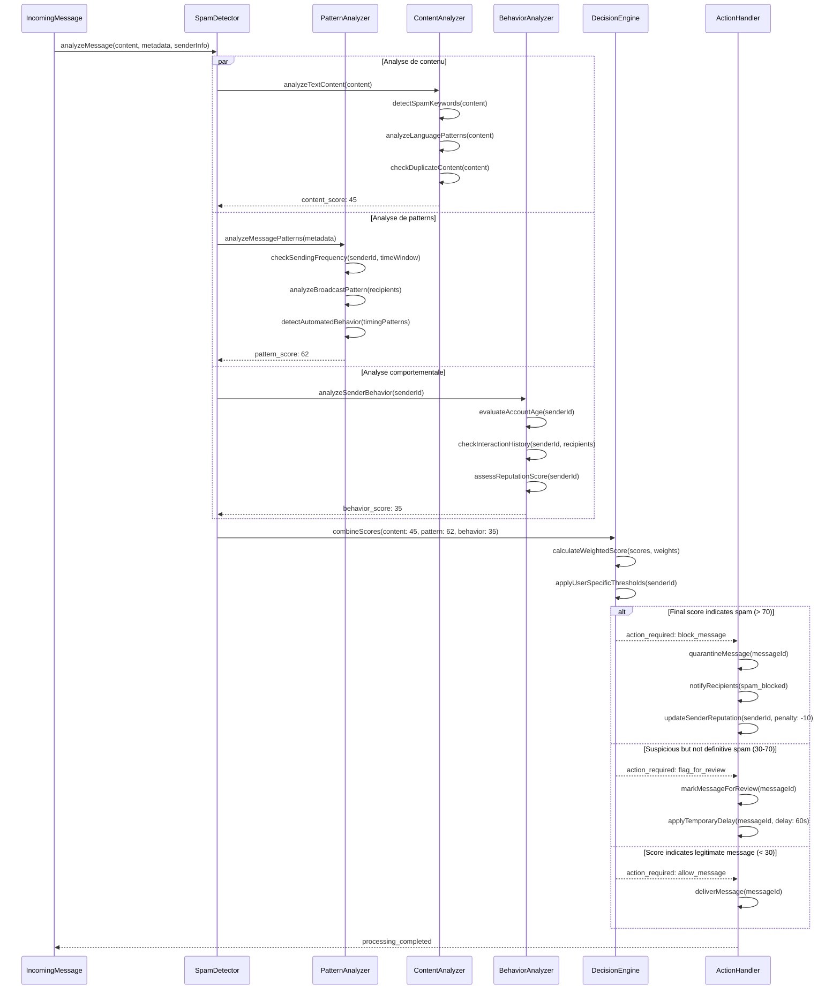
```mermaid
sequenceDiagram
    participant IncomingMessage
    participant SpamDetector
    participant PatternAnalyzer
    participant ContentAnalyzer
    participant BehaviorAnalyzer
    participant DecisionEngine
    participant ActionHandler
    
    IncomingMessage->>SpamDetector: analyzeMessage(content, metadata, senderInfo)
    
    par Analyse de contenu
        SpamDetector->>ContentAnalyzer: analyzeTextContent(content)
        ContentAnalyzer->>ContentAnalyzer: detectSpamKeywords(content)
        ContentAnalyzer->>ContentAnalyzer: analyzeLanguagePatterns(content)
        ContentAnalyzer->>ContentAnalyzer: checkDuplicateContent(content)
        ContentAnalyzer-->>SpamDetector: content_score: 45
        
    and Analyse de patterns
        SpamDetector->>PatternAnalyzer: analyzeMessagePatterns(metadata)
        PatternAnalyzer->>PatternAnalyzer: checkSendingFrequency(senderId, timeWindow)
        PatternAnalyzer->>PatternAnalyzer: analyzeBroadcastPattern(recipients)
        PatternAnalyzer->>PatternAnalyzer: detectAutomatedBehavior(timingPatterns)
        PatternAnalyzer-->>SpamDetector: pattern_score: 62
        
    and Analyse comportementale
        SpamDetector->>BehaviorAnalyzer: analyzeSenderBehavior(senderId)
        BehaviorAnalyzer->>BehaviorAnalyzer: evaluateAccountAge(senderId)
        BehaviorAnalyzer->>BehaviorAnalyzer: checkInteractionHistory(senderId, recipients)
        BehaviorAnalyzer->>BehaviorAnalyzer: assessReputationScore(senderId)
        BehaviorAnalyzer-->>SpamDetector: behavior_score: 35
    end
    
    SpamDetector->>DecisionEngine: combineScores(content: 45, pattern: 62, behavior: 35)
    DecisionEngine->>DecisionEngine: calculateWeightedScore(scores, weights)
    DecisionEngine->>DecisionEngine: applyUserSpecificThresholds(senderId)
    
    alt Final score indicates spam (> 70)
        DecisionEngine-->>ActionHandler: action_required: block_message
        ActionHandler->>ActionHandler: quarantineMessage(messageId)
        ActionHandler->>ActionHandler: notifyRecipients(spam_blocked)
        ActionHandler->>ActionHandler: updateSenderReputation(senderId, penalty: -10)
        
    else Suspicious but not definitive spam (30-70)
        DecisionEngine-->>ActionHandler: action_required: flag_for_review
        ActionHandler->>ActionHandler: markMessageForReview(messageId)
        ActionHandler->>ActionHandler: applyTemporaryDelay(messageId, delay: 60s)
        
    else Score indicates legitimate message (< 30)
        DecisionEngine-->>ActionHandler: action_required: allow_message
        ActionHandler->>ActionHandler: deliverMessage(messageId)
    end
    
    ActionHandler-->>IncomingMessage: processing_completed
```

### 3.3 Modèles d'apprentissage anti-spam

**Algorithme d'apprentissage continu (pseudo-code):**

```
FUNCTION updateSpamDetectionModel(feedbackData):
    // Collecter les nouvelles données d'entraînement
    newTrainingData = []
    
    FOR EACH feedback IN feedbackData:
        IF feedback.type == "false_positive":
            // Message légitime marqué comme spam
            newTrainingData.add({
                features: extractFeatures(feedback.message),
                label: "legitimate",
                weight: 2.0  // Poids plus fort pour corriger l'erreur
            })
        ELSIF feedback.type == "false_negative":
            // Spam non détecté
            newTrainingData.add({
                features: extractFeatures(feedback.message),
                label: "spam",
                weight: 1.5
            })
        END IF
    END FOR
    
    // Réentraîner le modèle avec les nouvelles données
    updatedModel = incrementallyTrainModel(currentModel, newTrainingData)
    
    // Valider les performances du modèle mis à jour
    validationResults = validateModel(updatedModel, validationSet)
    
    IF validationResults.accuracy > currentModel.accuracy:
        deployModel(updatedModel)
        logModelUpdate("Model updated with improved accuracy", validationResults)
    ELSE:
        logModelUpdate("Model update rejected - performance degradation", validationResults)
    END IF
END FUNCTION

FUNCTION extractSpamFeatures(message):
    features = {}
    
    // Caractéristiques du contenu
    features.word_count = countWords(message.content)
    features.caps_ratio = calculateCapsRatio(message.content)
    features.exclamation_count = countOccurrences(message.content, "!")
    features.url_count = countURLs(message.content)
    features.phone_number_count = countPhoneNumbers(message.content)
    
    // Caractéristiques temporelles
    features.send_hour = extractHour(message.timestamp)
    features.day_of_week = extractDayOfWeek(message.timestamp)
    
    // Caractéristiques de l'expéditeur
    features.sender_age_days = calculateAccountAge(message.senderId)
    features.sender_message_count = getTotalMessageCount(message.senderId)
    features.sender_report_ratio = getReportRatio(message.senderId)
    
    RETURN features
END FUNCTION
```

## 4. Analyse Comportementale

### 4.1 Détection de patterns anormaux

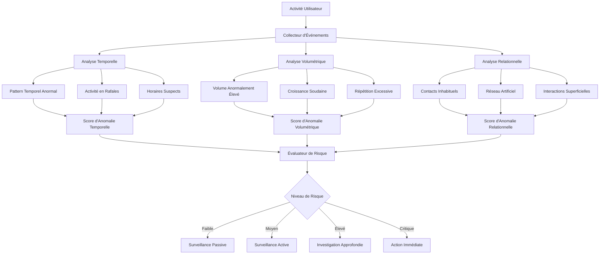
```mermaid
graph TD
    A[Activité Utilisateur] --> B[Collecteur d'Événements]
    
    B --> C[Analyse Temporelle]
    B --> D[Analyse Volumétrique]
    B --> E[Analyse Relationnelle]
    
    C --> F[Pattern Temporel Anormal]
    C --> G[Activité en Rafales]
    C --> H[Horaires Suspects]
    
    D --> I[Volume Anormalement Élevé]
    D --> J[Croissance Soudaine]
    D --> K[Répétition Excessive]
    
    E --> L[Contacts Inhabituels]
    E --> M[Réseau Artificiel]
    E --> N[Interactions Superficielles]
    
    F --> O[Score d'Anomalie Temporelle]
    G --> O
    H --> O
    I --> P[Score d'Anomalie Volumétrique]
    J --> P
    K --> P
    L --> Q[Score d'Anomalie Relationnelle]
    M --> Q
    N --> Q
    
    O --> R[Évaluateur de Risque]
    P --> R
    Q --> R
    
    R --> S{Niveau de Risque}
    S -->|Faible| T[Surveillance Passive]
    S -->|Moyen| U[Surveillance Active]
    S -->|Élevé| V[Investigation Approfondie]
    S -->|Critique| W[Action Immédiate]
```

### 4.2 Profiling comportemental des utilisateurs

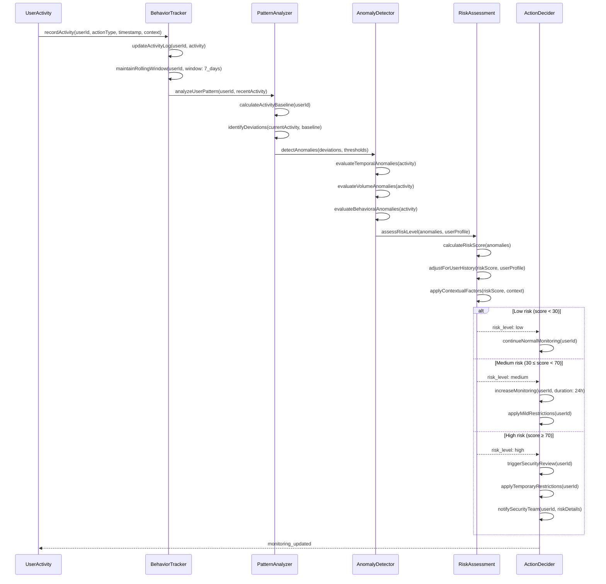
```mermaid
sequenceDiagram
    participant UserActivity
    participant BehaviorTracker
    participant PatternAnalyzer
    participant AnomalyDetector
    participant RiskAssessment
    participant ActionDecider
    
    UserActivity->>BehaviorTracker: recordActivity(userId, actionType, timestamp, context)
    BehaviorTracker->>BehaviorTracker: updateActivityLog(userId, activity)
    BehaviorTracker->>BehaviorTracker: maintainRollingWindow(userId, window: 7_days)
    
    BehaviorTracker->>PatternAnalyzer: analyzeUserPattern(userId, recentActivity)
    PatternAnalyzer->>PatternAnalyzer: calculateActivityBaseline(userId)
    PatternAnalyzer->>PatternAnalyzer: identifyDeviations(currentActivity, baseline)
    
    PatternAnalyzer->>AnomalyDetector: detectAnomalies(deviations, thresholds)
    AnomalyDetector->>AnomalyDetector: evaluateTemporalAnomalies(activity)
    AnomalyDetector->>AnomalyDetector: evaluateVolumeAnomalies(activity)
    AnomalyDetector->>AnomalyDetector: evaluateBehavioralAnomalies(activity)
    
    AnomalyDetector->>RiskAssessment: assessRiskLevel(anomalies, userProfile)
    RiskAssessment->>RiskAssessment: calculateRiskScore(anomalies)
    RiskAssessment->>RiskAssessment: adjustForUserHistory(riskScore, userProfile)
    RiskAssessment->>RiskAssessment: applyContextualFactors(riskScore, context)
    
    alt Low risk (score < 30)
        RiskAssessment-->>ActionDecider: risk_level: low
        ActionDecider->>ActionDecider: continueNormalMonitoring(userId)
        
    else Medium risk (30 ≤ score < 70)
        RiskAssessment-->>ActionDecider: risk_level: medium
        ActionDecider->>ActionDecider: increaseMonitoring(userId, duration: 24h)
        ActionDecider->>ActionDecider: applyMildRestrictions(userId)
        
    else High risk (score ≥ 70)
        RiskAssessment-->>ActionDecider: risk_level: high
        ActionDecider->>ActionDecider: triggerSecurityReview(userId)
        ActionDecider->>ActionDecider: applyTemporaryRestrictions(userId)
        ActionDecider->>ActionDecider: notifySecurityTeam(userId, riskDetails)
    end
    
    ActionDecider-->>UserActivity: monitoring_updated
```

### 4.3 Algorithmes de détection d'anomalies

**Algorithme de détection d'anomalies comportementales (pseudo-code):**

```
FUNCTION detectBehavioralAnomalies(userId, timeWindow):
    userActivity = getUserActivity(userId, timeWindow)
    historicalBaseline = calculateHistoricalBaseline(userId, pastDays: 30)
    
    anomalies = []
    
    // Détection d'anomalies temporelles
    temporalAnomaly = detectTemporalAnomalies(userActivity, historicalBaseline)
    IF temporalAnomaly.severity > TEMPORAL_THRESHOLD:
        anomalies.add(temporalAnomaly)
    END IF
    
    // Détection d'anomalies volumétriques
    volumeAnomaly = detectVolumeAnomalies(userActivity, historicalBaseline)
    IF volumeAnomaly.severity > VOLUME_THRESHOLD:
        anomalies.add(volumeAnomaly)
    END IF
    
    // Détection d'anomalies relationnelles
    relationalAnomaly = detectRelationalAnomalies(userActivity, historicalBaseline)
    IF relationalAnomaly.severity > RELATIONAL_THRESHOLD:
        anomalies.add(relationalAnomaly)
    END IF
    
    // Calcul du score global d'anomalie
    globalAnomalyScore = calculateGlobalAnomalyScore(anomalies)
    
    RETURN {
        anomalies: anomalies,
        globalScore: globalAnomalyScore,
        riskLevel: categorizeRiskLevel(globalAnomalyScore)
    }
END FUNCTION

FUNCTION detectTemporalAnomalies(currentActivity, baseline):
    // Analyser les patterns temporels
    currentTiming = extractTimingPatterns(currentActivity)
    baselineTiming = baseline.timingPatterns
    
    deviations = []
    
    // Vérifier les heures d'activité inhabituelles
    IF currentTiming.activeHours SIGNIFICANTLY_DIFFERENT baselineTiming.activeHours:
        deviations.add("unusual_active_hours")
    END IF
    
    // Vérifier les rafales d'activité
    burstIntensity = calculateBurstIntensity(currentActivity)
    IF burstIntensity > baseline.maxBurstIntensity * 2:
        deviations.add("activity_burst")
    END IF
    
    // Vérifier la régularité anormale (activité trop régulière = bot)
    regularity = calculateRegularityScore(currentActivity)
    IF regularity > EXCESSIVE_REGULARITY_THRESHOLD:
        deviations.add("excessive_regularity")
    END IF
    
    severity = calculateDeviationSeverity(deviations)
    
    RETURN {type: "temporal", deviations: deviations, severity: severity}
END FUNCTION
```

## 5. Modération de Contenu par IA

### 5.1 Intégration avec le moderation-service

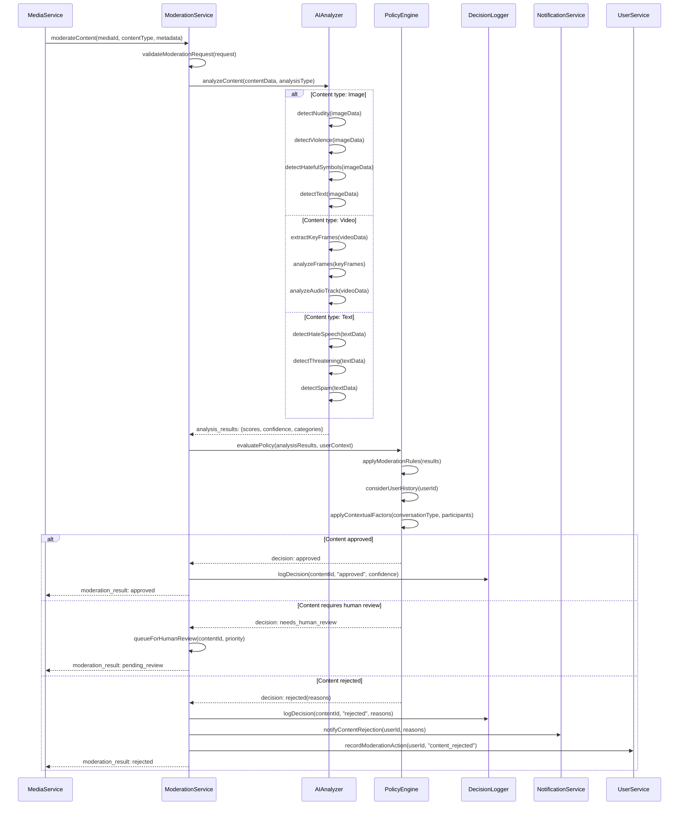
```mermaid
sequenceDiagram
    participant MediaService
    participant ModerationService
    participant AIAnalyzer
    participant PolicyEngine
    participant DecisionLogger
    participant NotificationService
    participant UserService
    
    MediaService->>ModerationService: moderateContent(mediaId, contentType, metadata)
    ModerationService->>ModerationService: validateModerationRequest(request)
    
    ModerationService->>AIAnalyzer: analyzeContent(contentData, analysisType)
    
    alt Content type: Image
        AIAnalyzer->>AIAnalyzer: detectNudity(imageData)
        AIAnalyzer->>AIAnalyzer: detectViolence(imageData)
        AIAnalyzer->>AIAnalyzer: detectHatefulSymbols(imageData)
        AIAnalyzer->>AIAnalyzer: detectText(imageData)
        
    else Content type: Video
        AIAnalyzer->>AIAnalyzer: extractKeyFrames(videoData)
        AIAnalyzer->>AIAnalyzer: analyzeFrames(keyFrames)
        AIAnalyzer->>AIAnalyzer: analyzeAudioTrack(videoData)
        
    else Content type: Text
        AIAnalyzer->>AIAnalyzer: detectHateSpeech(textData)
        AIAnalyzer->>AIAnalyzer: detectThreatening(textData)
        AIAnalyzer->>AIAnalyzer: detectSpam(textData)
    end
    
    AIAnalyzer-->>ModerationService: analysis_results: {scores, confidence, categories}
    
    ModerationService->>PolicyEngine: evaluatePolicy(analysisResults, userContext)
    PolicyEngine->>PolicyEngine: applyModerationRules(results)
    PolicyEngine->>PolicyEngine: considerUserHistory(userId)
    PolicyEngine->>PolicyEngine: applyContextualFactors(conversationType, participants)
    
    alt Content approved
        PolicyEngine-->>ModerationService: decision: approved
        ModerationService->>DecisionLogger: logDecision(contentId, "approved", confidence)
        ModerationService-->>MediaService: moderation_result: approved
        
    else Content requires human review
        PolicyEngine-->>ModerationService: decision: needs_human_review
        ModerationService->>ModerationService: queueForHumanReview(contentId, priority)
        ModerationService-->>MediaService: moderation_result: pending_review
        
    else Content rejected
        PolicyEngine-->>ModerationService: decision: rejected(reasons)
        ModerationService->>DecisionLogger: logDecision(contentId, "rejected", reasons)
        ModerationService->>NotificationService: notifyContentRejection(userId, reasons)
        ModerationService->>UserService: recordModerationAction(userId, "content_rejected")
        ModerationService-->>MediaService: moderation_result: rejected
    end
```

### 5.2 Arbres de décision pour la modération

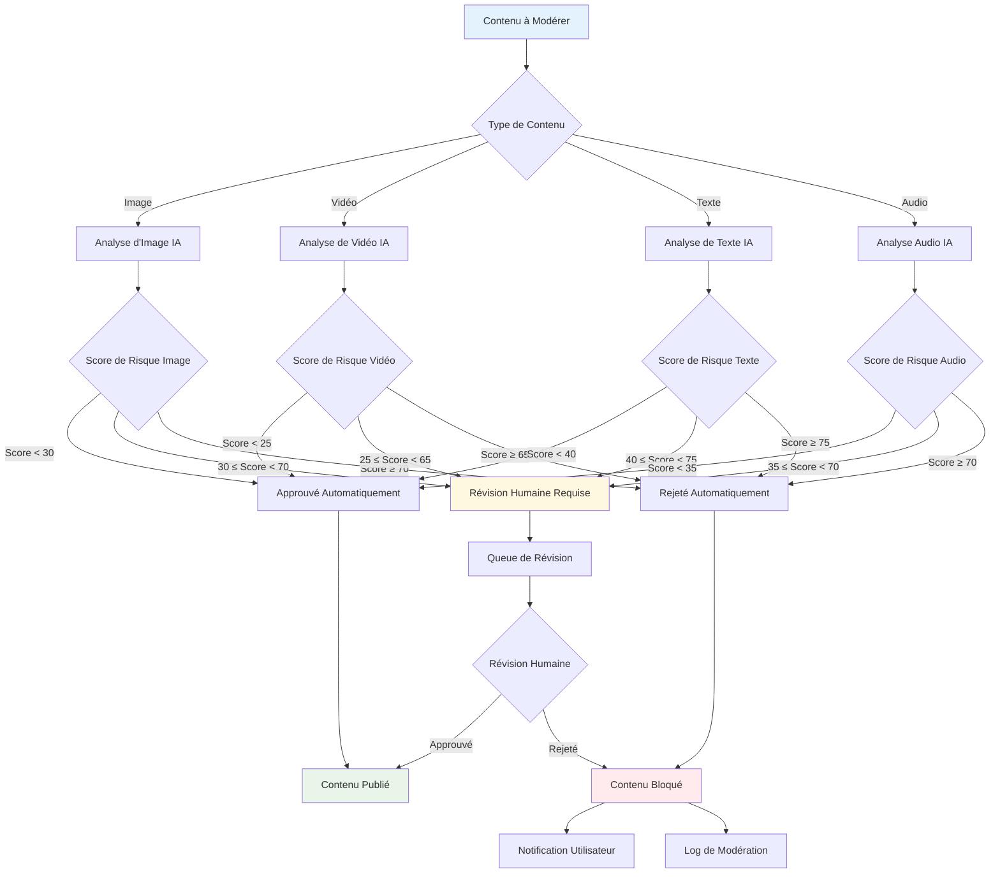
```mermaid
graph TD
    A[Contenu à Modérer] --> B{Type de Contenu}
    
    B -->|Image| C[Analyse d'Image IA]
    B -->|Vidéo| D[Analyse de Vidéo IA]
    B -->|Texte| E[Analyse de Texte IA]
    B -->|Audio| F[Analyse Audio IA]
    
    C --> G{Score de Risque Image}
    D --> H{Score de Risque Vidéo}
    E --> I{Score de Risque Texte}
    F --> J{Score de Risque Audio}
    
    G -->|Score < 30| K[Approuvé Automatiquement]
    G -->|30 ≤ Score < 70| L[Révision Humaine Requise]
    G -->|Score ≥ 70| M[Rejeté Automatiquement]
    
    H -->|Score < 25| K
    H -->|25 ≤ Score < 65| L
    H -->|Score ≥ 65| M
    
    I -->|Score < 40| K
    I -->|40 ≤ Score < 75| L
    I -->|Score ≥ 75| M
    
    J -->|Score < 35| K
    J -->|35 ≤ Score < 70| L
    J -->|Score ≥ 70| M
    
    K --> N[Contenu Publié]
    L --> O[Queue de Révision]
    M --> P[Contenu Bloqué]
    
    O --> Q{Révision Humaine}
    Q -->|Approuvé| N
    Q -->|Rejeté| P
    
    P --> R[Notification Utilisateur]
    P --> S[Log de Modération]
    
    style A fill:#e3f2fd
    style N fill:#e8f5e8
    style P fill:#ffebee
    style L fill:#fff8e1
```

### 5.3 Feedback et amélioration continue

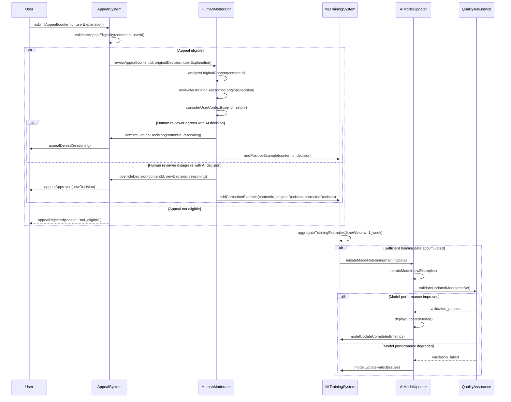
```mermaid
sequenceDiagram
    participant User
    participant AppealSystem
    participant HumanModerator
    participant MLTrainingSystem
    participant AIModelUpdater
    participant QualityAssurance
    
    User->>AppealSystem: submitAppeal(contentId, userExplanation)
    AppealSystem->>AppealSystem: validateAppealEligibility(contentId, userId)
    
    alt Appeal eligible
        AppealSystem->>HumanModerator: reviewAppeal(contentId, originalDecision, userExplanation)
        HumanModerator->>HumanModerator: analyzeOriginalContent(contentId)
        HumanModerator->>HumanModerator: reviewAIDecisionReasoning(originalDecision)
        HumanModerator->>HumanModerator: considerUserContext(userId, history)
        
        alt Human reviewer agrees with AI decision
            HumanModerator->>AppealSystem: confirmOriginalDecision(contentId, reasoning)
            AppealSystem->>User: appealDenied(reasoning)
            HumanModerator->>MLTrainingSystem: addPositiveExample(contentId, decision)
            
        else Human reviewer disagrees with AI decision
            HumanModerator->>AppealSystem: overrideDecision(contentId, newDecision, reasoning)
            AppealSystem->>User: appealApproved(newDecision)
            HumanModerator->>MLTrainingSystem: addCorrectionExample(contentId, originalDecision, correctedDecision)
        end
        
    else Appeal not eligible
        AppealSystem-->>User: appealRejected(reason: "not_eligible")
    end
    
    MLTrainingSystem->>MLTrainingSystem: aggregateTrainingExamples(timeWindow: 1_week)
    
    alt Sufficient training data accumulated
        MLTrainingSystem->>AIModelUpdater: initiateModelRetraining(trainingData)
        AIModelUpdater->>AIModelUpdater: retrainModel(newExamples)
        AIModelUpdater->>QualityAssurance: validateUpdatedModel(testSet)
        
        alt Model performance improved
            QualityAssurance-->>AIModelUpdater: validation_passed
            AIModelUpdater->>AIModelUpdater: deployUpdatedModel()
            AIModelUpdater->>MLTrainingSystem: modelUpdateCompleted(metrics)
            
        else Model performance degraded
            QualityAssurance-->>AIModelUpdater: validation_failed
            AIModelUpdater->>MLTrainingSystem: modelUpdateFailed(issues)
        end
    end
```

## 6. Système de Signalement Communautaire

### 6.1 Processus de signalement utilisateur

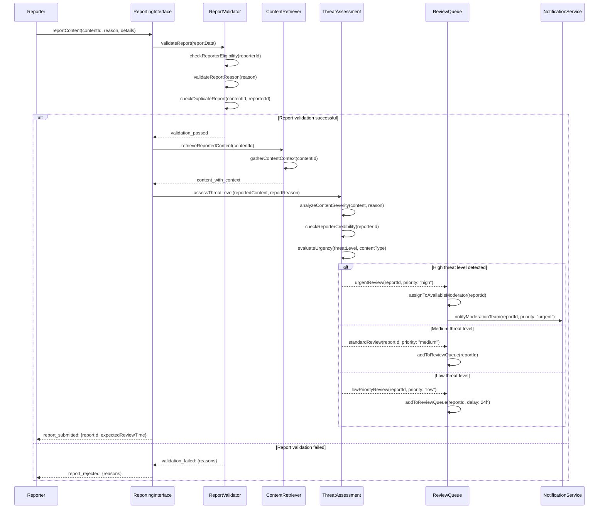
```mermaid
sequenceDiagram
    participant Reporter
    participant ReportingInterface
    participant ReportValidator
    participant ContentRetriever
    participant ThreatAssessment
    participant ReviewQueue
    participant NotificationService
    
    Reporter->>ReportingInterface: reportContent(contentId, reason, details)
    ReportingInterface->>ReportValidator: validateReport(reportData)
    
    ReportValidator->>ReportValidator: checkReporterEligibility(reporterId)
    ReportValidator->>ReportValidator: validateReportReason(reason)
    ReportValidator->>ReportValidator: checkDuplicateReport(contentId, reporterId)
    
    alt Report validation successful
        ReportValidator-->>ReportingInterface: validation_passed
        
        ReportingInterface->>ContentRetriever: retrieveReportedContent(contentId)
        ContentRetriever->>ContentRetriever: gatherContentContext(contentId)
        ContentRetriever-->>ReportingInterface: content_with_context
        
        ReportingInterface->>ThreatAssessment: assessThreatLevel(reportedContent, reportReason)
        ThreatAssessment->>ThreatAssessment: analyzeContentSeverity(content, reason)
        ThreatAssessment->>ThreatAssessment: checkReporterCredibility(reporterId)
        ThreatAssessment->>ThreatAssessment: evaluateUrgency(threatLevel, contentType)
        
        alt High threat level detected
            ThreatAssessment-->>ReviewQueue: urgentReview(reportId, priority: "high")
            ReviewQueue->>ReviewQueue: assignToAvailableModerator(reportId)
            ReviewQueue->>NotificationService: notifyModerationTeam(reportId, priority: "urgent")
            
        else Medium threat level
            ThreatAssessment-->>ReviewQueue: standardReview(reportId, priority: "medium")
            ReviewQueue->>ReviewQueue: addToReviewQueue(reportId)
            
        else Low threat level
            ThreatAssessment-->>ReviewQueue: lowPriorityReview(reportId, priority: "low")
            ReviewQueue->>ReviewQueue: addToReviewQueue(reportId, delay: 24h)
        end
        
        ReportingInterface-->>Reporter: report_submitted: {reportId, expectedReviewTime}
        
    else Report validation failed
        ReportValidator-->>ReportingInterface: validation_failed: {reasons}
        ReportingInterface-->>Reporter: report_rejected: {reasons}
    end
```

### 6.2 Categories de signalement et priorités

| Catégorie | Exemples | Priorité | Délai de Traitement | Action Automatique |
|-----------|----------|----------|-------------------|-------------------|
| **Harcèlement** | Messages menaçants, intimidation | Élevée | 2-6 heures | Restriction temporaire |
| **Contenu Violent** | Images/vidéos violentes | Très élevée | 1-3 heures | Blocage immédiat |
| **Spam Commercial** | Publicités non sollicitées | Moyenne | 12-24 heures | Rate limiting |
| **Désinformation** | Fausses informations | Moyenne | 6-12 heures | Étiquetage |
| **Contenu Adulte** | Nudité, contenu sexuel | Élevée | 3-8 heures | Masquage automatique |
| **Propriété Intellectuelle** | Violation de copyright | Faible | 24-48 heures | Signalement propriétaire |
| **Contenu Illégal** | Activités criminelles | Critique | Immédiat | Blocage + autorités |

### 6.3 Algorithme d'agrégation des signalements

**Algorithme d'évaluation collective des signalements (pseudo-code):**

```
FUNCTION evaluateAggregatedReports(contentId):
    reports = getAllReportsForContent(contentId)
    
    IF reports.isEmpty():
        RETURN {action: "none", confidence: 0.0}
    END IF
    
    // Calculer le score de crédibilité agrégé
    totalCredibilityScore = 0.0
    totalWeight = 0.0
    
    FOR EACH report IN reports:
        reporterCredibility = getReporterCredibility(report.reporterId)
        reasonWeight = getReasonWeight(report.reason)
        
        totalCredibilityScore += reporterCredibility * reasonWeight
        totalWeight += reasonWeight
    END FOR
    
    aggregatedScore = totalCredibilityScore / totalWeight
    
    // Facteurs d'amplification
    diversityFactor = calculateReporterDiversity(reports)  // Plus de diversité = plus crédible
    timingFactor = calculateTimingPattern(reports)         // Reports rapprochés = plus suspect
    reasonConsistency = calculateReasonConsistency(reports) // Raisons cohérentes = plus crédible
    
    finalScore = aggregatedScore * diversityFactor * timingFactor * reasonConsistency
    
    // Déterminer l'action selon le score final
    IF finalScore >= CRITICAL_THRESHOLD:
        RETURN {action: "immediate_block", confidence: finalScore}
    ELSIF finalScore >= HIGH_THRESHOLD:
        RETURN {action: "urgent_review", confidence: finalScore}
    ELSIF finalScore >= MEDIUM_THRESHOLD:
        RETURN {action: "standard_review", confidence: finalScore}
    ELSE:
        RETURN {action: "low_priority_review", confidence: finalScore}
    END IF
END FUNCTION

FUNCTION getReporterCredibility(reporterId):
    reporterHistory = getReportingHistory(reporterId)
    
    // Facteurs positifs
    accurateReportsRatio = reporterHistory.accurate_reports / reporterHistory.total_reports
    accountAge = calculateAccountAge(reporterId)
    communityStanding = getCommunityStanding(reporterId)
    
    // Facteurs négatifs
    falseReportsRatio = reporterHistory.false_reports / reporterHistory.total_reports
    spamReportsRatio = reporterHistory.spam_reports / reporterHistory.total_reports
    
    baseCredibility = accurateReportsRatio * 0.4 + 
                     (accountAge / 365) * 0.3 +
                     communityStanding * 0.3
                     
    penalties = falseReportsRatio * 0.5 + spamReportsRatio * 0.3
    
    finalCredibility = max(0.1, baseCredibility - penalties)
    
    RETURN clamp(finalCredibility, 0.1, 1.0)
END FUNCTION
```

## 7. Gestion des Sanctions

### 7.1 Escalade progressive des mesures

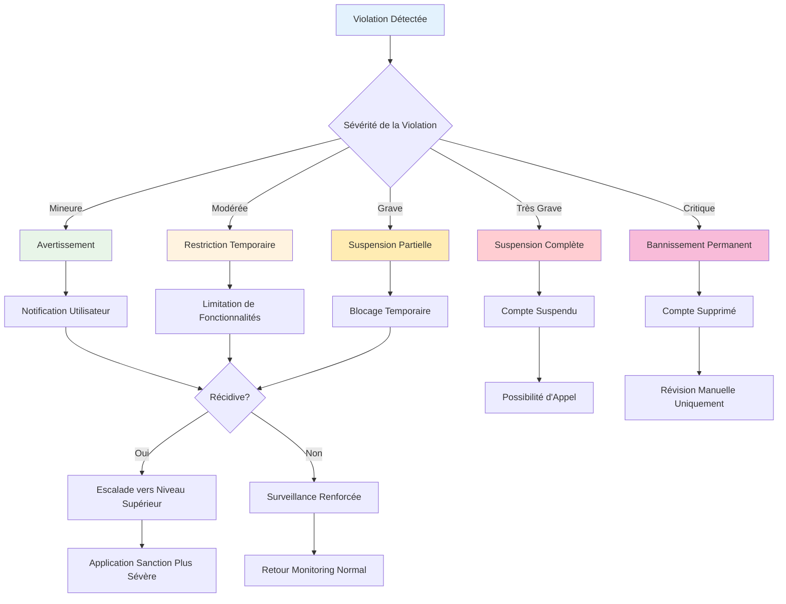
```mermaid
graph TD
    A[Violation Détectée] --> B{Sévérité de la Violation}
    
    B -->|Mineure| C[Avertissement]
    B -->|Modérée| D[Restriction Temporaire]
    B -->|Grave| E[Suspension Partielle]
    B -->|Très Grave| F[Suspension Complète]
    B -->|Critique| G[Bannissement Permanent]
    
    C --> H[Notification Utilisateur]
    D --> I[Limitation de Fonctionnalités]
    E --> J[Blocage Temporaire]
    F --> K[Compte Suspendu]
    G --> L[Compte Supprimé]
    
    H --> M{Récidive?}
    I --> M
    J --> M
    
    M -->|Oui| N[Escalade vers Niveau Supérieur]
    M -->|Non| O[Surveillance Renforcée]
    
    N --> P[Application Sanction Plus Sévère]
    O --> Q[Retour Monitoring Normal]
    
    K --> R[Possibilité d'Appel]
    L --> S[Révision Manuelle Uniquement]
    
    style A fill:#e3f2fd
    style C fill:#e8f5e8
    style D fill:#fff3e0
    style E fill:#ffecb3
    style F fill:#ffcdd2
    style G fill:#f8bbd9
```

### 7.2 Système de sanctions graduées

| Niveau | Sanction | Durée | Déclencheurs | Restrictions |
|--------|----------|-------|--------------|--------------|
| **1 - Avertissement** | Notification | - | Premier incident mineur | Aucune |
| **2 - Limitation** | Rate limiting renforcé | 24h | Spam léger, 2ème incident | Messages/heure réduits |
| **3 - Restriction** | Fonctionnalités limitées | 7j | Contenu inapproprié | Pas de groupes, médias limités |
| **4 - Suspension** | Compte temporairement bloqué | 30j | Harcèlement, récidive | Aucun accès |
| **5 - Bannissement** | Compte définitivement supprimé | Permanent | Contenu illégal, violations répétées | Suppression complète |

### 7.3 Application et suivi des sanctions

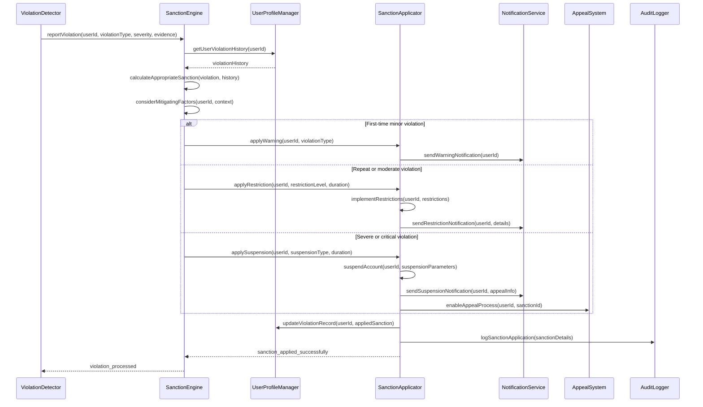
```mermaid
sequenceDiagram
    participant ViolationDetector
    participant SanctionEngine
    participant UserProfileManager
    participant SanctionApplicator
    participant NotificationService
    participant AppealSystem
    participant AuditLogger
    
    ViolationDetector->>SanctionEngine: reportViolation(userId, violationType, severity, evidence)
    SanctionEngine->>UserProfileManager: getUserViolationHistory(userId)
    UserProfileManager-->>SanctionEngine: violationHistory
    
    SanctionEngine->>SanctionEngine: calculateAppropriateSanction(violation, history)
    SanctionEngine->>SanctionEngine: considerMitigatingFactors(userId, context)
    
    alt First-time minor violation
        SanctionEngine->>SanctionApplicator: applyWarning(userId, violationType)
        SanctionApplicator->>NotificationService: sendWarningNotification(userId)
        
    else Repeat or moderate violation
        SanctionEngine->>SanctionApplicator: applyRestriction(userId, restrictionLevel, duration)
        SanctionApplicator->>SanctionApplicator: implementRestrictions(userId, restrictions)
        SanctionApplicator->>NotificationService: sendRestrictionNotification(userId, details)
        
    else Severe or critical violation
        SanctionEngine->>SanctionApplicator: applySuspension(userId, suspensionType, duration)
        SanctionApplicator->>SanctionApplicator: suspendAccount(userId, suspensionParameters)
        SanctionApplicator->>NotificationService: sendSuspensionNotification(userId, appealInfo)
        SanctionApplicator->>AppealSystem: enableAppealProcess(userId, sanctionId)
    end
    
    SanctionApplicator->>UserProfileManager: updateViolationRecord(userId, appliedSanction)
    SanctionApplicator->>AuditLogger: logSanctionApplication(sanctionDetails)
    
    SanctionApplicator-->>SanctionEngine: sanction_applied_successfully
    SanctionEngine-->>ViolationDetector: violation_processed
```

### 7.4 Algorithme de calcul de sanctions

**Algorithme de détermination des sanctions (pseudo-code):**

```
FUNCTION determineSanction(userId, currentViolation, violationHistory):
    // Calculer le score de sévérité de base
    baseSeverity = getViolationSeverity(currentViolation.type)
    
    // Facteurs d'aggravation
    recidiveFactor = calculateRecidiveFactor(violationHistory)
    patternFactor = detectViolationPattern(violationHistory)
    impactFactor = assessViolationImpact(currentViolation)
    
    // Facteurs d'atténuation
    accountAgeFactor = calculateAccountAgeFactor(userId)
    contritionFactor = assessUserContrition(userId, currentViolation)
    communityContributionFactor = assessCommunityContribution(userId)
    
    // Score final
    aggravationScore = baseSeverity * recidiveFactor * patternFactor * impactFactor
    mitigationScore = accountAgeFactor * contritionFactor * communityContributionFactor
    
    finalSeverityScore = aggravationScore / mitigationScore
    
    // Déterminer le niveau de sanction
    IF finalSeverityScore <= WARNING_THRESHOLD:
        RETURN createWarning(userId, currentViolation)
    ELSIF finalSeverityScore <= RESTRICTION_THRESHOLD:
        restrictionLevel = calculateRestrictionLevel(finalSeverityScore)
        duration = calculateRestrictionDuration(finalSeverityScore, violationHistory)
        RETURN createRestriction(userId, restrictionLevel, duration)
    ELSIF finalSeverityScore <= SUSPENSION_THRESHOLD:
        suspensionDuration = calculateSuspensionDuration(finalSeverityScore)
        RETURN createSuspension(userId, suspensionDuration)
    ELSE:
        RETURN createBanishment(userId, currentViolation)
    END IF
END FUNCTION

FUNCTION calculateRecidiveFactor(violationHistory):
    recentViolations = getViolationsInLastNDays(violationHistory, 90)
    
    IF recentViolations.isEmpty():
        RETURN 1.0  // Pas de récidive
    END IF
    
    // Plus de violations récentes = facteur plus élevé
    recidiveFactor = 1.0 + (recentViolations.size() * 0.3)
    
    // Bonus de gravité si violations similaires
    similarViolations = countSimilarViolations(recentViolations)
    IF similarViolations > 1:
        recidiveFactor *= (1.0 + similarViolations * 0.2)
    END IF
    
    RETURN min(recidiveFactor, 3.0)  // Plafonner à 3x
END FUNCTION
```

## 8. Processus d'Appel et Révision

### 8.1 Système d'appel des décisions

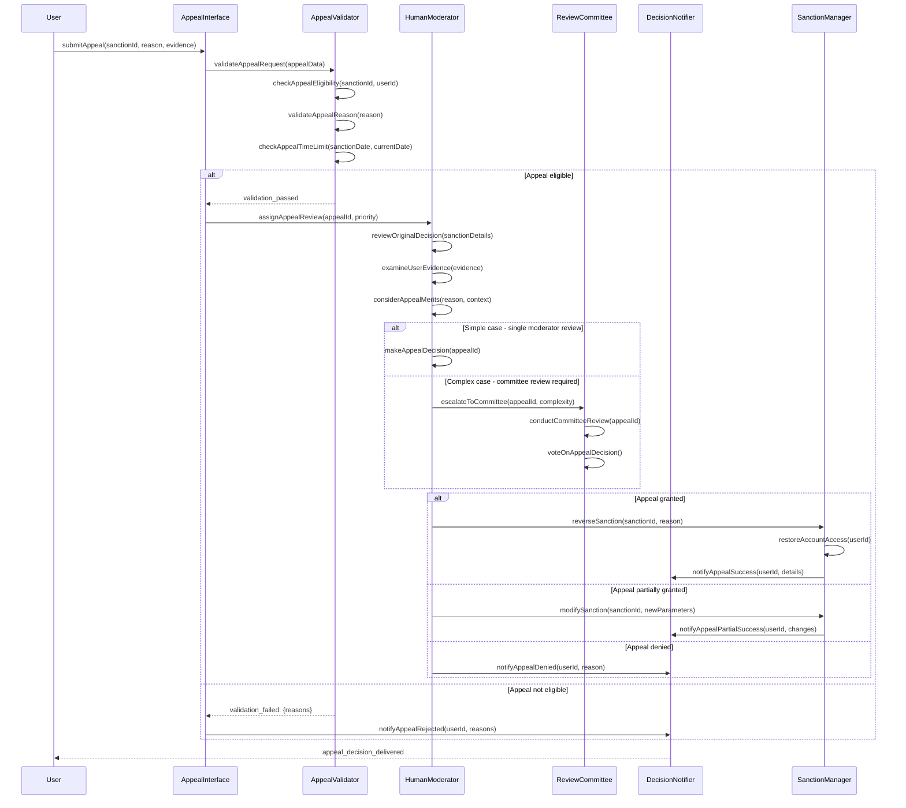
```mermaid
sequenceDiagram
    participant User
    participant AppealInterface
    participant AppealValidator
    participant HumanModerator
    participant ReviewCommittee
    participant DecisionNotifier
    participant SanctionManager
    
    User->>AppealInterface: submitAppeal(sanctionId, reason, evidence)
    AppealInterface->>AppealValidator: validateAppealRequest(appealData)
    
    AppealValidator->>AppealValidator: checkAppealEligibility(sanctionId, userId)
    AppealValidator->>AppealValidator: validateAppealReason(reason)
    AppealValidator->>AppealValidator: checkAppealTimeLimit(sanctionDate, currentDate)
    
    alt Appeal eligible
        AppealValidator-->>AppealInterface: validation_passed
        
        AppealInterface->>HumanModerator: assignAppealReview(appealId, priority)
        HumanModerator->>HumanModerator: reviewOriginalDecision(sanctionDetails)
        HumanModerator->>HumanModerator: examineUserEvidence(evidence)
        HumanModerator->>HumanModerator: considerAppealMerits(reason, context)
        
        alt Simple case - single moderator review
            HumanModerator->>HumanModerator: makeAppealDecision(appealId)
            
        else Complex case - committee review required
            HumanModerator->>ReviewCommittee: escalateToCommittee(appealId, complexity)
            ReviewCommittee->>ReviewCommittee: conductCommitteeReview(appealId)
            ReviewCommittee->>ReviewCommittee: voteOnAppealDecision()
        end
        
        alt Appeal granted
            HumanModerator->>SanctionManager: reverseSanction(sanctionId, reason)
            SanctionManager->>SanctionManager: restoreAccountAccess(userId)
            SanctionManager->>DecisionNotifier: notifyAppealSuccess(userId, details)
            
        else Appeal partially granted
            HumanModerator->>SanctionManager: modifySanction(sanctionId, newParameters)
            SanctionManager->>DecisionNotifier: notifyAppealPartialSuccess(userId, changes)
            
        else Appeal denied
            HumanModerator->>DecisionNotifier: notifyAppealDenied(userId, reason)
        end
        
    else Appeal not eligible
        AppealValidator-->>AppealInterface: validation_failed: {reasons}
        AppealInterface->>DecisionNotifier: notifyAppealRejected(userId, reasons)
    end
    
    DecisionNotifier-->>User: appeal_decision_delivered
```

### 8.2 Critères d'éligibilité et délais d'appel

| Type de Sanction | Délai d'Appel | Révision Par | Critères d'Éligibilité |
|------------------|---------------|--------------|------------------------|
| **Avertissement** | 7 jours | Modérateur senior | Tous les cas |
| **Restriction** | 14 jours | Modérateur senior | Tous les cas |
| **Suspension < 30j** | 30 jours | Comité de révision | Tous les cas |
| **Suspension > 30j** | 60 jours | Comité de révision | Nouveaux éléments requis |
| **Bannissement** | 90 jours | Comité d'appel spécialisé | Circonstances exceptionnelles |

### 8.3 Processus de révision indépendante

**Algorithme de révision d'appel (pseudo-code):**

```
FUNCTION reviewAppeal(appealId):
    appeal = getAppealDetails(appealId)
    originalSanction = getSanctionDetails(appeal.sanctionId)
    
    // Critères de révision
    reviewCriteria = {
        procedural_correctness: checkProceduralCorrectness(originalSanction),
        evidence_quality: assessEvidenceQuality(originalSanction.evidence),
        proportionality: assessSanctionProportionality(originalSanction),
        new_evidence: evaluateNewEvidence(appeal.userEvidence),
        contextual_factors: considerContextualFactors(appeal.context)
    }
    
    // Scores de révision
    proceduralScore = reviewCriteria.procedural_correctness ? 1.0 : 0.0
    evidenceScore = reviewCriteria.evidence_quality  // 0.0 à 1.0
    proportionalityScore = reviewCriteria.proportionality  // 0.0 à 1.0
    newEvidenceScore = reviewCriteria.new_evidence  // 0.0 à 1.0
    contextScore = reviewCriteria.contextual_factors  // 0.0 à 1.0
    
    // Calcul du score d'appel
    appealStrength = (proceduralScore * 0.3 +
                     evidenceScore * 0.25 +
                     proportionalityScore * 0.25 +
                     newEvidenceScore * 0.15 +
                     contextScore * 0.05)
    
    // Décision d'appel
    IF appealStrength >= FULL_REVERSAL_THRESHOLD:
        RETURN {decision: "granted", action: "full_reversal", score: appealStrength}
    ELSIF appealStrength >= PARTIAL_REVERSAL_THRESHOLD:
        reductionFactor = calculateReductionFactor(appealStrength)
        RETURN {decision: "partially_granted", action: "sanction_reduction", factor: reductionFactor}
    ELSE:
        RETURN {decision: "denied", reason: identifyWeakestCriteria(reviewCriteria)}
    END IF
END FUNCTION

FUNCTION assessSanctionProportionality(sanction):
    // Comparer avec des sanctions similaires
    similarCases = findSimilarViolationCases(sanction.violationType, sanction.context)
    
    IF similarCases.isEmpty():
        RETURN 0.5  // Score neutral si pas de référence
    END IF
    
    averageSanctionSeverity = calculateAverageSeverity(similarCases)
    currentSanctionSeverity = getSanctionSeverity(sanction)
    
    proportionalityRatio = averageSanctionSeverity / currentSanctionSeverity
    
    // Score de proportionnalité (1.0 = parfaitement proportionné)
    IF proportionalityRatio BETWEEN 0.8 AND 1.2:
        RETURN 1.0
    ELSIF proportionalityRatio BETWEEN 0.6 AND 1.4:
        RETURN 0.7
    ELSIF proportionalityRatio BETWEEN 0.4 AND 1.6:
        RETURN 0.4
    ELSE:
        RETURN 0.1  // Sanction très disproportionnée
    END IF
END FUNCTION
```

## 9. Intégration avec les autres services

### 9.1 Interface avec User Service

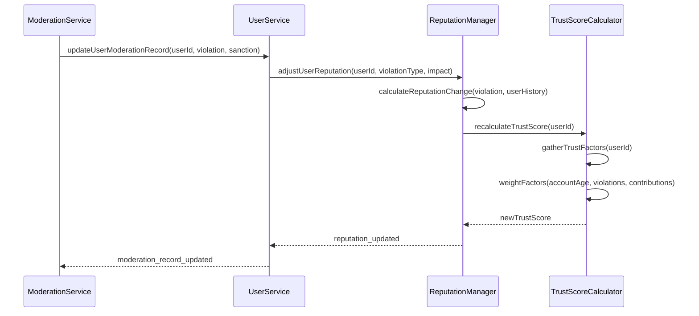
```mermaid
sequenceDiagram
    participant ModerationService
    participant UserService
    participant ReputationManager
    participant TrustScoreCalculator
    
    ModerationService->>UserService: updateUserModerationRecord(userId, violation, sanction)
    UserService->>ReputationManager: adjustUserReputation(userId, violationType, impact)
    
    ReputationManager->>ReputationManager: calculateReputationChange(violation, userHistory)
    ReputationManager->>TrustScoreCalculator: recalculateTrustScore(userId)
    
    TrustScoreCalculator->>TrustScoreCalculator: gatherTrustFactors(userId)
    TrustScoreCalculator->>TrustScoreCalculator: weightFactors(accountAge, violations, contributions)
    TrustScoreCalculator-->>ReputationManager: newTrustScore
    
    ReputationManager-->>UserService: reputation_updated
    UserService-->>ModerationService: moderation_record_updated
```

### 9.2 Interface avec Notification Service

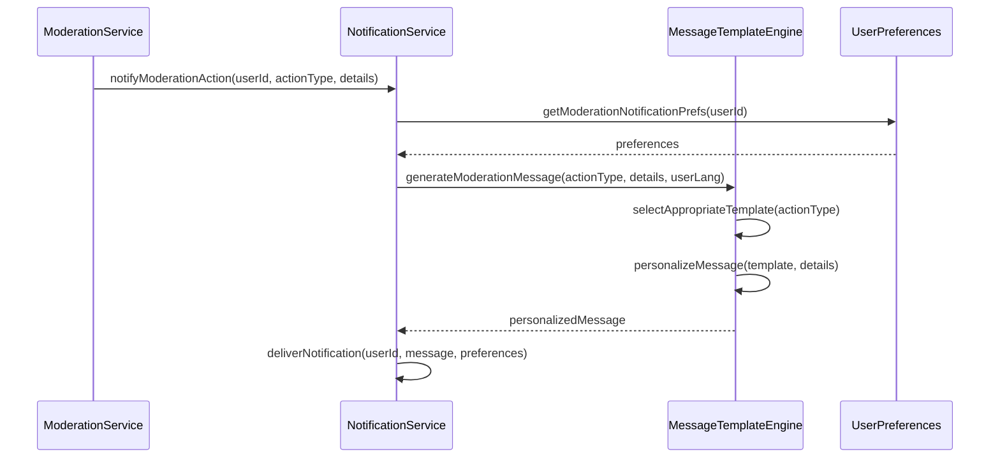
```mermaid
sequenceDiagram
    participant ModerationService
    participant NotificationService
    participant MessageTemplateEngine
    participant UserPreferences
    
    ModerationService->>NotificationService: notifyModerationAction(userId, actionType, details)
    NotificationService->>UserPreferences: getModerationNotificationPrefs(userId)
    UserPreferences-->>NotificationService: preferences
    
    NotificationService->>MessageTemplateEngine: generateModerationMessage(actionType, details, userLang)
    MessageTemplateEngine->>MessageTemplateEngine: selectAppropriateTemplate(actionType)
    MessageTemplateEngine->>MessageTemplateEngine: personalizeMessage(template, details)
    MessageTemplateEngine-->>NotificationService: personalizedMessage
    
    NotificationService->>NotificationService: deliverNotification(userId, message, preferences)
```

## 10. Considérations techniques

### 10.1 Architecture de données pour la modération

#### Tables PostgreSQL spécialisées

```sql
-- Violations et sanctions
CREATE TABLE user_violations (
    id UUID PRIMARY KEY DEFAULT uuid_generate_v4(),
    user_id UUID NOT NULL,
    violation_type VARCHAR(50) NOT NULL,
    severity_level INTEGER NOT NULL,
    content_id UUID,
    evidence_data JSONB,
    detected_by VARCHAR(20) NOT NULL, -- 'ai', 'user_report', 'manual'
    detection_confidence DECIMAL(3,2),
    created_at TIMESTAMP NOT NULL DEFAULT NOW(),
    INDEX(user_id, created_at),
    INDEX(violation_type, severity_level)
);

-- Sanctions appliquées
CREATE TABLE applied_sanctions (
    id UUID PRIMARY KEY DEFAULT uuid_generate_v4(),
    violation_id UUID NOT NULL REFERENCES user_violations(id),
    user_id UUID NOT NULL,
    sanction_type VARCHAR(30) NOT NULL,
    severity_level INTEGER NOT NULL,
    start_date TIMESTAMP NOT NULL DEFAULT NOW(),
    end_date TIMESTAMP,
    parameters JSONB DEFAULT '{}',
    applied_by VARCHAR(100),
    is_active BOOLEAN DEFAULT TRUE,
    appeal_status VARCHAR(20) DEFAULT 'none',
    INDEX(user_id, is_active),
    INDEX(sanction_type, end_date)
);

-- Signalements utilisateur
CREATE TABLE user_reports (
    id UUID PRIMARY KEY DEFAULT uuid_generate_v4(),
    reporter_id UUID NOT NULL,
    reported_content_id UUID NOT NULL,
    reported_user_id UUID,
    report_reason VARCHAR(50) NOT NULL,
    report_category VARCHAR(30) NOT NULL,
    description TEXT,
    evidence_urls TEXT[],
    priority_level INTEGER NOT NULL DEFAULT 3,
    status VARCHAR(20) NOT NULL DEFAULT 'pending',
    assigned_moderator UUID,
    resolution TEXT,
    created_at TIMESTAMP NOT NULL DEFAULT NOW(),
    resolved_at TIMESTAMP,
    INDEX(reported_user_id, status),
    INDEX(priority_level, created_at),
    INDEX(assigned_moderator, status)
);

-- Appels et révisions
CREATE TABLE sanction_appeals (
    id UUID PRIMARY KEY DEFAULT uuid_generate_v4(),
    sanction_id UUID NOT NULL REFERENCES applied_sanctions(id),
    user_id UUID NOT NULL,
    appeal_reason TEXT NOT NULL,
    user_evidence JSONB,
    submission_date TIMESTAMP NOT NULL DEFAULT NOW(),
    review_deadline TIMESTAMP NOT NULL,
    assigned_reviewer UUID,
    committee_review BOOLEAN DEFAULT FALSE,
    status VARCHAR(20) NOT NULL DEFAULT 'pending',
    decision VARCHAR(20),
    decision_reason TEXT,
    decided_at TIMESTAMP,
    INDEX(user_id, status),
    INDEX(review_deadline, status),
    INDEX(assigned_reviewer, status)
);
```

#### Structures Redis pour performance

```redis
# Limitations de débit par utilisateur (TTL: dynamique selon action)
rate_limit:user:{userId}:{actionType} = {
    "count": 47,
    "window_start": "2025-05-25T10:00:00Z",
    "limit": 100,
    "trust_factor": 1.2
}

# Cache des scores de confiance (TTL: 3600 secondes)
trust_score:user:{userId} = {
    "score": 0.85,
    "last_updated": "2025-05-25T10:30:00Z",
    "factors": {
        "account_age": 0.9,
        "violation_history": 0.7,
        "community_contributions": 0.95
    }
}

# Détection de patterns suspects (TTL: 1800 secondes)
pattern_detection:user:{userId} = {
    "activity_pattern": "normal",
    "anomaly_score": 0.23,
    "flags": ["unusual_timing"],
    "last_analysis": "2025-05-25T10:25:00Z"
}

# Queue de modération (Persistant)
moderation:queue:{priority} = [
    {
        "content_id": "content_123",
        "type": "user_report",
        "priority": 1,
        "submitted_at": "2025-05-25T10:30:00Z"
    }
]
```

### 10.2 Workers Elixir pour la modération

#### Worker de détection d'anomalies

```elixir
defmodule WhisprMessaging.AnomalyDetectionWorker do
  use GenServer
  
  def init(_) do
    schedule_anomaly_detection()
    {:ok, %{}}
  end
  
  def handle_info(:detect_anomalies, state) do
    perform_anomaly_detection()
    schedule_anomaly_detection()
    {:noreply, state}
  end
  
  defp perform_anomaly_detection do
    # Analyser l'activité récente des utilisateurs
    recent_activity = get_recent_user_activity(time_window: :hour)
    
    # Détecter les patterns anormaux
    Enum.each(recent_activity, fn user_activity ->
      anomaly_score = calculate_anomaly_score(user_activity)
      
      if anomaly_score > threshold(:high) do
        escalate_to_moderation(user_activity.user_id, anomaly_score)
      elsif anomaly_score > threshold(:medium) do
        increase_monitoring(user_activity.user_id)
      end
    end)
  end
end
```

#### Worker de traitement des appels

```elixir
defmodule WhisprMessaging.AppealProcessingWorker do
  use GenServer
  
  def handle_cast({:process_appeal, appeal_id}, state) do
    case process_appeal(appeal_id) do
      {:ok, decision} ->
        notify_appeal_decision(appeal_id, decision)
        update_sanction_if_needed(appeal_id, decision)
      {:error, reason} ->
        handle_appeal_processing_error(appeal_id, reason)
    end
    
    {:noreply, state}
  end
  
  defp process_appeal(appeal_id) do
    with {:ok, appeal} <- get_appeal_details(appeal_id),
         {:ok, review_result} <- conduct_appeal_review(appeal),
         {:ok, decision} <- make_appeal_decision(review_result) do
      {:ok, decision}
    else
      error -> {:error, error}
    end
  end
end
```

## 11. Endpoints API

| Endpoint | Méthode | Description | Paramètres |
|----------|---------|-------------|------------|
| `/api/v1/moderation/report` | POST | Signaler un contenu | Corps avec détails du signalement |
| `/api/v1/moderation/reports/{id}` | GET | Statut d'un signalement | - |
| `/api/v1/moderation/sanctions` | GET | Sanctions utilisateur | `user_id`, `status` |
| `/api/v1/moderation/appeal` | POST | Faire appel d'une sanction | Corps avec raison et preuves |
| `/api/v1/moderation/appeals/{id}` | GET | Statut d'un appel | - |
| `/api/v1/moderation/content/analyze` | POST | Analyser contenu par IA | Corps avec contenu |
| `/api/v1/moderation/stats` | GET | Statistiques de modération | `period`, `type` |
| `/api/v1/moderation/trust-score` | GET | Score de confiance utilisateur | `user_id` |
| `/api/v1/admin/moderation/queue` | GET | Queue de modération | `priority`, `status` |
| `/api/v1/admin/moderation/review` | POST | Révision manuelle | Corps avec décision |

## 12. Tests et validation

### 12.1 Tests de détection
- **Précision du spam**: Taux de vrais/faux positifs pour la détection automatique
- **Détection d'anomalies**: Efficacité de l'identification des comportements suspects
- **Performance IA**: Précision des modèles de modération de contenu
- **Rate limiting**: Efficacité des limitations de débit

### 12.2 Tests de processus
- **Workflow de signalement**: Processus complet de signalement à résolution
- **Système de sanctions**: Application correcte des sanctions graduées
- **Processus d'appel**: Fonctionnement du système de révision
- **Escalade**: Passage correct entre niveaux de modération

### 12.3 Tests de performance
- **Latence de modération**: Temps de traitement des contenus suspects
- **Débit de signalements**: Capacité de traitement des signalements simultanés
- **Scalabilité**: Performance avec augmentation du volume
- **Impact utilisateur**: Effet sur l'expérience des utilisateurs légitimes

## 13. Livrables

1. **Infrastructure anti-abus complète** comprenant :
   - Système de rate limiting adaptatif et distribué
   - Détection automatique de spam et d'anomalies comportementales
   - Intégration avec le moderation-service IA
   - Système de sanctions graduées avec escalade automatique

2. **Interface de signalement communautaire** :
   - Système de signalement utilisateur intuitif
   - Agrégation intelligente des signalements multiples
   - Priorisation automatique selon la gravité
   - Feedback transparent aux signalants

3. **Processus de révision et d'appel** :
   - Système d'appel des décisions automatiques
   - Révision humaine pour les cas complexes
   - Comité d'appel pour les sanctions majeures
   - Suivi et statistiques des décisions

4. **Outils d'administration** :
   - Interface de modération pour équipe admin
   - Tableaux de bord de monitoring des abus
   - Outils d'analyse des patterns et tendances
   - Gestion des politiques de modération

5. **Documentation opérationnelle** :
   - Procédures de modération et escalade
   - Guide de configuration des seuils et paramètres
   - Formation pour équipe de modération
   - Métriques et KPIs de surveillance

6. **Intégration système complète** :
   - Coordination avec tous les services existants
   - APIs pour extension des fonctionnalités
   - Logging et audit complets
   - Backup et récupération des décisions de modération