# Spécification Fonctionnelle - Rétention et Suppression des Données

## 1. Vue d'ensemble

### 1.1 Objectif

Cette spécification définit les politiques et mécanismes de rétention et de suppression des données pour le service de messagerie Whispr. Elle couvre les différents types de suppression, les politiques de conservation configurables, le cycle de vie des messages, et les considérations de conformité réglementaire, notamment RGPD.

### 1.2 Principes Fondamentaux

- **Contrôle utilisateur** : Les utilisateurs ont le contrôle sur leurs propres données
- **Respect de la vie privée** : Suppression effective et non récupérable des données supprimées
- **Conformité réglementaire** : Respect des obligations légales (RGPD, CCPA, etc.)
- **Transparence** : Politiques claires et visibles pour les utilisateurs
- **Sécurité** : Suppression cryptographiquement sûre des données sensibles
- **Flexibilité** : Politiques configurables selon les besoins des utilisateurs et groupes

### 1.3 Définitions

| Terme | Définition |
|-------|------------|
| **Suppression pour soi** | Suppression d'un message uniquement pour l'utilisateur qui effectue l'action |
| **Suppression pour tous** | Suppression d'un message pour tous les participants de la conversation |
| **Rétention automatique** | Suppression automatique après une période définie |
| **Archivage** | Déplacement des données vers un stockage à long terme |
| **Purge** | Suppression définitive et irréversible des données |
| **Politique de rétention** | Règles définissant la durée de conservation des données |

## 2. Types de Suppression

### 2.1 Suppression pour Soi (Delete for Myself)

#### 2.1.1 Principe

La suppression pour soi permet à un utilisateur de retirer un message de sa propre vue sans affecter les autres participants à la conversation.

#### 2.1.2 Flux de Suppression pour Soi

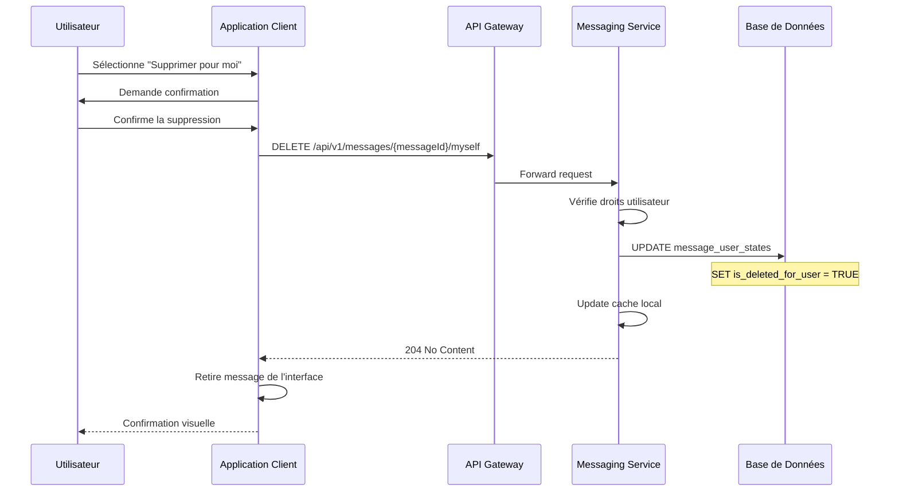

#### 2.1.3 Caractéristiques

- **Portée** : Affecte uniquement l'utilisateur qui effectue l'action
- **Réversibilité** : Irréversible une fois confirmée
- **Synchronisation** : Appliquée à tous les appareils de l'utilisateur
- **Conservation** : Le message reste accessible aux autres participants
- **Métadonnées** : Préservation des métadonnées pour les autres utilisateurs

### 2.2 Suppression pour Tous (Delete for Everyone)

#### 2.2.1 Principe

La suppression pour tous permet à l'expéditeur d'un message de le supprimer pour tous les participants à la conversation.

#### 2.2.2 Flux de Suppression pour Tous

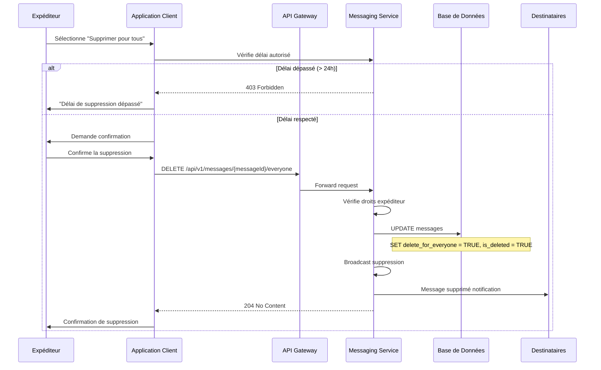

#### 2.2.3 Restrictions

- **Délai limite** : 24 heures après l'envoi du message
- **Droits** : Seul l'expéditeur peut supprimer pour tous
- **Types de messages** : Applicable aux messages texte et médias
- **Exceptions** : Messages système non supprimables
- **Traçabilité** : Enregistrement de l'action pour audit

### 2.3 Suppression Administrative

#### 2.3.1 Principe

Les administrateurs de groupe peuvent supprimer des messages dans certaines circonstances.

#### 2.3.2 Conditions d'Application

- **Groupes uniquement** : Fonction limitée aux conversations de groupe
- **Rôle administrateur** : Utilisateur avec droits d'administration
- **Motifs valides** : Contenu inapproprié, violation des règles
- **Journalisation** : Action enregistrée avec justification

## 3. Politiques de Rétention

### 3.1 Configuration des Politiques

#### 3.1.1 Niveaux de Configuration

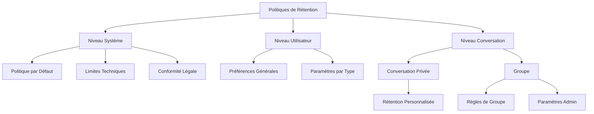

#### 3.1.2 Hiérarchie des Politiques

1. **Niveau Système** (priorité maximale)
   - Conformité réglementaire
   - Limites techniques de stockage
   - Politiques de sécurité

2. **Niveau Utilisateur**
   - Préférences personnelles
   - Paramètres par défaut pour nouvelles conversations

3. **Niveau Conversation**
   - Paramètres spécifiques à la conversation
   - Accord entre participants (conversations privées)
   - Règles définies par l'administrateur (groupes)

### 3.2 Types de Politiques de Rétention

#### 3.2.1 Rétention Permanente

- **Description** : Conservation indéfinie des messages
- **Cas d'usage** : Conversations importantes, archivage légal
- **Limitations** : Soumise aux quotas de stockage utilisateur
- **Paramètres** : Aucune date d'expiration

#### 3.2.2 Rétention Temporelle

- **Durées disponibles** :
  - 24 heures (messages éphémères)
  - 7 jours (conversations temporaires)
  - 30 jours (rétention courte)
  - 1 an (rétention standard)
  - 7 ans (archivage légal)

#### 3.2.3 Rétention par Quota

- **Limite par nombre** : Maximum de messages conservés
- **Politique FIFO** : Suppression des plus anciens messages
- **Seuils d'alerte** : Notification avant suppression automatique

### 3.3 Configuration des Politiques

#### 3.3.1 Interface de Configuration

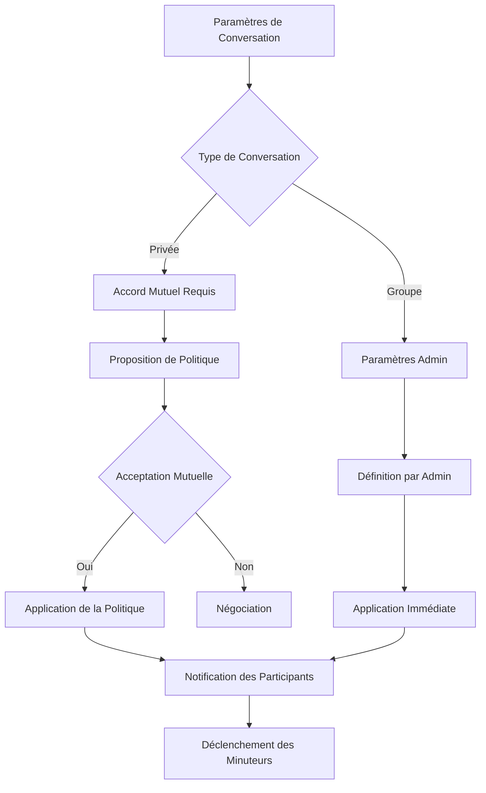

#### 3.3.2 API de Configuration

```http
PUT /api/v1/conversations/{conversationId}/retention-policy
Content-Type: application/json

{
  "policy_type": "time_based",
  "retention_period": {
    "duration": 30,
    "unit": "days"
  },
  "auto_delete_media": true,
  "media_retention_period": {
    "duration": 7,
    "unit": "days"
  },
  "exceptions": {
    "pinned_messages": true,
    "system_messages": true
  },
  "effective_date": "2025-05-27T00:00:00Z"
}
```

## 4. Cycle de Vie des Messages

### 4.1 États du Message

#### 4.1.1 Diagramme d'États

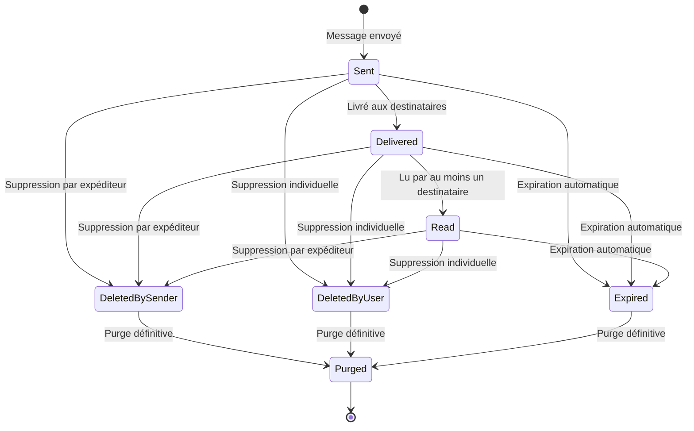

#### 4.1.2 Transitions d'États

| État Initial | Action | État Final | Déclencheur |
|--------------|--------|------------|-------------|
| Sent | Lecture | Read | Accusé de lecture |
| Any | Suppression par expéditeur | DeletedBySender | Action utilisateur |
| Any | Suppression individuelle | DeletedByUser | Action utilisateur |
| Any | Expiration | Expired | Politique de rétention |
| Deleted/Expired | Purge | Purged | Job de nettoyage |

### 4.2 Processus d'Expiration

#### 4.2.1 Détection des Messages Expirés

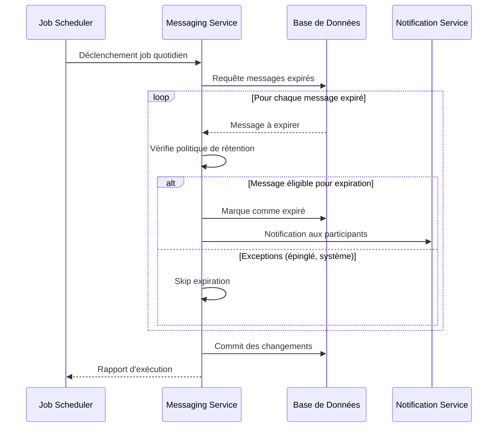

#### 4.2.2 Requête d'Expiration

```sql
-- Identification des messages expirés selon les politiques de rétention
WITH expired_messages AS (
  SELECT 
    m.id,
    m.conversation_id,
    m.sent_at,
    cs.retention_policy
  FROM messages m
  JOIN conversation_settings cs ON m.conversation_id = cs.conversation_id
  WHERE 
    m.is_deleted = FALSE
    AND cs.retention_policy->>'type' = 'time_based'
    AND m.sent_at < NOW() - (cs.retention_policy->>'duration')::INTERVAL
    AND NOT EXISTS (
      SELECT 1 FROM pinned_messages pm 
      WHERE pm.message_id = m.id
    )
)
UPDATE messages 
SET 
  is_deleted = TRUE,
  delete_for_everyone = TRUE,
  edited_at = NOW()
WHERE id IN (SELECT id FROM expired_messages);
```

### 4.3 Processus de Purge

#### 4.3.1 Purge des Messages Supprimés

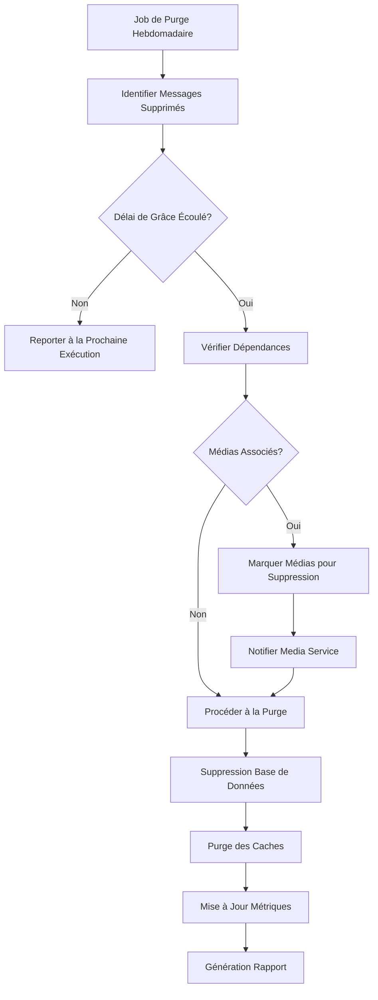

#### 4.3.2 Délai de Grâce

- **Suppression utilisateur** : 7 jours avant purge définitive
- **Expiration automatique** : 30 jours avant purge
- **Suppression administrative** : 90 jours (conformité audit)
- **Demande légale** : Purge immédiate possible

## 5. Conformité RGPD

### 5.1 Droits des Utilisateurs

#### 5.1.1 Droit à l'Effacement (Article 17)

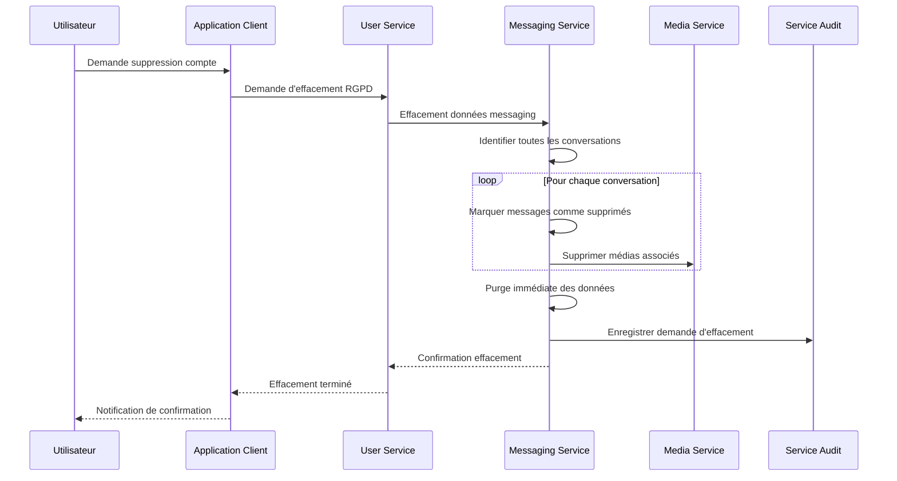

#### 5.1.2 Droit à la Portabilité (Article 20)

- **Données exportables** :
  - Métadonnées des conversations (horodatages, participants)
  - Statuts de messages (envoyé, lu, etc.)
  - Paramètres de rétention configurés
  - **Exclusions** : Contenu des messages (chiffré E2E)

#### 5.1.3 Droit de Rectification (Article 16)

- **Données modifiables** :
  - Paramètres de rétention personnels
  - Préférences de suppression
  - **Limitations** : Impossibilité de modifier le contenu des messages

### 5.2 Bases Légales du Traitement

#### 5.2.1 Rétention des Données

| Type de Donnée | Base Légale | Durée Maximum | Justification |
|----------------|-------------|---------------|---------------|
| Messages utilisateur | Consentement | Selon paramètres utilisateur | Fourniture du service |
| Métadonnées conversation | Intérêt légitime | 2 ans après inactivité | Sécurité et support |
| Logs d'audit | Obligation légale | 7 ans | Conformité réglementaire |
| Données de modération | Intérêt légitime | 1 an | Sécurité de la plateforme |

#### 5.2.2 Exceptions au Droit d'Effacement

- **Liberté d'expression** : Messages dans des contextes publics ou semi-publics
- **Intérêts légitimes** : Données nécessaires pour la sécurité de la plateforme
- **Obligations légales** : Conservation requise par la loi (blanchiment, terrorisme)
- **Défense de droits** : Données nécessaires pour défendre des droits légaux

### 5.3 Mécanismes de Contrôle

#### 5.3.1 Consentement Éclairé

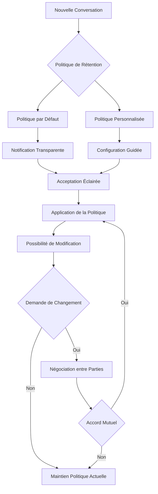

#### 5.3.2 Transparence

- **Documentation accessible** : Politiques de rétention clairement expliquées
- **Interface utilisateur** : Informations visibles lors de la configuration
- **Notifications** : Alertes avant suppression automatique
- **Rapports** : Possibilité de consulter l'historique des suppressions

## 6. Implémentation Technique

### 6.1 Architecture des Données

#### 6.1.1 Modèle de Données Étendu

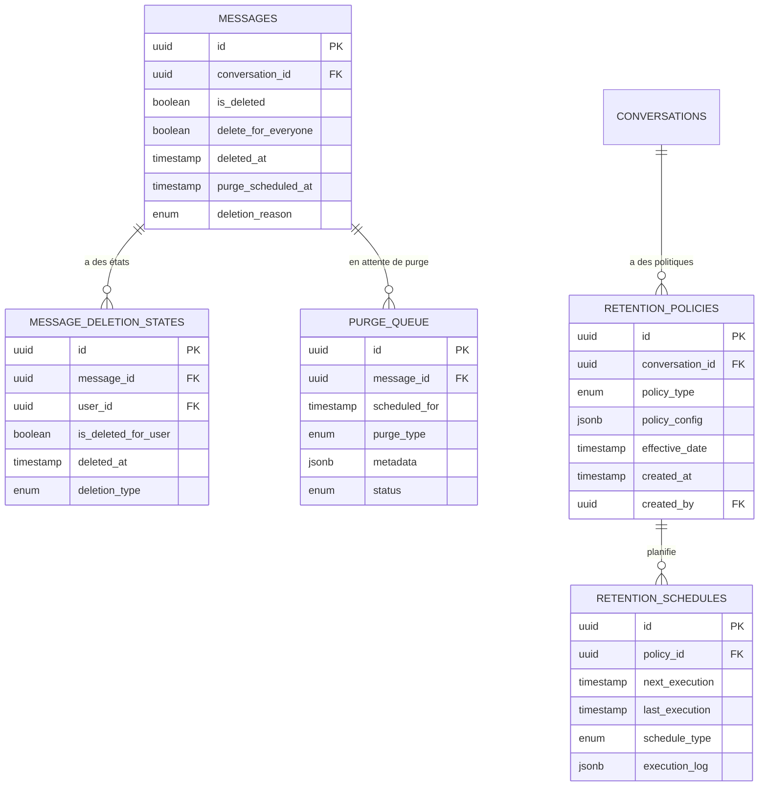

#### 6.1.2 Index et Optimisations

```sql
-- Index pour les requêtes d'expiration fréquentes
CREATE INDEX idx_messages_expiration 
ON messages(conversation_id, sent_at, is_deleted) 
WHERE is_deleted = FALSE;

-- Index pour la purge
CREATE INDEX idx_messages_purge_queue
ON messages(purge_scheduled_at, is_deleted)
WHERE purge_scheduled_at IS NOT NULL;

-- Index partiel pour les suppressions utilisateur
CREATE INDEX idx_message_deletion_states_active
ON message_deletion_states(message_id, user_id)
WHERE is_deleted_for_user = TRUE;
```

### 6.2 Services et Processus

#### 6.2.1 Service de Rétention

```elixir
defmodule WhisprMessaging.Retention.PolicyEngine do
  @moduledoc """
  Moteur de politique de rétention pour les messages
  """
  
  alias WhisprMessaging.{Repo, Messages.Message}
  alias WhisprMessaging.Retention.{Policy, Schedule}
  
  @doc """
  Évalue et applique les politiques de rétention pour une conversation
  """
  def apply_retention_policies(conversation_id) do
    conversation_id
    |> get_active_policies()
    |> Enum.map(&evaluate_policy/1)
    |> process_retention_actions()
  end
  
  defp get_active_policies(conversation_id) do
    Policy
    |> where(conversation_id: ^conversation_id)
    |> where([p], p.effective_date <= ^DateTime.utc_now())
    |> order_by([p], desc: p.effective_date)
    |> limit(1)
    |> Repo.all()
  end
  
  defp evaluate_policy(%Policy{policy_type: :time_based} = policy) do
    cutoff_date = DateTime.add(
      DateTime.utc_now(), 
      -policy.policy_config["duration_seconds"]
    )
    
    expired_messages = 
      Message
      |> where(conversation_id: ^policy.conversation_id)
      |> where([m], m.sent_at < ^cutoff_date)
      |> where([m], not m.is_deleted)
      |> exclude_exceptions(policy.policy_config["exceptions"])
      |> Repo.all()
    
    %{policy: policy, expired_messages: expired_messages}
  end
  
  defp exclude_exceptions(query, exceptions) do
    query
    |> maybe_exclude_pinned(exceptions["pinned_messages"])
    |> maybe_exclude_system(exceptions["system_messages"])
  end
end
```

#### 6.2.2 Worker de Purge

```elixir
defmodule WhisprMessaging.Workers.PurgeWorker do
  use Oban.Worker, queue: :purge, max_attempts: 3
  
  alias WhisprMessaging.Retention.PurgeService
  
  @impl Oban.Worker
  def perform(%Oban.Job{args: %{"message_id" => message_id}}) do
    case PurgeService.purge_message(message_id) do
      :ok -> :ok
      {:error, :not_eligible} -> :discard
      {:error, reason} -> {:error, reason}
    end
  end
  
  @doc """
  Planifie la purge d'un message après le délai de grâce
  """
  def schedule_purge(message_id, grace_period_hours \\ 168) do
    %{message_id: message_id}
    |> new(schedule_in: {grace_period_hours, :hours})
    |> Oban.insert()
  end
end
```

### 6.3 API et Interfaces

#### 6.3.1 Endpoints de Gestion

```yaml
# API REST pour la gestion des politiques de rétention
paths:
  /api/v1/conversations/{conversationId}/retention-policy:
    get:
      summary: Obtenir la politique de rétention
      responses:
        200:
          content:
            application/json:
              schema:
                $ref: '#/components/schemas/RetentionPolicy'
    
    put:
      summary: Configurer la politique de rétention
      requestBody:
        content:
          application/json:
            schema:
              $ref: '#/components/schemas/RetentionPolicyRequest'
      responses:
        200:
          description: Politique mise à jour
        400:
          description: Politique invalide
        403:
          description: Droits insuffisants

  /api/v1/messages/{messageId}/delete:
    delete:
      summary: Supprimer un message
      parameters:
        - name: scope
          in: query
          schema:
            type: string
            enum: [myself, everyone]
      responses:
        204:
          description: Message supprimé
        403:
          description: Suppression non autorisée
        410:
          description: Délai de suppression dépassé

  /api/v1/users/{userId}/data/purge:
    post:
      summary: Demande de purge RGPD
      requestBody:
        content:
          application/json:
            schema:
              type: object
              properties:
                reason:
                  type: string
                  enum: [user_request, legal_obligation, account_deletion]
      responses:
        202:
          description: Demande acceptée
        400:
          description: Demande invalide
```

#### 6.3.2 Schémas de Données

```yaml
components:
  schemas:
    RetentionPolicy:
      type: object
      properties:
        id:
          type: string
          format: uuid
        conversation_id:
          type: string
          format: uuid
        policy_type:
          type: string
          enum: [permanent, time_based, quota_based]
        policy_config:
          type: object
          properties:
            duration_seconds:
              type: integer
              minimum: 3600
            max_messages:
              type: integer
              minimum: 100
            exceptions:
              type: object
              properties:
                pinned_messages:
                  type: boolean
                system_messages:
                  type: boolean
        effective_date:
          type: string
          format: date-time
        created_at:
          type: string
          format: date-time
        created_by:
          type: string
          format: uuid

    DeletionRequest:
      type: object
      properties:
        scope:
          type: string
          enum: [myself, everyone]
        reason:
          type: string
          maxLength: 500
      required:
        - scope
```

## 7. Considérations Légales

### 7.1 Conformité Réglementaire

#### 7.1.1 Réglementations Applicables

| Réglementation | Territoire | Exigences Principales | Impact sur Rétention |
|----------------|------------|----------------------|---------------------|
| RGPD (UE) | Union Européenne | Consentement, transparence, droit à l'effacement | Politiques configurables, purge garantie |
| CCPA (USA) | Californie | Droit de suppression, transparence | Export des données, suppression sur demande |
| PIPEDA (Canada) | Canada | Consentement éclairé, limitation de la collecte | Durée de conservation justifiée |
| LGPD (Brésil) | Brésil | Base légale, transparence | Finalité spécifique de la rétention |

#### 7.1.2 Obligations Spécifiques

##### Conservation Légale
- **Secteur Financier** : 7 ans pour les communications financières
- **Secteur Santé** : Durée variable selon le type de données
- **Enquêtes Judiciaires** : Conservation obligatoire pendant la procédure
- **Lutte Anti-Terrorisme** : Conservation étendue possible

##### Suppression Obligatoire
- **Données Sensibles** : Suppression après finalité atteinte
- **Données de Mineurs** : Protections renforcées
- **Demandes Explicites** : Respect du droit à l'effacement
- **Violations de Données** : Suppression des données compromises

### 7.2 Gestion des Risques Juridiques

#### 7.2.1 Matrice des Risques

| Risque | Probabilité | Impact | Mesures de Mitigation |
|--------|-------------|--------|----------------------|
| Non-conformité RGPD | Moyenne | Très Élevé | Politiques transparentes, consentement éclairé |
| Conservation excessive | Élevée | Moyen | Purge automatique, audits réguliers |
| Suppression non-conforme | Faible | Élevé | Procédures de validation, journalisation |
| Demandes contradictoires | Moyenne | Moyen | Hiérarchie claire des obligations |
| Récupération post-suppression | Très Faible | Élevé | Suppression cryptographique sûre |

#### 7.2.2 Procédures de Gestion

##### Demandes Légales
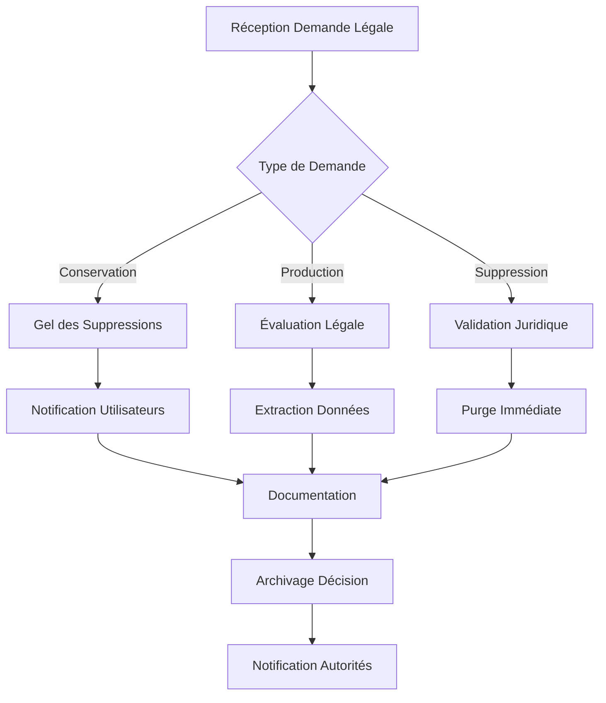

##### Résolution de Conflits
- **Hiérarchie des normes** : Loi nationale > Réglementation > Préférences utilisateur
- **Arbitrage juridique** : Consultation d'experts en cas de conflits
- **Documentation** : Justification de chaque décision
- **Communication** : Information transparente aux utilisateurs

### 7.3 Responsabilités et Gouvernance

#### 7.3.1 Rôles et Responsabilités

| Rôle | Responsabilités | Autorité |
|------|----------------|----------|
| **DPO (Data Protection Officer)** | Conformité RGPD, audits, formation | Décision finale sur les demandes d'effacement |
| **Administrateur Système** | Implémentation technique, sécurité | Exécution des suppressions validées |
| **Service Juridique** | Interprétation des lois, gestion des demandes | Validation des exceptions légales |
| **Product Owner** | Définition des fonctionnalités, UX | Spécifications des interfaces utilisateur |

#### 7.3.2 Processus de Gouvernance

##### Comité de Rétention
- **Composition** : DPO, Juridique, Technique, Product
- **Fréquence** : Mensuelle + ad hoc pour urgences
- **Missions** :
  - Révision des politiques de rétention
  - Validation des exceptions
  - Amélioration continue des processus

##### Audits et Contrôles
- **Audit interne** : Trimestriel sur les processus
- **Audit externe** : Annuel par cabinet spécialisé
- **Contrôles automatisés** : Vérification continue de la conformité
- **Reporting** : Tableau de bord des indicateurs de conformité

## 8. Procédures Opérationnelles

### 8.1 Gestion Quotidienne

#### 8.1.1 Jobs Automatisés

```mermaid
gantt
    title Planification des Tâches de Rétention
    dateFormat  HH:mm
    axisFormat  %H:%M
    
    section Quotidien
    Scan messages expirés    :daily-scan, 02:00, 1h
    Purge délai de grâce     :daily-purge, 03:00, 2h
    Génération métriques     :daily-metrics, 05:00, 30m
    
    section Hebdomadaire
    Purge définitive         :weekly-purge, 04:00, 4h
    Archivage conversations  :weekly-archive, 08:00, 2h
    
    section Mensuel
    Audit conformité         :monthly-audit, 02:00, 6h
    Nettoyage logs           :monthly-cleanup, 08:00, 2h
```

#### 8.1.2 Monitoring et Alertes

```yaml
# Configuration des alertes de rétention
alerts:
  retention_job_failure:
    condition: failed_jobs > 0
    severity: high
    channels: [email, slack]
    
  purge_backlog:
    condition: pending_purges > 1000
    severity: medium
    channels: [slack]
    
  legal_request_pending:
    condition: legal_requests_pending > 0
    severity: critical
    channels: [email, sms]
    
  gdpr_deadline_approaching:
    condition: gdpr_requests_due_in < 24h
    severity: high
    channels: [email, slack]

metrics:
  messages_expired_daily:
    type: counter
    labels: [conversation_type, retention_policy]
    
  purge_execution_time:
    type: histogram
    buckets: [1, 5, 10, 30, 60, 300]
    
  gdpr_response_time:
    type: histogram
    buckets: [1h, 6h, 24h, 72h]
```

### 8.2 Gestion des Incidents

#### 8.2.1 Échecs de Suppression

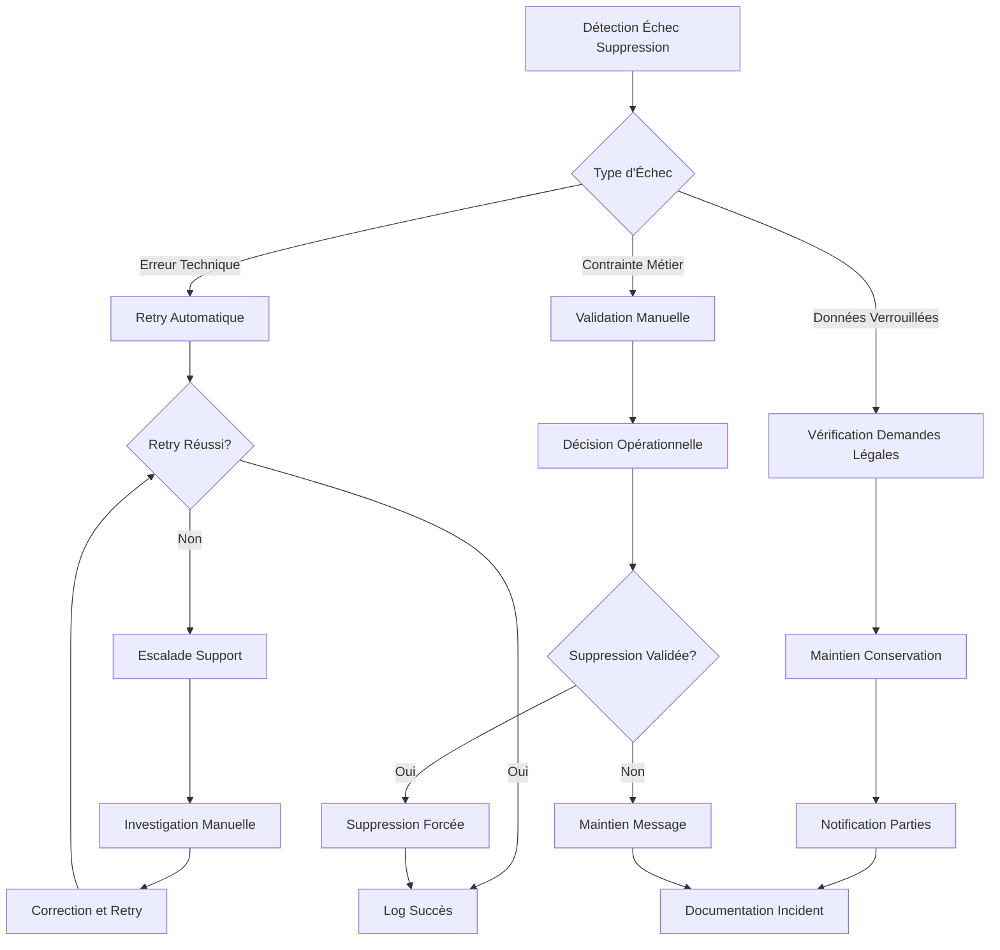

#### 8.2.2 Demandes d'Urgence

##### Procédure Accélérée
1. **Réception** : Canal dédié 24/7 pour urgences
2. **Validation** : Vérification rapide de la légitimité
3. **Exécution** : Suppression dans les 2 heures
4. **Documentation** : Traçabilité complète a posteriori

##### Critères d'Urgence
- **Sécurité** : Données sensibles exposées
- **Légal** : Injonction judiciaire
- **Réputationnel** : Risque majeur pour l'organisation
- **Technique** : Violation de sécurité

### 8.3 Documentation et Traçabilité

#### 8.3.1 Journalisation

```sql
-- Structure de la table d'audit pour les suppressions
CREATE TABLE deletion_audit_log (
    id UUID PRIMARY KEY DEFAULT uuid_generate_v4(),
    message_id UUID NOT NULL,
    conversation_id UUID NOT NULL,
    user_id UUID, -- Utilisateur ayant initié la suppression
    deletion_type deletion_type_enum NOT NULL,
    deletion_scope deletion_scope_enum NOT NULL,
    reason TEXT,
    legal_basis VARCHAR(100),
    execution_date TIMESTAMP NOT NULL DEFAULT NOW(),
    execution_status VARCHAR(50) NOT NULL,
    metadata JSONB DEFAULT '{}',
    created_at TIMESTAMP NOT NULL DEFAULT NOW()
);

-- Index pour les requêtes d'audit
CREATE INDEX idx_deletion_audit_conversation ON deletion_audit_log(conversation_id);
CREATE INDEX idx_deletion_audit_user ON deletion_audit_log(user_id);
CREATE INDEX idx_deletion_audit_date ON deletion_audit_log(execution_date);
CREATE INDEX idx_deletion_audit_type ON deletion_audit_log(deletion_type);
```

#### 8.3.2 Rapports de Conformité

##### Rapport Mensuel RGPD
```json
{
  "period": "2025-05",
  "gdpr_requests": {
    "total": 23,
    "completed": 21,
    "pending": 2,
    "average_response_time_hours": 15.3
  },
  "automatic_deletions": {
    "messages_expired": 15420,
    "conversations_archived": 234,
    "media_purged_mb": 2341.5
  },
  "policy_compliance": {
    "conversations_with_policy": 98.7,
    "overdue_deletions": 0,
    "manual_interventions": 3
  },
  "legal_requests": {
    "preservation_orders": 2,
    "production_requests": 1,
    "deletion_orders": 0
  }
}
```

##### Tableau de Bord Opérationnel
- **Métriques temps réel** : Messages supprimés, politiques actives
- **Indicateurs de performance** : Temps de traitement, taux d'échec
- **Alertes actives** : Problèmes nécessitant une intervention
- **Tendances** : Évolution des volumes et patterns

## 9. Tests et Validation

### 9.1 Stratégie de Test

#### 9.1.1 Tests Fonctionnels

```elixir
defmodule WhisprMessaging.RetentionTest do
  use WhisprMessaging.DataCase
  
  alias WhisprMessaging.Retention.PolicyEngine
  alias WhisprMessaging.Messages.Message
  
  describe "automatic message expiration" do
    test "expires messages according to time-based policy" do
      # Setup: Create conversation with 30-day retention
      conversation = insert(:conversation)
      policy = insert(:retention_policy, 
        conversation: conversation,
        policy_type: :time_based,
        duration_seconds: 30 * 24 * 3600
      )
      
      # Create old message (45 days old)
      old_message = insert(:message,
        conversation: conversation,
        sent_at: DateTime.add(DateTime.utc_now(), -45 * 24 * 3600)
      )
      
      # Create recent message (15 days old)
      recent_message = insert(:message,
        conversation: conversation,
        sent_at: DateTime.add(DateTime.utc_now(), -15 * 24 * 3600)
      )
      
      # Execute retention policy
      PolicyEngine.apply_retention_policies(conversation.id)
      
      # Verify results
      assert Repo.get(Message, old_message.id).is_deleted == true
      assert Repo.get(Message, recent_message.id).is_deleted == false
    end
    
    test "respects pinned message exceptions" do
      # Test implementation for pinned message preservation
    end
  end
  
  describe "user-initiated deletion" do
    test "delete for myself only affects requesting user" do
      # Test implementation
    end
    
    test "delete for everyone removes message for all participants" do
      # Test implementation
    end
    
    test "respects 24-hour deletion window for delete for everyone" do
      # Test implementation
    end
  end
  
  describe "GDPR compliance" do
    test "purges all user data on account deletion request" do
      # Test implementation
    end
    
    test "exports user data in structured format" do
      # Test implementation
    end
  end
end
```

#### 9.1.2 Tests de Performance

```elixir
defmodule WhisprMessaging.RetentionPerformanceTest do
  use ExUnit.Case
  
  alias WhisprMessaging.Retention.PurgeService
  
  @tag :performance
  test "purge performance with large message volumes" do
    # Setup: Create 100,000 messages to purge
    messages = insert_list(100_000, :message, is_deleted: true)
    
    {duration_ms, _result} = :timer.tc(fn ->
      PurgeService.purge_batch(Enum.map(messages, & &1.id))
    end)
    
    # Verify performance target: < 10 seconds for 100k messages
    assert duration_ms < 10_000_000
  end
  
  @tag :performance
  test "retention policy evaluation performance" do
    # Test policy evaluation on large datasets
  end
end
```

### 9.2 Tests de Conformité

#### 9.2.1 Tests RGPD

```elixir
defmodule WhisprMessaging.GDPRComplianceTest do
  use WhisprMessaging.DataCase
  
  alias WhisprMessaging.GDPR.DataSubjectRights
  
  describe "right to erasure" do
    test "completely removes all user data within 30 days" do
      user = insert(:user)
      conversations = insert_list(5, :conversation_with_messages, user: user)
      
      # Initiate GDPR deletion request
      {:ok, request} = DataSubjectRights.request_erasure(user.id)
      
      # Fast-forward through grace period
      travel_time_days(31)
      
      # Execute scheduled purge
      WhisprMessaging.Workers.GDPRPurgeWorker.perform_now()
      
      # Verify complete data removal
      assert Repo.get_by(Message, sender_id: user.id) == nil
      assert Repo.get_by(ConversationMember, user_id: user.id) == nil
      
      # Verify audit trail preservation
      assert Repo.get_by(GDPRRequest, user_id: user.id) != nil
    end
  end
  
  describe "data portability" do
    test "exports user data in machine-readable format" do
      # Test data export functionality
    end
  end
end
```

### 9.3 Tests d'Intégration

#### 9.3.1 Tests Multi-Services

```elixir
defmodule WhisprMessaging.IntegrationTest do
  use WhisprMessaging.IntegrationCase
  
  describe "coordinated deletion with media service" do
    test "deletes messages and associated media atomically" do
      # Setup message with media attachments
      message = insert(:message_with_media)
      
      # Delete message for everyone
      {:ok, _} = MessagingService.delete_message_for_everyone(
        message.id, 
        message.sender_id
      )
      
      # Verify message marked as deleted
      assert Repo.get(Message, message.id).is_deleted == true
      
      # Verify media service received deletion request
      assert_receive {:media_deletion_requested, media_ids}
      
      # Simulate media service confirmation
      MediaService.confirm_deletion(media_ids)
      
      # Verify message purged after confirmation
      eventually(fn ->
        assert Repo.get(Message, message.id) == nil
      end)
    end
  end
end
```

## 10. Évolutions et Améliorations Futures

### 10.1 Fonctionnalités Avancées

#### 10.1.1 Rétention Intelligente

- **Analyse de Patterns** : Identification automatique des messages importants
- **ML pour Classification** : Apprentissage des préférences utilisateur
- **Rétention Adaptative** : Ajustement automatique des politiques
- **Suggestions Personnalisées** : Recommandations de configuration

#### 10.1.2 Conformité Étendue

- **Multi-Juridictions** : Support de réglementations additionnelles
- **Certification Automatique** : Validation continue de la conformité
- **Audit Blockchain** : Traçabilité immuable des opérations
- **Zero-Knowledge Proofs** : Preuves de conformité sans révélation

### 10.2 Optimisations Techniques

#### 10.2.1 Performance

- **Purge Distribuée** : Traitement parallèle sur plusieurs nœuds
- **Compression Intelligente** : Archivage optimisé des données historiques
- **Cache Predictif** : Pré-chargement des données selon les politiques
- **Indexation Temporelle** : Optimisation pour les requêtes de rétention

#### 10.2.2 Scalabilité

- **Partitionnement Automatique** : Division dynamique des données
- **Streaming Processing** : Traitement en temps réel des suppressions
- **Federation** : Distribution inter-régionale conforme aux lois locales
- **Edge Computing** : Traitement local pour réduire la latence

---

## Annexes

### A. Modèles de Documentation

#### A.1 Template de Politique de Rétention

```markdown
# Politique de Rétention - Conversation {ID}

## Participants
- [Liste des participants et leurs rôles]

## Configuration Actuelle
- **Type de Politique**: {time_based|quota_based|permanent}
- **Durée de Rétention**: {X jours|Illimité}
- **Date d'Entrée en Vigueur**: {Date}
- **Exceptions**: 
  - Messages épinglés: {Oui|Non}
  - Messages système: {Oui|Non}

## Historique des Modifications
| Date | Modifié par | Changement | Raison |
|------|-------------|------------|--------|
| {Date} | {Utilisateur} | {Description} | {Justification} |

## Prochaine Révision
- **Date Prévue**: {Date}
- **Responsable**: {Utilisateur}
```

#### A.2 Template de Demande RGPD

```markdown
# Demande RGPD - {Type de Demande}

## Informations de Base
- **ID Demande**: {UUID}
- **Type**: {Effacement|Portabilité|Rectification}
- **Utilisateur**: {ID Utilisateur}
- **Date de Réception**: {Date}
- **Délai Légal**: {30 jours maximum}

## Scope de la Demande
- [ ] Messages envoyés
- [ ] Messages reçus
- [ ] Métadonnées de conversation
- [ ] Paramètres de rétention
- [ ] Logs d'audit

## Traitement
- **Assigné à**: {Responsable}
- **Date de Début**: {Date}
- **Statut**: {En Cours|Terminé|Refusé}
- **Date de Finalisation**: {Date}

## Documentation
- **Base Légale**: {RGPD Article X}
- **Justification**: {Description}
- **Mesures Prises**: {Actions effectuées}
```

### B. Scripts Utilitaires

#### B.1 Script de Vérification de Conformité

```bash
#!/bin/bash
# compliance_check.sh - Vérification de conformité RGPD

echo "=== Vérification de Conformité RGPD ==="

# Vérifier les demandes en attente
pending_requests=$(psql -t -c "
  SELECT COUNT(*) FROM gdpr_requests 
  WHERE status = 'pending' AND created_at < NOW() - INTERVAL '25 days'
")

if [ "$pending_requests" -gt 0 ]; then
  echo "⚠️  $pending_requests demandes RGPD en retard détectées"
  exit 1
fi

# Vérifier les suppressions en échec
failed_deletions=$(psql -t -c "
  SELECT COUNT(*) FROM purge_queue 
  WHERE status = 'failed' AND created_at < NOW() - INTERVAL '7 days'
")

if [ "$failed_deletions" -gt 0 ]; then
  echo "⚠️  $failed_deletions suppressions en échec détectées"
fi

# Vérifier les politiques sans configuration
missing_policies=$(psql -t -c "
  SELECT COUNT(*) FROM conversations c
  LEFT JOIN retention_policies rp ON c.id = rp.conversation_id
  WHERE rp.id IS NULL AND c.created_at < NOW() - INTERVAL '30 days'
")

if [ "$missing_policies" -gt 0 ]; then
  echo "⚠️  $missing_policies conversations sans politique de rétention"
fi

echo "✅ Vérification terminée"
```

#### B.2 Script de Migration de Données

```sql
-- migration_retention_v2.sql
-- Migration vers le nouveau système de rétention

BEGIN;

-- Créer les nouvelles tables
CREATE TABLE IF NOT EXISTS retention_policies_v2 (
  id UUID PRIMARY KEY DEFAULT uuid_generate_v4(),
  conversation_id UUID NOT NULL REFERENCES conversations(id),
  policy_version INTEGER NOT NULL DEFAULT 2,
  policy_config JSONB NOT NULL,
  created_at TIMESTAMP NOT NULL DEFAULT NOW(),
  effective_date TIMESTAMP NOT NULL DEFAULT NOW(),
  created_by UUID NOT NULL
);

-- Migrer les anciennes politiques
INSERT INTO retention_policies_v2 (conversation_id, policy_config, created_by)
SELECT 
  conversation_id,
  jsonb_build_object(
    'type', CASE 
      WHEN retention_days IS NULL THEN 'permanent'
      ELSE 'time_based'
    END,
    'duration_seconds', retention_days * 24 * 3600,
    'exceptions', jsonb_build_object(
      'pinned_messages', true,
      'system_messages', true
    )
  ),
  '00000000-0000-0000-0000-000000000000'::uuid -- System user
FROM retention_policies_v1;

-- Vérifier la migration
DO $$
DECLARE
  v1_count INTEGER;
  v2_count INTEGER;
BEGIN
  SELECT COUNT(*) INTO v1_count FROM retention_policies_v1;
  SELECT COUNT(*) INTO v2_count FROM retention_policies_v2;
  
  IF v1_count != v2_count THEN
    RAISE EXCEPTION 'Migration failed: count mismatch (v1: %, v2: %)', v1_count, v2_count;
  END IF;
  
  RAISE NOTICE 'Migration successful: % policies migrated', v2_count;
END $$;

COMMIT;
```

### C. Glossaire Juridique

| Terme | Définition | Référence Légale |
|-------|------------|------------------|
| **Consentement** | Manifestation libre, spécifique, éclairée et univoque de volonté | RGPD Art. 4(11) |
| **Données Personnelles** | Toute information relative à une personne physique identifiée ou identifiable | RGPD Art. 4(1) |
| **Effacement** | Suppression ou destruction des données personnelles | RGPD Art. 17 |
| **Finalité** | Objectif déterminé et légitime du traitement des données | RGPD Art. 5(1)(b) |
| **Minimisation** | Principe limitant la collecte aux données nécessaires | RGPD Art. 5(1)(c) |
| **Portabilité** | Droit de recevoir ses données dans un format structuré | RGPD Art. 20 |
| **Profilage** | Traitement automatisé pour évaluer des aspects personnels | RGPD Art. 4(4) |
| **Responsable de Traitement** | Entité qui détermine les finalités et moyens du traitement | RGPD Art. 4(7) |

### D. Contacts et Responsabilités

#### D.1 Équipe Projet

| Rôle | Nom | Responsabilité | Contact |
|------|-----|----------------|---------|
| **Chef de Projet** | Agnes | Coordination générale, architecture | agnes@whispr.dev |
| **Responsable Sécurité** | David | Implémentation cryptographique | david@whispr.dev |
| **DevSecOps** | Tudy | Infrastructure sécurisée | tudy@whispr.dev |
| **Développeur Backend** | Gabriel | Service de messagerie | gabriel@whispr.dev |

#### D.2 Contacts Juridiques

| Fonction | Contact | Domaine de Compétence |
|----------|---------|----------------------|
| **DPO Étudiant** | [À définir] | Conformité RGPD, audits |
| **Référent Juridique École** | [À définir] | Cadre réglementaire projet |
| **Expert Externe** | [À définir] | Consultation spécialisée |

---

*Cette spécification est un document vivant, régulièrement mis à jour selon l'évolution du projet et de la réglementation applicable.*