# Spécification Fonctionnelle - Statuts et Indicateurs

## 1. Vue d'ensemble

### 1.1 Objectif

Cette spécification détaille les mécanismes de feedback visuel de l'application Whispr qui informent les utilisateurs sur l'état de leurs communications. Elle couvre les accusés de réception, les statuts de lecture, les indicateurs de frappe et la présence en ligne, tout en respectant les paramètres de confidentialité et les préférences utilisateur. Ces fonctionnalités améliorent l'expérience utilisateur en fournissant des informations contextuelles sur l'état des conversations.

### 1.2 Principes clés

- **Transparence contrôlée**: Information claire sur l'état des messages avec respect de la vie privée
- **Confidentialité par défaut**: Paramètres de confidentialité granulaires pour chaque type d'indicateur
- **Feedback en temps réel**: Mise à jour instantanée des statuts pour une meilleure expérience
- **Cohérence multi-appareils**: Synchronisation des états entre tous les appareils utilisateur
- **Performance optimisée**: Transmission efficace des indicateurs sans surcharge réseau
- **Respect des préférences**: Honor des choix utilisateur pour chaque type de statut
- **Dégradation gracieuse**: Fonctionnement même en cas de connectivité limitée

### 1.3 Types de statuts et indicateurs

| Type | Description | Visibilité | Temps de vie | Confidentialité |
|------|-------------|------------|--------------|-----------------|
| **Envoyé** | Message transmis au serveur | Expéditeur uniquement | Permanent | Non configurable |
| **Livré** | Message reçu par l'appareil destinataire | Expéditeur uniquement | Permanent | Non configurable |
| **Lu** | Message consulté par le destinataire | Selon préférences | Permanent | Configurable |
| **En train d'écrire** | Utilisateur compose un message | Participants conversation | 5-10 secondes | Configurable |
| **En ligne** | Utilisateur actif sur l'application | Selon paramètres | Temps réel | Configurable |
| **Dernière vue** | Dernière activité de l'utilisateur | Selon paramètres | Persistent | Configurable |

### 1.4 États des messages

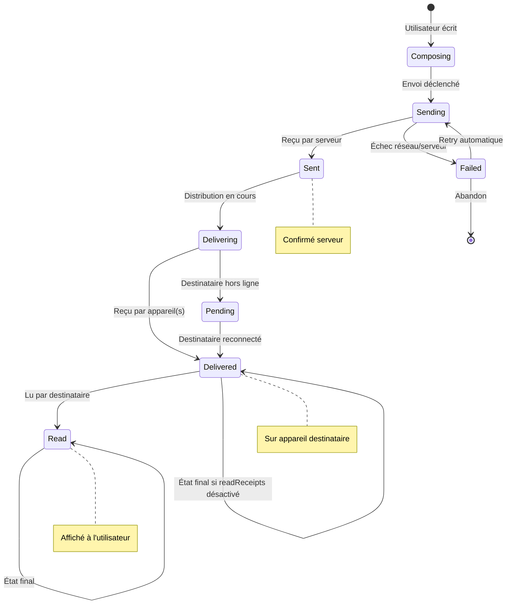
```mermaid
stateDiagram-v2
    [*] --> Composing : Utilisateur écrit
    Composing --> Sending : Envoi déclenché
    Sending --> Sent : Reçu par serveur
    Sending --> Failed : Échec réseau/serveur
    Failed --> Sending : Retry automatique
    Failed --> [*] : Abandon
    
    Sent --> Delivering : Distribution en cours
    Delivering --> Delivered : Reçu par appareil(s)
    Delivering --> Pending : Destinataire hors ligne
    Pending --> Delivered : Destinataire reconnecté
    
    Delivered --> Read : Lu par destinataire
    Delivered --> Delivered : État final si readReceipts désactivé
    Read --> Read : État final
    
    note right of Sent : Confirmé serveur
    note right of Delivered : Sur appareil destinataire
    note right of Read : Affiché à l'utilisateur
```

### 1.5 Composants fonctionnels

Le système de statuts et indicateurs comprend six processus principaux :
1. **Gestion des accusés de réception**: Suivi de la livraison des messages
2. **Système de statuts de lecture**: Tracking de la consultation des messages
3. **Indicateurs de frappe**: Signalisation de la composition en temps réel
4. **Gestion de la présence**: Suivi de l'activité et de la disponibilité
5. **Contrôles de confidentialité**: Gestion des préférences de visibilité
6. **Synchronisation temps réel**: Mise à jour cohérente entre appareils

## 2. Accusés de réception

### 2.1 Cycle de vie d'un message et statuts

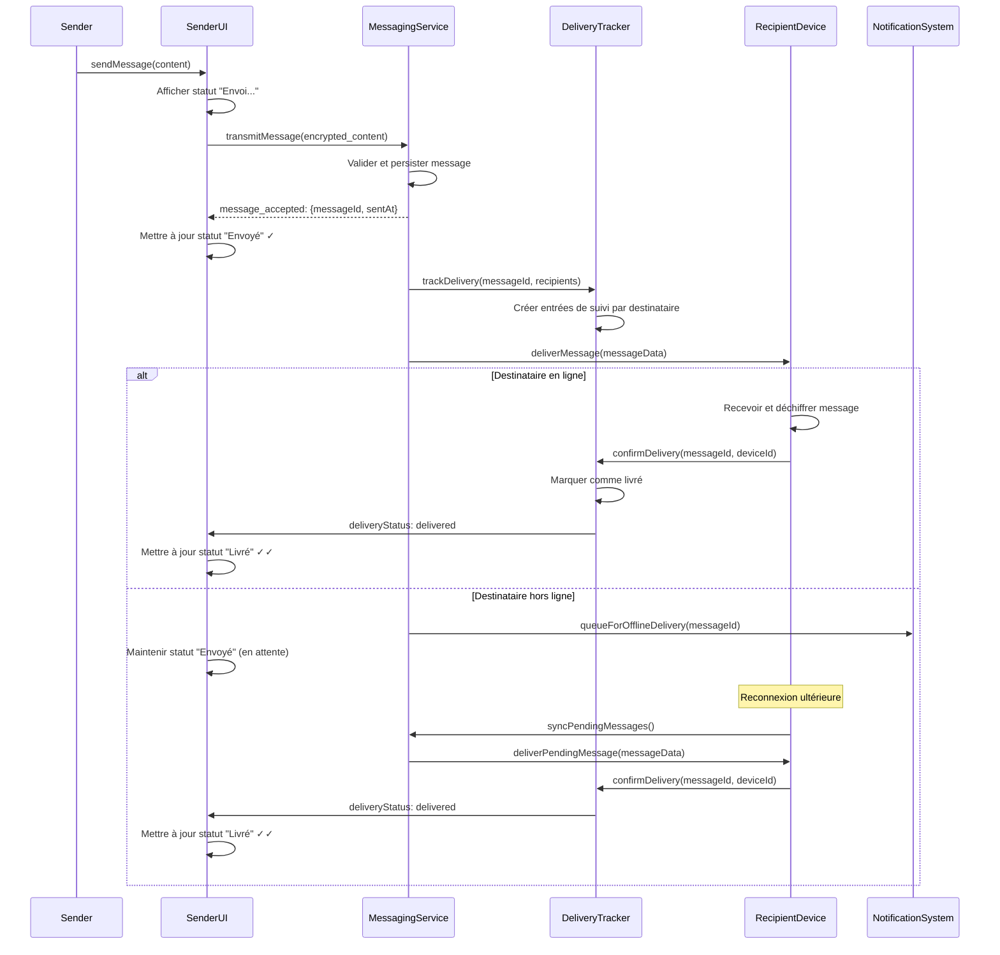
```mermaid
sequenceDiagram
    participant Sender
    participant SenderUI
    participant MessagingService
    participant DeliveryTracker
    participant RecipientDevice
    participant NotificationSystem
    
    Sender->>SenderUI: sendMessage(content)
    SenderUI->>SenderUI: Afficher statut "Envoi..."
    
    SenderUI->>MessagingService: transmitMessage(encrypted_content)
    MessagingService->>MessagingService: Valider et persister message
    MessagingService-->>SenderUI: message_accepted: {messageId, sentAt}
    
    SenderUI->>SenderUI: Mettre à jour statut "Envoyé" ✓
    
    MessagingService->>DeliveryTracker: trackDelivery(messageId, recipients)
    DeliveryTracker->>DeliveryTracker: Créer entrées de suivi par destinataire
    
    MessagingService->>RecipientDevice: deliverMessage(messageData)
    
    alt Destinataire en ligne
        RecipientDevice->>RecipientDevice: Recevoir et déchiffrer message
        RecipientDevice->>DeliveryTracker: confirmDelivery(messageId, deviceId)
        DeliveryTracker->>DeliveryTracker: Marquer comme livré
        
        DeliveryTracker->>SenderUI: deliveryStatus: delivered
        SenderUI->>SenderUI: Mettre à jour statut "Livré" ✓✓
        
    else Destinataire hors ligne
        MessagingService->>NotificationSystem: queueForOfflineDelivery(messageId)
        SenderUI->>SenderUI: Maintenir statut "Envoyé" (en attente)
        
        Note over RecipientDevice: Reconnexion ultérieure
        RecipientDevice->>MessagingService: syncPendingMessages()
        MessagingService->>RecipientDevice: deliverPendingMessage(messageData)
        RecipientDevice->>DeliveryTracker: confirmDelivery(messageId, deviceId)
        DeliveryTracker->>SenderUI: deliveryStatus: delivered
        SenderUI->>SenderUI: Mettre à jour statut "Livré" ✓✓
    end
```

### 2.2 Gestion multi-appareils des accusés

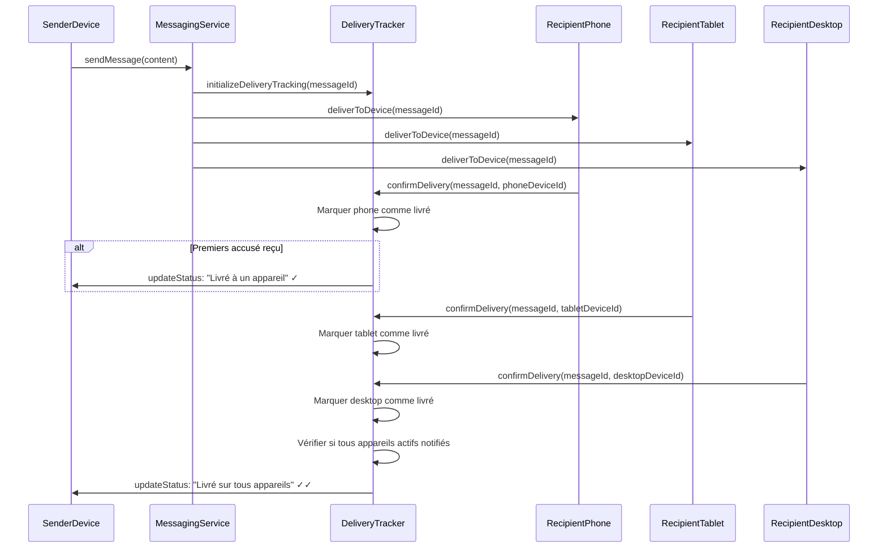
```mermaid
sequenceDiagram
    participant SenderDevice
    participant MessagingService
    participant DeliveryTracker
    participant RecipientPhone
    participant RecipientTablet
    participant RecipientDesktop
    
    SenderDevice->>MessagingService: sendMessage(content)
    MessagingService->>DeliveryTracker: initializeDeliveryTracking(messageId)
    
    MessagingService->>RecipientPhone: deliverToDevice(messageId)
    MessagingService->>RecipientTablet: deliverToDevice(messageId)
    MessagingService->>RecipientDesktop: deliverToDevice(messageId)
    
    RecipientPhone->>DeliveryTracker: confirmDelivery(messageId, phoneDeviceId)
    DeliveryTracker->>DeliveryTracker: Marquer phone comme livré
    
    alt Premiers accusé reçu
        DeliveryTracker->>SenderDevice: updateStatus: "Livré à un appareil" ✓
    end
    
    RecipientTablet->>DeliveryTracker: confirmDelivery(messageId, tabletDeviceId)
    DeliveryTracker->>DeliveryTracker: Marquer tablet comme livré
    
    RecipientDesktop->>DeliveryTracker: confirmDelivery(messageId, desktopDeviceId)
    DeliveryTracker->>DeliveryTracker: Marquer desktop comme livré
    
    DeliveryTracker->>DeliveryTracker: Vérifier si tous appareils actifs notifiés
    DeliveryTracker->>SenderDevice: updateStatus: "Livré sur tous appareils" ✓✓
```

### 2.3 Gestion des échecs de livraison

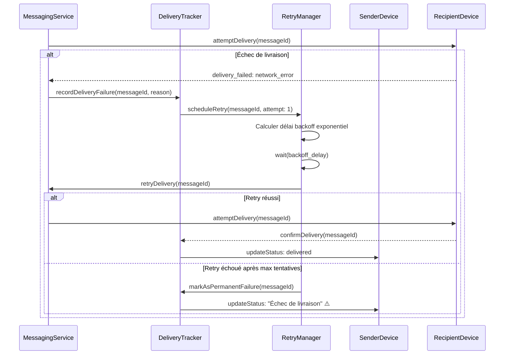
```mermaid
sequenceDiagram
    participant MessagingService
    participant DeliveryTracker
    participant RetryManager
    participant SenderDevice
    participant RecipientDevice
    
    MessagingService->>RecipientDevice: attemptDelivery(messageId)
    
    alt Échec de livraison
        RecipientDevice-->>MessagingService: delivery_failed: network_error
        MessagingService->>DeliveryTracker: recordDeliveryFailure(messageId, reason)
        
        DeliveryTracker->>RetryManager: scheduleRetry(messageId, attempt: 1)
        RetryManager->>RetryManager: Calculer délai backoff exponentiel
        
        RetryManager->>RetryManager: wait(backoff_delay)
        RetryManager->>MessagingService: retryDelivery(messageId)
        
        alt Retry réussi
            MessagingService->>RecipientDevice: attemptDelivery(messageId)
            RecipientDevice-->>DeliveryTracker: confirmDelivery(messageId)
            DeliveryTracker->>SenderDevice: updateStatus: delivered
            
        else Retry échoué après max tentatives
            RetryManager->>DeliveryTracker: markAsPermanentFailure(messageId)
            DeliveryTracker->>SenderDevice: updateStatus: "Échec de livraison" ⚠️
        end
    end
```

### 2.4 Indicateurs visuels des accusés

#### Interface expéditeur
- **En cours d'envoi**: Icône horloge animée ⏳
- **Envoyé**: Une coche simple ✓ (gris)
- **Livré**: Double coche ✓✓ (gris)
- **Échec**: Point d'exclamation ⚠️ (rouge) avec option retry

#### Règles d'affichage
- Les accusés ne sont visibles que pour l'expéditeur
- Pas d'information sur les accusés pour les destinataires
- Agrégation intelligente pour les groupes (pourcentage de livraison)
- Timeout d'affichage pour les états transitoires

## 3. Statuts de lecture

### 3.1 Mécanisme de tracking de lecture

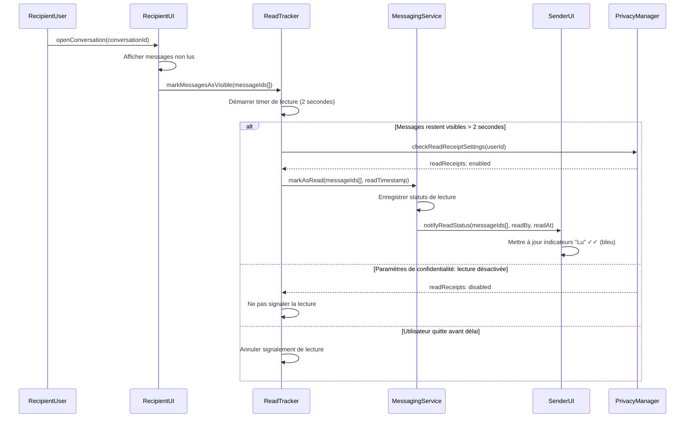
```mermaid
sequenceDiagram
    participant RecipientUser
    participant RecipientUI
    participant ReadTracker
    participant MessagingService
    participant SenderUI
    participant PrivacyManager
    
    RecipientUser->>RecipientUI: openConversation(conversationId)
    RecipientUI->>RecipientUI: Afficher messages non lus
    
    RecipientUI->>ReadTracker: markMessagesAsVisible(messageIds[])
    ReadTracker->>ReadTracker: Démarrer timer de lecture (2 secondes)
    
    alt Messages restent visibles > 2 secondes
        ReadTracker->>PrivacyManager: checkReadReceiptSettings(userId)
        PrivacyManager-->>ReadTracker: readReceipts: enabled
        
        ReadTracker->>MessagingService: markAsRead(messageIds[], readTimestamp)
        MessagingService->>MessagingService: Enregistrer statuts de lecture
        
        MessagingService->>SenderUI: notifyReadStatus(messageIds[], readBy, readAt)
        SenderUI->>SenderUI: Mettre à jour indicateurs "Lu" ✓✓ (bleu)
        
    else Paramètres de confidentialité: lecture désactivée
        PrivacyManager-->>ReadTracker: readReceipts: disabled
        ReadTracker->>ReadTracker: Ne pas signaler la lecture
        
    else Utilisateur quitte avant délai
        ReadTracker->>ReadTracker: Annuler signalement de lecture
    end
```

### 3.2 Gestion de la lecture dans les groupes

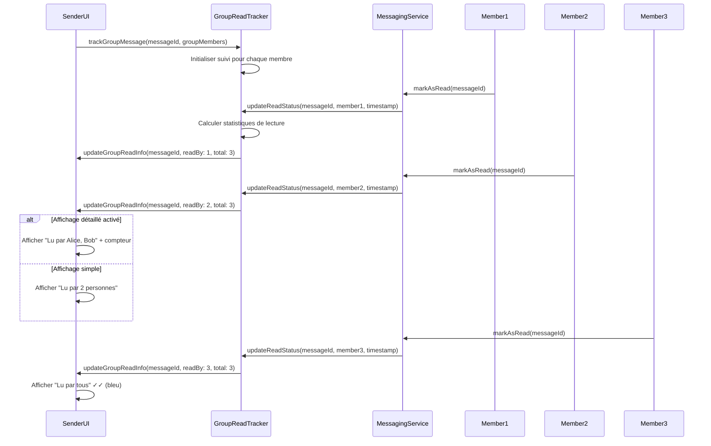
```mermaid
sequenceDiagram
    participant SenderUI
    participant GroupReadTracker
    participant MessagingService
    participant Member1
    participant Member2
    participant Member3
    
    SenderUI->>GroupReadTracker: trackGroupMessage(messageId, groupMembers)
    GroupReadTracker->>GroupReadTracker: Initialiser suivi pour chaque membre
    
    Member1->>MessagingService: markAsRead(messageId)
    MessagingService->>GroupReadTracker: updateReadStatus(messageId, member1, timestamp)
    
    GroupReadTracker->>GroupReadTracker: Calculer statistiques de lecture
    GroupReadTracker->>SenderUI: updateGroupReadInfo(messageId, readBy: 1, total: 3)
    
    Member2->>MessagingService: markAsRead(messageId)
    MessagingService->>GroupReadTracker: updateReadStatus(messageId, member2, timestamp)
    GroupReadTracker->>SenderUI: updateGroupReadInfo(messageId, readBy: 2, total: 3)
    
    alt Affichage détaillé activé
        SenderUI->>SenderUI: Afficher "Lu par Alice, Bob" + compteur
    else Affichage simple
        SenderUI->>SenderUI: Afficher "Lu par 2 personnes"
    end
    
    Member3->>MessagingService: markAsRead(messageId)
    MessagingService->>GroupReadTracker: updateReadStatus(messageId, member3, timestamp)
    GroupReadTracker->>SenderUI: updateGroupReadInfo(messageId, readBy: 3, total: 3)
    
    SenderUI->>SenderUI: Afficher "Lu par tous" ✓✓ (bleu)
```

### 3.3 Interface de consultation des statuts de lecture

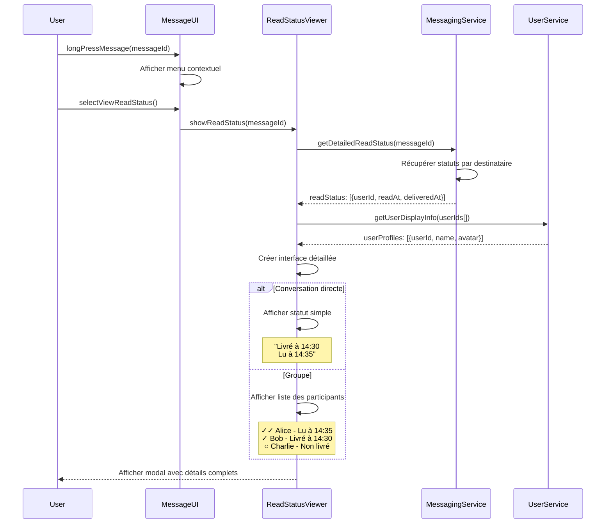
```mermaid
sequenceDiagram
    participant User
    participant MessageUI
    participant ReadStatusViewer
    participant MessagingService
    participant UserService
    
    User->>MessageUI: longPressMessage(messageId)
    MessageUI->>MessageUI: Afficher menu contextuel
    User->>MessageUI: selectViewReadStatus()
    
    MessageUI->>ReadStatusViewer: showReadStatus(messageId)
    ReadStatusViewer->>MessagingService: getDetailedReadStatus(messageId)
    
    MessagingService->>MessagingService: Récupérer statuts par destinataire
    MessagingService-->>ReadStatusViewer: readStatus: [{userId, readAt, deliveredAt}]
    
    ReadStatusViewer->>UserService: getUserDisplayInfo(userIds[])
    UserService-->>ReadStatusViewer: userProfiles: [{userId, name, avatar}]
    
    ReadStatusViewer->>ReadStatusViewer: Créer interface détaillée
    
    alt Conversation directe
        ReadStatusViewer->>ReadStatusViewer: Afficher statut simple
        Note over ReadStatusViewer: "Livré à 14:30<br/>Lu à 14:35"
        
    else Groupe
        ReadStatusViewer->>ReadStatusViewer: Afficher liste des participants
        Note over ReadStatusViewer: ✓✓ Alice - Lu à 14:35<br/>✓ Bob - Livré à 14:30<br/>○ Charlie - Non livré
    end
    
    ReadStatusViewer-->>User: Afficher modal avec détails complets
```

### 3.4 Règles de confidentialité pour les statuts de lecture

#### Paramètres utilisateur
- **Accusés de lecture activés**: Signaler quand l'utilisateur lit les messages
- **Accusés de lecture désactivés**: Ne pas signaler les lectures, mais voir celles des autres
- **Réciproque**: Ne voir les accusés des autres que si on envoie les siens
- **Groupes spécifiques**: Paramètres différents par conversation

#### Comportements spéciaux
- **Messages éphémères**: Accusés de lecture obligatoires pour confirmer consultation
- **Médias**: Lecture confirmée seulement après ouverture complète du média
- **Conversations silencieuses**: Accusés retardés selon paramètres de notification

## 4. Indicateurs de frappe

### 4.1 Détection et signalisation de frappe

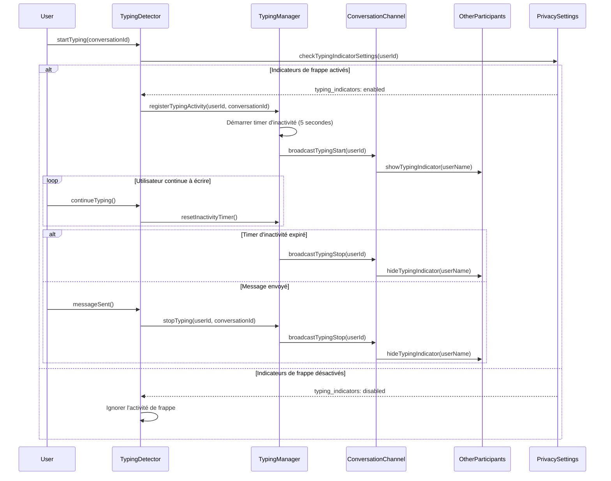
```mermaid
sequenceDiagram
    participant User
    participant TypingDetector
    participant TypingManager
    participant ConversationChannel
    participant OtherParticipants
    participant PrivacySettings
    
    User->>TypingDetector: startTyping(conversationId)
    TypingDetector->>PrivacySettings: checkTypingIndicatorSettings(userId)
    
    alt Indicateurs de frappe activés
        PrivacySettings-->>TypingDetector: typing_indicators: enabled
        
        TypingDetector->>TypingManager: registerTypingActivity(userId, conversationId)
        TypingManager->>TypingManager: Démarrer timer d'inactivité (5 secondes)
        
        TypingManager->>ConversationChannel: broadcastTypingStart(userId)
        ConversationChannel->>OtherParticipants: showTypingIndicator(userName)
        
        loop Utilisateur continue à écrire
            User->>TypingDetector: continueTyping()
            TypingDetector->>TypingManager: resetInactivityTimer()
        end
        
        alt Timer d'inactivité expiré
            TypingManager->>ConversationChannel: broadcastTypingStop(userId)
            ConversationChannel->>OtherParticipants: hideTypingIndicator(userName)
            
        else Message envoyé
            User->>TypingDetector: messageSent()
            TypingDetector->>TypingManager: stopTyping(userId, conversationId)
            TypingManager->>ConversationChannel: broadcastTypingStop(userId)
            ConversationChannel->>OtherParticipants: hideTypingIndicator(userName)
        end
        
        
    else Indicateurs de frappe désactivés
        PrivacySettings-->>TypingDetector: typing_indicators: disabled
        TypingDetector->>TypingDetector: Ignorer l'activité de frappe
    end
```

### 4.2 Gestion des indicateurs multiples

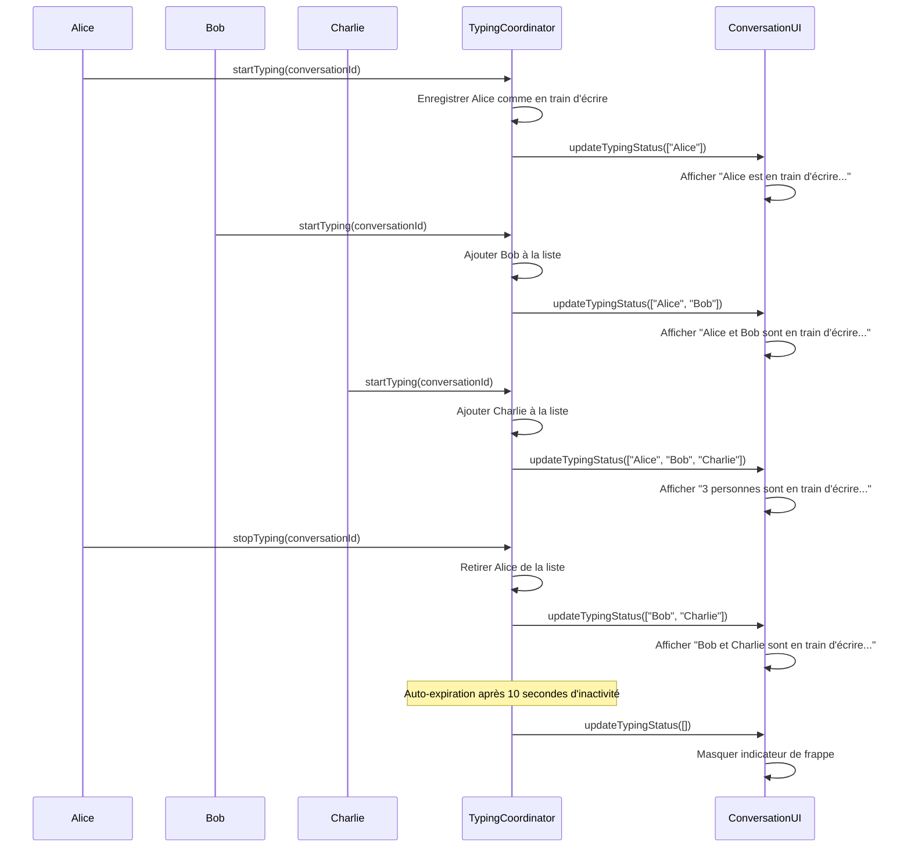
```mermaid
sequenceDiagram
    participant Alice
    participant Bob
    participant Charlie
    participant TypingCoordinator
    participant ConversationUI
    
    Alice->>TypingCoordinator: startTyping(conversationId)
    TypingCoordinator->>TypingCoordinator: Enregistrer Alice comme en train d'écrire
    TypingCoordinator->>ConversationUI: updateTypingStatus(["Alice"])
    ConversationUI->>ConversationUI: Afficher "Alice est en train d'écrire..."
    
    Bob->>TypingCoordinator: startTyping(conversationId)
    TypingCoordinator->>TypingCoordinator: Ajouter Bob à la liste
    TypingCoordinator->>ConversationUI: updateTypingStatus(["Alice", "Bob"])
    ConversationUI->>ConversationUI: Afficher "Alice et Bob sont en train d'écrire..."
    
    Charlie->>TypingCoordinator: startTyping(conversationId)
    TypingCoordinator->>TypingCoordinator: Ajouter Charlie à la liste
    TypingCoordinator->>ConversationUI: updateTypingStatus(["Alice", "Bob", "Charlie"])
    ConversationUI->>ConversationUI: Afficher "3 personnes sont en train d'écrire..."
    
    Alice->>TypingCoordinator: stopTyping(conversationId)
    TypingCoordinator->>TypingCoordinator: Retirer Alice de la liste
    TypingCoordinator->>ConversationUI: updateTypingStatus(["Bob", "Charlie"])
    ConversationUI->>ConversationUI: Afficher "Bob et Charlie sont en train d'écrire..."
    
    Note over TypingCoordinator: Auto-expiration après 10 secondes d'inactivité
    TypingCoordinator->>ConversationUI: updateTypingStatus([])
    ConversationUI->>ConversationUI: Masquer indicateur de frappe
```

### 4.3 Optimisations et limitation de bande passante

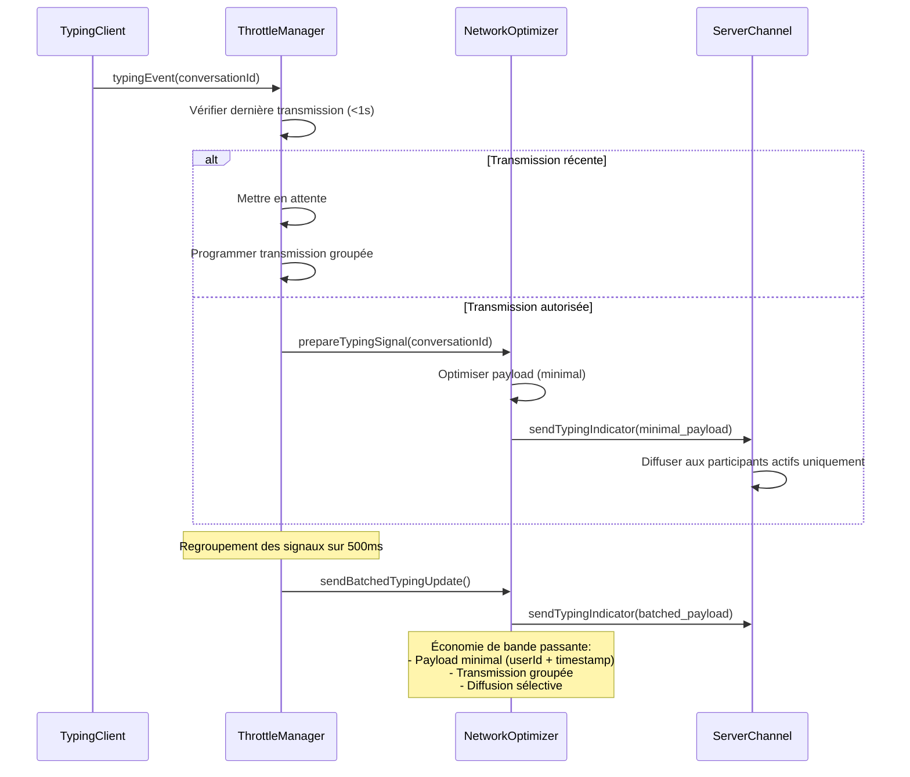
```mermaid
sequenceDiagram
    participant TypingClient
    participant ThrottleManager
    participant NetworkOptimizer
    participant ServerChannel
    
    TypingClient->>ThrottleManager: typingEvent(conversationId)
    ThrottleManager->>ThrottleManager: Vérifier dernière transmission (<1s)
    
    alt Transmission récente
        ThrottleManager->>ThrottleManager: Mettre en attente
        ThrottleManager->>ThrottleManager: Programmer transmission groupée
        
    else Transmission autorisée
        ThrottleManager->>NetworkOptimizer: prepareTypingSignal(conversationId)
        NetworkOptimizer->>NetworkOptimizer: Optimiser payload (minimal)
        
        NetworkOptimizer->>ServerChannel: sendTypingIndicator(minimal_payload)
        ServerChannel->>ServerChannel: Diffuser aux participants actifs uniquement
    end
    
    Note over ThrottleManager: Regroupement des signaux sur 500ms
    
    ThrottleManager->>NetworkOptimizer: sendBatchedTypingUpdate()
    NetworkOptimizer->>ServerChannel: sendTypingIndicator(batched_payload)
    
    Note over NetworkOptimizer: Économie de bande passante:<br/>- Payload minimal (userId + timestamp)<br/>- Transmission groupée<br/>- Diffusion sélective
```

### 4.4 Interface utilisateur des indicateurs

#### Styles visuels
- **Indicateur simple**: "Alice est en train d'écrire..." avec animation de points
- **Indicateurs multiples**: "Alice et Bob sont en train d'écrire..."
- **Groupe nombreux**: "3 personnes sont en train d'écrire..."
- **Animation**: Points de suspension animés (...) ou bulle pulsante

#### Positionnement et comportement
- Affiché sous le dernier message de la conversation
- Disparition automatique après 10 secondes d'inactivité
- Masqué lors de la composition par l'utilisateur local
- Priorité aux nouveaux messages (indicateur masqué si nouveau message reçu)

## 5. Gestion de la présence

### 5.1 Suivi de l'activité utilisateur

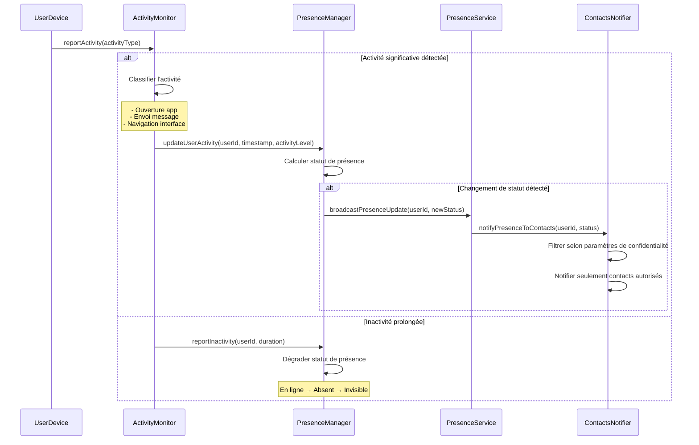
```mermaid
sequenceDiagram
    participant UserDevice
    participant ActivityMonitor
    participant PresenceManager
    participant PresenceService
    participant ContactsNotifier
    
    UserDevice->>ActivityMonitor: reportActivity(activityType)
    
    alt Activité significative détectée
        ActivityMonitor->>ActivityMonitor: Classifier l'activité
        Note over ActivityMonitor: - Ouverture app<br/>- Envoi message<br/>- Navigation interface
        
        ActivityMonitor->>PresenceManager: updateUserActivity(userId, timestamp, activityLevel)
        PresenceManager->>PresenceManager: Calculer statut de présence
        
        alt Changement de statut détecté
            PresenceManager->>PresenceService: broadcastPresenceUpdate(userId, newStatus)
            
            PresenceService->>ContactsNotifier: notifyPresenceToContacts(userId, status)
            ContactsNotifier->>ContactsNotifier: Filtrer selon paramètres de confidentialité
            ContactsNotifier->>ContactsNotifier: Notifier seulement contacts autorisés
        end
        
    else Inactivité prolongée
        ActivityMonitor->>PresenceManager: reportInactivity(userId, duration)
        PresenceManager->>PresenceManager: Dégrader statut de présence
        Note over PresenceManager: En ligne → Absent → Invisible
    end
```

### 5.2 Statuts de présence et règles de transition

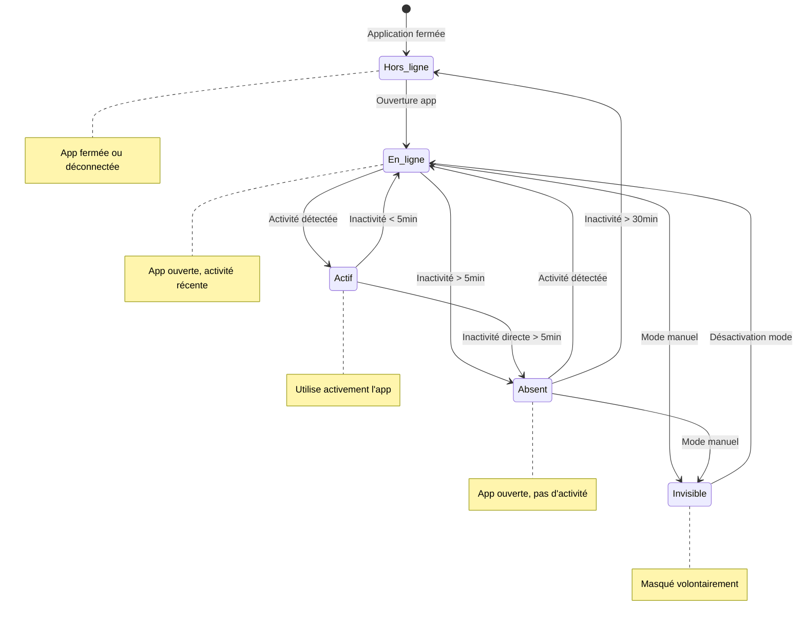
```mermaid
stateDiagram-v2
    [*] --> Hors_ligne : Application fermée
    Hors_ligne --> En_ligne : Ouverture app
    En_ligne --> Actif : Activité détectée
    Actif --> En_ligne : Inactivité < 5min
    En_ligne --> Absent : Inactivité > 5min
    Absent --> En_ligne : Activité détectée
    Absent --> Hors_ligne : Inactivité > 30min
    Actif --> Absent : Inactivité directe > 5min
    
    En_ligne --> Invisible : Mode manuel
    Absent --> Invisible : Mode manuel
    Invisible --> En_ligne : Désactivation mode
    
    note right of Actif : Utilise activement l'app
    note right of En_ligne : App ouverte, activité récente
    note right of Absent : App ouverte, pas d'activité
    note right of Invisible : Masqué volontairement
    note right of Hors_ligne : App fermée ou déconnectée
```

### 5.3 Configuration des paramètres de présence

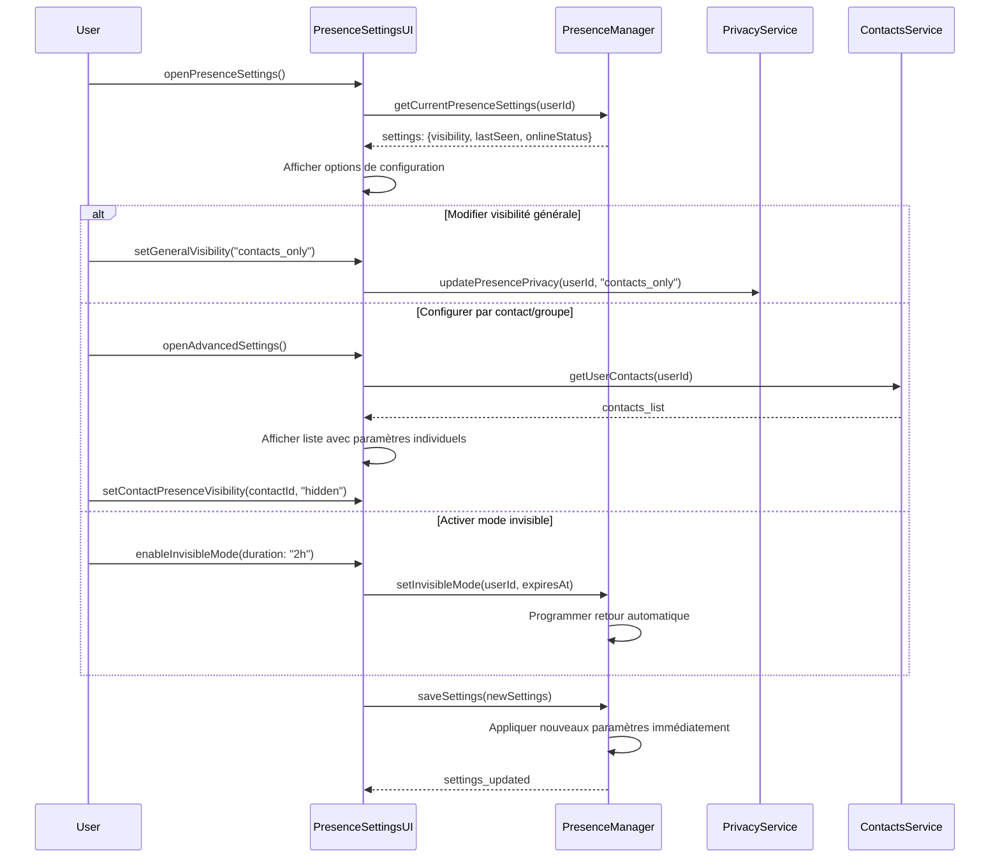
```mermaid
sequenceDiagram
    participant User
    participant PresenceSettingsUI
    participant PresenceManager
    participant PrivacyService
    participant ContactsService
    
    User->>PresenceSettingsUI: openPresenceSettings()
    PresenceSettingsUI->>PresenceManager: getCurrentPresenceSettings(userId)
    PresenceManager-->>PresenceSettingsUI: settings: {visibility, lastSeen, onlineStatus}
    
    PresenceSettingsUI->>PresenceSettingsUI: Afficher options de configuration
    
    alt Modifier visibilité générale
        User->>PresenceSettingsUI: setGeneralVisibility("contacts_only")
        PresenceSettingsUI->>PrivacyService: updatePresencePrivacy(userId, "contacts_only")
        
    else Configurer par contact/groupe
        User->>PresenceSettingsUI: openAdvancedSettings()
        PresenceSettingsUI->>ContactsService: getUserContacts(userId)
        ContactsService-->>PresenceSettingsUI: contacts_list
        
        PresenceSettingsUI->>PresenceSettingsUI: Afficher liste avec paramètres individuels
        User->>PresenceSettingsUI: setContactPresenceVisibility(contactId, "hidden")
        
    else Activer mode invisible
        User->>PresenceSettingsUI: enableInvisibleMode(duration: "2h")
        PresenceSettingsUI->>PresenceManager: setInvisibleMode(userId, expiresAt)
        PresenceManager->>PresenceManager: Programmer retour automatique
    end
    
    PresenceSettingsUI->>PresenceManager: saveSettings(newSettings)
    PresenceManager->>PresenceManager: Appliquer nouveaux paramètres immédiatement
    PresenceManager-->>PresenceSettingsUI: settings_updated
```

### 5.4 Affichage de la présence dans l'interface

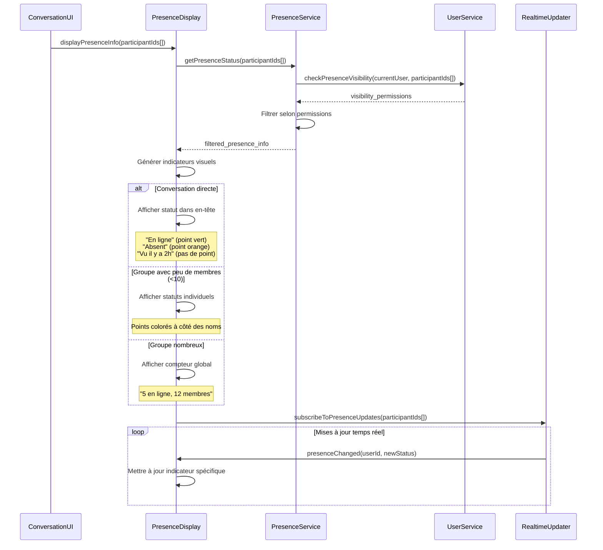
```mermaid
sequenceDiagram
    participant ConversationUI
    participant PresenceDisplay
    participant PresenceService
    participant UserService
    participant RealtimeUpdater
    
    ConversationUI->>PresenceDisplay: displayPresenceInfo(participantIds[])
    PresenceDisplay->>PresenceService: getPresenceStatus(participantIds[])
    
    PresenceService->>UserService: checkPresenceVisibility(currentUser, participantIds[])
    UserService-->>PresenceService: visibility_permissions
    
    PresenceService->>PresenceService: Filtrer selon permissions
    PresenceService-->>PresenceDisplay: filtered_presence_info
    
    PresenceDisplay->>PresenceDisplay: Générer indicateurs visuels
    
    alt Conversation directe
        PresenceDisplay->>PresenceDisplay: Afficher statut dans en-tête
        Note over PresenceDisplay: "En ligne" (point vert)<br/>"Absent" (point orange)<br/>"Vu il y a 2h" (pas de point)
        
    else Groupe avec peu de membres (<10)
        PresenceDisplay->>PresenceDisplay: Afficher statuts individuels
        Note over PresenceDisplay: Points colorés à côté des noms
        
    else Groupe nombreux
        PresenceDisplay->>PresenceDisplay: Afficher compteur global
        Note over PresenceDisplay: "5 en ligne, 12 membres"
    end
    
    PresenceDisplay->>RealtimeUpdater: subscribeToPresenceUpdates(participantIds[])
    
    loop Mises à jour temps réel
        RealtimeUpdater->>PresenceDisplay: presenceChanged(userId, newStatus)
        PresenceDisplay->>PresenceDisplay: Mettre à jour indicateur spécifique
    end
```

## 6. Paramètres de confidentialité et contrôles

### 6.1 Interface de configuration globale

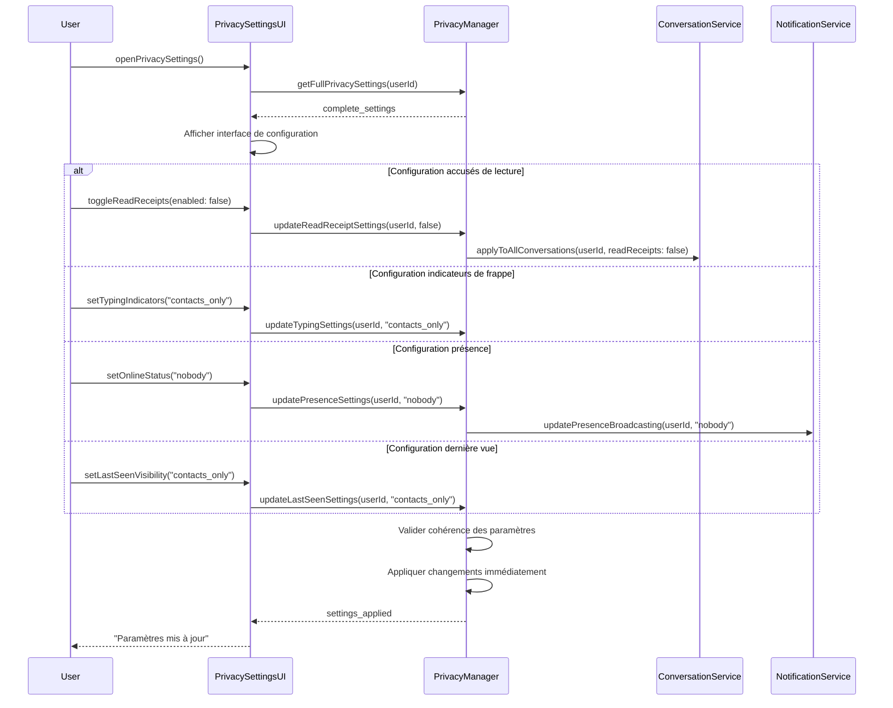
```mermaid
sequenceDiagram
    participant User
    participant PrivacySettingsUI
    participant PrivacyManager
    participant ConversationService
    participant NotificationService
    
    User->>PrivacySettingsUI: openPrivacySettings()
    PrivacySettingsUI->>PrivacyManager: getFullPrivacySettings(userId)
    PrivacyManager-->>PrivacySettingsUI: complete_settings
    
    PrivacySettingsUI->>PrivacySettingsUI: Afficher interface de configuration
    
    alt Configuration accusés de lecture
        User->>PrivacySettingsUI: toggleReadReceipts(enabled: false)
        PrivacySettingsUI->>PrivacyManager: updateReadReceiptSettings(userId, false)
        PrivacyManager->>ConversationService: applyToAllConversations(userId, readReceipts: false)
        
    else Configuration indicateurs de frappe
        User->>PrivacySettingsUI: setTypingIndicators("contacts_only")
        PrivacySettingsUI->>PrivacyManager: updateTypingSettings(userId, "contacts_only")
        
    else Configuration présence
        User->>PrivacySettingsUI: setOnlineStatus("nobody")
        PrivacySettingsUI->>PrivacyManager: updatePresenceSettings(userId, "nobody")
        PrivacyManager->>NotificationService: updatePresenceBroadcasting(userId, "nobody")
        
    else Configuration dernière vue
        User->>PrivacySettingsUI: setLastSeenVisibility("contacts_only")
        PrivacySettingsUI->>PrivacyManager: updateLastSeenSettings(userId, "contacts_only")
    end
    
    PrivacyManager->>PrivacyManager: Valider cohérence des paramètres
    PrivacyManager->>PrivacyManager: Appliquer changements immédiatement
    PrivacyManager-->>PrivacySettingsUI: settings_applied
    
    PrivacySettingsUI-->>User: "Paramètres mis à jour"
```

### 6.2 Matrice de visibilité et règles

| Paramètre | Tout le monde | Contacts | Personne | Notes |
|-----------|---------------|----------|----------|-------|
| **Accusés de lecture** | ✓ | ✓ | ✓ | Réciproque possible |
| **Indicateurs de frappe** | ✓ | ✓ | ✓ | Temps réel uniquement |
| **Statut en ligne** | ✓ | ✓ | ✓ | Peut être forcé invisible |
| **Dernière vue** | ✓ | ✓ | ✓ | Granularité configurable |
| **Livraison de message** | Non configurable | Non configurable | Non configurable | Toujours visible expéditeur |

### 6.3 Paramètres par conversation

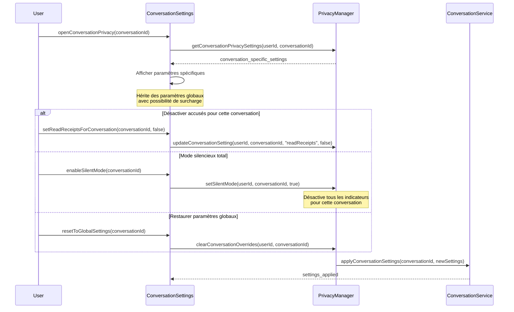
```mermaid
sequenceDiagram
    participant User
    participant ConversationSettings
    participant PrivacyManager
    participant ConversationService
    
    User->>ConversationSettings: openConversationPrivacy(conversationId)
    ConversationSettings->>PrivacyManager: getConversationPrivacySettings(userId, conversationId)
    PrivacyManager-->>ConversationSettings: conversation_specific_settings
    
    ConversationSettings->>ConversationSettings: Afficher paramètres spécifiques
    Note over ConversationSettings: Hérite des paramètres globaux<br/>avec possibilité de surcharge
    
    alt Désactiver accusés pour cette conversation
        User->>ConversationSettings: setReadReceiptsForConversation(conversationId, false)
        ConversationSettings->>PrivacyManager: updateConversationSetting(userId, conversationId, "readReceipts", false)
        
    else Mode silencieux total
        User->>ConversationSettings: enableSilentMode(conversationId)
        ConversationSettings->>PrivacyManager: setSilentMode(userId, conversationId, true)
        Note over PrivacyManager: Désactive tous les indicateurs<br/>pour cette conversation
        
    else Restaurer paramètres globaux
        User->>ConversationSettings: resetToGlobalSettings(conversationId)
        ConversationSettings->>PrivacyManager: clearConversationOverrides(userId, conversationId)
    end
    
    PrivacyManager->>ConversationService: applyConversationSettings(conversationId, newSettings)
    ConversationService-->>ConversationSettings: settings_applied
```

## 7. Synchronisation multi-appareils

### 7.1 Propagation des statuts entre appareils

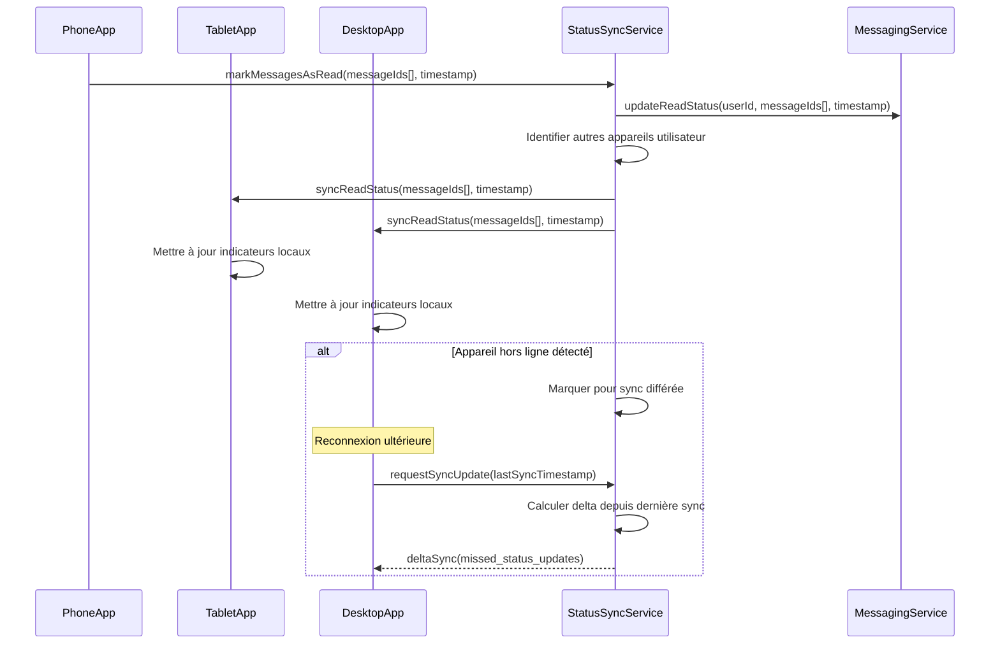
```mermaid
sequenceDiagram
    participant PhoneApp
    participant TabletApp
    participant DesktopApp
    participant StatusSyncService
    participant MessagingService
    
    PhoneApp->>StatusSyncService: markMessagesAsRead(messageIds[], timestamp)
    StatusSyncService->>MessagingService: updateReadStatus(userId, messageIds[], timestamp)
    
    StatusSyncService->>StatusSyncService: Identifier autres appareils utilisateur
    StatusSyncService->>TabletApp: syncReadStatus(messageIds[], timestamp)
    StatusSyncService->>DesktopApp: syncReadStatus(messageIds[], timestamp)
    
    TabletApp->>TabletApp: Mettre à jour indicateurs locaux
    DesktopApp->>DesktopApp: Mettre à jour indicateurs locaux
    
    alt Appareil hors ligne détecté
        StatusSyncService->>StatusSyncService: Marquer pour sync différée
        
        Note over DesktopApp: Reconnexion ultérieure
        DesktopApp->>StatusSyncService: requestSyncUpdate(lastSyncTimestamp)
        StatusSyncService->>StatusSyncService: Calculer delta depuis dernière sync
        StatusSyncService-->>DesktopApp: deltaSync(missed_status_updates)
    end
```

### 7.2 Gestion des conflits de statuts

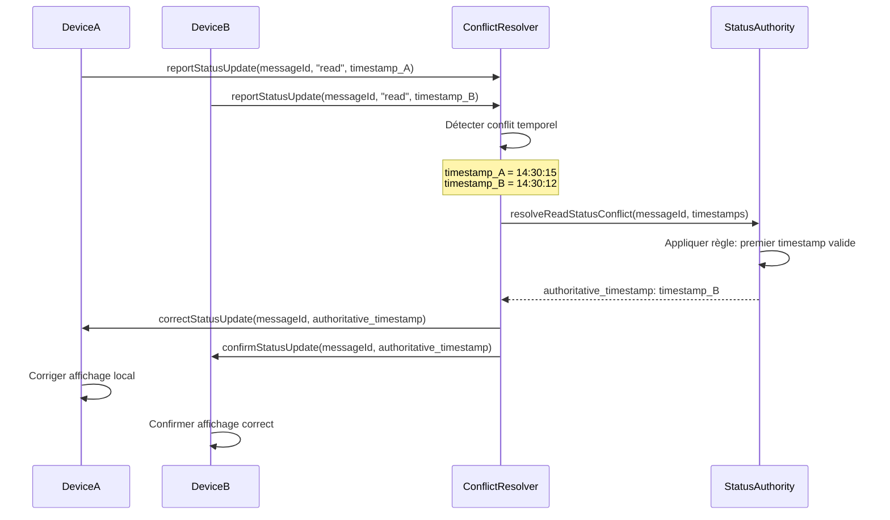
```mermaid
sequenceDiagram
    participant DeviceA
    participant DeviceB
    participant ConflictResolver
    participant StatusAuthority
    
    DeviceA->>ConflictResolver: reportStatusUpdate(messageId, "read", timestamp_A)
    DeviceB->>ConflictResolver: reportStatusUpdate(messageId, "read", timestamp_B)
    
    ConflictResolver->>ConflictResolver: Détecter conflit temporel
    Note over ConflictResolver: timestamp_A = 14:30:15<br/>timestamp_B = 14:30:12
    
    ConflictResolver->>StatusAuthority: resolveReadStatusConflict(messageId, timestamps)
    StatusAuthority->>StatusAuthority: Appliquer règle: premier timestamp valide
    StatusAuthority-->>ConflictResolver: authoritative_timestamp: timestamp_B
    
    ConflictResolver->>DeviceA: correctStatusUpdate(messageId, authoritative_timestamp)
    ConflictResolver->>DeviceB: confirmStatusUpdate(messageId, authoritative_timestamp)
    
    DeviceA->>DeviceA: Corriger affichage local
    DeviceB->>DeviceB: Confirmer affichage correct
```

### 7.3 Optimisation de la synchronisation

#### Stratégies d'optimisation
- **Agrégation des mises à jour**: Groupement des changements de statut sur 500ms
- **Compression des données**: Utilisation d'identifiants courts et payloads minimaux
- **Sync différentielle**: Transmission uniquement des changements depuis dernière sync
- **Priorisation**: Statuts de lecture prioritaires sur les indicateurs de frappe

#### Gestion de la bande passante
- **Mode économie**: Réduction de la fréquence des mises à jour en cas de connexion limitée
- **Sync intelligente**: Détection des appareils actifs pour éviter sync inutiles
- **Cache local**: Stockage des statuts pour éviter requêtes répétées

## 8. Intégration avec les autres services

### 8.1 Interface avec User Service

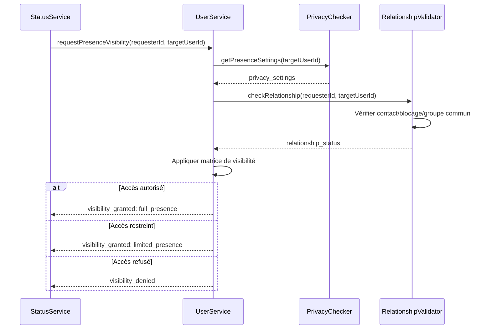
```mermaid
sequenceDiagram
    participant StatusService
    participant UserService
    participant PrivacyChecker
    participant RelationshipValidator
    
    StatusService->>UserService: requestPresenceVisibility(requesterId, targetUserId)
    UserService->>PrivacyChecker: getPresenceSettings(targetUserId)
    PrivacyChecker-->>UserService: privacy_settings
    
    UserService->>RelationshipValidator: checkRelationship(requesterId, targetUserId)
    RelationshipValidator->>RelationshipValidator: Vérifier contact/blocage/groupe commun
    RelationshipValidator-->>UserService: relationship_status
    
    UserService->>UserService: Appliquer matrice de visibilité
    
    alt Accès autorisé
        UserService-->>StatusService: visibility_granted: full_presence
    else Accès restreint
        UserService-->>StatusService: visibility_granted: limited_presence
    else Accès refusé
        UserService-->>StatusService: visibility_denied
    end
```

### 8.2 Interface avec Notification Service

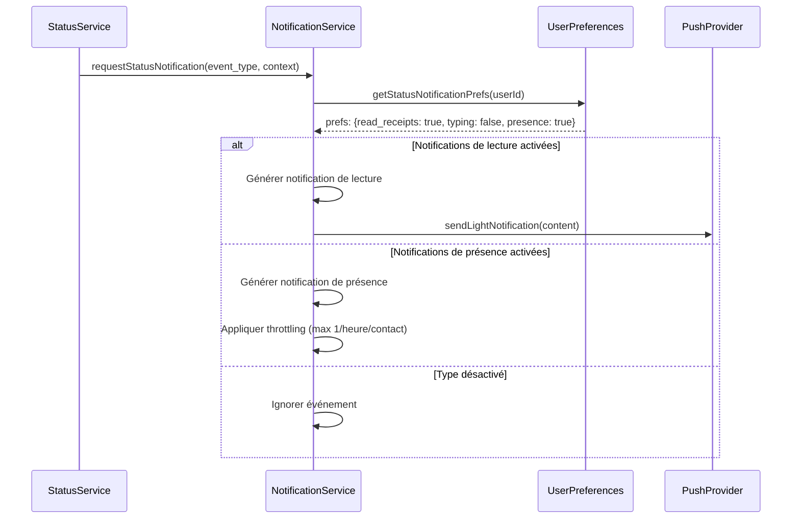
```mermaid
sequenceDiagram
    participant StatusService
    participant NotificationService
    participant UserPreferences
    participant PushProvider
    
    StatusService->>NotificationService: requestStatusNotification(event_type, context)
    NotificationService->>UserPreferences: getStatusNotificationPrefs(userId)
    
    UserPreferences-->>NotificationService: prefs: {read_receipts: true, typing: false, presence: true}
    
    alt Notifications de lecture activées
        NotificationService->>NotificationService: Générer notification de lecture
        NotificationService->>PushProvider: sendLightNotification(content)
        
    else Notifications de présence activées
        NotificationService->>NotificationService: Générer notification de présence
        NotificationService->>NotificationService: Appliquer throttling (max 1/heure/contact)
        
    else Type désactivé
        NotificationService->>NotificationService: Ignorer événement
    end
```

## 9. Considérations techniques

### 9.1 Architecture de données

#### Tables de suivi des statuts
```sql
-- Statuts de livraison et lecture
CREATE TABLE delivery_statuses (
    id UUID PRIMARY KEY DEFAULT uuid_generate_v4(),
    message_id UUID NOT NULL REFERENCES messages(id) ON DELETE CASCADE,
    user_id UUID NOT NULL,
    device_id VARCHAR(100),
    delivered_at TIMESTAMP,
    read_at TIMESTAMP,
    created_at TIMESTAMP NOT NULL DEFAULT NOW(),
    UNIQUE(message_id, user_id, device_id)
);

-- Activité de frappe
CREATE TABLE typing_activity (
    id UUID PRIMARY KEY DEFAULT uuid_generate_v4(),
    conversation_id UUID NOT NULL,
    user_id UUID NOT NULL,
    started_at TIMESTAMP NOT NULL DEFAULT NOW(),
    last_activity TIMESTAMP NOT NULL DEFAULT NOW(),
    is_active BOOLEAN NOT NULL DEFAULT TRUE,
    UNIQUE(conversation_id, user_id)
);

-- Présence utilisateur
CREATE TABLE user_presence (
    user_id UUID PRIMARY KEY,
    status VARCHAR(20) NOT NULL DEFAULT 'offline',
    last_activity TIMESTAMP NOT NULL DEFAULT NOW(),
    invisible_until TIMESTAMP,
    device_info JSONB DEFAULT '{}',
    updated_at TIMESTAMP NOT NULL DEFAULT NOW()
);

-- Paramètres de confidentialité des statuts
CREATE TABLE status_privacy_settings (
    id UUID PRIMARY KEY DEFAULT uuid_generate_v4(),
    user_id UUID NOT NULL,
    read_receipts_visibility VARCHAR(20) DEFAULT 'everyone',
    typing_indicators_visibility VARCHAR(20) DEFAULT 'everyone',
    online_status_visibility VARCHAR(20) DEFAULT 'contacts',
    last_seen_visibility VARCHAR(20) DEFAULT 'contacts',
    read_receipts_enabled BOOLEAN DEFAULT TRUE,
    typing_indicators_enabled BOOLEAN DEFAULT TRUE,
    updated_at TIMESTAMP NOT NULL DEFAULT NOW(),
    UNIQUE(user_id)
);
```

#### Index pour optimisation
```sql
-- Optimisations pour les statuts de lecture
CREATE INDEX idx_delivery_statuses_message_user ON delivery_statuses(message_id, user_id);
CREATE INDEX idx_delivery_statuses_read_at ON delivery_statuses(read_at) WHERE read_at IS NOT NULL;

-- Optimisations pour la frappe
CREATE INDEX idx_typing_activity_conversation ON typing_activity(conversation_id, is_active);
CREATE INDEX idx_typing_activity_cleanup ON typing_activity(last_activity) WHERE is_active = true;

-- Optimisations pour la présence
CREATE INDEX idx_user_presence_status ON user_presence(status, last_activity);
CREATE INDEX idx_user_presence_online ON user_presence(user_id) WHERE status IN ('online', 'active');
```

### 9.2 Cache Redis et optimisations

#### Structures de cache
```redis
# Cache des statuts de présence (TTL: 5 minutes)
presence:user:{userId} = {
  "status": "online",
  "lastActivity": "2025-05-25T10:30:00Z",
  "devices": ["phone", "desktop"]
}

# Cache des indicateurs de frappe (TTL: 10 secondes)
typing:conversation:{conversationId} = [
  {"userId": "user1", "startedAt": "2025-05-25T10:30:15Z"},
  {"userId": "user2", "startedAt": "2025-05-25T10:30:18Z"}
]

# Cache des paramètres de confidentialité (TTL: 1 heure)
privacy:status:{userId} = {
  "readReceipts": "everyone",
  "typingIndicators": "contacts",
  "onlineStatus": "contacts",
  "lastSeen": "contacts"
}

# Cache des statuts de lecture récents (TTL: 30 minutes)
read:message:{messageId} = [
  {"userId": "user1", "readAt": "2025-05-25T10:25:00Z"},
  {"userId": "user2", "readAt": "2025-05-25T10:26:00Z"}
]
```

### 9.3 Workers et tâches de fond

#### Nettoyage des activités expirées
```elixir
defmodule WhisprMessaging.StatusCleanupWorker do
  use GenServer
  
  def handle_info(:cleanup_expired_statuses, state) do
    cleanup_expired_typing_indicators()
    update_stale_presence_statuses()
    schedule_next_cleanup()
    {:noreply, state}
  end
  
  defp cleanup_expired_typing_indicators do
    # Supprimer indicateurs de frappe > 10 secondes
    expiry_time = DateTime.add(DateTime.utc_now(), -10, :second)
    
    TypingActivity
    |> where([t], t.last_activity < ^expiry_time and t.is_active == true)
    |> Repo.update_all(set: [is_active: false])
  end
  
  defp update_stale_presence_statuses do
    # Marquer comme hors ligne les utilisateurs inactifs > 30 minutes
    offline_threshold = DateTime.add(DateTime.utc_now(), -30, :minute)
    
    UserPresence
    |> where([p], p.last_activity < ^offline_threshold and p.status != "offline")
    |> Repo.update_all(set: [status: "offline"])
  end
end
```

## 10. Endpoints API

| Endpoint | Méthode | Description | Paramètres |
|----------|---------|-------------|------------|
| `/api/v1/messages/{id}/read` | POST | Marquer message comme lu | - |
| `/api/v1/messages/{id}/delivery-status` | GET | Statut de livraison détaillé | - |
| `/api/v1/conversations/{id}/typing` | POST | Signaler activité de frappe | `is_typing` (boolean) |
| `/api/v1/conversations/{id}/typing` | GET | Obtenir qui écrit actuellement | - |
| `/api/v1/presence/status` | PUT | Mettre à jour statut de présence | `status`, `invisible_until` |
| `/api/v1/presence/status` | GET | Obtenir son statut actuel | - |
| `/api/v1/presence/contacts` | GET | Présence des contacts | `contact_ids[]` |
| `/api/v1/privacy/status-settings` | GET | Paramètres de confidentialité | - |
| `/api/v1/privacy/status-settings` | PUT | Modifier paramètres | Corps avec nouveaux paramètres |
| `/api/v1/conversations/{id}/status-settings` | PUT | Paramètres par conversation | Corps avec surcharges |

## 11. Tests et validation

### 11.1 Tests fonctionnels
- **Accusés de réception**: Validation du cycle complet envoi → livraison → lecture
- **Indicateurs de frappe**: Tests de timing et d'expiration automatique
- **Présence**: Vérification des transitions d'état selon l'activité
- **Confidentialité**: Validation du respect des paramètres de visibilité

### 11.2 Tests de performance
- **Latence des statuts**: Temps de propagation des indicateurs temps réel
- **Charge des indicateurs**: Performance avec nombreux utilisateurs simultanés
- **Cache efficiency**: Taux de hit/miss pour les données de statut
- **Nettoyage automatique**: Performance des workers de maintenance

### 11.3 Tests de synchronisation
- **Multi-appareils**: Cohérence des statuts entre appareils
- **Réconciliation**: Gestion des conflits après reconnexion
- **Réseau dégradé**: Comportement en cas de connectivité limitée

### 11.4 Tests de confidentialité
- **Respect des paramètres**: Vérification que les statuts ne sont pas exposés selon les préférences
- **Changements dynamiques**: Application immédiate des modifications de paramètres
- **Granularité**: Tests des paramètres par contact/groupe

## 12. Livrables

1. **Module de statuts et indicateurs Elixir** comprenant :
   - Système complet d'accusés de réception et de lecture
   - Indicateurs de frappe temps réel avec optimisation réseau
   - Gestion de la présence avec paramètres de confidentialité
   - Synchronisation multi-appareils robuste

2. **Interface utilisateur réactive** pour :
   - Affichage en temps réel des statuts de message
   - Indicateurs visuels de frappe et de présence
   - Configuration intuitive des paramètres de confidentialité
   - Interface de consultation des statuts détaillés

3. **Système de confidentialité granulaire** :
   - Paramètres globaux et par conversation
   - Matrice de visibilité configurable
   - Application en temps réel des changements
   - Respect strict des préférences utilisateur

4. **Infrastructure de performance** :
   - Cache multi-niveaux pour optimiser les performances
   - Workers de nettoyage automatique
   - Optimisations réseau pour les indicateurs temps réel
   - Monitoring et métriques de performance

5. **Documentation complète** :
   - Guide utilisateur pour la configuration des statuts
   - Documentation technique d'intégration
   - Procédures de monitoring et maintenance
   - Tests automatisés et validation de performance