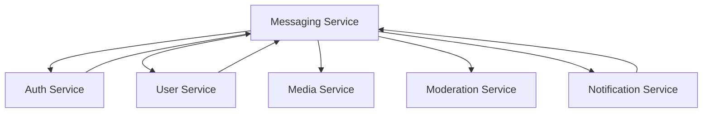

# Plan d'Implémentation - Service Messagerie (Messaging-Service)

## Vue d'ensemble

Ce plan d'implémentation structure le développement du service messagerie sur 12 mois, avec une phase de P.O.C (septembre-décembre) suivie d'une phase d'implémentation complète (janvier-août). Le service messagerie est le cœur de l'application Whispr, gérant la communication temps réel avec chiffrement bout-en-bout.

## Phase 1 : Proof of Concept (Septembre - Décembre 2024)

### 🎯 Objectifs de la phase P.O.C
- Valider l'architecture Elixir/OTP pour le temps réel
- Prototyper les fonctionnalités de messagerie core
- Tester les WebSockets Phoenix avec charge
- Valider l'intégration du chiffrement côté client
- Évaluer les performances de distribution des messages

### Septembre 2024 : Fondations Elixir/OTP

**Semaines 1-2 : Setup Architecture Elixir**
- Configuration environnement Elixir/Phoenix
- Setup du projet avec structure OTP
- Configuration PostgreSQL + Redis + clustering Erlang
- Architecture des superviseurs principaux
- Setup CI/CD pour Elixir

**Semaines 3-4 : Modèle de données et Ecto**
- Implémentation des schémas Ecto (Conversations, Messages)
- Configuration des migrations PostgreSQL
- Setup Redis pour cache et coordination
- Tests unitaires sur les schémas
- Configuration des index de performance

### Octobre 2024 : Messagerie Core et WebSockets

**Semaines 1-2 : Conversations et Messages (P.O.C)**
Fonctionnalités prioritaires P.O.C
- Création/gestion conversations directes
- Envoi/réception messages basiques
- Persistance PostgreSQL avec Ecto
- API REST basique pour conversations

**Semaines 3-4 : WebSockets Phoenix Channels (P.O.C)**
Fonctionnalités prioritaires P.O.C
- Configuration Phoenix Channels pour temps réel
- Canal conversation pour envoi/réception instantané
- Gestion basique des connexions/déconnexions
- Tests de charge initiales WebSockets

### Novembre 2024 : Distribution et État

**Semaines 1-2 : Processus GenServer pour Conversations (P.O.C)**
Fonctionnalités prioritaires P.O.C
- Processus GenServer par conversation active
- État en mémoire pour conversations récentes
- Distribution des messages aux participants
- Supervision OTP basique

**Semaines 3-4 : Statuts de Livraison (P.O.C)**
Fonctionnalités prioritaires P.O.C
- Tracking basique livraison/lecture
- Synchronisation statuts multi-appareils
- API pour mise à jour des statuts
- Cache Redis pour optimisation

### Décembre 2024 : Intégration et Validation

**Semaines 1-2 : Intégration Inter-Services**
- Communication gRPC avec auth-service
- Interface avec user-service pour groupes
- Tests d'intégration avec notification-service
- Validation des contrats d'API

**Semaines 3-4 : Tests et Documentation P.O.C**
- Tests de charge WebSockets (1000+ connexions simultanées)
- Validation résilience processus OTP
- Documentation architecture Phoenix/OTP
- Retour d'expérience et optimisations identifiées

### 📊 Livrables Phase P.O.C
- Architecture Elixir/OTP validée et documentée
- Prototype fonctionnel messagerie temps réel
- Tests de performance WebSockets préliminaires
- Documentation des APIs Phoenix
- Plan détaillé pour la phase d'implémentation

---

## Phase 2 : Implémentation Complète (Janvier - Août 2025)

### 🎯 Objectifs de la phase d'implémentation
- Implémentation complète de toutes les fonctionnalités messagerie
- Architecture distribuée Elixir multi-nœuds
- Intégration chiffrement bout-en-bout côté client
- Performance et résilience production
- Déploiement sur cluster Kubernetes

### Janvier 2025 : Consolidation et Architecture Distribuée

**Semaines 1-2 : Refactoring Post-P.O.C**
- Refactoring basé sur apprentissages P.O.C
- Architecture superviseurs définitive
- Configuration clustering Erlang
- Setup environnements distribués (dev, staging, prod)

**Semaines 3-4 : Conversations Complètes**

Sprint 1 - Conversation Management

Epic: Advanced Conversation Management

Stories:
- Conversations directes et groupes complets
- Métadonnées et paramètres avancés
- Synchronisation avec user-service pour groupes
- Gestion des permissions par conversation
- API complète REST + gRPC

### Février 2025 : Messages Avancés et Résilience

**Semaines 1-2 : Types de Messages et Médias**

Sprint 2 - Message Types & Media

Epic: Advanced Message Handling

Stories:
- Messages texte, médias, système
- Intégration avec media-service
- Messages avec réponses (threading)
- Validation et métadonnées enrichies
- Gestion des pièces jointes

**Semaines 3-4 : Résilience et Distribution OTP**

Sprint 3 - OTP Resilience & Distribution

Epic: Fault Tolerance & Distribution

Stories:
- Clustering Erlang multi-nœuds robuste
- Supervision hiérarchique complète
- Distribution des processus conversations
- Hot-swapping et mise à jour sans interruption
- Monitoring des processus Erlang

### Mars 2025 : Temps Réel et Performance

**Semaines 1-2 : WebSockets Avancés**

Sprint 4 - Advanced Real-time Communication

Epic: WebSocket Optimization & Features

Stories:
- Channels Phoenix optimisés pour scale
- Gestion avancée présence/absence
- Indicateurs de frappe ("typing...")
- Reconnexion automatique intelligente
- Optimisation mémoire/CPU des connexions

**Semaines 3-4 : Performance et Cache**

Sprint 5 - Performance & Caching

Epic: Performance Optimization

Stories:
- Cache Redis multi-niveaux
- Cache ETS/Mnesia pour accès ultra-rapide
- Optimisation requêtes PostgreSQL
- Pagination et lazy loading messages
- Métriques performance temps réel

### Avril 2025 : Fonctionnalités Utilisateur Avancées

**Semaines 1-2 : Messages Spéciaux**

Sprint 6 - Special Messages & Features

Epic: Advanced Message Features

Stories:
- Messages programmés avec scheduler
- Messages éphémères (auto-destruction)
- Messages épinglés par conversation
- Réactions émojis aux messages
- Édition/suppression de messages

**Semaines 3-4 : Recherche et Historique**

Sprint 7 - Search & Message History

Epic: Message Search & History Management

Stories:
- Recherche full-text dans messages (sécurisée)
- Pagination intelligente des conversations
- Export d'historique (format sécurisé)
- Filtrage avancé par type/date
- Index optimisés pour recherche

### Mai 2025 : Intégration Chiffrement et Sécurité

**Semaines 1-2 : Support Chiffrement Bout-en-Bout**

Sprint 8 - E2E Encryption Support

Epic: End-to-End Encryption Integration

Stories:
- Validation côté serveur signatures Signal
- Gestion distribution PreKeys
- Vérification intégrité sans déchiffrement
- Support multi-appareils pour E2E
- API pour échange sécurisé clés

**Semaines 3-4 : Sécurité et Anti-Abus**

Sprint 9 - Security & Anti-Abuse

Epic: Security Hardening

Stories:
- Rate limiting intelligent par utilisateur
- Détection patterns de spam/abus
- Intégration moderation-service
- Circuit breakers et protection surcharge
- Audit trails sécurisés

### Juin 2025 : Synchronisation et Notifications

**Semaines 1-2 : Multi-Appareils Avancé**

Sprint 10 - Advanced Multi-Device Sync

Epic: Multi-Device Synchronization

Stories:
- Synchronisation état entre appareils
- Résolution conflits messages
- Livraison garantie tous appareils
- Gestion des appareils hors ligne
- Optimisation batterie mobile

**Semaines 3-4 : Notifications Push**

Sprint 11 - Push Notifications Integration

Epic: Notification System Integration

Stories:
- Intégration notification-service via gRPC
- Notifications riches avec métadonnées sécurisées
- Paramètres notifications par conversation
- Optimisation délivrance notifications
- Analytics notifications (anonymisées)

### Juillet 2025 : Robustesse et Monitoring

**Semaines 1-2 : Monitoring et Observabilité**

Sprint 12 - Monitoring & Observability

Epic: Production Monitoring

Stories:
- Télémétrie Elixir/OTP complète
- Dashboards Grafana temps réel
- Alerting sur métriques critiques
- Tracing distribué des messages
- Health checks avancés

**Semaines 3-4 : Tests de Charge et Résilience**

Sprint 13 - Load Testing & Resilience

Epic: Production Resilience Testing

Stories:
- Tests de charge massifs (10k+ connexions)
- Tests de défaillance (chaos testing)
- Validation scaling horizontal
- Tests de récupération après panne
- Benchmarking performance complète

### Août 2025 : Production et Stabilisation

**Semaines 1-2 : Préparation Production**

Sprint 14 - Production Readiness

Epic: Production Deployment Preparation

Stories:
- Configuration cluster Kubernetes (GKE)
- Déploiement distributed Elixir
- Configuration secrets et certificats
- Documentation opérationnelle
- Runbooks incidents

**Semaines 3-4 : Go-Live et Stabilisation**

Sprint 15 - Production Launch & Stabilization

Epic: Production Launch

Stories:
- Déploiement production progressif
- Monitoring temps réel actif
- Support et hot-fixes rapides
- Optimisations post-lancement
- Retrospective et documentation finale

---

## 📋 Matrice des Dépendances

### Dépendances Critiques

| Fonctionnalité | Dépend de | Requis pour |
|---------------|-----------|-------------|
| Conversations Base | auth-service | Toutes les fonctionnalités |
| Messages Core | Conversations, user-service | Messages avancés, médias |
| WebSockets Temps Réel | Messages Core | Synchronisation, notifications |
| Distribution OTP | WebSockets | Performance, résilience |
| Messages Médias | media-service | Messages riches |
| Chiffrement E2E | Messages Core | Sécurité communications |
| Notifications Push | notification-service | UX complète |
| Multi-Appareils | WebSockets, Chiffrement | Synchronisation |

### Intégrations Inter-Services

---

## 🛠️ Stack Technique et Outils

### Technologies Principales
- **Backend**: Elixir + Phoenix Framework
- **Communication temps réel**: Phoenix Channels (WebSockets)
- **Base de données**: PostgreSQL 14+ avec partitionnement
- **Cache**: Redis 7+ + ETS/Mnesia
- **Communication**: gRPC + REST
- **ORM**: Ecto pour PostgreSQL
- **Tests**: ExUnit + Property Testing
- **Documentation**: ExDoc + OpenAPI

### Infrastructure
- **Orchestration**: Kubernetes (GKE) avec clustering Erlang
- **CI/CD**: GitHub Actions avec builds Elixir
- **Monitoring**: Prometheus + Grafana + Telemetry
- **Logging**: Loki avec logs structurés Elixir
- **Distribution**: Erlang Distribution + libcluster

### Outils Spécifiques Elixir
- **Phoenix**: Framework web principal
- **GenServer**: Processus d'état pour conversations
- **Supervisor**: Hiérarchie de supervision OTP
- **Registry**: Localisation des processus
- **PubSub**: Distribution des événements
- **Telemetry**: Métriques et observabilité

---

## 📊 Métriques de Succès

### Phase P.O.C
- ✅ 1000+ connexions WebSocket simultanées
- ✅ < 100ms latence envoi message
- ✅ Architecture OTP validée sous charge
- ✅ Intégration gRPC fonctionnelle

### Phase Implémentation
- ✅ 10,000+ connexions WebSocket simultanées
- ✅ < 50ms latence P95 envoi message
- ✅ 99.9% uptime avec clustering
- ✅ Chiffrement E2E intégré et testé
- ✅ Déploiement production multi-nœuds

### Métriques de Performance Cibles

| Métrique | Objectif P.O.C | Objectif Production |
|----------|---------------|-------------------|
| Connexions simultanées | 1,000 | 10,000+ |
| Latence envoi message | < 100ms | < 50ms (P95) |
| Messages par seconde | 1,000 | 10,000+ |
| Temps de reconnexion | < 2s | < 1s |
| Uptime | 95% | 99.9% |
| Mémoire par processus conversation | < 10MB | < 5MB |

---

## ⚠️ Risques et Mitigations

### Risques Techniques

| Risque | Probabilité | Impact | Mitigation |
|--------|-------------|--------|------------|
| Performance WebSockets | Moyenne | Élevé | Tests charge continus, optimisation Elixir |
| Complexité clustering Erlang | Élevée | Élevé | Formation équipe, expertise externe |
| Intégration chiffrement E2E | Moyenne | Critique | Prototypage précoce côté client |
| Résilience processus OTP | Faible | Élevé | Tests défaillance, patterns OTP stricts |

### Risques Planning

| Risque | Probabilité | Impact | Mitigation |
|--------|-------------|--------|------------|
| Courbe d'apprentissage Elixir | Élevée | Moyen | Formation intensive, mentoring |
| Retard intégration inter-services | Moyenne | Élevé | Tests d'intégration précoces |
| Complexité temps réel | Moyenne | Élevé | Architecture simple d'abord |

### Risques Spécifiques Elixir/OTP

| Risque | Probabilité | Impact | Mitigation |
|--------|-------------|--------|------------|
| Gestion mémoire processus | Moyenne | Moyen | Monitoring mémoire, garbage collection tuning |
| Debugging distribué | Élevée | Moyen | Outils de tracing, logs structurés |
| Hot-code reloading | Faible | Élevé | Tests en staging, rollback automatique |

---

## 👥 Équipe et Ressources

### Équipe Core
- **1 Tech Lead Elixir** (temps plein) - Expert OTP/Phoenix
- **2 Développeurs Elixir** (temps plein) - Formation à prévoir
- **1 DevOps** (50% temps) - Spécialisé Kubernetes + Erlang clustering
- **1 Expert Performance** (support ponctuel) - WebSockets et temps réel

### Support
- **Expert Sécurité** (chiffrement E2E)
- **Architecte Système** (intégration services)
- **Expert Frontend** (intégration WebSockets côté client)

### Formation Requise
- **Formation Elixir/OTP**: 40h pour l'équipe
- **Formation Phoenix**: 20h pour l'équipe
- **WebSockets Performance**: 16h pour Tech Lead
- **Clustering Erlang**: 24h pour DevOps + Tech Lead

---

## 📅 Jalons Clés

| Date | Jalon | Critères de succès |
|------|-------|-------------------|
| **Fin Oct 2024** | P.O.C WebSockets | 1000 connexions + messages temps réel |
| **Fin Nov 2024** | P.O.C OTP | Processus GenServer + supervision |
| **Fin Déc 2024** | P.O.C Validé | Intégration + performance validée |
| **Fin Fév 2025** | Architecture Distribuée | Clustering + résilience |
| **Fin Avr 2025** | Fonctionnalités Core | Messages avancés + recherche |
| **Fin Juin 2025** | Intégration Complète | E2E + notifications + sync |
| **Mi-Août 2025** | Production Ready | Tests charge + déploiement |

Ce plan d'implémentation prend en compte la spécificité d'Elixir/OTP pour construire un service de messagerie temps réel robuste et scalable, avec une attention particulière aux aspects de performance, résilience et intégration avec l'écosystème Whispr.