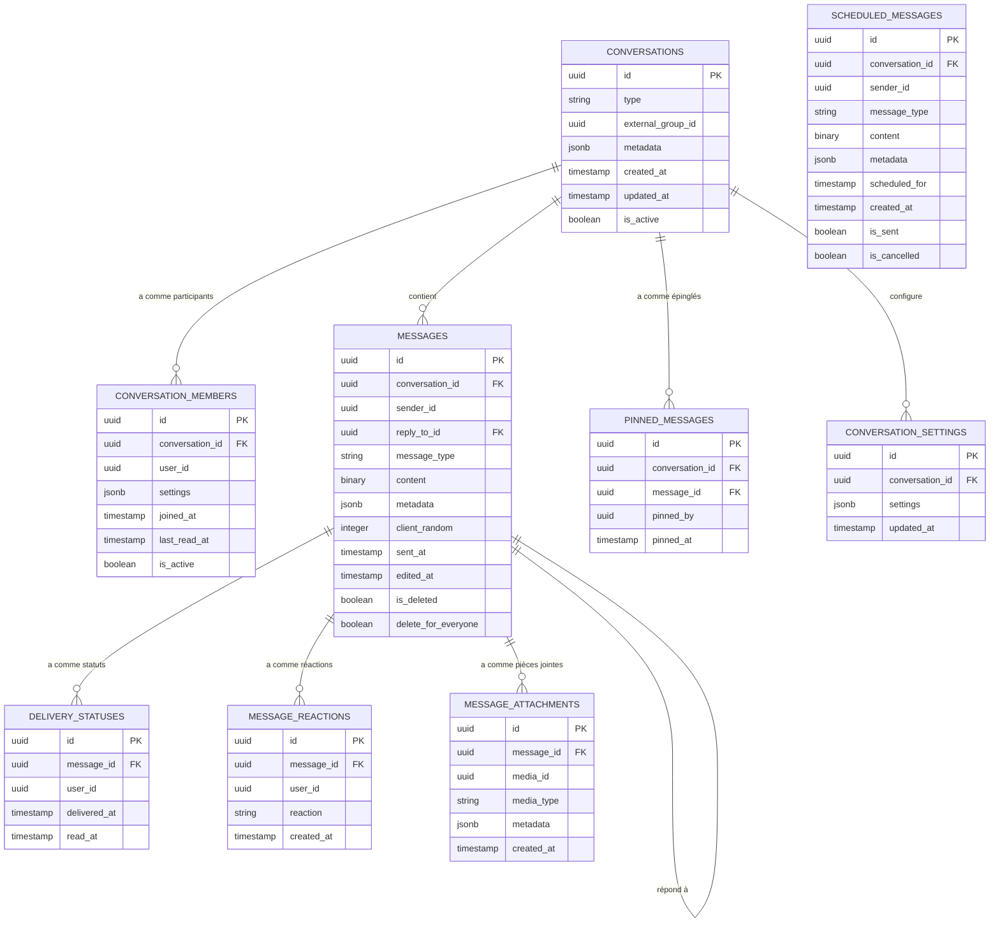
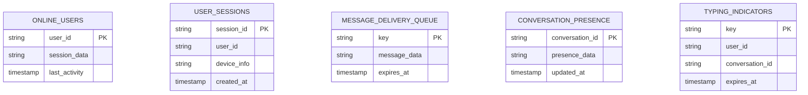
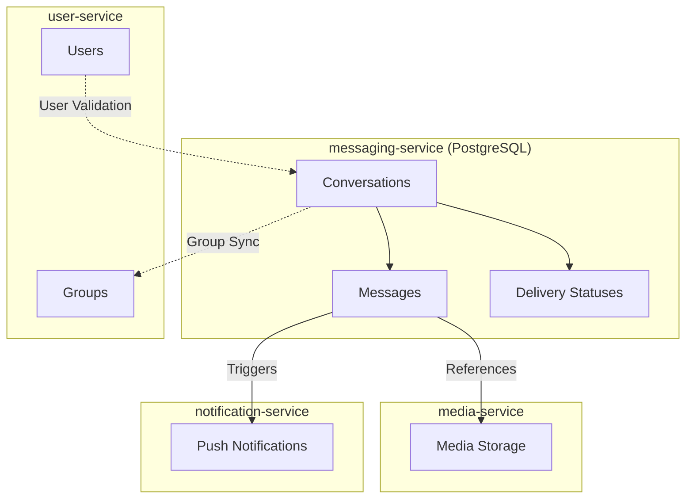

# Database Design

## 1. Introduction et Principes de Conception

### 1.1 Objectif
Ce document décrit la structure de la base de données du service de messagerie (`messaging-service`) de l'application Whispr, en détaillant les modèles de données, les relations, et les considérations de performance pour la gestion des conversations et des messages.

### 1.2 Principes Architecturaux
- **Optimisation pour le temps réel**: Structures conçues pour des opérations à haute fréquence et faible latence
- **Distribution Erlang/OTP**: Support du modèle multi-nœuds d'Elixir pour le scaling horizontal
- **Séparation des domaines**: Données de messagerie isolées des autres services
- **Respect du chiffrement E2E**: Stockage des messages chiffrés sans accès au contenu en clair
- **Haute disponibilité**: Conception permettant la résilience et la continuité de service
- **Performances d'écriture/lecture équilibrées**: Optimisation pour l'envoi et la récupération rapide des messages

### 1.3 Technologies
- **PostgreSQL**: Pour le stockage persistant des conversations et messages
- **Ecto**: ORM pour Elixir utilisé pour l'accès aux données
- **Redis**: Pour les données temporaires et la coordination des nœuds Elixir
- **ETS/Mnesia**: Tables en mémoire d'Erlang pour les données très fréquemment accédées

## 2. Schéma PostgreSQL du Service Messagerie

### 2.1 Vue d'Ensemble



### 2.2 Description des Tables

#### 2.2.1 CONVERSATIONS
Stocke les métadonnées des conversations entre utilisateurs.

| Colonne | Type | Description | Contraintes |
|---------|------|-------------|-------------|
| id | UUID | Identifiant unique de la conversation | PK, NOT NULL |
| type | VARCHAR(20) | Type de conversation ('direct', 'group') | NOT NULL |
| external_group_id | UUID | Référence à un groupe dans user-service (pour les groupes)  | NULL |
| metadata | JSONB | Métadonnées de la conversation (nom pour groupe, etc.) | NOT NULL, DEFAULT '{}' |
| created_at | TIMESTAMP | Date/heure de création de la conversation | NOT NULL |
| updated_at | TIMESTAMP | Date/heure de la dernière activité | NOT NULL |
| is_active | BOOLEAN | Indique si la conversation est active | NOT NULL, DEFAULT TRUE |

**Indices**:
- PRIMARY KEY sur `id`
- INDEX sur `type` pour filtrer par type
- INDEX sur `external_group_id` pour la synchronisation
- INDEX sur `created_at` pour trier par ancienneté
- INDEX sur `updated_at` pour trier par activité récente

#### 2.2.2 CONVERSATION_MEMBERS
Stocke les participants aux conversations et leurs paramètres spécifiques.

| Colonne | Type | Description | Contraintes |
|---------|------|-------------|-------------|
| id | UUID | Identifiant unique de l'appartenance | PK, NOT NULL |
| conversation_id | UUID | Référence à la conversation | FK (CONVERSATIONS.id), NOT NULL |
| user_id | UUID | Identifiant de l'utilisateur participant | NOT NULL |
| settings | JSONB | Paramètres spécifiques à l'utilisateur (notifications, etc.) | NOT NULL, DEFAULT '{}' |
| joined_at | TIMESTAMP | Date/heure d'entrée dans la conversation | NOT NULL |
| last_read_at | TIMESTAMP | Date/heure de dernière lecture | NULL |
| is_active | BOOLEAN | Indique si l'utilisateur est actif dans la conversation | NOT NULL, DEFAULT TRUE |

**Indices**:
- PRIMARY KEY sur `id`
- UNIQUE sur `(conversation_id, user_id)` pour éviter les doublons
- INDEX sur `conversation_id` pour obtenir rapidement les membres
- INDEX sur `user_id` pour obtenir les conversations d'un utilisateur
- INDEX sur `last_read_at` pour le calcul des non lus

#### 2.2.3 MESSAGES
Stocke les messages échangés dans les conversations.

| Colonne | Type | Description | Contraintes |
|---------|------|-------------|-------------|
| id | UUID | Identifiant unique du message | PK, NOT NULL |
| conversation_id | UUID | Référence à la conversation | FK (CONVERSATIONS.id), NOT NULL |
| sender_id | UUID | Identifiant de l'expéditeur | NOT NULL |
| reply_to_id | UUID | Référence au message auquel celui-ci répond | FK (MESSAGES.id), NULL |
| message_type | VARCHAR(20) | Type de message ('text', 'media', 'system', etc.) | NOT NULL |
| content | BYTEA | Contenu chiffré du message | NOT NULL |
| metadata | JSONB | Métadonnées du message (taille, format pour médias, etc.) | NOT NULL, DEFAULT '{}' |
| client_random | INTEGER | Nombre aléatoire généré par le client pour déduplication | NOT NULL |
| sent_at | TIMESTAMP | Date/heure d'envoi du message | NOT NULL |
| edited_at | TIMESTAMP | Date/heure de dernière modification | NULL |
| is_deleted | BOOLEAN | Indique si le message a été supprimé | NOT NULL, DEFAULT FALSE |
| delete_for_everyone | BOOLEAN | Indique si supprimé pour tous ou juste l'expéditeur | NOT NULL, DEFAULT FALSE |

**Indices**:
- PRIMARY KEY sur `id`
- INDEX sur `conversation_id` pour récupérer les messages par conversation
- INDEX sur `sender_id` pour filtrer par expéditeur
- INDEX sur `reply_to_id` pour chaîner les réponses
- INDEX sur `sent_at` pour trier chronologiquement
- INDEX sur `(conversation_id, sent_at)` pour pagination efficace
- UNIQUE sur `(sender_id, client_random)` pour déduplication

#### 2.2.4 DELIVERY_STATUSES
Stocke les statuts de livraison et de lecture des messages.

| Colonne | Type | Description | Contraintes |
|---------|------|-------------|-------------|
| id | UUID | Identifiant unique du statut | PK, NOT NULL |
| message_id | UUID | Référence au message | FK (MESSAGES.id), NOT NULL |
| user_id | UUID | Identifiant du destinataire | NOT NULL |
| delivered_at | TIMESTAMP | Date/heure de livraison sur l'appareil | NULL |
| read_at | TIMESTAMP | Date/heure de lecture par l'utilisateur | NULL |

**Indices**:
- PRIMARY KEY sur `id`
- UNIQUE sur `(message_id, user_id)` pour éviter les doublons
- INDEX sur `message_id` pour obtenir tous les statuts d'un message
- INDEX sur `user_id` pour filtrer par destinataire
- INDEX sur `delivered_at` pour statut de livraison
- INDEX sur `read_at` pour statut de lecture

#### 2.2.5 PINNED_MESSAGES
Stocke les messages épinglés dans les conversations.

| Colonne | Type | Description | Contraintes |
|---------|------|-------------|-------------|
| id | UUID | Identifiant unique de l'épinglage | PK, NOT NULL |
| conversation_id | UUID | Référence à la conversation | FK (CONVERSATIONS.id), NOT NULL |
| message_id | UUID | Référence au message épinglé | FK (MESSAGES.id), NOT NULL |
| pinned_by | UUID | Identifiant de l'utilisateur qui a épinglé | NOT NULL |
| pinned_at | TIMESTAMP | Date/heure de l'épinglage | NOT NULL |

**Indices**:
- PRIMARY KEY sur `id`
- UNIQUE sur `(conversation_id, message_id)` pour éviter les doublons
- INDEX sur `conversation_id` pour obtenir tous les messages épinglés
- INDEX sur `message_id` pour vérifier si un message est épinglé
- INDEX sur `pinned_at` pour trier chronologiquement

#### 2.2.6 MESSAGE_REACTIONS
Stocke les réactions aux messages (émojis).

| Colonne | Type | Description | Contraintes |
|---------|------|-------------|-------------|
| id | UUID | Identifiant unique de la réaction | PK, NOT NULL |
| message_id | UUID | Référence au message | FK (MESSAGES.id), NOT NULL |
| user_id | UUID | Identifiant de l'utilisateur réagissant | NOT NULL |
| reaction | VARCHAR(10) | Code de l'emoji/réaction | NOT NULL |
| created_at | TIMESTAMP | Date/heure de la réaction | NOT NULL |

**Indices**:
- PRIMARY KEY sur `id`
- UNIQUE sur `(message_id, user_id, reaction)` pour éviter les doublons
- INDEX sur `message_id` pour obtenir toutes les réactions
- INDEX sur `user_id` pour filtrer par utilisateur
- INDEX sur `reaction` pour compter par type de réaction

#### 2.2.7 MESSAGE_ATTACHMENTS
Stocke les références aux pièces jointes des messages.

| Colonne | Type | Description | Contraintes |
|---------|------|-------------|-------------|
| id | UUID | Identifiant unique de la pièce jointe | PK, NOT NULL |
| message_id | UUID | Référence au message | FK (MESSAGES.id), NOT NULL |
| media_id | UUID | Identifiant du média dans media-service | NOT NULL |
| media_type | VARCHAR(50) | Type MIME du média | NOT NULL |
| metadata | JSONB | Métadonnées du média (dimensions, durée, etc.) | NOT NULL, DEFAULT '{}' |
| created_at | TIMESTAMP | Date/heure de création | NOT NULL |

**Indices**:
- PRIMARY KEY sur `id`
- INDEX sur `message_id` pour obtenir les pièces jointes d'un message
- INDEX sur `media_id` pour la référence croisée
- INDEX sur `media_type` pour filtrer par type

#### 2.2.8 CONVERSATION_SETTINGS
Stocke les paramètres globaux des conversations.

| Colonne | Type | Description | Contraintes |
|---------|------|-------------|-------------|
| id | UUID | Identifiant unique des paramètres | PK, NOT NULL |
| conversation_id | UUID | Référence à la conversation | FK (CONVERSATIONS.id), NOT NULL |
| settings | JSONB | Paramètres de la conversation | NOT NULL, DEFAULT '{}' |
| updated_at | TIMESTAMP | Date/heure de mise à jour | NOT NULL |

**Indices**:
- PRIMARY KEY sur `id`
- UNIQUE sur `conversation_id`
- INDEX sur `updated_at` pour auditing

#### 2.2.9 SCHEDULED_MESSAGES
Stocke les messages programmés pour envoi ultérieur.

| Colonne | Type | Description | Contraintes |
|---------|------|-------------|-------------|
| id | UUID | Identifiant unique du message programmé | PK, NOT NULL |
| conversation_id | UUID | Référence à la conversation | FK (CONVERSATIONS.id), NOT NULL |
| sender_id | UUID | Identifiant de l'expéditeur | NOT NULL |
| message_type | VARCHAR(20) | Type de message | NOT NULL |
| content | BYTEA | Contenu chiffré du message | NOT NULL |
| metadata | JSONB | Métadonnées du message | NOT NULL, DEFAULT '{}' |
| scheduled_for | TIMESTAMP | Date/heure prévue d'envoi | NOT NULL |
| created_at | TIMESTAMP | Date/heure de programmation | NOT NULL |
| is_sent | BOOLEAN | Indique si le message a été envoyé | NOT NULL, DEFAULT FALSE |
| is_cancelled | BOOLEAN | Indique si l'envoi a été annulé | NOT NULL, DEFAULT FALSE |

**Indices**:
- PRIMARY KEY sur `id`
- INDEX sur `conversation_id` pour obtenir tous les messages programmés
- INDEX sur `sender_id` pour filtrer par expéditeur
- INDEX sur `scheduled_for` pour traitement par le job scheduler
- INDEX sur `(is_sent, is_cancelled, scheduled_for)` pour la file d'envoi

## 3. Données Temporaires dans Redis

### 3.1 Vue d'Ensemble

Redis est utilisé pour les données à accès fréquent et la coordination entre nœuds Elixir :



### 3.2 Description des Structures Redis

#### 3.2.1 ONLINE_USERS
Suivi des utilisateurs en ligne pour optimiser la distribution des messages.

**Clé**: `presence:user:{userId}`  
**Type**: Hash  
**TTL**: 2 minutes (rafraîchi à chaque activité)  
**Champs**:
- `connections`: nombre de connexions actives
- `devices`: liste des identifiants d'appareils connectés
- `last_activity`: horodatage de dernière activité
- `node`: nœud Elixir responsable (pour le routing)

#### 3.2.2 USER_SESSIONS
Gestion des sessions WebSocket actives.

**Clé**: `session:{sessionId}`  
**Type**: Hash  
**TTL**: Durée de la session (variable)  
**Champs**:
- `user_id`: identifiant de l'utilisateur
- `device_id`: identifiant de l'appareil
- `ip`: adresse IP
- `user_agent`: informations sur le client
- `connected_at`: horodatage de connexion
- `channel_subscriptions`: canaux Phoenix auxquels la session est abonnée

#### 3.2.3 MESSAGE_DELIVERY_QUEUE
File d'attente pour les messages destinés aux utilisateurs hors ligne.

**Clé**: `delivery:queue:{userId}`  
**Type**: Sorted Set  
**TTL**: 7 jours (ou selon politique de rétention)  
**Valeurs**:
- Messages en attente de distribution
- Score: priorité/horodatage pour ordre de livraison

#### 3.2.4 CONVERSATION_PRESENCE
Suivi en temps réel des utilisateurs actifs dans chaque conversation.

**Clé**: `presence:conversation:{conversationId}`  
**Type**: Hash  
**TTL**: Auto-expirant avec inactivité  
**Champs**:
- Liste des utilisateurs actuellement actifs
- Métadonnées d'activité (lecture, écriture, etc.)

#### 3.2.5 TYPING_INDICATORS
Indicateurs temporaires de frappe ("X est en train d'écrire...").

**Clé**: `typing:{conversationId}:{userId}`  
**Type**: String  
**TTL**: 5 secondes (auto-expirant)  
**Valeur**: Horodatage de début de frappe

### 3.3 Structures ETS (Erlang Term Storage)

En complément de Redis, des tables ETS sont utilisées pour un accès ultra-rapide sur chaque nœud :

```elixir
# Exemple de définition de table ETS pour les canaux actifs
defmodule WhisprMessaging.Presence.ChannelRegistry do
  @table_name :active_channels

  def start_link do
    # Table publique pour accès rapide depuis n'importe quel processus
    :ets.new(@table_name, [:named_table, :set, :public, read_concurrency: true])
    :ignore
  end

  def register_channel(conversation_id, pid) do
    :ets.insert(@table_name, {conversation_id, pid})
  end

  def lookup_channel(conversation_id) do
    case :ets.lookup(@table_name, conversation_id) do
      [{^conversation_id, pid}] -> {:ok, pid}
      [] -> :error
    end
  end

  def unregister_channel(conversation_id) do
    :ets.delete(@table_name, conversation_id)
  end
end
```

## 4. Relations avec les Autres Services

### 4.1 Démarcation des Responsabilités



### 4.2 Synchronisation des Données

- **user-service**: Source de vérité pour les utilisateurs et les groupes
  - Les identifiants utilisateurs sont référencés mais pas répliqués
  - Les groupes sont synchronisés avec `external_group_id`

- **media-service**: Stockage physique des médias
  - Les messages référencent les médias par leur ID
  - Le contenu des médias n'est jamais stocké dans le messaging-service

- **notification-service**: Distribution des alertes
  - Déclenché lors de nouveaux messages pour utilisateurs hors ligne
  - Gestion des préférences de notification par conversation

### 4.3 Points d'Intégration

- **API gRPC exposée**:
  - `CreateConversation`: Création de conversation depuis user-service
  - `SyncGroupMembers`: Synchronisation des membres lors de changements dans user-service
  - `GetMessageMetadata`: Accès restreint aux métadonnées pour autres services

- **Appels sortants**:
  - Vers media-service: Validation et traitement des médias
  - Vers notification-service: Déclenchement des notifications push
  - Vers auth-service: Validation de tokens et autorisations

## 5. Considérations de Sécurité

### 5.1 Chiffrement des Messages

- **Chiffrement de bout en bout**:
  - Contenu des messages stocké uniquement sous forme chiffrée
  - Clés de chiffrement jamais transmises ou stockées sur le serveur
  - Respect du protocole Signal pour le chiffrement

- **Traitement des métadonnées**:
  - Métadonnées minimales stockées pour la fonctionnalité
  - Accès aux métadonnées limité selon les droits

### 5.2 Isolation des Conversations

- Vérification systématique de l'appartenance à la conversation
- Validation des droits d'accès à chaque opération
- Respect des blocages entre utilisateurs (via synchronisation avec user-service)

### 5.3 Audit et Logs de Sécurité

- Journalisation sécurisée des événements critiques
  - Création/suppression de conversations
  - Modifications de paramètres de conversation
  - Ajout/retrait de participants
- Timestamps d'audit sur toutes les tables (created_at, updated_at)

### 5.4 Protection contre les Abus

- Rate limiting sur les opérations d'envoi de messages
- Détection des comportements suspects (volume anormal, spam)
- Validation des médias avant acceptation (via media-service)

## 6. Considérations de Performance

### 6.1 Partitionnement des Données

- **Partitionnement des messages par conversation**:
  - Table MESSAGES partitionnée sur conversation_id
  - Permet un scaling horizontal de la base de données
  - Améliore les performances pour les conversations à fort volume

```sql
-- Exemple de définition de partitionnement
CREATE TABLE messages (
  id UUID NOT NULL,
  conversation_id UUID NOT NULL,
  -- autres colonnes
  PRIMARY KEY (conversation_id, id)
) PARTITION BY HASH (conversation_id);

-- Création des partitions
CREATE TABLE messages_p0 PARTITION OF messages FOR VALUES WITH (MODULUS 16, REMAINDER 0);
CREATE TABLE messages_p1 PARTITION OF messages FOR VALUES WITH (MODULUS 16, REMAINDER 1);
-- etc...
```

### 6.2 Stratégies de Cache

- **Cache multi-niveaux**:
  - Cache local dans les processus GenServer (mémoire BEAM)
  - Cache distribué via ETS/Mnesia pour partage entre processus locaux
  - Cache Redis pour coordination entre nœuds
  - Cache de base de données via paramètres PostgreSQL

- **Accès optimisés**:
  - Mise en cache des derniers messages par conversation
  - Cache de présence et d'activité utilisateur
  - Préchargement intelligent des données fréquemment consultées ensemble

### 6.3 Optimisations pour la Haute Concurrence

- **Bulk operations**:
  - Insertion par lots pour les statuts de livraison
  - Mise à jour groupée des horodatages de lecture

- **Requêtes optimisées**:
  - Utilisation d'index couvrants pour les requêtes fréquentes
  - Pagination par keyset pour les longues conversations
  - Fonctions spécialisées pour les calculs complexes (non lus, etc.)

- **Streaming des résultats volumineux**:
  - Utilisation d'Ecto.Stream pour les requêtes volumineuses
  - Streaming des résultats via curseurs PostgreSQL

## 7. Migrations et Évolution du Schéma

### 7.1 Stratégie de Migration

- Utilisation d'Ecto.Migration pour les migrations incrémentales
- Migrations sans interruption de service (zero-downtime)
- Phases de migration pour les changements majeurs:
  1. Extension du schéma (ajout de nouvelles colonnes)
  2. Double écriture (période de transition)
  3. Migration des données historiques
  4. Suppression des anciennes structures

### 7.2 Versionnement du Schéma

- Versionnement explicite des migrations
- Documentation des changements de schéma
- Tests automatisés pour valider la compatibilité après migration

## 8. Scripts SQL d'Initialisation

### 8.1 Création du Schéma PostgreSQL

```sql
CREATE EXTENSION IF NOT EXISTS "uuid-ossp";

-- Table des conversations
CREATE TABLE conversations (
    id UUID PRIMARY KEY DEFAULT uuid_generate_v4(),
    type VARCHAR(20) NOT NULL CHECK (type IN ('direct', 'group')),
    external_group_id UUID,
    metadata JSONB NOT NULL DEFAULT '{}',
    created_at TIMESTAMP NOT NULL DEFAULT NOW(),
    updated_at TIMESTAMP NOT NULL DEFAULT NOW(),
    is_active BOOLEAN NOT NULL DEFAULT TRUE
);

-- Table des membres de conversation
CREATE TABLE conversation_members (
    id UUID PRIMARY KEY DEFAULT uuid_generate_v4(),
    conversation_id UUID NOT NULL REFERENCES conversations(id) ON DELETE CASCADE,
    user_id UUID NOT NULL,
    settings JSONB NOT NULL DEFAULT '{}',
    joined_at TIMESTAMP NOT NULL DEFAULT NOW(),
    last_read_at TIMESTAMP,
    is_active BOOLEAN NOT NULL DEFAULT TRUE,
    UNIQUE(conversation_id, user_id)
);

-- Table des messages
CREATE TABLE messages (
    id UUID PRIMARY KEY DEFAULT uuid_generate_v4(),
    conversation_id UUID NOT NULL REFERENCES conversations(id) ON DELETE CASCADE,
    sender_id UUID NOT NULL,
    reply_to_id UUID REFERENCES messages(id),
    message_type VARCHAR(20) NOT NULL,
    content BYTEA NOT NULL,
    metadata JSONB NOT NULL DEFAULT '{}',
    client_random INTEGER NOT NULL,
    sent_at TIMESTAMP NOT NULL DEFAULT NOW(),
    edited_at TIMESTAMP,
    is_deleted BOOLEAN NOT NULL DEFAULT FALSE,
    delete_for_everyone BOOLEAN NOT NULL DEFAULT FALSE,
    UNIQUE(sender_id, client_random)
);

-- Table des statuts de livraison
CREATE TABLE delivery_statuses (
    id UUID PRIMARY KEY DEFAULT uuid_generate_v4(),
    message_id UUID NOT NULL REFERENCES messages(id) ON DELETE CASCADE,
    user_id UUID NOT NULL,
    delivered_at TIMESTAMP,
    read_at TIMESTAMP,
    UNIQUE(message_id, user_id)
);

-- Table des messages épinglés
CREATE TABLE pinned_messages (
    id UUID PRIMARY KEY DEFAULT uuid_generate_v4(),
    conversation_id UUID NOT NULL REFERENCES conversations(id) ON DELETE CASCADE,
    message_id UUID NOT NULL REFERENCES messages(id) ON DELETE CASCADE,
    pinned_by UUID NOT NULL,
    pinned_at TIMESTAMP NOT NULL DEFAULT NOW(),
    UNIQUE(conversation_id, message_id)
);

-- Table des réactions aux messages
CREATE TABLE message_reactions (
    id UUID PRIMARY KEY DEFAULT uuid_generate_v4(),
    message_id UUID NOT NULL REFERENCES messages(id) ON DELETE CASCADE,
    user_id UUID NOT NULL,
    reaction VARCHAR(10) NOT NULL,
    created_at TIMESTAMP NOT NULL DEFAULT NOW(),
    UNIQUE(message_id, user_id, reaction)
);

-- Table des pièces jointes
CREATE TABLE message_attachments (
    id UUID PRIMARY KEY DEFAULT uuid_generate_v4(),
    message_id UUID NOT NULL REFERENCES messages(id) ON DELETE CASCADE,
    media_id UUID NOT NULL,
    media_type VARCHAR(50) NOT NULL,
    metadata JSONB NOT NULL DEFAULT '{}',
    created_at TIMESTAMP NOT NULL DEFAULT NOW()
);

-- Table des paramètres de conversation
CREATE TABLE conversation_settings (
    id UUID PRIMARY KEY DEFAULT uuid_generate_v4(),
    conversation_id UUID NOT NULL UNIQUE REFERENCES conversations(id) ON DELETE CASCADE,
    settings JSONB NOT NULL DEFAULT '{}',
    updated_at TIMESTAMP NOT NULL DEFAULT NOW()
);

-- Table des messages programmés
CREATE TABLE scheduled_messages (
    id UUID PRIMARY KEY DEFAULT uuid_generate_v4(),
    conversation_id UUID NOT NULL REFERENCES conversations(id) ON DELETE CASCADE,
    sender_id UUID NOT NULL,
    message_type VARCHAR(20) NOT NULL,
    content BYTEA NOT NULL,
    metadata JSONB NOT NULL DEFAULT '{}',
    scheduled_for TIMESTAMP NOT NULL,
    created_at TIMESTAMP NOT NULL DEFAULT NOW(),
    is_sent BOOLEAN NOT NULL DEFAULT FALSE,
    is_cancelled BOOLEAN NOT NULL DEFAULT FALSE
);

-- Indexes
CREATE INDEX idx_conversations_type ON conversations(type);
CREATE INDEX idx_conversations_external_group_id ON conversations(external_group_id);
CREATE INDEX idx_conversations_created_at ON conversations(created_at);
CREATE INDEX idx_conversations_updated_at ON conversations(updated_at);
CREATE INDEX idx_conversations_is_active ON conversations(is_active);

CREATE INDEX idx_conversation_members_conversation_id ON conversation_members(conversation_id);
CREATE INDEX idx_conversation_members_user_id ON conversation_members(user_id);
CREATE INDEX idx_conversation_members_last_read_at ON conversation_members(last_read_at);
CREATE INDEX idx_conversation_members_is_active ON conversation_members(is_active);

CREATE INDEX idx_messages_conversation_id ON messages(conversation_id);
CREATE INDEX idx_messages_sender_id ON messages(sender_id);
CREATE INDEX idx_messages_reply_to_id ON messages(reply_to_id);
CREATE INDEX idx_messages_sent_at ON messages(sent_at);
CREATE INDEX idx_messages_conversation_id_sent_at ON messages(conversation_id, sent_at);
CREATE INDEX idx_messages_is_deleted ON messages(is_deleted);

CREATE INDEX idx_delivery_statuses_message_id ON delivery_statuses(message_id);
CREATE INDEX idx_delivery_statuses_user_id ON delivery_statuses(user_id);
CREATE INDEX idx_delivery_statuses_delivered_at ON delivery_statuses(delivered_at);
CREATE INDEX idx_delivery_statuses_read_at ON delivery_statuses(read_at);

CREATE INDEX idx_pinned_messages_conversation_id ON pinned_messages(conversation_id);
CREATE INDEX idx_pinned_messages_message_id ON pinned_messages(message_id);
CREATE INDEX idx_pinned_messages_pinned_at ON pinned_messages(pinned_at);

CREATE INDEX idx_message_reactions_message_id ON message_reactions(message_id);
CREATE INDEX idx_message_reactions_user_id ON message_reactions(user_id);
CREATE INDEX idx_message_reactions_reaction ON message_reactions(reaction);

CREATE INDEX idx_message_attachments_message_id ON message_attachments(message_id);
CREATE INDEX idx_message_attachments_media_id ON message_attachments(media_id);
CREATE INDEX idx_message_attachments_media_type ON message_attachments(media_type);

CREATE INDEX idx_scheduled_messages_conversation_id ON scheduled_messages(conversation_id);
CREATE INDEX idx_scheduled_messages_sender_id ON scheduled_messages(sender_id);
CREATE INDEX idx_scheduled_messages_scheduled_for ON scheduled_messages(scheduled_for);
CREATE INDEX idx_scheduled_messages_status ON scheduled_messages(is_sent, is_cancelled, scheduled_for);

-- Triggers
CREATE OR REPLACE FUNCTION update_timestamp()
RETURNS TRIGGER AS $$
BEGIN
   NEW.updated_at = NOW();
   RETURN NEW;
END;
$$ LANGUAGE plpgsql;

CREATE TRIGGER update_conversations_timestamp
BEFORE UPDATE ON conversations
FOR EACH ROW EXECUTE PROCEDURE update_timestamp();

CREATE TRIGGER update_conversation_settings_timestamp
BEFORE UPDATE ON conversation_settings
FOR EACH ROW EXECUTE PROCEDURE update_timestamp();

-- Fonction pour créer automatiquement les paramètres par défaut
CREATE OR REPLACE FUNCTION create_default_conversation_settings()
RETURNS TRIGGER AS $$
BEGIN
  INSERT INTO conversation_settings (conversation_id, settings)
  VALUES (NEW.id, '{"notifications": true, "retention_days": null}');
  RETURN NEW;
END;
$$ LANGUAGE plpgsql;

CREATE TRIGGER new_conversation_settings
AFTER INSERT ON conversations
FOR EACH ROW EXECUTE PROCEDURE create_default_conversation_settings();

-- Fonction pour mettre à jour les horodatages de conversation lors d'un nouveau message
CREATE OR REPLACE FUNCTION update_conversation_timestamp()
RETURNS TRIGGER AS $$
BEGIN
  UPDATE conversations
  SET updated_at = NOW()
  WHERE id = NEW.conversation_id;
  RETURN NEW;
END;
$$ LANGUAGE plpgsql;

CREATE TRIGGER message_updates_conversation
AFTER INSERT ON messages
FOR EACH ROW EXECUTE PROCEDURE update_conversation_timestamp();
```

### 8.2 Définition des tables Mnesia pour Erlang/OTP

```elixir
# Exemple de définition de tables Mnesia pour la distribution des processus
defmodule WhisprMessaging.Mnesia.Schema do
  require Record
  
  @doc """
  Configuration du schéma Mnesia pour la distribution Erlang/OTP
  """
  def setup(nodes) do
    # Création du schéma et démarrage
    :mnesia.create_schema(nodes)
    :mnesia.start()
    
    # Définition des tables distribuées
    create_conversation_registry(nodes)
    create_process_registry(nodes)
    create_node_status(nodes)
    
    :ok
  end
  
  defp create_conversation_registry(nodes) do
    # Table distribuée pour localiser les processus de conversation
    :mnesia.create_table(
      :conversation_registry,
      [
        attributes: [:conversation_id, :node, :pid_string],
        disc_copies: nodes,
        type: :set,
        index: [:node]
      ]
    )
  end
  
  defp create_process_registry(nodes) do
    # Table pour le suivi des processus entre nœuds
    :mnesia.create_table(
      :process_registry,
      [
        attributes: [:key, :pid_string, :node],
        ram_copies: nodes,
        type: :set
      ]
    )
  end
  
  defp create_node_status(nodes) do
    # Table pour le suivi de l'état des nœuds
    :mnesia.create_table(
      :node_status,
      [
        attributes: [:node, :status, :last_heartbeat],
        disc_copies: nodes,
        type: :set
      ]
    )
  end
end
```

## 9. Gestion des Accès et Sécurité

### 9.1 Utilisateur de Base de Données et Permissions

```sql
-- Création de l'utilisateur dédié
CREATE USER messaging_service WITH PASSWORD 'secure_password_here';

-- Octroi des permissions adéquates
GRANT SELECT, INSERT, UPDATE, DELETE ON ALL TABLES IN SCHEMA public TO messaging_service;
GRANT USAGE, SELECT ON ALL SEQUENCES IN SCHEMA public TO messaging_service;

-- Restrictions d'accès
REVOKE TRUNCATE, REFERENCES ON ALL TABLES IN SCHEMA public FROM messaging_service;

-- Permissions spécifiques pour les tables critiques
REVOKE DELETE ON conversations FROM messaging_service;
GRANT EXECUTE ON FUNCTION update_conversation_timestamp() TO messaging_service;
```

### 9.2 Paramètres de Sécurité PostgreSQL

```ini
# Extrait de postgresql.conf pour la sécurité et les performances
ssl = on
ssl_cert_file = 'server.crt'
ssl_key_file = 'server.key'
ssl_ciphers = 'HIGH:MEDIUM:+3DES:!aNULL'
ssl_prefer_server_ciphers = on

# Optimisations pour charge élevée de messages
shared_buffers = '4GB'                  # Ajuster selon la RAM disponible
effective_cache_size = '12GB'           # Estimation de la cache OS
work_mem = '16MB'                       # Pour les opérations de tri
maintenance_work_mem = '1GB'            # Pour les opérations de maintenance
max_connections = 200                   # Ajuster selon le nombre de nœuds Elixir
random_page_cost = 1.1                  # Optimisé pour SSD
effective_io_concurrency = 200          # Optimisé pour SSD
```

### 9.3 Gestion des Clés de Chiffrement

Bien que les messages soient chiffrés de bout en bout par les clients, des mesures supplémentaires sont mises en place :

- Chiffrement au repos de la base de données PostgreSQL
- Chiffrement TLS pour toutes les connexions à la base de données
- Rotation régulière des identifiants de connexion
- Isolation réseau de la base de données (accès uniquement depuis les pods Kubernetes du service)

## 10. Stratégies de Backup et Récupération

### 10.1 Backup Régulier

```sql
-- Exemple de configuration des backups avec pg_dump
-- À exécuter via un job Kubernetes programmé

-- Full backup quotidien
pg_dump -Fc -f /backups/messaging_full_$(date +%Y%m%d).dump -d messaging_db

-- Backup des WAL (Write-Ahead Logs) pour PITR
archive_mode = on
archive_command = 'cp %p /backups/wal/%f'
archive_timeout = 300  # secondes
```

### 10.2 Stratégie de Rétention des Backups

- Backups quotidiens conservés pendant 14 jours
- Backups hebdomadaires conservés pendant 2 mois
- Backups mensuels conservés pendant 1 an
- Logs WAL conservés pendant 7 jours pour permettre la récupération à un point dans le temps (PITR)

### 10.3 Procédure de Récupération

```bash
# Exemple de script de restauration
#!/bin/bash

# Récupération complète
pg_restore -d messaging_db_new /backups/messaging_full_20250510.dump

# Récupération à un point dans le temps
pg_basebackup -D /var/lib/postgresql/data -Fp -Xs -P
pg_ctl start -D /var/lib/postgresql/data -o "-c restore_command='cp /backups/wal/%f %p'"
psql -c "SELECT pg_wal_replay_until('2025-05-10 15:30:00+00');"
```

## 11. Considérations de Rétention et Archivage

### 11.1 Politique de Rétention des Messages

La rétention des messages suit une approche paramétrable par conversation :

```sql
-- Exemple de définition de la politique de rétention
CREATE TABLE retention_policies (
    id UUID PRIMARY KEY DEFAULT uuid_generate_v4(),
    conversation_id UUID NOT NULL REFERENCES conversations(id) ON DELETE CASCADE,
    retention_days INTEGER, -- NULL = conserver indéfiniment
    retain_media_days INTEGER, -- Peut différer de la rétention de messages
    auto_delete_for_everyone BOOLEAN NOT NULL DEFAULT FALSE,
    created_at TIMESTAMP NOT NULL DEFAULT NOW(),
    updated_at TIMESTAMP NOT NULL DEFAULT NOW(),
    UNIQUE(conversation_id)
);

-- Job de nettoyage automatique (à exécuter quotidiennement)
CREATE OR REPLACE FUNCTION cleanup_expired_messages()
RETURNS INTEGER AS $$
DECLARE
    deleted_count INTEGER;
BEGIN
    -- Marquer les messages comme supprimés selon la politique
    WITH to_delete AS (
        SELECT m.id 
        FROM messages m
        JOIN retention_policies rp ON m.conversation_id = rp.conversation_id
        WHERE 
            rp.retention_days IS NOT NULL
            AND m.sent_at < (NOW() - (rp.retention_days || ' days')::INTERVAL)
            AND NOT m.is_deleted
    )
    UPDATE messages m
    SET is_deleted = TRUE, 
        delete_for_everyone = (
            SELECT rp.auto_delete_for_everyone 
            FROM retention_policies rp 
            WHERE rp.conversation_id = m.conversation_id
        )
    FROM to_delete
    WHERE m.id = to_delete.id
    RETURNING m.id;
    
    GET DIAGNOSTICS deleted_count = ROW_COUNT;
    RETURN deleted_count;
END;
$$ LANGUAGE plpgsql;
```

### 11.2 Archivage des Conversations Inactives

Pour optimiser les performances, les conversations inactives sont archivées :

```sql
-- Table d'archivage pour les conversations inactives
CREATE TABLE archived_conversations (
    id UUID PRIMARY KEY,
    conversation_data JSONB NOT NULL, -- Métadonnées complètes
    archived_at TIMESTAMP NOT NULL DEFAULT NOW(),
    last_activity_at TIMESTAMP NOT NULL
);

-- Index sur la date de dernière activité pour restauration sélective
CREATE INDEX idx_archived_conversations_last_activity ON archived_conversations(last_activity_at);

-- Procédure d'archivage
CREATE OR REPLACE PROCEDURE archive_inactive_conversations(inactive_days INTEGER)
LANGUAGE plpgsql
AS $$
BEGIN
    -- Archiver les conversations inactives
    INSERT INTO archived_conversations (id, conversation_data, last_activity_at)
    SELECT 
        c.id,
        jsonb_build_object(
            'type', c.type,
            'external_group_id', c.external_group_id,
            'metadata', c.metadata,
            'created_at', c.created_at,
            'members', (
                SELECT jsonb_agg(jsonb_build_object(
                    'user_id', cm.user_id,
                    'settings', cm.settings,
                    'joined_at', cm.joined_at,
                    'last_read_at', cm.last_read_at
                ))
                FROM conversation_members cm
                WHERE cm.conversation_id = c.id
            )
        ),
        c.updated_at
    FROM conversations c
    WHERE c.updated_at < NOW() - (inactive_days || ' days')::INTERVAL
    AND NOT EXISTS (
        SELECT 1 FROM archived_conversations ac WHERE ac.id = c.id
    );
    
    -- Désactiver les conversations archivées mais ne pas supprimer
    UPDATE conversations c
    SET is_active = FALSE
    FROM archived_conversations ac
    WHERE c.id = ac.id;
END;
$$;
```

## 12. Optimisations PostgreSQL Spécifiques

### 12.1 Partitionnement Temporel des Messages

```sql
-- Partitionnement des messages par trimestre pour optimiser les performances
CREATE TABLE messages_partitioned (
    id UUID NOT NULL,
    conversation_id UUID NOT NULL,
    sender_id UUID NOT NULL,
    reply_to_id UUID,
    message_type VARCHAR(20) NOT NULL,
    content BYTEA NOT NULL,
    metadata JSONB NOT NULL DEFAULT '{}',
    client_random INTEGER NOT NULL,
    sent_at TIMESTAMP NOT NULL,
    edited_at TIMESTAMP,
    is_deleted BOOLEAN NOT NULL DEFAULT FALSE,
    delete_for_everyone BOOLEAN NOT NULL DEFAULT FALSE,
    PRIMARY KEY (sent_at, id)
) PARTITION BY RANGE (sent_at);

-- Création des partitions trimestrielles
CREATE TABLE messages_y2025_q1 PARTITION OF messages_partitioned
    FOR VALUES FROM ('2025-01-01') TO ('2025-04-01');
CREATE TABLE messages_y2025_q2 PARTITION OF messages_partitioned
    FOR VALUES FROM ('2025-04-01') TO ('2025-07-01');
CREATE TABLE messages_y2025_q3 PARTITION OF messages_partitioned
    FOR VALUES FROM ('2025-07-01') TO ('2025-10-01');
CREATE TABLE messages_y2025_q4 PARTITION OF messages_partitioned
    FOR VALUES FROM ('2025-10-01') TO ('2026-01-01');

-- Contraintes et index sur les partitions
ALTER TABLE messages_y2025_q1 ADD CONSTRAINT fk_messages_y2025_q1_conversation
    FOREIGN KEY (conversation_id) REFERENCES conversations(id) ON DELETE CASCADE;
CREATE INDEX idx_messages_y2025_q1_conversation_sent 
    ON messages_y2025_q1(conversation_id, sent_at);

-- Répéter pour les autres partitions
```

### 12.2 Fonctions d'Agrégation Optimisées

```sql
-- Fonction optimisée pour compter les messages non lus
CREATE OR REPLACE FUNCTION count_unread_messages(p_user_id UUID, p_conversation_id UUID)
RETURNS INTEGER AS $$
DECLARE
    v_last_read TIMESTAMP;
    v_count INTEGER;
BEGIN
    -- Récupérer le dernier timestamp de lecture
    SELECT last_read_at INTO v_last_read
    FROM conversation_members
    WHERE user_id = p_user_id AND conversation_id = p_conversation_id;

    -- Si jamais lu, tout est non lu
    IF v_last_read IS NULL THEN
        SELECT COUNT(*) INTO v_count
        FROM messages
        WHERE 
            conversation_id = p_conversation_id
            AND sender_id != p_user_id
            AND NOT is_deleted;
        RETURN v_count;
    END IF;

    -- Sinon, compter les messages depuis la dernière lecture
    SELECT COUNT(*) INTO v_count
    FROM messages
    WHERE 
        conversation_id = p_conversation_id
        AND sender_id != p_user_id
        AND sent_at > v_last_read
        AND NOT is_deleted;

    RETURN v_count;
END;
$$ LANGUAGE plpgsql;
```

### 12.3 Indexation Avancée

```sql
-- Index pour recherche par contenu de métadonnées (utile pour filtrage avancé)
CREATE INDEX idx_messages_metadata_gin ON messages USING GIN (metadata jsonb_path_ops);

-- Index pour optimisation des requêtes fréquentes sur les statuts de livraison
CREATE INDEX idx_delivery_composite ON delivery_statuses(message_id, user_id, read_at);

-- Index partiel pour les messages non supprimés (la majorité des accès)
CREATE INDEX idx_messages_active ON messages(conversation_id, sent_at)
WHERE NOT is_deleted;
```

## 13. Monitoring et Métriques

### 13.1 Tables de Métriques

```sql
-- Table pour les métriques d'utilisation
CREATE TABLE usage_metrics (
    id UUID PRIMARY KEY DEFAULT uuid_generate_v4(),
    metric_time TIMESTAMP NOT NULL DEFAULT NOW(),
    total_conversations INTEGER NOT NULL,
    active_conversations_24h INTEGER NOT NULL,
    messages_sent_1h INTEGER NOT NULL,
    total_users INTEGER NOT NULL,
    active_users_24h INTEGER NOT NULL,
    avg_message_size_bytes INTEGER NOT NULL,
    p95_message_delivery_ms INTEGER NOT NULL
);

CREATE INDEX idx_usage_metrics_time ON usage_metrics(metric_time);

-- Vues pour les rapports et tableaux de bord
CREATE VIEW conversation_activity AS
SELECT 
    date_trunc('day', sent_at) AS day,
    COUNT(DISTINCT conversation_id) AS active_conversations,
    COUNT(*) AS message_count,
    COUNT(DISTINCT sender_id) AS active_users
FROM messages
WHERE sent_at > NOW() - INTERVAL '30 days'
GROUP BY day
ORDER BY day DESC;
```

### 13.2 Requêtes de Diagnostic

```sql
-- Requêtes pour diagnostiquer les goulots d'étranglement

-- Conversations avec le plus de messages
SELECT 
    conversation_id, 
    COUNT(*) as message_count,
    MIN(sent_at) as first_message,
    MAX(sent_at) as last_message
FROM messages
GROUP BY conversation_id
ORDER BY message_count DESC
LIMIT 20;

-- Latence de livraison des messages
SELECT 
    AVG(EXTRACT(EPOCH FROM (delivered_at - m.sent_at)) * 1000) as avg_delivery_ms,
    PERCENTILE_CONT(0.95) WITHIN GROUP (ORDER BY EXTRACT(EPOCH FROM (delivered_at - m.sent_at)) * 1000) as p95_delivery_ms,
    PERCENTILE_CONT(0.99) WITHIN GROUP (ORDER BY EXTRACT(EPOCH FROM (delivered_at - m.sent_at)) * 1000) as p99_delivery_ms
FROM delivery_statuses ds
JOIN messages m ON ds.message_id = m.id
WHERE 
    ds.delivered_at IS NOT NULL
    AND m.sent_at > NOW() - INTERVAL '1 day';
```

## 14. Modèles Ecto et Exemples d'Utilisation

### 14.1 Définition des Schémas Ecto

```elixir
# Exemple de schéma Conversation
defmodule WhisprMessaging.Conversations.Conversation do
  use Ecto.Schema
  import Ecto.Changeset
  
  @primary_key {:id, :binary_id, autogenerate: true}
  @foreign_key_type :binary_id
  
  schema "conversations" do
    field :type, :string
    field :external_group_id, :binary_id
    field :metadata, :map, default: %{}
    field :is_active, :boolean, default: true
    
    has_many :members, WhisprMessaging.Conversations.ConversationMember
    has_many :messages, WhisprMessaging.Messages.Message
    has_many :pinned_messages, WhisprMessaging.Messages.PinnedMessage
    has_one :settings, WhisprMessaging.Conversations.ConversationSettings
    
    timestamps()
  end
  
  def changeset(conversation, attrs) do
    conversation
    |> cast(attrs, [:type, :external_group_id, :metadata, :is_active])
    |> validate_required([:type])
    |> validate_inclusion(:type, ["direct", "group"])
  end
end

# Exemple de schéma Message avec fonctions de domaine
defmodule WhisprMessaging.Messages.Message do
  use Ecto.Schema
  import Ecto.Changeset
  import Ecto.Query
  alias WhisprMessaging.Repo
  
  @primary_key {:id, :binary_id, autogenerate: true}
  @foreign_key_type :binary_id
  
  schema "messages" do
    field :sender_id, :binary_id
    field :message_type, :string
    field :content, :binary
    field :metadata, :map, default: %{}
    field :client_random, :integer
    field :sent_at, :utc_datetime
    field :edited_at, :utc_datetime
    field :is_deleted, :boolean, default: false
    field :delete_for_everyone, :boolean, default: false
    
    belongs_to :conversation, WhisprMessaging.Conversations.Conversation
    belongs_to :reply_to, WhisprMessaging.Messages.Message
    has_many :delivery_statuses, WhisprMessaging.Messages.DeliveryStatus
    has_many :reactions, WhisprMessaging.Messages.MessageReaction
    has_many :attachments, WhisprMessaging.Messages.MessageAttachment
    
    timestamps()
  end
  
  def changeset(message, attrs) do
    message
    |> cast(attrs, [:conversation_id, :sender_id, :reply_to_id, :message_type, 
                   :content, :metadata, :client_random, :sent_at])
    |> validate_required([:conversation_id, :sender_id, :message_type, 
                         :content, :client_random])
    |> validate_inclusion(:message_type, ["text", "media", "system"])
    |> unique_constraint([:sender_id, :client_random])
    |> put_sent_at()
  end
  
  defp put_sent_at(changeset) do
    case get_field(changeset, :sent_at) do
      nil -> put_change(changeset, :sent_at, DateTime.utc_now())
      _ -> changeset
    end
  end
  
  # Fonction de domaine: retrouver les messages récents d'une conversation
  def get_recent_messages(conversation_id, limit \\ 50, before_timestamp \\ nil) do
    query = from m in __MODULE__,
      where: m.conversation_id == ^conversation_id and not m.is_deleted,
      order_by: [desc: m.sent_at],
      limit: ^limit
      
    query = if before_timestamp do
      from m in query, where: m.sent_at < ^before_timestamp
    else
      query
    end
    
    Repo.all(query)
    |> Enum.sort_by(& &1.sent_at)
  end
  
  # Fonction de domaine: marquer comme lu pour un utilisateur
  def mark_as_read(message_id, user_id) do
    now = DateTime.utc_now()
    
    # Mettre à jour ou créer le statut de livraison
    Repo.insert!(
      %WhisprMessaging.Messages.DeliveryStatus{
        message_id: message_id,
        user_id: user_id,
        read_at: now
      },
      on_conflict: [set: [read_at: now]],
      conflict_target: [:message_id, :user_id]
    )
    
    # Mettre à jour la dernière lecture de la conversation
    message = Repo.get!(__MODULE__, message_id)
    
    from(cm in WhisprMessaging.Conversations.ConversationMember,
      where: cm.conversation_id == ^message.conversation_id and 
             cm.user_id == ^user_id)
    |> Repo.update_all(set: [last_read_at: now])
    
    :ok
  end
end
```

### 14.2 Exemples d'Utilisation avec Ecto

```elixir
defmodule WhisprMessaging.Conversations do
  @moduledoc """
  Service de gestion des conversations
  """
  
  alias WhisprMessaging.Repo
  alias WhisprMessaging.Conversations.{Conversation, ConversationMember}
  alias WhisprMessaging.Messages.Message
  alias Ecto.Multi
  
  @doc """
  Crée une nouvelle conversation directe entre deux utilisateurs
  """
  def create_direct_conversation(user_id1, user_id2) do
    # Vérifier si la conversation existe déjà
    case find_direct_conversation(user_id1, user_id2) do
      nil ->
        # Créer une nouvelle conversation via transaction
        Multi.new()
        |> Multi.insert(:conversation, 
            %Conversation{type: "direct", metadata: %{}})
        |> Multi.insert(:member1, fn %{conversation: conv} ->
            %ConversationMember{
              conversation_id: conv.id,
              user_id: user_id1,
              joined_at: DateTime.utc_now()
            }
          end)
        |> Multi.insert(:member2, fn %{conversation: conv} ->
            %ConversationMember{
              conversation_id: conv.id,
              user_id: user_id2,
              joined_at: DateTime.utc_now()
            }
          end)
        |> Repo.transaction()
        |> case do
            {:ok, %{conversation: conversation}} -> {:ok, conversation}
            {:error, _, changeset, _} -> {:error, changeset}
          end
          
      conversation ->
        {:ok, conversation}
    end
  end
  
  @doc """
  Récupère les messages récents avec pagination par cursor
  """
  def get_conversation_messages(conversation_id, limit, cursor \\ nil) do
    base_query = from m in Message,
      where: m.conversation_id == ^conversation_id and not m.is_deleted,
      order_by: [desc: m.sent_at],
      limit: ^limit,
      preload: [:reactions, :attachments]
      
    query = if cursor do
      from m in base_query, 
        where: m.sent_at < ^cursor
    else
      base_query
    end
    
    messages = Repo.all(query)
    
    next_cursor = case List.last(messages) do
      nil -> nil
      last -> last.sent_at
    end
    
    %{
      messages: Enum.reverse(messages),
      next_cursor: next_cursor
    }
  end
  
  @doc """
  Compte les messages non lus par conversation pour un utilisateur
  """
  def count_unread_conversations(user_id) do
    # Utilise une requête SQL optimisée avec CTE
    # pour obtenir les comptages efficacement
    query = """
    WITH last_reads AS (
      SELECT 
        conversation_id, 
        last_read_at
      FROM conversation_members
      WHERE user_id = $1
    )
    SELECT 
      c.id as conversation_id,
      c.metadata -> 'name' as name,
      COUNT(m.id) as unread_count
    FROM conversations c
    JOIN last_reads lr ON c.id = lr.conversation_id
    JOIN messages m ON c.id = m.conversation_id
    WHERE 
      m.sender_id != $1
      AND (lr.last_read_at IS NULL OR m.sent_at > lr.last_read_at)
      AND NOT m.is_deleted
      AND c.is_active = TRUE
    GROUP BY c.id
    ORDER BY MAX(m.sent_at) DESC
    """
    
    Ecto.Adapters.SQL.query!(Repo, query, [user_id])
    |> map_unread_results()
  end
  
  defp map_unread_results(result) do
    Enum.map(result.rows, fn [conversation_id, name, unread_count] ->
      %{
        conversation_id: conversation_id,
        name: name,
        unread_count: unread_count
      }
    end)
  end
end
```

## 15. Exemples de Requêtes Courantes

### 15.1 Opérations de Lecture Fréquentes

```sql
-- Récupérer les derniers messages par conversation pour l'aperçu
SELECT DISTINCT ON (conversation_id)
    m.id,
    m.conversation_id,
    m.sender_id,
    m.message_type,
    m.metadata,
    m.sent_at,
    m.is_deleted,
    (SELECT COUNT(*)
     FROM messages m2
     WHERE m2.conversation_id = m.conversation_id
       AND m2.sent_at > cm.last_read_at
       AND m2.sender_id != $1 
       AND NOT m2.is_deleted) AS unread_count
FROM messages m
JOIN conversation_members cm ON m.conversation_id = cm.conversation_id
WHERE cm.user_id = $1
  AND cm.is_active = TRUE
  AND NOT m.is_deleted
ORDER BY m.conversation_id, m.sent_at DESC;

-- Récupérer tous les messages d'une conversation avec pagination par cursor
SELECT 
    m.*,
    (SELECT COUNT(*) FROM message_reactions mr WHERE mr.message_id = m.id) AS reaction_count
FROM messages m
WHERE m.conversation_id = $1
  AND m.sent_at < $2  -- cursor timestamp
  AND NOT m.is_deleted
ORDER BY m.sent_at DESC
LIMIT $3;  -- limit

-- Récupérer les statuts de lecture d'un message
SELECT 
    ds.user_id,
    ds.delivered_at,
    ds.read_at
FROM delivery_statuses ds
WHERE ds.message_id = $1;
```

### 15.2 Opérations d'Écriture Courantes

```sql
-- Insérer un nouveau message
INSERT INTO messages (
    conversation_id, 
    sender_id, 
    reply_to_id, 
    message_type, 
    content, 
    metadata, 
    client_random, 
    sent_at
) VALUES (
    $1, $2, $3, $4, $5, $6, $7, NOW()
) RETURNING id, sent_at;

-- Créer des statuts de livraison initiaux pour tous les membres
INSERT INTO delivery_statuses (message_id, user_id)
SELECT $1, cm.user_id
FROM conversation_members cm
WHERE cm.conversation_id = $2
  AND cm.is_active = TRUE
  AND cm.user_id != $3;  -- Exclure l'expéditeur

-- Mettre à jour l'état de lecture
INSERT INTO delivery_statuses (message_id, user_id, read_at)
VALUES ($1, $2, NOW())
ON CONFLICT (message_id, user_id)
DO UPDATE SET read_at = NOW();

-- Mettre à jour le dernier timestamp de lecture de la conversation
UPDATE conversation_members
SET last_read_at = NOW()
WHERE conversation_id = $1
  AND user_id = $2;
```

## 16. Conclusion et Recommandations

### 16.1 Considérations de Performance

Pour garantir les performances optimales du service de messagerie, les recommandations suivantes sont proposées:

1. **Configuration PostgreSQL optimisée**:
   - Augmenter `shared_buffers` au moins à 25% de la RAM
   - Configurer `max_parallel_workers` et `max_worker_processes` pour les requêtes parallèles
   - Optimiser `autovacuum` pour la charge spécifique de messages

2. **Stratégie de partitionnement évolutive**:
   - Planifier une stratégie de création dynamique des partitions
   - Utiliser `pg_partman` pour la gestion automatique des partitions

3. **Indexes supplémentaires**:
   - Revoir régulièrement les requêtes slowlog pour identifier les besoins d'indexation
   - Considérer les index partiels supplémentaires selon les patterns d'accès

### 16.2 Scaling Futur

Pour supporter la croissance du service:

1. **Sharding horizontal**:
   - Partition des conversations entre plusieurs instances PostgreSQL
   - Utilisation de pgbouncer pour la gestion des connexions

2. **Évolution vers TimescaleDB**:
   - Considérer TimescaleDB comme extension de PostgreSQL pour les séries temporelles
   - Optimisations spécifiques pour les données avec horodatage (comme les messages)

3. **Mise en cache avancée**:
   - Implémentation d'une stratégie de cache multi-niveaux
   - Préchargement intelligent des conversations actives

### 16.3 Outils de Maintenance Recommandés

1. **Monitoring**:
   - pg_stat_statements pour le suivi des performances des requêtes
   - pgHero ou pganalyze pour l'analyse continue des performances

2. **Maintenance automatisée**:
   - Jobs Kubernetes programmés pour VACUUM, ANALYZE et maintenance d'index
   - Scripts de détection et alerte pour les tables/index en croissance rapide

3. **Documentation continue**:
   - Maintenir à jour la documentation du schéma avec SchemaHero ou similaire
   - Versionnement des migrations avec documentation des changements
