# Spécification Fonctionnelle - Recherche et Historique

## 1. Vue d'ensemble

### 1.1 Objectif

Cette spécification détaille les fonctionnalités de recherche et de gestion d'historique de l'application Whispr. Elle couvre l'indexation sécurisée des messages chiffrés, les algorithmes de recherche respectant la confidentialité, la pagination optimisée, les systèmes de filtrage avancés et l'export sélectif d'historique. Ces fonctionnalités permettent aux utilisateurs de retrouver efficacement leurs communications passées tout en préservant le chiffrement bout-en-bout et les performances du système.

### 1.2 Principes clés

- **Confidentialité préservée**: Recherche sans compromettre le chiffrement bout-en-bout
- **Performance optimisée**: Résultats rapides même avec de gros volumes de données
- **Recherche contextuelle**: Prise en compte du contexte des conversations et relations
- **Filtrage intelligent**: Critères multiples et combinables pour affiner les résultats
- **Historique complet**: Accès à l'intégralité des communications selon les paramètres de rétention
- **Export sélectif**: Extraction ciblée des données selon les besoins utilisateur
- **Synchronisation multi-appareils**: Cohérence de l'index et des résultats entre appareils
- **Scalabilité**: Performances maintenues avec la croissance du volume de données

### 1.3 Défis techniques du chiffrement E2E

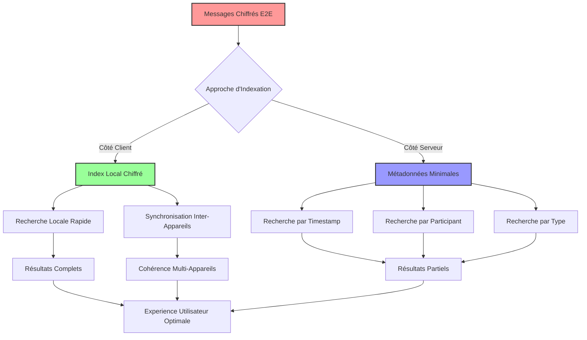
```mermaid
graph TD
    A[Messages Chiffrés E2E] --> B{Approche d'Indexation}
    
    B -->|Côté Client| C[Index Local Chiffré]
    B -->|Côté Serveur| D[Métadonnées Minimales]
    
    C --> E[Recherche Locale Rapide]
    C --> F[Synchronisation Inter-Appareils]
    
    D --> G[Recherche par Timestamp]
    D --> H[Recherche par Participant]
    D --> I[Recherche par Type]
    
    E --> J[Résultats Complets]
    F --> K[Cohérence Multi-Appareils]
    G --> L[Résultats Partiels]
    H --> L
    I --> L
    
    J --> M[Experience Utilisateur Optimale]
    K --> M
    L --> M
    
    style A fill:#f99,stroke:#333,stroke-width:2px
    style C fill:#9f9,stroke:#333,stroke-width:2px
    style D fill:#99f,stroke:#333,stroke-width:2px
```

### 1.4 Architecture de recherche hybride

| Composant | Localisation | Données Indexées | Performances | Confidentialité |
|-----------|--------------|------------------|--------------|-----------------|
| **Index Client** | Appareil local | Contenu déchiffré complet | Très rapide | Maximale |
| **Index Serveur** | Messaging Service | Métadonnées non sensibles | Rapide | Bonne |
| **Cache Distribué** | Redis | Résultats fréquents | Très rapide | Contrôlée |
| **Archive Longue** | PostgreSQL | Historique complet | Modérée | Excellente |

### 1.5 Types de recherche supportés

| Type | Scope | Exemples | Complexité | Performance |
|------|-------|----------|------------|-------------|
| **Texte Libre** | Contenu des messages | "réunion demain", "photos vacances" | Élevée | Bonne |
| **Participants** | Expéditeurs/destinataires | Messages de Alice, conversations avec Bob | Faible | Excellente |
| **Temporelle** | Plages de dates | Messages du mois dernier, aujourd'hui | Faible | Excellente |
| **Type de Contenu** | Messages/médias/documents | Toutes les photos, documents PDF | Moyenne | Bonne |
| **Conversation** | Scope limité | Recherche dans une conversation | Moyenne | Très bonne |
| **Avancée** | Critères combinés | Photos de Alice la semaine dernière | Élevée | Modérée |

### 1.6 Composants fonctionnels

Le système de recherche et historique comprend huit processus principaux :
1. **Indexation sécurisée**: Construction et maintenance des index de recherche
2. **Moteur de recherche hybride**: Combinaison recherche locale et distante
3. **Algorithmes de ranking**: Pertinence et classement des résultats
4. **Système de filtrage**: Application de critères multiples et combinés
5. **Pagination intelligente**: Navigation efficace dans de gros volumes
6. **Export et archivage**: Extraction sélective des données
7. **Synchronisation d'index**: Cohérence entre appareils
8. **Optimisation de performance**: Cache et pré-calculs

## 2. Indexation sécurisée

### 2.1 Stratégie d'indexation hybride

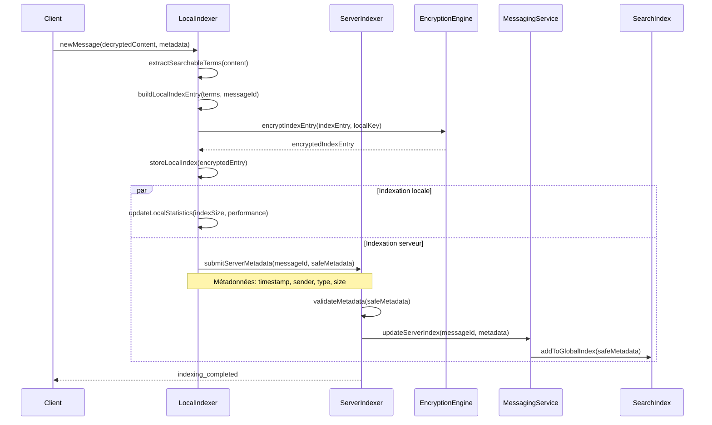
```mermaid
sequenceDiagram
    participant Client
    participant LocalIndexer
    participant ServerIndexer
    participant EncryptionEngine
    participant MessagingService
    participant SearchIndex
    
    Client->>LocalIndexer: newMessage(decryptedContent, metadata)
    LocalIndexer->>LocalIndexer: extractSearchableTerms(content)
    LocalIndexer->>LocalIndexer: buildLocalIndexEntry(terms, messageId)
    
    LocalIndexer->>EncryptionEngine: encryptIndexEntry(indexEntry, localKey)
    EncryptionEngine-->>LocalIndexer: encryptedIndexEntry
    LocalIndexer->>LocalIndexer: storeLocalIndex(encryptedEntry)
    
    par Indexation locale
        LocalIndexer->>LocalIndexer: updateLocalStatistics(indexSize, performance)
    and Indexation serveur
        LocalIndexer->>ServerIndexer: submitServerMetadata(messageId, safeMetadata)
        Note over LocalIndexer,ServerIndexer: Métadonnées: timestamp, sender, type, size
        
        ServerIndexer->>ServerIndexer: validateMetadata(safeMetadata)
        ServerIndexer->>MessagingService: updateServerIndex(messageId, metadata)
        MessagingService->>SearchIndex: addToGlobalIndex(safeMetadata)
    end
    
    ServerIndexer-->>Client: indexing_completed
```

### 2.2 Indexation locale côté client

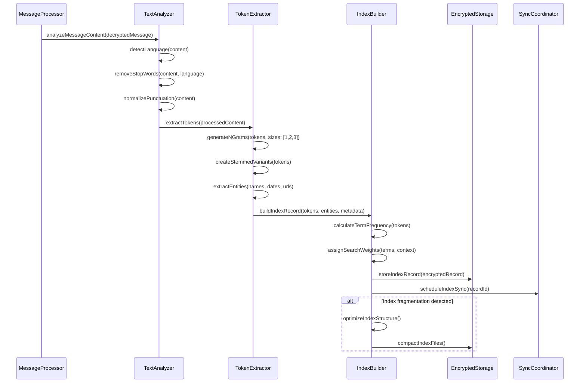
```mermaid
sequenceDiagram
    participant MessageProcessor
    participant TextAnalyzer
    participant TokenExtractor
    participant IndexBuilder
    participant EncryptedStorage
    participant SyncCoordinator
    
    MessageProcessor->>TextAnalyzer: analyzeMessageContent(decryptedMessage)
    TextAnalyzer->>TextAnalyzer: detectLanguage(content)
    TextAnalyzer->>TextAnalyzer: removeStopWords(content, language)
    TextAnalyzer->>TextAnalyzer: normalizePunctuation(content)
    
    TextAnalyzer->>TokenExtractor: extractTokens(processedContent)
    TokenExtractor->>TokenExtractor: generateNGrams(tokens, sizes: [1,2,3])
    TokenExtractor->>TokenExtractor: createStemmedVariants(tokens)
    TokenExtractor->>TokenExtractor: extractEntities(names, dates, urls)
    
    TokenExtractor->>IndexBuilder: buildIndexRecord(tokens, entities, metadata)
    IndexBuilder->>IndexBuilder: calculateTermFrequency(tokens)
    IndexBuilder->>IndexBuilder: assignSearchWeights(terms, context)
    
    IndexBuilder->>EncryptedStorage: storeIndexRecord(encryptedRecord)
    IndexBuilder->>SyncCoordinator: scheduleIndexSync(recordId)
    
    alt Index fragmentation detected
        IndexBuilder->>IndexBuilder: optimizeIndexStructure()
        IndexBuilder->>EncryptedStorage: compactIndexFiles()
    end
```

### 2.3 Métadonnées serveur non sensibles

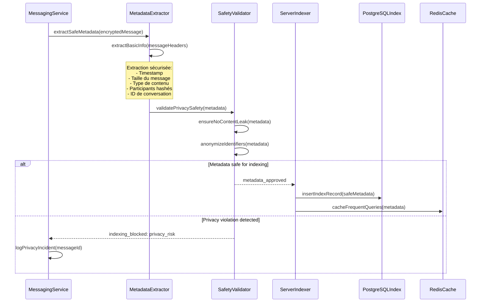
```mermaid
sequenceDiagram
    participant MessagingService
    participant MetadataExtractor
    participant SafetyValidator
    participant ServerIndexer
    participant PostgreSQLIndex
    participant RedisCache
    
    MessagingService->>MetadataExtractor: extractSafeMetadata(encryptedMessage)
    MetadataExtractor->>MetadataExtractor: extractBasicInfo(messageHeaders)
    
    Note over MetadataExtractor: Extraction sécurisée:<br/>- Timestamp<br/>- Taille du message<br/>- Type de contenu<br/>- Participants hashés<br/>- ID de conversation
    
    MetadataExtractor->>SafetyValidator: validatePrivacySafety(metadata)
    SafetyValidator->>SafetyValidator: ensureNoContentLeak(metadata)
    SafetyValidator->>SafetyValidator: anonymizeIdentifiers(metadata)
    
    alt Metadata safe for indexing
        SafetyValidator-->>ServerIndexer: metadata_approved
        ServerIndexer->>PostgreSQLIndex: insertIndexRecord(safeMetadata)
        ServerIndexer->>RedisCache: cacheFrequentQueries(metadata)
        
    else Privacy violation detected
        SafetyValidator-->>MessagingService: indexing_blocked: privacy_risk
        MessagingService->>MessagingService: logPrivacyIncident(messageId)
    end
```

### 2.4 Optimisation et maintenance des index

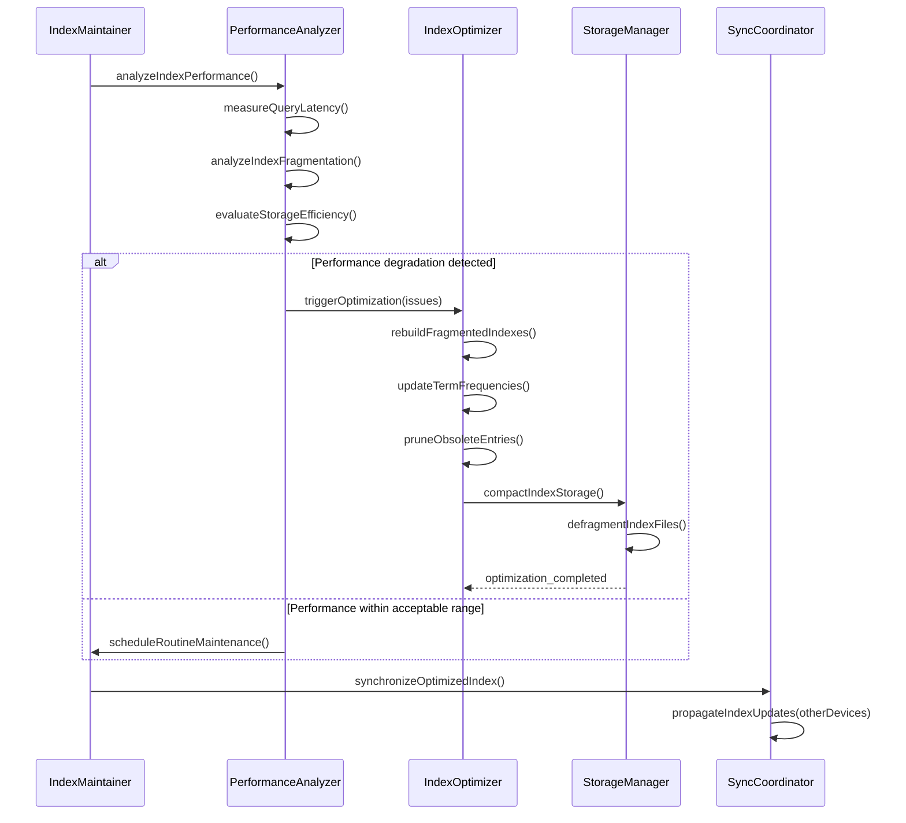
```mermaid
sequenceDiagram
    participant IndexMaintainer
    participant PerformanceAnalyzer
    participant IndexOptimizer
    participant StorageManager
    participant SyncCoordinator
    
    IndexMaintainer->>PerformanceAnalyzer: analyzeIndexPerformance()
    PerformanceAnalyzer->>PerformanceAnalyzer: measureQueryLatency()
    PerformanceAnalyzer->>PerformanceAnalyzer: analyzeIndexFragmentation()
    PerformanceAnalyzer->>PerformanceAnalyzer: evaluateStorageEfficiency()
    
    alt Performance degradation detected
        PerformanceAnalyzer->>IndexOptimizer: triggerOptimization(issues)
        
        IndexOptimizer->>IndexOptimizer: rebuildFragmentedIndexes()
        IndexOptimizer->>IndexOptimizer: updateTermFrequencies()
        IndexOptimizer->>IndexOptimizer: pruneObsoleteEntries()
        
        IndexOptimizer->>StorageManager: compactIndexStorage()
        StorageManager->>StorageManager: defragmentIndexFiles()
        StorageManager-->>IndexOptimizer: optimization_completed
        
    else Performance within acceptable range
        PerformanceAnalyzer->>IndexMaintainer: scheduleRoutineMaintenance()
    end
    
    IndexMaintainer->>SyncCoordinator: synchronizeOptimizedIndex()
    SyncCoordinator->>SyncCoordinator: propagateIndexUpdates(otherDevices)
```

## 3. Moteur de recherche hybride

### 3.1 Orchestration de recherche multi-source

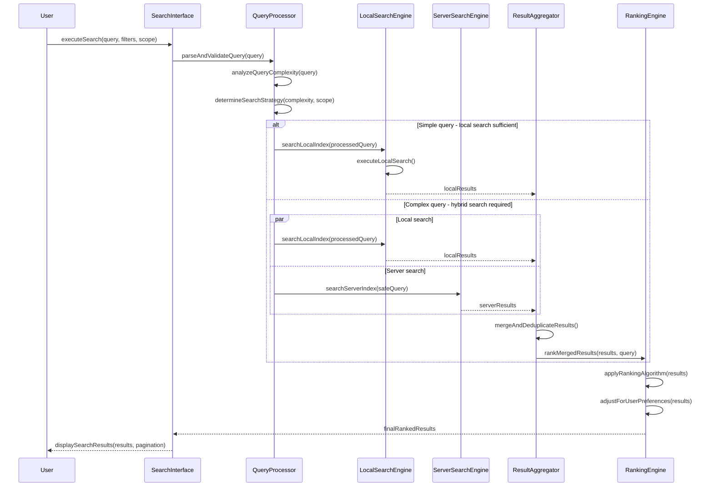
```mermaid
sequenceDiagram
    participant User
    participant SearchInterface
    participant QueryProcessor
    participant LocalSearchEngine
    participant ServerSearchEngine
    participant ResultAggregator
    participant RankingEngine
    
    User->>SearchInterface: executeSearch(query, filters, scope)
    SearchInterface->>QueryProcessor: parseAndValidateQuery(query)
    QueryProcessor->>QueryProcessor: analyzeQueryComplexity(query)
    QueryProcessor->>QueryProcessor: determineSearchStrategy(complexity, scope)
    
    alt Simple query - local search sufficient
        QueryProcessor->>LocalSearchEngine: searchLocalIndex(processedQuery)
        LocalSearchEngine->>LocalSearchEngine: executeLocalSearch()
        LocalSearchEngine-->>ResultAggregator: localResults
        
    else Complex query - hybrid search required
        par Local search
            QueryProcessor->>LocalSearchEngine: searchLocalIndex(processedQuery)
            LocalSearchEngine-->>ResultAggregator: localResults
        and Server search
            QueryProcessor->>ServerSearchEngine: searchServerIndex(safeQuery)
            ServerSearchEngine-->>ResultAggregator: serverResults
        end
        
        ResultAggregator->>ResultAggregator: mergeAndDeduplicateResults()
        ResultAggregator->>RankingEngine: rankMergedResults(results, query)
    end
    
    RankingEngine->>RankingEngine: applyRankingAlgorithm(results)
    RankingEngine->>RankingEngine: adjustForUserPreferences(results)
    RankingEngine-->>SearchInterface: finalRankedResults
    
    SearchInterface-->>User: displaySearchResults(results, pagination)
```

### 3.2 Algorithmes de recherche locale

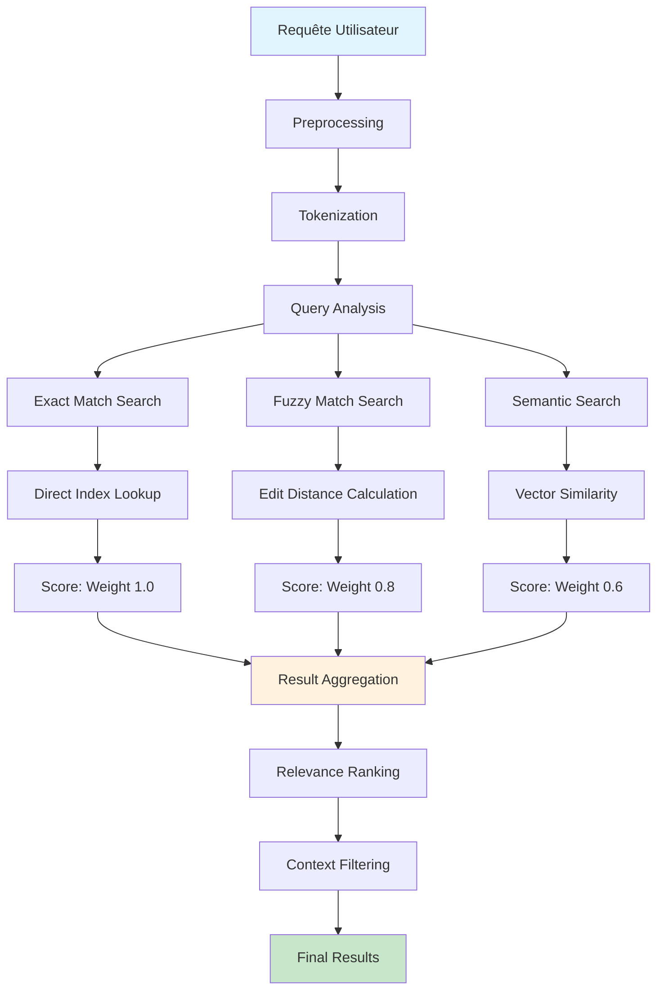
```mermaid
graph TD
    A[Requête Utilisateur] --> B[Preprocessing]
    B --> C[Tokenization]
    C --> D[Query Analysis]
    
    D --> E[Exact Match Search]
    D --> F[Fuzzy Match Search]  
    D --> G[Semantic Search]
    
    E --> H[Direct Index Lookup]
    F --> I[Edit Distance Calculation]
    G --> J[Vector Similarity]
    
    H --> K[Score: Weight 1.0]
    I --> L[Score: Weight 0.8]
    J --> M[Score: Weight 0.6]
    
    K --> N[Result Aggregation]
    L --> N
    M --> N
    
    N --> O[Relevance Ranking]
    O --> P[Context Filtering]
    P --> Q[Final Results]
    
    style A fill:#e1f5fe
    style Q fill:#c8e6c9
    style N fill:#fff3e0
```

**Algorithme de recherche locale (pseudo-code):**

```
FUNCTION localSearch(query, filters, maxResults):
    preprocessedQuery = preprocessQuery(query)
    tokens = tokenizeQuery(preprocessedQuery)
    
    exactMatches = []
    fuzzyMatches = []
    semanticMatches = []
    
    FOR EACH token IN tokens:
        // Recherche exacte
        exactResults = indexLookup(token)
        exactMatches.addAll(exactResults, weight: 1.0)
        
        // Recherche floue
        fuzzyResults = fuzzySearch(token, maxEditDistance: 2)
        fuzzyMatches.addAll(fuzzyResults, weight: 0.8)
        
        // Recherche sémantique (synonymes, variantes)
        semanticResults = semanticSearch(token)
        semanticMatches.addAll(semanticResults, weight: 0.6)
    END FOR
    
    allResults = mergeResults(exactMatches, fuzzyMatches, semanticMatches)
    filteredResults = applyFilters(allResults, filters)
    rankedResults = rankByRelevance(filteredResults, query)
    
    RETURN limitResults(rankedResults, maxResults)
END FUNCTION
```

### 3.3 Recherche serveur sur métadonnées

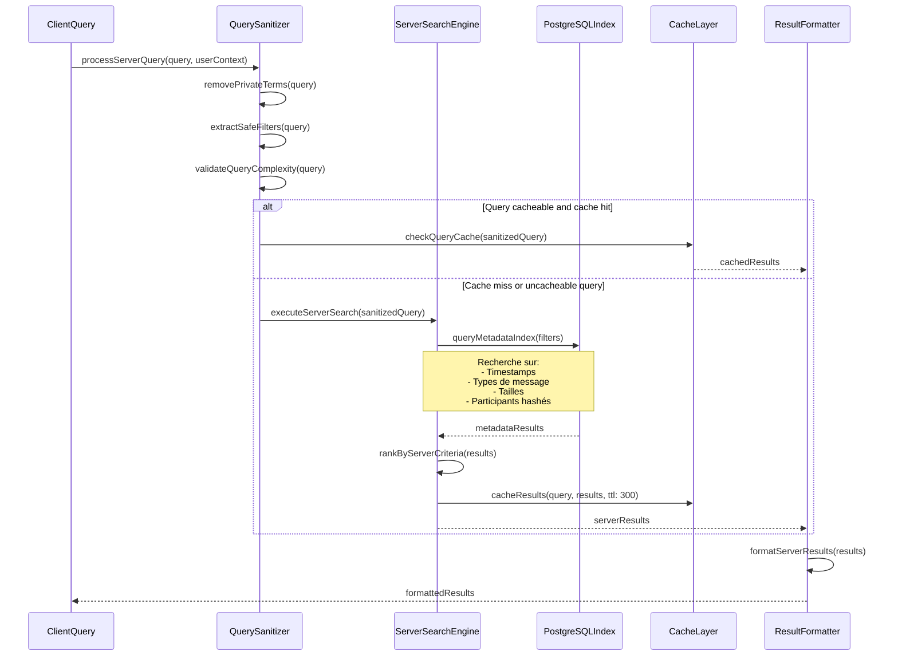
```mermaid
sequenceDiagram
    participant ClientQuery
    participant QuerySanitizer
    participant ServerSearchEngine
    participant PostgreSQLIndex
    participant CacheLayer
    participant ResultFormatter
    
    ClientQuery->>QuerySanitizer: processServerQuery(query, userContext)
    QuerySanitizer->>QuerySanitizer: removePrivateTerms(query)
    QuerySanitizer->>QuerySanitizer: extractSafeFilters(query)
    QuerySanitizer->>QuerySanitizer: validateQueryComplexity(query)
    
    alt Query cacheable and cache hit
        QuerySanitizer->>CacheLayer: checkQueryCache(sanitizedQuery)
        CacheLayer-->>ResultFormatter: cachedResults
        
    else Cache miss or uncacheable query
        QuerySanitizer->>ServerSearchEngine: executeServerSearch(sanitizedQuery)
        
        ServerSearchEngine->>PostgreSQLIndex: queryMetadataIndex(filters)
        Note over ServerSearchEngine,PostgreSQLIndex: Recherche sur:<br/>- Timestamps<br/>- Types de message<br/>- Tailles<br/>- Participants hashés
        
        PostgreSQLIndex-->>ServerSearchEngine: metadataResults
        ServerSearchEngine->>ServerSearchEngine: rankByServerCriteria(results)
        
        ServerSearchEngine->>CacheLayer: cacheResults(query, results, ttl: 300)
        ServerSearchEngine-->>ResultFormatter: serverResults
    end
    
    ResultFormatter->>ResultFormatter: formatServerResults(results)
    ResultFormatter-->>ClientQuery: formattedResults
```

### 3.4 Agrégation et ranking des résultats

**Algorithme de ranking hybride (pseudo-code):**

```
FUNCTION rankHybridResults(localResults, serverResults, query):
    mergedResults = []
    
    // Merger les résultats en évitant les doublons
    FOR EACH result IN localResults:
        mergedResults.add(result, source: "local")
    END FOR
    
    FOR EACH result IN serverResults:
        IF NOT isDuplicate(result, mergedResults):
            mergedResults.add(result, source: "server")
        END IF
    END FOR
    
    // Calcul du score de pertinence
    FOR EACH result IN mergedResults:
        baseScore = calculateBaseScore(result, query)
        
        // Bonus pour source locale (contenu complet)
        IF result.source == "local":
            sourceBonus = 0.3
        ELSE:
            sourceBonus = 0.0
        END IF
        
        // Bonus pour récence
        recencyBonus = calculateRecencyBonus(result.timestamp)
        
        // Bonus pour fréquence d'interaction
        frequencyBonus = getUserInteractionScore(result.conversationId)
        
        // Score final
        result.finalScore = baseScore + sourceBonus + recencyBonus + frequencyBonus
    END FOR
    
    sortedResults = sortByScore(mergedResults, descending: true)
    RETURN sortedResults
END FUNCTION
```

## 4. Système de filtrage avancé

### 4.1 Architecture des filtres

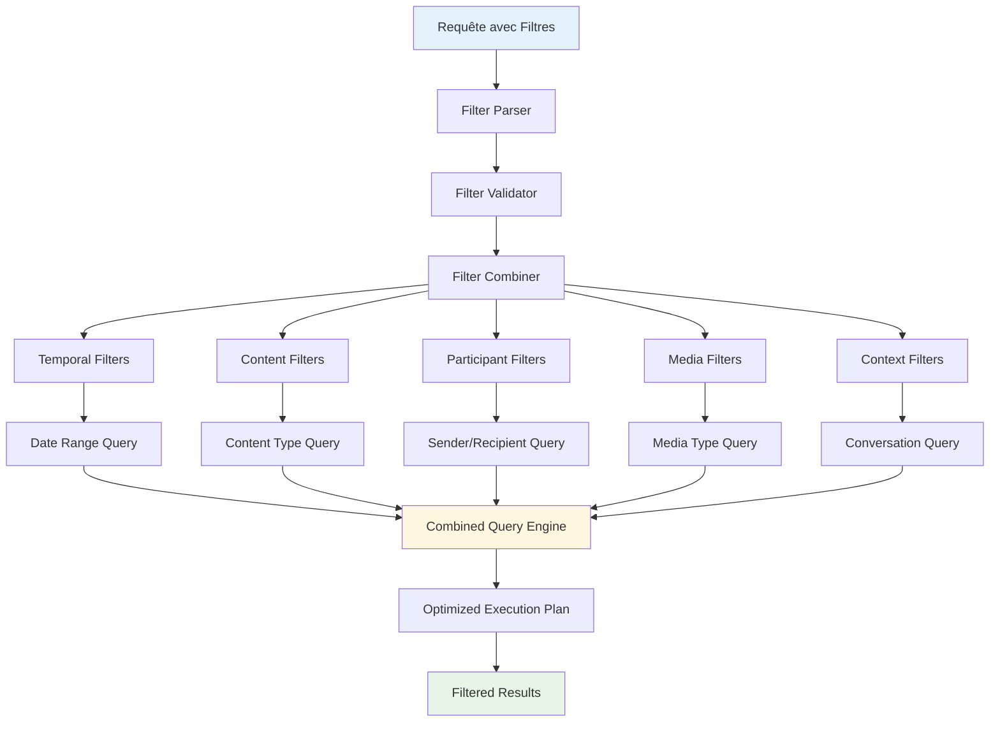
```mermaid
graph TD
    A[Requête avec Filtres] --> B[Filter Parser]
    B --> C[Filter Validator]
    C --> D[Filter Combiner]
    
    D --> E[Temporal Filters]
    D --> F[Content Filters]
    D --> G[Participant Filters]
    D --> H[Media Filters]
    D --> I[Context Filters]
    
    E --> J[Date Range Query]
    F --> K[Content Type Query]
    G --> L[Sender/Recipient Query]
    H --> M[Media Type Query]
    I --> N[Conversation Query]
    
    J --> O[Combined Query Engine]
    K --> O
    L --> O
    M --> O
    N --> O
    
    O --> P[Optimized Execution Plan]
    P --> Q[Filtered Results]
    
    style A fill:#e3f2fd
    style Q fill:#e8f5e8
    style O fill:#fff8e1
```

### 4.2 Types de filtres supportés

| Catégorie | Filtres Disponibles | Exemples | Performance |
|-----------|-------------------|----------|-------------|
| **Temporel** | Date exacte, plage, relative | Aujourd'hui, dernière semaine, avant 2024 | Excellente |
| **Participants** | Expéditeur, destinataire, groupe | Messages de Alice, dans le groupe Projet | Très bonne |
| **Contenu** | Type de message, mots-clés | Texte seulement, contient "urgent" | Bonne |
| **Médias** | Type de média, taille | Images, vidéos >10MB, documents PDF | Bonne |
| **Conversation** | Conversation spécifique, archivée | Dans conversation X, messages archivés | Très bonne |
| **Statut** | Lu/non lu, favori, épinglé | Messages non lus, messages épinglés | Excellente |

### 4.3 Combinaison intelligente de filtres

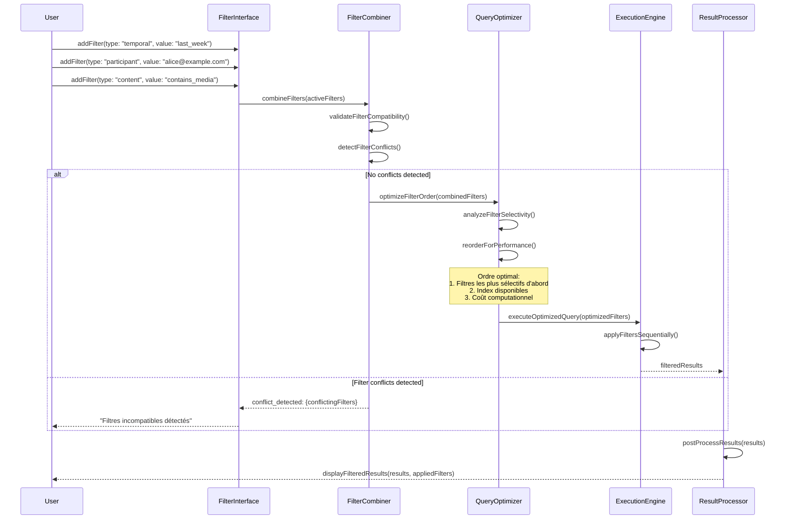
```mermaid
sequenceDiagram
    participant User
    participant FilterInterface
    participant FilterCombiner
    participant QueryOptimizer
    participant ExecutionEngine
    participant ResultProcessor
    
    User->>FilterInterface: addFilter(type: "temporal", value: "last_week")
    User->>FilterInterface: addFilter(type: "participant", value: "alice@example.com")
    User->>FilterInterface: addFilter(type: "content", value: "contains_media")
    
    FilterInterface->>FilterCombiner: combineFilters(activeFilters)
    FilterCombiner->>FilterCombiner: validateFilterCompatibility()
    FilterCombiner->>FilterCombiner: detectFilterConflicts()
    
    alt No conflicts detected
        FilterCombiner->>QueryOptimizer: optimizeFilterOrder(combinedFilters)
        QueryOptimizer->>QueryOptimizer: analyzeFilterSelectivity()
        QueryOptimizer->>QueryOptimizer: reorderForPerformance()
        
        Note over QueryOptimizer: Ordre optimal:<br/>1. Filtres les plus sélectifs d'abord<br/>2. Index disponibles<br/>3. Coût computationnel
        
        QueryOptimizer->>ExecutionEngine: executeOptimizedQuery(optimizedFilters)
        ExecutionEngine->>ExecutionEngine: applyFiltersSequentially()
        ExecutionEngine-->>ResultProcessor: filteredResults
        
    else Filter conflicts detected
        FilterCombiner-->>FilterInterface: conflict_detected: {conflictingFilters}
        FilterInterface-->>User: "Filtres incompatibles détectés"
    end
    
    ResultProcessor->>ResultProcessor: postProcessResults(results)
    ResultProcessor-->>User: displayFilteredResults(results, appliedFilters)
```

### 4.4 Optimisation des requêtes filtrées

**Algorithme d'optimisation de filtres (pseudo-code):**

```
FUNCTION optimizeFilterExecution(filters, indexInfo):
    // Analyser la sélectivité de chaque filtre
    filterStats = []
    FOR EACH filter IN filters:
        selectivity = estimateSelectivity(filter, indexInfo)
        cost = estimateExecutionCost(filter)
        filterStats.add({filter, selectivity, cost})
    END FOR
    
    // Trier par sélectivité (plus sélectif = moins de résultats)
    sortedFilters = sortBySelectivity(filterStats, ascending: true)
    
    // Optimiser l'ordre d'exécution
    optimizedOrder = []
    FOR EACH filterStat IN sortedFilters:
        // Prioriser les filtres avec index disponibles
        IF hasIndex(filterStat.filter):
            optimizedOrder.insertAtBeginning(filterStat.filter)
        ELSE:
            optimizedOrder.append(filterStat.filter)
        END IF
    END FOR
    
    RETURN optimizedOrder
END FUNCTION

FUNCTION executeFilterChain(filters, dataset):
    currentResults = dataset
    
    FOR EACH filter IN filters:
        // Court-circuit si plus de résultats
        IF currentResults.isEmpty():
            BREAK
        END IF
        
        currentResults = applyFilter(filter, currentResults)
        
        // Logging pour analyse de performance
        logFilterPerformance(filter, currentResults.size())
    END FOR
    
    RETURN currentResults
END FUNCTION
```

## 5. Pagination intelligente

### 5.1 Stratégies de pagination selon le contexte

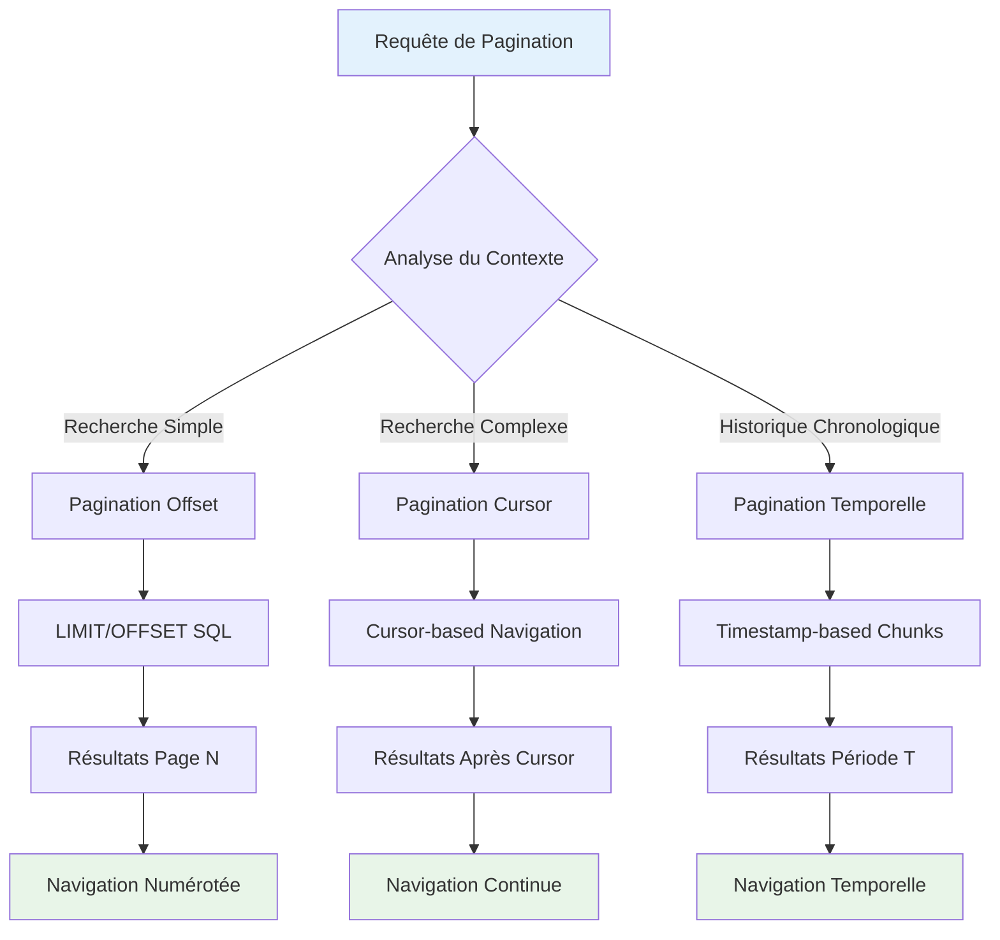
```mermaid
graph TD
    A[Requête de Pagination] --> B{Analyse du Contexte}
    
    B -->|Recherche Simple| C[Pagination Offset]
    B -->|Recherche Complexe| D[Pagination Cursor]
    B -->|Historique Chronologique| E[Pagination Temporelle]
    
    C --> F[LIMIT/OFFSET SQL]
    D --> G[Cursor-based Navigation]
    E --> H[Timestamp-based Chunks]
    
    F --> I[Résultats Page N]
    G --> J[Résultats Après Cursor]
    H --> K[Résultats Période T]
    
    I --> L[Navigation Numérotée]
    J --> M[Navigation Continue]
    K --> N[Navigation Temporelle]
    
    style A fill:#e3f2fd
    style L fill:#e8f5e8
    style M fill:#e8f5e8
    style N fill:#e8f5e8
```

### 5.2 Pagination optimisée pour la recherche

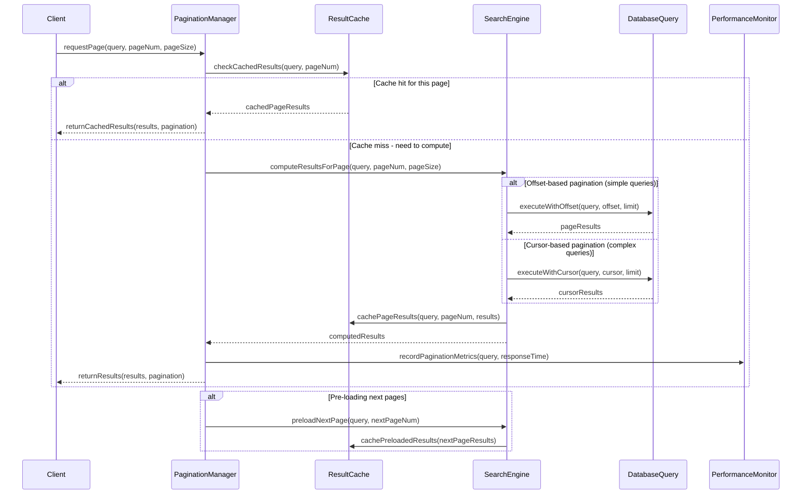
```mermaid
sequenceDiagram
    participant Client
    participant PaginationManager
    participant ResultCache
    participant SearchEngine
    participant DatabaseQuery
    participant PerformanceMonitor
    
    Client->>PaginationManager: requestPage(query, pageNum, pageSize)
    PaginationManager->>ResultCache: checkCachedResults(query, pageNum)
    
    alt Cache hit for this page
        ResultCache-->>PaginationManager: cachedPageResults
        PaginationManager-->>Client: returnCachedResults(results, pagination)
        
    else Cache miss - need to compute
        PaginationManager->>SearchEngine: computeResultsForPage(query, pageNum, pageSize)
        
        alt Offset-based pagination (simple queries)
            SearchEngine->>DatabaseQuery: executeWithOffset(query, offset, limit)
            DatabaseQuery-->>SearchEngine: pageResults
            
        else Cursor-based pagination (complex queries)
            SearchEngine->>DatabaseQuery: executeWithCursor(query, cursor, limit)
            DatabaseQuery-->>SearchEngine: cursorResults
        end
        
        SearchEngine->>ResultCache: cachePageResults(query, pageNum, results)
        SearchEngine-->>PaginationManager: computedResults
        
        PaginationManager->>PerformanceMonitor: recordPaginationMetrics(query, responseTime)
        PaginationManager-->>Client: returnResults(results, pagination)
    end
    
    alt Pre-loading next pages
        PaginationManager->>SearchEngine: preloadNextPage(query, nextPageNum)
        SearchEngine->>ResultCache: cachePreloadedResults(nextPageResults)
    end
```

### 5.3 Pagination adaptative selon les performances

**Algorithme de pagination adaptative (pseudo-code):**

```
FUNCTION adaptivePagination(query, requestedPageSize, userContext):
    // Analyser la complexité de la requête
    queryComplexity = analyzeQueryComplexity(query)
    
    // Adapter la taille de page selon les performances
    IF queryComplexity == "HIGH":
        adaptedPageSize = min(requestedPageSize, 20)
        paginationStrategy = "cursor_based"
    ELSIF queryComplexity == "MEDIUM":
        adaptedPageSize = min(requestedPageSize, 50)
        paginationStrategy = "hybrid"
    ELSE:
        adaptedPageSize = requestedPageSize
        paginationStrategy = "offset_based"
    END IF
    
    // Adapter selon les capacités de l'appareil
    IF userContext.deviceType == "mobile":
        adaptedPageSize = adaptedPageSize * 0.7  // Réduire pour mobile
    END IF
    
    // Adapter selon la bande passante
    IF userContext.networkSpeed == "slow":
        adaptedPageSize = adaptedPageSize * 0.5
    END IF
    
    RETURN {
        pageSize: adaptedPageSize,
        strategy: paginationStrategy,
        prefetchNext: shouldPrefetch(userContext)
    }
END FUNCTION
```

### 5.4 Navigation dans l'historique temporel

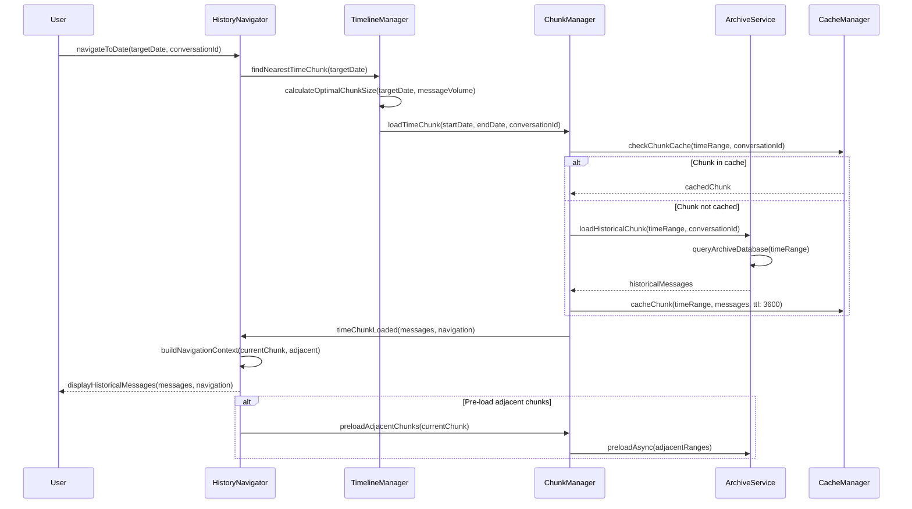
```mermaid
sequenceDiagram
    participant User
    participant HistoryNavigator
    participant TimelineManager
    participant ChunkManager
    participant ArchiveService
    participant CacheManager
    
    User->>HistoryNavigator: navigateToDate(targetDate, conversationId)
    HistoryNavigator->>TimelineManager: findNearestTimeChunk(targetDate)
    
    TimelineManager->>TimelineManager: calculateOptimalChunkSize(targetDate, messageVolume)
    TimelineManager->>ChunkManager: loadTimeChunk(startDate, endDate, conversationId)
    
    ChunkManager->>CacheManager: checkChunkCache(timeRange, conversationId)
    
    alt Chunk in cache
        CacheManager-->>ChunkManager: cachedChunk
        
    else Chunk not cached
        ChunkManager->>ArchiveService: loadHistoricalChunk(timeRange, conversationId)
        ArchiveService->>ArchiveService: queryArchiveDatabase(timeRange)
        ArchiveService-->>ChunkManager: historicalMessages
        
        ChunkManager->>CacheManager: cacheChunk(timeRange, messages, ttl: 3600)
    end
    
    ChunkManager->>HistoryNavigator: timeChunkLoaded(messages, navigation)
    HistoryNavigator->>HistoryNavigator: buildNavigationContext(currentChunk, adjacent)
    
    HistoryNavigator-->>User: displayHistoricalMessages(messages, navigation)
    
    alt Pre-load adjacent chunks
        HistoryNavigator->>ChunkManager: preloadAdjacentChunks(currentChunk)
        ChunkManager->>ArchiveService: preloadAsync(adjacentRanges)
    end
```

## 6. Export et archivage d'historique

### 6.1 Export sélectif et formatage

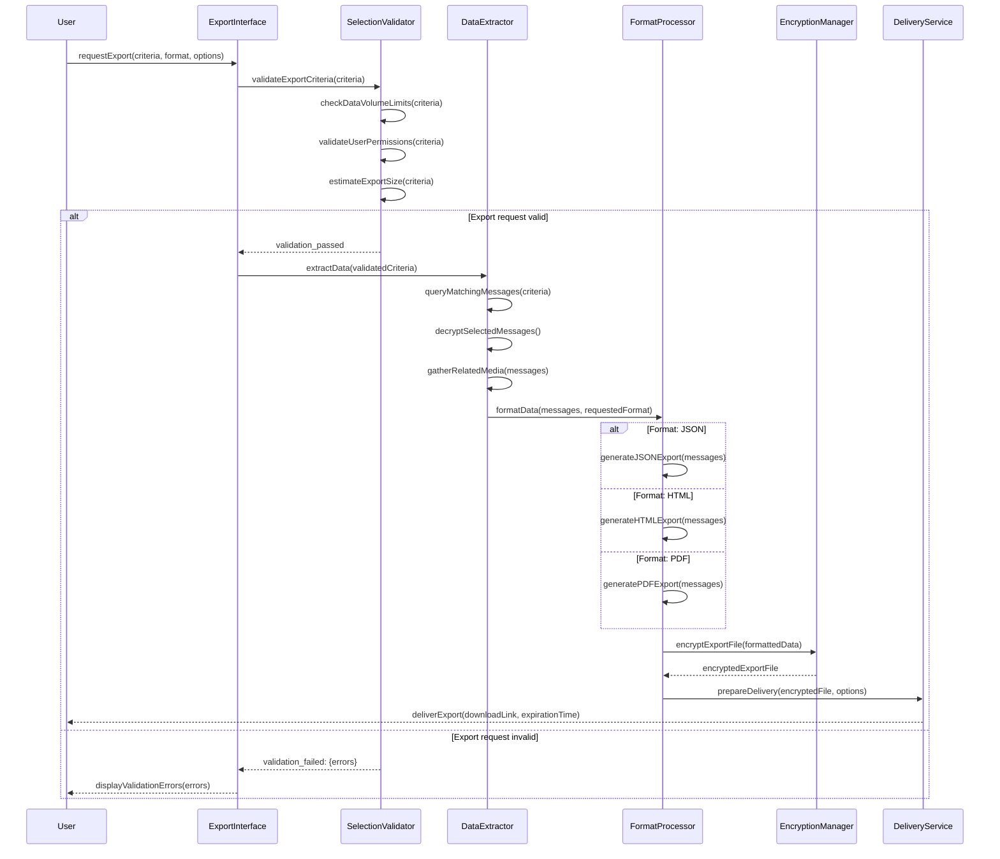
```mermaid
sequenceDiagram
    participant User
    participant ExportInterface
    participant SelectionValidator
    participant DataExtractor
    participant FormatProcessor
    participant EncryptionManager
    participant DeliveryService
    
    User->>ExportInterface: requestExport(criteria, format, options)
    ExportInterface->>SelectionValidator: validateExportCriteria(criteria)
    
    SelectionValidator->>SelectionValidator: checkDataVolumeLimits(criteria)
    SelectionValidator->>SelectionValidator: validateUserPermissions(criteria)
    SelectionValidator->>SelectionValidator: estimateExportSize(criteria)
    
    alt Export request valid
        SelectionValidator-->>ExportInterface: validation_passed
        ExportInterface->>DataExtractor: extractData(validatedCriteria)
        
        DataExtractor->>DataExtractor: queryMatchingMessages(criteria)
        DataExtractor->>DataExtractor: decryptSelectedMessages()
        DataExtractor->>DataExtractor: gatherRelatedMedia(messages)
        
        DataExtractor->>FormatProcessor: formatData(messages, requestedFormat)
        
        alt Format: JSON
            FormatProcessor->>FormatProcessor: generateJSONExport(messages)
        else Format: HTML
            FormatProcessor->>FormatProcessor: generateHTMLExport(messages)
        else Format: PDF
            FormatProcessor->>FormatProcessor: generatePDFExport(messages)
        end
        
        FormatProcessor->>EncryptionManager: encryptExportFile(formattedData)
        EncryptionManager-->>FormatProcessor: encryptedExportFile
        
        FormatProcessor->>DeliveryService: prepareDelivery(encryptedFile, options)
        DeliveryService-->>User: deliverExport(downloadLink, expirationTime)
        
    else Export request invalid
        SelectionValidator-->>ExportInterface: validation_failed: {errors}
        ExportInterface-->>User: displayValidationErrors(errors)
    end
```

### 6.2 Formats d'export supportés

| Format | Usage | Contenu Inclus | Taille Limite | Chiffrement |
|--------|-------|----------------|---------------|-------------|
| **JSON** | Intégration technique | Messages + métadonnées complètes | 500 MB | Optionnel |
| **HTML** | Consultation visuelle | Messages formatés + médias intégrés | 200 MB | Standard |
| **PDF** | Archivage officiel | Messages mis en page + aperçus médias | 100 MB | Standard |
| **CSV** | Analyse de données | Messages texte + métadonnées basiques | 50 MB | Optionnel |
| **Archive ZIP** | Sauvegarde complète | Messages + médias séparés | 2 GB | Obligatoire |

### 6.3 Archivage automatique et rétention

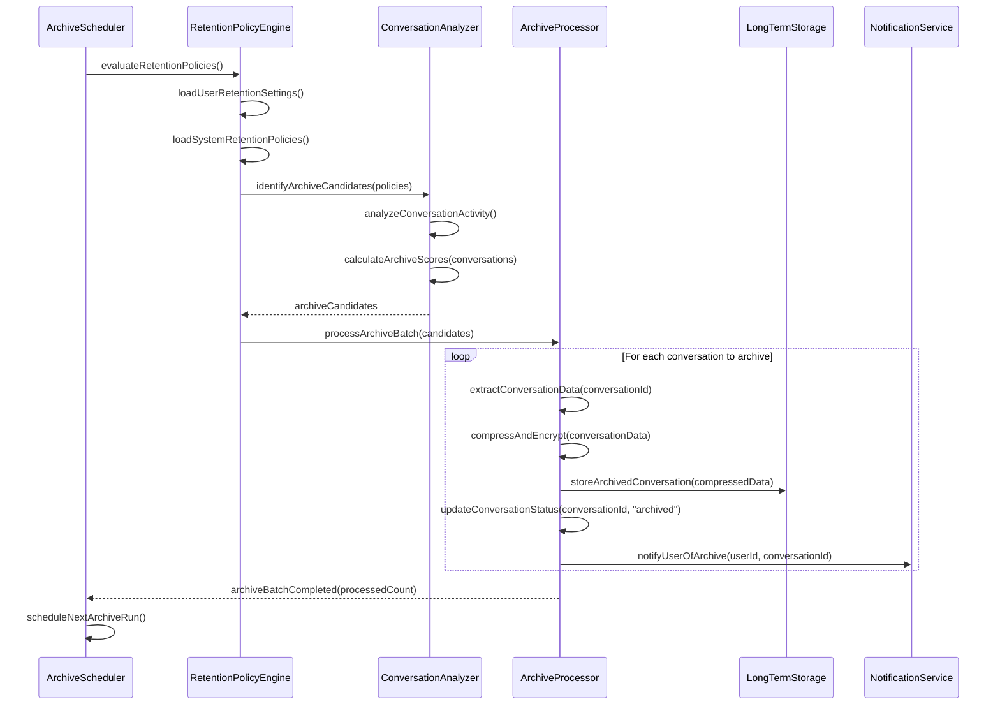
```mermaid
sequenceDiagram
    participant ArchiveScheduler
    participant RetentionPolicyEngine
    participant ConversationAnalyzer
    participant ArchiveProcessor
    participant LongTermStorage
    participant NotificationService
    
    ArchiveScheduler->>RetentionPolicyEngine: evaluateRetentionPolicies()
    RetentionPolicyEngine->>RetentionPolicyEngine: loadUserRetentionSettings()
    RetentionPolicyEngine->>RetentionPolicyEngine: loadSystemRetentionPolicies()
    
    RetentionPolicyEngine->>ConversationAnalyzer: identifyArchiveCandidates(policies)
    ConversationAnalyzer->>ConversationAnalyzer: analyzeConversationActivity()
    ConversationAnalyzer->>ConversationAnalyzer: calculateArchiveScores(conversations)
    
    ConversationAnalyzer-->>RetentionPolicyEngine: archiveCandidates
    
    RetentionPolicyEngine->>ArchiveProcessor: processArchiveBatch(candidates)
    
    loop For each conversation to archive
        ArchiveProcessor->>ArchiveProcessor: extractConversationData(conversationId)
        ArchiveProcessor->>ArchiveProcessor: compressAndEncrypt(conversationData)
        ArchiveProcessor->>LongTermStorage: storeArchivedConversation(compressedData)
        
        ArchiveProcessor->>ArchiveProcessor: updateConversationStatus(conversationId, "archived")
        ArchiveProcessor->>NotificationService: notifyUserOfArchive(userId, conversationId)
    end
    
    ArchiveProcessor-->>ArchiveScheduler: archiveBatchCompleted(processedCount)
    ArchiveScheduler->>ArchiveScheduler: scheduleNextArchiveRun()
```

### 6.4 Restauration d'historique archivé

**Algorithme de restauration d'archive (pseudo-code):**

```
FUNCTION restoreArchivedConversation(conversationId, userId, requestedDateRange):
    // Valider les permissions de restauration
    IF NOT hasRestorePermission(userId, conversationId):
        RETURN error("Insufficient permissions")
    END IF
    
    // Localiser les archives correspondantes
    archiveFiles = findArchiveFiles(conversationId, requestedDateRange)
    IF archiveFiles.isEmpty():
        RETURN error("No archived data found for specified range")
    END IF
    
    restoredData = []
    FOR EACH archiveFile IN archiveFiles:
        // Décompresser et déchiffrer
        encryptedData = loadArchiveFile(archiveFile)
        decryptedData = decryptArchiveData(encryptedData, userId)
        decompressedData = decompressData(decryptedData)
        
        // Valider l'intégrité
        IF NOT validateDataIntegrity(decompressedData):
            logError("Archive integrity check failed", archiveFile)
            CONTINUE
        END IF
        
        restoredData.addAll(decompressedData.messages)
    END FOR
    
    // Réintégrer dans l'index de recherche actif
    FOR EACH message IN restoredData:
        addToActiveIndex(message)
        updateConversationTimeline(message)
    END FOR
    
    // Notifier l'utilisateur du succès
    notifyRestoreComplete(userId, conversationId, restoredData.size())
    
    RETURN success(restoredData.size())
END FUNCTION
```

## 7. Synchronisation d'index multi-appareils

### 7.1 Coordination des index distribués

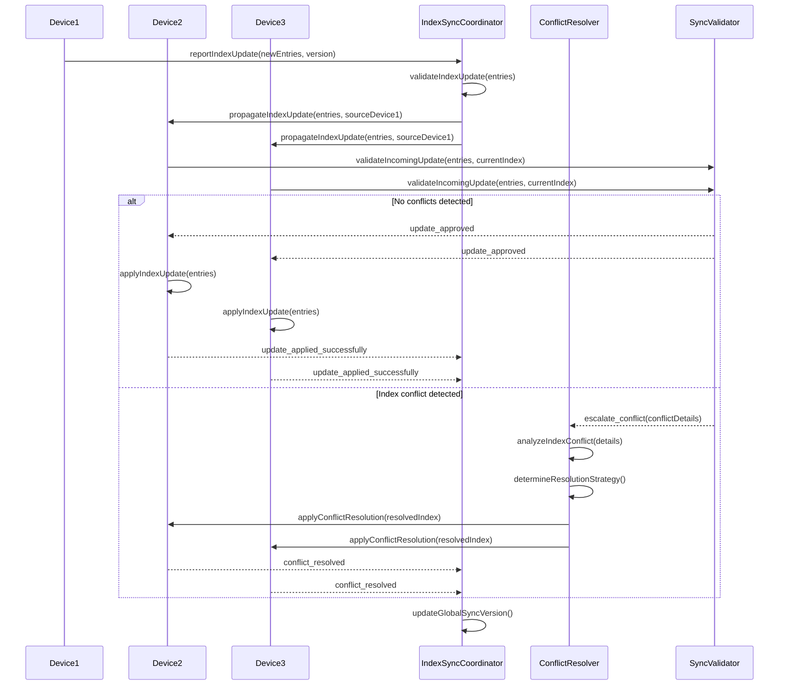
```mermaid
sequenceDiagram
    participant Device1
    participant Device2
    participant Device3
    participant IndexSyncCoordinator
    participant ConflictResolver
    participant SyncValidator
    
    Device1->>IndexSyncCoordinator: reportIndexUpdate(newEntries, version)
    IndexSyncCoordinator->>IndexSyncCoordinator: validateIndexUpdate(entries)
    
    IndexSyncCoordinator->>Device2: propagateIndexUpdate(entries, sourceDevice1)
    IndexSyncCoordinator->>Device3: propagateIndexUpdate(entries, sourceDevice1)
    
    Device2->>SyncValidator: validateIncomingUpdate(entries, currentIndex)
    Device3->>SyncValidator: validateIncomingUpdate(entries, currentIndex)
    
    alt No conflicts detected
        SyncValidator-->>Device2: update_approved
        SyncValidator-->>Device3: update_approved
        
        Device2->>Device2: applyIndexUpdate(entries)
        Device3->>Device3: applyIndexUpdate(entries)
        
        Device2-->>IndexSyncCoordinator: update_applied_successfully
        Device3-->>IndexSyncCoordinator: update_applied_successfully
        
    else Index conflict detected
        SyncValidator-->>ConflictResolver: escalate_conflict(conflictDetails)
        ConflictResolver->>ConflictResolver: analyzeIndexConflict(details)
        ConflictResolver->>ConflictResolver: determineResolutionStrategy()
        
        ConflictResolver->>Device2: applyConflictResolution(resolvedIndex)
        ConflictResolver->>Device3: applyConflictResolution(resolvedIndex)
        
        Device2-->>IndexSyncCoordinator: conflict_resolved
        Device3-->>IndexSyncCoordinator: conflict_resolved
    end
    
    IndexSyncCoordinator->>IndexSyncCoordinator: updateGlobalSyncVersion()
```

### 7.2 Optimisation de la bande passante pour sync d'index

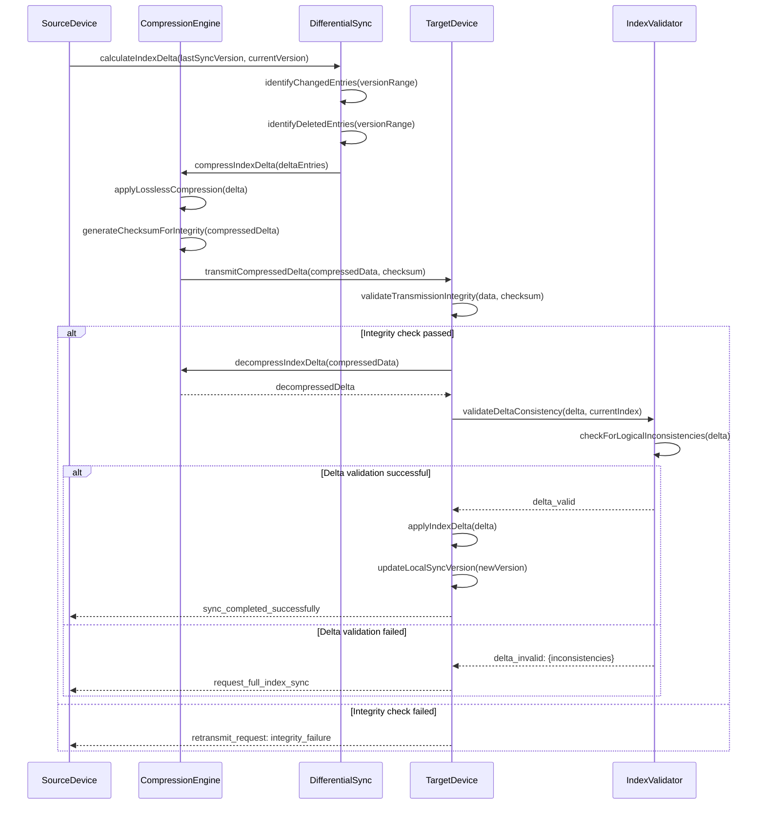
```mermaid
sequenceDiagram
    participant SourceDevice
    participant CompressionEngine
    participant DifferentialSync
    participant TargetDevice
    participant IndexValidator
    
    SourceDevice->>DifferentialSync: calculateIndexDelta(lastSyncVersion, currentVersion)
    DifferentialSync->>DifferentialSync: identifyChangedEntries(versionRange)
    DifferentialSync->>DifferentialSync: identifyDeletedEntries(versionRange)
    
    DifferentialSync->>CompressionEngine: compressIndexDelta(deltaEntries)
    CompressionEngine->>CompressionEngine: applyLosslessCompression(delta)
    CompressionEngine->>CompressionEngine: generateChecksumForIntegrity(compressedDelta)
    
    CompressionEngine->>TargetDevice: transmitCompressedDelta(compressedData, checksum)
    TargetDevice->>TargetDevice: validateTransmissionIntegrity(data, checksum)
    
    alt Integrity check passed
        TargetDevice->>CompressionEngine: decompressIndexDelta(compressedData)
        CompressionEngine-->>TargetDevice: decompressedDelta
        
        TargetDevice->>IndexValidator: validateDeltaConsistency(delta, currentIndex)
        IndexValidator->>IndexValidator: checkForLogicalInconsistencies(delta)
        
        alt Delta validation successful
            IndexValidator-->>TargetDevice: delta_valid
            TargetDevice->>TargetDevice: applyIndexDelta(delta)
            TargetDevice->>TargetDevice: updateLocalSyncVersion(newVersion)
            TargetDevice-->>SourceDevice: sync_completed_successfully
            
        else Delta validation failed
            IndexValidator-->>TargetDevice: delta_invalid: {inconsistencies}
            TargetDevice-->>SourceDevice: request_full_index_sync
        end
        
    else Integrity check failed
        TargetDevice-->>SourceDevice: retransmit_request: integrity_failure
    end
```

### 7.3 Réconciliation après déconnexion prolongée

**Algorithme de réconciliation d'index (pseudo-code):**

```
FUNCTION reconcileIndexAfterDisconnection(localIndex, remoteIndex, lastCommonVersion):
    // Identifier les changements locaux non synchronisés
    localChanges = extractChangesSinceVersion(localIndex, lastCommonVersion)
    remoteChanges = extractChangesSinceVersion(remoteIndex, lastCommonVersion)
    
    conflicts = []
    mergedIndex = cloneIndex(localIndex)
    
    // Détecter les conflits
    FOR EACH remoteChange IN remoteChanges:
        localEntry = findInIndex(mergedIndex, remoteChange.entryId)
        
        IF localEntry EXISTS AND localEntry.version != remoteChange.version:
            // Conflit détecté
            conflicts.add({
                entryId: remoteChange.entryId,
                localVersion: localEntry,
                remoteVersion: remoteChange,
                conflictType: determineConflictType(localEntry, remoteChange)
            })
        ELSE:
            // Pas de conflit, appliquer le changement distant
            applyChangeToIndex(mergedIndex, remoteChange)
        END IF
    END FOR
    
    // Résoudre les conflits
    FOR EACH conflict IN conflicts:
        resolution = resolveIndexConflict(conflict)
        applyResolutionToIndex(mergedIndex, resolution)
    END FOR
    
    // Valider la cohérence de l'index fusionné
    IF validateIndexConsistency(mergedIndex):
        commitIndex(mergedIndex)
        updateSyncVersion(calculateNewVersion(localChanges, remoteChanges))
        RETURN success(mergedIndex, conflicts.size())
    ELSE:
        RETURN error("Index reconciliation failed: consistency check failed")
    END IF
END FUNCTION
```

## 8. Intégration avec les autres services

### 8.1 Interface avec User Service

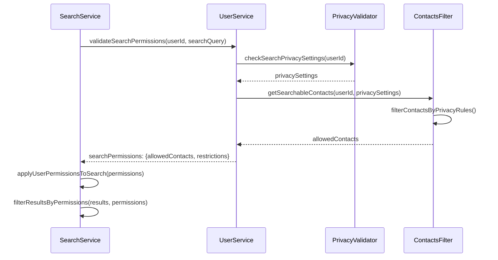
```mermaid
sequenceDiagram
    participant SearchService
    participant UserService
    participant PrivacyValidator
    participant ContactsFilter
    
    SearchService->>UserService: validateSearchPermissions(userId, searchQuery)
    UserService->>PrivacyValidator: checkSearchPrivacySettings(userId)
    PrivacyValidator-->>UserService: privacySettings
    
    UserService->>ContactsFilter: getSearchableContacts(userId, privacySettings)
    ContactsFilter->>ContactsFilter: filterContactsByPrivacyRules()
    ContactsFilter-->>UserService: allowedContacts
    
    UserService-->>SearchService: searchPermissions: {allowedContacts, restrictions}
    
    SearchService->>SearchService: applyUserPermissionsToSearch(permissions)
    SearchService->>SearchService: filterResultsByPermissions(results, permissions)
```

### 8.2 Interface avec Media Service

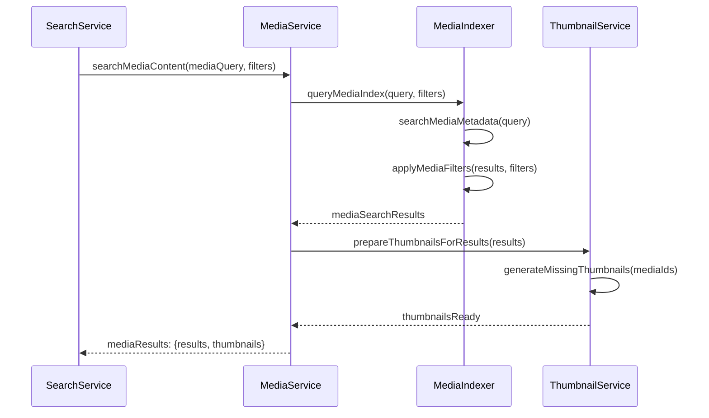
```mermaid
sequenceDiagram
    participant SearchService
    participant MediaService
    participant MediaIndexer
    participant ThumbnailService
    
    SearchService->>MediaService: searchMediaContent(mediaQuery, filters)
    MediaService->>MediaIndexer: queryMediaIndex(query, filters)
    
    MediaIndexer->>MediaIndexer: searchMediaMetadata(query)
    MediaIndexer->>MediaIndexer: applyMediaFilters(results, filters)
    MediaIndexer-->>MediaService: mediaSearchResults
    
    MediaService->>ThumbnailService: prepareThumbnailsForResults(results)
    ThumbnailService->>ThumbnailService: generateMissingThumbnails(mediaIds)
    ThumbnailService-->>MediaService: thumbnailsReady
    
    MediaService-->>SearchService: mediaResults: {results, thumbnails}
```

## 9. Considérations techniques

### 9.1 Architecture de données pour la recherche

#### Tables PostgreSQL spécialisées

```sql
-- Index de métadonnées serveur (non sensibles)
CREATE TABLE search_metadata_index (
    id UUID PRIMARY KEY DEFAULT uuid_generate_v4(),
    message_id UUID NOT NULL REFERENCES messages(id) ON DELETE CASCADE,
    conversation_id UUID NOT NULL,
    sender_hash VARCHAR(64), -- Hash du sender pour recherche sans révéler l'identité
    message_type VARCHAR(20) NOT NULL,
    content_size INTEGER,
    media_count INTEGER DEFAULT 0,
    timestamp_day DATE NOT NULL, -- Granularité jour pour recherche temporelle
    created_at TIMESTAMP NOT NULL DEFAULT NOW(),
    INDEX(conversation_id, timestamp_day),
    INDEX(sender_hash, timestamp_day),
    INDEX(message_type, timestamp_day)
);

-- Cache de résultats de recherche fréquents
CREATE TABLE search_results_cache (
    id UUID PRIMARY KEY DEFAULT uuid_generate_v4(),
    query_hash VARCHAR(64) NOT NULL,
    user_id UUID NOT NULL,
    results_data JSONB NOT NULL,
    result_count INTEGER NOT NULL,
    expires_at TIMESTAMP NOT NULL,
    created_at TIMESTAMP NOT NULL DEFAULT NOW(),
    INDEX(query_hash, user_id),
    INDEX(expires_at)
);

-- Statistiques de recherche pour optimisations
CREATE TABLE search_analytics (
    id UUID PRIMARY KEY DEFAULT uuid_generate_v4(),
    user_id UUID NOT NULL,
    query_type VARCHAR(50) NOT NULL,
    query_complexity VARCHAR(20) NOT NULL,
    execution_time_ms INTEGER NOT NULL,
    result_count INTEGER NOT NULL,
    filters_used JSONB,
    timestamp TIMESTAMP NOT NULL DEFAULT NOW(),
    INDEX(user_id, timestamp),
    INDEX(query_type, execution_time_ms)
);

-- Export d'historique en cours
CREATE TABLE export_jobs (
    id UUID PRIMARY KEY DEFAULT uuid_generate_v4(),
    user_id UUID NOT NULL,
    export_criteria JSONB NOT NULL,
    export_format VARCHAR(20) NOT NULL,
    status VARCHAR(20) NOT NULL DEFAULT 'pending',
    file_path VARCHAR(500),
    file_size BIGINT,
    expires_at TIMESTAMP,
    created_at TIMESTAMP NOT NULL DEFAULT NOW(),
    completed_at TIMESTAMP,
    INDEX(user_id, status),
    INDEX(expires_at)
);
```

#### Structures Redis pour optimisation

```redis
# Cache de résultats de recherche (TTL: 300 secondes)
search:cache:{query_hash}:{user_id} = {
    "results": [...],
    "total_count": 1250,
    "execution_time": 45,
    "cached_at": "2025-05-25T10:30:00Z"
}

# Index de fréquence des termes de recherche (TTL: 3600 secondes)
search:term_frequency:{user_id} = {
    "reunion": 89,
    "projet": 156,
    "urgent": 23,
    "photo": 67
}

# Statistiques de performance en temps réel (TTL: 1800 secondes)
search:performance:stats = {
    "avg_execution_time": 127,
    "slow_queries_count": 12,
    "cache_hit_rate": 0.78,
    "total_searches_last_hour": 2340
}

# Files d'attente d'export (Persistant)
export:queue:pending = [
    {
        "job_id": "export_123",
        "user_id": "user_456", 
        "priority": 1,
        "estimated_time": 300
    }
]
```

### 9.2 Workers Elixir pour la recherche

#### Worker d'indexation continue

```elixir
defmodule WhisprMessaging.SearchIndexWorker do
  use GenServer
  
  def init(state) do
    schedule_indexing_cycle()
    {:ok, %{indexed_count: 0, last_indexed_at: nil}}
  end
  
  def handle_info(:index_cycle, state) do
    perform_indexing_cycle()
    schedule_indexing_cycle()
    {:noreply, state}
  end
  
  defp perform_indexing_cycle do
    # Récupérer les messages non indexés
    unindexed_messages = get_unindexed_messages(limit: 1000)
    
    # Traiter par lots pour éviter la surcharge
    Enum.chunk_every(unindexed_messages, 50)
    |> Enum.each(&process_message_batch/1)
  end
  
  defp process_message_batch(message_batch) do
    # Traitement asynchrone par lot
    Task.Supervisor.async_stream(
      WhisprMessaging.TaskSupervisor,
      message_batch,
      &index_message/1,
      max_concurrency: 5,
      timeout: 30_000
    )
    |> Stream.run()
  end
end
```

#### Worker d'export d'historique

```elixir
defmodule WhisprMessaging.ExportWorker do
  use GenServer
  
  def handle_cast({:process_export, job_id}, state) do
    case process_export_job(job_id) do
      {:ok, export_file} ->
        notify_export_completion(job_id, export_file)
      {:error, reason} ->
        notify_export_failure(job_id, reason)
    end
    
    {:noreply, state}
  end
  
  defp process_export_job(job_id) do
    with {:ok, job} <- ExportJob.get_by_id(job_id),
         {:ok, messages} <- extract_messages_for_export(job.criteria),
         {:ok, formatted_data} <- format_export_data(messages, job.format),
         {:ok, file_path} <- save_export_file(formatted_data, job_id) do
      {:ok, file_path}
    else
      error -> {:error, error}
    end
  end
end
```

### 9.3 Optimisations de performance

#### Cache intelligent de requêtes

**Stratégie de cache adaptatif (pseudo-code):**

```
FUNCTION adaptiveQueryCaching(query, userContext):
    queryComplexity = analyzeQueryComplexity(query)
    userPattern = analyzeUserSearchPattern(userContext.userId)
    
    // Calculer la probabilité de réutilisation
    reuseProb = calculateReuseProbability(query, userPattern)
    
    // Déterminer TTL selon la complexité et probabilité
    IF queryComplexity == "HIGH" AND reuseProb > 0.3:
        cacheTTL = 1800  // 30 minutes pour requêtes complexes probablement réutilisées
    ELSIF queryComplexity == "MEDIUM" AND reuseProb > 0.2:
        cacheTTL = 900   // 15 minutes pour requêtes moyennes
    ELSIF reuseProb > 0.5:
        cacheTTL = 600   // 10 minutes pour requêtes probablement répétées
    ELSE:
        cacheTTL = 0     // Pas de cache pour requêtes peu susceptibles d'être répétées
    END IF
    
    RETURN {shouldCache: cacheTTL > 0, ttl: cacheTTL}
END FUNCTION
```

#### Pré-calculs et matérialisation

```
FUNCTION schedulePrecomputations(userAnalytics):
    // Identifier les patterns de recherche fréquents
    frequentQueries = identifyFrequentQueries(userAnalytics)
    
    FOR EACH query IN frequentQueries:
        IF query.frequency > THRESHOLD AND query.lastPrecomputed < (NOW - 1HOUR):
            scheduleAsyncPrecomputation(query)
        END IF
    END FOR
    
    // Pré-calculer les agrégations coûteuses
    IF shouldUpdateAggregations():
        scheduleAggregationUpdate()
    END IF
END FUNCTION
```

## 10. Endpoints API

| Endpoint | Méthode | Description | Paramètres |
|----------|---------|-------------|------------|
| `/api/v1/search` | GET | Recherche générale | `q`, `filters`, `page`, `limit` |
| `/api/v1/search/conversations/{id}` | GET | Recherche dans conversation | `q`, `filters`, `page`, `limit` |
| `/api/v1/search/media` | GET | Recherche de médias | `type`, `filters`, `page`, `limit` |
| `/api/v1/search/history` | GET | Recherche dans historique | `date_range`, `q`, `filters` |
| `/api/v1/search/suggestions` | GET | Suggestions de recherche | `prefix`, `context` |
| `/api/v1/export/request` | POST | Demander export historique | Corps avec critères |
| `/api/v1/export/status/{id}` | GET | Statut d'export | - |
| `/api/v1/export/download/{id}` | GET | Télécharger export | `token` |
| `/api/v1/search/analytics` | GET | Statistiques de recherche | `period`, `metrics` |
| `/api/v1/search/index/rebuild` | POST | Reconstruction d'index | - |

## 11. Tests et validation

### 11.1 Tests de performance de recherche
- **Latence de recherche**: Temps de réponse pour différents types de requêtes
- **Débit de recherche**: Nombre de recherches simultanées supportées
- **Efficacité d'indexation**: Performance d'indexation en temps réel
- **Optimisation de cache**: Taux de hit et impact sur les performances

### 11.2 Tests de qualité des résultats
- **Précision**: Pertinence des résultats retournés
- **Rappel**: Capacité à retrouver tous les résultats pertinents
- **Ranking**: Qualité de l'ordre des résultats
- **Recherche multilingue**: Support des différentes langues

### 11.3 Tests de confidentialité
- **Étanchéité des index**: Vérification qu'aucun contenu sensible ne fuite
- **Chiffrement des index**: Validation du chiffrement côté client
- **Permissions de recherche**: Respect des paramètres de confidentialité
- **Anonymisation**: Vérification que les métadonnées serveur sont anonymisées

### 11.4 Tests d'export et archivage
- **Intégrité des exports**: Validation de la complétude des données exportées
- **Formats d'export**: Validation de tous les formats supportés
- **Chiffrement d'export**: Sécurité des fichiers exportés
- **Performance d'export**: Temps d'export pour de gros volumes

## 12. Livrables

1. **Module de recherche Elixir** comprenant :
   - Moteur de recherche hybride local/serveur
   - Système d'indexation sécurisée respectant l'E2E
   - Algorithmes de ranking et pertinence
   - Système de filtrage avancé et combinable

2. **Infrastructure d'indexation** :
   - Workers d'indexation temps réel et différée
   - Synchronisation d'index multi-appareils
   - Optimisations de performance et cache intelligent
   - Maintenance automatique des index

3. **Interface utilisateur de recherche** :
   - Interface de recherche avancée avec filtres
   - Navigation et pagination optimisées
   - Suggestions de recherche contextuelle
   - Visualisation des résultats avec prévisualisation

4. **Système d'export et archivage** :
   - Export sélectif en multiples formats
   - Chiffrement et sécurisation des exports
   - Archivage automatique selon politiques de rétention
   - Interface de gestion des archives

5. **Outils de monitoring et optimisation** :
   - Métriques de performance de recherche
   - Analytics d'utilisation des fonctionnalités
   - Outils de diagnostic et optimisation
   - Tableaux de bord administrateur

6. **Documentation complète** :
   - Guide utilisateur des fonctionnalités de recherche
   - Documentation technique d'intégration
   - Procédures de maintenance et optimisation
   - Guide de configuration des paramètres de confidentialité