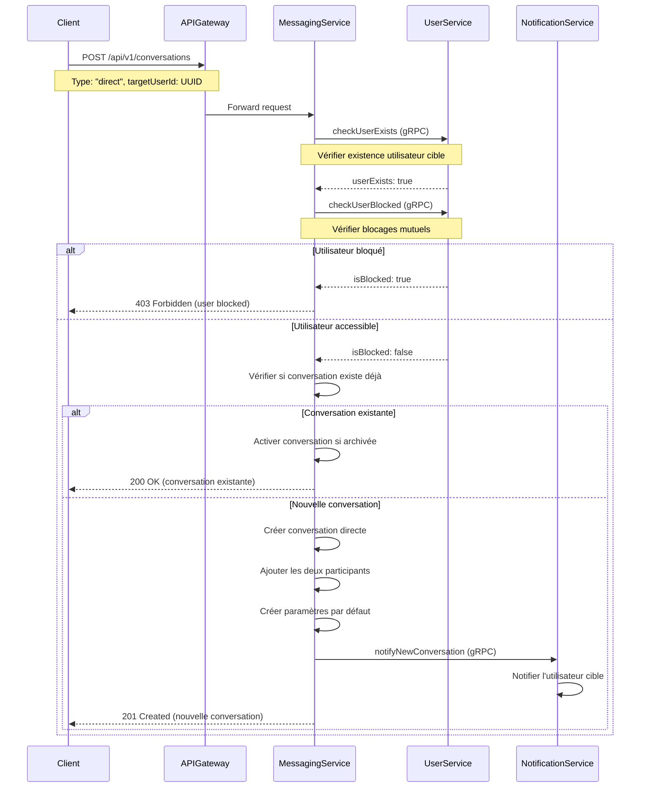
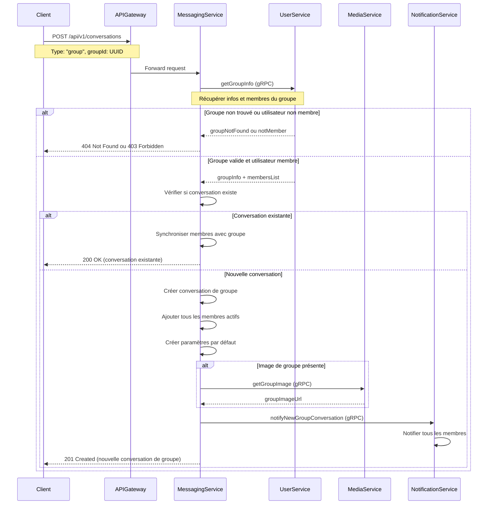
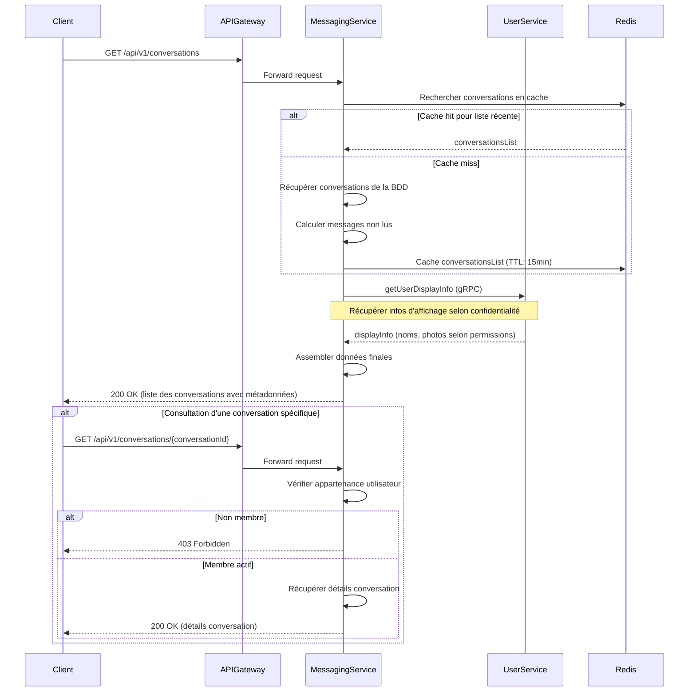
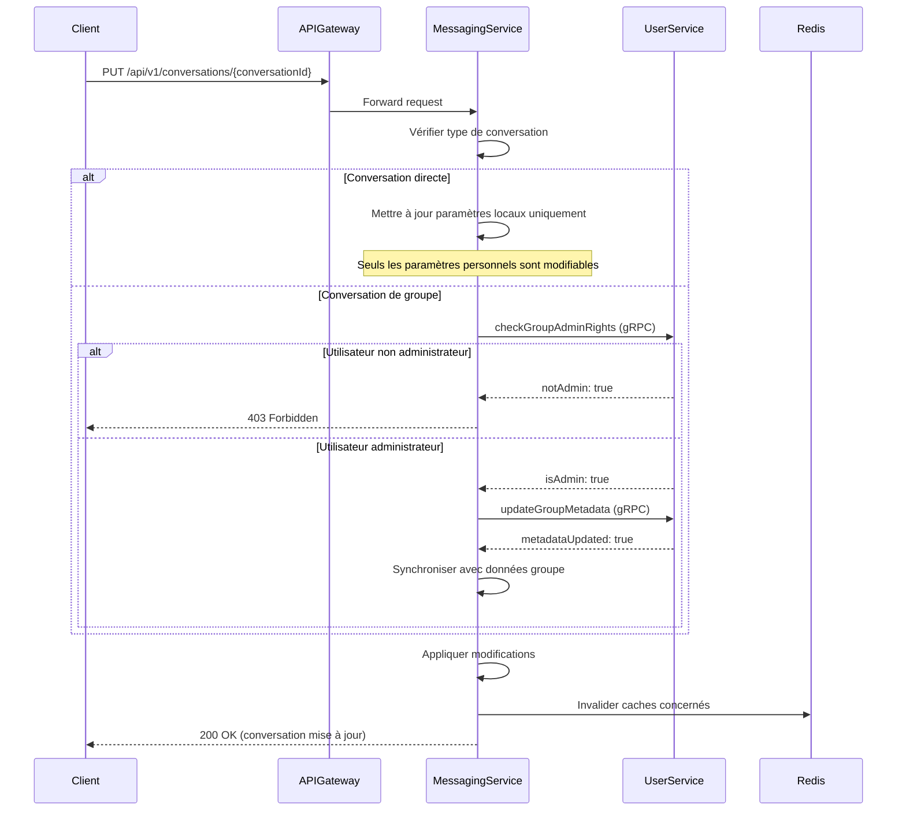
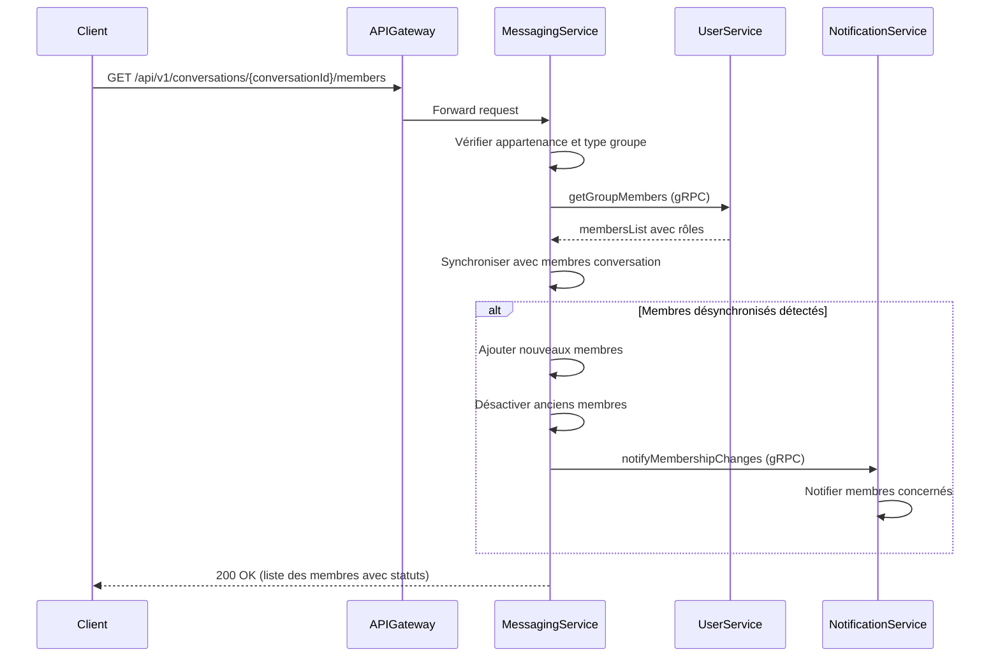
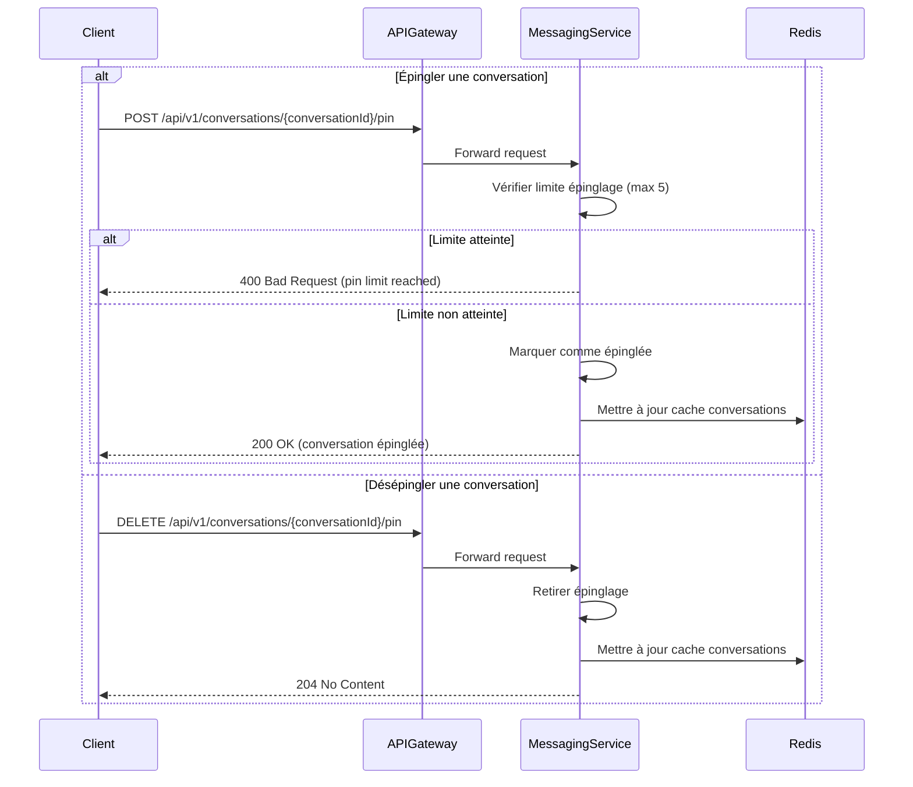
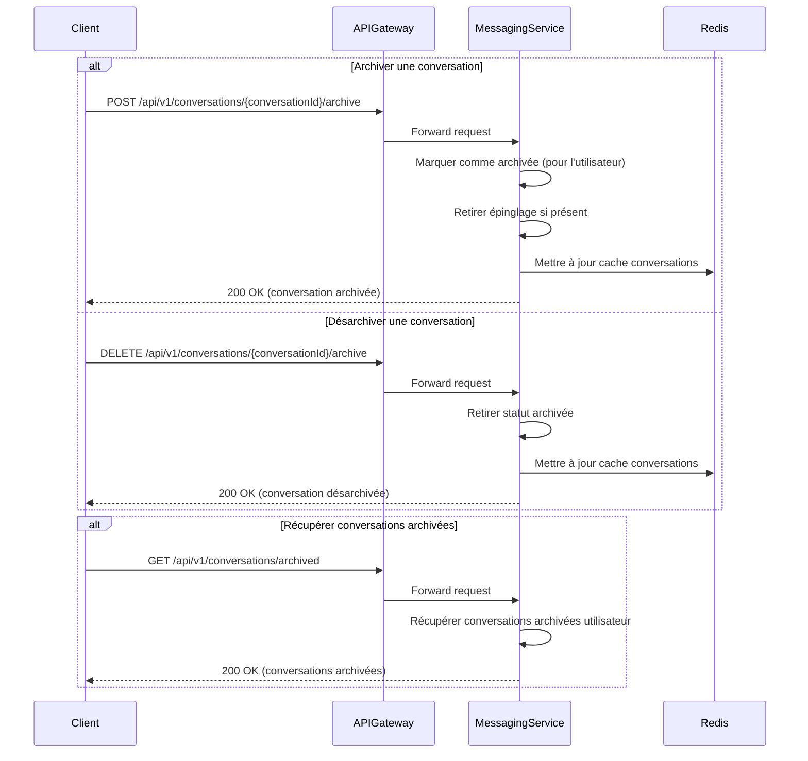
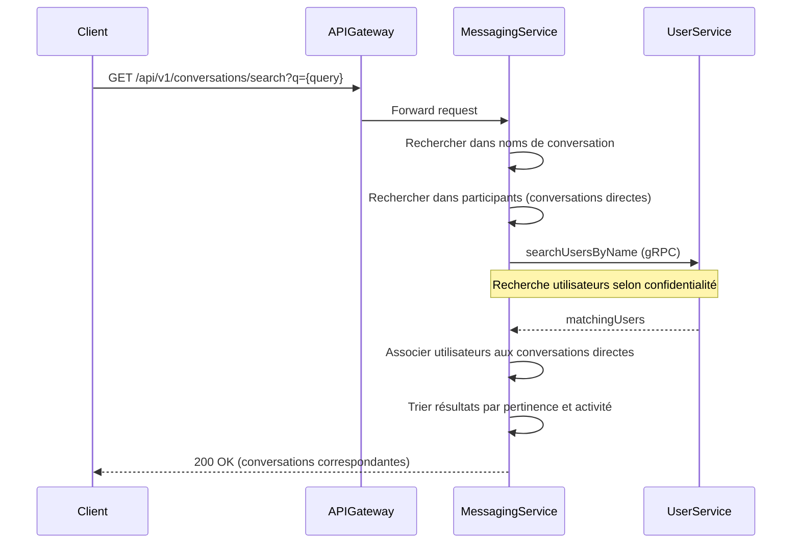
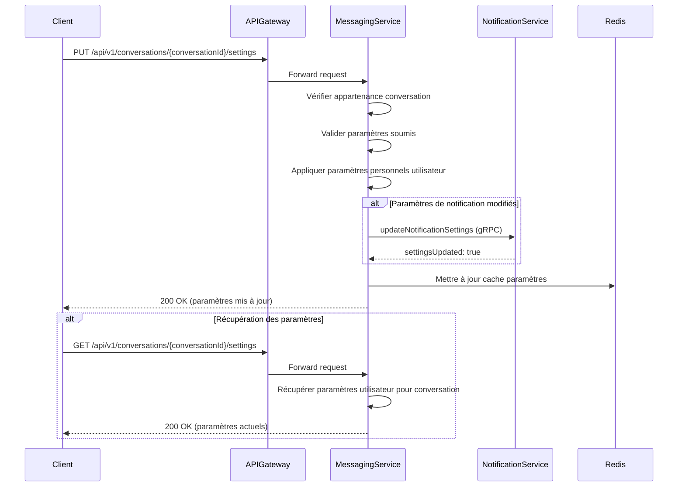
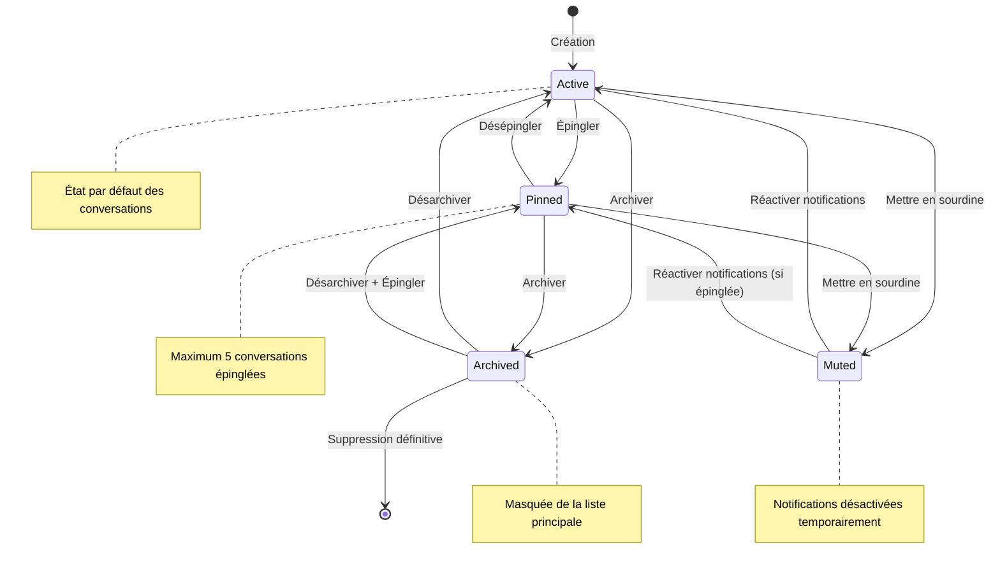

# Spécification Fonctionnelle - Gestion des Conversations

## 1. Vue d'ensemble

### 1.1 Objectif

Cette spécification détaille les fonctionnalités de gestion des conversations de l'application Whispr. Elle couvre la création, la consultation, la modification et l'organisation des canaux de communication entre utilisateurs. Ces fonctionnalités constituent le socle de l'expérience de messagerie, permettant aux utilisateurs de structurer et organiser leurs communications privées et de groupe.

### 1.2 Principes clés

- **Simplicité d'usage**: Interface intuitive pour créer et gérer les conversations
- **Isolation sécurisée**: Séparation stricte entre les différentes conversations
- **Flexibilité d'organisation**: Outils variés pour organiser et prioriser les conversations
- **Synchronisation multi-appareils**: Cohérence de l'expérience sur tous les appareils
- **Performance optimisée**: Accès rapide aux conversations actives et à l'historique
- **Respect de la confidentialité**: Application des paramètres de confidentialité des utilisateurs

### 1.3 Composants fonctionnels

Le système de gestion des conversations comprend six processus principaux :
1. **Création de conversations**: Initialisation de nouveaux canaux de communication
2. **Gestion des conversations directes**: Communication en tête-à-tête
3. **Gestion des conversations de groupe**: Communication multi-participants
4. **Organisation des conversations**: Épinglage, archivage, tri et recherche
5. **Configuration des paramètres**: Personnalisation par conversation
6. **Synchronisation multi-appareils**: Cohérence entre tous les appareils

## 2. Création de conversations

### 2.1 Création de conversations directes



### 2.2 Création de conversations de groupe



### 2.3 Validation et règles métier

#### Conversations directes
- **Validation des participants**: Vérification de l'existence des utilisateurs
- **Gestion des blocages**: Impossibilité de créer une conversation avec un utilisateur bloqué
- **Unicité**: Une seule conversation directe possible entre deux utilisateurs
- **Réactivation**: Les conversations archivées sont réactivées si nécessaire

#### Conversations de groupe
- **Synchronisation obligatoire**: La conversation doit correspondre à un groupe existant dans user-service
- **Appartenance vérifiée**: Seuls les membres du groupe peuvent initier la conversation
- **Mise à jour automatique**: Les changements de membres dans le groupe sont répercutés
- **Métadonnées partagées**: Nom, description et image synchronisés avec le groupe

## 3. Gestion des conversations existantes

### 3.1 Consultation et navigation



### 3.2 Mise à jour des métadonnées



### 3.3 Gestion des membres (groupes uniquement)



## 4. Organisation des conversations

### 4.1 Épinglage de conversations



### 4.2 Archivage de conversations



### 4.3 Recherche dans les conversations



## 5. Paramètres de conversation

### 5.1 Configuration des paramètres



### 5.2 Types de paramètres

#### Paramètres personnels (par utilisateur)
| Paramètre | Description | Valeurs possibles | Défaut |
|-----------|-------------|-------------------|--------|
| `notificationsEnabled` | Réception des notifications | boolean | true |
| `soundEnabled` | Son des notifications | boolean | true |
| `muteUntil` | Silencieux jusqu'à date/heure | timestamp ou null | null |
| `showReadReceipts` | Envoi des accusés de lecture | boolean | true |
| `showTypingIndicator` | Affichage "en train d'écrire" | boolean | true |
| `customNickname` | Surnom personnalisé (conversations directes) | string(50) ou null | null |

#### Paramètres de conversation (groupes uniquement)
| Paramètre | Description | Valeurs possibles | Défaut |
|-----------|-------------|-------------------|--------|
| `retentionDays` | Durée de conservation des messages | integer ou null | null (illimité) |
| `allowReadReceipts` | Autoriser les accusés de lecture | boolean | true |
| `allowTypingIndicators` | Autoriser indicateurs de frappe | boolean | true |
| `messageEditTimeLimit` | Limite temps modification (minutes) | integer | 15 |

## 6. États et transitions des conversations



## 7. Intégration avec les autres services

### 7.1 Interaction avec User Service
- **Validation des utilisateurs**: Vérification de l'existence et des blocages avant création
- **Informations de profil**: Récupération des noms, photos selon paramètres de confidentialité
- **Synchronisation des groupes**: Maintien de la cohérence avec les groupes créés dans user-service
- **Événements de groupe**: Écoute des modifications de membres, noms, permissions

### 7.2 Interaction avec Notification Service
- **Paramètres de notification**: Transmission des préférences par conversation
- **Nouveaux messages**: Déclenchement des notifications selon les paramètres
- **Événements de conversation**: Notifications pour épinglage, archivage, etc.

### 7.3 Interaction avec Media Service
- **Images de groupe**: Récupération des URLs d'images pour l'affichage
- **Médias partagés**: Liaison entre conversations et contenus multimédias

## 8. Considérations techniques

### 8.1 Structure des données

#### Table conversations (PostgreSQL)
```sql
CREATE TABLE conversations (
    id UUID PRIMARY KEY DEFAULT uuid_generate_v4(),
    type VARCHAR(20) NOT NULL CHECK (type IN ('direct', 'group')),
    external_group_id UUID, -- Référence au groupe dans user-service
    metadata JSONB NOT NULL DEFAULT '{}',
    created_at TIMESTAMP NOT NULL DEFAULT NOW(),
    updated_at TIMESTAMP NOT NULL DEFAULT NOW(),
    is_active BOOLEAN NOT NULL DEFAULT TRUE
);
```

#### Table conversation_members (PostgreSQL)
```sql
CREATE TABLE conversation_members (
    id UUID PRIMARY KEY DEFAULT uuid_generate_v4(),
    conversation_id UUID NOT NULL REFERENCES conversations(id) ON DELETE CASCADE,
    user_id UUID NOT NULL,
    settings JSONB NOT NULL DEFAULT '{}',
    joined_at TIMESTAMP NOT NULL DEFAULT NOW(),
    last_read_at TIMESTAMP,
    is_active BOOLEAN NOT NULL DEFAULT TRUE,
    is_pinned BOOLEAN NOT NULL DEFAULT FALSE,
    is_archived BOOLEAN NOT NULL DEFAULT FALSE,
    archived_at TIMESTAMP,
    UNIQUE(conversation_id, user_id)
);
```

### 8.2 Cache Redis

#### Structures principales
- **Liste des conversations**: `user:conversations:{userId}`
- **Détails de conversation**: `conversation:{conversationId}`
- **Paramètres utilisateur**: `user:conv:settings:{userId}:{conversationId}`
- **Compteurs non lus**: `user:unread:{userId}`

### 8.3 Endpoints API

| Endpoint | Méthode | Description | Paramètres |
|----------|---------|-------------|------------|
| `/api/v1/conversations` | GET | Lister les conversations | `include_archived`, `limit`, `offset` |
| `/api/v1/conversations` | POST | Créer une conversation | Corps avec type et participants |
| `/api/v1/conversations/{id}` | GET | Détails d'une conversation | - |
| `/api/v1/conversations/{id}` | PUT | Mettre à jour une conversation | Corps avec champs à modifier |
| `/api/v1/conversations/{id}/pin` | POST | Épingler une conversation | - |
| `/api/v1/conversations/{id}/pin` | DELETE | Désépingler une conversation | - |
| `/api/v1/conversations/{id}/archive` | POST | Archiver une conversation | - |
| `/api/v1/conversations/{id}/archive` | DELETE | Désarchiver une conversation | - |
| `/api/v1/conversations/{id}/settings` | GET | Paramètres de la conversation | - |
| `/api/v1/conversations/{id}/settings` | PUT | Modifier les paramètres | Corps avec paramètres |
| `/api/v1/conversations/search` | GET | Rechercher des conversations | `q` (terme de recherche) |
| `/api/v1/conversations/archived` | GET | Conversations archivées | `limit`, `offset` |

## 9. Mesures de sécurité

### 9.1 Contrôle d'accès
- **Vérification d'appartenance**: Contrôle systématique pour chaque opération
- **Isolation des conversations**: Impossibilité d'accéder aux conversations d'autres utilisateurs
- **Respect des blocages**: Application des restrictions entre utilisateurs bloqués
- **Validation des permissions**: Vérification des droits selon le type de conversation

### 9.2 Protection des données
- **Filtrage des métadonnées**: Respect des paramètres de confidentialité des participants
- **Audit des opérations**: Journalisation des actions sensibles (création, archivage)
- **Limitation des ressources**: Quotas sur le nombre de conversations et d'épinglages
- **Validation des entrées**: Contrôles stricts sur les données soumises

### 9.3 Prévention des abus
- **Rate limiting**: Limitation du nombre d'opérations par utilisateur et par période
- **Détection d'anomalies**: Surveillance des patterns d'usage suspects
- **Restrictions temporaires**: Blocage automatique en cas d'abus détecté

## 10. Tests

### 10.1 Tests unitaires
- Validation de la logique de création de conversations
- Fonctionnement des états (épinglage, archivage)
- Application correcte des paramètres de confidentialité
- Synchronisation avec les groupes du user-service

### 10.2 Tests d'intégration
- Flux complet de création et gestion de conversations
- Interactions entre messaging-service et user-service
- Propagation des événements vers notification-service
- Cohérence du cache Redis avec la base de données

### 10.3 Tests de performance
- Temps de réponse pour la liste des conversations
- Performance des requêtes de recherche
- Charge sur les opérations de synchronisation multi-appareils
- Efficacité du cache pour les conversations actives

## 11. Livrables

1. **Module Elixir/Phoenix** pour la gestion des conversations incluant :
   - GenServers pour les processus de conversation
   - Channels Phoenix pour les mises à jour temps réel
   - API REST complète pour la gestion des conversations

2. **Composants frontend** pour :
   - Liste des conversations avec tri et filtres
   - Interface de création de conversations
   - Gestion des paramètres par conversation
   - Fonctionnalités d'organisation (épinglage, archivage)

3. **Documentation utilisateur** expliquant :
   - Comment créer et organiser ses conversations
   - Configuration des paramètres de notification et confidentialité
   - Utilisation des fonctionnalités d'épinglage et d'archivage
   - Recherche et navigation dans les conversations