# Spécification Fonctionnelle - Envoi et Réception de Messages

## 1. Vue d'ensemble

### 1.1 Objectif

Cette spécification détaille le cœur fonctionnel de transmission des messages de l'application Whispr. Elle couvre les mécanismes d'envoi, de réception, de distribution et de garantie de livraison des messages entre utilisateurs. Ces fonctionnalités constituent l'essence même de l'application de messagerie, assurant une communication fiable, sécurisée et en temps réel.

### 1.2 Principes clés

- **Livraison garantie**: Aucun message ne doit être perdu en conditions normales
- **Ordre préservé**: Les messages doivent être délivrés dans l'ordre d'envoi par conversation
- **Déduplication**: Prévention des doublons même en cas de retry ou de problèmes réseau
- **Temps réel**: Livraison immédiate pour les utilisateurs connectés
- **Résilience**: Fonctionnement dégradé en cas de problèmes de connectivité
- **Chiffrement bout-en-bout**: Protection cryptographique du contenu des messages
- **Multi-appareils**: Synchronisation cohérente entre tous les appareils de l'utilisateur

### 1.3 Composants fonctionnels

Le système de messagerie comprend sept processus principaux :
1. **Envoi de messages**: Traitement et validation des messages sortants
2. **Distribution en temps réel**: Livraison immédiate aux destinataires connectés
3. **Stockage et persistance**: Sauvegarde fiable des messages
4. **Gestion des accusés de réception**: Suivi des statuts de livraison et de lecture
5. **Récupération et synchronisation**: Livraison différée et rattrapage d'historique
6. **Gestion des erreurs**: Retry automatique et escalade des problèmes
7. **Déduplication**: Prévention des messages dupliqués

## 2. Flux d'envoi de messages

### 2.1 Envoi via WebSocket (cas principal)

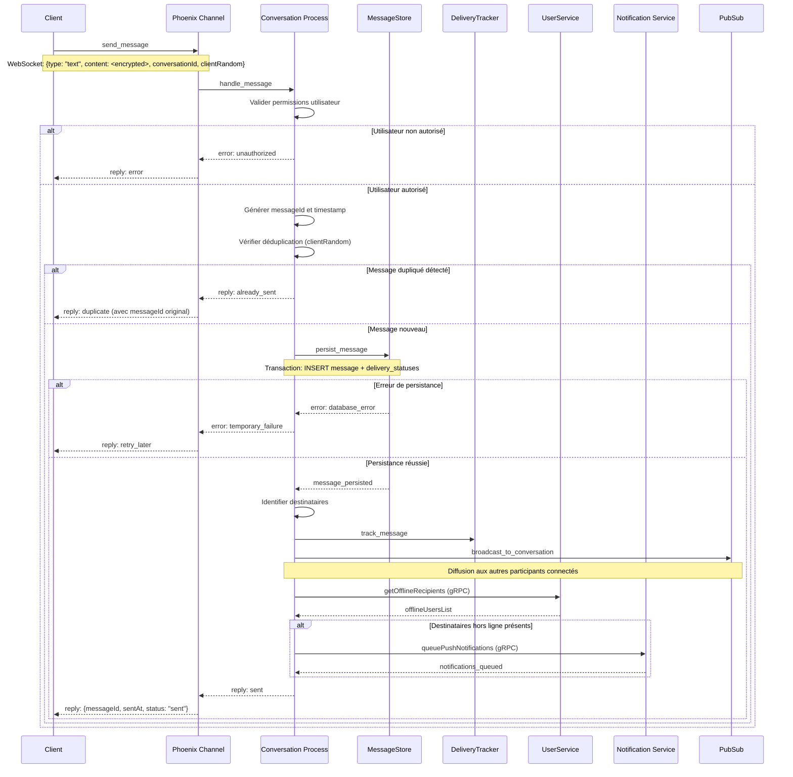
```mermaid
sequenceDiagram
    participant Client
    participant Channel as Phoenix Channel
    participant ConvProcess as Conversation Process
    participant MessageStore
    participant DeliveryTracker
    participant UserService
    participant NotifService as Notification Service
    participant PubSub
    
    Client->>Channel: send_message
    Note over Client,Channel: WebSocket: {type: "text", content: <encrypted>, conversationId, clientRandom}
    
    Channel->>ConvProcess: handle_message
    ConvProcess->>ConvProcess: Valider permissions utilisateur
    
    alt Utilisateur non autorisé
        ConvProcess-->>Channel: error: unauthorized
        Channel-->>Client: reply: error
    else Utilisateur autorisé
        ConvProcess->>ConvProcess: Générer messageId et timestamp
        ConvProcess->>ConvProcess: Vérifier déduplication (clientRandom)
        
        alt Message dupliqué détecté
            ConvProcess-->>Channel: reply: already_sent
            Channel-->>Client: reply: duplicate (avec messageId original)
        else Message nouveau
            ConvProcess->>MessageStore: persist_message
            Note over ConvProcess,MessageStore: Transaction: INSERT message + delivery_statuses
            
            alt Erreur de persistance
                MessageStore-->>ConvProcess: error: database_error
                ConvProcess-->>Channel: error: temporary_failure
                Channel-->>Client: reply: retry_later
            else Persistance réussie
                MessageStore-->>ConvProcess: message_persisted
                
                ConvProcess->>ConvProcess: Identifier destinataires
                ConvProcess->>DeliveryTracker: track_message
                
                ConvProcess->>PubSub: broadcast_to_conversation
                Note over ConvProcess,PubSub: Diffusion aux autres participants connectés
                
                ConvProcess->>UserService: getOfflineRecipients (gRPC)
                UserService-->>ConvProcess: offlineUsersList
                
                alt Destinataires hors ligne présents
                    ConvProcess->>NotifService: queuePushNotifications (gRPC)
                    NotifService-->>ConvProcess: notifications_queued
                end
                
                ConvProcess-->>Channel: reply: sent
                Channel-->>Client: reply: {messageId, sentAt, status: "sent"}
            end
        end
    end
```

### 2.2 Envoi via API REST (fallback)

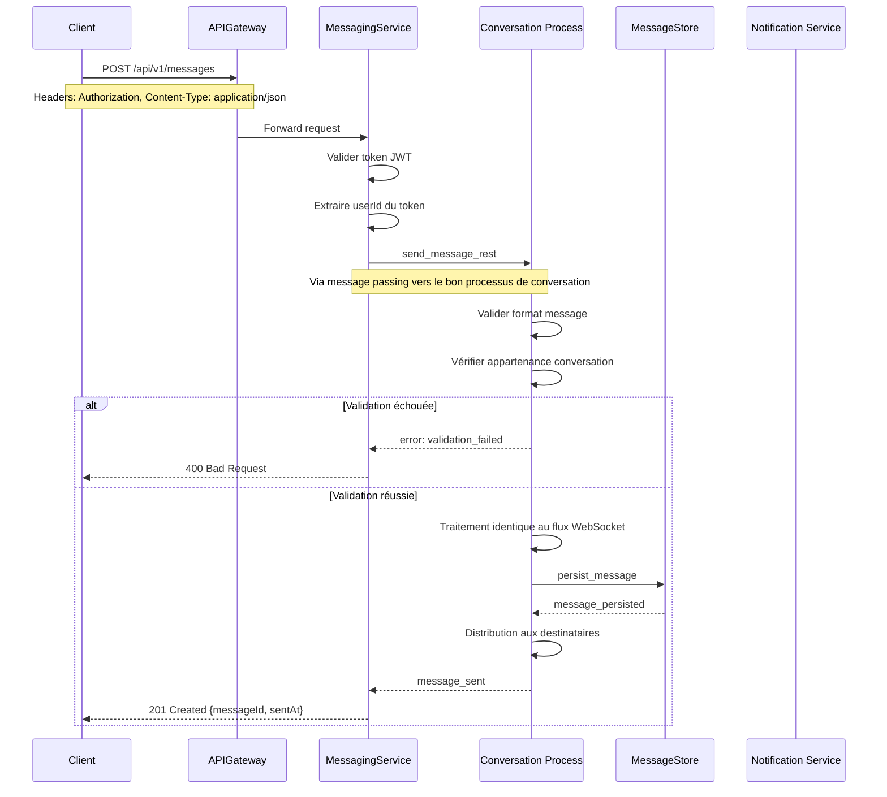
```mermaid
sequenceDiagram
    participant Client
    participant APIGateway
    participant MessagingService
    participant ConvProcess as Conversation Process
    participant MessageStore
    participant NotifService as Notification Service
    
    Client->>APIGateway: POST /api/v1/messages
    Note over Client,APIGateway: Headers: Authorization, Content-Type: application/json
    APIGateway->>MessagingService: Forward request
    
    MessagingService->>MessagingService: Valider token JWT
    MessagingService->>MessagingService: Extraire userId du token
    
    MessagingService->>ConvProcess: send_message_rest
    Note over MessagingService,ConvProcess: Via message passing vers le bon processus de conversation
    
    ConvProcess->>ConvProcess: Valider format message
    ConvProcess->>ConvProcess: Vérifier appartenance conversation
    
    alt Validation échouée
        ConvProcess-->>MessagingService: error: validation_failed
        MessagingService-->>Client: 400 Bad Request
    else Validation réussie
        ConvProcess->>ConvProcess: Traitement identique au flux WebSocket
        ConvProcess->>MessageStore: persist_message
        
        MessageStore-->>ConvProcess: message_persisted
        ConvProcess->>ConvProcess: Distribution aux destinataires
        
        ConvProcess-->>MessagingService: message_sent
        MessagingService-->>Client: 201 Created {messageId, sentAt}
    end
```

### 2.3 Validation et préparation des messages

#### Validation côté serveur
1. **Authentification**: Vérification du token JWT valide
2. **Autorisation**: Confirmation de l'appartenance à la conversation
3. **Format**: Validation de la structure du message (type, contenu chiffré, métadonnées)
4. **Limites**: Vérification des quotas (taille, fréquence d'envoi)
5. **Intégrité cryptographique**: Validation des signatures sans déchiffrement

#### Préparation pour distribution
1. **Attribution d'identifiants**: Génération d'UUID unique pour le message
2. **Horodatage**: Attribution du timestamp serveur (sent_at)
3. **Métadonnées d'acheminement**: Identification des destinataires
4. **Préparation des accusés**: Création des entrées de suivi de livraison

## 3. Distribution et réception en temps réel

### 3.1 Distribution aux utilisateurs connectés

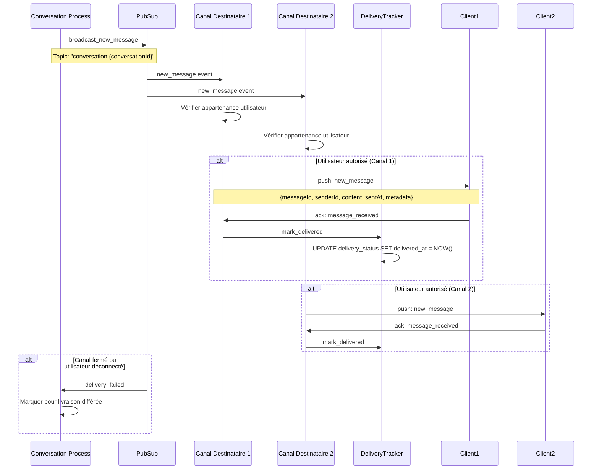
```mermaid
sequenceDiagram
    participant ConvProcess as Conversation Process
    participant PubSub
    participant RecipientChannel1 as Canal Destinataire 1
    participant RecipientChannel2 as Canal Destinataire 2
    participant DeliveryTracker
    participant Client1
    participant Client2
    
    ConvProcess->>PubSub: broadcast_new_message
    Note over ConvProcess,PubSub: Topic: "conversation:{conversationId}"
    
    PubSub->>RecipientChannel1: new_message event
    PubSub->>RecipientChannel2: new_message event
    
    RecipientChannel1->>RecipientChannel1: Vérifier appartenance utilisateur
    RecipientChannel2->>RecipientChannel2: Vérifier appartenance utilisateur
    
    alt Utilisateur autorisé (Canal 1)
        RecipientChannel1->>Client1: push: new_message
        Note over RecipientChannel1,Client1: {messageId, senderId, content, sentAt, metadata}
        
        Client1->>RecipientChannel1: ack: message_received
        RecipientChannel1->>DeliveryTracker: mark_delivered
        DeliveryTracker->>DeliveryTracker: UPDATE delivery_status SET delivered_at = NOW()
    end
    
    alt Utilisateur autorisé (Canal 2)
        RecipientChannel2->>Client2: push: new_message
        Client2->>RecipientChannel2: ack: message_received
        RecipientChannel2->>DeliveryTracker: mark_delivered
    end
    
    alt Canal fermé ou utilisateur déconnecté
        PubSub->>ConvProcess: delivery_failed
        ConvProcess->>ConvProcess: Marquer pour livraison différée
    end
```

### 3.2 Synchronisation multi-appareils

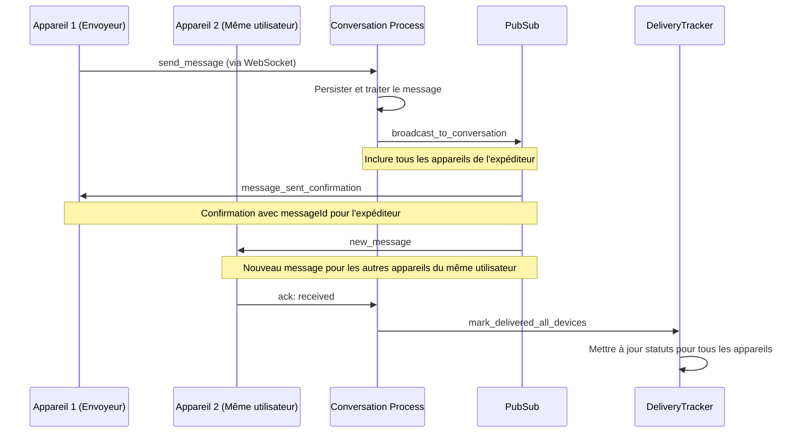
```mermaid
sequenceDiagram
    participant Device1 as Appareil 1 (Envoyeur)
    participant Device2 as Appareil 2 (Même utilisateur)
    participant ConvProcess as Conversation Process
    participant PubSub
    participant DeliveryTracker
    
    Device1->>ConvProcess: send_message (via WebSocket)
    ConvProcess->>ConvProcess: Persister et traiter le message
    
    ConvProcess->>PubSub: broadcast_to_conversation
    Note over ConvProcess,PubSub: Inclure tous les appareils de l'expéditeur
    
    PubSub->>Device1: message_sent_confirmation
    Note over PubSub,Device1: Confirmation avec messageId pour l'expéditeur
    
    PubSub->>Device2: new_message
    Note over PubSub,Device2: Nouveau message pour les autres appareils du même utilisateur
    
    Device2->>ConvProcess: ack: received
    ConvProcess->>DeliveryTracker: mark_delivered_all_devices
    
    DeliveryTracker->>DeliveryTracker: Mettre à jour statuts pour tous les appareils
```

## 4. Garanties de livraison et accusés de réception

### 4.1 Suivi des statuts de livraison

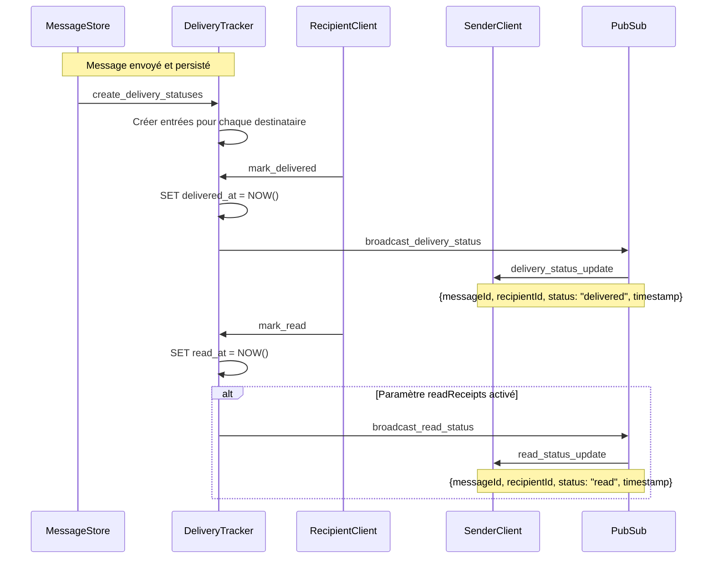
```mermaid
sequenceDiagram
    participant MessageStore
    participant DeliveryTracker
    participant RecipientClient
    participant SenderClient
    participant PubSub
    
    Note over MessageStore,DeliveryTracker: Message envoyé et persisté
    MessageStore->>DeliveryTracker: create_delivery_statuses
    DeliveryTracker->>DeliveryTracker: Créer entrées pour chaque destinataire
    
    RecipientClient->>DeliveryTracker: mark_delivered
    DeliveryTracker->>DeliveryTracker: SET delivered_at = NOW()
    
    DeliveryTracker->>PubSub: broadcast_delivery_status
    PubSub->>SenderClient: delivery_status_update
    Note over PubSub,SenderClient: {messageId, recipientId, status: "delivered", timestamp}
    
    RecipientClient->>DeliveryTracker: mark_read
    DeliveryTracker->>DeliveryTracker: SET read_at = NOW()
    
    alt Paramètre readReceipts activé
        DeliveryTracker->>PubSub: broadcast_read_status
        PubSub->>SenderClient: read_status_update
        Note over PubSub,SenderClient: {messageId, recipientId, status: "read", timestamp}
    end
```

### 4.2 États des messages

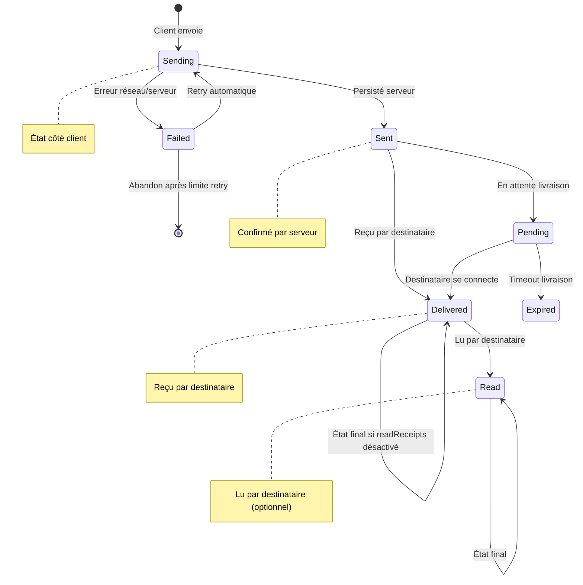
```mermaid
stateDiagram-v2
    [*] --> Sending : Client envoie
    Sending --> Sent : Persisté serveur
    Sending --> Failed : Erreur réseau/serveur
    Failed --> Sending : Retry automatique
    Failed --> [*] : Abandon après limite retry
    
    Sent --> Delivered : Reçu par destinataire
    Sent --> Pending : En attente livraison
    Pending --> Delivered : Destinataire se connecte
    Pending --> Expired : Timeout livraison
    
    Delivered --> Read : Lu par destinataire
    Delivered --> Delivered : État final si readReceipts désactivé
    Read --> Read : État final
    
    note right of Sending : État côté client
    note right of Sent : Confirmé par serveur
    note right of Delivered : Reçu par destinataire
    note right of Read : Lu par destinataire (optionnel)
```

## 5. Gestion des erreurs et cas de dégradation

### 5.1 Gestion des erreurs d'envoi

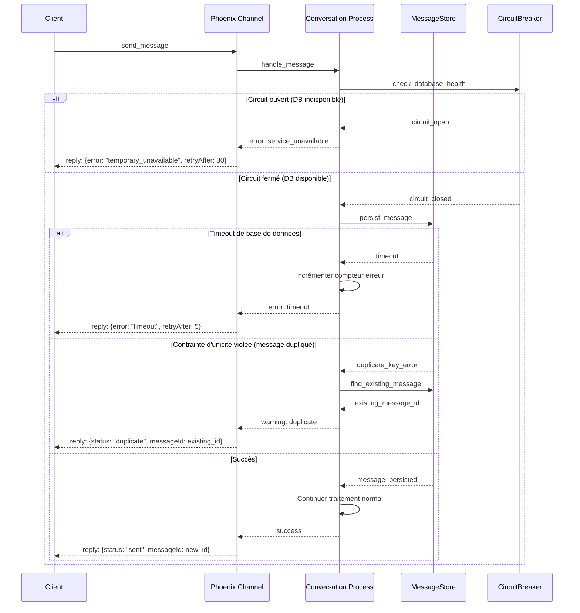
```mermaid
sequenceDiagram
    participant Client
    participant Channel as Phoenix Channel
    participant ConvProcess as Conversation Process
    participant MessageStore
    participant CircuitBreaker
    
    Client->>Channel: send_message
    Channel->>ConvProcess: handle_message
    
    ConvProcess->>CircuitBreaker: check_database_health
    
    alt Circuit ouvert (DB indisponible)
        CircuitBreaker-->>ConvProcess: circuit_open
        ConvProcess-->>Channel: error: service_unavailable
        Channel-->>Client: reply: {error: "temporary_unavailable", retryAfter: 30}
        
    else Circuit fermé (DB disponible)
        CircuitBreaker-->>ConvProcess: circuit_closed
        ConvProcess->>MessageStore: persist_message
        
        alt Timeout de base de données
            MessageStore-->>ConvProcess: timeout
            ConvProcess->>ConvProcess: Incrémenter compteur erreur
            ConvProcess-->>Channel: error: timeout
            Channel-->>Client: reply: {error: "timeout", retryAfter: 5}
            
        else Contrainte d'unicité violée (message dupliqué)
            MessageStore-->>ConvProcess: duplicate_key_error
            ConvProcess->>MessageStore: find_existing_message
            MessageStore-->>ConvProcess: existing_message_id
            ConvProcess-->>Channel: warning: duplicate
            Channel-->>Client: reply: {status: "duplicate", messageId: existing_id}
            
        else Succès
            MessageStore-->>ConvProcess: message_persisted
            ConvProcess->>ConvProcess: Continuer traitement normal
            ConvProcess-->>Channel: success
            Channel-->>Client: reply: {status: "sent", messageId: new_id}
        end
    end
```

### 5.2 Stratégies de retry côté client

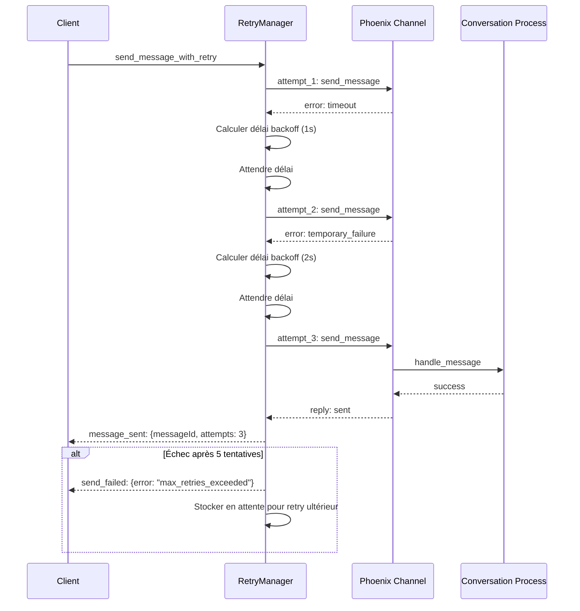
```mermaid
sequenceDiagram
    participant Client
    participant RetryManager
    participant Channel as Phoenix Channel
    participant ConvProcess as Conversation Process
    
    Client->>RetryManager: send_message_with_retry
    RetryManager->>Channel: attempt_1: send_message
    
    Channel-->>RetryManager: error: timeout
    
    RetryManager->>RetryManager: Calculer délai backoff (1s)
    RetryManager->>RetryManager: Attendre délai
    
    RetryManager->>Channel: attempt_2: send_message
    Channel-->>RetryManager: error: temporary_failure
    
    RetryManager->>RetryManager: Calculer délai backoff (2s)
    RetryManager->>RetryManager: Attendre délai
    
    RetryManager->>Channel: attempt_3: send_message
    Channel->>ConvProcess: handle_message
    ConvProcess-->>Channel: success
    Channel-->>RetryManager: reply: sent
    
    RetryManager-->>Client: message_sent: {messageId, attempts: 3}
    
    alt Échec après 5 tentatives
        RetryManager-->>Client: send_failed: {error: "max_retries_exceeded"}
        RetryManager->>RetryManager: Stocker en attente pour retry ultérieur
    end
```

### 5.3 Mode dégradé et récupération

#### Scénarios de dégradation
1. **Base de données indisponible**: Mode cache uniquement avec sync différée
2. **Service utilisateur indisponible**: Limitation des vérifications d'autorisation
3. **Service de notification indisponible**: Messages délivrés sans notifications push
4. **Surcharge du système**: Rate limiting adaptatif et priorisation des messages

#### Récupération automatique
1. **Health checks périodiques**: Vérification de la disponibilité des services
2. **Circuit breaker adaptatif**: Ouverture/fermeture automatique selon la santé du système
3. **Queue de récupération**: Messages en attente traités dès rétablissement
4. **Synchronisation post-incident**: Réconciliation des états après récupération

## 6. Déduplication des messages

### 6.1 Mécanisme de déduplication

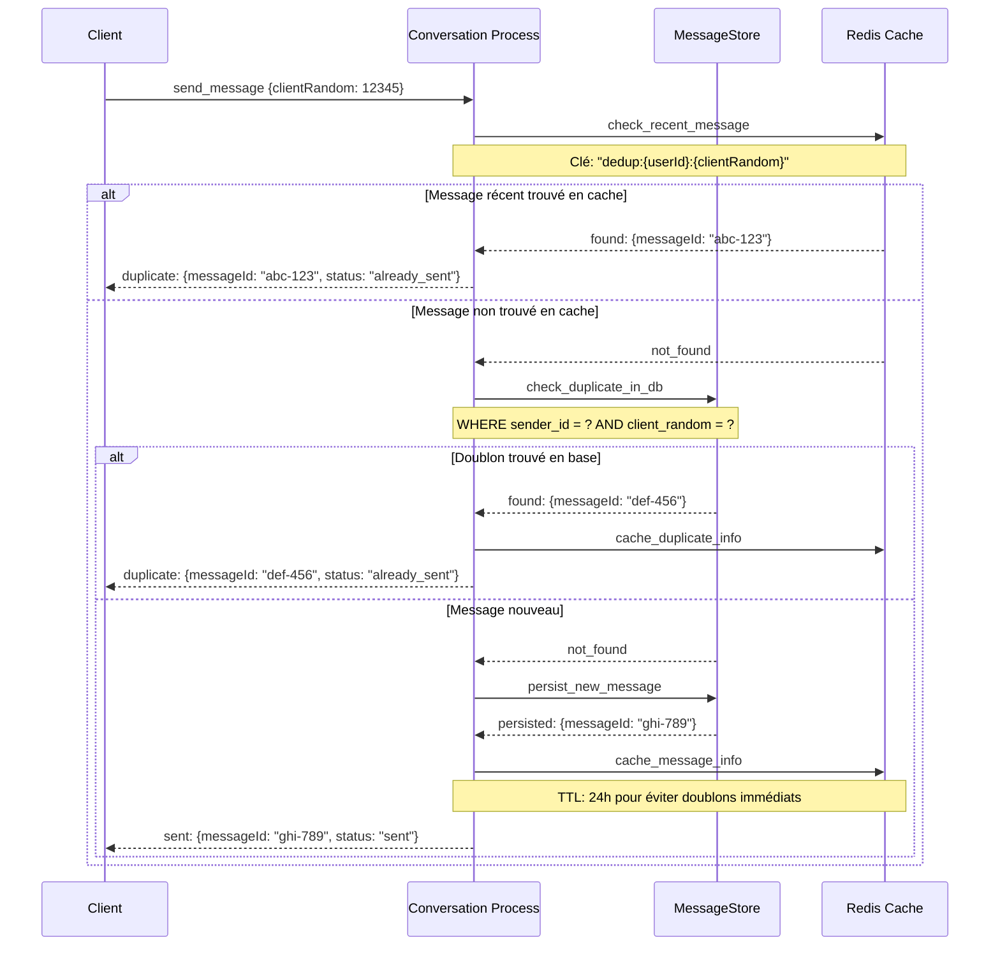
```mermaid
sequenceDiagram
    participant Client
    participant ConvProcess as Conversation Process
    participant MessageStore
    participant Cache as Redis Cache
    
    Client->>ConvProcess: send_message {clientRandom: 12345}
    ConvProcess->>Cache: check_recent_message
    Note over ConvProcess,Cache: Clé: "dedup:{userId}:{clientRandom}"
    
    alt Message récent trouvé en cache
        Cache-->>ConvProcess: found: {messageId: "abc-123"}
        ConvProcess-->>Client: duplicate: {messageId: "abc-123", status: "already_sent"}
        
    else Message non trouvé en cache
        Cache-->>ConvProcess: not_found
        ConvProcess->>MessageStore: check_duplicate_in_db
        Note over ConvProcess,MessageStore: WHERE sender_id = ? AND client_random = ?
        
        alt Doublon trouvé en base
            MessageStore-->>ConvProcess: found: {messageId: "def-456"}
            ConvProcess->>Cache: cache_duplicate_info
            ConvProcess-->>Client: duplicate: {messageId: "def-456", status: "already_sent"}
            
        else Message nouveau
            MessageStore-->>ConvProcess: not_found
            ConvProcess->>MessageStore: persist_new_message
            MessageStore-->>ConvProcess: persisted: {messageId: "ghi-789"}
            
            ConvProcess->>Cache: cache_message_info
            Note over ConvProcess,Cache: TTL: 24h pour éviter doublons immédiats
            
            ConvProcess-->>Client: sent: {messageId: "ghi-789", status: "sent"}
        end
    end
```

### 6.2 Génération des identifiants de déduplication

#### Côté client
- **clientRandom**: Entier généré aléatoirement par le client pour chaque message
- **Unicité temporelle**: Combinaison userId + clientRandom doit être unique sur 24h
- **Persistance locale**: Stockage des clientRandom pour éviter la réutilisation

#### Côté serveur
- **Contrainte d'unicité**: Index unique sur (sender_id, client_random) dans PostgreSQL
- **Cache de déduplication**: Entrées Redis avec TTL de 24h pour performances
- **Nettoyage automatique**: Purge des anciens identifiants après expiration

## 7. Ordonnancement et séquençage

### 7.1 Préservation de l'ordre des messages

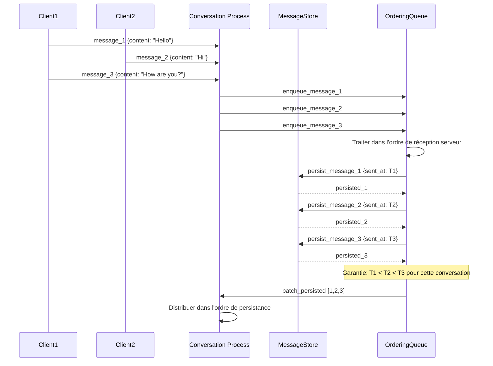
```mermaid
sequenceDiagram
    participant Client1
    participant Client2
    participant ConvProcess as Conversation Process
    participant MessageStore
    participant OrderingQueue
    
    Client1->>ConvProcess: message_1 {content: "Hello"}
    Client2->>ConvProcess: message_2 {content: "Hi"}
    Client1->>ConvProcess: message_3 {content: "How are you?"}
    
    ConvProcess->>OrderingQueue: enqueue_message_1
    ConvProcess->>OrderingQueue: enqueue_message_2  
    ConvProcess->>OrderingQueue: enqueue_message_3
    
    OrderingQueue->>OrderingQueue: Traiter dans l'ordre de réception serveur
    
    OrderingQueue->>MessageStore: persist_message_1 {sent_at: T1}
    MessageStore-->>OrderingQueue: persisted_1
    
    OrderingQueue->>MessageStore: persist_message_2 {sent_at: T2}
    MessageStore-->>OrderingQueue: persisted_2
    
    OrderingQueue->>MessageStore: persist_message_3 {sent_at: T3}
    MessageStore-->>OrderingQueue: persisted_3
    
    Note over OrderingQueue: Garantie: T1 < T2 < T3 pour cette conversation
    
    OrderingQueue->>ConvProcess: batch_persisted [1,2,3]
    ConvProcess->>ConvProcess: Distribuer dans l'ordre de persistance
```

### 7.2 Gestion de la concurrence

#### Stratégies d'ordonnancement
1. **Un processus par conversation**: Sérialisation naturelle via les processus Erlang
2. **File d'attente FIFO**: Traitement séquentiel des messages par conversation
3. **Horodatage serveur autoritaire**: Le serveur détermine l'ordre final
4. **Résolution de conflits**: Règles déterministes pour les messages simultanés

#### Optimisations de performance
1. **Traitement par lots**: Persistance groupée pour réduire les I/O
2. **Pipeline asynchrone**: Séparation entre persistance et distribution
3. **Cache d'écriture**: Buffer temporaire pour lisser les pics de charge
4. **Partitionnement**: Distribution des conversations sur plusieurs processus

## 8. Messages spéciaux et métadonnées

### 8.1 Types de messages supportés

| Type | Description | Traitement spécial |
|------|-------------|-------------------|
| `text` | Message texte standard | Chiffrement E2E standard |
| `media` | Contenu multimédia | Référence vers media-service |
| `system` | Message généré par le système | Non chiffré, métadonnées uniquement |
| `ephemeral` | Message à disparition | TTL automatique |
| `edit` | Modification de message existant | Référence message original |
| `reaction` | Réaction emoji | Métadonnées légères |

### 8.2 Traitement des messages éphémères

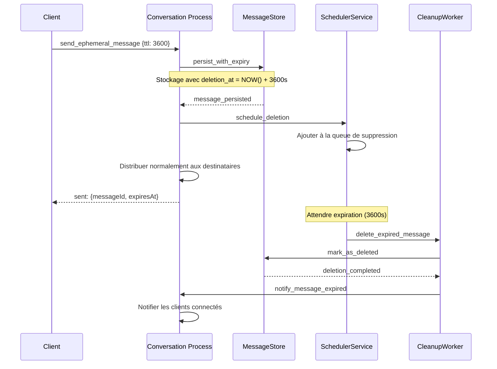
```mermaid
sequenceDiagram
    participant Client
    participant ConvProcess as Conversation Process
    participant MessageStore
    participant SchedulerService
    participant CleanupWorker
    
    Client->>ConvProcess: send_ephemeral_message {ttl: 3600}
    ConvProcess->>MessageStore: persist_with_expiry
    Note over ConvProcess,MessageStore: Stockage avec deletion_at = NOW() + 3600s
    
    MessageStore-->>ConvProcess: message_persisted
    ConvProcess->>SchedulerService: schedule_deletion
    SchedulerService->>SchedulerService: Ajouter à la queue de suppression
    
    ConvProcess->>ConvProcess: Distribuer normalement aux destinataires
    ConvProcess-->>Client: sent: {messageId, expiresAt}
    
    Note over SchedulerService: Attendre expiration (3600s)
    
    SchedulerService->>CleanupWorker: delete_expired_message
    CleanupWorker->>MessageStore: mark_as_deleted
    MessageStore-->>CleanupWorker: deletion_completed
    
    CleanupWorker->>ConvProcess: notify_message_expired
    ConvProcess->>ConvProcess: Notifier les clients connectés
```

## 9. Intégration avec les autres services

### 9.1 Interaction avec User Service

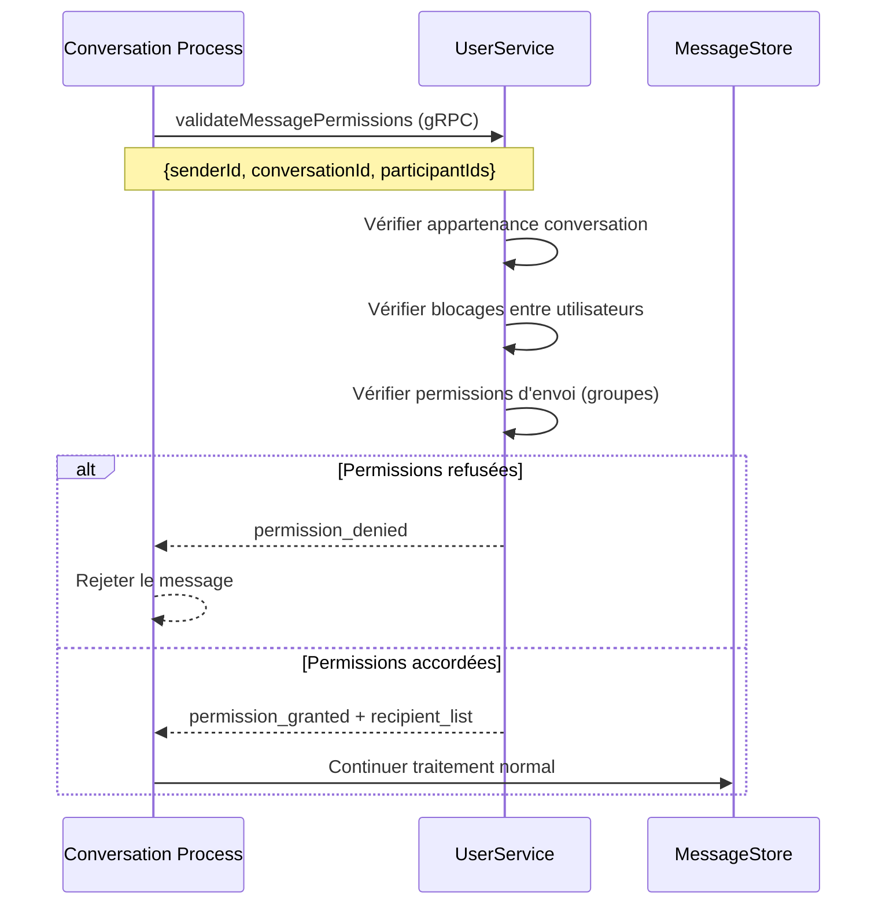
```mermaid
sequenceDiagram
    participant ConvProcess as Conversation Process
    participant UserService
    participant MessageStore
    
    ConvProcess->>UserService: validateMessagePermissions (gRPC)
    Note over ConvProcess,UserService: {senderId, conversationId, participantIds}
    
    UserService->>UserService: Vérifier appartenance conversation
    UserService->>UserService: Vérifier blocages entre utilisateurs
    UserService->>UserService: Vérifier permissions d'envoi (groupes)
    
    alt Permissions refusées
        UserService-->>ConvProcess: permission_denied
        ConvProcess-->>ConvProcess: Rejeter le message
    else Permissions accordées
        UserService-->>ConvProcess: permission_granted + recipient_list
        ConvProcess->>MessageStore: Continuer traitement normal
    end
```

### 9.2 Interaction avec Media Service

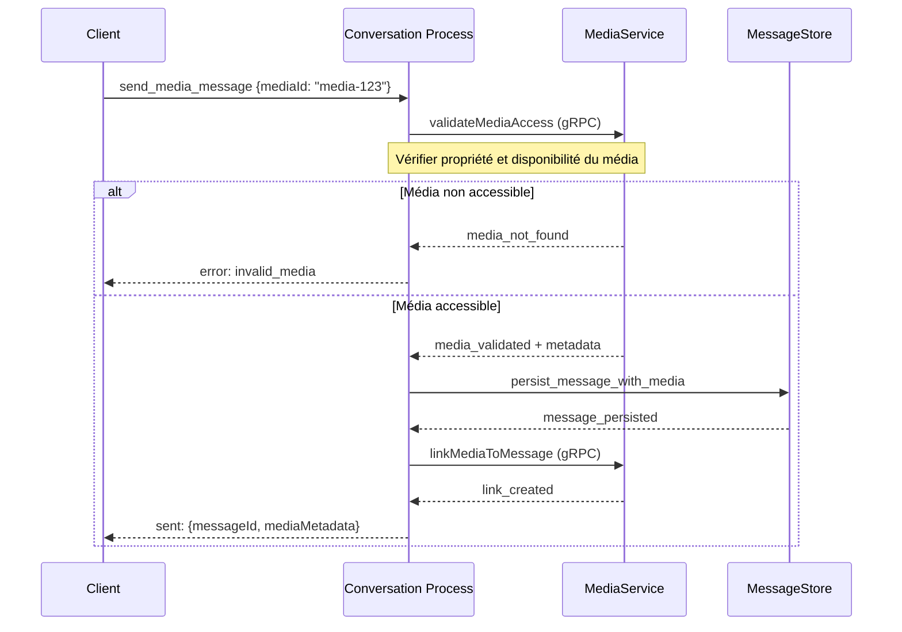
```mermaid
sequenceDiagram
    participant Client
    participant ConvProcess as Conversation Process
    participant MediaService
    participant MessageStore
    
    Client->>ConvProcess: send_media_message {mediaId: "media-123"}
    ConvProcess->>MediaService: validateMediaAccess (gRPC)
    Note over ConvProcess,MediaService: Vérifier propriété et disponibilité du média
    
    alt Média non accessible
        MediaService-->>ConvProcess: media_not_found
        ConvProcess-->>Client: error: invalid_media
    else Média accessible
        MediaService-->>ConvProcess: media_validated + metadata
        ConvProcess->>MessageStore: persist_message_with_media
        
        MessageStore-->>ConvProcess: message_persisted
        ConvProcess->>MediaService: linkMediaToMessage (gRPC)
        MediaService-->>ConvProcess: link_created
        
        ConvProcess-->>Client: sent: {messageId, mediaMetadata}
    end
```

### 9.3 Interaction avec Notification Service

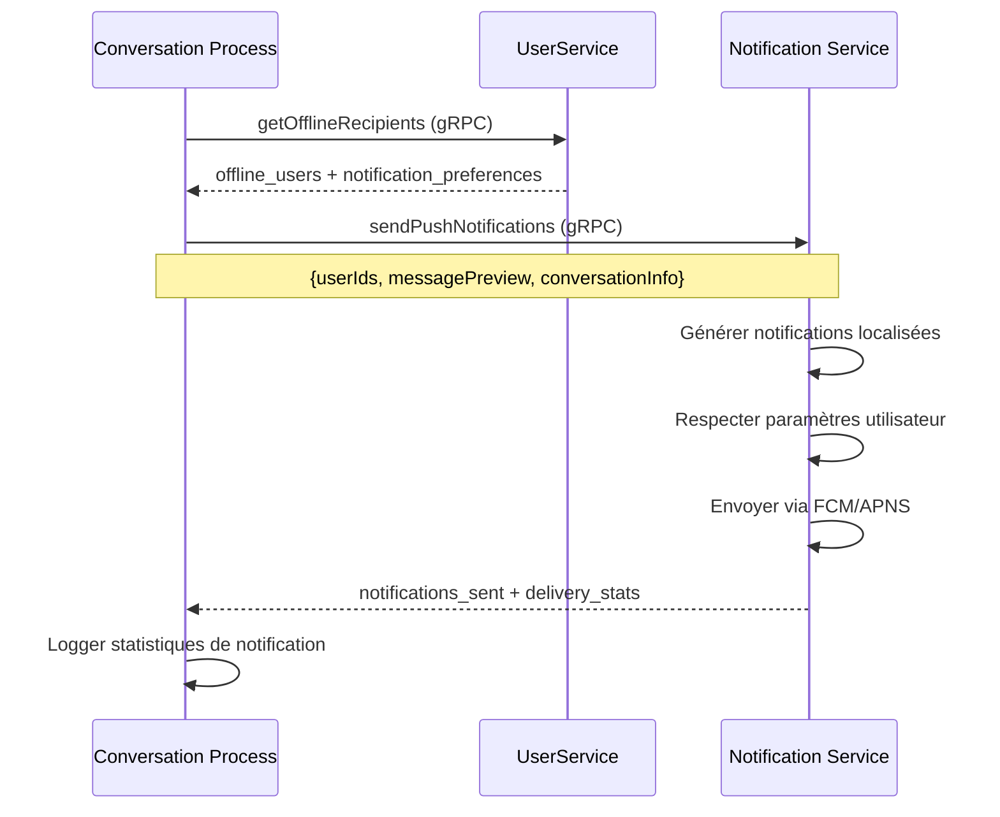
```mermaid
sequenceDiagram
    participant ConvProcess as Conversation Process
    participant UserService
    participant NotifService as Notification Service
    
    ConvProcess->>UserService: getOfflineRecipients (gRPC)
    UserService-->>ConvProcess: offline_users + notification_preferences
    
    ConvProcess->>NotifService: sendPushNotifications (gRPC)
    Note over ConvProcess,NotifService: {userIds, messagePreview, conversationInfo}
    
    NotifService->>NotifService: Générer notifications localisées
    NotifService->>NotifService: Respecter paramètres utilisateur
    NotifService->>NotifService: Envoyer via FCM/APNS
    
    NotifService-->>ConvProcess: notifications_sent + delivery_stats
    ConvProcess->>ConvProcess: Logger statistiques de notification
```

## 10. Considérations techniques

### 10.1 Structure des données

#### Table messages (PostgreSQL)
```sql
CREATE TABLE messages (
    id UUID PRIMARY KEY DEFAULT uuid_generate_v4(),
    conversation_id UUID NOT NULL REFERENCES conversations(id) ON DELETE CASCADE,
    sender_id UUID NOT NULL,
    reply_to_id UUID REFERENCES messages(id),
    message_type VARCHAR(20) NOT NULL,
    content BYTEA NOT NULL, -- Contenu chiffré
    metadata JSONB NOT NULL DEFAULT '{}',
    client_random INTEGER NOT NULL,
    sent_at TIMESTAMP NOT NULL DEFAULT NOW(),
    edited_at TIMESTAMP,
    expires_at TIMESTAMP, -- Pour messages éphémères
    is_deleted BOOLEAN NOT NULL DEFAULT FALSE,
    delete_for_everyone BOOLEAN NOT NULL DEFAULT FALSE,
    UNIQUE(sender_id, client_random)
);
```

#### Table delivery_statuses (PostgreSQL)
```sql
CREATE TABLE delivery_statuses (
    id UUID PRIMARY KEY DEFAULT uuid_generate_v4(),
    message_id UUID NOT NULL REFERENCES messages(id) ON DELETE CASCADE,
    user_id UUID NOT NULL,
    delivered_at TIMESTAMP,
    read_at TIMESTAMP,
    UNIQUE(message_id, user_id)
);
```

### 10.2 Cache Redis

#### Structures de déduplication et performance
- **Déduplication**: `dedup:{userId}:{clientRandom}` (TTL: 24h)
- **Messages récents**: `conv:recent:{conversationId}` (TTL: 1h)
- **Statuts de livraison**: `delivery:{messageId}` (TTL: 7j)
- **Queue de retry**: `retry:messages:{priority}` (persistant)

### 10.3 Processus Elixir/OTP

#### Architecture des processus
```elixir
# Supervision tree pour les conversations
defmodule WhisprMessaging.ConversationSupervisor do
  use DynamicSupervisor
  
  def start_conversation(conversation_id) do
    spec = {WhisprMessaging.ConversationProcess, conversation_id}
    DynamicSupervisor.start_child(__MODULE__, spec)
  end
end

# Processus de conversation individuel
defmodule WhisprMessaging.ConversationProcess do
  use GenServer
  
  def handle_call({:send_message, message_data}, _from, state) do
    # Logique de traitement des messages
    case process_message(message_data, state) do
      {:ok, message_id} -> {:reply, {:ok, message_id}, state}
      {:error, reason} -> {:reply, {:error, reason}, state}
    end
  end
end
```

## 11. Endpoints API

| Endpoint | Méthode | Description | Paramètres |
|----------|---------|-------------|------------|
| `/api/v1/messages` | POST | Envoyer un message | Corps avec contenu et destinataires |
| `/api/v1/messages/{id}` | GET | Récupérer un message | - |
| `/api/v1/messages/{id}` | PUT | Modifier un message | Corps avec nouveau contenu |
| `/api/v1/messages/{id}` | DELETE | Supprimer un message | `for_everyone` (boolean) |
| `/api/v1/messages/{id}/read` | POST | Marquer comme lu | - |
| `/api/v1/messages/{id}/reactions` | POST | Ajouter une réaction | Corps avec emoji |
| `/api/v1/conversations/{id}/messages` | GET | Messages d'une conversation | `limit`, `before`, `after` |
| `/api/v1/messages/scheduled` | POST | Programmer un message | Corps avec `scheduled_for` |
| `/api/v1/messages/drafts` | POST | Sauvegarder un brouillon | Corps avec contenu temporaire |

## 12. Mesures de sécurité

### 12.1 Validation et filtrage
- **Validation du contenu chiffré**: Vérification de l'intégrité sans déchiffrement
- **Rate limiting adaptatif**: Limitation basée sur le comportement utilisateur
- **Détection de spam**: Analyse des patterns d'envoi suspects
- **Validation des permissions**: Contrôle strict des autorisations d'envoi

### 12.2 Protection contre les abus
- **Limitation de débit**: Maximum 100 messages par minute par utilisateur
- **Détection d'anomalies**: Surveillance des volumes et fréquences anormaux
- **Quarantaine temporaire**: Restriction automatique des comptes suspects
- **Audit complet**: Journalisation de toutes les opérations de messagerie

## 13. Tests

### 13.1 Tests unitaires
- Logique de déduplication des messages
- Validation des permissions d'envoi
- Ordonnancement correct des messages
- Gestion des erreurs et retry

### 13.2 Tests d'intégration
- Flux complet d'envoi/réception via WebSocket et REST
- Synchronisation multi-appareils
- Intégration avec user-service et media-service
- Fonctionnement des accusés de réception

### 13.3 Tests de performance et charge
- Débit maximum de messages par seconde
- Latence de livraison en conditions normales et de charge
- Comportement du système lors de pics de trafic
- Efficacité des mécanismes de cache et déduplication

### 13.4 Tests de résilience
- Comportement lors de pannes de base de données
- Récupération après coupures réseau
- Gestion des services externes indisponibles
- Validation du mode dégradé

## 14. Livrables

1. **Modules Elixir/Phoenix** pour :
   - Processus de conversation avec GenServer
   - Channels Phoenix pour WebSocket
   - API REST pour fallback et intégration
   - Workers pour traitement asynchrone

2. **Composants de gestion d'état** :
   - Déduplication et cache Redis
   - Système de retry et récupération
   - Monitoring et métriques en temps réel

3. **Interface client** :
   - SDK WebSocket pour envoi temps réel
   - Composants React pour affichage des messages
   - Gestion des états de livraison
   - Interface de retry et gestion d'erreurs

4. **Documentation opérationnelle** :
   - Guide de déploiement et configuration
   - Procédures de monitoring et dépannage
   - Métriques et alertes recommandées
   - Stratégies de scaling et performance