# Spécification Fonctionnelle - Chiffrement Bout-en-Bout

## 1. Vue d'ensemble

### 1.1 Objectif

Cette spécification détaille l'implémentation du chiffrement bout-en-bout (E2EE) de l'application Whispr basé sur le protocole Signal. Elle couvre les mécanismes cryptographiques, l'échange de clés, la vérification d'intégrité et la gestion multi-appareils. Ce système garantit que seuls les participants autorisés peuvent lire le contenu des messages, excluant les serveurs et toute partie tierce.

### 1.2 Principes cryptographiques fondamentaux

- **Confidentialité parfaite vers l'avant (Perfect Forward Secrecy)**: Compromise d'une clé ne permet pas de déchiffrer les messages précédents
- **Confidentialité vers l'arrière (Post-Compromise Security)**: Récupération de la sécurité après compromise d'une clé
- **Deniability cryptographique**: Impossibilité de prouver l'authenticité d'un message à un tiers
- **Résistance aux attaques par rejeu**: Protection contre la retransmission malveillante de messages
- **Intégrité cryptographique**: Garantie que les messages n'ont pas été altérés
- **Authentification**: Vérification de l'identité de l'expéditeur

### 1.3 Architecture du protocole Signal

Le protocole Signal se compose de trois éléments principaux :
1. **X3DH (Extended Triple Diffie-Hellman)**: Établissement initial de session sécurisée
2. **Double Ratchet**: Rotation continue des clés pour chaque message
3. **Curve25519**: Cryptographie sur courbe elliptique pour l'échange de clés
4. **AES-256-GCM**: Chiffrement symétrique authentifié du contenu

### 1.4 Composants fonctionnels

Le système de chiffrement comprend huit processus principaux :
1. **Génération et gestion des clés d'identité**: Clés long terme par appareil
2. **Échange initial de clés (X3DH)**: Établissement de session sécurisée
3. **Double Ratchet**: Evolution continue des clés de chiffrement
4. **Chiffrement et déchiffrement des messages**: Protection du contenu
5. **Vérification d'intégrité**: Validation de l'authenticité des messages
6. **Gestion multi-appareils**: Synchronisation sécurisée entre appareils
7. **Codes de sécurité**: Vérification manuelle de l'identité
8. **Rotation et récupération**: Gestion des compromissions et erreurs

## 2. Génération et gestion des clés d'identité

### 2.1 Initialisation cryptographique d'un appareil

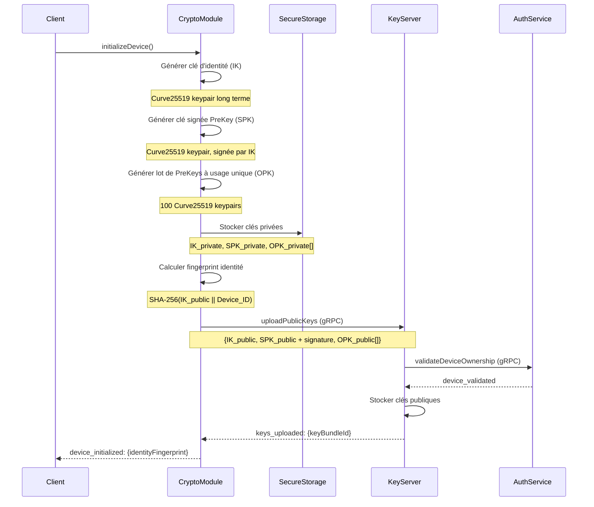
```mermaid
sequenceDiagram
    participant Client
    participant CryptoModule
    participant SecureStorage
    participant KeyServer
    participant AuthService
    
    Client->>CryptoModule: initializeDevice()
    
    CryptoModule->>CryptoModule: Générer clé d'identité (IK)
    Note over CryptoModule: Curve25519 keypair long terme
    
    CryptoModule->>CryptoModule: Générer clé signée PreKey (SPK)
    Note over CryptoModule: Curve25519 keypair, signée par IK
    
    CryptoModule->>CryptoModule: Générer lot de PreKeys à usage unique (OPK)
    Note over CryptoModule: 100 Curve25519 keypairs
    
    CryptoModule->>SecureStorage: Stocker clés privées
    Note over CryptoModule,SecureStorage: IK_private, SPK_private, OPK_private[]
    
    CryptoModule->>CryptoModule: Calculer fingerprint identité
    Note over CryptoModule: SHA-256(IK_public || Device_ID)
    
    CryptoModule->>KeyServer: uploadPublicKeys (gRPC)
    Note over CryptoModule,KeyServer: {IK_public, SPK_public + signature, OPK_public[]}
    
    KeyServer->>AuthService: validateDeviceOwnership (gRPC)
    AuthService-->>KeyServer: device_validated
    
    KeyServer->>KeyServer: Stocker clés publiques
    KeyServer-->>CryptoModule: keys_uploaded: {keyBundleId}
    
    CryptoModule-->>Client: device_initialized: {identityFingerprint}
```

### 2.2 Structure des clés cryptographiques

#### Clé d'identité (Identity Key - IK)
- **Type**: Curve25519 keypair
- **Durée de vie**: Permanente pour l'appareil
- **Usage**: Signature des PreKeys et authentification long terme
- **Stockage**: Sécurisé côté client, publique côté serveur

#### PreKey signée (Signed PreKey - SPK)
- **Type**: Curve25519 keypair signée par IK
- **Durée de vie**: 1 semaine (rotation automatique)
- **Usage**: Échange de clés semi-permanent pour X3DH
- **Signature**: Ed25519 signature par la clé d'identité

#### PreKeys à usage unique (One-Time PreKeys - OPK)
- **Type**: Curve25519 keypair
- **Durée de vie**: Une seule utilisation
- **Usage**: Perfect Forward Secrecy dans X3DH
- **Quantité**: 100 clés générées, rechargement automatique à 20

### 2.3 Rotation automatique des clés

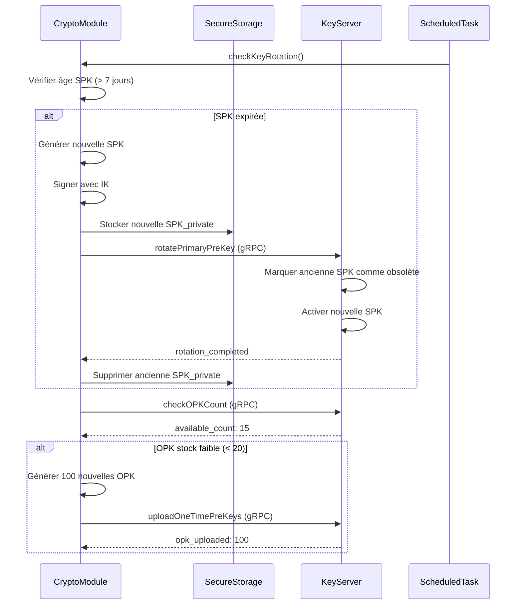
```mermaid
sequenceDiagram
    participant CryptoModule
    participant SecureStorage
    participant KeyServer
    participant ScheduledTask
    
    ScheduledTask->>CryptoModule: checkKeyRotation()
    CryptoModule->>CryptoModule: Vérifier âge SPK (> 7 jours)
    
    alt SPK expirée
        CryptoModule->>CryptoModule: Générer nouvelle SPK
        CryptoModule->>CryptoModule: Signer avec IK
        CryptoModule->>SecureStorage: Stocker nouvelle SPK_private
        
        CryptoModule->>KeyServer: rotatePrimaryPreKey (gRPC)
        KeyServer->>KeyServer: Marquer ancienne SPK comme obsolète
        KeyServer->>KeyServer: Activer nouvelle SPK
        KeyServer-->>CryptoModule: rotation_completed
        
        CryptoModule->>SecureStorage: Supprimer ancienne SPK_private
    end
    
    CryptoModule->>KeyServer: checkOPKCount (gRPC)
    KeyServer-->>CryptoModule: available_count: 15
    
    alt OPK stock faible (< 20)
        CryptoModule->>CryptoModule: Générer 100 nouvelles OPK
        CryptoModule->>KeyServer: uploadOneTimePreKeys (gRPC)
        KeyServer-->>CryptoModule: opk_uploaded: 100
    end
```

## 3. Établissement de session X3DH

### 3.1 Récupération du key bundle et calcul de la clé partagée

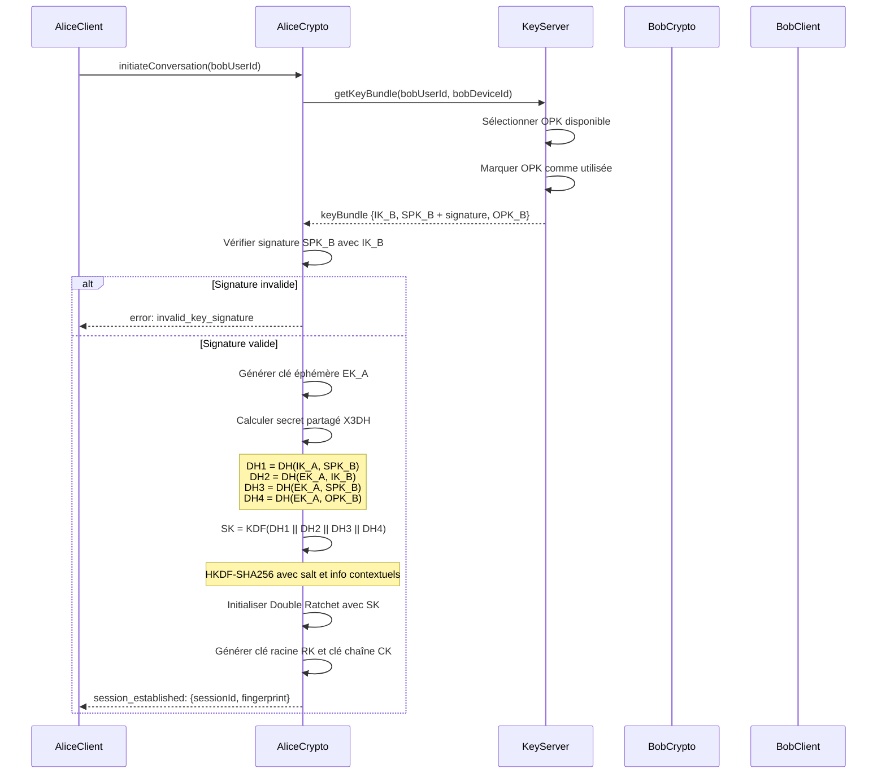
```mermaid
sequenceDiagram
    participant AliceClient
    participant AliceCrypto
    participant KeyServer
    participant BobCrypto
    participant BobClient
    
    AliceClient->>AliceCrypto: initiateConversation(bobUserId)
    AliceCrypto->>KeyServer: getKeyBundle(bobUserId, bobDeviceId)
    
    KeyServer->>KeyServer: Sélectionner OPK disponible
    KeyServer->>KeyServer: Marquer OPK comme utilisée
    KeyServer-->>AliceCrypto: keyBundle {IK_B, SPK_B + signature, OPK_B}
    
    AliceCrypto->>AliceCrypto: Vérifier signature SPK_B avec IK_B
    
    alt Signature invalide
        AliceCrypto-->>AliceClient: error: invalid_key_signature
    else Signature valide
        AliceCrypto->>AliceCrypto: Générer clé éphémère EK_A
        
        AliceCrypto->>AliceCrypto: Calculer secret partagé X3DH
        Note over AliceCrypto: DH1 = DH(IK_A, SPK_B)<br/>DH2 = DH(EK_A, IK_B)<br/>DH3 = DH(EK_A, SPK_B)<br/>DH4 = DH(EK_A, OPK_B)
        
        AliceCrypto->>AliceCrypto: SK = KDF(DH1 || DH2 || DH3 || DH4)
        Note over AliceCrypto: HKDF-SHA256 avec salt et info contextuels
        
        AliceCrypto->>AliceCrypto: Initialiser Double Ratchet avec SK
        AliceCrypto->>AliceCrypto: Générer clé racine RK et clé chaîne CK
        
        AliceCrypto-->>AliceClient: session_established: {sessionId, fingerprint}
    end
```

### 3.2 Calcul détaillé du secret partagé X3DH

```mermaid
graph TD
    A[IK_A - Clé identité Alice] --> D1[DH1 = ECDH(IK_A, SPK_B)]
    B[EK_A - Clé éphémère Alice] --> D2[DH2 = ECDH(EK_A, IK_B)]
    B --> D3[DH3 = ECDH(EK_A, SPK_B)]
    B --> D4[DH4 = ECDH(EK_A, OPK_B)]
    
    C[SPK_B - PreKey signée Bob] --> D1
    E[IK_B - Clé identité Bob] --> D2
    C --> D3
    F[OPK_B - PreKey unique Bob] --> D4
    
    D1 --> G[Concaténation: DH1 || DH2 || DH3 || DH4]
    D2 --> G
    D3 --> G
    D4 --> G
    
    G --> H[HKDF-SHA256]
    I[Salt = "WhisprX3DH"] --> H
    J[Info = "WhisprSession"] --> H
    
    H --> K[Secret partagé SK - 32 bytes]
    K --> L[Clé racine RK - 32 bytes]
    K --> M[Clé chaîne CK_0 - 32 bytes]
```

### 3.3 Réception et traitement du premier message

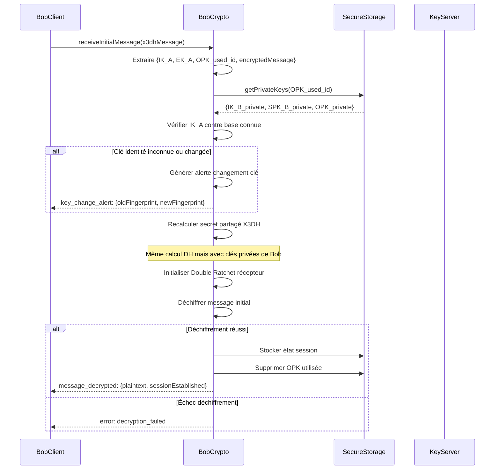
```mermaid
sequenceDiagram
    participant BobClient
    participant BobCrypto
    participant SecureStorage
    participant KeyServer
    
    BobClient->>BobCrypto: receiveInitialMessage(x3dhMessage)
    BobCrypto->>BobCrypto: Extraire {IK_A, EK_A, OPK_used_id, encryptedMessage}
    
    BobCrypto->>SecureStorage: getPrivateKeys(OPK_used_id)
    SecureStorage-->>BobCrypto: {IK_B_private, SPK_B_private, OPK_private}
    
    BobCrypto->>BobCrypto: Vérifier IK_A contre base connue
    
    alt Clé identité inconnue ou changée
        BobCrypto->>BobCrypto: Générer alerte changement clé
        BobCrypto-->>BobClient: key_change_alert: {oldFingerprint, newFingerprint}
    end
    
    BobCrypto->>BobCrypto: Recalculer secret partagé X3DH
    Note over BobCrypto: Même calcul DH mais avec clés privées de Bob
    
    BobCrypto->>BobCrypto: Initialiser Double Ratchet récepteur
    BobCrypto->>BobCrypto: Déchiffrer message initial
    
    alt Déchiffrement réussi
        BobCrypto->>SecureStorage: Stocker état session
        BobCrypto->>SecureStorage: Supprimer OPK utilisée
        BobCrypto-->>BobClient: message_decrypted: {plaintext, sessionEstablished}
    else Échec déchiffrement
        BobCrypto-->>BobClient: error: decryption_failed
    end
```

## 4. Protocole Double Ratchet

### 4.1 Structure du Double Ratchet

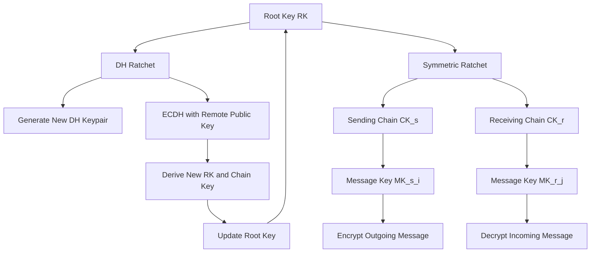
```mermaid
graph TD
    A[Root Key RK] --> B[DH Ratchet]
    A --> C[Symmetric Ratchet]
    
    B --> D[Generate New DH Keypair]
    B --> E[ECDH with Remote Public Key]
    E --> F[Derive New RK and Chain Key]
    
    C --> G[Sending Chain CK_s]
    C --> H[Receiving Chain CK_r]
    
    G --> I[Message Key MK_s_i]
    H --> J[Message Key MK_r_j]
    
    I --> K[Encrypt Outgoing Message]
    J --> L[Decrypt Incoming Message]
    
    F --> M[Update Root Key]
    M --> A
```

### 4.2 Envoi de message avec Double Ratchet

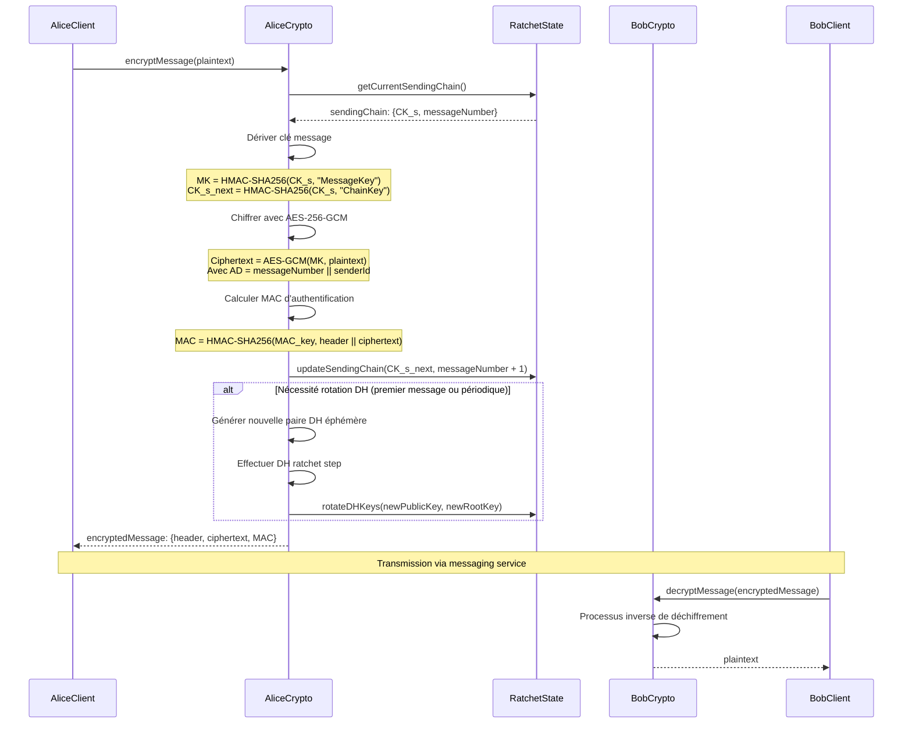
```mermaid
sequenceDiagram
    participant AliceClient
    participant AliceCrypto
    participant RatchetState
    participant BobCrypto
    participant BobClient
    
    AliceClient->>AliceCrypto: encryptMessage(plaintext)
    
    AliceCrypto->>RatchetState: getCurrentSendingChain()
    RatchetState-->>AliceCrypto: sendingChain: {CK_s, messageNumber}
    
    AliceCrypto->>AliceCrypto: Dériver clé message
    Note over AliceCrypto: MK = HMAC-SHA256(CK_s, "MessageKey")<br/>CK_s_next = HMAC-SHA256(CK_s, "ChainKey")
    
    AliceCrypto->>AliceCrypto: Chiffrer avec AES-256-GCM
    Note over AliceCrypto: Ciphertext = AES-GCM(MK, plaintext)<br/>Avec AD = messageNumber || senderId
    
    AliceCrypto->>AliceCrypto: Calculer MAC d'authentification
    Note over AliceCrypto: MAC = HMAC-SHA256(MAC_key, header || ciphertext)
    
    AliceCrypto->>RatchetState: updateSendingChain(CK_s_next, messageNumber + 1)
    
    alt Nécessité rotation DH (premier message ou périodique)
        AliceCrypto->>AliceCrypto: Générer nouvelle paire DH éphémère
        AliceCrypto->>AliceCrypto: Effectuer DH ratchet step
        AliceCrypto->>RatchetState: rotateDHKeys(newPublicKey, newRootKey)
    end
    
    AliceCrypto-->>AliceClient: encryptedMessage: {header, ciphertext, MAC}
    
    Note over AliceClient,BobClient: Transmission via messaging service
    
    BobClient->>BobCrypto: decryptMessage(encryptedMessage)
    BobCrypto->>BobCrypto: Processus inverse de déchiffrement
    BobCrypto-->>BobClient: plaintext
```

### 4.3 Gestion des messages hors ordre

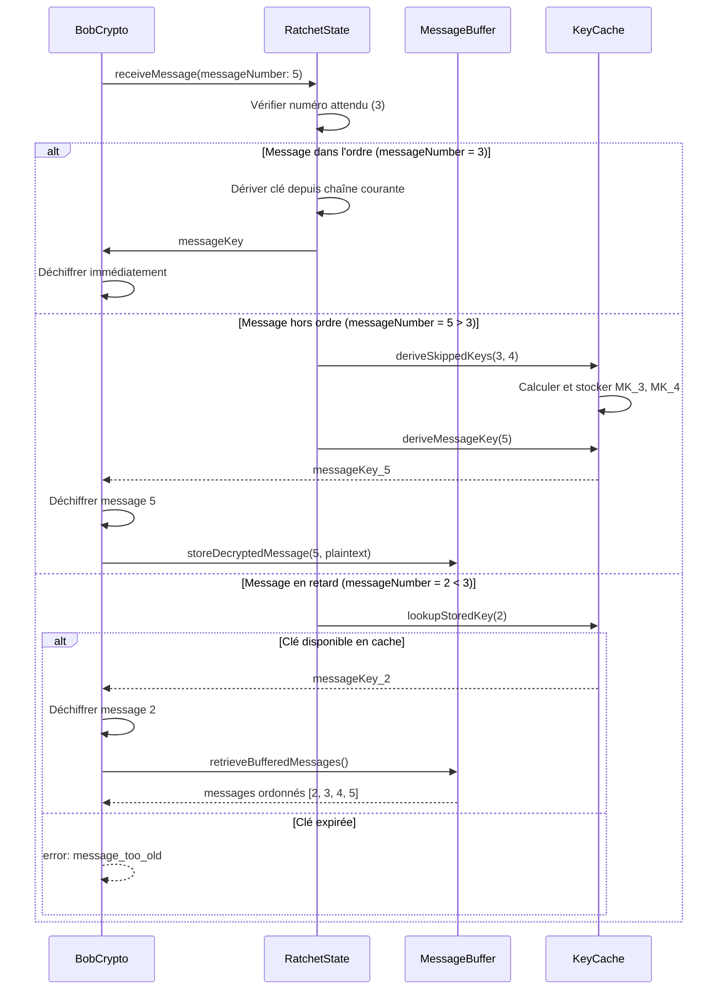
```mermaid
sequenceDiagram
    participant BobCrypto
    participant RatchetState
    participant MessageBuffer
    participant KeyCache
    
    BobCrypto->>RatchetState: receiveMessage(messageNumber: 5)
    RatchetState->>RatchetState: Vérifier numéro attendu (3)
    
    alt Message dans l'ordre (messageNumber = 3)
        RatchetState->>RatchetState: Dériver clé depuis chaîne courante
        RatchetState->>BobCrypto: messageKey
        BobCrypto->>BobCrypto: Déchiffrer immédiatement
        
    else Message hors ordre (messageNumber = 5 > 3)
        RatchetState->>KeyCache: deriveSkippedKeys(3, 4)
        KeyCache->>KeyCache: Calculer et stocker MK_3, MK_4
        
        RatchetState->>KeyCache: deriveMessageKey(5)
        KeyCache-->>BobCrypto: messageKey_5
        
        BobCrypto->>BobCrypto: Déchiffrer message 5
        BobCrypto->>MessageBuffer: storeDecryptedMessage(5, plaintext)
        
    else Message en retard (messageNumber = 2 < 3)
        RatchetState->>KeyCache: lookupStoredKey(2)
        
        alt Clé disponible en cache
            KeyCache-->>BobCrypto: messageKey_2
            BobCrypto->>BobCrypto: Déchiffrer message 2
            BobCrypto->>MessageBuffer: retrieveBufferedMessages()
            MessageBuffer-->>BobCrypto: messages ordonnés [2, 3, 4, 5]
        else Clé expirée
            BobCrypto-->>BobCrypto: error: message_too_old
        end
    end
```

## 5. Chiffrement et déchiffrement des messages

### 5.1 Format du message chiffré

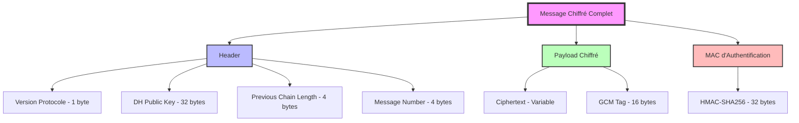
```mermaid
graph TD
    A[Message Chiffré Complet] --> B[Header]
    A --> C[Payload Chiffré]
    A --> D[MAC d'Authentification]
    
    B --> E[Version Protocole - 1 byte]
    B --> F[DH Public Key - 32 bytes]
    B --> G[Previous Chain Length - 4 bytes]
    B --> H[Message Number - 4 bytes]
    
    C --> I[Ciphertext - Variable]
    C --> J[GCM Tag - 16 bytes]
    
    D --> K[HMAC-SHA256 - 32 bytes]
    
    style A fill:#f9f,stroke:#333,stroke-width:4px
    style B fill:#bbf,stroke:#333,stroke-width:2px
    style C fill:#bfb,stroke:#333,stroke-width:2px
    style D fill:#fbb,stroke:#333,stroke-width:2px
```

### 5.2 Processus de chiffrement détaillé

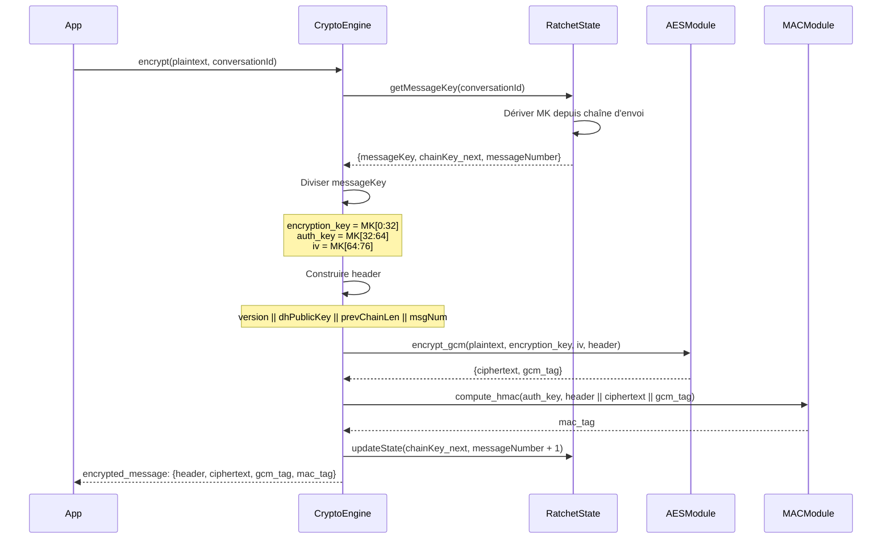
```mermaid
sequenceDiagram
    participant App
    participant CryptoEngine
    participant RatchetState
    participant AESModule
    participant MACModule
    
    App->>CryptoEngine: encrypt(plaintext, conversationId)
    
    CryptoEngine->>RatchetState: getMessageKey(conversationId)
    RatchetState->>RatchetState: Dériver MK depuis chaîne d'envoi
    RatchetState-->>CryptoEngine: {messageKey, chainKey_next, messageNumber}
    
    CryptoEngine->>CryptoEngine: Diviser messageKey
    Note over CryptoEngine: encryption_key = MK[0:32]<br/>auth_key = MK[32:64]<br/>iv = MK[64:76]
    
    CryptoEngine->>CryptoEngine: Construire header
    Note over CryptoEngine: version || dhPublicKey || prevChainLen || msgNum
    
    CryptoEngine->>AESModule: encrypt_gcm(plaintext, encryption_key, iv, header)
    AESModule-->>CryptoEngine: {ciphertext, gcm_tag}
    
    CryptoEngine->>MACModule: compute_hmac(auth_key, header || ciphertext || gcm_tag)
    MACModule-->>CryptoEngine: mac_tag
    
    CryptoEngine->>RatchetState: updateState(chainKey_next, messageNumber + 1)
    
    CryptoEngine-->>App: encrypted_message: {header, ciphertext, gcm_tag, mac_tag}
```

### 5.3 Processus de déchiffrement avec validation

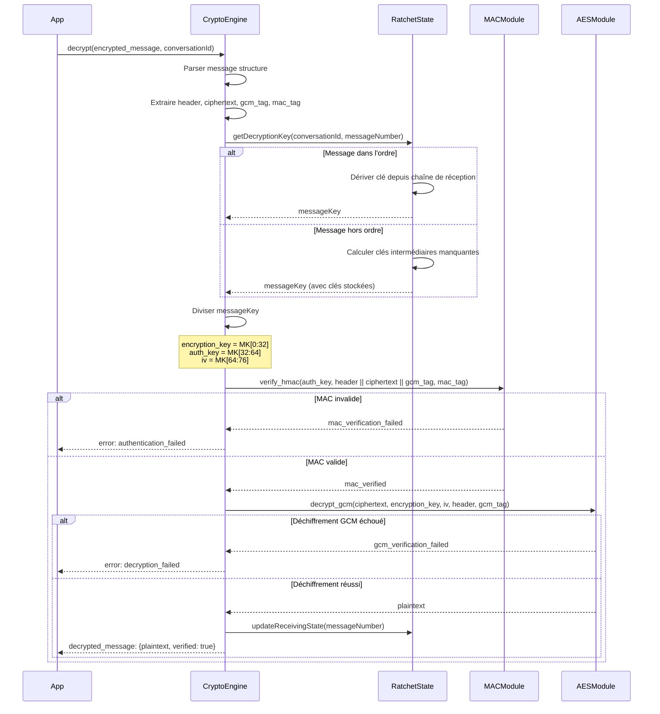
```mermaid
sequenceDiagram
    participant App
    participant CryptoEngine
    participant RatchetState
    participant MACModule
    participant AESModule
    
    App->>CryptoEngine: decrypt(encrypted_message, conversationId)
    
    CryptoEngine->>CryptoEngine: Parser message structure
    CryptoEngine->>CryptoEngine: Extraire header, ciphertext, gcm_tag, mac_tag
    
    CryptoEngine->>RatchetState: getDecryptionKey(conversationId, messageNumber)
    
    alt Message dans l'ordre
        RatchetState->>RatchetState: Dériver clé depuis chaîne de réception
        RatchetState-->>CryptoEngine: messageKey
    else Message hors ordre
        RatchetState->>RatchetState: Calculer clés intermédiaires manquantes
        RatchetState-->>CryptoEngine: messageKey (avec clés stockées)
    end
    
    CryptoEngine->>CryptoEngine: Diviser messageKey
    Note over CryptoEngine: encryption_key = MK[0:32]<br/>auth_key = MK[32:64]<br/>iv = MK[64:76]
    
    CryptoEngine->>MACModule: verify_hmac(auth_key, header || ciphertext || gcm_tag, mac_tag)
    
    alt MAC invalide
        MACModule-->>CryptoEngine: mac_verification_failed
        CryptoEngine-->>App: error: authentication_failed
    else MAC valide
        MACModule-->>CryptoEngine: mac_verified
        
        CryptoEngine->>AESModule: decrypt_gcm(ciphertext, encryption_key, iv, header, gcm_tag)
        
        alt Déchiffrement GCM échoué
            AESModule-->>CryptoEngine: gcm_verification_failed
            CryptoEngine-->>App: error: decryption_failed
        else Déchiffrement réussi
            AESModule-->>CryptoEngine: plaintext
            CryptoEngine->>RatchetState: updateReceivingState(messageNumber)
            CryptoEngine-->>App: decrypted_message: {plaintext, verified: true}
        end
    end
```

## 6. Gestion multi-appareils

### 6.1 Enregistrement d'un nouvel appareil

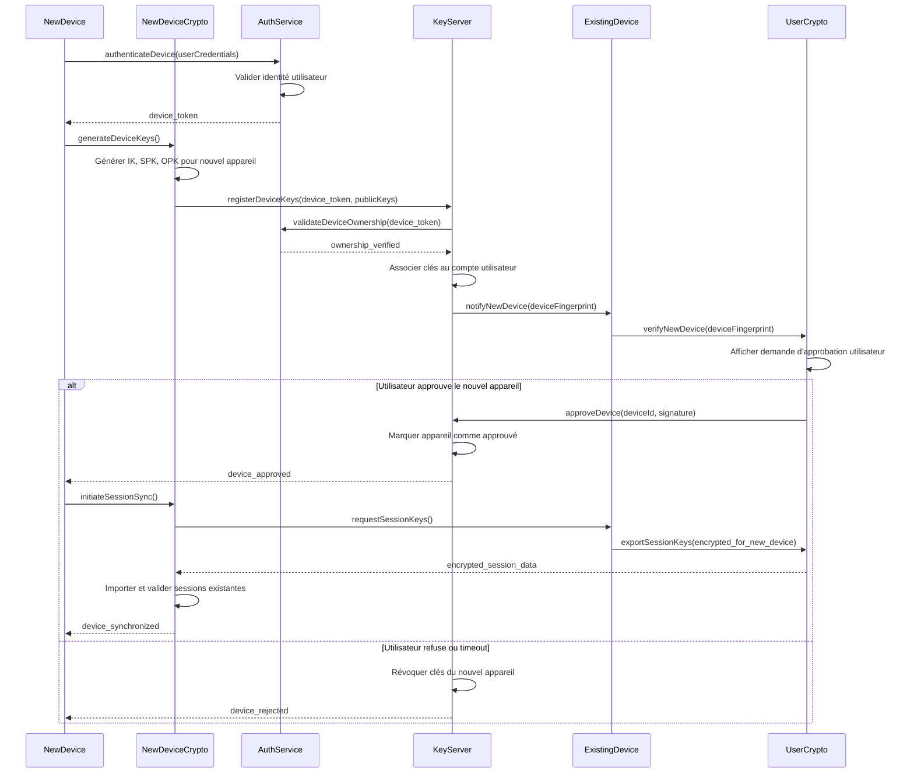
```mermaid
sequenceDiagram
    participant NewDevice
    participant NewDeviceCrypto
    participant AuthService
    participant KeyServer
    participant ExistingDevice
    participant UserCrypto
    
    NewDevice->>AuthService: authenticateDevice(userCredentials)
    AuthService->>AuthService: Valider identité utilisateur
    AuthService-->>NewDevice: device_token
    
    NewDevice->>NewDeviceCrypto: generateDeviceKeys()
    NewDeviceCrypto->>NewDeviceCrypto: Générer IK, SPK, OPK pour nouvel appareil
    
    NewDeviceCrypto->>KeyServer: registerDeviceKeys(device_token, publicKeys)
    KeyServer->>AuthService: validateDeviceOwnership(device_token)
    AuthService-->>KeyServer: ownership_verified
    
    KeyServer->>KeyServer: Associer clés au compte utilisateur
    KeyServer->>ExistingDevice: notifyNewDevice(deviceFingerprint)
    
    ExistingDevice->>UserCrypto: verifyNewDevice(deviceFingerprint)
    UserCrypto->>UserCrypto: Afficher demande d'approbation utilisateur
    
    alt Utilisateur approuve le nouvel appareil
        UserCrypto->>KeyServer: approveDevice(deviceId, signature)
        KeyServer->>KeyServer: Marquer appareil comme approuvé
        KeyServer-->>NewDevice: device_approved
        
        NewDevice->>NewDeviceCrypto: initiateSessionSync()
        NewDeviceCrypto->>ExistingDevice: requestSessionKeys()
        ExistingDevice->>UserCrypto: exportSessionKeys(encrypted_for_new_device)
        UserCrypto-->>NewDeviceCrypto: encrypted_session_data
        
        NewDeviceCrypto->>NewDeviceCrypto: Importer et valider sessions existantes
        NewDeviceCrypto-->>NewDevice: device_synchronized
        
    else Utilisateur refuse ou timeout
        KeyServer->>KeyServer: Révoquer clés du nouvel appareil
        KeyServer-->>NewDevice: device_rejected
    end
```

### 6.2 Synchronisation des sessions entre appareils

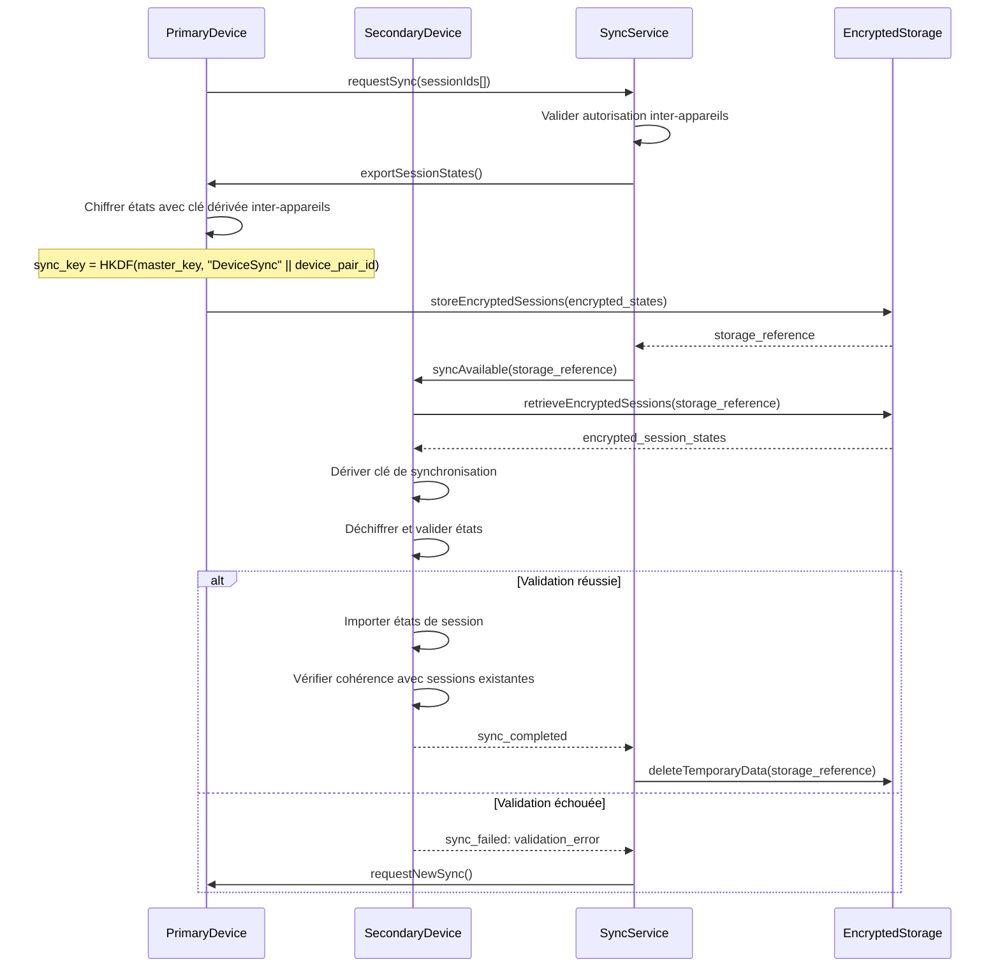
```mermaid
sequenceDiagram
    participant PrimaryDevice
    participant SecondaryDevice
    participant SyncService
    participant EncryptedStorage
    
    PrimaryDevice->>SyncService: requestSync(sessionIds[])
    SyncService->>SyncService: Valider autorisation inter-appareils
    
    SyncService->>PrimaryDevice: exportSessionStates()
    PrimaryDevice->>PrimaryDevice: Chiffrer états avec clé dérivée inter-appareils
    Note over PrimaryDevice: sync_key = HKDF(master_key, "DeviceSync" || device_pair_id)
    
    PrimaryDevice->>EncryptedStorage: storeEncryptedSessions(encrypted_states)
    EncryptedStorage-->>SyncService: storage_reference
    
    SyncService->>SecondaryDevice: syncAvailable(storage_reference)
    SecondaryDevice->>EncryptedStorage: retrieveEncryptedSessions(storage_reference)
    EncryptedStorage-->>SecondaryDevice: encrypted_session_states
    
    SecondaryDevice->>SecondaryDevice: Dériver clé de synchronisation
    SecondaryDevice->>SecondaryDevice: Déchiffrer et valider états
    
    alt Validation réussie
        SecondaryDevice->>SecondaryDevice: Importer états de session
        SecondaryDevice->>SecondaryDevice: Vérifier cohérence avec sessions existantes
        SecondaryDevice-->>SyncService: sync_completed
        
        SyncService->>EncryptedStorage: deleteTemporaryData(storage_reference)
    else Validation échouée
        SecondaryDevice-->>SyncService: sync_failed: validation_error
        SyncService->>PrimaryDevice: requestNewSync()
    end
```

### 6.3 Distribution de messages multi-appareils

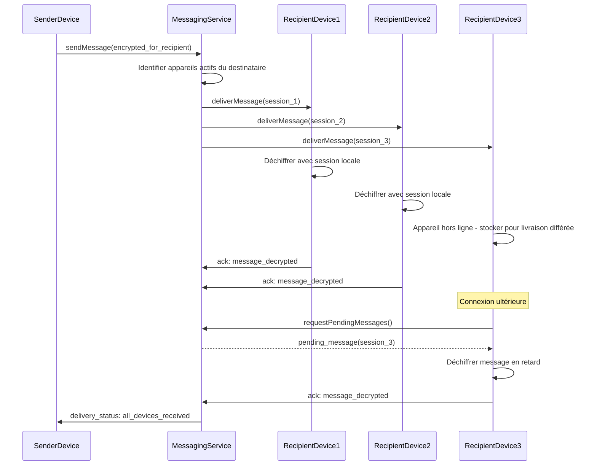
```mermaid
sequenceDiagram
    participant SenderDevice
    participant MessagingService
    participant RecipientDevice1
    participant RecipientDevice2
    participant RecipientDevice3
    
    SenderDevice->>MessagingService: sendMessage(encrypted_for_recipient)
    MessagingService->>MessagingService: Identifier appareils actifs du destinataire
    
    MessagingService->>RecipientDevice1: deliverMessage(session_1)
    MessagingService->>RecipientDevice2: deliverMessage(session_2)
    MessagingService->>RecipientDevice3: deliverMessage(session_3)
    
    RecipientDevice1->>RecipientDevice1: Déchiffrer avec session locale
    RecipientDevice2->>RecipientDevice2: Déchiffrer avec session locale
    RecipientDevice3->>RecipientDevice3: Appareil hors ligne - stocker pour livraison différée
    
    RecipientDevice1->>MessagingService: ack: message_decrypted
    RecipientDevice2->>MessagingService: ack: message_decrypted
    
    Note over RecipientDevice3: Connexion ultérieure
    RecipientDevice3->>MessagingService: requestPendingMessages()
    MessagingService-->>RecipientDevice3: pending_message(session_3)
    RecipientDevice3->>RecipientDevice3: Déchiffrer message en retard
    RecipientDevice3->>MessagingService: ack: message_decrypted
    
    MessagingService->>SenderDevice: delivery_status: all_devices_received
```

## 7. Codes de sécurité et vérification d'identité

### 7.1 Génération des codes de sécurité

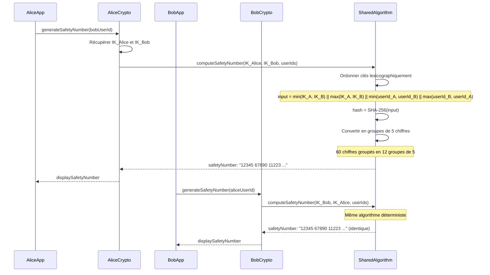
```mermaid
sequenceDiagram
    participant AliceApp
    participant AliceCrypto
    participant BobApp
    participant BobCrypto
    participant SharedAlgorithm
    
    AliceApp->>AliceCrypto: generateSafetyNumber(bobUserId)
    AliceCrypto->>AliceCrypto: Récupérer IK_Alice et IK_Bob
    
    AliceCrypto->>SharedAlgorithm: computeSafetyNumber(IK_Alice, IK_Bob, userIds)
    SharedAlgorithm->>SharedAlgorithm: Ordonner clés lexicographiquement
    Note over SharedAlgorithm: input = min(IK_A, IK_B) || max(IK_A, IK_B) || min(userId_A, userId_B) || max(userId_B, userId_A)
    
    SharedAlgorithm->>SharedAlgorithm: hash = SHA-256(input)
    SharedAlgorithm->>SharedAlgorithm: Convertir en groupes de 5 chiffres
    Note over SharedAlgorithm: 60 chiffres groupés en 12 groupes de 5
    
    SharedAlgorithm-->>AliceCrypto: safetyNumber: "12345 67890 11223 ..."
    AliceCrypto-->>AliceApp: displaySafetyNumber
    
    BobApp->>BobCrypto: generateSafetyNumber(aliceUserId)
    BobCrypto->>SharedAlgorithm: computeSafetyNumber(IK_Bob, IK_Alice, userIds)
    Note over SharedAlgorithm: Même algorithme déterministe
    SharedAlgorithm-->>BobCrypto: safetyNumber: "12345 67890 11223 ..." (identique)
    BobCrypto-->>BobApp: displaySafetyNumber
```

### 7.2 Vérification manuelle des codes de sécurité

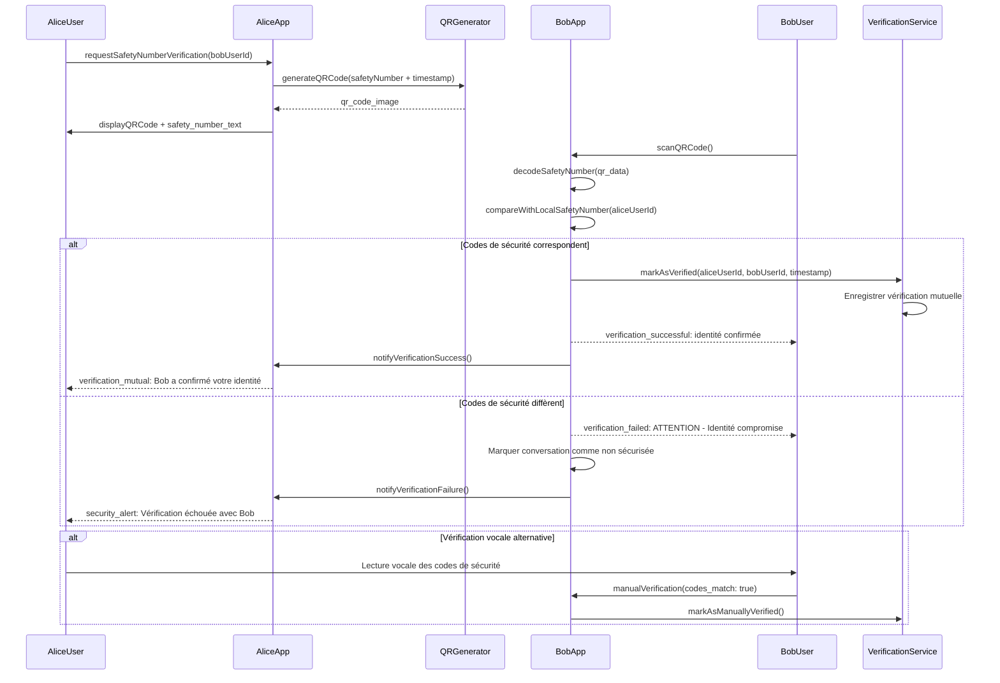
```mermaid
sequenceDiagram
    participant AliceUser
    participant AliceApp
    participant QRGenerator
    participant BobApp
    participant BobUser
    participant VerificationService
    
    AliceUser->>AliceApp: requestSafetyNumberVerification(bobUserId)
    AliceApp->>QRGenerator: generateQRCode(safetyNumber + timestamp)
    QRGenerator-->>AliceApp: qr_code_image
    
    AliceApp->>AliceUser: displayQRCode + safety_number_text
    
    BobUser->>BobApp: scanQRCode()
    BobApp->>BobApp: decodeSafetyNumber(qr_data)
    BobApp->>BobApp: compareWithLocalSafetyNumber(aliceUserId)
    
    alt Codes de sécurité correspondent
        BobApp->>VerificationService: markAsVerified(aliceUserId, bobUserId, timestamp)
        VerificationService->>VerificationService: Enregistrer vérification mutuelle
        
        BobApp-->>BobUser: verification_successful: identité confirmée
        BobApp->>AliceApp: notifyVerificationSuccess()
        AliceApp-->>AliceUser: verification_mutual: Bob a confirmé votre identité
        
    else Codes de sécurité diffèrent
        BobApp-->>BobUser: verification_failed: ATTENTION - Identité compromise
        BobApp->>BobApp: Marquer conversation comme non sécurisée
        BobApp->>AliceApp: notifyVerificationFailure()
        AliceApp-->>AliceUser: security_alert: Vérification échouée avec Bob
    end
    
    alt Vérification vocale alternative
        AliceUser->>BobUser: Lecture vocale des codes de sécurité
        BobUser->>BobApp: manualVerification(codes_match: true)
        BobApp->>VerificationService: markAsManuallyVerified()
    end
```

### 7.3 Détection des changements de clés

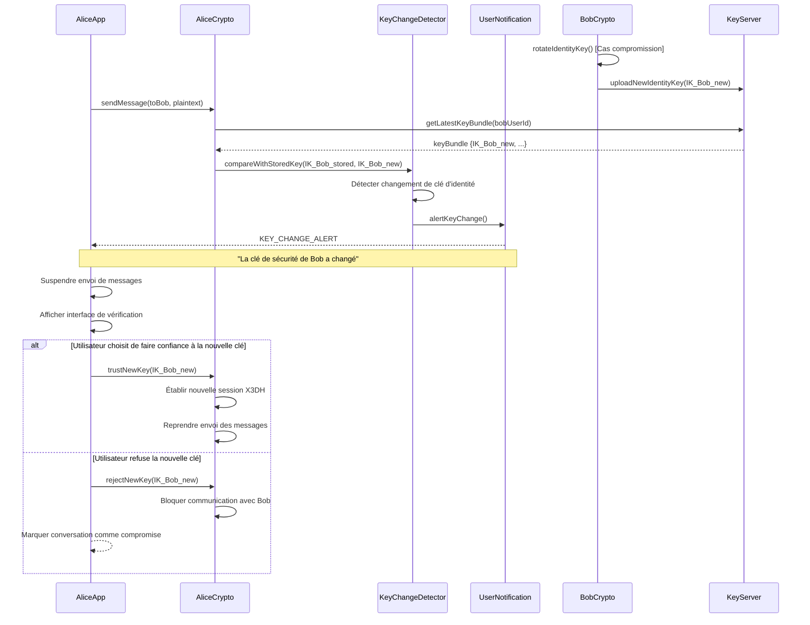
```mermaid
sequenceDiagram
    participant AliceApp
    participant AliceCrypto
    participant KeyChangeDetector
    participant UserNotification
    participant BobCrypto
    
    BobCrypto->>BobCrypto: rotateIdentityKey() [Cas compromission]
    BobCrypto->>KeyServer: uploadNewIdentityKey(IK_Bob_new)
    
    AliceApp->>AliceCrypto: sendMessage(toBob, plaintext)
    AliceCrypto->>KeyServer: getLatestKeyBundle(bobUserId)
    KeyServer-->>AliceCrypto: keyBundle {IK_Bob_new, ...}
    
    AliceCrypto->>KeyChangeDetector: compareWithStoredKey(IK_Bob_stored, IK_Bob_new)
    KeyChangeDetector->>KeyChangeDetector: Détecter changement de clé d'identité
    
    KeyChangeDetector->>UserNotification: alertKeyChange()
    UserNotification-->>AliceApp: KEY_CHANGE_ALERT
    Note over UserNotification,AliceApp: "La clé de sécurité de Bob a changé"
    
    AliceApp->>AliceApp: Suspendre envoi de messages
    AliceApp->>AliceApp: Afficher interface de vérification
    
    alt Utilisateur choisit de faire confiance à la nouvelle clé
        AliceApp->>AliceCrypto: trustNewKey(IK_Bob_new)
        AliceCrypto->>AliceCrypto: Établir nouvelle session X3DH
        AliceCrypto->>AliceCrypto: Reprendre envoi des messages
        
    else Utilisateur refuse la nouvelle clé
        AliceApp->>AliceCrypto: rejectNewKey(IK_Bob_new)
        AliceCrypto->>AliceCrypto: Bloquer communication avec Bob
        AliceApp-->>AliceApp: Marquer conversation comme compromise
    end
```

## 8. Gestion des erreurs cryptographiques

### 8.1 Hiérarchie des erreurs et récupération

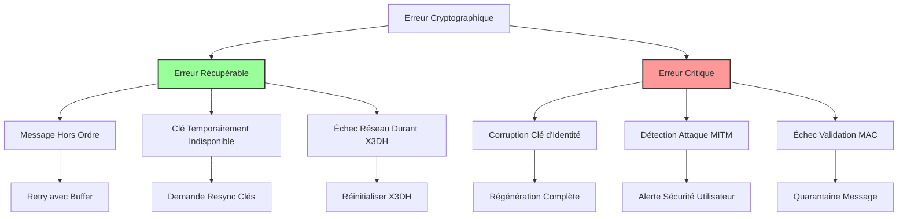
```mermaid
graph TD
    A[Erreur Cryptographique] --> B[Erreur Récupérable]
    A --> C[Erreur Critique]
    
    B --> D[Message Hors Ordre]
    B --> E[Clé Temporairement Indisponible]
    B --> F[Échec Réseau Durant X3DH]
    
    C --> G[Corruption Clé d'Identité]
    C --> H[Détection Attaque MITM]
    C --> I[Échec Validation MAC]
    
    D --> J[Retry avec Buffer]
    E --> K[Demande Resync Clés]
    F --> L[Réinitialiser X3DH]
    
    G --> M[Régénération Complète]
    H --> N[Alerte Sécurité Utilisateur]
    I --> O[Quarantaine Message]
    
    style C fill:#f99,stroke:#333,stroke-width:2px
    style B fill:#9f9,stroke:#333,stroke-width:2px
```

### 8.2 Récupération automatique des erreurs

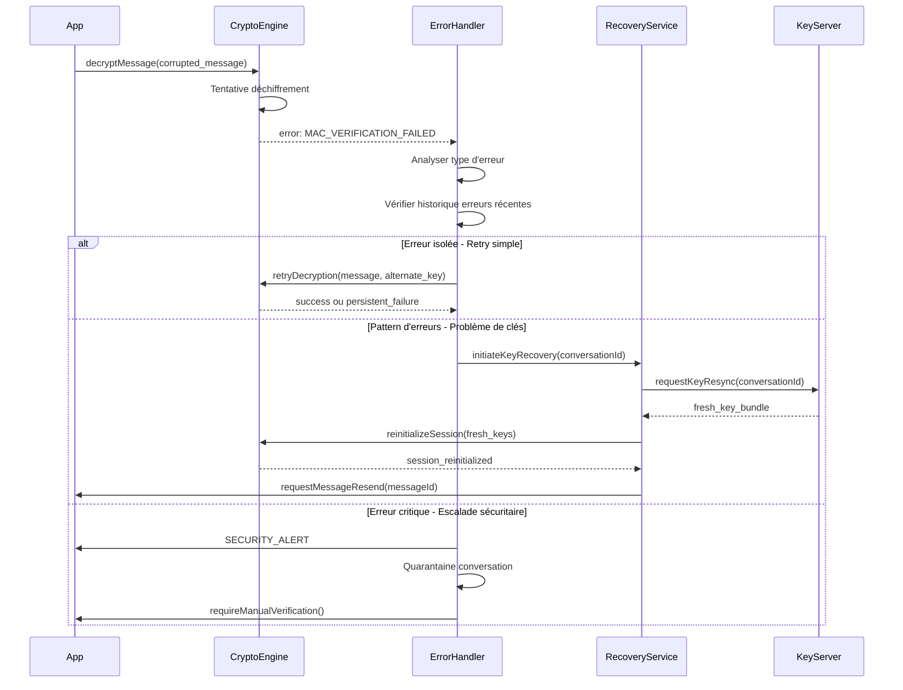
```mermaid
sequenceDiagram
    participant App
    participant CryptoEngine
    participant ErrorHandler
    participant RecoveryService
    participant KeyServer
    
    App->>CryptoEngine: decryptMessage(corrupted_message)
    CryptoEngine->>CryptoEngine: Tentative déchiffrement
    CryptoEngine-->>ErrorHandler: error: MAC_VERIFICATION_FAILED
    
    ErrorHandler->>ErrorHandler: Analyser type d'erreur
    ErrorHandler->>ErrorHandler: Vérifier historique erreurs récentes
    
    alt Erreur isolée - Retry simple
        ErrorHandler->>CryptoEngine: retryDecryption(message, alternate_key)
        CryptoEngine-->>ErrorHandler: success ou persistent_failure
        
    else Pattern d'erreurs - Problème de clés
        ErrorHandler->>RecoveryService: initiateKeyRecovery(conversationId)
        RecoveryService->>KeyServer: requestKeyResync(conversationId)
        
        KeyServer-->>RecoveryService: fresh_key_bundle
        RecoveryService->>CryptoEngine: reinitializeSession(fresh_keys)
        CryptoEngine-->>RecoveryService: session_reinitialized
        
        RecoveryService->>App: requestMessageResend(messageId)
        
    else Erreur critique - Escalade sécuritaire
        ErrorHandler->>App: SECURITY_ALERT
        ErrorHandler->>ErrorHandler: Quarantaine conversation
        ErrorHandler->>App: requireManualVerification()
    end
```

### 8.3 Diagnostic et logging sécurisé

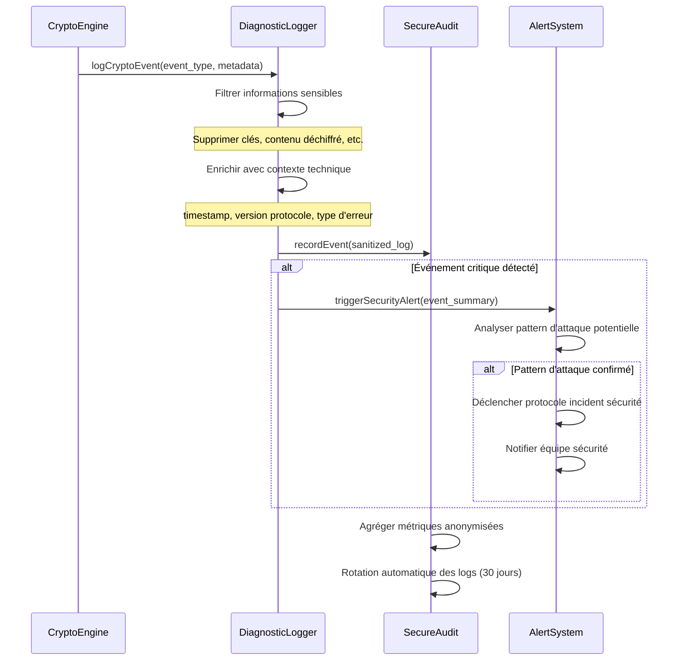
```mermaid
sequenceDiagram
    participant CryptoEngine
    participant DiagnosticLogger
    participant SecureAudit
    participant AlertSystem
    
    CryptoEngine->>DiagnosticLogger: logCryptoEvent(event_type, metadata)
    DiagnosticLogger->>DiagnosticLogger: Filtrer informations sensibles
    Note over DiagnosticLogger: Supprimer clés, contenu déchiffré, etc.
    
    DiagnosticLogger->>DiagnosticLogger: Enrichir avec contexte technique
    Note over DiagnosticLogger: timestamp, version protocole, type d'erreur
    
    DiagnosticLogger->>SecureAudit: recordEvent(sanitized_log)
    
    alt Événement critique détecté
        DiagnosticLogger->>AlertSystem: triggerSecurityAlert(event_summary)
        AlertSystem->>AlertSystem: Analyser pattern d'attaque potentielle
        
        alt Pattern d'attaque confirmé
            AlertSystem->>AlertSystem: Déclencher protocole incident sécurité
            AlertSystem->>AlertSystem: Notifier équipe sécurité
        end
    end
    
    SecureAudit->>SecureAudit: Agréger métriques anonymisées
    SecureAudit->>SecureAudit: Rotation automatique des logs (30 jours)
```

## 9. Intégration avec les services

### 9.1 Interface avec le Messaging Service

```mermaid
sequenceDiagram
    participant MessagingService
    participant CryptoService
    participant ValidationEngine
    participant ConversationManager
    
    MessagingService->>CryptoService: validateEncryptedMessage(message_data)
    CryptoService->>ValidationEngine: checkCryptographicIntegrity(message)
    
    ValidationEngine->>ValidationEngine: Vérifier format header
    ValidationEngine->>ValidationEngine: Valider taille et structure
    ValidationEngine->>ValidationEngine: Vérifier signature sans déchiffrer
    
    alt Validation réussie
        ValidationEngine-->>CryptoService: integrity_verified
        CryptoService->>ConversationManager: getConversationContext(conversation_id)
        ConversationManager-->>CryptoService: participant_list + security_level
        
        CryptoService-->>MessagingService: message_valid + routing_info
        
    else Validation échouée
        ValidationEngine-->>CryptoService: integrity_compromised
        CryptoService->>CryptoService: Logger tentative d'intrusion
        CryptoService-->>MessagingService: message_rejected: crypto_error
    end
```

### 9.2 Interface avec le User Service

```mermaid
sequenceDiagram
    participant CryptoService
    participant UserService
    participant DeviceRegistry
    participant TrustManager
    
    CryptoService->>UserService: requestUserDevices(userId)
    UserService->>DeviceRegistry: getActiveDevices(userId)
    DeviceRegistry-->>UserService: device_list + public_keys
    
    UserService->>TrustManager: validateDeviceTrust(device_list)
    TrustManager->>TrustManager: Vérifier signatures croisées
    TrustManager->>TrustManager: Contrôler révocations récentes
    
    alt Tous appareils de confiance
        TrustManager-->>UserService: all_devices_trusted
        UserService-->>CryptoService: verified_device_list
        
    else Appareil suspect détecté
        TrustManager-->>UserService: suspicious_device_detected
        UserService->>UserService: Marquer pour vérification manuelle
        UserService-->>CryptoService: device_list + trust_warnings
    end
```

## 10. Considérations de sécurité et performance

### 10.1 Optimisations de performance

#### Gestion de la mémoire cryptographique
- **Secure memory allocation**: Utilisation de mémoire non-swappable pour les clés
- **Key zeroization**: Effacement sécurisé des clés après usage
- **Constant-time operations**: Prévention des attaques par timing
- **Pre-computed keys**: Cache sécurisé des clés dérivées fréquemment utilisées

#### Optimisations de calcul
- **Batch operations**: Traitement groupé des opérations cryptographiques
- **Hardware acceleration**: Utilisation des instructions AES-NI quand disponibles
- **Curve25519 optimizations**: Implémentation optimisée pour l'échange de clés
- **Parallel processing**: Chiffrement/déchiffrement parallèle pour les groupes

### 10.2 Vulnérabilités et mitigations

| Vulnérabilité | Risque | Mitigation |
|---------------|--------|------------|
| Compromise de clé d'identité | Critique | Détection automatique + alerte utilisateur |
| Attaque man-in-the-middle | Élevé | Codes de sécurité + validation croisée |
| Messages hors ordre | Moyen | Buffer et cache de clés avec limite temporelle |
| Déni de service cryptographique | Moyen | Rate limiting et validation précoce |
| Fuite de métadonnées | Faible | Padding et obfuscation des tailles |

### 10.3 Conformité et audit

#### Standards cryptographiques
- **FIPS 140-2 Level 2**: Conformité pour le stockage des clés
- **RFC 7748**: Implémentation standard de Curve25519
- **RFC 5869**: HKDF pour la dérivation de clés
- **NIST SP 800-38D**: AES-GCM pour le chiffrement authentifié

#### Procédures d'audit
- **Code review cryptographique**: Validation par expert externe
- **Penetration testing**: Tests d'intrusion spécialisés
- **Formal verification**: Vérification formelle des protocoles critiques
- **Side-channel analysis**: Tests contre les attaques par canaux auxiliaires

## 11. Tests et validation

### 11.1 Tests unitaires cryptographiques

```elixir
defmodule WhisprCrypto.X3DHTest do
  use ExUnit.Case
  
  test "X3DH key agreement produces same shared secret" do
    # Générer clés pour Alice et Bob
    alice_identity = generate_identity_keypair()
    bob_identity = generate_identity_keypair()
    bob_prekey = generate_prekey_keypair()
    bob_onetime = generate_onetime_prekey()
    
    # Alice initie X3DH
    {alice_ephemeral, shared_secret_alice} = 
      X3DH.initiate(alice_identity, bob_identity.public, 
                    bob_prekey.public, bob_onetime.public)
    
    # Bob répond à X3DH
    shared_secret_bob = 
      X3DH.respond(bob_identity, bob_prekey, bob_onetime, 
                   alice_identity.public, alice_ephemeral.public)
    
    assert shared_secret_alice == shared_secret_bob
  end
end
```

### 11.2 Tests d'intégration cryptographique

```elixir
defmodule WhisprCrypto.EndToEndTest do
  use ExUnit.Case
  
  test "complete message encryption/decryption cycle" do
    # Établir session entre Alice et Bob
    {:ok, alice_session} = CryptoEngine.establish_session(:alice, :bob)
    {:ok, bob_session} = CryptoEngine.establish_session(:bob, :alice)
    
    # Alice envoie message
    plaintext = "Hello Bob, this is a secret message"
    {:ok, encrypted} = CryptoEngine.encrypt(alice_session, plaintext)
    
    # Bob reçoit et déchiffre
    {:ok, decrypted} = CryptoEngine.decrypt(bob_session, encrypted)
    
    assert decrypted == plaintext
    
    # Vérifier forward secrecy
    # Compromettre clé actuelle ne doit pas affecter messages précédents
    CryptoEngine.compromise_current_keys(alice_session)
    {:ok, still_decrypted} = CryptoEngine.decrypt(bob_session, encrypted)
    assert still_decrypted == plaintext
  end
end
```

### 11.3 Tests de performance cryptographique

```elixir
defmodule WhisprCrypto.BenchmarkTest do
  use ExUnit.Case
  
  test "encryption performance benchmarks" do
    session = setup_test_session()
    message = String.duplicate("test", 1000) # 4KB message
    
    {time_microseconds, _result} = 
      :timer.tc(fn -> CryptoEngine.encrypt(session, message) end)
    
    # Vérifier que le chiffrement prend moins de 1ms pour 4KB
    assert time_microseconds < 1000
  end
  
  test "session establishment performance" do
    {time_microseconds, _result} = 
      :timer.tc(fn -> CryptoEngine.establish_session(:alice, :bob) end)
    
    # X3DH doit s'exécuter en moins de 10ms
    assert time_microseconds < 10000
  end
end
```

## 12. Livrables

1. **Module de chiffrement Elixir** comprenant :
   - Implémentation complète du protocole Signal
   - Gestion des clés et rotation automatique
   - Support multi-appareils avec synchronisation
   - Tests cryptographiques exhaustifs

2. **Bibliothèque cliente JavaScript** pour :
   - Opérations cryptographiques côté client
   - Génération et vérification des codes de sécurité
   - Interface utilisateur pour la gestion des clés
   - WebAssembly optimisé pour les opérations critiques

3. **Infrastructure de gestion des clés** :
   - Serveur de distribution des PreKeys
   - Mécanismes de rotation et révocation
   - Audit trail des opérations cryptographiques
   - Monitoring de la santé cryptographique

4. **Documentation de sécurité** :
   - Analyse de sécurité formelle du protocole
   - Procédures d'incident cryptographique
   - Guide de vérification manuelle des codes de sécurité
   - Recommandations de déploiement sécurisé