# Spécification Fonctionnelle - Gestion des Médias

## 1. Vue d'ensemble

### 1.1 Objectif

Cette spécification détaille la gestion des contenus multimédias dans l'application Whispr. Elle couvre l'envoi, la réception, le traitement et la modération des médias partagés entre utilisateurs. Ces fonctionnalités enrichissent l'expérience de messagerie en permettant le partage sécurisé de photos, vidéos, documents et contenus audio tout en maintenant le chiffrement bout-en-bout et en assurant la modération du contenu.

### 1.2 Principes clés

- **Chiffrement bout-en-bout des médias**: Protection cryptographique du contenu multimédia
- **Modération préventive**: Vérification du contenu avant partage définitif
- **Optimisation automatique**: Compression et adaptation selon le contexte d'usage
- **Streaming sécurisé**: Téléchargement progressif avec validation d'intégrité
- **Multi-format**: Support large des formats populaires avec conversion automatique
- **Performance optimisée**: Minimisation des temps de chargement et de la bande passante
- **Prévisualisation sécurisée**: Aperçus sans compromis de sécurité
- **Gestion intelligente du stockage**: Équilibre entre qualité, taille et disponibilité

### 1.3 Types de médias supportés

| Catégorie | Formats supportés | Taille max | Traitement spécial |
|-----------|------------------|------------|-------------------|
| **Images** | JPEG, PNG, WebP, HEIC, GIF | 20 MB | Compression, redimensionnement, création de thumbnails |
| **Vidéos** | MP4, MOV, AVI, WebM, MKV | 100 MB | Compression, extraction de thumbnails, conversion |
| **Audio** | MP3, AAC, OGG, FLAC, WAV | 50 MB | Compression, extraction de métadonnées |
| **Documents** | PDF, DOCX, XLSX, PPTX, TXT | 50 MB | Prévisualisation, extraction de métadonnées |
| **Archives** | ZIP, RAR, 7Z, TAR | 100 MB | Validation de contenu, liste des fichiers |

### 1.4 Composants fonctionnels

Le système de gestion des médias comprend huit processus principaux :
1. **Sélection et validation**: Choix et vérification initiale des médias
2. **Chiffrement et upload**: Protection cryptographique et transfert sécurisé
3. **Traitement et optimisation**: Compression, conversion et génération de variants
4. **Modération de contenu**: Analyse et validation par IA
5. **Stockage et indexation**: Persistance sécurisée et organisation
6. **Distribution et téléchargement**: Livraison sécurisée aux destinataires
7. **Prévisualisation**: Génération d'aperçus sécurisés
8. **Gestion du cycle de vie**: Rétention, archivage et suppression

## 2. Sélection et validation des médias

### 2.1 Interface de sélection

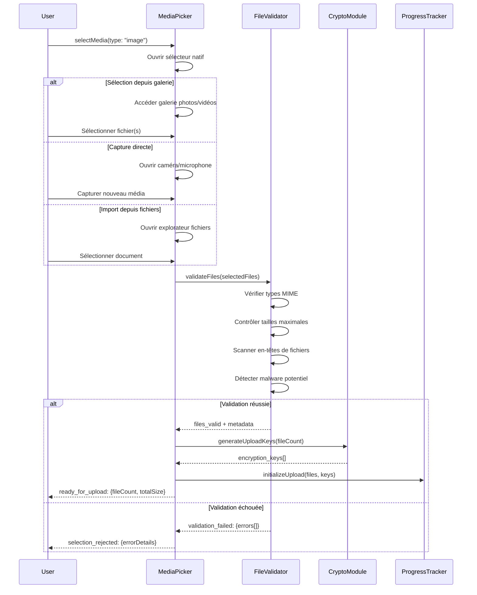
```mermaid
sequenceDiagram
    participant User
    participant MediaPicker
    participant FileValidator
    participant CryptoModule
    participant ProgressTracker
    
    User->>MediaPicker: selectMedia(type: "image")
    MediaPicker->>MediaPicker: Ouvrir sélecteur natif
    
    alt Sélection depuis galerie
        MediaPicker->>MediaPicker: Accéder galerie photos/vidéos
        User->>MediaPicker: Sélectionner fichier(s)
    else Capture directe
        MediaPicker->>MediaPicker: Ouvrir caméra/microphone
        User->>MediaPicker: Capturer nouveau média
    else Import depuis fichiers
        MediaPicker->>MediaPicker: Ouvrir explorateur fichiers
        User->>MediaPicker: Sélectionner document
    end
    
    MediaPicker->>FileValidator: validateFiles(selectedFiles)
    
    FileValidator->>FileValidator: Vérifier types MIME
    FileValidator->>FileValidator: Contrôler tailles maximales
    FileValidator->>FileValidator: Scanner en-têtes de fichiers
    FileValidator->>FileValidator: Détecter malware potentiel
    
    alt Validation réussie
        FileValidator-->>MediaPicker: files_valid + metadata
        MediaPicker->>CryptoModule: generateUploadKeys(fileCount)
        CryptoModule-->>MediaPicker: encryption_keys[]
        
        MediaPicker->>ProgressTracker: initializeUpload(files, keys)
        MediaPicker-->>User: ready_for_upload: {fileCount, totalSize}
        
    else Validation échouée
        FileValidator-->>MediaPicker: validation_failed: {errors[]}
        MediaPicker-->>User: selection_rejected: {errorDetails}
    end
```

### 2.2 Validation avancée et métadonnées

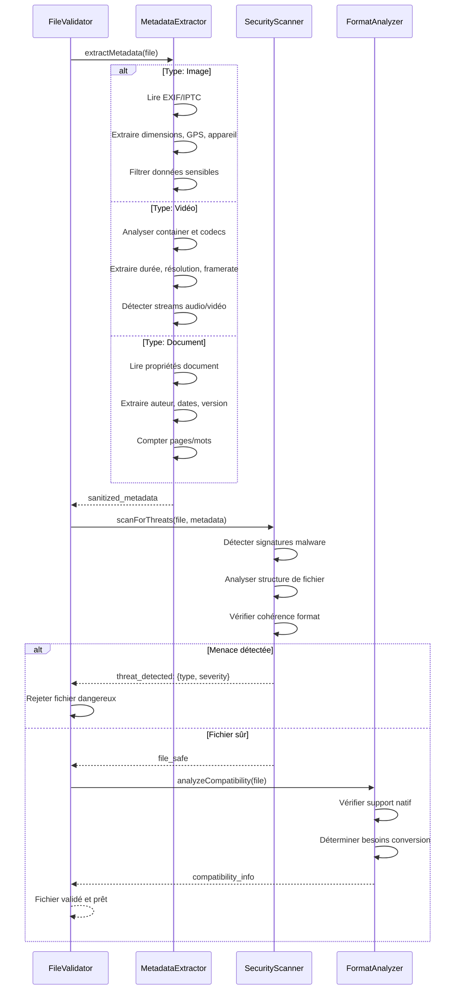
```mermaid
sequenceDiagram
    participant FileValidator
    participant MetadataExtractor
    participant SecurityScanner
    participant FormatAnalyzer
    
    FileValidator->>MetadataExtractor: extractMetadata(file)
    
    alt Type: Image
        MetadataExtractor->>MetadataExtractor: Lire EXIF/IPTC
        MetadataExtractor->>MetadataExtractor: Extraire dimensions, GPS, appareil
        MetadataExtractor->>MetadataExtractor: Filtrer données sensibles
        
    else Type: Vidéo
        MetadataExtractor->>MetadataExtractor: Analyser container et codecs
        MetadataExtractor->>MetadataExtractor: Extraire durée, résolution, framerate
        MetadataExtractor->>MetadataExtractor: Détecter streams audio/vidéo
        
    else Type: Document
        MetadataExtractor->>MetadataExtractor: Lire propriétés document
        MetadataExtractor->>MetadataExtractor: Extraire auteur, dates, version
        MetadataExtractor->>MetadataExtractor: Compter pages/mots
    end
    
    MetadataExtractor-->>FileValidator: sanitized_metadata
    
    FileValidator->>SecurityScanner: scanForThreats(file, metadata)
    SecurityScanner->>SecurityScanner: Détecter signatures malware
    SecurityScanner->>SecurityScanner: Analyser structure de fichier
    SecurityScanner->>SecurityScanner: Vérifier cohérence format
    
    alt Menace détectée
        SecurityScanner-->>FileValidator: threat_detected: {type, severity}
        FileValidator->>FileValidator: Rejeter fichier dangereux
    else Fichier sûr
        SecurityScanner-->>FileValidator: file_safe
        
        FileValidator->>FormatAnalyzer: analyzeCompatibility(file)
        FormatAnalyzer->>FormatAnalyzer: Vérifier support natif
        FormatAnalyzer->>FormatAnalyzer: Déterminer besoins conversion
        FormatAnalyzer-->>FileValidator: compatibility_info
        
        FileValidator-->>FileValidator: Fichier validé et prêt
    end
```

### 2.3 Gestion des erreurs de validation

#### Types d'erreurs et actions
- **Fichier trop volumineux**: Proposition de compression ou découpage
- **Format non supporté**: Suggestion de conversion ou formats alternatifs
- **Fichier corrompu**: Demande de re-sélection avec diagnostic
- **Contenu potentiellement dangereux**: Blocage avec explication détaillée
- **Métadonnées sensibles**: Nettoyage automatique avec confirmation utilisateur

## 3. Chiffrement et upload sécurisé

### 3.1 Processus de chiffrement des médias

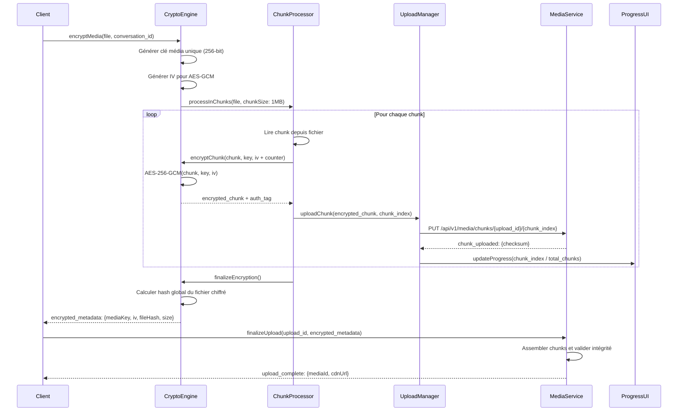
```mermaid
sequenceDiagram
    participant Client
    participant CryptoEngine
    participant ChunkProcessor
    participant UploadManager
    participant MediaService
    participant ProgressUI
    
    Client->>CryptoEngine: encryptMedia(file, conversation_id)
    CryptoEngine->>CryptoEngine: Générer clé média unique (256-bit)
    CryptoEngine->>CryptoEngine: Générer IV pour AES-GCM
    
    CryptoEngine->>ChunkProcessor: processInChunks(file, chunkSize: 1MB)
    
    loop Pour chaque chunk
        ChunkProcessor->>ChunkProcessor: Lire chunk depuis fichier
        ChunkProcessor->>CryptoEngine: encryptChunk(chunk, key, iv + counter)
        CryptoEngine->>CryptoEngine: AES-256-GCM(chunk, key, iv)
        CryptoEngine-->>ChunkProcessor: encrypted_chunk + auth_tag
        
        ChunkProcessor->>UploadManager: uploadChunk(encrypted_chunk, chunk_index)
        UploadManager->>MediaService: PUT /api/v1/media/chunks/{upload_id}/{chunk_index}
        MediaService-->>UploadManager: chunk_uploaded: {checksum}
        
        UploadManager->>ProgressUI: updateProgress(chunk_index / total_chunks)
    end
    
    ChunkProcessor->>CryptoEngine: finalizeEncryption()
    CryptoEngine->>CryptoEngine: Calculer hash global du fichier chiffré
    CryptoEngine-->>Client: encrypted_metadata: {mediaKey, iv, fileHash, size}
    
    Client->>MediaService: finalizeUpload(upload_id, encrypted_metadata)
    MediaService->>MediaService: Assembler chunks et valider intégrité
    MediaService-->>Client: upload_complete: {mediaId, cdnUrl}
```

### 3.2 Upload avec reprise automatique

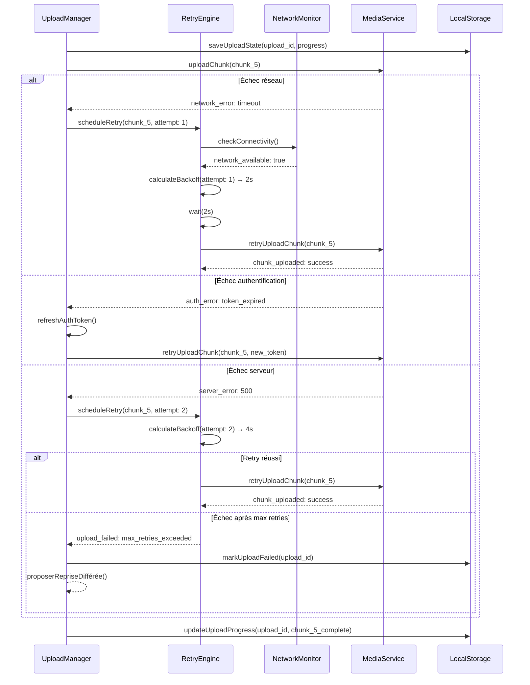
```mermaid
sequenceDiagram
    participant UploadManager
    participant RetryEngine
    participant NetworkMonitor
    participant MediaService
    participant LocalStorage
    
    UploadManager->>LocalStorage: saveUploadState(upload_id, progress)
    UploadManager->>MediaService: uploadChunk(chunk_5)
    
    alt Échec réseau
        MediaService-->>UploadManager: network_error: timeout
        UploadManager->>RetryEngine: scheduleRetry(chunk_5, attempt: 1)
        
        RetryEngine->>NetworkMonitor: checkConnectivity()
        NetworkMonitor-->>RetryEngine: network_available: true
        
        RetryEngine->>RetryEngine: calculateBackoff(attempt: 1) → 2s
        RetryEngine->>RetryEngine: wait(2s)
        
        RetryEngine->>MediaService: retryUploadChunk(chunk_5)
        MediaService-->>RetryEngine: chunk_uploaded: success
        
    else Échec authentification
        MediaService-->>UploadManager: auth_error: token_expired
        UploadManager->>UploadManager: refreshAuthToken()
        UploadManager->>MediaService: retryUploadChunk(chunk_5, new_token)
        
    else Échec serveur
        MediaService-->>UploadManager: server_error: 500
        UploadManager->>RetryEngine: scheduleRetry(chunk_5, attempt: 2)
        RetryEngine->>RetryEngine: calculateBackoff(attempt: 2) → 4s
        
        alt Retry réussi
            RetryEngine->>MediaService: retryUploadChunk(chunk_5)
            MediaService-->>RetryEngine: chunk_uploaded: success
        else Échec après max retries
            RetryEngine-->>UploadManager: upload_failed: max_retries_exceeded
            UploadManager->>LocalStorage: markUploadFailed(upload_id)
            UploadManager-->>UploadManager: proposerRepriseDifférée()
        end
    end
    
    UploadManager->>LocalStorage: updateUploadProgress(upload_id, chunk_5_complete)
```

### 3.3 Optimisation de l'upload

#### Stratégies d'optimisation
- **Upload parallèle**: Maximum 3 chunks simultanés pour éviter la saturation
- **Compression adaptative**: Ajustement selon la qualité réseau détectée
- **Priorisation intelligente**: Upload prioritaire des thumbnails et métadonnées
- **Déduplication**: Vérification de hash pour éviter les uploads redondants
- **Delta-upload**: Upload uniquement des parties modifiées pour les versions

## 4. Traitement et optimisation

### 4.1 Pipeline de traitement des images

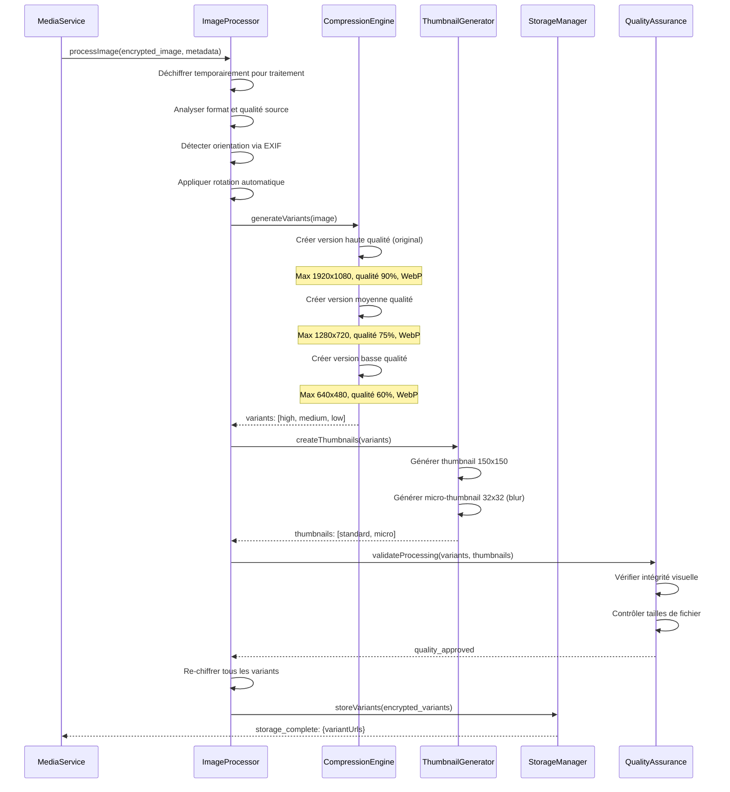
```mermaid
sequenceDiagram
    participant MediaService
    participant ImageProcessor
    participant CompressionEngine
    participant ThumbnailGenerator
    participant StorageManager
    participant QualityAssurance
    
    MediaService->>ImageProcessor: processImage(encrypted_image, metadata)
    ImageProcessor->>ImageProcessor: Déchiffrer temporairement pour traitement
    
    ImageProcessor->>ImageProcessor: Analyser format et qualité source
    ImageProcessor->>ImageProcessor: Détecter orientation via EXIF
    ImageProcessor->>ImageProcessor: Appliquer rotation automatique
    
    ImageProcessor->>CompressionEngine: generateVariants(image)
    
    CompressionEngine->>CompressionEngine: Créer version haute qualité (original)
    Note over CompressionEngine: Max 1920x1080, qualité 90%, WebP
    
    CompressionEngine->>CompressionEngine: Créer version moyenne qualité
    Note over CompressionEngine: Max 1280x720, qualité 75%, WebP
    
    CompressionEngine->>CompressionEngine: Créer version basse qualité
    Note over CompressionEngine: Max 640x480, qualité 60%, WebP
    
    CompressionEngine-->>ImageProcessor: variants: [high, medium, low]
    
    ImageProcessor->>ThumbnailGenerator: createThumbnails(variants)
    ThumbnailGenerator->>ThumbnailGenerator: Générer thumbnail 150x150
    ThumbnailGenerator->>ThumbnailGenerator: Générer micro-thumbnail 32x32 (blur)
    ThumbnailGenerator-->>ImageProcessor: thumbnails: [standard, micro]
    
    ImageProcessor->>QualityAssurance: validateProcessing(variants, thumbnails)
    QualityAssurance->>QualityAssurance: Vérifier intégrité visuelle
    QualityAssurance->>QualityAssurance: Contrôler tailles de fichier
    QualityAssurance-->>ImageProcessor: quality_approved
    
    ImageProcessor->>ImageProcessor: Re-chiffrer tous les variants
    ImageProcessor->>StorageManager: storeVariants(encrypted_variants)
    StorageManager-->>MediaService: storage_complete: {variantUrls}
```

### 4.2 Traitement des vidéos

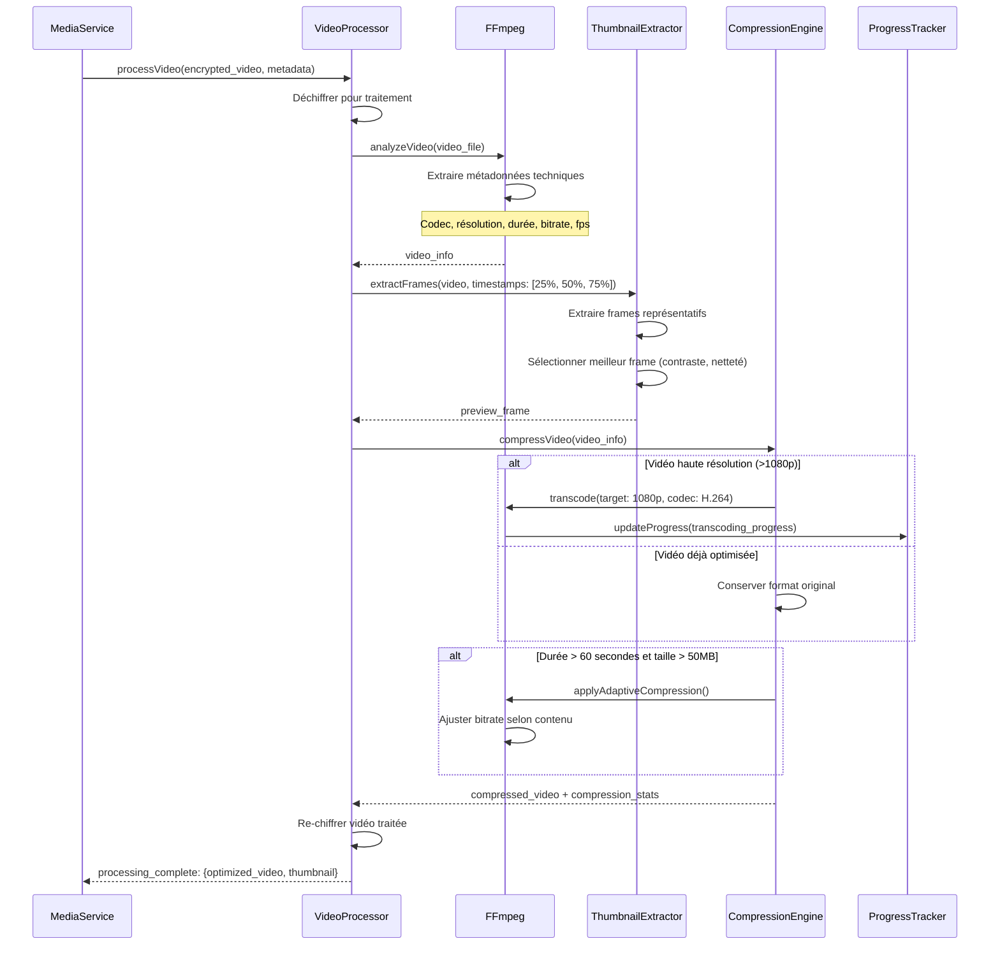
```mermaid
sequenceDiagram
    participant MediaService
    participant VideoProcessor
    participant FFmpeg
    participant ThumbnailExtractor
    participant CompressionEngine
    participant ProgressTracker
    
    MediaService->>VideoProcessor: processVideo(encrypted_video, metadata)
    VideoProcessor->>VideoProcessor: Déchiffrer pour traitement
    VideoProcessor->>FFmpeg: analyzeVideo(video_file)
    
    FFmpeg->>FFmpeg: Extraire métadonnées techniques
    Note over FFmpeg: Codec, résolution, durée, bitrate, fps
    FFmpeg-->>VideoProcessor: video_info
    
    VideoProcessor->>ThumbnailExtractor: extractFrames(video, timestamps: [25%, 50%, 75%])
    ThumbnailExtractor->>ThumbnailExtractor: Extraire frames représentatifs
    ThumbnailExtractor->>ThumbnailExtractor: Sélectionner meilleur frame (contraste, netteté)
    ThumbnailExtractor-->>VideoProcessor: preview_frame
    
    VideoProcessor->>CompressionEngine: compressVideo(video_info)
    
    alt Vidéo haute résolution (>1080p)
        CompressionEngine->>FFmpeg: transcode(target: 1080p, codec: H.264)
        FFmpeg->>ProgressTracker: updateProgress(transcoding_progress)
    else Vidéo déjà optimisée
        CompressionEngine->>CompressionEngine: Conserver format original
    end
    
    alt Durée > 60 secondes et taille > 50MB
        CompressionEngine->>FFmpeg: applyAdaptiveCompression()
        FFmpeg->>FFmpeg: Ajuster bitrate selon contenu
    end
    
    CompressionEngine-->>VideoProcessor: compressed_video + compression_stats
    
    VideoProcessor->>VideoProcessor: Re-chiffrer vidéo traitée
    VideoProcessor-->>MediaService: processing_complete: {optimized_video, thumbnail}
```

### 4.3 Traitement des documents

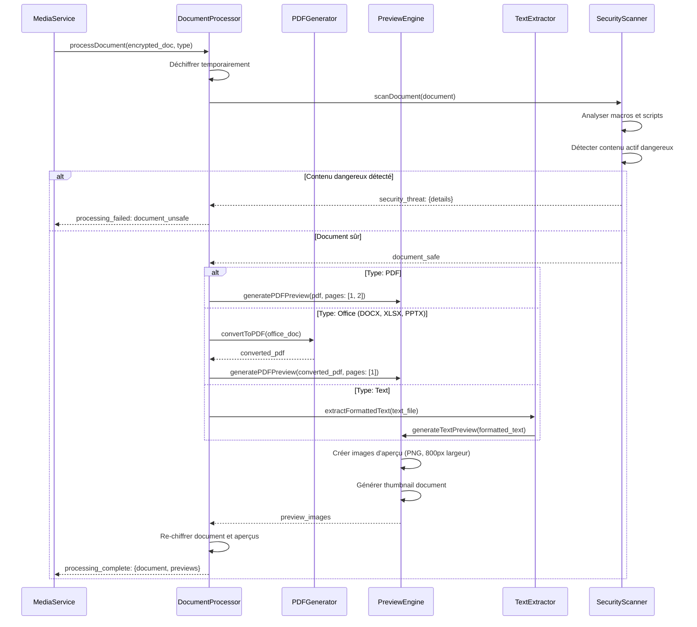
```mermaid
sequenceDiagram
    participant MediaService
    participant DocumentProcessor
    participant PDFGenerator
    participant PreviewEngine
    participant TextExtractor
    participant SecurityScanner
    
    MediaService->>DocumentProcessor: processDocument(encrypted_doc, type)
    DocumentProcessor->>DocumentProcessor: Déchiffrer temporairement
    
    DocumentProcessor->>SecurityScanner: scanDocument(document)
    SecurityScanner->>SecurityScanner: Analyser macros et scripts
    SecurityScanner->>SecurityScanner: Détecter contenu actif dangereux
    
    alt Contenu dangereux détecté
        SecurityScanner-->>DocumentProcessor: security_threat: {details}
        DocumentProcessor-->>MediaService: processing_failed: document_unsafe
    else Document sûr
        SecurityScanner-->>DocumentProcessor: document_safe
        
        alt Type: PDF
            DocumentProcessor->>PreviewEngine: generatePDFPreview(pdf, pages: [1, 2])
            
        else Type: Office (DOCX, XLSX, PPTX)
            DocumentProcessor->>PDFGenerator: convertToPDF(office_doc)
            PDFGenerator-->>DocumentProcessor: converted_pdf
            DocumentProcessor->>PreviewEngine: generatePDFPreview(converted_pdf, pages: [1])
            
        else Type: Text
            DocumentProcessor->>TextExtractor: extractFormattedText(text_file)
            TextExtractor->>PreviewEngine: generateTextPreview(formatted_text)
        end
        
        PreviewEngine->>PreviewEngine: Créer images d'aperçu (PNG, 800px largeur)
        PreviewEngine->>PreviewEngine: Générer thumbnail document
        PreviewEngine-->>DocumentProcessor: preview_images
        
        DocumentProcessor->>DocumentProcessor: Re-chiffrer document et aperçus
        DocumentProcessor-->>MediaService: processing_complete: {document, previews}
    end
```

## 5. Modération de contenu

### 5.1 Analyse par intelligence artificielle

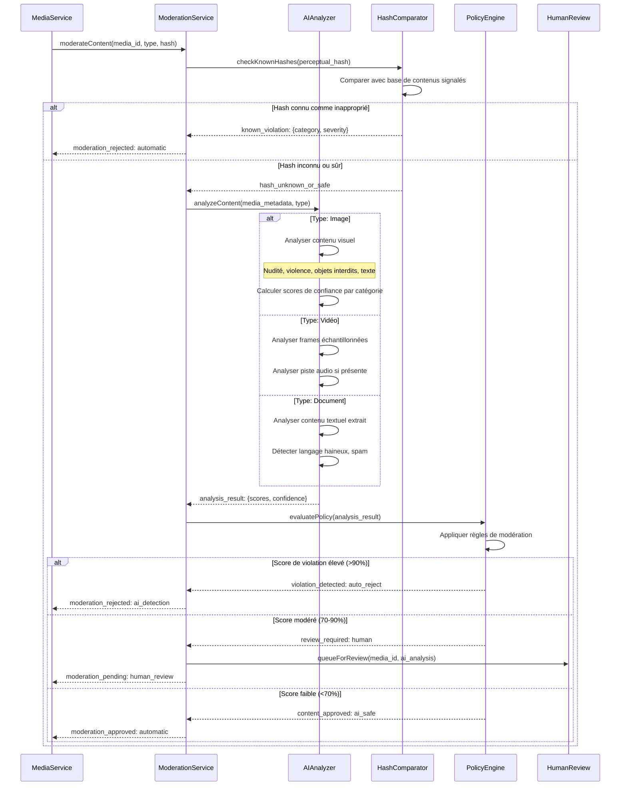
```mermaid
sequenceDiagram
    participant MediaService
    participant ModerationService
    participant AIAnalyzer
    participant HashComparator
    participant PolicyEngine
    participant HumanReview
    
    MediaService->>ModerationService: moderateContent(media_id, type, hash)
    
    ModerationService->>HashComparator: checkKnownHashes(perceptual_hash)
    HashComparator->>HashComparator: Comparer avec base de contenus signalés
    
    alt Hash connu comme inapproprié
        HashComparator-->>ModerationService: known_violation: {category, severity}
        ModerationService-->>MediaService: moderation_rejected: automatic
        
    else Hash inconnu ou sûr
        HashComparator-->>ModerationService: hash_unknown_or_safe
        
        ModerationService->>AIAnalyzer: analyzeContent(media_metadata, type)
        
        alt Type: Image
            AIAnalyzer->>AIAnalyzer: Analyser contenu visuel
            Note over AIAnalyzer: Nudité, violence, objets interdits, texte
            AIAnalyzer->>AIAnalyzer: Calculer scores de confiance par catégorie
            
        else Type: Vidéo
            AIAnalyzer->>AIAnalyzer: Analyser frames échantillonnées
            AIAnalyzer->>AIAnalyzer: Analyser piste audio si présente
            
        else Type: Document
            AIAnalyzer->>AIAnalyzer: Analyser contenu textuel extrait
            AIAnalyzer->>AIAnalyzer: Détecter langage haineux, spam
        end
        
        AIAnalyzer-->>ModerationService: analysis_result: {scores, confidence}
        
        ModerationService->>PolicyEngine: evaluatePolicy(analysis_result)
        PolicyEngine->>PolicyEngine: Appliquer règles de modération
        
        alt Score de violation élevé (>90%)
            PolicyEngine-->>ModerationService: violation_detected: auto_reject
            ModerationService-->>MediaService: moderation_rejected: ai_detection
            
        else Score modéré (70-90%)
            PolicyEngine-->>ModerationService: review_required: human
            ModerationService->>HumanReview: queueForReview(media_id, ai_analysis)
            ModerationService-->>MediaService: moderation_pending: human_review
            
        else Score faible (<70%)
            PolicyEngine-->>ModerationService: content_approved: ai_safe
            ModerationService-->>MediaService: moderation_approved: automatic
        end
    end
```

### 5.2 Modération en temps réel et différée

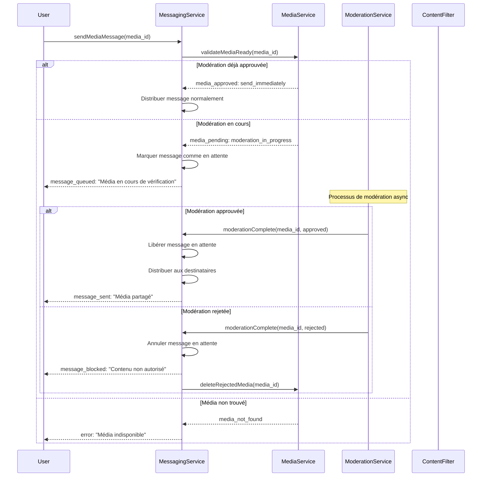
```mermaid
sequenceDiagram
    participant User
    participant MessagingService
    participant MediaService
    participant ModerationService
    participant ContentFilter
    
    User->>MessagingService: sendMediaMessage(media_id)
    MessagingService->>MediaService: validateMediaReady(media_id)
    
    alt Modération déjà approuvée
        MediaService-->>MessagingService: media_approved: send_immediately
        MessagingService->>MessagingService: Distribuer message normalement
        
    else Modération en cours
        MediaService-->>MessagingService: media_pending: moderation_in_progress
        MessagingService->>MessagingService: Marquer message comme en attente
        MessagingService-->>User: message_queued: "Média en cours de vérification"
        
        Note over ModerationService: Processus de modération async
        
        alt Modération approuvée
            ModerationService->>MessagingService: moderationComplete(media_id, approved)
            MessagingService->>MessagingService: Libérer message en attente
            MessagingService->>MessagingService: Distribuer aux destinataires
            MessagingService-->>User: message_sent: "Média partagé"
            
        else Modération rejetée
            ModerationService->>MessagingService: moderationComplete(media_id, rejected)
            MessagingService->>MessagingService: Annuler message en attente
            MessagingService-->>User: message_blocked: "Contenu non autorisé"
            MessagingService->>MediaService: deleteRejectedMedia(media_id)
        end
        
    else Média non trouvé
        MediaService-->>MessagingService: media_not_found
        MessagingService-->>User: error: "Média indisponible"
    end
```

### 5.3 Système d'appel et révision humaine

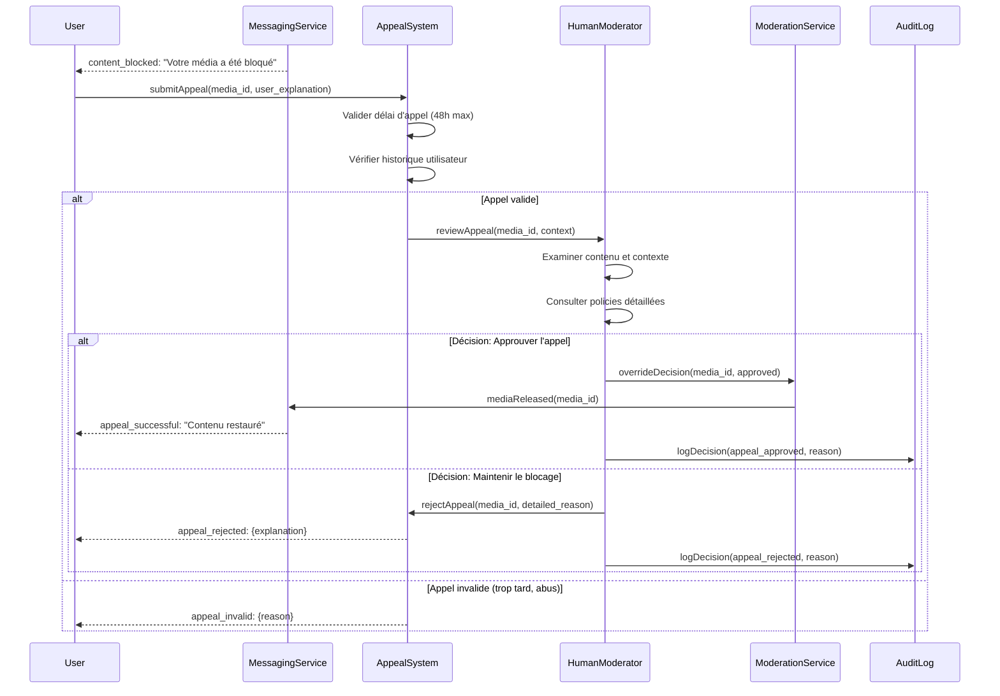
```mermaid
sequenceDiagram
    participant User
    participant MessagingService
    participant AppealSystem
    participant HumanModerator
    participant ModerationService
    participant AuditLog
    
    MessagingService-->>User: content_blocked: "Votre média a été bloqué"
    User->>AppealSystem: submitAppeal(media_id, user_explanation)
    
    AppealSystem->>AppealSystem: Valider délai d'appel (48h max)
    AppealSystem->>AppealSystem: Vérifier historique utilisateur
    
    alt Appel valide
        AppealSystem->>HumanModerator: reviewAppeal(media_id, context)
        HumanModerator->>HumanModerator: Examiner contenu et contexte
        HumanModerator->>HumanModerator: Consulter policies détaillées
        
        alt Décision: Approuver l'appel
            HumanModerator->>ModerationService: overrideDecision(media_id, approved)
            ModerationService->>MessagingService: mediaReleased(media_id)
            MessagingService-->>User: appeal_successful: "Contenu restauré"
            
            HumanModerator->>AuditLog: logDecision(appeal_approved, reason)
            
        else Décision: Maintenir le blocage
            HumanModerator->>AppealSystem: rejectAppeal(media_id, detailed_reason)
            AppealSystem-->>User: appeal_rejected: {explanation}
            
            HumanModerator->>AuditLog: logDecision(appeal_rejected, reason)
        end
        
    else Appel invalide (trop tard, abus)
        AppealSystem-->>User: appeal_invalid: {reason}
    end
```

## 6. Distribution et téléchargement

### 6.1 Téléchargement sécurisé et adaptatif

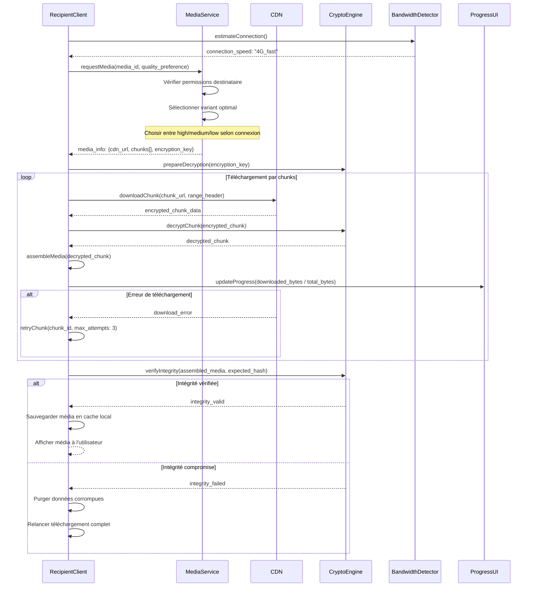
```mermaid
sequenceDiagram
    participant RecipientClient
    participant MediaService
    participant CDN
    participant CryptoEngine
    participant BandwidthDetector
    participant ProgressUI
    
    RecipientClient->>BandwidthDetector: estimateConnection()
    BandwidthDetector-->>RecipientClient: connection_speed: "4G_fast"
    
    RecipientClient->>MediaService: requestMedia(media_id, quality_preference)
    MediaService->>MediaService: Vérifier permissions destinataire
    MediaService->>MediaService: Sélectionner variant optimal
    Note over MediaService: Choisir entre high/medium/low selon connexion
    
    MediaService-->>RecipientClient: media_info: {cdn_url, chunks[], encryption_key}
    
    RecipientClient->>CryptoEngine: prepareDecryption(encryption_key)
    
    loop Téléchargement par chunks
        RecipientClient->>CDN: downloadChunk(chunk_url, range_header)
        CDN-->>RecipientClient: encrypted_chunk_data
        
        RecipientClient->>CryptoEngine: decryptChunk(encrypted_chunk)
        CryptoEngine-->>RecipientClient: decrypted_chunk
        
        RecipientClient->>RecipientClient: assembleMedia(decrypted_chunk)
        RecipientClient->>ProgressUI: updateProgress(downloaded_bytes / total_bytes)
        
        alt Erreur de téléchargement
            CDN-->>RecipientClient: download_error
            RecipientClient->>RecipientClient: retryChunk(chunk_id, max_attempts: 3)
        end
    end
    
    RecipientClient->>CryptoEngine: verifyIntegrity(assembled_media, expected_hash)
    
    alt Intégrité vérifiée
        CryptoEngine-->>RecipientClient: integrity_valid
        RecipientClient->>RecipientClient: Sauvegarder média en cache local
        RecipientClient-->>RecipientClient: Afficher média à l'utilisateur
        
    else Intégrité compromise
        CryptoEngine-->>RecipientClient: integrity_failed
        RecipientClient->>RecipientClient: Purger données corrompues
        RecipientClient->>RecipientClient: Relancer téléchargement complet
    end
```

### 6.2 Streaming pour vidéos et audio

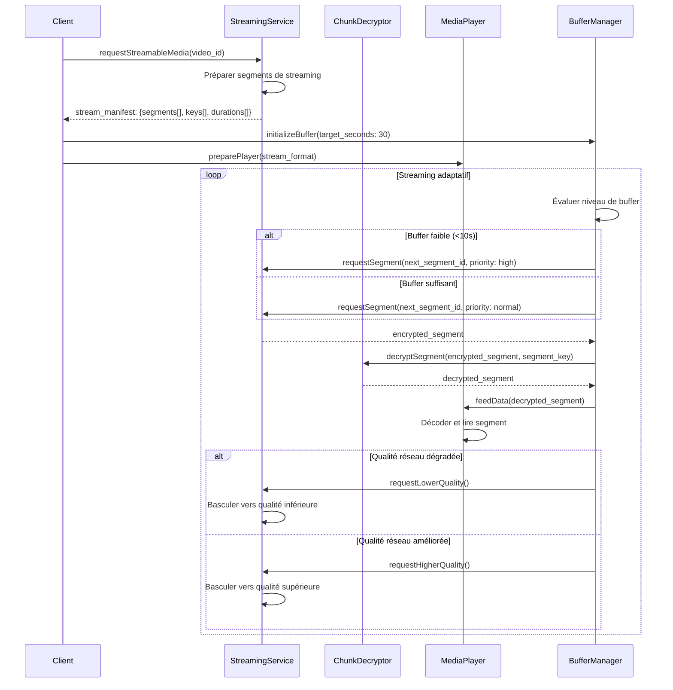
```mermaid
sequenceDiagram
    participant Client
    participant StreamingService
    participant ChunkDecryptor
    participant MediaPlayer
    participant BufferManager
    
    Client->>StreamingService: requestStreamableMedia(video_id)
    StreamingService->>StreamingService: Préparer segments de streaming
    StreamingService-->>Client: stream_manifest: {segments[], keys[], durations[]}
    
    Client->>BufferManager: initializeBuffer(target_seconds: 30)
    Client->>MediaPlayer: preparePlayer(stream_format)
    
    loop Streaming adaptatif
        BufferManager->>BufferManager: Évaluer niveau de buffer
        
        alt Buffer faible (<10s)
            BufferManager->>StreamingService: requestSegment(next_segment_id, priority: high)
        else Buffer suffisant
            BufferManager->>StreamingService: requestSegment(next_segment_id, priority: normal)
        end
        
        StreamingService-->>BufferManager: encrypted_segment
        BufferManager->>ChunkDecryptor: decryptSegment(encrypted_segment, segment_key)
        ChunkDecryptor-->>BufferManager: decrypted_segment
        
        BufferManager->>MediaPlayer: feedData(decrypted_segment)
        MediaPlayer->>MediaPlayer: Décoder et lire segment
        
        alt Qualité réseau dégradée
            BufferManager->>StreamingService: requestLowerQuality()
            StreamingService->>StreamingService: Basculer vers qualité inférieure
        else Qualité réseau améliorée
            BufferManager->>StreamingService: requestHigherQuality()
            StreamingService->>StreamingService: Basculer vers qualité supérieure
        end
    end
```

### 6.3 Gestion du cache local

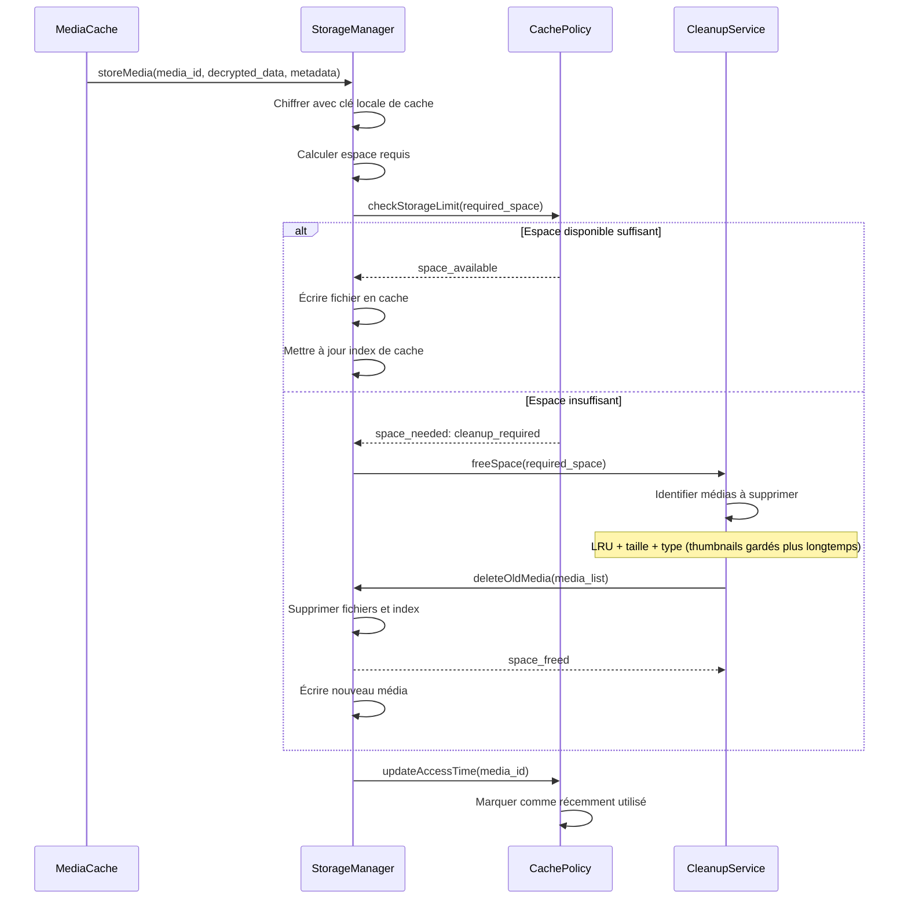
```mermaid
sequenceDiagram
    participant MediaCache
    participant StorageManager
    participant CachePolicy
    participant CleanupService
    
    MediaCache->>StorageManager: storeMedia(media_id, decrypted_data, metadata)
    StorageManager->>StorageManager: Chiffrer avec clé locale de cache
    StorageManager->>StorageManager: Calculer espace requis
    
    StorageManager->>CachePolicy: checkStorageLimit(required_space)
    
    alt Espace disponible suffisant
        CachePolicy-->>StorageManager: space_available
        StorageManager->>StorageManager: Écrire fichier en cache
        StorageManager->>StorageManager: Mettre à jour index de cache
        
    else Espace insuffisant
        CachePolicy-->>StorageManager: space_needed: cleanup_required
        StorageManager->>CleanupService: freeSpace(required_space)
        
        CleanupService->>CleanupService: Identifier médias à supprimer
        Note over CleanupService: LRU + taille + type (thumbnails gardés plus longtemps)
        
        CleanupService->>StorageManager: deleteOldMedia(media_list)
        StorageManager->>StorageManager: Supprimer fichiers et index
        StorageManager-->>CleanupService: space_freed
        
        StorageManager->>StorageManager: Écrire nouveau média
    end
    
    StorageManager->>CachePolicy: updateAccessTime(media_id)
    CachePolicy->>CachePolicy: Marquer comme récemment utilisé
```

## 7. Prévisualisation sécurisée

### 7.1 Génération de previews

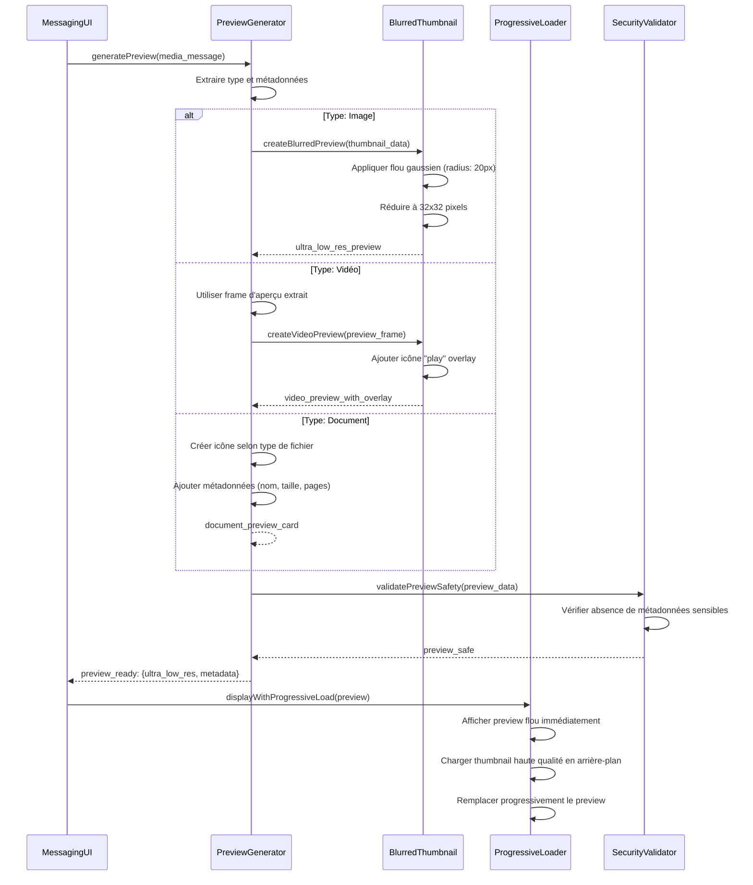
```mermaid
sequenceDiagram
    participant MessagingUI
    participant PreviewGenerator
    participant BlurredThumbnail
    participant ProgressiveLoader
    participant SecurityValidator
    
    MessagingUI->>PreviewGenerator: generatePreview(media_message)
    PreviewGenerator->>PreviewGenerator: Extraire type et métadonnées
    
    alt Type: Image
        PreviewGenerator->>BlurredThumbnail: createBlurredPreview(thumbnail_data)
        BlurredThumbnail->>BlurredThumbnail: Appliquer flou gaussien (radius: 20px)
        BlurredThumbnail->>BlurredThumbnail: Réduire à 32x32 pixels
        BlurredThumbnail-->>PreviewGenerator: ultra_low_res_preview
        
    else Type: Vidéo
        PreviewGenerator->>PreviewGenerator: Utiliser frame d'aperçu extrait
        PreviewGenerator->>BlurredThumbnail: createVideoPreview(preview_frame)
        BlurredThumbnail->>BlurredThumbnail: Ajouter icône "play" overlay
        BlurredThumbnail-->>PreviewGenerator: video_preview_with_overlay
        
    else Type: Document
        PreviewGenerator->>PreviewGenerator: Créer icône selon type de fichier
        PreviewGenerator->>PreviewGenerator: Ajouter métadonnées (nom, taille, pages)
        PreviewGenerator-->>PreviewGenerator: document_preview_card
    end
    
    PreviewGenerator->>SecurityValidator: validatePreviewSafety(preview_data)
    SecurityValidator->>SecurityValidator: Vérifier absence de métadonnées sensibles
    SecurityValidator-->>PreviewGenerator: preview_safe
    
    PreviewGenerator-->>MessagingUI: preview_ready: {ultra_low_res, metadata}
    
    MessagingUI->>ProgressiveLoader: displayWithProgressiveLoad(preview)
    ProgressiveLoader->>ProgressiveLoader: Afficher preview flou immédiatement
    ProgressiveLoader->>ProgressiveLoader: Charger thumbnail haute qualité en arrière-plan
    ProgressiveLoader->>ProgressiveLoader: Remplacer progressivement le preview
```

### 7.2 Chargement progressif intelligent

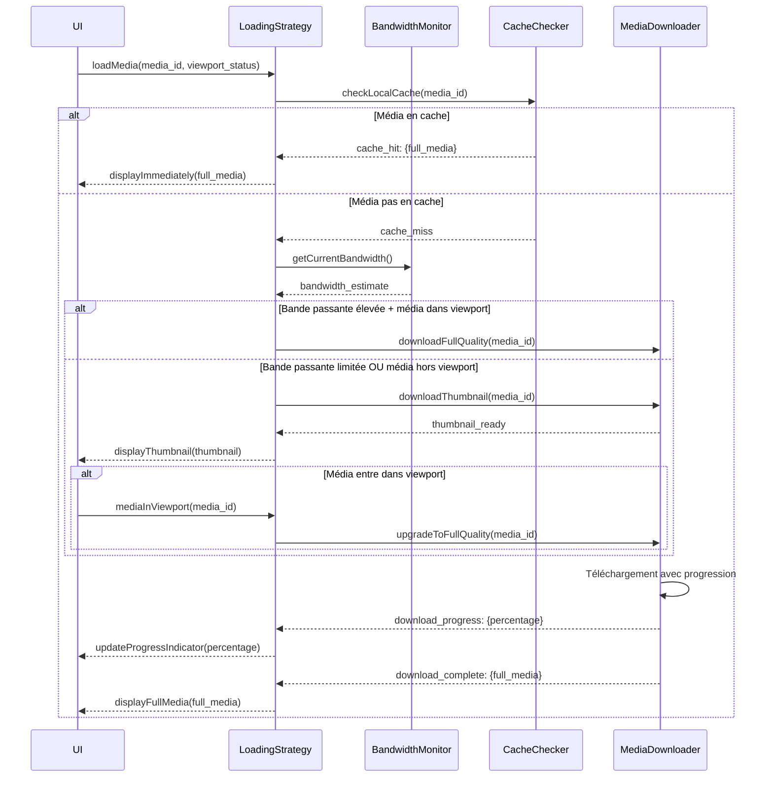
```mermaid
sequenceDiagram
    participant UI
    participant LoadingStrategy
    participant BandwidthMonitor
    participant CacheChecker
    participant MediaDownloader
    
    UI->>LoadingStrategy: loadMedia(media_id, viewport_status)
    LoadingStrategy->>CacheChecker: checkLocalCache(media_id)
    
    alt Média en cache
        CacheChecker-->>LoadingStrategy: cache_hit: {full_media}
        LoadingStrategy-->>UI: displayImmediately(full_media)
        
    else Média pas en cache
        CacheChecker-->>LoadingStrategy: cache_miss
        LoadingStrategy->>BandwidthMonitor: getCurrentBandwidth()
        BandwidthMonitor-->>LoadingStrategy: bandwidth_estimate
        
        alt Bande passante élevée + média dans viewport
            LoadingStrategy->>MediaDownloader: downloadFullQuality(media_id)
            
        else Bande passante limitée OU média hors viewport
            LoadingStrategy->>MediaDownloader: downloadThumbnail(media_id)
            MediaDownloader-->>LoadingStrategy: thumbnail_ready
            LoadingStrategy-->>UI: displayThumbnail(thumbnail)
            
            alt Média entre dans viewport
                UI->>LoadingStrategy: mediaInViewport(media_id)
                LoadingStrategy->>MediaDownloader: upgradeToFullQuality(media_id)
            end
        end
        
        MediaDownloader->>MediaDownloader: Téléchargement avec progression
        MediaDownloader-->>LoadingStrategy: download_progress: {percentage}
        LoadingStrategy-->>UI: updateProgressIndicator(percentage)
        
        MediaDownloader-->>LoadingStrategy: download_complete: {full_media}
        LoadingStrategy-->>UI: displayFullMedia(full_media)
    end
```

### 7.3 Prévisualisation de documents

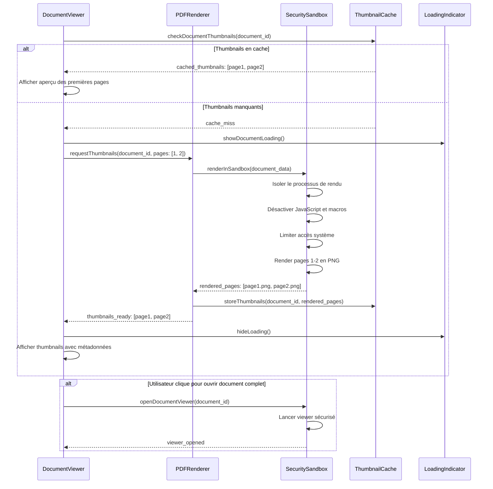
```mermaid
sequenceDiagram
    participant DocumentViewer
    participant PDFRenderer
    participant SecuritySandbox
    participant ThumbnailCache
    participant LoadingIndicator
    
    DocumentViewer->>ThumbnailCache: checkDocumentThumbnails(document_id)
    
    alt Thumbnails en cache
        ThumbnailCache-->>DocumentViewer: cached_thumbnails: [page1, page2]
        DocumentViewer->>DocumentViewer: Afficher aperçu des premières pages
        
    else Thumbnails manquants
        ThumbnailCache-->>DocumentViewer: cache_miss
        DocumentViewer->>LoadingIndicator: showDocumentLoading()
        
        DocumentViewer->>PDFRenderer: requestThumbnails(document_id, pages: [1, 2])
        PDFRenderer->>SecuritySandbox: renderInSandbox(document_data)
        
        SecuritySandbox->>SecuritySandbox: Isoler le processus de rendu
        SecuritySandbox->>SecuritySandbox: Désactiver JavaScript et macros
        SecuritySandbox->>SecuritySandbox: Limiter accès système
        
        SecuritySandbox->>SecuritySandbox: Render pages 1-2 en PNG
        SecuritySandbox-->>PDFRenderer: rendered_pages: [page1.png, page2.png]
        
        PDFRenderer->>ThumbnailCache: storeThumbnails(document_id, rendered_pages)
        PDFRenderer-->>DocumentViewer: thumbnails_ready: [page1, page2]
        
        DocumentViewer->>LoadingIndicator: hideLoading()
        DocumentViewer->>DocumentViewer: Afficher thumbnails avec métadonnées
    end
    
    alt Utilisateur clique pour ouvrir document complet
        DocumentViewer->>SecuritySandbox: openDocumentViewer(document_id)
        SecuritySandbox->>SecuritySandbox: Lancer viewer sécurisé
        SecuritySandbox-->>DocumentViewer: viewer_opened
    end
```

## 8. Intégration avec les autres services

### 8.1 Interface avec Messaging Service

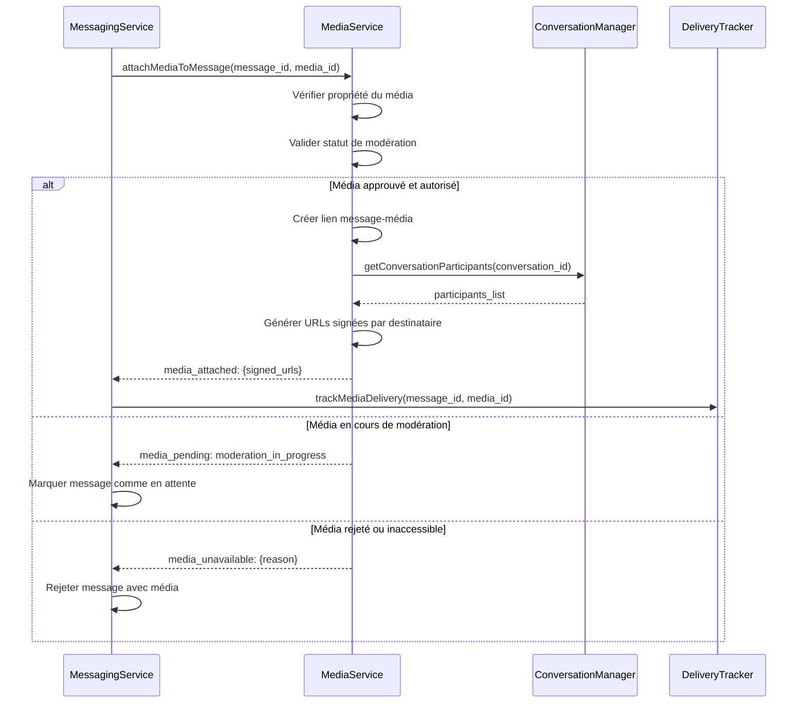
```mermaid
sequenceDiagram
    participant MessagingService
    participant MediaService
    participant ConversationManager
    participant DeliveryTracker
    
    MessagingService->>MediaService: attachMediaToMessage(message_id, media_id)
    MediaService->>MediaService: Vérifier propriété du média
    MediaService->>MediaService: Valider statut de modération
    
    alt Média approuvé et autorisé
        MediaService->>MediaService: Créer lien message-média
        MediaService->>ConversationManager: getConversationParticipants(conversation_id)
        ConversationManager-->>MediaService: participants_list
        
        MediaService->>MediaService: Générer URLs signées par destinataire
        MediaService-->>MessagingService: media_attached: {signed_urls}
        
        MessagingService->>DeliveryTracker: trackMediaDelivery(message_id, media_id)
        
    else Média en cours de modération
        MediaService-->>MessagingService: media_pending: moderation_in_progress
        MessagingService->>MessagingService: Marquer message comme en attente
        
    else Média rejeté ou inaccessible
        MediaService-->>MessagingService: media_unavailable: {reason}
        MessagingService->>MessagingService: Rejeter message avec média
    end
```

### 8.2 Interface avec User Service

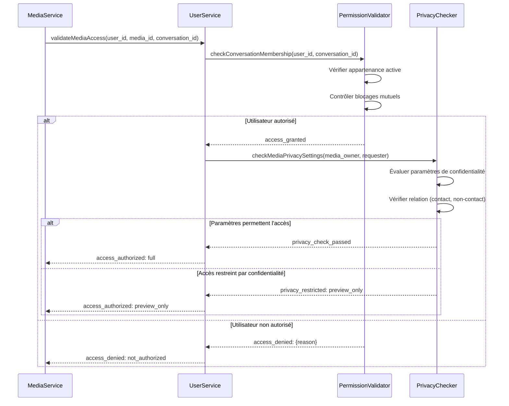
```mermaid
sequenceDiagram
    participant MediaService
    participant UserService
    participant PermissionValidator
    participant PrivacyChecker
    
    MediaService->>UserService: validateMediaAccess(user_id, media_id, conversation_id)
    UserService->>PermissionValidator: checkConversationMembership(user_id, conversation_id)
    
    PermissionValidator->>PermissionValidator: Vérifier appartenance active
    PermissionValidator->>PermissionValidator: Contrôler blocages mutuels
    
    alt Utilisateur autorisé
        PermissionValidator-->>UserService: access_granted
        UserService->>PrivacyChecker: checkMediaPrivacySettings(media_owner, requester)
        
        PrivacyChecker->>PrivacyChecker: Évaluer paramètres de confidentialité
        PrivacyChecker->>PrivacyChecker: Vérifier relation (contact, non-contact)
        
        alt Paramètres permettent l'accès
            PrivacyChecker-->>UserService: privacy_check_passed
            UserService-->>MediaService: access_authorized: full
            
        else Accès restreint par confidentialité
            PrivacyChecker-->>UserService: privacy_restricted: preview_only
            UserService-->>MediaService: access_authorized: preview_only
        end
        
    else Utilisateur non autorisé
        PermissionValidator-->>UserService: access_denied: {reason}
        UserService-->>MediaService: access_denied: not_authorized
    end
```

### 8.3 Interface avec Moderation Service

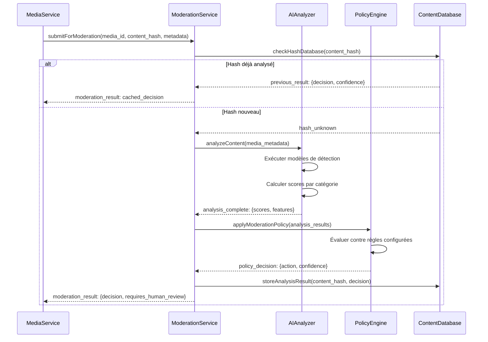
```mermaid
sequenceDiagram
    participant MediaService
    participant ModerationService
    participant AIAnalyzer
    participant PolicyEngine
    participant ContentDatabase
    
    MediaService->>ModerationService: submitForModeration(media_id, content_hash, metadata)
    ModerationService->>ContentDatabase: checkHashDatabase(content_hash)
    
    alt Hash déjà analysé
        ContentDatabase-->>ModerationService: previous_result: {decision, confidence}
        ModerationService-->>MediaService: moderation_result: cached_decision
        
    else Hash nouveau
        ContentDatabase-->>ModerationService: hash_unknown
        ModerationService->>AIAnalyzer: analyzeContent(media_metadata)
        
        AIAnalyzer->>AIAnalyzer: Exécuter modèles de détection
        AIAnalyzer->>AIAnalyzer: Calculer scores par catégorie
        AIAnalyzer-->>ModerationService: analysis_complete: {scores, features}
        
        ModerationService->>PolicyEngine: applyModerationPolicy(analysis_results)
        PolicyEngine->>PolicyEngine: Évaluer contre règles configurées
        PolicyEngine-->>ModerationService: policy_decision: {action, confidence}
        
        ModerationService->>ContentDatabase: storeAnalysisResult(content_hash, decision)
        ModerationService-->>MediaService: moderation_result: {decision, requires_human_review}
    end
```

## 9. Considérations techniques

### 9.1 Architecture de stockage

#### Structure hiérarchique
```
media_storage/
├── encrypted/              # Contenus chiffrés originaux
│   ├── images/
│   │   ├── 2025/01/        # Partitionnement temporel
│   │   └── variants/       # Différentes qualités
│   ├── videos/
│   ├── documents/
│   └── audio/
├── thumbnails/             # Aperçus et previews
├── temp/                   # Stockage temporaire upload
└── cache/                  # Cache local optimisé
```

#### Base de données des médias
```sql
CREATE TABLE media_items (
    id UUID PRIMARY KEY DEFAULT uuid_generate_v4(),
    owner_id UUID NOT NULL,
    conversation_id UUID,
    media_type VARCHAR(20) NOT NULL,
    original_filename VARCHAR(255),
    file_size BIGINT NOT NULL,
    content_hash VARCHAR(64) NOT NULL,
    encryption_key_hash VARCHAR(64), -- Hash de la clé pour déduplication
    storage_url VARCHAR(500) NOT NULL,
    thumbnail_url VARCHAR(500),
    metadata JSONB NOT NULL DEFAULT '{}',
    moderation_status VARCHAR(20) DEFAULT 'pending',
    moderation_score DECIMAL(3,2),
    upload_completed_at TIMESTAMP,
    expires_at TIMESTAMP,
    created_at TIMESTAMP NOT NULL DEFAULT NOW(),
    updated_at TIMESTAMP NOT NULL DEFAULT NOW()
);

CREATE TABLE media_variants (
    id UUID PRIMARY KEY DEFAULT uuid_generate_v4(),
    media_id UUID NOT NULL REFERENCES media_items(id) ON DELETE CASCADE,
    variant_type VARCHAR(20) NOT NULL, -- 'thumbnail', 'low', 'medium', 'high'
    file_size BIGINT NOT NULL,
    dimensions VARCHAR(20), -- '1920x1080'
    storage_url VARCHAR(500) NOT NULL,
    created_at TIMESTAMP NOT NULL DEFAULT NOW()
);
```

### 9.2 Optimisations de performance

#### Stratégies de cache
- **Cache L1 (Client)**: Médias récemment consultés en mémoire (50MB max)
- **Cache L2 (Local)**: Stockage persistant local chiffré (500MB par défaut)
- **Cache L3 (CDN)**: Distribution géographique des contenus populaires
- **Cache adaptatif**: Ajustement selon usage et connexion utilisateur

#### Compression intelligente
- **Images**: WebP avec fallback JPEG, compression basée sur contenu
- **Vidéos**: H.264/H.265 adaptatif, bitrate variable selon complexité
- **Audio**: Opus pour voix, AAC pour musique
- **Documents**: Compression PDF optimisée, OCR pour recherche

### 9.3 Sécurité avancée

#### Isolation des processus
- **Sandbox de traitement**: Isolation des opérations de décodage/encodage
- **Containers sécurisés**: Limitation des ressources et accès système
- **Validation stricte**: Vérification des formats avant traitement
- **Audit complet**: Journalisation de toutes les opérations sensibles

## 10. Endpoints API

| Endpoint | Méthode | Description | Paramètres |
|----------|---------|-------------|------------|
| `/api/v1/media/upload` | POST | Initier upload multipart | `content_type`, `file_size`, `conversation_id` |
| `/api/v1/media/chunks/{upload_id}/{chunk}` | PUT | Upload chunk | Corps binaire chiffré |
| `/api/v1/media/finalize/{upload_id}` | POST | Finaliser upload | Métadonnées et hash |
| `/api/v1/media/{media_id}` | GET | Télécharger média | `quality` (low/medium/high) |
| `/api/v1/media/{media_id}/thumbnail` | GET | Obtenir thumbnail | `size` (small/medium/large) |
| `/api/v1/media/{media_id}/stream` | GET | Stream vidéo/audio | Range header supporté |
| `/api/v1/media/{media_id}/preview` | GET | Aperçu document | `page` pour PDF |
| `/api/v1/media/{media_id}/metadata` | GET | Métadonnées média | - |
| `/api/v1/media/{media_id}` | DELETE | Supprimer média | - |
| `/api/v1/media/batch/download` | POST | Téléchargement groupé | Liste de `media_ids` |

## 11. Tests et validation

### 11.1 Tests de performance
- **Upload parallèle**: Validation de la charge avec uploads simultanés
- **Streaming adaptatif**: Tests de qualité selon bande passante
- **Cache efficiency**: Mesure des taux de hit/miss du cache
- **Compression ratio**: Validation des gains de taille par format

### 11.2 Tests de sécurité
- **Chiffrement E2E**: Validation de bout en bout du chiffrement
- **Validation de format**: Tests avec fichiers malformés/malveillants
- **Modération accuracy**: Tests de précision de l'IA avec datasets connus
- **Isolation sandbox**: Vérification de l'isolation des processus

### 11.3 Tests d'intégration
- **Flux complet**: Upload → Modération → Distribution → Download
- **Multi-appareils**: Synchronisation entre différents clients
- **Gestion d'erreurs**: Récupération après échecs réseau/serveur
- **Scalabilité**: Comportement sous charge élevée

## 12. Livrables

1. **Service de gestion des médias** comprenant :
   - API complète d'upload/download avec chiffrement
   - Pipeline de traitement et optimisation automatique
   - Intégration avec service de modération IA
   - Système de cache multi-niveaux

2. **SDK client multiplateforme** pour :
   - Upload progressif avec reprise automatique
   - Téléchargement adaptatif selon connexion
   - Prévisualisation sécurisée des contenus
   - Gestion intelligente du cache local

3. **Interface utilisateur** incluant :
   - Sélecteur de médias unifié
   - Visionneuse intégrée pour tous types de contenu
   - Indicateurs de progression et statut
   - Options de qualité et compression

4. **Infrastructure opérationnelle** :
   - Monitoring des performances et erreurs
   - Métriques de modération et qualité
   - Outils d'administration des contenus
   - Documentation complète d'intégration