# Spécification Fonctionnelle - Messages Spéciaux

## 1. Vue d'ensemble

### 1.1 Objectif

Cette spécification détaille la gestion des types particuliers de messages de l'application Whispr qui enrichissent l'expérience de messagerie au-delà des messages texte et médias standards. Elle couvre les messages éphémères, programmés, système, épinglés et les réactions, chacun avec ses règles de traitement, cycle de vie et fonctionnalités spécifiques.

### 1.2 Principes clés

- **Flexibilité d'expression**: Offrir des moyens variés de communication et d'interaction
- **Confidentialité renforcée**: Options de messages à durée de vie limitée
- **Planification intelligente**: Capacité d'envoi différé pour une communication optimale
- **Information contextuelle**: Messages système pour informer sans encombrer
- **Organisation efficace**: Épinglage pour mettre en valeur les contenus importants
- **Interaction légère**: Réactions rapides pour exprimer des sentiments
- **Respect du chiffrement**: Maintien de la sécurité E2E pour tous types de messages

### 1.3 Types de messages spéciaux

| Type | Description | Durée de vie | Chiffrement | Cas d'usage |
|------|-------------|--------------|-------------|-------------|
| **Éphémères** | Messages à disparition automatique | Configurable (1h - 7j) | E2E complet | Informations sensibles, conversations privées |
| **Programmés** | Messages envoyés à une heure précise | Jusqu'à envoi | E2E complet | Rappels, souhaits, coordination |
| **Système** | Messages générés automatiquement | Permanents | Métadonnées uniquement | Notifications d'événements, changements |
| **Épinglés** | Messages mis en évidence | Jusqu'à désépinglage | Selon message original | Annonces importantes, informations de référence |
| **Réactions** | Réponses emoji rapides | Permanentes | Métadonnées légères | Expression d'émotions, acquiescement |

### 1.4 Composants fonctionnels

Le système de messages spéciaux comprend sept processus principaux :
1. **Gestion des messages éphémères**: Création, distribution et suppression automatique
2. **Planification et envoi différé**: Programmation et déclenchement de messages
3. **Génération de messages système**: Création automatique d'informations contextuelles
4. **Épinglage et mise en valeur**: Gestion des messages importants
5. **Système de réactions**: Ajout et gestion des réponses emoji
6. **Synchronisation multi-appareils**: Cohérence des états spéciaux
7. **Nettoyage et maintenance**: Purge automatique et gestion du cycle de vie

## 2. Messages éphémères

### 2.1 Configuration et création

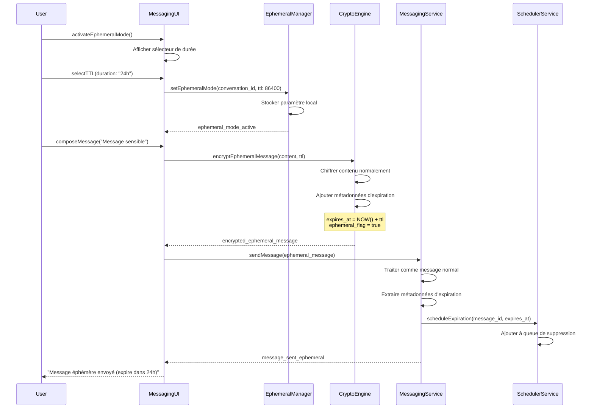
```mermaid
sequenceDiagram
    participant User
    participant MessagingUI
    participant EphemeralManager
    participant CryptoEngine
    participant MessagingService
    participant SchedulerService
    
    User->>MessagingUI: activateEphemeralMode()
    MessagingUI->>MessagingUI: Afficher sélecteur de durée
    User->>MessagingUI: selectTTL(duration: "24h")
    
    MessagingUI->>EphemeralManager: setEphemeralMode(conversation_id, ttl: 86400)
    EphemeralManager->>EphemeralManager: Stocker paramètre local
    EphemeralManager-->>MessagingUI: ephemeral_mode_active
    
    User->>MessagingUI: composeMessage("Message sensible")
    MessagingUI->>CryptoEngine: encryptEphemeralMessage(content, ttl)
    
    CryptoEngine->>CryptoEngine: Chiffrer contenu normalement
    CryptoEngine->>CryptoEngine: Ajouter métadonnées d'expiration
    Note over CryptoEngine: expires_at = NOW() + ttl<br/>ephemeral_flag = true
    
    CryptoEngine-->>MessagingUI: encrypted_ephemeral_message
    
    MessagingUI->>MessagingService: sendMessage(ephemeral_message)
    MessagingService->>MessagingService: Traiter comme message normal
    MessagingService->>MessagingService: Extraire métadonnées d'expiration
    
    MessagingService->>SchedulerService: scheduleExpiration(message_id, expires_at)
    SchedulerService->>SchedulerService: Ajouter à queue de suppression
    
    MessagingService-->>MessagingUI: message_sent_ephemeral
    MessagingUI-->>User: "Message éphémère envoyé (expire dans 24h)"
```

### 2.2 Distribution et affichage

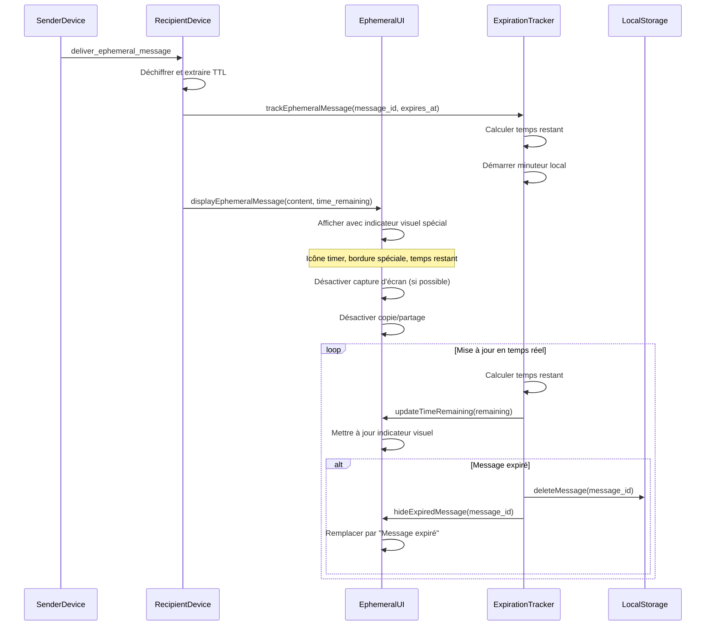
```mermaid
sequenceDiagram
    participant SenderDevice
    participant RecipientDevice
    participant EphemeralUI
    participant ExpirationTracker
    participant LocalStorage
    
    SenderDevice->>RecipientDevice: deliver_ephemeral_message
    RecipientDevice->>RecipientDevice: Déchiffrer et extraire TTL
    
    RecipientDevice->>ExpirationTracker: trackEphemeralMessage(message_id, expires_at)
    ExpirationTracker->>ExpirationTracker: Calculer temps restant
    ExpirationTracker->>ExpirationTracker: Démarrer minuteur local
    
    RecipientDevice->>EphemeralUI: displayEphemeralMessage(content, time_remaining)
    EphemeralUI->>EphemeralUI: Afficher avec indicateur visuel spécial
    Note over EphemeralUI: Icône timer, bordure spéciale, temps restant
    
    EphemeralUI->>EphemeralUI: Désactiver capture d'écran (si possible)
    EphemeralUI->>EphemeralUI: Désactiver copie/partage
    
    loop Mise à jour en temps réel
        ExpirationTracker->>ExpirationTracker: Calculer temps restant
        ExpirationTracker->>EphemeralUI: updateTimeRemaining(remaining)
        EphemeralUI->>EphemeralUI: Mettre à jour indicateur visuel
        
        alt Message expiré
            ExpirationTracker->>LocalStorage: deleteMessage(message_id)
            ExpirationTracker->>EphemeralUI: hideExpiredMessage(message_id)
            EphemeralUI->>EphemeralUI: Remplacer par "Message expiré"
        end
    end
```

### 2.3 Suppression automatique coordonnée

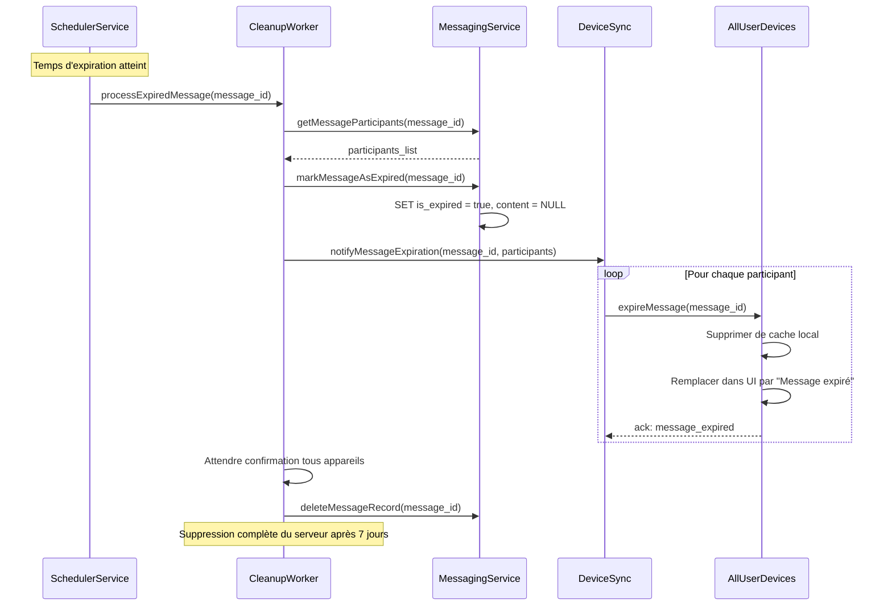
```mermaid
sequenceDiagram
    participant SchedulerService
    participant CleanupWorker
    participant MessagingService
    participant DeviceSync
    participant AllUserDevices
    
    Note over SchedulerService: Temps d'expiration atteint
    
    SchedulerService->>CleanupWorker: processExpiredMessage(message_id)
    CleanupWorker->>MessagingService: getMessageParticipants(message_id)
    MessagingService-->>CleanupWorker: participants_list
    
    CleanupWorker->>MessagingService: markMessageAsExpired(message_id)
    MessagingService->>MessagingService: SET is_expired = true, content = NULL
    
    CleanupWorker->>DeviceSync: notifyMessageExpiration(message_id, participants)
    
    loop Pour chaque participant
        DeviceSync->>AllUserDevices: expireMessage(message_id)
        AllUserDevices->>AllUserDevices: Supprimer de cache local
        AllUserDevices->>AllUserDevices: Remplacer dans UI par "Message expiré"
        AllUserDevices-->>DeviceSync: ack: message_expired
    end
    
    CleanupWorker->>CleanupWorker: Attendre confirmation tous appareils
    CleanupWorker->>MessagingService: deleteMessageRecord(message_id)
    
    Note over CleanupWorker: Suppression complète du serveur après 7 jours
```

### 2.4 Règles et restrictions des messages éphémères

#### Contraintes de sécurité
- **Prévention de capture**: Blocage des captures d'écran quand techniquement possible
- **Désactivation du copier-coller**: Contenu non sélectionnable
- **Pas de transfert**: Impossibilité de transférer un message éphémère
- **Lecture unique**: Option pour des messages qui s'auto-détruisent après lecture

#### Durées configurables
| Durée | Usage recommandé | Icône |
|-------|------------------|-------|
| 1 heure | Informations très sensibles | ⏰ |
| 6 heures | Coordinations temporaires | ⏱️ |
| 24 heures | Conversations privées | 📅 |
| 7 jours | Défaut pour mode éphémère | 📆 |

## 3. Messages programmés

### 3.1 Planification et stockage

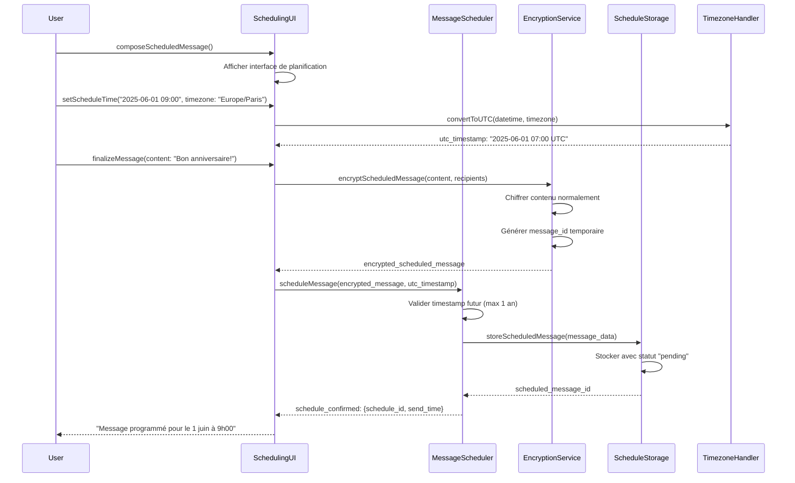
```mermaid
sequenceDiagram
    participant User
    participant SchedulingUI
    participant MessageScheduler
    participant EncryptionService
    participant ScheduleStorage
    participant TimezoneHandler
    
    User->>SchedulingUI: composeScheduledMessage()
    SchedulingUI->>SchedulingUI: Afficher interface de planification
    
    User->>SchedulingUI: setScheduleTime("2025-06-01 09:00", timezone: "Europe/Paris")
    SchedulingUI->>TimezoneHandler: convertToUTC(datetime, timezone)
    TimezoneHandler-->>SchedulingUI: utc_timestamp: "2025-06-01 07:00 UTC"
    
    User->>SchedulingUI: finalizeMessage(content: "Bon anniversaire!")
    SchedulingUI->>EncryptionService: encryptScheduledMessage(content, recipients)
    
    EncryptionService->>EncryptionService: Chiffrer contenu normalement
    EncryptionService->>EncryptionService: Générer message_id temporaire
    EncryptionService-->>SchedulingUI: encrypted_scheduled_message
    
    SchedulingUI->>MessageScheduler: scheduleMessage(encrypted_message, utc_timestamp)
    MessageScheduler->>MessageScheduler: Valider timestamp futur (max 1 an)
    MessageScheduler->>ScheduleStorage: storeScheduledMessage(message_data)
    
    ScheduleStorage->>ScheduleStorage: Stocker avec statut "pending"
    ScheduleStorage-->>MessageScheduler: scheduled_message_id
    
    MessageScheduler-->>SchedulingUI: schedule_confirmed: {schedule_id, send_time}
    SchedulingUI-->>User: "Message programmé pour le 1 juin à 9h00"
```

### 3.2 Exécution et envoi

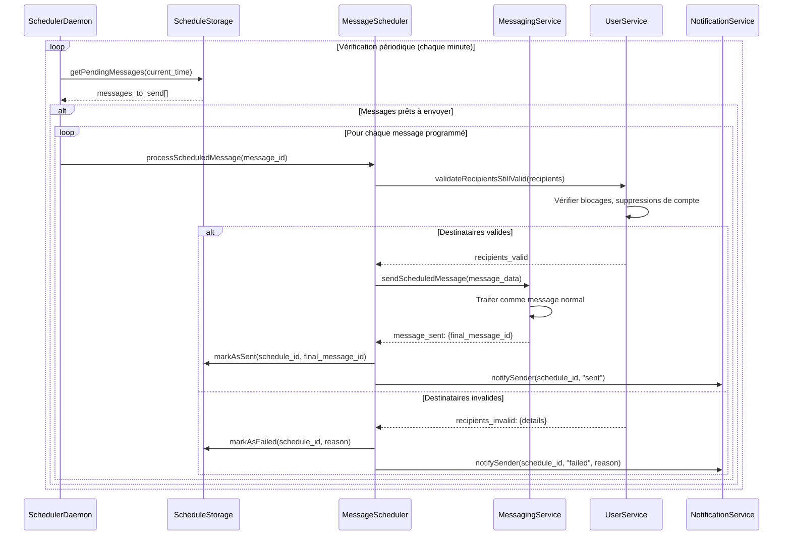
```mermaid
sequenceDiagram
    participant SchedulerDaemon
    participant ScheduleStorage
    participant MessageScheduler
    participant MessagingService
    participant UserService
    participant NotificationService
    
    loop Vérification périodique (chaque minute)
        SchedulerDaemon->>ScheduleStorage: getPendingMessages(current_time)
        ScheduleStorage-->>SchedulerDaemon: messages_to_send[]
        
        alt Messages prêts à envoyer
            loop Pour chaque message programmé
                SchedulerDaemon->>MessageScheduler: processScheduledMessage(message_id)
                
                MessageScheduler->>UserService: validateRecipientsStillValid(recipients)
                UserService->>UserService: Vérifier blocages, suppressions de compte
                
                alt Destinataires valides
                    UserService-->>MessageScheduler: recipients_valid
                    
                    MessageScheduler->>MessagingService: sendScheduledMessage(message_data)
                    MessagingService->>MessagingService: Traiter comme message normal
                    MessagingService-->>MessageScheduler: message_sent: {final_message_id}
                    
                    MessageScheduler->>ScheduleStorage: markAsSent(schedule_id, final_message_id)
                    MessageScheduler->>NotificationService: notifySender(schedule_id, "sent")
                    
                else Destinataires invalides
                    UserService-->>MessageScheduler: recipients_invalid: {details}
                    MessageScheduler->>ScheduleStorage: markAsFailed(schedule_id, reason)
                    MessageScheduler->>NotificationService: notifySender(schedule_id, "failed", reason)
                end
            end
        end
    end
```

### 3.3 Gestion et modification des messages programmés

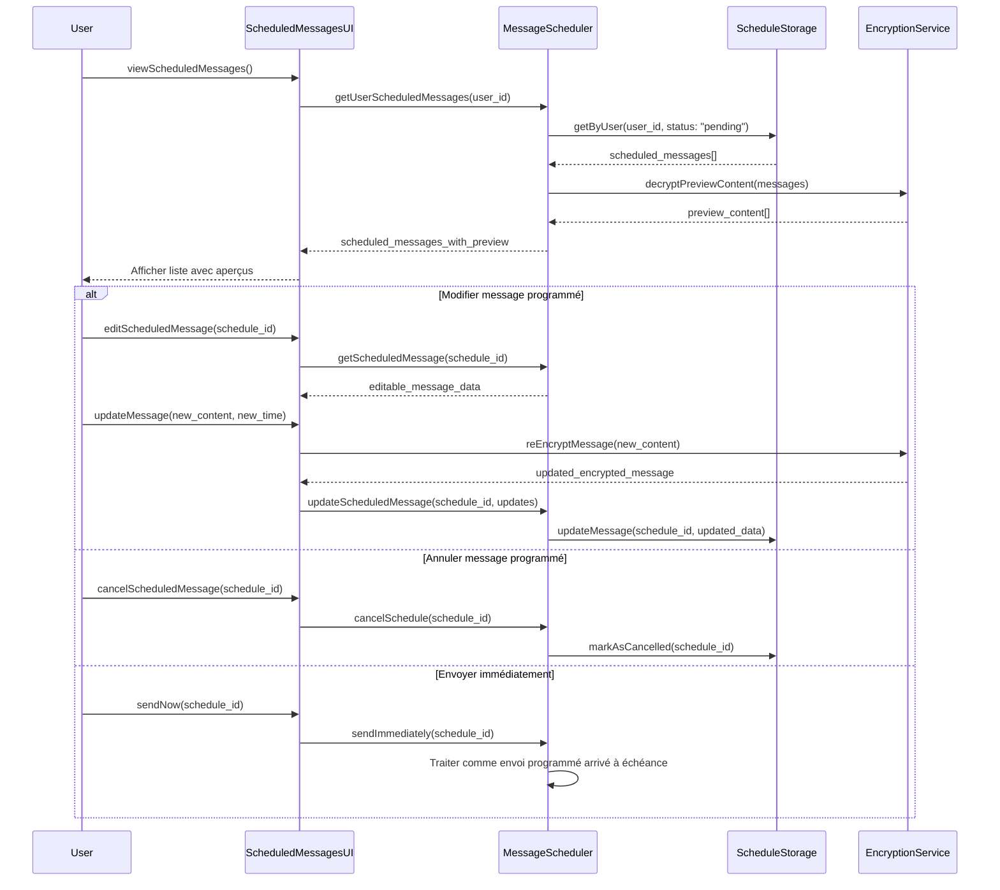
```mermaid
sequenceDiagram
    participant User
    participant ScheduledMessagesUI
    participant MessageScheduler
    participant ScheduleStorage
    participant EncryptionService
    
    User->>ScheduledMessagesUI: viewScheduledMessages()
    ScheduledMessagesUI->>MessageScheduler: getUserScheduledMessages(user_id)
    MessageScheduler->>ScheduleStorage: getByUser(user_id, status: "pending")
    ScheduleStorage-->>MessageScheduler: scheduled_messages[]
    
    MessageScheduler->>EncryptionService: decryptPreviewContent(messages)
    EncryptionService-->>MessageScheduler: preview_content[]
    MessageScheduler-->>ScheduledMessagesUI: scheduled_messages_with_preview
    
    ScheduledMessagesUI-->>User: Afficher liste avec aperçus
    
    alt Modifier message programmé
        User->>ScheduledMessagesUI: editScheduledMessage(schedule_id)
        ScheduledMessagesUI->>MessageScheduler: getScheduledMessage(schedule_id)
        MessageScheduler-->>ScheduledMessagesUI: editable_message_data
        
        User->>ScheduledMessagesUI: updateMessage(new_content, new_time)
        ScheduledMessagesUI->>EncryptionService: reEncryptMessage(new_content)
        EncryptionService-->>ScheduledMessagesUI: updated_encrypted_message
        
        ScheduledMessagesUI->>MessageScheduler: updateScheduledMessage(schedule_id, updates)
        MessageScheduler->>ScheduleStorage: updateMessage(schedule_id, updated_data)
        
    else Annuler message programmé
        User->>ScheduledMessagesUI: cancelScheduledMessage(schedule_id)
        ScheduledMessagesUI->>MessageScheduler: cancelSchedule(schedule_id)
        MessageScheduler->>ScheduleStorage: markAsCancelled(schedule_id)
        
    else Envoyer immédiatement
        User->>ScheduledMessagesUI: sendNow(schedule_id)
        ScheduledMessagesUI->>MessageScheduler: sendImmediately(schedule_id)
        MessageScheduler->>MessageScheduler: Traiter comme envoi programmé arrivé à échéance
    end
```

### 3.4 Règles métier pour la planification

#### Contraintes temporelles
- **Plage d'envoi**: Minimum 1 minute dans le futur, maximum 1 an
- **Précision**: Granularité à la minute près
- **Gestion des fuseaux**: Support des fuseaux horaires avec conversion automatique
- **Heures de silence**: Respect des paramètres "Ne pas déranger" du destinataire

#### Limitations et quotas
- **Messages par utilisateur**: Maximum 50 messages programmés simultanément
- **Fréquence**: Maximum 10 messages programmés par heure par utilisateur
- **Taille**: Mêmes limites que les messages normaux
- **Types supportés**: Texte, médias, mais pas d'autres messages spéciaux

## 4. Messages système

### 4.1 Génération automatique

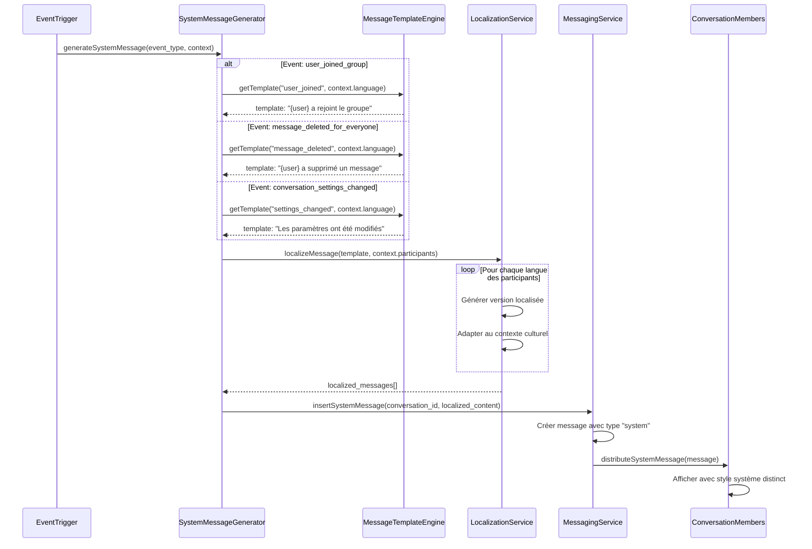
```mermaid
sequenceDiagram
    participant EventTrigger
    participant SystemMessageGenerator
    participant MessageTemplateEngine
    participant LocalizationService
    participant MessagingService
    participant ConversationMembers
    
    EventTrigger->>SystemMessageGenerator: generateSystemMessage(event_type, context)
    
    alt Event: user_joined_group
        SystemMessageGenerator->>MessageTemplateEngine: getTemplate("user_joined", context.language)
        MessageTemplateEngine-->>SystemMessageGenerator: template: "{user} a rejoint le groupe"
        
    else Event: message_deleted_for_everyone
        SystemMessageGenerator->>MessageTemplateEngine: getTemplate("message_deleted", context.language)
        MessageTemplateEngine-->>SystemMessageGenerator: template: "{user} a supprimé un message"
        
    else Event: conversation_settings_changed
        SystemMessageGenerator->>MessageTemplateEngine: getTemplate("settings_changed", context.language)
        MessageTemplateEngine-->>SystemMessageGenerator: template: "Les paramètres ont été modifiés"
    end
    
    SystemMessageGenerator->>LocalizationService: localizeMessage(template, context.participants)
    
    loop Pour chaque langue des participants
        LocalizationService->>LocalizationService: Générer version localisée
        LocalizationService->>LocalizationService: Adapter au contexte culturel
    end
    
    LocalizationService-->>SystemMessageGenerator: localized_messages[]
    
    SystemMessageGenerator->>MessagingService: insertSystemMessage(conversation_id, localized_content)
    MessagingService->>MessagingService: Créer message avec type "system"
    MessagingService->>ConversationMembers: distributeSystemMessage(message)
    
    ConversationMembers->>ConversationMembers: Afficher avec style système distinct
```

### 4.2 Types de messages système


```mermaid
graph TD
    A[Messages Système] --> B[Gestion des Membres]
    A --> C[Modifications de Conversation]
    A --> D[Actions sur Messages]
    A --> E[Événements de Sécurité]
    A --> F[Notifications Temporelles]
    
    B --> B1[Utilisateur rejoint]
    B --> B2[Utilisateur quitte]
    B --> B3[Utilisateur ajouté]
    B --> B4[Utilisateur retiré]
    B --> B5[Changement de rôle]
    
    C --> C1[Nom modifié]
    C --> C2[Description modifiée]
    C --> C3[Photo changée]
    C --> C4[Paramètres mis à jour]
    
    D --> D1[Message supprimé]
    D --> D2[Message épinglé]
    D --> D3[Message désépinglé]
    D --> D4[Message modifié]
    
    E --> E1[Clés de sécurité changées]
    E --> E2[Nouvel appareil détecté]
    E --> E3[Vérification requise]
    
    F --> F1[Début de conversation]
    F --> F2[Messages éphémères activés]
    F --> F3[Archivage automatique]
```

### 4.3 Formatage et affichage contextuel

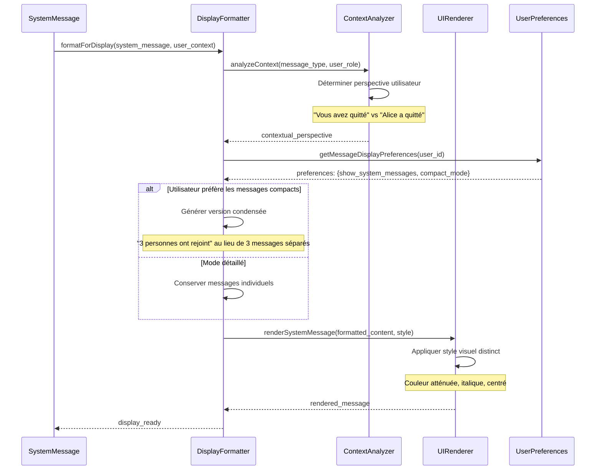
```mermaid
sequenceDiagram
    participant SystemMessage
    participant DisplayFormatter
    participant ContextAnalyzer
    participant UIRenderer
    participant UserPreferences
    
    SystemMessage->>DisplayFormatter: formatForDisplay(system_message, user_context)
    DisplayFormatter->>ContextAnalyzer: analyzeContext(message_type, user_role)
    
    ContextAnalyzer->>ContextAnalyzer: Déterminer perspective utilisateur
    Note over ContextAnalyzer: "Vous avez quitté" vs "Alice a quitté"
    
    ContextAnalyzer-->>DisplayFormatter: contextual_perspective
    
    DisplayFormatter->>UserPreferences: getMessageDisplayPreferences(user_id)
    UserPreferences-->>DisplayFormatter: preferences: {show_system_messages, compact_mode}
    
    alt Utilisateur préfère les messages compacts
        DisplayFormatter->>DisplayFormatter: Générer version condensée
        Note over DisplayFormatter: "3 personnes ont rejoint" au lieu de 3 messages séparés
    else Mode détaillé
        DisplayFormatter->>DisplayFormatter: Conserver messages individuels
    end
    
    DisplayFormatter->>UIRenderer: renderSystemMessage(formatted_content, style)
    UIRenderer->>UIRenderer: Appliquer style visuel distinct
    Note over UIRenderer: Couleur atténuée, italique, centré
    
    UIRenderer-->>DisplayFormatter: rendered_message
    DisplayFormatter-->>SystemMessage: display_ready
```

### 4.4 Configuration et préférences

#### Paramètres utilisateur
- **Visibilité**: Afficher/masquer les messages système par catégorie
- **Groupement**: Condenser les événements similaires
- **Notifications**: Déclencher ou non des notifications pour les messages système
- **Persistance**: Conserver dans l'historique ou affichage temporaire uniquement

#### Types configurables
| Catégorie | Par défaut | Personnalisable |
|-----------|------------|-----------------|
| Membres rejoignent/quittent | Affiché | Oui |
| Modifications de paramètres | Affiché | Oui |
| Actions sur messages | Affiché | Oui |
| Événements de sécurité | Toujours affiché | Non |
| Messages techniques | Masqué | Oui |

## 5. Messages épinglés

### 5.1 Épinglage et gestion

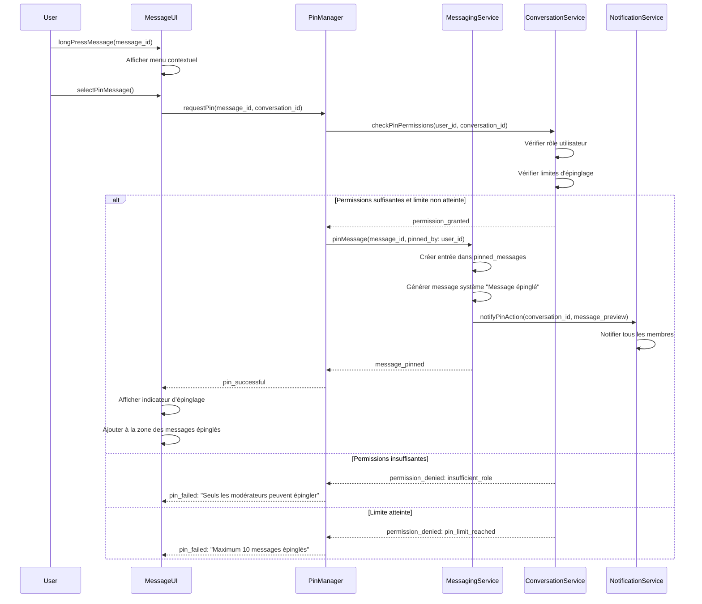
```mermaid
sequenceDiagram
    participant User
    participant MessageUI
    participant PinManager
    participant MessagingService
    participant ConversationService
    participant NotificationService
    
    User->>MessageUI: longPressMessage(message_id)
    MessageUI->>MessageUI: Afficher menu contextuel
    User->>MessageUI: selectPinMessage()
    
    MessageUI->>PinManager: requestPin(message_id, conversation_id)
    PinManager->>ConversationService: checkPinPermissions(user_id, conversation_id)
    
    ConversationService->>ConversationService: Vérifier rôle utilisateur
    ConversationService->>ConversationService: Vérifier limites d'épinglage
    
    alt Permissions suffisantes et limite non atteinte
        ConversationService-->>PinManager: permission_granted
        
        PinManager->>MessagingService: pinMessage(message_id, pinned_by: user_id)
        MessagingService->>MessagingService: Créer entrée dans pinned_messages
        MessagingService->>MessagingService: Générer message système "Message épinglé"
        
        MessagingService->>NotificationService: notifyPinAction(conversation_id, message_preview)
        NotificationService->>NotificationService: Notifier tous les membres
        
        MessagingService-->>PinManager: message_pinned
        PinManager-->>MessageUI: pin_successful
        
        MessageUI->>MessageUI: Afficher indicateur d'épinglage
        MessageUI->>MessageUI: Ajouter à la zone des messages épinglés
        
    else Permissions insuffisantes
        ConversationService-->>PinManager: permission_denied: insufficient_role
        PinManager-->>MessageUI: pin_failed: "Seuls les modérateurs peuvent épingler"
        
    else Limite atteinte
        ConversationService-->>PinManager: permission_denied: pin_limit_reached
        PinManager-->>MessageUI: pin_failed: "Maximum 10 messages épinglés"
    end
```

### 5.2 Interface des messages épinglés

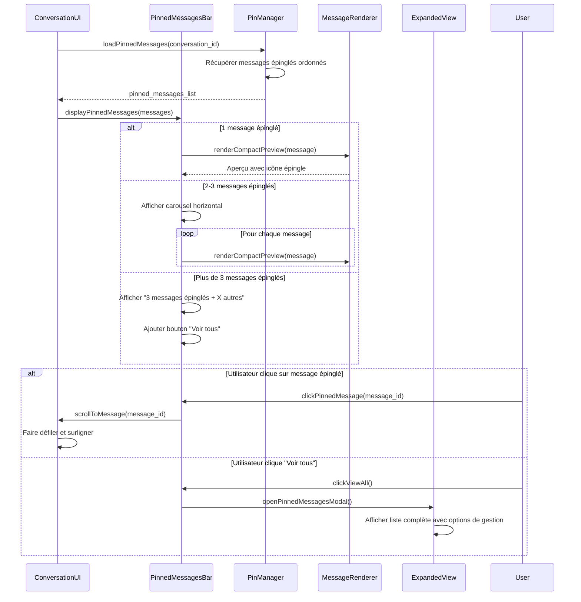
```mermaid
sequenceDiagram
    participant ConversationUI
    participant PinnedMessagesBar
    participant PinManager
    participant MessageRenderer
    participant ExpandedView
    
    ConversationUI->>PinManager: loadPinnedMessages(conversation_id)
    PinManager->>PinManager: Récupérer messages épinglés ordonnés
    PinManager-->>ConversationUI: pinned_messages_list
    
    ConversationUI->>PinnedMessagesBar: displayPinnedMessages(messages)
    
    alt 1 message épinglé
        PinnedMessagesBar->>MessageRenderer: renderCompactPreview(message)
        MessageRenderer-->>PinnedMessagesBar: Aperçu avec icône épingle
        
    else 2-3 messages épinglés
        PinnedMessagesBar->>PinnedMessagesBar: Afficher carousel horizontal
        loop Pour chaque message
            PinnedMessagesBar->>MessageRenderer: renderCompactPreview(message)
        end
        
    else Plus de 3 messages épinglés
        PinnedMessagesBar->>PinnedMessagesBar: Afficher "3 messages épinglés + X autres"
        PinnedMessagesBar->>PinnedMessagesBar: Ajouter bouton "Voir tous"
    end
    
    alt Utilisateur clique sur message épinglé
        User->>PinnedMessagesBar: clickPinnedMessage(message_id)
        PinnedMessagesBar->>ConversationUI: scrollToMessage(message_id)
        ConversationUI->>ConversationUI: Faire défiler et surligner
        
    else Utilisateur clique "Voir tous"
        User->>PinnedMessagesBar: clickViewAll()
        PinnedMessagesBar->>ExpandedView: openPinnedMessagesModal()
        ExpandedView->>ExpandedView: Afficher liste complète avec options de gestion
    end
```

### 5.3 Gestion avancée et organisation

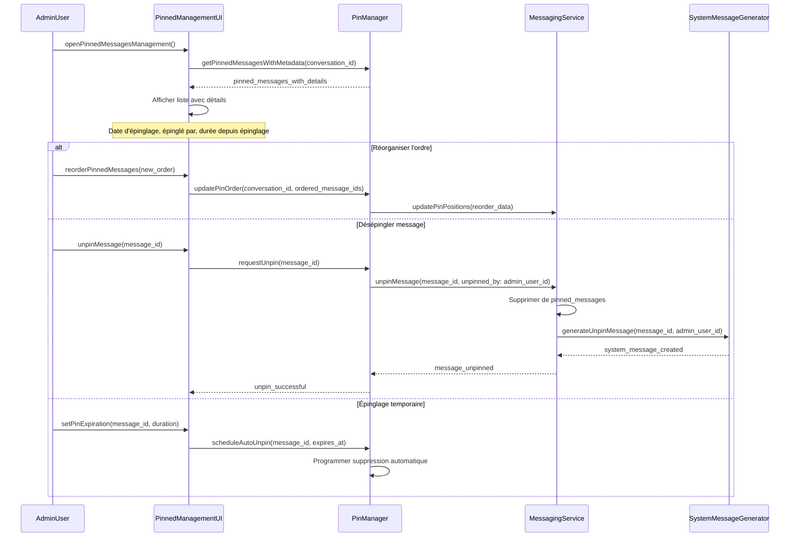
```mermaid
sequenceDiagram
    participant AdminUser
    participant PinnedManagementUI
    participant PinManager
    participant MessagingService
    participant SystemMessageGenerator
    
    AdminUser->>PinnedManagementUI: openPinnedMessagesManagement()
    PinnedManagementUI->>PinManager: getPinnedMessagesWithMetadata(conversation_id)
    PinManager-->>PinnedManagementUI: pinned_messages_with_details
    
    PinnedManagementUI->>PinnedManagementUI: Afficher liste avec détails
    Note over PinnedManagementUI: Date d'épinglage, épinglé par, durée depuis épinglage
    
    alt Réorganiser l'ordre
        AdminUser->>PinnedManagementUI: reorderPinnedMessages(new_order)
        PinnedManagementUI->>PinManager: updatePinOrder(conversation_id, ordered_message_ids)
        PinManager->>MessagingService: updatePinPositions(reorder_data)
        
    else Désépingler message
        AdminUser->>PinnedManagementUI: unpinMessage(message_id)
        PinnedManagementUI->>PinManager: requestUnpin(message_id)
        
        PinManager->>MessagingService: unpinMessage(message_id, unpinned_by: admin_user_id)
        MessagingService->>MessagingService: Supprimer de pinned_messages
        
        MessagingService->>SystemMessageGenerator: generateUnpinMessage(message_id, admin_user_id)
        SystemMessageGenerator-->>MessagingService: system_message_created
        
        MessagingService-->>PinManager: message_unpinned
        PinManager-->>PinnedManagementUI: unpin_successful
        
    else Épinglage temporaire
        AdminUser->>PinnedManagementUI: setPinExpiration(message_id, duration)
        PinnedManagementUI->>PinManager: scheduleAutoUnpin(message_id, expires_at)
        PinManager->>PinManager: Programmer suppression automatique
    end
```

### 5.4 Règles et limitations de l'épinglage

#### Permissions par rôle
- **Administrateurs**: Épingler, désépingler, réorganiser tous les messages
- **Modérateurs**: Épingler, désépingler leurs messages et ceux des membres
- **Membres**: Épingler uniquement leurs propres messages (si autorisé)

#### Contraintes techniques
- **Limite par conversation**: Maximum 10 messages épinglés simultanément
- **Durée d'épinglage**: Option d'expiration automatique (1h à 30j)
- **Types supportés**: Tous types de messages sauf les messages système
- **Priorité d'affichage**: Ordre chronologique inverse (plus récent en premier)

## 6. Système de réactions

### 6.1 Ajout et gestion des réactions

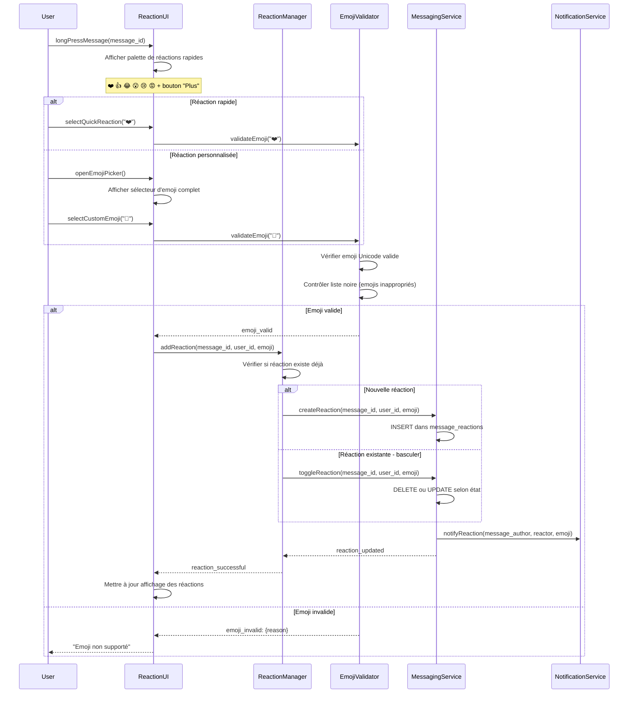
```mermaid
sequenceDiagram
    participant User
    participant ReactionUI
    participant ReactionManager
    participant EmojiValidator
    participant MessagingService
    participant NotificationService
    
    User->>ReactionUI: longPressMessage(message_id)
    ReactionUI->>ReactionUI: Afficher palette de réactions rapides
    Note over ReactionUI: ❤️ 👍 😂 😮 😢 😡 + bouton "Plus"
    
    alt Réaction rapide
        User->>ReactionUI: selectQuickReaction("❤️")
        ReactionUI->>EmojiValidator: validateEmoji("❤️")
        
    else Réaction personnalisée
        User->>ReactionUI: openEmojiPicker()
        ReactionUI->>ReactionUI: Afficher sélecteur d'emoji complet
        User->>ReactionUI: selectCustomEmoji("🎉")
        ReactionUI->>EmojiValidator: validateEmoji("🎉")
    end
    
    EmojiValidator->>EmojiValidator: Vérifier emoji Unicode valide
    EmojiValidator->>EmojiValidator: Contrôler liste noire (emojis inappropriés)
    
    alt Emoji valide
        EmojiValidator-->>ReactionUI: emoji_valid
        ReactionUI->>ReactionManager: addReaction(message_id, user_id, emoji)
        
        ReactionManager->>ReactionManager: Vérifier si réaction existe déjà
        
        alt Nouvelle réaction
            ReactionManager->>MessagingService: createReaction(message_id, user_id, emoji)
            MessagingService->>MessagingService: INSERT dans message_reactions
            
        else Réaction existante - basculer
            ReactionManager->>MessagingService: toggleReaction(message_id, user_id, emoji)
            MessagingService->>MessagingService: DELETE ou UPDATE selon état
        end
        
        MessagingService->>NotificationService: notifyReaction(message_author, reactor, emoji)
        MessagingService-->>ReactionManager: reaction_updated
        ReactionManager-->>ReactionUI: reaction_successful
        
        ReactionUI->>ReactionUI: Mettre à jour affichage des réactions
        
    else Emoji invalide
        EmojiValidator-->>ReactionUI: emoji_invalid: {reason}
        ReactionUI-->>User: "Emoji non supporté"
    end
```

### 6.2 Affichage et agrégation des réactions

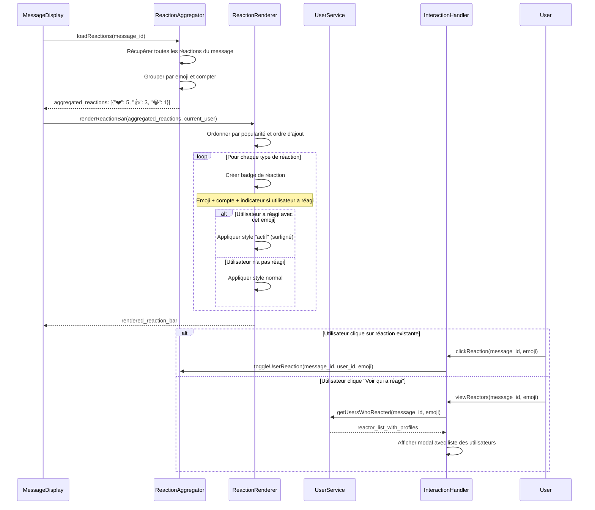
```mermaid
sequenceDiagram
    participant MessageDisplay
    participant ReactionAggregator
    participant ReactionRenderer
    participant UserService
    participant InteractionHandler
    
    MessageDisplay->>ReactionAggregator: loadReactions(message_id)
    ReactionAggregator->>ReactionAggregator: Récupérer toutes les réactions du message
    ReactionAggregator->>ReactionAggregator: Grouper par emoji et compter
    
    ReactionAggregator-->>MessageDisplay: aggregated_reactions: [{"❤️": 5, "👍": 3, "😂": 1}]
    
    MessageDisplay->>ReactionRenderer: renderReactionBar(aggregated_reactions, current_user)
    
    ReactionRenderer->>ReactionRenderer: Ordonner par popularité et ordre d'ajout
    
    loop Pour chaque type de réaction
        ReactionRenderer->>ReactionRenderer: Créer badge de réaction
        Note over ReactionRenderer: Emoji + compte + indicateur si utilisateur a réagi
        
        alt Utilisateur a réagi avec cet emoji
            ReactionRenderer->>ReactionRenderer: Appliquer style "actif" (surligné)
        else Utilisateur n'a pas réagi
            ReactionRenderer->>ReactionRenderer: Appliquer style normal
        end
    end
    
    ReactionRenderer-->>MessageDisplay: rendered_reaction_bar
    
    alt Utilisateur clique sur réaction existante
        User->>InteractionHandler: clickReaction(message_id, emoji)
        InteractionHandler->>ReactionAggregator: toggleUserReaction(message_id, user_id, emoji)
        
    else Utilisateur clique "Voir qui a réagi"
        User->>InteractionHandler: viewReactors(message_id, emoji)
        InteractionHandler->>UserService: getUsersWhoReacted(message_id, emoji)
        UserService-->>InteractionHandler: reactor_list_with_profiles
        InteractionHandler->>InteractionHandler: Afficher modal avec liste des utilisateurs
    end
```

### 6.3 Notifications et feedback

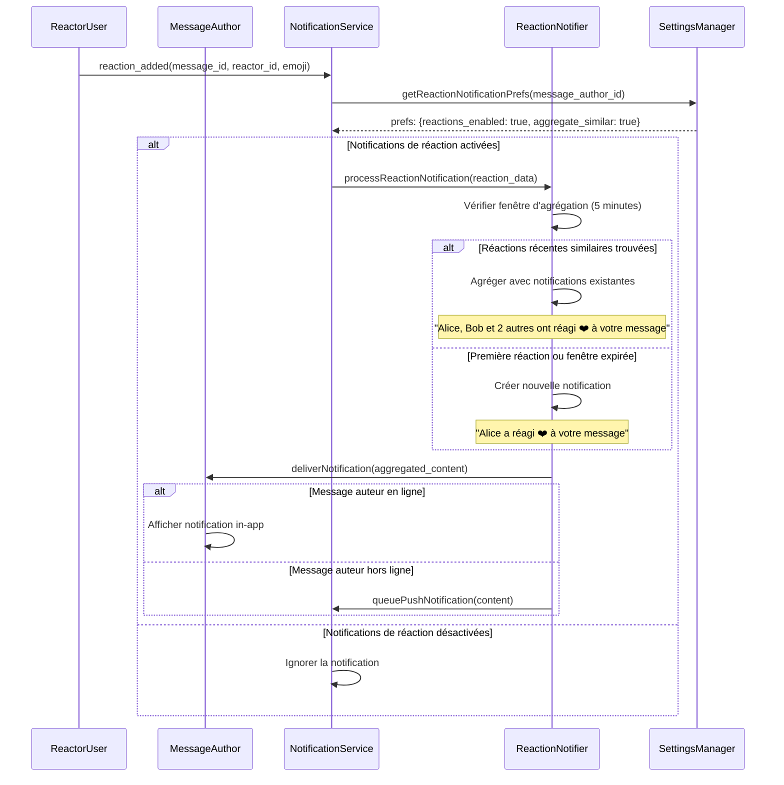
```mermaid
sequenceDiagram
    participant ReactorUser
    participant MessageAuthor
    participant NotificationService
    participant ReactionNotifier
    participant SettingsManager
    
    ReactorUser->>NotificationService: reaction_added(message_id, reactor_id, emoji)
    NotificationService->>SettingsManager: getReactionNotificationPrefs(message_author_id)
    
    SettingsManager-->>NotificationService: prefs: {reactions_enabled: true, aggregate_similar: true}
    
    alt Notifications de réaction activées
        NotificationService->>ReactionNotifier: processReactionNotification(reaction_data)
        
        ReactionNotifier->>ReactionNotifier: Vérifier fenêtre d'agrégation (5 minutes)
        
        alt Réactions récentes similaires trouvées
            ReactionNotifier->>ReactionNotifier: Agréger avec notifications existantes
            Note over ReactionNotifier: "Alice, Bob et 2 autres ont réagi ❤️ à votre message"
            
        else Première réaction ou fenêtre expirée
            ReactionNotifier->>ReactionNotifier: Créer nouvelle notification
            Note over ReactionNotifier: "Alice a réagi ❤️ à votre message"
        end
        
        ReactionNotifier->>MessageAuthor: deliverNotification(aggregated_content)
        
        alt Message auteur en ligne
            MessageAuthor->>MessageAuthor: Afficher notification in-app
        else Message auteur hors ligne
            ReactionNotifier->>NotificationService: queuePushNotification(content)
        end
        
    else Notifications de réaction désactivées
        NotificationService->>NotificationService: Ignorer la notification
    end
```

### 6.4 Configuration et personnalisation

#### Paramètres utilisateur
| Paramètre | Options | Défaut |
|-----------|---------|--------|
| Notifications de réactions | Activées/Désactivées/Agrégées | Agrégées |
| Réactions rapides | Liste personnalisable | ❤️👍😂😮😢😡 |
| Affichage des réacteurs | Toujours/Sur demande/Jamais | Sur demande |
| Emojis suggérés | Basés sur l'usage/Standards/Personnalisés | Basés sur l'usage |

#### Limites et restrictions
- **Maximum de réactions par message**: 50 réactions uniques
- **Maximum de réactions par utilisateur par message**: 5 emojis différents
- **Emojis supportés**: Unicode standard uniquement
- **Liste noire**: Emojis inappropriés ou offensants filtrés automatiquement

## 7. Synchronisation multi-appareils

### 7.1 Cohérence des états spéciaux

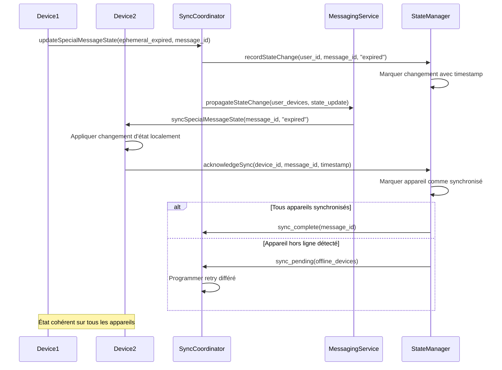
```mermaid
sequenceDiagram
    participant Device1
    participant Device2
    participant SyncCoordinator
    participant MessagingService
    participant StateManager
    
    Device1->>SyncCoordinator: updateSpecialMessageState(ephemeral_expired, message_id)
    SyncCoordinator->>StateManager: recordStateChange(user_id, message_id, "expired")
    StateManager->>StateManager: Marquer changement avec timestamp
    
    SyncCoordinator->>MessagingService: propagateStateChange(user_devices, state_update)
    MessagingService->>Device2: syncSpecialMessageState(message_id, "expired")
    
    Device2->>Device2: Appliquer changement d'état localement
    Device2->>StateManager: acknowledgeSync(device_id, message_id, timestamp)
    
    StateManager->>StateManager: Marquer appareil comme synchronisé
    
    alt Tous appareils synchronisés
        StateManager->>SyncCoordinator: sync_complete(message_id)
    else Appareil hors ligne détecté
        StateManager->>SyncCoordinator: sync_pending(offline_devices)
        SyncCoordinator->>SyncCoordinator: Programmer retry différé
    end
    
    Note over Device1,Device2: État cohérent sur tous les appareils
```

### 7.2 Réconciliation après reconnexion

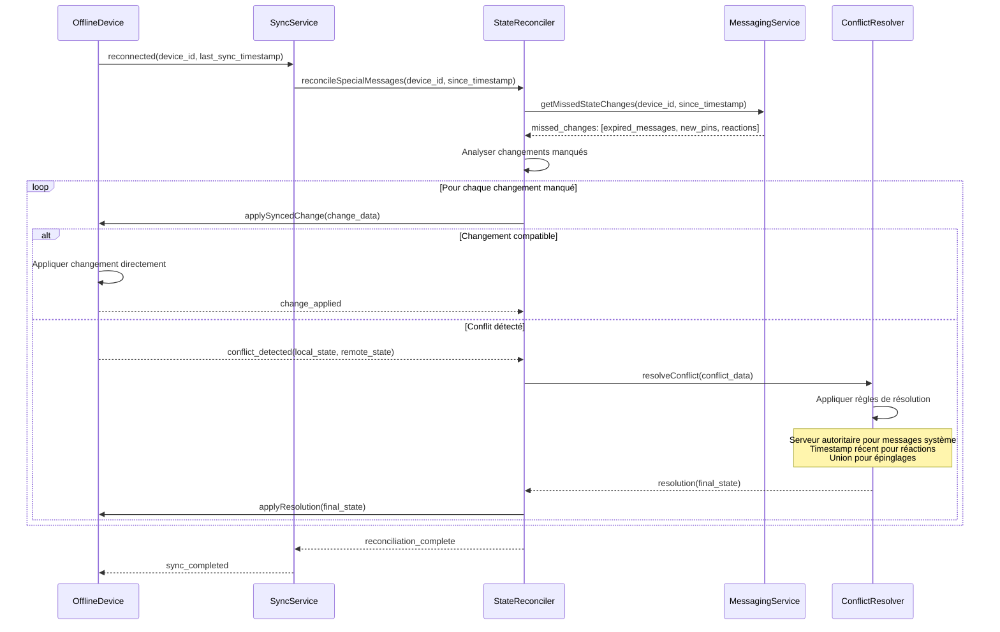
```mermaid
sequenceDiagram
    participant OfflineDevice
    participant SyncService
    participant StateReconciler
    participant MessagingService
    participant ConflictResolver
    
    OfflineDevice->>SyncService: reconnected(device_id, last_sync_timestamp)
    SyncService->>StateReconciler: reconcileSpecialMessages(device_id, since_timestamp)
    
    StateReconciler->>MessagingService: getMissedStateChanges(device_id, since_timestamp)
    MessagingService-->>StateReconciler: missed_changes: [expired_messages, new_pins, reactions]
    
    StateReconciler->>StateReconciler: Analyser changements manqués
    
    loop Pour chaque changement manqué
        StateReconciler->>OfflineDevice: applySyncedChange(change_data)
        
        alt Changement compatible
            OfflineDevice->>OfflineDevice: Appliquer changement directement
            OfflineDevice-->>StateReconciler: change_applied
            
        else Conflit détecté
            OfflineDevice-->>StateReconciler: conflict_detected(local_state, remote_state)
            StateReconciler->>ConflictResolver: resolveConflict(conflict_data)
            
            ConflictResolver->>ConflictResolver: Appliquer règles de résolution
            Note over ConflictResolver: Serveur autoritaire pour messages système<br/>Timestamp récent pour réactions<br/>Union pour épinglages
            
            ConflictResolver-->>StateReconciler: resolution(final_state)
            StateReconciler->>OfflineDevice: applyResolution(final_state)
        end
    end
    
    StateReconciler-->>SyncService: reconciliation_complete
    SyncService-->>OfflineDevice: sync_completed
```

## 8. Intégration avec les autres services

### 8.1 Interface avec User Service

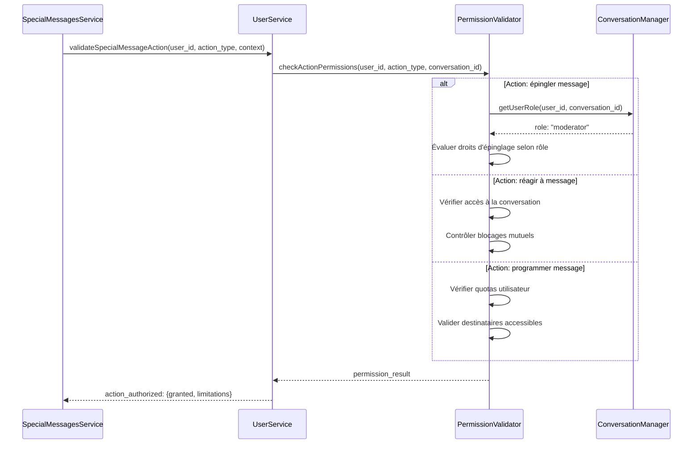
```mermaid
sequenceDiagram
    participant SpecialMessagesService
    participant UserService
    participant PermissionValidator
    participant ConversationManager
    
    SpecialMessagesService->>UserService: validateSpecialMessageAction(user_id, action_type, context)
    UserService->>PermissionValidator: checkActionPermissions(user_id, action_type, conversation_id)
    
    alt Action: épingler message
        PermissionValidator->>ConversationManager: getUserRole(user_id, conversation_id)
        ConversationManager-->>PermissionValidator: role: "moderator"
        PermissionValidator->>PermissionValidator: Évaluer droits d'épinglage selon rôle
        
    else Action: réagir à message
        PermissionValidator->>PermissionValidator: Vérifier accès à la conversation
        PermissionValidator->>PermissionValidator: Contrôler blocages mutuels
        
    else Action: programmer message
        PermissionValidator->>PermissionValidator: Vérifier quotas utilisateur
        PermissionValidator->>PermissionValidator: Valider destinataires accessibles
    end
    
    PermissionValidator-->>UserService: permission_result
    UserService-->>SpecialMessagesService: action_authorized: {granted, limitations}
```

### 8.2 Interface avec Notification Service

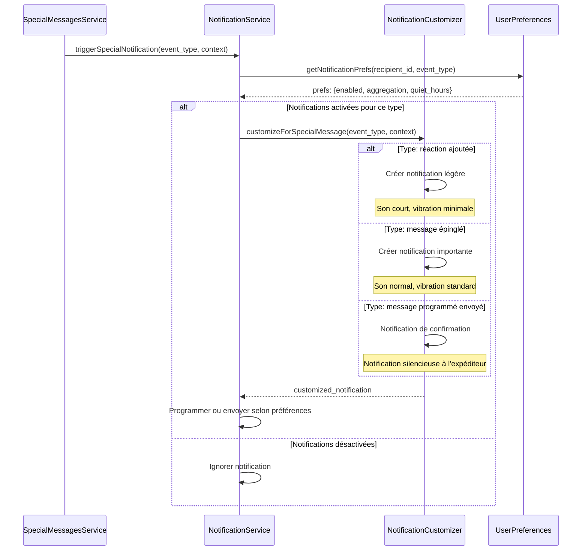
```mermaid
sequenceDiagram
    participant SpecialMessagesService
    participant NotificationService
    participant NotificationCustomizer
    participant UserPreferences
    
    SpecialMessagesService->>NotificationService: triggerSpecialNotification(event_type, context)
    NotificationService->>UserPreferences: getNotificationPrefs(recipient_id, event_type)
    
    UserPreferences-->>NotificationService: prefs: {enabled, aggregation, quiet_hours}
    
    alt Notifications activées pour ce type
        NotificationService->>NotificationCustomizer: customizeForSpecialMessage(event_type, context)
        
        alt Type: réaction ajoutée
            NotificationCustomizer->>NotificationCustomizer: Créer notification légère
            Note over NotificationCustomizer: Son court, vibration minimale
            
        else Type: message épinglé
            NotificationCustomizer->>NotificationCustomizer: Créer notification importante
            Note over NotificationCustomizer: Son normal, vibration standard
            
        else Type: message programmé envoyé
            NotificationCustomizer->>NotificationCustomizer: Notification de confirmation
            Note over NotificationCustomizer: Notification silencieuse à l'expéditeur
        end
        
        NotificationCustomizer-->>NotificationService: customized_notification
        NotificationService->>NotificationService: Programmer ou envoyer selon préférences
        
    else Notifications désactivées
        NotificationService->>NotificationService: Ignorer notification
    end
```

## 9. Considérations techniques

### 9.1 Architecture de données

#### Tables spécialisées
```sql
-- Messages éphémères
CREATE TABLE ephemeral_messages (
    message_id UUID PRIMARY KEY REFERENCES messages(id) ON DELETE CASCADE,
    expires_at TIMESTAMP NOT NULL,
    ttl_seconds INTEGER NOT NULL,
    created_at TIMESTAMP NOT NULL DEFAULT NOW()
);

-- Messages programmés
CREATE TABLE scheduled_messages (
    id UUID PRIMARY KEY DEFAULT uuid_generate_v4(),
    conversation_id UUID NOT NULL,
    sender_id UUID NOT NULL,
    content BYTEA NOT NULL, -- Contenu chiffré
    metadata JSONB NOT NULL DEFAULT '{}',
    scheduled_for TIMESTAMP NOT NULL,
    status VARCHAR(20) NOT NULL DEFAULT 'pending',
    sent_message_id UUID REFERENCES messages(id),
    created_at TIMESTAMP NOT NULL DEFAULT NOW(),
    updated_at TIMESTAMP NOT NULL DEFAULT NOW()
);

-- Messages épinglés
CREATE TABLE pinned_messages (
    id UUID PRIMARY KEY DEFAULT uuid_generate_v4(),
    conversation_id UUID NOT NULL,
    message_id UUID NOT NULL REFERENCES messages(id) ON DELETE CASCADE,
    pinned_by UUID NOT NULL,
    pinned_at TIMESTAMP NOT NULL DEFAULT NOW(),
    expires_at TIMESTAMP,
    position INTEGER NOT NULL DEFAULT 0,
    UNIQUE(conversation_id, message_id)
);

-- Réactions
CREATE TABLE message_reactions (
    id UUID PRIMARY KEY DEFAULT uuid_generate_v4(),
    message_id UUID NOT NULL REFERENCES messages(id) ON DELETE CASCADE,
    user_id UUID NOT NULL,
    reaction VARCHAR(10) NOT NULL, -- Emoji Unicode
    created_at TIMESTAMP NOT NULL DEFAULT NOW(),
    UNIQUE(message_id, user_id, reaction)
);
```

#### Index et optimisations
```sql
-- Optimisations pour nettoyage des éphémères
CREATE INDEX idx_ephemeral_messages_expires_at ON ephemeral_messages(expires_at);

-- Optimisations pour scheduler
CREATE INDEX idx_scheduled_messages_execution ON scheduled_messages(scheduled_for, status) 
WHERE status = 'pending';

-- Optimisations pour affichage des épinglés
CREATE INDEX idx_pinned_messages_conversation ON pinned_messages(conversation_id, position);

-- Optimisations pour agrégation des réactions
CREATE INDEX idx_message_reactions_aggregation ON message_reactions(message_id, reaction);
```

### 9.2 Workers et tâches de fond

#### Scheduler de messages programmés
```elixir
defmodule WhisprMessaging.ScheduledMessageWorker do
  use GenServer
  
  def init(_) do
    schedule_next_check()
    {:ok, %{}}
  end
  
  def handle_info(:check_scheduled_messages, state) do
    process_due_messages()
    schedule_next_check()
    {:noreply, state}
  end
  
  defp process_due_messages do
    now = DateTime.utc_now()
    
    ScheduledMessage.get_due_messages(now)
    |> Enum.each(&send_scheduled_message/1)
  end
  
  defp schedule_next_check do
    Process.send_after(self(), :check_scheduled_messages, 60_000) # 1 minute
  end
end
```

#### Nettoyeur de messages éphémères
```elixir
defmodule WhisprMessaging.EphemeralCleanupWorker do
  use GenServer
  
  def handle_info(:cleanup_expired, state) do
    cleanup_expired_messages()
    schedule_next_cleanup()
    {:noreply, state}
  end
  
  defp cleanup_expired_messages do
    now = DateTime.utc_now()
    
    EphemeralMessage.get_expired_messages(now)
    |> Enum.each(&delete_ephemeral_message/1)
  end
  
  defp delete_ephemeral_message(message) do
    # Supprimer de tous les appareils via PubSub
    Phoenix.PubSub.broadcast(
      WhisprMessaging.PubSub,
      "conversation:#{message.conversation_id}",
      {:message_expired, message.id}
    )
    
    # Marquer comme expiré en base
    Messages.mark_as_expired(message.id)
  end
end
```

### 9.3 Cache et performance

#### Stratégies de mise en cache
- **Réactions agrégées**: Cache Redis avec TTL de 5 minutes
- **Messages épinglés**: Cache par conversation avec invalidation sur changement
- **Préférences utilisateur**: Cache local avec synchronisation périodique
- **Templates de messages système**: Cache permanent avec invalidation manuelle

## 10. Endpoints API

| Endpoint | Méthode | Description | Paramètres |
|----------|---------|-------------|------------|
| `/api/v1/messages/{id}/ephemeral` | POST | Créer message éphémère | `ttl_seconds` |
| `/api/v1/messages/scheduled` | POST | Programmer un message | `scheduled_for`, `content` |
| `/api/v1/messages/scheduled` | GET | Lister messages programmés | `status`, `limit` |
| `/api/v1/messages/scheduled/{id}` | PUT | Modifier message programmé | Corps avec modifications |
| `/api/v1/messages/scheduled/{id}` | DELETE | Annuler message programmé | - |
| `/api/v1/messages/{id}/pin` | POST | Épingler un message | `expires_at` (optionnel) |
| `/api/v1/messages/{id}/pin` | DELETE | Désépingler un message | - |
| `/api/v1/conversations/{id}/pins` | GET | Messages épinglés | `limit`, `offset` |
| `/api/v1/messages/{id}/reactions` | POST | Ajouter réaction | `reaction` (emoji) |
| `/api/v1/messages/{id}/reactions/{reaction}` | DELETE | Retirer réaction | - |
| `/api/v1/messages/{id}/reactions` | GET | Lister réactions | - |

## 11. Tests et validation

### 11.1 Tests fonctionnels
- **Messages éphémères**: Vérification de l'expiration sur tous les appareils
- **Planification**: Tests avec différents fuseaux horaires et cas limites
- **Épinglage**: Validation des permissions et limites
- **Réactions**: Tests d'agrégation et de notification

### 11.2 Tests de performance
- **Nettoyage des éphémères**: Performance du worker de suppression
- **Scheduler**: Précision et charge du système de planification
- **Synchronisation**: Latence de propagation des états spéciaux
- **Réactions**: Performance des requêtes d'agrégation

### 11.3 Tests d'intégration
- **Multi-appareils**: Cohérence des états entre appareils
- **Services externes**: Intégration avec user-service et notification-service
- **Récupération après panne**: Comportement après indisponibilité temporaire

## 12. Livrables

1. **Module de messages spéciaux Elixir** comprenant :
   - Gestion complète des messages éphémères avec expiration
   - Système de planification de messages robuste
   - Génération automatique de messages système
   - Infrastructure d'épinglage avec permissions
   - Système de réactions avec agrégation

2. **Interface utilisateur spécialisée** pour :
   - Sélection intuitive des durées éphémères
   - Interface de planification avec fuseaux horaires
   - Gestion visuelle des messages épinglés
   - Palette de réactions rapides et personnalisées
   - Indicateurs visuels pour tous types spéciaux

3. **Workers et services de fond** :
   - Nettoyage automatique des messages expirés
   - Scheduler précis pour messages programmés
   - Synchronisation multi-appareils robuste
   - Agrégation en temps réel des réactions

4. **Documentation complète** :
   - Guide d'utilisation pour chaque type de message
   - Documentation technique d'intégration
   - Procédures opérationnelles et monitoring
   - Métriques et alertes recommandées