# Spécification Fonctionnelle - Synchronisation Multi-appareils

## 1. Vue d'ensemble

### 1.1 Objectif

Cette spécification détaille les mécanismes de synchronisation multi-appareils de l'application Whispr, permettant aux utilisateurs d'accéder de manière cohérente à leurs conversations depuis différents appareils (mobile, tablette, desktop). Elle couvre la distribution des messages, la synchronisation des statuts, la gestion des conflits et la récupération d'historique, tout en maintenant le chiffrement bout-en-bout et les performances optimales.

### 1.2 Principes clés

- **Cohérence des données**: État identique sur tous les appareils actifs d'un utilisateur
- **Synchronisation temps réel**: Propagation immédiate des changements aux appareils connectés
- **Résolution déterministe des conflits**: Règles claires pour résoudre les états divergents
- **Récupération fiable**: Restauration complète de l'état après déconnexion
- **Performance optimisée**: Minimisation de la bande passante et de la latence
- **Sécurité maintenue**: Préservation du chiffrement E2E durant la synchronisation
- **Dégradation gracieuse**: Fonctionnement optimal même avec connectivité limitée

### 1.3 Architecture de synchronisation

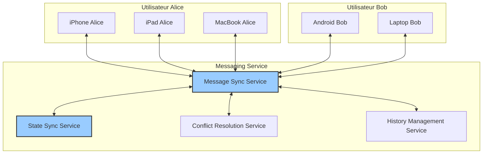
```mermaid
graph TB
    subgraph "Utilisateur Alice"
        A1[iPhone Alice]
        A2[iPad Alice]
        A3[MacBook Alice]
    end
    
    subgraph "Messaging Service"
        MS[Message Sync Service]
        SSS[State Sync Service]
        CRS[Conflict Resolution Service]
        HMS[History Management Service]
    end
    
    subgraph "Utilisateur Bob"
        B1[Android Bob]
        B2[Laptop Bob]
    end
    
    A1 <--> MS
    A2 <--> MS
    A3 <--> MS
    
    MS <--> SSS
    MS <--> CRS
    MS <--> HMS
    
    B1 <--> MS
    B2 <--> MS
    
    style MS fill:#9cf,stroke:#333,stroke-width:2px
    style SSS fill:#9cf,stroke:#333,stroke-width:2px
```

### 1.4 Types de données synchronisées

| Catégorie | Données | Fréquence | Priorité | Méthode |
|-----------|---------|-----------|----------|---------|
| **Messages** | Contenu, métadonnées, pièces jointes | Temps réel | Critique | Push immédiat |
| **Statuts de lecture** | Messages lus, timestamps | Temps réel | Élevée | Push groupé |
| **États de conversation** | Épinglage, archivage, sourdine | Temps réel | Moyenne | Push différé |
| **Présence** | Statut en ligne, dernière vue | Périodique | Faible | Pull/Push adaptatif |
| **Paramètres** | Préférences, confidentialité | Occasionnel | Moyenne | Push lors changement |
| **Historique** | Messages anciens, recherche | À la demande | Variable | Pull avec pagination |

### 1.5 Composants fonctionnels

Le système de synchronisation comprend huit processus principaux :
1. **Distribution des messages**: Livraison temps réel aux appareils connectés
2. **Synchronisation des états**: Cohérence des statuts et métadonnées
3. **Gestion des conflits**: Résolution des divergences entre appareils
4. **Récupération d'historique**: Restauration après déconnexion
5. **Optimisation de bande passante**: Compression et priorisation des données
6. **Coordination des sessions**: Gestion des appareils actifs/inactifs
7. **Sécurité distribuée**: Maintien du chiffrement E2E
8. **Monitoring et diagnostics**: Suivi de la santé de la synchronisation

## 2. Distribution des messages en temps réel

### 2.1 Mécanisme de distribution multi-appareils

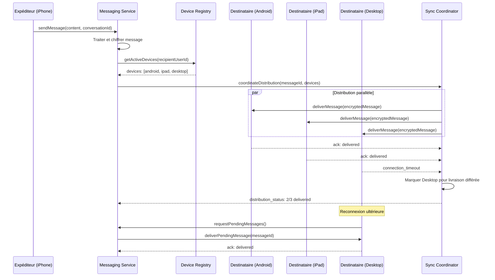
```mermaid
sequenceDiagram
    participant Sender as Expéditeur (iPhone)
    participant MS as Messaging Service
    participant DeviceRegistry as Device Registry
    participant Recipient1 as Destinataire (Android)
    participant Recipient2 as Destinataire (iPad)
    participant Recipient3 as Destinataire (Desktop)
    participant SyncCoordinator as Sync Coordinator
    
    Sender->>MS: sendMessage(content, conversationId)
    MS->>MS: Traiter et chiffrer message
    
    MS->>DeviceRegistry: getActiveDevices(recipientUserId)
    DeviceRegistry-->>MS: devices: [android, ipad, desktop]
    
    MS->>SyncCoordinator: coordinateDistribution(messageId, devices)
    
    par Distribution parallèle
        SyncCoordinator->>Recipient1: deliverMessage(encryptedMessage)
        SyncCoordinator->>Recipient2: deliverMessage(encryptedMessage)
        SyncCoordinator->>Recipient3: deliverMessage(encryptedMessage)
    end
    
    Recipient1-->>SyncCoordinator: ack: delivered
    Recipient2-->>SyncCoordinator: ack: delivered
    Recipient3-->>SyncCoordinator: connection_timeout
    
    SyncCoordinator->>SyncCoordinator: Marquer Desktop pour livraison différée
    SyncCoordinator-->>MS: distribution_status: 2/3 delivered
    
    Note over Recipient3: Reconnexion ultérieure
    Recipient3->>MS: requestPendingMessages()
    MS->>Recipient3: deliverPendingMessage(messageId)
    Recipient3-->>MS: ack: delivered
```

### 2.2 Gestion des sessions d'appareil

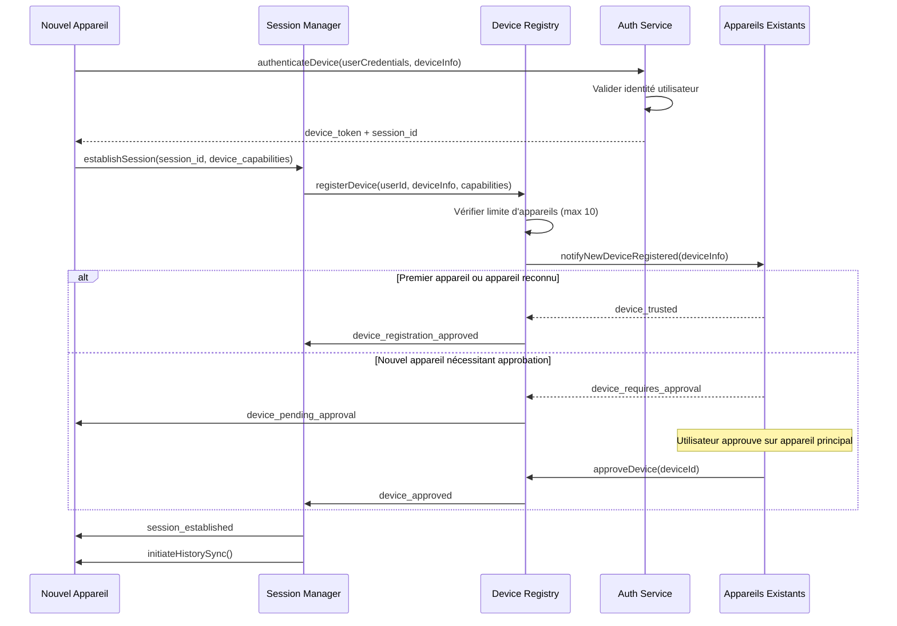
```mermaid
sequenceDiagram
    participant Device as Nouvel Appareil
    participant SessionManager as Session Manager
    participant DeviceRegistry as Device Registry
    participant AuthService as Auth Service
    participant ExistingDevices as Appareils Existants
    
    Device->>AuthService: authenticateDevice(userCredentials, deviceInfo)
    AuthService->>AuthService: Valider identité utilisateur
    AuthService-->>Device: device_token + session_id
    
    Device->>SessionManager: establishSession(session_id, device_capabilities)
    SessionManager->>DeviceRegistry: registerDevice(userId, deviceInfo, capabilities)
    
    DeviceRegistry->>DeviceRegistry: Vérifier limite d'appareils (max 10)
    DeviceRegistry->>ExistingDevices: notifyNewDeviceRegistered(deviceInfo)
    
    alt Premier appareil ou appareil reconnu
        ExistingDevices-->>DeviceRegistry: device_trusted
        DeviceRegistry->>SessionManager: device_registration_approved
        
    else Nouvel appareil nécessitant approbation
        ExistingDevices-->>DeviceRegistry: device_requires_approval
        DeviceRegistry->>Device: device_pending_approval
        
        Note over ExistingDevices: Utilisateur approuve sur appareil principal
        ExistingDevices->>DeviceRegistry: approveDevice(deviceId)
        DeviceRegistry->>SessionManager: device_approved
    end
    
    SessionManager->>Device: session_established
    SessionManager->>Device: initiateHistorySync()
```

### 2.3 Priorisation et optimisation de la distribution

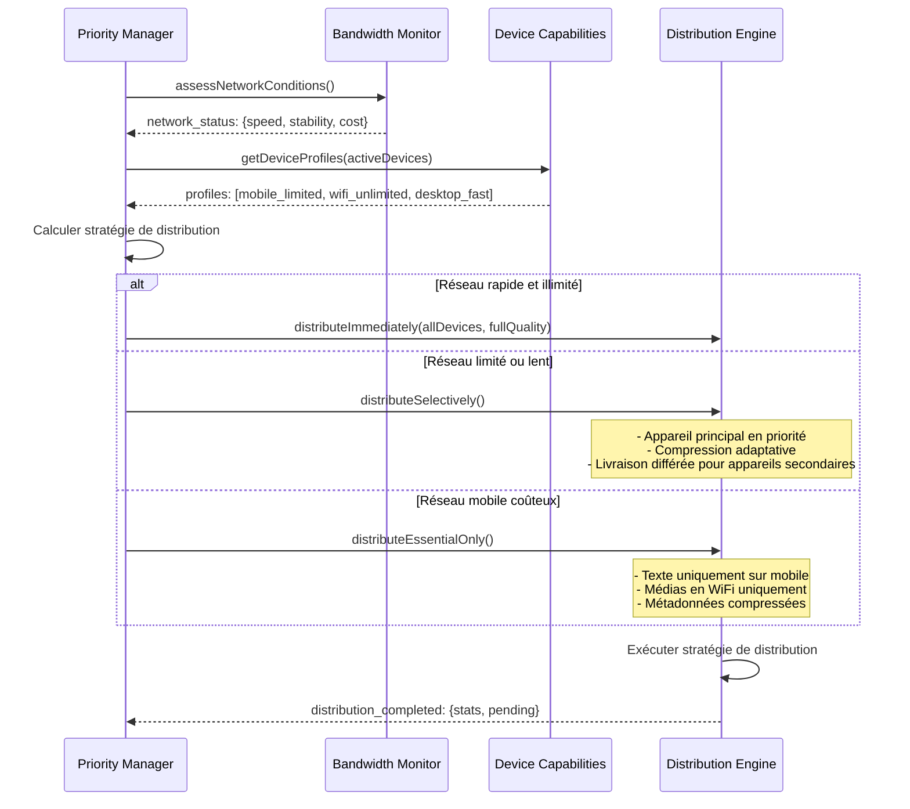
```mermaid
sequenceDiagram
    participant PriorityManager as Priority Manager
    participant BandwidthMonitor as Bandwidth Monitor
    participant DeviceCapabilities as Device Capabilities
    participant DistributionEngine as Distribution Engine
    
    PriorityManager->>BandwidthMonitor: assessNetworkConditions()
    BandwidthMonitor-->>PriorityManager: network_status: {speed, stability, cost}
    
    PriorityManager->>DeviceCapabilities: getDeviceProfiles(activeDevices)
    DeviceCapabilities-->>PriorityManager: profiles: [mobile_limited, wifi_unlimited, desktop_fast]
    
    PriorityManager->>PriorityManager: Calculer stratégie de distribution
    
    alt Réseau rapide et illimité
        PriorityManager->>DistributionEngine: distributeImmediately(allDevices, fullQuality)
        
    else Réseau limité ou lent
        PriorityManager->>DistributionEngine: distributeSelectively()
        Note over DistributionEngine: - Appareil principal en priorité<br/>- Compression adaptative<br/>- Livraison différée pour appareils secondaires
        
    else Réseau mobile coûteux
        PriorityManager->>DistributionEngine: distributeEssentialOnly()
        Note over DistributionEngine: - Texte uniquement sur mobile<br/>- Médias en WiFi uniquement<br/>- Métadonnées compressées
    end
    
    DistributionEngine->>DistributionEngine: Exécuter stratégie de distribution
    DistributionEngine-->>PriorityManager: distribution_completed: {stats, pending}
```

## 3. Synchronisation des états et statuts

### 3.1 Synchronisation des statuts de lecture

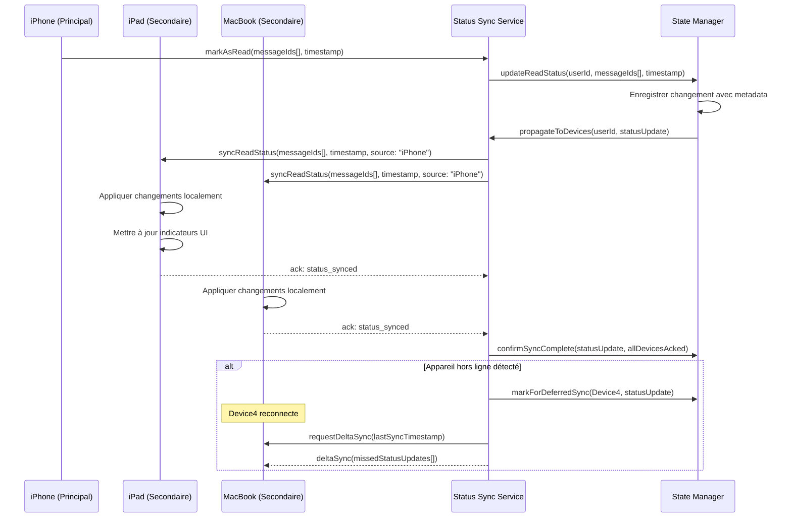
```mermaid
sequenceDiagram
    participant Device1 as iPhone (Principal)
    participant Device2 as iPad (Secondaire)
    participant Device3 as MacBook (Secondaire)
    participant StatusSync as Status Sync Service
    participant StateManager as State Manager
    
    Device1->>StatusSync: markAsRead(messageIds[], timestamp)
    StatusSync->>StateManager: updateReadStatus(userId, messageIds[], timestamp)
    
    StateManager->>StateManager: Enregistrer changement avec metadata
    StateManager->>StatusSync: propagateToDevices(userId, statusUpdate)
    
    StatusSync->>Device2: syncReadStatus(messageIds[], timestamp, source: "iPhone")
    StatusSync->>Device3: syncReadStatus(messageIds[], timestamp, source: "iPhone")
    
    Device2->>Device2: Appliquer changements localement
    Device2->>Device2: Mettre à jour indicateurs UI
    Device2-->>StatusSync: ack: status_synced
    
    Device3->>Device3: Appliquer changements localement
    Device3-->>StatusSync: ack: status_synced
    
    StatusSync->>StateManager: confirmSyncComplete(statusUpdate, allDevicesAcked)
    
    alt Appareil hors ligne détecté
        StatusSync->>StateManager: markForDeferredSync(Device4, statusUpdate)
        
        Note over Device3: Device4 reconnecte
        StatusSync->>Device3: requestDeltaSync(lastSyncTimestamp)
        StatusSync-->>Device3: deltaSync(missedStatusUpdates[])
    end
```

### 3.2 Synchronisation des états de conversation

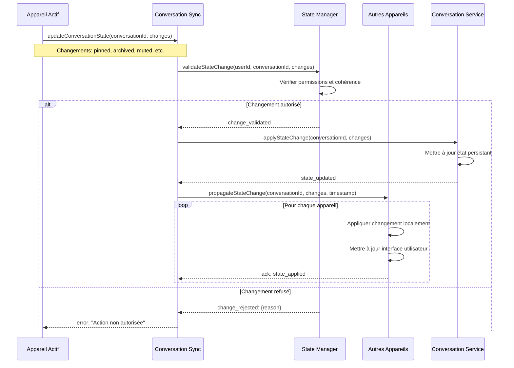
```mermaid
sequenceDiagram
    participant Device as Appareil Actif
    participant ConversationSync as Conversation Sync
    participant StateManager as State Manager
    participant OtherDevices as Autres Appareils
    participant ConversationService as Conversation Service
    
    Device->>ConversationSync: updateConversationState(conversationId, changes)
    Note over Device,ConversationSync: Changements: pinned, archived, muted, etc.
    
    ConversationSync->>StateManager: validateStateChange(userId, conversationId, changes)
    StateManager->>StateManager: Vérifier permissions et cohérence
    
    alt Changement autorisé
        StateManager-->>ConversationSync: change_validated
        ConversationSync->>ConversationService: applyStateChange(conversationId, changes)
        
        ConversationService->>ConversationService: Mettre à jour état persistant
        ConversationService-->>ConversationSync: state_updated
        
        ConversationSync->>OtherDevices: propagateStateChange(conversationId, changes, timestamp)
        
        loop Pour chaque appareil
            OtherDevices->>OtherDevices: Appliquer changement localement
            OtherDevices->>OtherDevices: Mettre à jour interface utilisateur
            OtherDevices-->>ConversationSync: ack: state_applied
        end
        
    else Changement refusé
        StateManager-->>ConversationSync: change_rejected: {reason}
        ConversationSync-->>Device: error: "Action non autorisée"
    end
```

### 3.3 Synchronisation des paramètres utilisateur

```mermaid
sequenceDiagram
    participant SettingsUI as Interface Paramètres
    participant SettingsSync as Settings Sync
    parameter SettingsManager as Settings Manager
    participant DeviceCoordinator as Device Coordinator
    participant AllDevices as Tous les Appareils
    
    SettingsUI->>SettingsSync: updateUserSettings(settingsCategory, newValues)
    SettingsSync->>SettingsManager: validateSettings(userId, settingsData)
    
    SettingsManager->>SettingsManager: Valider format et contraintes
    SettingsManager->>SettingsManager: Détecter changements significatifs
    
    alt Paramètres valides
        SettingsManager-->>SettingsSync: settings_validated
        SettingsSync->>SettingsManager: persistSettings(userId, newSettings)
        
        SettingsSync->>DeviceCoordinator: coordinateSettingsSync(userId, changedSettings)
        
        DeviceCoordinator->>DeviceCoordinator: Identifier appareils nécessitant sync
        DeviceCoordinator->>AllDevices: syncSettings(settingsCategory, newValues, priority)
        
        alt Paramètre critique (sécurité, confidentialité)
            AllDevices->>AllDevices: Appliquer immédiatement
            AllDevices->>AllDevices: Redémarrer composants concernés
            
        else Paramètre non critique (thème, notifications)
            AllDevices->>AllDevices: Appliquer au prochain démarrage
            AllDevices->>AllDevices: Marquer pour application différée
        end
        
        AllDevices-->>DeviceCoordinator: settings_applied
        DeviceCoordinator-->>SettingsSync: sync_completed
        
    else Paramètres invalides
        SettingsManager-->>SettingsSync: settings_invalid: {errors}
        SettingsSync-->>SettingsUI: validation_failed: {errorDetails}
    end
```

## 4. Gestion des conflits

### 4.1 Détection et classification des conflits

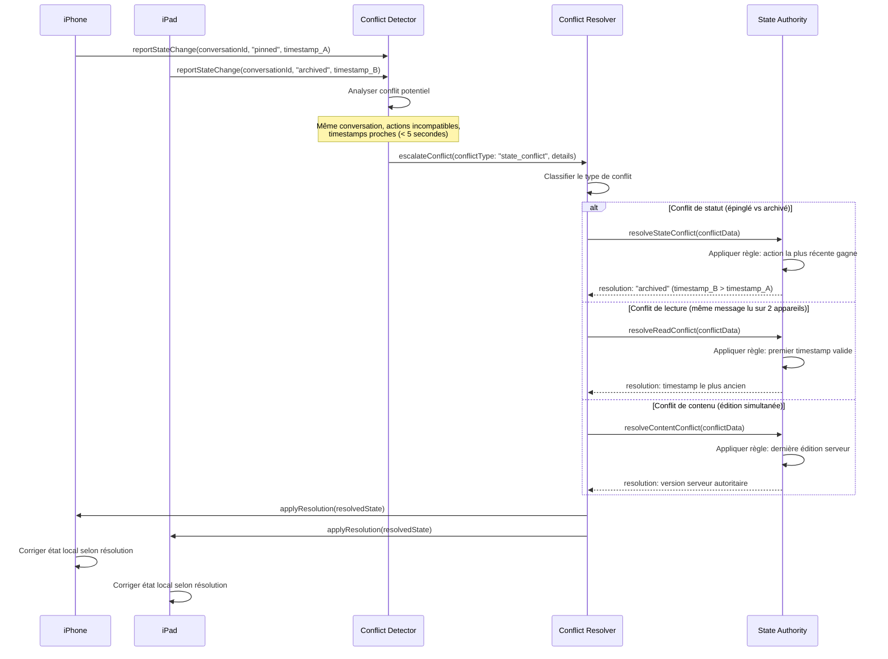
```mermaid
sequenceDiagram
    participant Device1 as iPhone
    participant Device2 as iPad
    participant ConflictDetector as Conflict Detector
    participant ConflictResolver as Conflict Resolver
    participant StateAuthority as State Authority
    
    Device1->>ConflictDetector: reportStateChange(conversationId, "pinned", timestamp_A)
    Device2->>ConflictDetector: reportStateChange(conversationId, "archived", timestamp_B)
    
    ConflictDetector->>ConflictDetector: Analyser conflit potentiel
    Note over ConflictDetector: Même conversation, actions incompatibles,<br/>timestamps proches (< 5 secondes)
    
    ConflictDetector->>ConflictResolver: escalateConflict(conflictType: "state_conflict", details)
    ConflictResolver->>ConflictResolver: Classifier le type de conflit
    
    alt Conflit de statut (épinglé vs archivé)
        ConflictResolver->>StateAuthority: resolveStateConflict(conflictData)
        StateAuthority->>StateAuthority: Appliquer règle: action la plus récente gagne
        StateAuthority-->>ConflictResolver: resolution: "archived" (timestamp_B > timestamp_A)
        
    else Conflit de lecture (même message lu sur 2 appareils)
        ConflictResolver->>StateAuthority: resolveReadConflict(conflictData)
        StateAuthority->>StateAuthority: Appliquer règle: premier timestamp valide
        StateAuthority-->>ConflictResolver: resolution: timestamp le plus ancien
        
    else Conflit de contenu (édition simultanée)
        ConflictResolver->>StateAuthority: resolveContentConflict(conflictData)
        StateAuthority->>StateAuthority: Appliquer règle: dernière édition serveur
        StateAuthority-->>ConflictResolver: resolution: version serveur autoritaire
    end
    
    ConflictResolver->>Device1: applyResolution(resolvedState)
    ConflictResolver->>Device2: applyResolution(resolvedState)
    
    Device1->>Device1: Corriger état local selon résolution
    Device2->>Device2: Corriger état local selon résolution
```

### 4.2 Règles de résolution des conflits

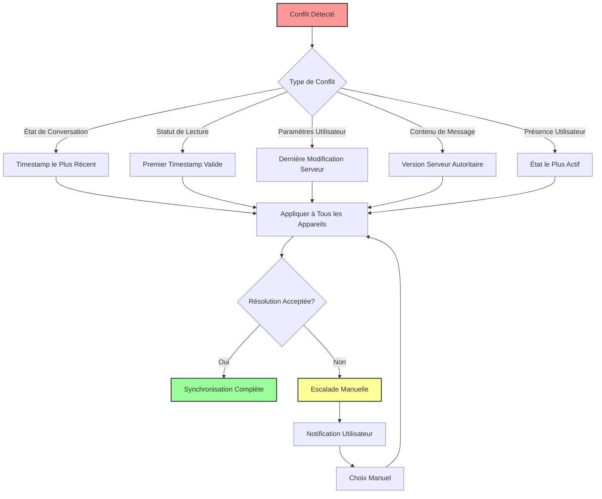
```mermaid
graph TD
    A[Conflit Détecté] --> B{Type de Conflit}
    
    B -->|État de Conversation| C[Timestamp le Plus Récent]
    B -->|Statut de Lecture| D[Premier Timestamp Valide]
    B -->|Paramètres Utilisateur| E[Dernière Modification Serveur]
    B -->|Contenu de Message| F[Version Serveur Autoritaire]
    B -->|Présence Utilisateur| G[État le Plus Actif]
    
    C --> H[Appliquer à Tous les Appareils]
    D --> H
    E --> H
    F --> H
    G --> H
    
    H --> I{Résolution Acceptée?}
    I -->|Oui| J[Synchronisation Complète]
    I -->|Non| K[Escalade Manuelle]
    
    K --> L[Notification Utilisateur]
    L --> M[Choix Manuel]
    M --> H
    
    style A fill:#f99,stroke:#333,stroke-width:2px
    style J fill:#9f9,stroke:#333,stroke-width:2px
    style K fill:#ff9,stroke:#333,stroke-width:2px
```

### 4.3 Résolution de conflits complexes

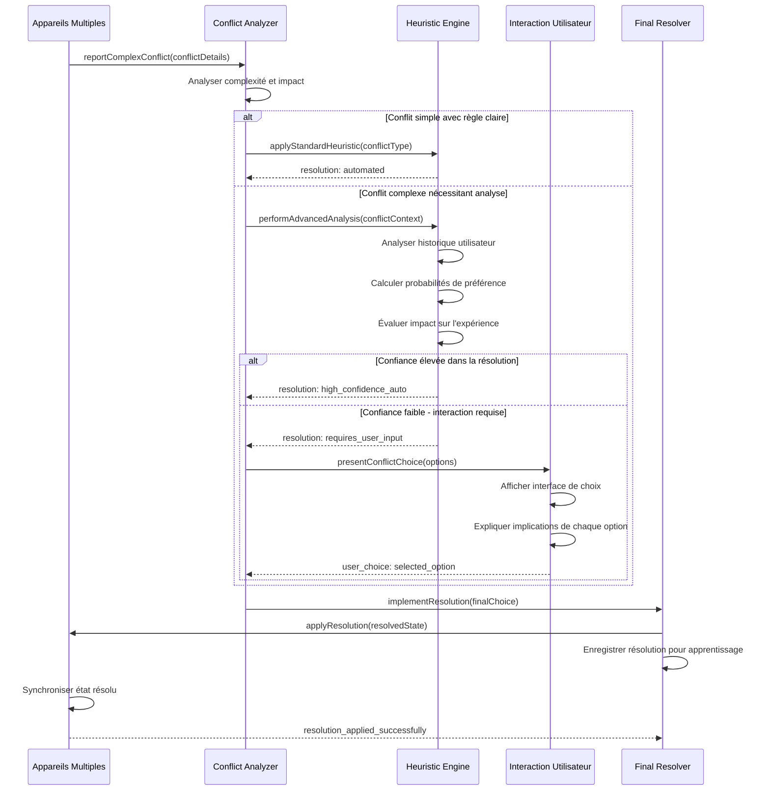
```mermaid
sequenceDiagram
    participant MultiDevice as Appareils Multiples
    participant ConflictAnalyzer as Conflict Analyzer
    participant HeuristicEngine as Heuristic Engine
    participant UserInteraction as Interaction Utilisateur
    participant FinalResolver as Final Resolver
    
    MultiDevice->>ConflictAnalyzer: reportComplexConflict(conflictDetails)
    ConflictAnalyzer->>ConflictAnalyzer: Analyser complexité et impact
    
    alt Conflit simple avec règle claire
        ConflictAnalyzer->>HeuristicEngine: applyStandardHeuristic(conflictType)
        HeuristicEngine-->>ConflictAnalyzer: resolution: automated
        
    else Conflit complexe nécessitant analyse
        ConflictAnalyzer->>HeuristicEngine: performAdvancedAnalysis(conflictContext)
        HeuristicEngine->>HeuristicEngine: Analyser historique utilisateur
        HeuristicEngine->>HeuristicEngine: Calculer probabilités de préférence
        HeuristicEngine->>HeuristicEngine: Évaluer impact sur l'expérience
        
        alt Confiance élevée dans la résolution
            HeuristicEngine-->>ConflictAnalyzer: resolution: high_confidence_auto
            
        else Confiance faible - interaction requise
            HeuristicEngine-->>ConflictAnalyzer: resolution: requires_user_input
            ConflictAnalyzer->>UserInteraction: presentConflictChoice(options)
            
            UserInteraction->>UserInteraction: Afficher interface de choix
            UserInteraction->>UserInteraction: Expliquer implications de chaque option
            UserInteraction-->>ConflictAnalyzer: user_choice: selected_option
        end
    end
    
    ConflictAnalyzer->>FinalResolver: implementResolution(finalChoice)
    FinalResolver->>MultiDevice: applyResolution(resolvedState)
    FinalResolver->>FinalResolver: Enregistrer résolution pour apprentissage
    
    MultiDevice->>MultiDevice: Synchroniser état résolu
    MultiDevice-->>FinalResolver: resolution_applied_successfully
```

## 5. Récupération d'historique

### 5.1 Synchronisation initiale d'un nouvel appareil

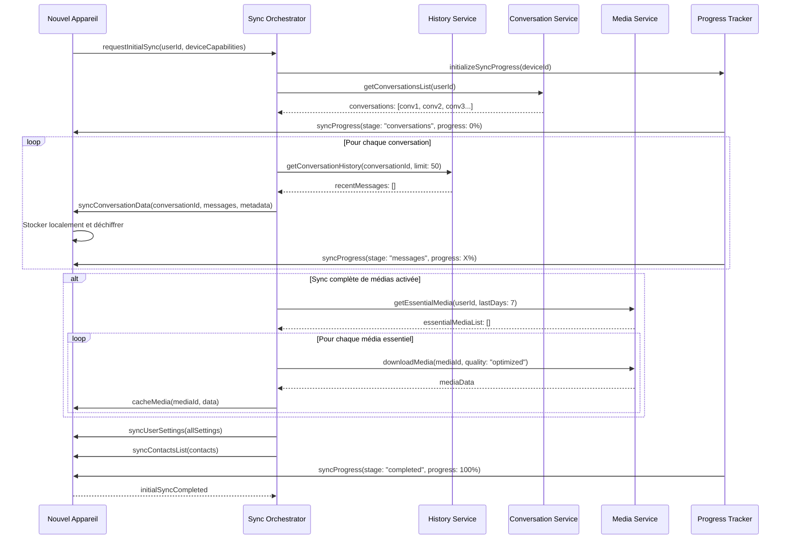
```mermaid
sequenceDiagram
    participant NewDevice as Nouvel Appareil
    participant SyncOrchestrator as Sync Orchestrator
    participant HistoryService as History Service
    participant ConversationService as Conversation Service
    participant MediaService as Media Service
    participant ProgressTracker as Progress Tracker
    
    NewDevice->>SyncOrchestrator: requestInitialSync(userId, deviceCapabilities)
    SyncOrchestrator->>ProgressTracker: initializeSyncProgress(deviceId)
    
    SyncOrchestrator->>ConversationService: getConversationsList(userId)
    ConversationService-->>SyncOrchestrator: conversations: [conv1, conv2, conv3...]
    
    ProgressTracker->>NewDevice: syncProgress(stage: "conversations", progress: 0%)
    
    loop Pour chaque conversation
        SyncOrchestrator->>HistoryService: getConversationHistory(conversationId, limit: 50)
        HistoryService-->>SyncOrchestrator: recentMessages: []
        
        SyncOrchestrator->>NewDevice: syncConversationData(conversationId, messages, metadata)
        NewDevice->>NewDevice: Stocker localement et déchiffrer
        
        ProgressTracker->>NewDevice: syncProgress(stage: "messages", progress: X%)
    end
    
    alt Sync complète de médias activée
        SyncOrchestrator->>MediaService: getEssentialMedia(userId, lastDays: 7)
        MediaService-->>SyncOrchestrator: essentialMediaList: []
        
        loop Pour chaque média essentiel
            SyncOrchestrator->>MediaService: downloadMedia(mediaId, quality: "optimized")
            MediaService-->>SyncOrchestrator: mediaData
            SyncOrchestrator->>NewDevice: cacheMedia(mediaId, data)
        end
    end
    
    SyncOrchestrator->>NewDevice: syncUserSettings(allSettings)
    SyncOrchestrator->>NewDevice: syncContactsList(contacts)
    
    ProgressTracker->>NewDevice: syncProgress(stage: "completed", progress: 100%)
    NewDevice-->>SyncOrchestrator: initialSyncCompleted
```

### 5.2 Synchronisation incrémentale après reconnexion

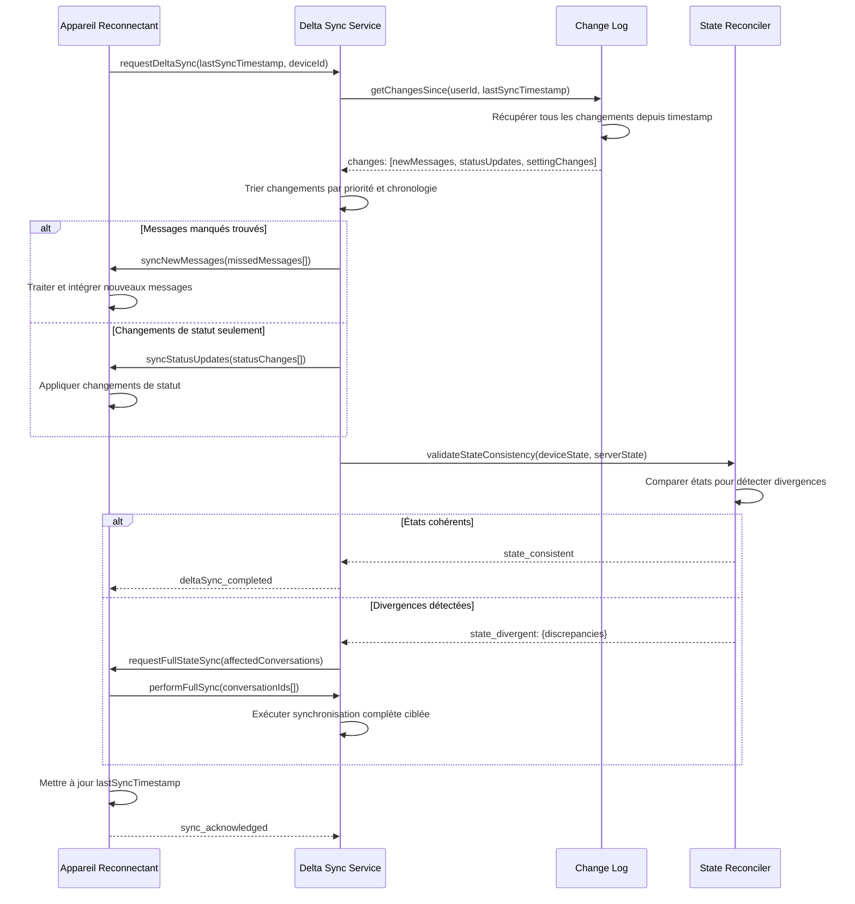
```mermaid
sequenceDiagram
    participant ReconnectingDevice as Appareil Reconnectant
    participant DeltaSync as Delta Sync Service
    participant ChangeLog as Change Log
    participant StateReconciler as State Reconciler
    
    ReconnectingDevice->>DeltaSync: requestDeltaSync(lastSyncTimestamp, deviceId)
    DeltaSync->>ChangeLog: getChangesSince(userId, lastSyncTimestamp)
    
    ChangeLog->>ChangeLog: Récupérer tous les changements depuis timestamp
    ChangeLog-->>DeltaSync: changes: [newMessages, statusUpdates, settingChanges]
    
    DeltaSync->>DeltaSync: Trier changements par priorité et chronologie
    
    alt Messages manqués trouvés
        DeltaSync->>ReconnectingDevice: syncNewMessages(missedMessages[])
        ReconnectingDevice->>ReconnectingDevice: Traiter et intégrer nouveaux messages
        
    else Changements de statut seulement
        DeltaSync->>ReconnectingDevice: syncStatusUpdates(statusChanges[])
        ReconnectingDevice->>ReconnectingDevice: Appliquer changements de statut
    end
    
    DeltaSync->>StateReconciler: validateStateConsistency(deviceState, serverState)
    StateReconciler->>StateReconciler: Comparer états pour détecter divergences
    
    alt États cohérents
        StateReconciler-->>DeltaSync: state_consistent
        DeltaSync-->>ReconnectingDevice: deltaSync_completed
        
    else Divergences détectées
        StateReconciler-->>DeltaSync: state_divergent: {discrepancies}
        DeltaSync->>ReconnectingDevice: requestFullStateSync(affectedConversations)
        
        ReconnectingDevice->>DeltaSync: performFullSync(conversationIds[])
        DeltaSync->>DeltaSync: Exécuter synchronisation complète ciblée
    end
    
    ReconnectingDevice->>ReconnectingDevice: Mettre à jour lastSyncTimestamp
    ReconnectingDevice-->>DeltaSync: sync_acknowledged
```

### 5.3 Synchronisation à la demande d'historique ancien

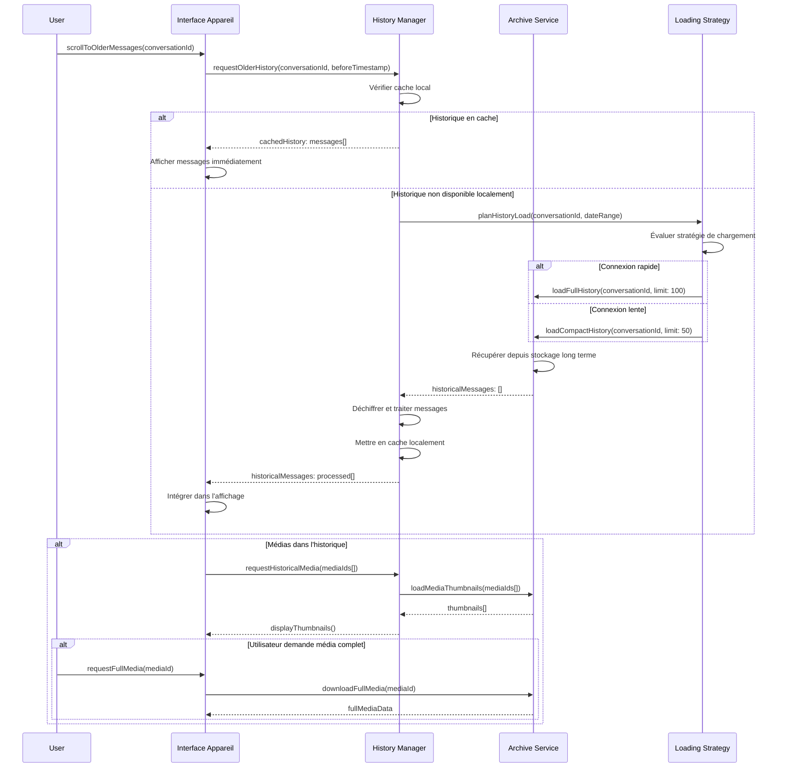
```mermaid
sequenceDiagram
    participant User
    participant DeviceUI as Interface Appareil
    participant HistoryManager as History Manager
    participant ArchiveService as Archive Service
    participant LoadingStrategy as Loading Strategy
    
    User->>DeviceUI: scrollToOlderMessages(conversationId)
    DeviceUI->>HistoryManager: requestOlderHistory(conversationId, beforeTimestamp)
    
    HistoryManager->>HistoryManager: Vérifier cache local
    
    alt Historique en cache
        HistoryManager-->>DeviceUI: cachedHistory: messages[]
        DeviceUI->>DeviceUI: Afficher messages immédiatement
        
    else Historique non disponible localement
        HistoryManager->>LoadingStrategy: planHistoryLoad(conversationId, dateRange)
        LoadingStrategy->>LoadingStrategy: Évaluer stratégie de chargement
        
        alt Connexion rapide
            LoadingStrategy->>ArchiveService: loadFullHistory(conversationId, limit: 100)
            
        else Connexion lente
            LoadingStrategy->>ArchiveService: loadCompactHistory(conversationId, limit: 50)
        end
        
        ArchiveService->>ArchiveService: Récupérer depuis stockage long terme
        ArchiveService-->>HistoryManager: historicalMessages: []
        
        HistoryManager->>HistoryManager: Déchiffrer et traiter messages
        HistoryManager->>HistoryManager: Mettre en cache localement
        HistoryManager-->>DeviceUI: historicalMessages: processed[]
        
        DeviceUI->>DeviceUI: Intégrer dans l'affichage
    end
    
    alt Médias dans l'historique
        DeviceUI->>HistoryManager: requestHistoricalMedia(mediaIds[])
        HistoryManager->>ArchiveService: loadMediaThumbnails(mediaIds[])
        ArchiveService-->>HistoryManager: thumbnails[]
        HistoryManager-->>DeviceUI: displayThumbnails()
        
        alt Utilisateur demande média complet
            User->>DeviceUI: requestFullMedia(mediaId)
            DeviceUI->>ArchiveService: downloadFullMedia(mediaId)
            ArchiveService-->>DeviceUI: fullMediaData
        end
    end
```

## 6. Optimisation de la bande passante

### 6.1 Compression et priorisation adaptatives

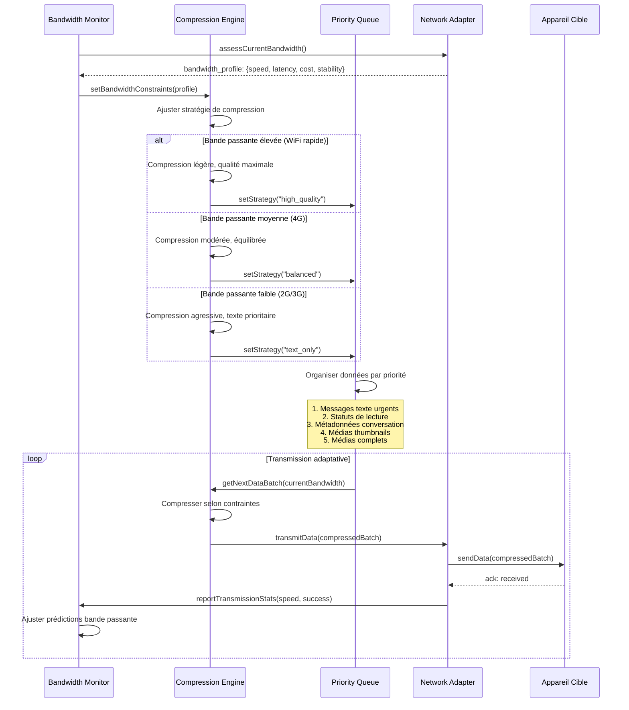
```mermaid
sequenceDiagram
    participant BandwidthMonitor as Bandwidth Monitor
    participant CompressionEngine as Compression Engine
    participant PriorityQueue as Priority Queue
    participant NetworkAdapter as Network Adapter
    participant TargetDevice as Appareil Cible
    
    BandwidthMonitor->>NetworkAdapter: assessCurrentBandwidth()
    NetworkAdapter-->>BandwidthMonitor: bandwidth_profile: {speed, latency, cost, stability}
    
    BandwidthMonitor->>CompressionEngine: setBandwidthConstraints(profile)
    CompressionEngine->>CompressionEngine: Ajuster stratégie de compression
    
    alt Bande passante élevée (WiFi rapide)
        CompressionEngine->>CompressionEngine: Compression légère, qualité maximale
        CompressionEngine->>PriorityQueue: setStrategy("high_quality")
        
    else Bande passante moyenne (4G)
        CompressionEngine->>CompressionEngine: Compression modérée, équilibrée
        CompressionEngine->>PriorityQueue: setStrategy("balanced")
        
    else Bande passante faible (2G/3G)
        CompressionEngine->>CompressionEngine: Compression agressive, texte prioritaire
        CompressionEngine->>PriorityQueue: setStrategy("text_only")
    end
    
    PriorityQueue->>PriorityQueue: Organiser données par priorité
    Note over PriorityQueue: 1. Messages texte urgents<br/>2. Statuts de lecture<br/>3. Métadonnées conversation<br/>4. Médias thumbnails<br/>5. Médias complets
    
    loop Transmission adaptative
        PriorityQueue->>CompressionEngine: getNextDataBatch(currentBandwidth)
        CompressionEngine->>CompressionEngine: Compresser selon contraintes
        CompressionEngine->>NetworkAdapter: transmitData(compressedBatch)
        
        NetworkAdapter->>TargetDevice: sendData(compressedBatch)
        TargetDevice-->>NetworkAdapter: ack: received
        
        NetworkAdapter->>BandwidthMonitor: reportTransmissionStats(speed, success)
        BandwidthMonitor->>BandwidthMonitor: Ajuster prédictions bande passante
    end
```

### 6.2 Synchronisation différentielle intelligente

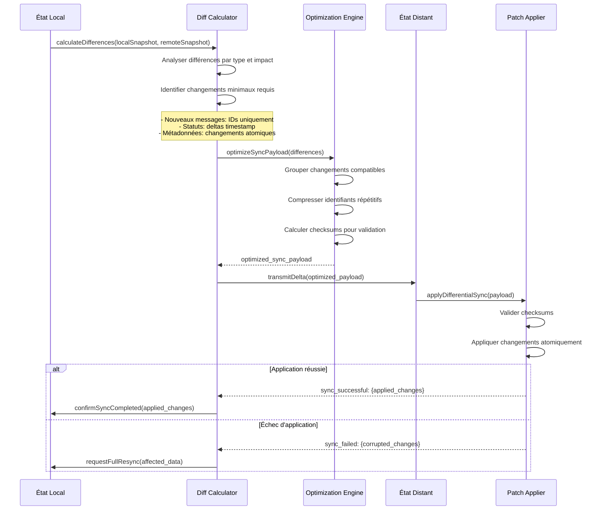
```mermaid
sequenceDiagram
    participant LocalState as État Local
    participant DiffCalculator as Diff Calculator
    participant OptimizationEngine as Optimization Engine
    participant RemoteState as État Distant
    participant PatchApplier as Patch Applier
    
    LocalState->>DiffCalculator: calculateDifferences(localSnapshot, remoteSnapshot)
    DiffCalculator->>DiffCalculator: Analyser différences par type et impact
    
    DiffCalculator->>DiffCalculator: Identifier changements minimaux requis
    Note over DiffCalculator: - Nouveaux messages: IDs uniquement<br/>- Statuts: deltas timestamp<br/>- Métadonnées: changements atomiques
    
    DiffCalculator->>OptimizationEngine: optimizeSyncPayload(differences)
    OptimizationEngine->>OptimizationEngine: Grouper changements compatibles
    OptimizationEngine->>OptimizationEngine: Compresser identifiants répétitifs
    OptimizationEngine->>OptimizationEngine: Calculer checksums pour validation
    
    OptimizationEngine-->>DiffCalculator: optimized_sync_payload
    DiffCalculator->>RemoteState: transmitDelta(optimized_payload)
    
    RemoteState->>PatchApplier: applyDifferentialSync(payload)
    PatchApplier->>PatchApplier: Valider checksums
    PatchApplier->>PatchApplier: Appliquer changements atomiquement
    
    alt Application réussie
        PatchApplier-->>DiffCalculator: sync_successful: {applied_changes}
        DiffCalculator->>LocalState: confirmSyncCompleted(applied_changes)
        
    else Échec d'application
        PatchApplier-->>DiffCalculator: sync_failed: {corrupted_changes}
        DiffCalculator->>LocalState: requestFullResync(affected_data)
    end
```

### 6.3 Cache intelligent et prédictif

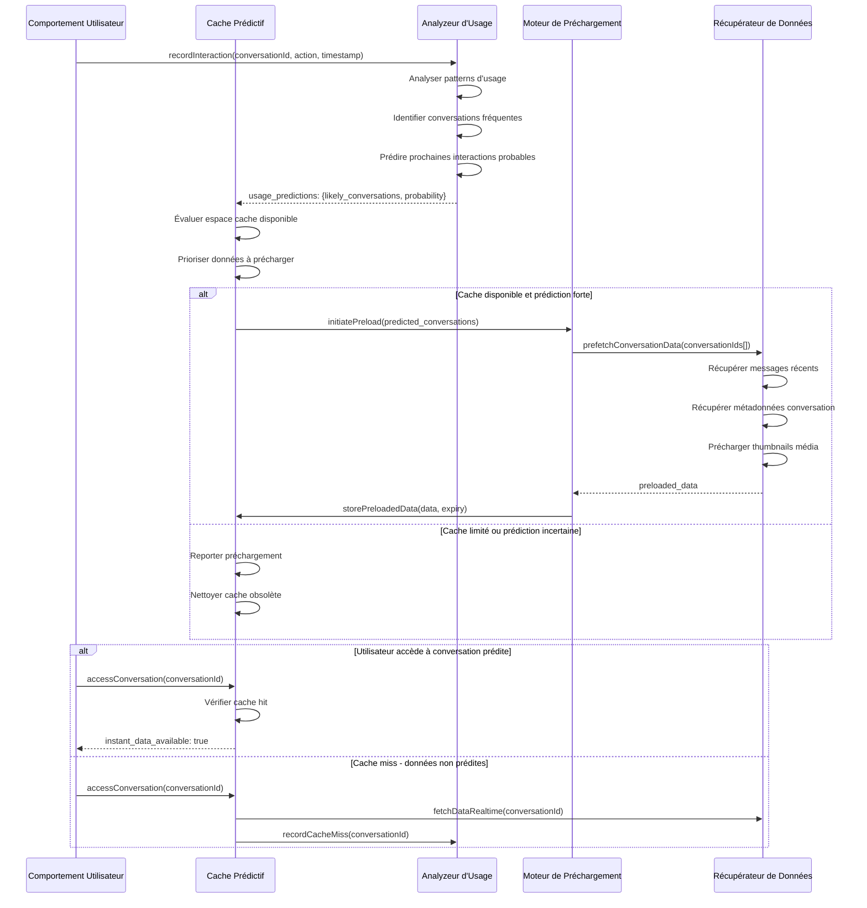
```mermaid
sequenceDiagram
    participant UserBehavior as Comportement Utilisateur
    participant PredictiveCache as Cache Prédictif
    participant UsageAnalyzer as Analyzeur d'Usage
    participant PreloadEngine as Moteur de Préchargement
    participant DataFetcher as Récupérateur de Données
    
    UserBehavior->>UsageAnalyzer: recordInteraction(conversationId, action, timestamp)
    UsageAnalyzer->>UsageAnalyzer: Analyser patterns d'usage
    
    UsageAnalyzer->>UsageAnalyzer: Identifier conversations fréquentes
    UsageAnalyzer->>UsageAnalyzer: Prédire prochaines interactions probables
    UsageAnalyzer-->>PredictiveCache: usage_predictions: {likely_conversations, probability}
    
    PredictiveCache->>PredictiveCache: Évaluer espace cache disponible
    PredictiveCache->>PredictiveCache: Prioriser données à précharger
    
    alt Cache disponible et prédiction forte
        PredictiveCache->>PreloadEngine: initiatePreload(predicted_conversations)
        PreloadEngine->>DataFetcher: prefetchConversationData(conversationIds[])
        
        DataFetcher->>DataFetcher: Récupérer messages récents
        DataFetcher->>DataFetcher: Récupérer métadonnées conversation
        DataFetcher->>DataFetcher: Précharger thumbnails média
        
        DataFetcher-->>PreloadEngine: preloaded_data
        PreloadEngine->>PredictiveCache: storePreloadedData(data, expiry)
        
    else Cache limité ou prédiction incertaine
        PredictiveCache->>PredictiveCache: Reporter préchargement
        PredictiveCache->>PredictiveCache: Nettoyer cache obsolète
    end
    
    alt Utilisateur accède à conversation prédite
        UserBehavior->>PredictiveCache: accessConversation(conversationId)
        PredictiveCache->>PredictiveCache: Vérifier cache hit
        PredictiveCache-->>UserBehavior: instant_data_available: true
        
    else Cache miss - données non prédites
        UserBehavior->>PredictiveCache: accessConversation(conversationId)
        PredictiveCache->>DataFetcher: fetchDataRealtime(conversationId)
        PredictiveCache->>UsageAnalyzer: recordCacheMiss(conversationId)
    end
```

## 7. Coordination des sessions et appareils

### 7.1 Gestion du cycle de vie des sessions

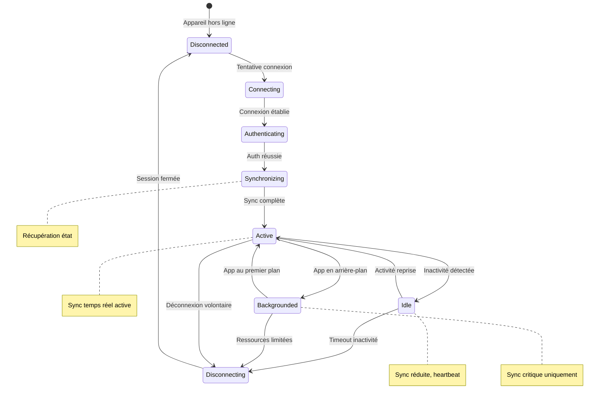
```mermaid
stateDiagram-v2
    [*] --> Disconnected : Appareil hors ligne
    Disconnected --> Connecting : Tentative connexion
    Connecting --> Authenticating : Connexion établie
    Authenticating --> Synchronizing : Auth réussie
    Synchronizing --> Active : Sync complète
    
    Active --> Idle : Inactivité détectée
    Idle --> Active : Activité reprise
    Active --> Backgrounded : App en arrière-plan
    Backgrounded --> Active : App au premier plan
    
    Idle --> Disconnecting : Timeout inactivité
    Backgrounded --> Disconnecting : Ressources limitées
    Active --> Disconnecting : Déconnexion volontaire
    
    Disconnecting --> Disconnected : Session fermée
    
    note right of Active : Sync temps réel active
    note right of Idle : Sync réduite, heartbeat
    note right of Backgrounded : Sync critique uniquement
    note right of Synchronizing : Récupération état
```

### 7.2 Coordination entre appareils actifs

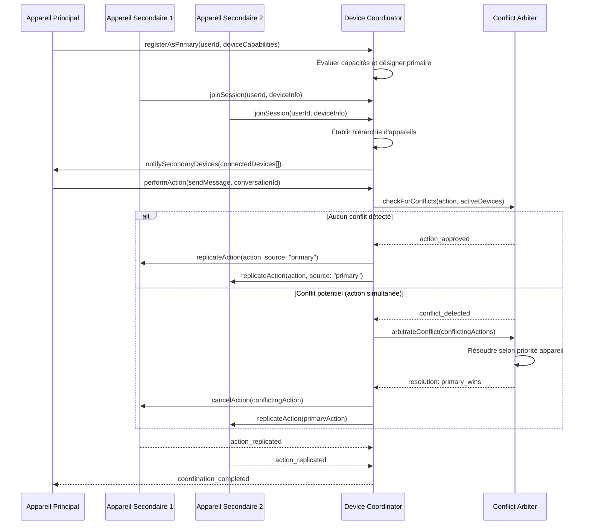
```mermaid
sequenceDiagram
    participant Primary as Appareil Principal
    participant Secondary1 as Appareil Secondaire 1
    participant Secondary2 as Appareil Secondaire 2
    participant DeviceCoordinator as Device Coordinator
    participant ConflictArbiter as Conflict Arbiter
    
    Primary->>DeviceCoordinator: registerAsPrimary(userId, deviceCapabilities)
    DeviceCoordinator->>DeviceCoordinator: Évaluer capacités et désigner primaire
    
    Secondary1->>DeviceCoordinator: joinSession(userId, deviceInfo)
    Secondary2->>DeviceCoordinator: joinSession(userId, deviceInfo)
    
    DeviceCoordinator->>DeviceCoordinator: Établir hiérarchie d'appareils
    DeviceCoordinator->>Primary: notifySecondaryDevices(connectedDevices[])
    
    Primary->>DeviceCoordinator: performAction(sendMessage, conversationId)
    DeviceCoordinator->>ConflictArbiter: checkForConflicts(action, activeDevices)
    
    alt Aucun conflit détecté
        ConflictArbiter-->>DeviceCoordinator: action_approved
        DeviceCoordinator->>Secondary1: replicateAction(action, source: "primary")
        DeviceCoordinator->>Secondary2: replicateAction(action, source: "primary")
        
    else Conflit potentiel (action simultanée)
        ConflictArbiter-->>DeviceCoordinator: conflict_detected
        DeviceCoordinator->>ConflictArbiter: arbitrateConflict(conflictingActions)
        ConflictArbiter->>ConflictArbiter: Résoudre selon priorité appareil
        ConflictArbiter-->>DeviceCoordinator: resolution: primary_wins
        
        DeviceCoordinator->>Secondary1: cancelAction(conflictingAction)
        DeviceCoordinator->>Secondary2: replicateAction(primaryAction)
    end
    
    Secondary1-->>DeviceCoordinator: action_replicated
    Secondary2-->>DeviceCoordinator: action_replicated
    DeviceCoordinator-->>Primary: coordination_completed
```

### 7.3 Transition de responsabilité entre appareils

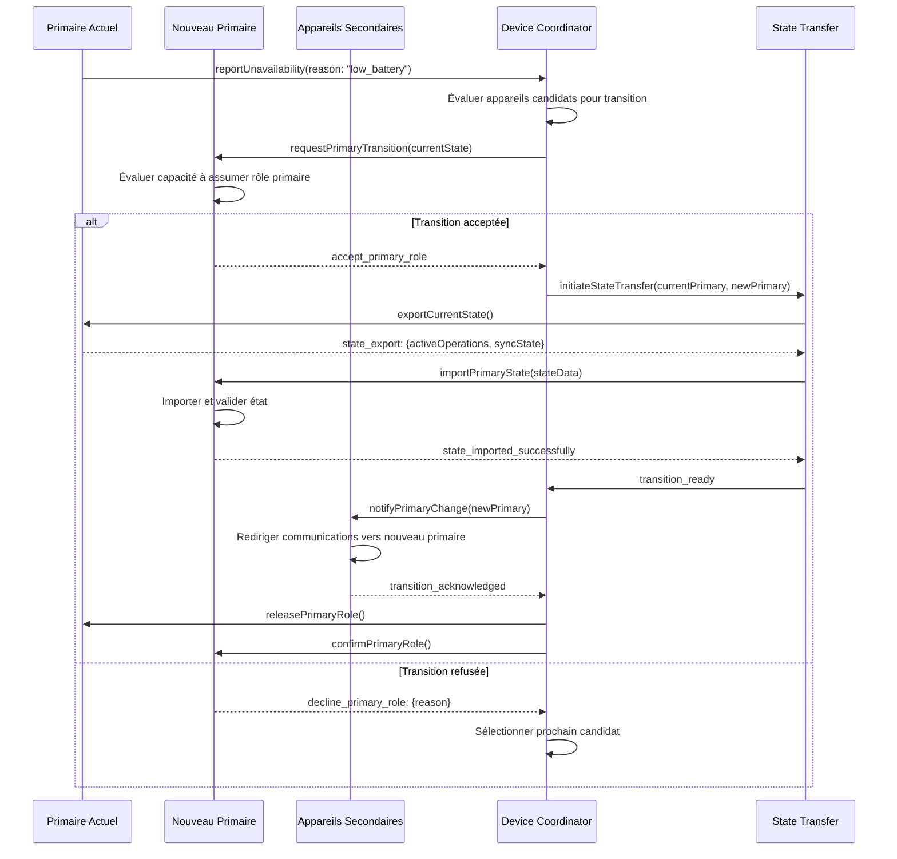
```mermaid
sequenceDiagram
    participant CurrentPrimary as Primaire Actuel
    participant NewPrimary as Nouveau Primaire
    participant SecondaryDevices as Appareils Secondaires
    participant DeviceCoordinator as Device Coordinator
    participant StateTransfer as State Transfer
    
    CurrentPrimary->>DeviceCoordinator: reportUnavailability(reason: "low_battery")
    DeviceCoordinator->>DeviceCoordinator: Évaluer appareils candidats pour transition
    
    DeviceCoordinator->>NewPrimary: requestPrimaryTransition(currentState)
    NewPrimary->>NewPrimary: Évaluer capacité à assumer rôle primaire
    
    alt Transition acceptée
        NewPrimary-->>DeviceCoordinator: accept_primary_role
        
        DeviceCoordinator->>StateTransfer: initiateStateTransfer(currentPrimary, newPrimary)
        StateTransfer->>CurrentPrimary: exportCurrentState()
        CurrentPrimary-->>StateTransfer: state_export: {activeOperations, syncState}
        
        StateTransfer->>NewPrimary: importPrimaryState(stateData)
        NewPrimary->>NewPrimary: Importer et valider état
        NewPrimary-->>StateTransfer: state_imported_successfully
        
        StateTransfer->>DeviceCoordinator: transition_ready
        DeviceCoordinator->>SecondaryDevices: notifyPrimaryChange(newPrimary)
        
        SecondaryDevices->>SecondaryDevices: Rediriger communications vers nouveau primaire
        SecondaryDevices-->>DeviceCoordinator: transition_acknowledged
        
        DeviceCoordinator->>CurrentPrimary: releasePrimaryRole()
        DeviceCoordinator->>NewPrimary: confirmPrimaryRole()
        
    else Transition refusée
        NewPrimary-->>DeviceCoordinator: decline_primary_role: {reason}
        DeviceCoordinator->>DeviceCoordinator: Sélectionner prochain candidat
    end
```

## 8. Sécurité et chiffrement dans la synchronisation

### 8.1 Maintien du chiffrement E2E lors de la synchronisation

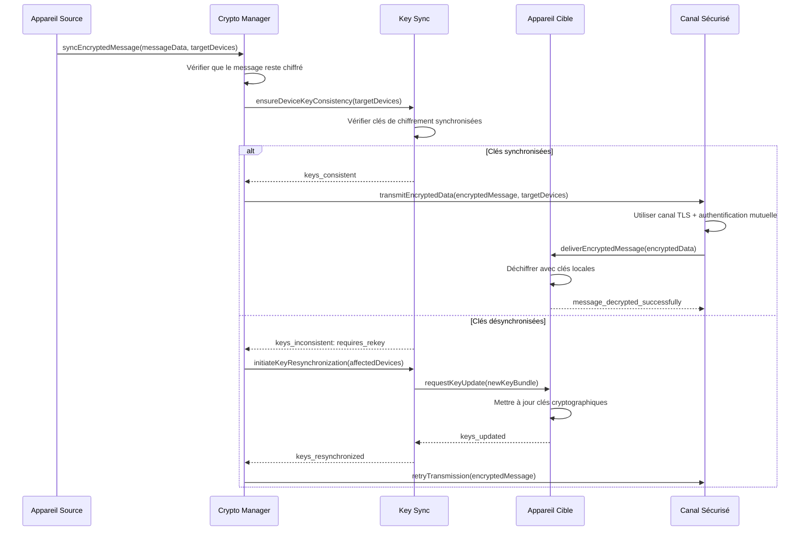
```mermaid
sequenceDiagram
    participant SourceDevice as Appareil Source
    participant CryptoManager as Crypto Manager
    participant KeySync as Key Sync
    participant TargetDevice as Appareil Cible
    participant SecureChannel as Canal Sécurisé
    
    SourceDevice->>CryptoManager: syncEncryptedMessage(messageData, targetDevices)
    CryptoManager->>CryptoManager: Vérifier que le message reste chiffré
    
    CryptoManager->>KeySync: ensureDeviceKeyConsistency(targetDevices)
    KeySync->>KeySync: Vérifier clés de chiffrement synchronisées
    
    alt Clés synchronisées
        KeySync-->>CryptoManager: keys_consistent
        
        CryptoManager->>SecureChannel: transmitEncryptedData(encryptedMessage, targetDevices)
        SecureChannel->>SecureChannel: Utiliser canal TLS + authentification mutuelle
        
        SecureChannel->>TargetDevice: deliverEncryptedMessage(encryptedData)
        TargetDevice->>TargetDevice: Déchiffrer avec clés locales
        TargetDevice-->>SecureChannel: message_decrypted_successfully
        
    else Clés désynchronisées
        KeySync-->>CryptoManager: keys_inconsistent: requires_rekey
        CryptoManager->>KeySync: initiateKeyResynchronization(affectedDevices)
        
        KeySync->>TargetDevice: requestKeyUpdate(newKeyBundle)
        TargetDevice->>TargetDevice: Mettre à jour clés cryptographiques
        TargetDevice-->>KeySync: keys_updated
        
        KeySync-->>CryptoManager: keys_resynchronized
        CryptoManager->>SecureChannel: retryTransmission(encryptedMessage)
    end
```

### 8.2 Authentification inter-appareils

```mermaid
sequenceDiagram
    participant Device1 as Appareil 1
    participant Device2 as Appareil 2
    participant AuthManager as Auth Manager
    participant CertificateStore as Certificate Store
    participant SecurityValidator as Security Validator
    
    Device1->>AuthManager: requestDeviceAuthentication(device2_id)
    AuthManager->>CertificateStore: getDeviceCertificate(device2_id)
    CertificateStore-->>AuthManager: device_certificate
    
    AuthManager->>SecurityValidator: validateDeviceCertificate(certificate)
    SecurityValidator->>SecurityValidator: Vérifier signature et validité
    SecurityValidator->>SecurityValidator: Contrôler révocations
    
    alt Certificat valide
        SecurityValidator-->>AuthManager: certificate_valid
        AuthManager->>Device2: challengeAuthentication(random_challenge)
        
        Device2->>Device2: Signer challenge avec clé privée
        Device2-->>AuthManager: signed_challenge
        
        AuthManager->>SecurityValidator: verifyChallengeSignature(challenge, signature)
        SecurityValidator-->>AuthManager: signature_valid
        
        AuthManager->>Device1: authentication_successful
        AuthManager->>Device2: authentication_successful
        
        Device1->>Device2: establishSecureChannel(session_key)
        Device2-->>Device1: secure_channel_established
        
    else Certificat invalide ou révoqué
        SecurityValidator-->>AuthManager: certificate_invalid: {reason}
        AuthManager->>Device1: authentication_failed: certificate_issue
        AuthManager->>Device2: authentication_denied: security_violation
        
        AuthManager->>SecurityValidator: reportSecurityIncident(device2_id, violation)
    end
```

### 8.3 Protection contre les attaques de synchronisation

```mermaid
sequenceDiagram
    participant AttackDetector as Attack Detector
    participant SecurityMonitor as Security Monitor
    participant RateLimiter as Rate Limiter
    participant DeviceQuarantine as Device Quarantine
    participant SyncCoordinator as Sync Coordinator
    
    SecurityMonitor->>AttackDetector: monitorSyncActivity(deviceBehavior)
    AttackDetector->>AttackDetector: Analyser patterns de synchronisation
    
    alt Comportement normal détecté
        AttackDetector-->>SecurityMonitor: behavior_normal
        SecurityMonitor->>SyncCoordinator: allow_sync_operations
        
    else Pattern suspect détecté
        AttackDetector-->>SecurityMonitor: suspicious_behavior: {anomalies}
        SecurityMonitor->>RateLimiter: applyAdaptiveLimiting(deviceId, suspicionLevel)
        
        RateLimiter->>RateLimiter: Réduire quotas de synchronisation
        RateLimiter->>SyncCoordinator: enforce_rate_limits(restrictedQuotas)
        
        alt Escalade de comportement malveillant
            AttackDetector->>SecurityMonitor: escalate_threat: confirmed_attack
            SecurityMonitor->>DeviceQuarantine: quarantineDevice(deviceId, duration)
            
            DeviceQuarantine->>DeviceQuarantine: Isoler appareil des opérations sync
            DeviceQuarantine->>SyncCoordinator: block_device_sync(deviceId)
            
            SecurityMonitor->>SecurityMonitor: Alerter équipe sécurité
            SecurityMonitor->>SecurityMonitor: Logger incident détaillé
            
        else Fausse alerte - comportement légitime
            AttackDetector->>SecurityMonitor: false_positive_detected
            SecurityMonitor->>RateLimiter: restore_normal_limits(deviceId)
            SecurityMonitor->>SecurityMonitor: Ajuster seuils de détection
        end
    end
```

## 9. Intégration avec les autres services

### 9.1 Interface avec User Service

```mermaid
sequenceDiagram
    participant SyncService as Sync Service
    participant UserService as User Service
    participant DeviceRegistry as Device Registry
    participant PermissionValidator as Permission Validator
    
    SyncService->>UserService: validateSyncPermissions(userId, deviceId, operation)
    UserService->>DeviceRegistry: checkDeviceRegistration(userId, deviceId)
    
    DeviceRegistry->>DeviceRegistry: Vérifier appareil enregistré et actif
    DeviceRegistry-->>UserService: device_status: {registered, trusted, active}
    
    UserService->>PermissionValidator: checkUserPermissions(userId, operation)
    PermissionValidator->>PermissionValidator: Vérifier droits selon type d'opération
    
    alt Permissions accordées
        PermissionValidator-->>UserService: permissions_granted
        UserService->>UserService: Vérifier quotas et limitations
        UserService-->>SyncService: sync_authorized: {quotas, restrictions}
        
    else Permissions refusées
        PermissionValidator-->>UserService: permissions_denied: {reason}
        UserService-->>SyncService: sync_denied: access_violation
    end
```

### 9.2 Interface avec Notification Service

```mermaid
sequenceDiagram
    participant SyncService as Sync Service
    participant NotificationService as Notification Service
    participant DeviceCoordinator as Device Coordinator
    participant UserPreferences as User Preferences
    
    SyncService->>NotificationService: coordinateNotifications(userId, syncEvent)
    NotificationService->>DeviceCoordinator: getActiveDevices(userId)
    DeviceCoordinator-->>NotificationService: active_devices: [device1, device2]
    
    NotificationService->>UserPreferences: getNotificationPreferences(userId)
    UserPreferences-->>NotificationService: preferences: {primary_device, notification_rules}
    
    NotificationService->>NotificationService: Calculer stratégie de notification
    
    alt Appareil principal actif
        NotificationService->>NotificationService: Notifier uniquement appareil principal
        NotificationService->>DeviceCoordinator: sendNotificationToPrimary(notification)
        
    else Aucun appareil principal actif
        NotificationService->>NotificationService: Notifier tous appareils actifs
        NotificationService->>DeviceCoordinator: broadcastNotification(notification, active_devices)
        
    else Mode synchronisation silencieuse
        NotificationService->>NotificationService: Supprimer notifications redondantes
        NotificationService->>DeviceCoordinator: sendConsolidatedNotification(summary)
    end
    
    DeviceCoordinator-->>NotificationService: notifications_delivered
    NotificationService-->>SyncService: notification_coordination_completed
```

## 10. Considérations techniques

### 10.1 Architecture de données distribuées

#### Tables de synchronisation
```sql
-- État de synchronisation par appareil
CREATE TABLE device_sync_state (
    id UUID PRIMARY KEY DEFAULT uuid_generate_v4(),
    user_id UUID NOT NULL,
    device_id VARCHAR(100) NOT NULL,
    last_sync_timestamp TIMESTAMP NOT NULL,
    sync_version INTEGER NOT NULL DEFAULT 1,
    pending_operations JSONB DEFAULT '[]',
    device_capabilities JSONB DEFAULT '{}',
    is_active BOOLEAN DEFAULT TRUE,
    created_at TIMESTAMP NOT NULL DEFAULT NOW(),
    updated_at TIMESTAMP NOT NULL DEFAULT NOW(),
    UNIQUE(user_id, device_id)
);

-- Journal des changements pour synchronisation différentielle
CREATE TABLE sync_change_log (
    id UUID PRIMARY KEY DEFAULT uuid_generate_v4(),
    user_id UUID NOT NULL,
    change_type VARCHAR(50) NOT NULL,
    entity_type VARCHAR(50) NOT NULL,
    entity_id UUID NOT NULL,
    change_data JSONB NOT NULL,
    timestamp TIMESTAMP NOT NULL DEFAULT NOW(),
    sync_version INTEGER NOT NULL,
    device_origin VARCHAR(100)
);

-- Conflits de synchronisation
CREATE TABLE sync_conflicts (
    id UUID PRIMARY KEY DEFAULT uuid_generate_v4(),
    user_id UUID NOT NULL,
    entity_type VARCHAR(50) NOT NULL,
    entity_id UUID NOT NULL,
    conflict_type VARCHAR(50) NOT NULL,
    device_1 VARCHAR(100) NOT NULL,
    device_2 VARCHAR(100) NOT NULL,
    conflict_data JSONB NOT NULL,
    resolution_status VARCHAR(20) DEFAULT 'pending',
    resolved_at TIMESTAMP,
    created_at TIMESTAMP NOT NULL DEFAULT NOW()
);

-- Sessions d'appareil actives
CREATE TABLE active_device_sessions (
    id UUID PRIMARY KEY DEFAULT uuid_generate_v4(),
    user_id UUID NOT NULL,
    device_id VARCHAR(100) NOT NULL,
    session_token VARCHAR(255) NOT NULL,
    device_capabilities JSONB DEFAULT '{}',
    last_heartbeat TIMESTAMP NOT NULL DEFAULT NOW(),
    is_primary BOOLEAN DEFAULT FALSE,
    created_at TIMESTAMP NOT NULL DEFAULT NOW(),
    UNIQUE(user_id, device_id)
);
```

#### Index d'optimisation
```sql
-- Optimisations pour synchronisation différentielle
CREATE INDEX idx_sync_change_log_user_timestamp ON sync_change_log(user_id, timestamp DESC);
CREATE INDEX idx_sync_change_log_version ON sync_change_log(sync_version);

-- Optimisations pour résolution de conflits
CREATE INDEX idx_sync_conflicts_user_pending ON sync_conflicts(user_id, resolution_status) 
WHERE resolution_status = 'pending';

-- Optimisations pour état des appareils
CREATE INDEX idx_device_sync_state_active ON device_sync_state(user_id, is_active);
CREATE INDEX idx_active_sessions_heartbeat ON active_device_sessions(last_heartbeat) 
WHERE last_heartbeat > NOW() - INTERVAL '5 minutes';
```

### 10.2 Cache distribué et coordination

#### Structures Redis pour synchronisation
```redis
# État de synchronisation en temps réel (TTL: 10 minutes)
sync:state:user:{userId} = {
  "devices": [
    {
      "deviceId": "phone_123",
      "lastSync": "2025-05-25T10:30:00Z",
      "syncVersion": 157,
      "isPrimary": true,
      "capabilities": ["full_sync", "media_cache"]
    }
  ],
  "pendingChanges": 3,
  "lastActivity": "2025-05-25T10:32:15Z"
}

# File d'attente des changements par appareil (TTL: 24h)
sync:pending:{userId}:{deviceId} = [
  {
    "changeId": "change_456",
    "type": "message_read",
    "data": {...},
    "priority": 1,
    "timestamp": "2025-05-25T10:31:00Z"
  }
]

# Verrous de synchronisation (TTL: 30 secondes)
sync:lock:{userId}:{resource} = {
  "lockId": "lock_789",
  "deviceId": "phone_123",
  "operation": "message_send",
  "acquiredAt": "2025-05-25T10:30:45Z"
}

# Conflits en cours de résolution (TTL: 1 heure)
sync:conflicts:{userId} = [
  {
    "conflictId": "conflict_101",
    "entityType": "conversation_state",
    "entityId": "conv_456",
    "devices": ["phone_123", "tablet_789"],
    "status": "analyzing"
  }
]
```

### 10.3 Workers Elixir pour synchronisation

#### Worker de synchronisation continue
```elixir
defmodule WhisprMessaging.SyncWorker do
  use GenServer
  
  def init(user_id) do
    schedule_sync_check()
    {:ok, %{user_id: user_id, active_devices: [], sync_version: 0}}
  end
  
  def handle_info(:sync_check, state) do
    perform_sync_cycle(state.user_id)
    schedule_sync_check()
    {:noreply, state}
  end
  
  defp perform_sync_cycle(user_id) do
    # Récupérer appareils actifs
    active_devices = DeviceRegistry.get_active_devices(user_id)
    
    # Identifier changements en attente
    pending_changes = SyncChangeLog.get_pending_changes(user_id)
    
    # Distribuer changements aux appareils
    Enum.each(pending_changes, fn change ->
      distribute_change_to_devices(change, active_devices)
    end)
    
    # Détecter et résoudre conflits
    detect_and_resolve_conflicts(user_id)
  end
  
  defp schedule_sync_check do
    Process.send_after(self(), :sync_check, 5_000) # 5 secondes
  end
end
```

#### Worker de résolution de conflits
```elixir
defmodule WhisprMessaging.ConflictResolutionWorker do
  use GenServer
  
  def handle_call({:resolve_conflict, conflict_data}, _from, state) do
    resolution = resolve_conflict(conflict_data)
    apply_resolution(resolution)
    {:reply, resolution, state}
  end
  
  defp resolve_conflict(%{type: "message_read", devices: devices, timestamps: timestamps}) do
    # Règle: timestamp le plus ancien gagne
    winning_timestamp = Enum.min(timestamps)
    %{
      resolution: "earliest_timestamp",
      winning_timestamp: winning_timestamp,
      action: "apply_to_all_devices"
    }
  end
  
  defp resolve_conflict(%{type: "conversation_state", conflicting_states: states}) do
    # Règle: dernière modification gagne
    latest_state = Enum.max_by(states, & &1.timestamp)
    %{
      resolution: "latest_wins",
      winning_state: latest_state,
      action: "override_all_devices"
    }
  end
end
```

### 10.4 Métriques et monitoring

#### Surveillance de la santé de synchronisation
```elixir
defmodule WhisprMessaging.SyncMetrics do
  def track_sync_latency(user_id, device_id, latency_ms) do
    :telemetry.execute(
      [:whispr_messaging, :sync, :latency],
      %{duration: latency_ms},
      %{user_id: user_id, device_id: device_id}
    )
  end
  
  def track_conflict_resolution(conflict_type, resolution_time_ms) do
    :telemetry.execute(
      [:whispr_messaging, :sync, :conflict_resolved],
      %{duration: resolution_time_ms},
      %{conflict_type: conflict_type}
    )
  end
  
  def track_sync_failure(user_id, device_id, failure_reason) do
    :telemetry.execute(
      [:whispr_messaging, :sync, :failure],
      %{count: 1},
      %{user_id: user_id, device_id: device_id, reason: failure_reason}
    )
  end
end
```

## 11. Endpoints API

| Endpoint | Méthode | Description | Paramètres |
|----------|---------|-------------|------------|
| `/api/v1/sync/devices` | GET | Lister appareils synchronisés | - |
| `/api/v1/sync/devices/{id}` | POST | Enregistrer nouvel appareil | Corps avec capabilities |
| `/api/v1/sync/devices/{id}` | DELETE | Désenregistrer appareil | - |
| `/api/v1/sync/state` | GET | État de synchronisation actuel | `since_timestamp` |
| `/api/v1/sync/delta` | GET | Changements depuis timestamp | `since`, `device_id` |
| `/api/v1/sync/conflicts` | GET | Conflits en attente | - |
| `/api/v1/sync/conflicts/{id}/resolve` | POST | Résoudre conflit manuellement | Corps avec résolution |
| `/api/v1/sync/history` | GET | Historique synchronisation | `conversation_id`, `limit` |
| `/api/v1/sync/force-full` | POST | Forcer synchronisation complète | `target_devices[]` |
| `/api/v1/sync/sessions` | GET | Sessions actives | - |

## 12. Tests et validation

### 12.1 Tests de synchronisation
- **Cohérence multi-appareils**: Validation de l'état identique sur tous les appareils
- **Performance de synchronisation**: Latence et débit de synchronisation
- **Résolution de conflits**: Tests des différents types de conflits et résolutions
- **Récupération après déconnexion**: Intégrité après reconnexion d'appareils

### 12.2 Tests de charge
- **Synchronisation massive**: Performance avec nombreux appareils simultanés
- **Conflits en cascade**: Gestion de nombreux conflits simultanés
- **Bande passante limitée**: Comportement sur connexions lentes
- **Récupération d'historique**: Performance de chargement d'historique volumineux

### 12.3 Tests de résilience
- **Pannes de réseau**: Comportement lors de déconnexions intermittentes
- **Corruption de données**: Récupération après corruption de cache ou données
- **Attaques de synchronisation**: Résistance aux tentatives de manipulation
- **Montée en charge**: Évolutivité avec augmentation du nombre d'utilisateurs

## 13. Livrables

1. **Infrastructure de synchronisation Elixir** comprenant :
   - Service de distribution de messages temps réel
   - Système de résolution de conflits déterministe
   - Workers de synchronisation continue et différentielle
   - Coordination intelligente des sessions d'appareil

2. **SDK client multi-plateforme** pour :
   - Synchronisation automatique transparente
   - Gestion des conflits côté client
   - Récupération d'historique optimisée
   - Cache intelligent et prédictif

3. **Outils de monitoring et diagnostics** :
   - Métriques de performance de synchronisation
   - Alertes sur échecs de synchronisation
   - Tableaux de bord de santé des appareils
   - Outils de résolution manuelle des conflits

4. **Documentation opérationnelle** :
   - Guide de déploiement et configuration
   - Procédures de diagnostic et dépannage
   - Métriques et seuils d'alerte recommandés
   - Stratégies d'optimisation et scaling

5. **Tests automatisés complets** :
   - Suite de tests de synchronisation multi-appareils
   - Tests de charge et de performance
   - Validation de la sécurité et du chiffrement
   - Tests de résilience et récupération d'erreurs