# Spécification Fonctionnelle - Notifications Push

## 1. Vue d'ensemble

### 1.1 Objectif

Cette spécification détaille le système de notifications push de l'application Whispr, permettant d'alerter les utilisateurs de nouveaux messages et événements importants même lorsque l'application n'est pas active. Elle couvre le déclenchement des notifications, la sécurisation du contenu, la personnalisation selon les préférences utilisateur, et l'intégration avec le notification-service, tout en préservant la confidentialité et le chiffrement bout-en-bout.

### 1.2 Principes clés

- **Confidentialité préservée**: Contenu des notifications sécurisé sans compromettre le chiffrement E2E
- **Pertinence contextuielle**: Notifications intelligentes adaptées au comportement utilisateur
- **Contrôle utilisateur**: Paramétrage granulaire des types et fréquences de notifications
- **Optimisation énergétique**: Minimisation de l'impact sur la batterie des appareils
- **Multi-plateforme**: Support uniforme iOS, Android et Web avec spécificités natives
- **Fiabilité**: Garantie de livraison des notifications critiques
- **Respect des préférences**: Honor des paramètres "Ne pas déranger" et horaires silencieux

### 1.3 Architecture du système de notifications

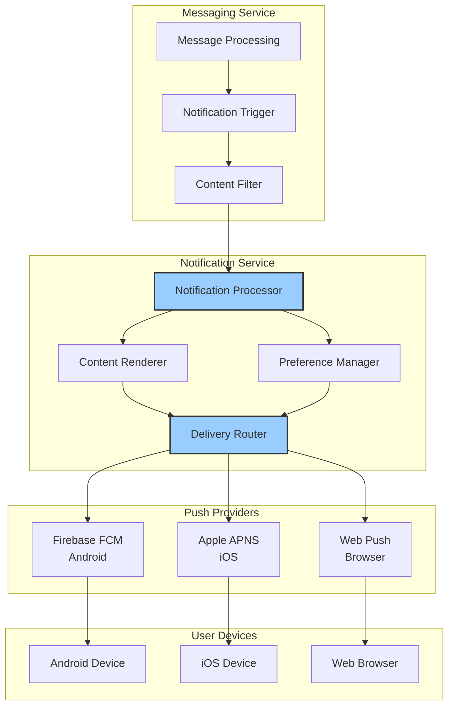
```mermaid
graph TB
    subgraph "Messaging Service"
        MS[Message Processing]
        NT[Notification Trigger]
        CF[Content Filter]
    end
    
    subgraph "Notification Service"
        NP[Notification Processor]
        CR[Content Renderer]
        DR[Delivery Router]
        PM[Preference Manager]
    end
    
    subgraph "Push Providers"
        FCM[Firebase FCM<br/>Android]
        APNS[Apple APNS<br/>iOS]
        WP[Web Push<br/>Browser]
    end
    
    subgraph "User Devices"
        AD[Android Device]
        ID[iOS Device]
        WB[Web Browser]
    end
    
    MS --> NT
    NT --> CF
    CF --> NP
    
    NP --> CR
    NP --> PM
    CR --> DR
    PM --> DR
    
    DR --> FCM
    DR --> APNS
    DR --> WP
    
    FCM --> AD
    APNS --> ID
    WP --> WB
    
    style NP fill:#9cf,stroke:#333,stroke-width:2px
    style DR fill:#9cf,stroke:#333,stroke-width:2px
```

### 1.4 Types de notifications

| Type | Priorité | Contenu | Déclencheur | Groupement |
|------|----------|---------|-------------|------------|
| **Nouveau message** | Élevée | Expéditeur + aperçu sécurisé | Message reçu | Par conversation |
| **Message en groupe** | Moyenne | Groupe + expéditeur + aperçu | Message dans groupe | Par groupe |
| **Appels manqués** | Élevée | Contact + heure d'appel | Appel non décroché | Par contact |
| **Réaction à message** | Faible | Contact + emoji | Réaction ajoutée | Par message |
| **Changement de groupe** | Moyenne | Événement groupe | Modification groupe | Par groupe |
| **Sécurité** | Critique | Alerte sécurité | Événement sécurité | Jamais groupé |
| **Synchronisation** | Silencieuse | Aucun (background) | Données à synchroniser | Jamais affiché |

### 1.5 Composants fonctionnels

Le système de notifications comprend sept processus principaux :
1. **Déclenchement intelligent**: Analyse contextuelle pour décider d'envoyer une notification
2. **Sécurisation du contenu**: Protection de la confidentialité dans les notifications
3. **Personnalisation**: Application des préférences utilisateur et contextuelle
4. **Routage multi-plateforme**: Distribution optimisée selon les plateformes
5. **Groupement et optimisation**: Agrégation intelligente des notifications
6. **Gestion des échecs**: Retry et alternatives de livraison
7. **Analytics et optimisation**: Suivi de l'efficacité des notifications

## 2. Déclenchement des notifications

### 2.1 Analyse contextuelle pour le déclenchement

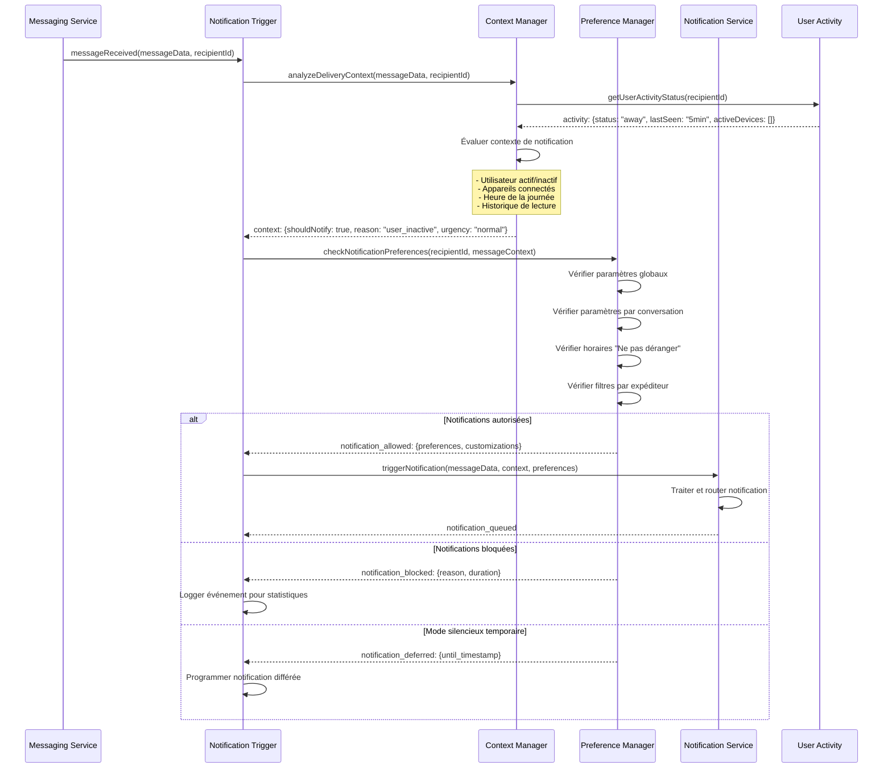
```mermaid
sequenceDiagram
    participant MS as Messaging Service
    participant NT as Notification Trigger
    participant CM as Context Manager
    participant PM as Preference Manager
    participant NS as Notification Service
    participant UA as User Activity
    
    MS->>NT: messageReceived(messageData, recipientId)
    NT->>CM: analyzeDeliveryContext(messageData, recipientId)
    
    CM->>UA: getUserActivityStatus(recipientId)
    UA-->>CM: activity: {status: "away", lastSeen: "5min", activeDevices: []}
    
    CM->>CM: Évaluer contexte de notification
    Note over CM: - Utilisateur actif/inactif<br/>- Appareils connectés<br/>- Heure de la journée<br/>- Historique de lecture
    
    CM-->>NT: context: {shouldNotify: true, reason: "user_inactive", urgency: "normal"}
    
    NT->>PM: checkNotificationPreferences(recipientId, messageContext)
    
    PM->>PM: Vérifier paramètres globaux
    PM->>PM: Vérifier paramètres par conversation
    PM->>PM: Vérifier horaires "Ne pas déranger"
    PM->>PM: Vérifier filtres par expéditeur
    
    alt Notifications autorisées
        PM-->>NT: notification_allowed: {preferences, customizations}
        
        NT->>NS: triggerNotification(messageData, context, preferences)
        NS->>NS: Traiter et router notification
        NS-->>NT: notification_queued
        
    else Notifications bloquées
        PM-->>NT: notification_blocked: {reason, duration}
        NT->>NT: Logger événement pour statistiques
        
    else Mode silencieux temporaire
        PM-->>NT: notification_deferred: {until_timestamp}
        NT->>NT: Programmer notification différée
    end
```

### 2.2 Gestion des priorités et urgences

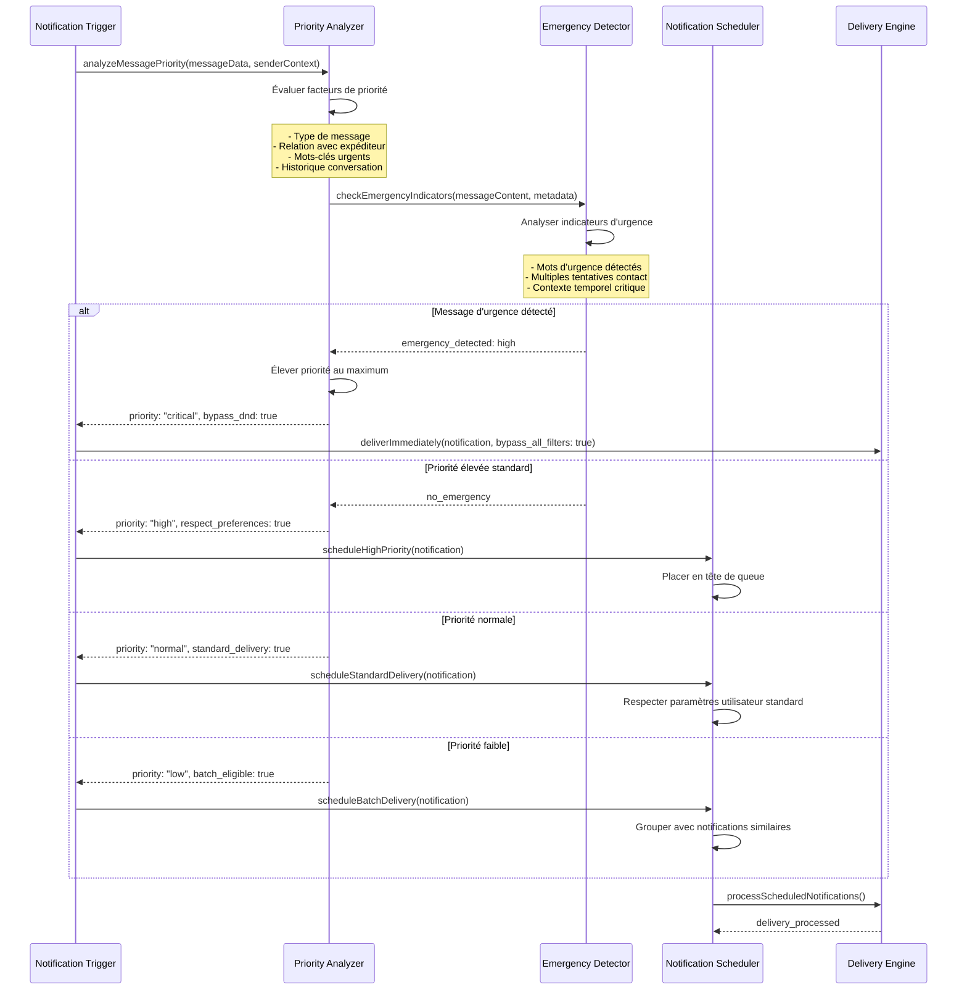
```mermaid
sequenceDiagram
    participant NT as Notification Trigger
    participant Priority as Priority Analyzer
    participant Emergency as Emergency Detector
    participant Scheduler as Notification Scheduler
    participant Delivery as Delivery Engine
    
    NT->>Priority: analyzeMessagePriority(messageData, senderContext)
    
    Priority->>Priority: Évaluer facteurs de priorité
    Note over Priority: - Type de message<br/>- Relation avec expéditeur<br/>- Mots-clés urgents<br/>- Historique conversation
    
    Priority->>Emergency: checkEmergencyIndicators(messageContent, metadata)
    Emergency->>Emergency: Analyser indicateurs d'urgence
    Note over Emergency: - Mots d'urgence détectés<br/>- Multiples tentatives contact<br/>- Contexte temporel critique
    
    alt Message d'urgence détecté
        Emergency-->>Priority: emergency_detected: high
        Priority->>Priority: Élever priorité au maximum
        Priority-->>NT: priority: "critical", bypass_dnd: true
        
        NT->>Delivery: deliverImmediately(notification, bypass_all_filters: true)
        
    else Priorité élevée standard
        Emergency-->>Priority: no_emergency
        Priority-->>NT: priority: "high", respect_preferences: true
        
        NT->>Scheduler: scheduleHighPriority(notification)
        Scheduler->>Scheduler: Placer en tête de queue
        
    else Priorité normale
        Priority-->>NT: priority: "normal", standard_delivery: true
        
        NT->>Scheduler: scheduleStandardDelivery(notification)
        Scheduler->>Scheduler: Respecter paramètres utilisateur standard
        
    else Priorité faible
        Priority-->>NT: priority: "low", batch_eligible: true
        
        NT->>Scheduler: scheduleBatchDelivery(notification)
        Scheduler->>Scheduler: Grouper avec notifications similaires
    end
    
    Scheduler->>Delivery: processScheduledNotifications()
    Delivery-->>Scheduler: delivery_processed
```

### 2.3 Déclenchement pour les conversations de groupe

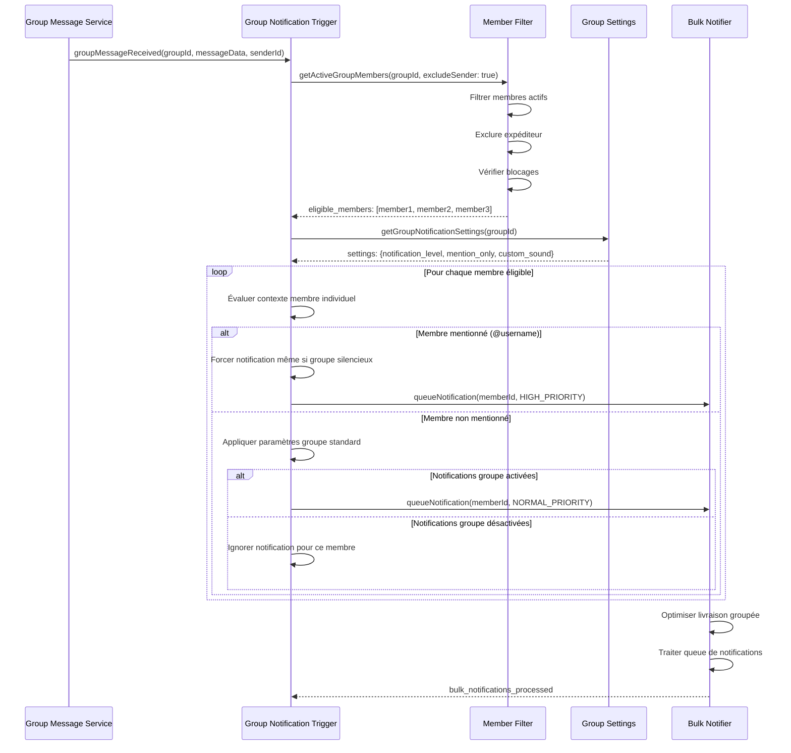
```mermaid
sequenceDiagram
    participant GMS as Group Message Service
    participant GNT as Group Notification Trigger
    participant MemberFilter as Member Filter
    participant GroupSettings as Group Settings
    participant BulkNotifier as Bulk Notifier
    
    GMS->>GNT: groupMessageReceived(groupId, messageData, senderId)
    GNT->>MemberFilter: getActiveGroupMembers(groupId, excludeSender: true)
    
    MemberFilter->>MemberFilter: Filtrer membres actifs
    MemberFilter->>MemberFilter: Exclure expéditeur
    MemberFilter->>MemberFilter: Vérifier blocages
    MemberFilter-->>GNT: eligible_members: [member1, member2, member3]
    
    GNT->>GroupSettings: getGroupNotificationSettings(groupId)
    GroupSettings-->>GNT: settings: {notification_level, mention_only, custom_sound}
    
    loop Pour chaque membre éligible
        GNT->>GNT: Évaluer contexte membre individuel
        
        alt Membre mentionné (@username)
            GNT->>GNT: Forcer notification même si groupe silencieux
            GNT->>BulkNotifier: queueNotification(memberId, HIGH_PRIORITY)
            
        else Membre non mentionné
            GNT->>GNT: Appliquer paramètres groupe standard
            
            alt Notifications groupe activées
                GNT->>BulkNotifier: queueNotification(memberId, NORMAL_PRIORITY)
            else Notifications groupe désactivées
                GNT->>GNT: Ignorer notification pour ce membre
            end
        end
    end
    
    BulkNotifier->>BulkNotifier: Optimiser livraison groupée
    BulkNotifier->>BulkNotifier: Traiter queue de notifications
    BulkNotifier-->>GNT: bulk_notifications_processed
```

## 3. Sécurisation du contenu des notifications

### 3.1 Protection de la confidentialité dans les notifications

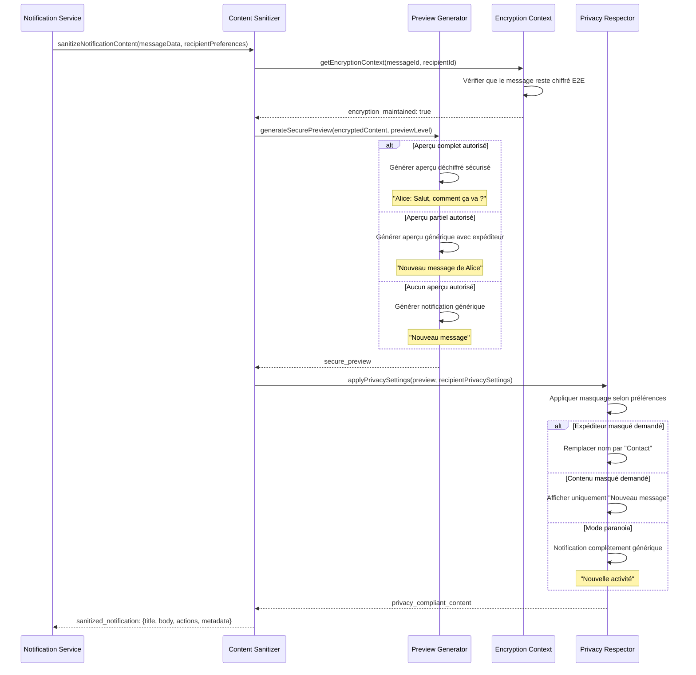
```mermaid
sequenceDiagram
    participant NS as Notification Service
    participant CS as Content Sanitizer
    participant PG as Preview Generator
    participant EC as Encryption Context
    participant PR as Privacy Respector
    
    NS->>CS: sanitizeNotificationContent(messageData, recipientPreferences)
    CS->>EC: getEncryptionContext(messageId, recipientId)
    
    EC->>EC: Vérifier que le message reste chiffré E2E
    EC-->>CS: encryption_maintained: true
    
    CS->>PG: generateSecurePreview(encryptedContent, previewLevel)
    
    alt Aperçu complet autorisé
        PG->>PG: Générer aperçu déchiffré sécurisé
        Note over PG: "Alice: Salut, comment ça va ?"
        
    else Aperçu partiel autorisé
        PG->>PG: Générer aperçu générique avec expéditeur
        Note over PG: "Nouveau message de Alice"
        
    else Aucun aperçu autorisé
        PG->>PG: Générer notification générique
        Note over PG: "Nouveau message"
    end
    
    PG-->>CS: secure_preview
    
    CS->>PR: applyPrivacySettings(preview, recipientPrivacySettings)
    PR->>PR: Appliquer masquage selon préférences
    
    alt Expéditeur masqué demandé
        PR->>PR: Remplacer nom par "Contact"
        
    else Contenu masqué demandé
        PR->>PR: Afficher uniquement "Nouveau message"
        
    else Mode paranoia
        PR->>PR: Notification complètement générique
        Note over PR: "Nouvelle activité"
    end
    
    PR-->>CS: privacy_compliant_content
    CS-->>NS: sanitized_notification: {title, body, actions, metadata}
```

### 3.2 Gestion des métadonnées sensibles

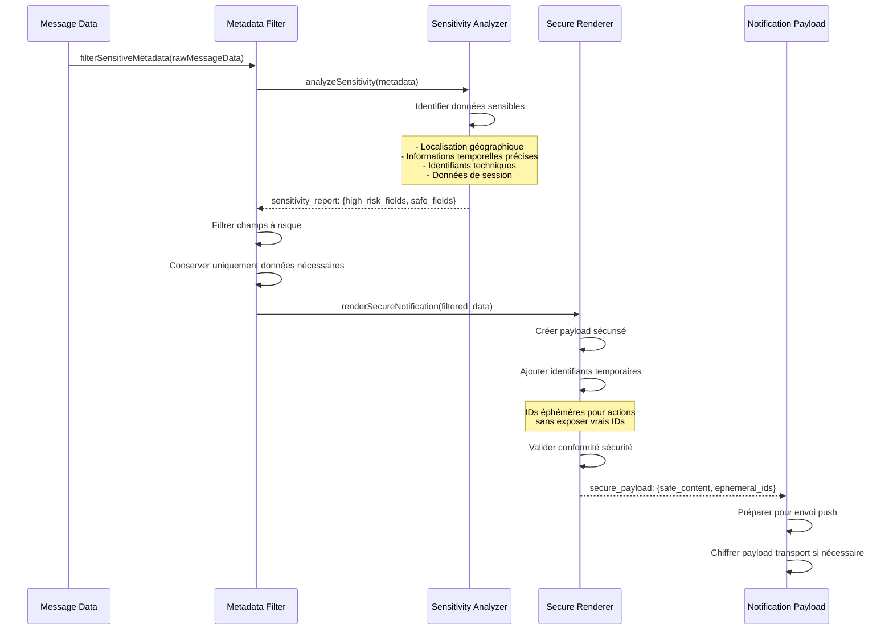
```mermaid
sequenceDiagram
    participant MessageData as Message Data
    participant MetadataFilter as Metadata Filter
    participant SensitivityAnalyzer as Sensitivity Analyzer
    participant SecureRenderer as Secure Renderer
    participant NotificationPayload as Notification Payload
    
    MessageData->>MetadataFilter: filterSensitiveMetadata(rawMessageData)
    MetadataFilter->>SensitivityAnalyzer: analyzeSensitivity(metadata)
    
    SensitivityAnalyzer->>SensitivityAnalyzer: Identifier données sensibles
    Note over SensitivityAnalyzer: - Localisation géographique<br/>- Informations temporelles précises<br/>- Identifiants techniques<br/>- Données de session
    
    SensitivityAnalyzer-->>MetadataFilter: sensitivity_report: {high_risk_fields, safe_fields}
    
    MetadataFilter->>MetadataFilter: Filtrer champs à risque
    MetadataFilter->>MetadataFilter: Conserver uniquement données nécessaires
    
    MetadataFilter->>SecureRenderer: renderSecureNotification(filtered_data)
    SecureRenderer->>SecureRenderer: Créer payload sécurisé
    
    SecureRenderer->>SecureRenderer: Ajouter identifiants temporaires
    Note over SecureRenderer: IDs éphémères pour actions<br/>sans exposer vrais IDs
    
    SecureRenderer->>SecureRenderer: Valider conformité sécurité
    SecureRenderer-->>NotificationPayload: secure_payload: {safe_content, ephemeral_ids}
    
    NotificationPayload->>NotificationPayload: Préparer pour envoi push
    NotificationPayload->>NotificationPayload: Chiffrer payload transport si nécessaire
```

### 3.3 Actions sécurisées dans les notifications

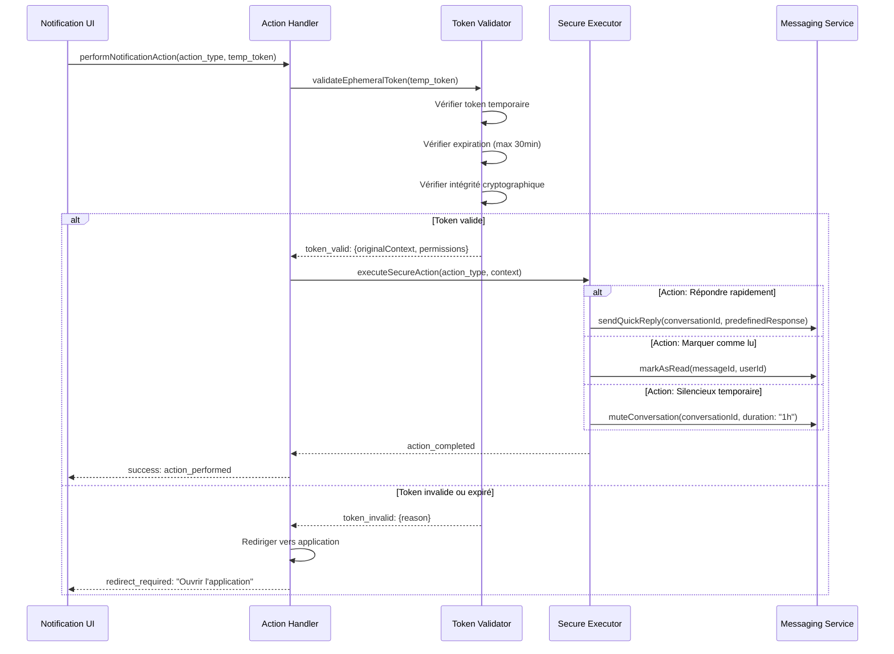
```mermaid
sequenceDiagram
    participant NotificationUI as Notification UI
    participant ActionHandler as Action Handler
    participant TokenValidator as Token Validator
    participant SecureExecutor as Secure Executor
    participant MessagingService as Messaging Service
    
    NotificationUI->>ActionHandler: performNotificationAction(action_type, temp_token)
    ActionHandler->>TokenValidator: validateEphemeralToken(temp_token)
    
    TokenValidator->>TokenValidator: Vérifier token temporaire
    TokenValidator->>TokenValidator: Vérifier expiration (max 30min)
    TokenValidator->>TokenValidator: Vérifier intégrité cryptographique
    
    alt Token valide
        TokenValidator-->>ActionHandler: token_valid: {originalContext, permissions}
        
        ActionHandler->>SecureExecutor: executeSecureAction(action_type, context)
        
        alt Action: Répondre rapidement
            SecureExecutor->>MessagingService: sendQuickReply(conversationId, predefinedResponse)
            
        else Action: Marquer comme lu
            SecureExecutor->>MessagingService: markAsRead(messageId, userId)
            
        else Action: Silencieux temporaire
            SecureExecutor->>MessagingService: muteConversation(conversationId, duration: "1h")
        end
        
        SecureExecutor-->>ActionHandler: action_completed
        ActionHandler-->>NotificationUI: success: action_performed
        
    else Token invalide ou expiré
        TokenValidator-->>ActionHandler: token_invalid: {reason}
        ActionHandler->>ActionHandler: Rediriger vers application
        ActionHandler-->>NotificationUI: redirect_required: "Ouvrir l'application"
    end
```

## 4. Paramètres utilisateur et personnalisation

### 4.1 Interface de configuration des notifications

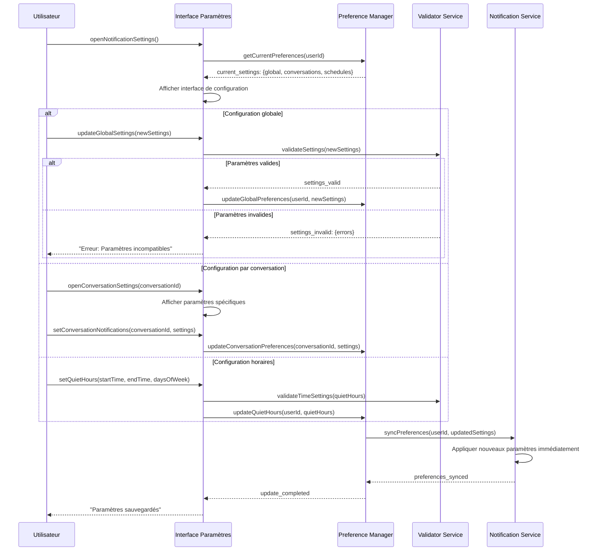
```mermaid
sequenceDiagram
    participant User as Utilisateur
    participant SettingsUI as Interface Paramètres
    participant PreferenceManager as Preference Manager
    participant ValidatorService as Validator Service
    participant NotificationService as Notification Service
    
    User->>SettingsUI: openNotificationSettings()
    SettingsUI->>PreferenceManager: getCurrentPreferences(userId)
    PreferenceManager-->>SettingsUI: current_settings: {global, conversations, schedules}
    
    SettingsUI->>SettingsUI: Afficher interface de configuration
    
    alt Configuration globale
        User->>SettingsUI: updateGlobalSettings(newSettings)
        SettingsUI->>ValidatorService: validateSettings(newSettings)
        
        alt Paramètres valides
            ValidatorService-->>SettingsUI: settings_valid
            SettingsUI->>PreferenceManager: updateGlobalPreferences(userId, newSettings)
            
        else Paramètres invalides
            ValidatorService-->>SettingsUI: settings_invalid: {errors}
            SettingsUI-->>User: "Erreur: Paramètres incompatibles"
        end
        
    else Configuration par conversation
        User->>SettingsUI: openConversationSettings(conversationId)
        SettingsUI->>SettingsUI: Afficher paramètres spécifiques
        
        User->>SettingsUI: setConversationNotifications(conversationId, settings)
        SettingsUI->>PreferenceManager: updateConversationPreferences(conversationId, settings)
        
    else Configuration horaires
        User->>SettingsUI: setQuietHours(startTime, endTime, daysOfWeek)
        SettingsUI->>ValidatorService: validateTimeSettings(quietHours)
        SettingsUI->>PreferenceManager: updateQuietHours(userId, quietHours)
    end
    
    PreferenceManager->>NotificationService: syncPreferences(userId, updatedSettings)
    NotificationService->>NotificationService: Appliquer nouveaux paramètres immédiatement
    NotificationService-->>PreferenceManager: preferences_synced
    
    PreferenceManager-->>SettingsUI: update_completed
    SettingsUI-->>User: "Paramètres sauvegardés"
```

### 4.2 Paramètres de notification par type


```mermaid
graph TD
    A[Paramètres de Notification] --> B[Messages Directs]
    A --> C[Messages de Groupe]
    A --> D[Réactions et Interactions]
    A --> E[Événements Système]
    
    B --> B1[Tous les messages]
    B --> B2[Contacts seulement]
    B --> B3[Favorites uniquement]
    B --> B4[Aucune notification]
    
    C --> C1[Tous les groupes]
    C --> C2[Mentions seulement]
    C --> C3[Groupes favoris]
    C --> C4[Administrateurs seulement]
    
    D --> D1[Toutes les réactions]
    D --> D2[Réactions à mes messages]
    D --> D3[Jamais]
    
    E --> E1[Sécurité: Toujours]
    E --> E2[Synchronisation: Jamais]
    E --> E3[Système: Configurable]
    
    style A fill:#9cf,stroke:#333,stroke-width:2px
    style E1 fill:#f99,stroke:#333,stroke-width:2px
    style B4 fill:#ccc,stroke:#333,stroke-width:1px
```

### 4.3 Personnalisation contextuelle intelligente

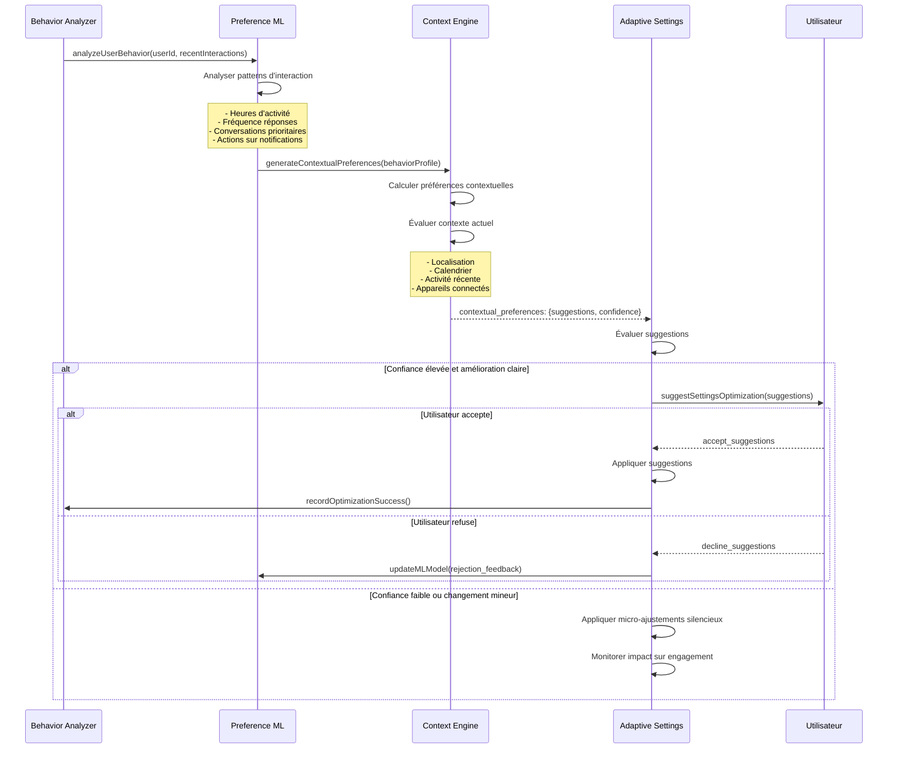
```mermaid
sequenceDiagram
    participant BehaviorAnalyzer as Behavior Analyzer
    participant PreferenceML as Preference ML
    participant ContextEngine as Context Engine
    participant AdaptiveSettings as Adaptive Settings
    participant User as Utilisateur
    
    BehaviorAnalyzer->>PreferenceML: analyzeUserBehavior(userId, recentInteractions)
    PreferenceML->>PreferenceML: Analyser patterns d'interaction
    Note over PreferenceML: - Heures d'activité<br/>- Fréquence réponses<br/>- Conversations prioritaires<br/>- Actions sur notifications
    
    PreferenceML->>ContextEngine: generateContextualPreferences(behaviorProfile)
    ContextEngine->>ContextEngine: Calculer préférences contextuelles
    
    ContextEngine->>ContextEngine: Évaluer contexte actuel
    Note over ContextEngine: - Localisation<br/>- Calendrier<br/>- Activité récente<br/>- Appareils connectés
    
    ContextEngine-->>AdaptiveSettings: contextual_preferences: {suggestions, confidence}
    
    AdaptiveSettings->>AdaptiveSettings: Évaluer suggestions
    
    alt Confiance élevée et amélioration claire
        AdaptiveSettings->>User: suggestSettingsOptimization(suggestions)
        
        alt Utilisateur accepte
            User-->>AdaptiveSettings: accept_suggestions
            AdaptiveSettings->>AdaptiveSettings: Appliquer suggestions
            AdaptiveSettings->>BehaviorAnalyzer: recordOptimizationSuccess()
            
        else Utilisateur refuse
            User-->>AdaptiveSettings: decline_suggestions
            AdaptiveSettings->>PreferenceML: updateMLModel(rejection_feedback)
        end
        
    else Confiance faible ou changement mineur
        AdaptiveSettings->>AdaptiveSettings: Appliquer micro-ajustements silencieux
        AdaptiveSettings->>AdaptiveSettings: Monitorer impact sur engagement
    end
```

## 5. Routage multi-plateforme

### 5.1 Sélection de la plateforme et routage

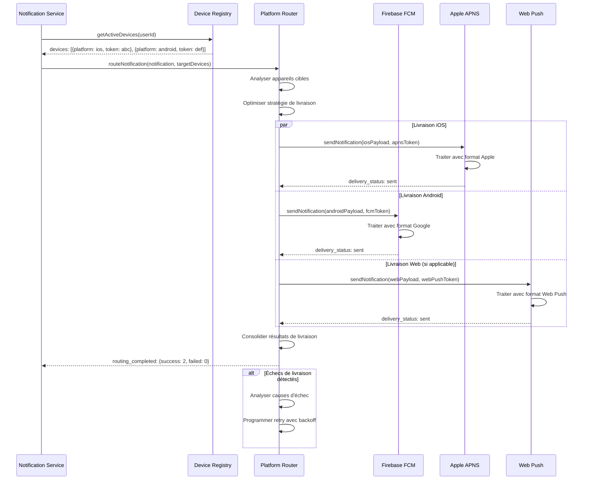
```mermaid
sequenceDiagram
    participant NS as Notification Service
    participant DR as Device Registry
    participant PR as Platform Router
    participant FCM as Firebase FCM
    participant APNS as Apple APNS
    participant WP as Web Push
    
    NS->>DR: getActiveDevices(userId)
    DR-->>NS: devices: [{platform: ios, token: abc}, {platform: android, token: def}]
    
    NS->>PR: routeNotification(notification, targetDevices)
    PR->>PR: Analyser appareils cibles
    PR->>PR: Optimiser stratégie de livraison
    
    par Livraison iOS
        PR->>APNS: sendNotification(iosPayload, apnsToken)
        APNS->>APNS: Traiter avec format Apple
        APNS-->>PR: delivery_status: sent
        
    and Livraison Android
        PR->>FCM: sendNotification(androidPayload, fcmToken)
        FCM->>FCM: Traiter avec format Google
        FCM-->>PR: delivery_status: sent
        
    and Livraison Web (si applicable)
        PR->>WP: sendNotification(webPayload, webPushToken)
        WP->>WP: Traiter avec format Web Push
        WP-->>PR: delivery_status: sent
    end
    
    PR->>PR: Consolider résultats de livraison
    PR-->>NS: routing_completed: {success: 2, failed: 0}
    
    alt Échecs de livraison détectés
        PR->>PR: Analyser causes d'échec
        PR->>PR: Programmer retry avec backoff
    end
```

### 5.2 Adaptation du contenu par plateforme

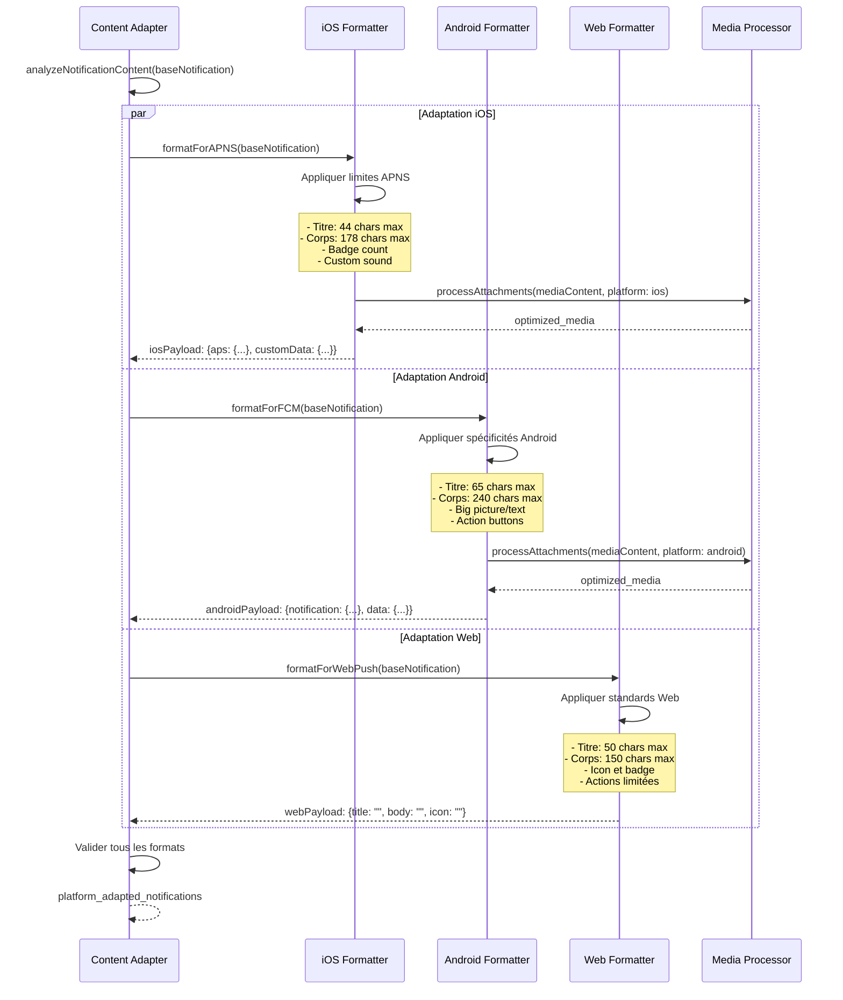
```mermaid
sequenceDiagram
    participant ContentAdapter as Content Adapter
    participant iOSFormatter as iOS Formatter
    participant AndroidFormatter as Android Formatter
    participant WebFormatter as Web Formatter
    participant MediaProcessor as Media Processor
    
    ContentAdapter->>ContentAdapter: analyzeNotificationContent(baseNotification)
    
    par Adaptation iOS
        ContentAdapter->>iOSFormatter: formatForAPNS(baseNotification)
        iOSFormatter->>iOSFormatter: Appliquer limites APNS
        Note over iOSFormatter: - Titre: 44 chars max<br/>- Corps: 178 chars max<br/>- Badge count<br/>- Custom sound
        
        iOSFormatter->>MediaProcessor: processAttachments(mediaContent, platform: ios)
        MediaProcessor-->>iOSFormatter: optimized_media
        
        iOSFormatter-->>ContentAdapter: iosPayload: {aps: {...}, customData: {...}}
        
    and Adaptation Android
        ContentAdapter->>AndroidFormatter: formatForFCM(baseNotification)
        AndroidFormatter->>AndroidFormatter: Appliquer spécificités Android
        Note over AndroidFormatter: - Titre: 65 chars max<br/>- Corps: 240 chars max<br/>- Big picture/text<br/>- Action buttons
        
        AndroidFormatter->>MediaProcessor: processAttachments(mediaContent, platform: android)
        MediaProcessor-->>AndroidFormatter: optimized_media
        
        AndroidFormatter-->>ContentAdapter: androidPayload: {notification: {...}, data: {...}}
        
    and Adaptation Web
        ContentAdapter->>WebFormatter: formatForWebPush(baseNotification)
        WebFormatter->>WebFormatter: Appliquer standards Web
        Note over WebFormatter: - Titre: 50 chars max<br/>- Corps: 150 chars max<br/>- Icon et badge<br/>- Actions limitées
        
        WebFormatter-->>ContentAdapter: webPayload: {title: "", body: "", icon: ""}
    end
    
    ContentAdapter->>ContentAdapter: Valider tous les formats
    ContentAdapter-->>ContentAdapter: platform_adapted_notifications
```

### 5.3 Gestion des échecs et retry

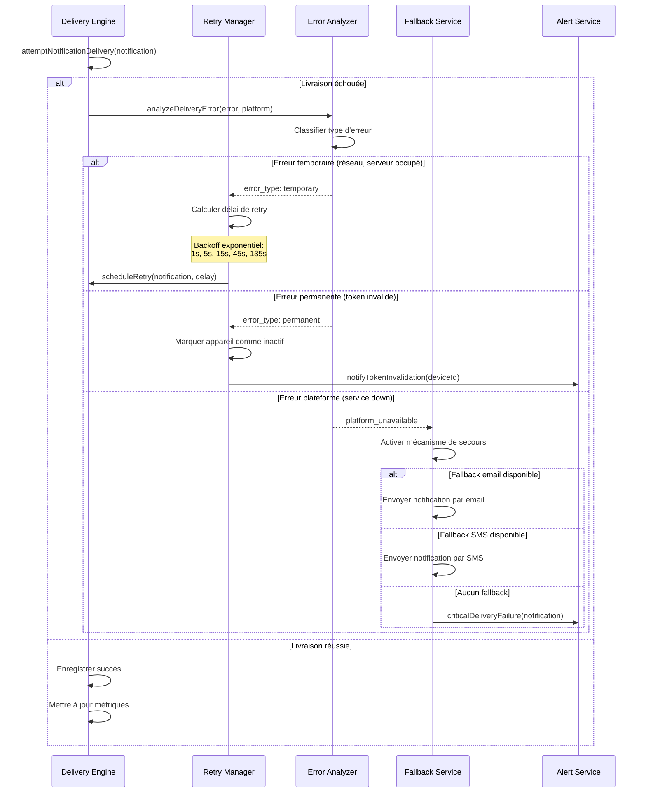
```mermaid
sequenceDiagram
    participant DeliveryEngine as Delivery Engine
    participant RetryManager as Retry Manager
    participant ErrorAnalyzer as Error Analyzer
    participant FallbackService as Fallback Service
    participant AlertService as Alert Service
    
    DeliveryEngine->>DeliveryEngine: attemptNotificationDelivery(notification)
    
    alt Livraison échouée
        DeliveryEngine->>ErrorAnalyzer: analyzeDeliveryError(error, platform)
        ErrorAnalyzer->>ErrorAnalyzer: Classifier type d'erreur
        
        alt Erreur temporaire (réseau, serveur occupé)
            ErrorAnalyzer-->>RetryManager: error_type: temporary
            RetryManager->>RetryManager: Calculer délai de retry
            Note over RetryManager: Backoff exponentiel:<br/>1s, 5s, 15s, 45s, 135s
            
            RetryManager->>DeliveryEngine: scheduleRetry(notification, delay)
            
        else Erreur permanente (token invalide)
            ErrorAnalyzer-->>RetryManager: error_type: permanent
            RetryManager->>RetryManager: Marquer appareil comme inactif
            RetryManager->>AlertService: notifyTokenInvalidation(deviceId)
            
        else Erreur plateforme (service down)
            ErrorAnalyzer-->>FallbackService: platform_unavailable
            FallbackService->>FallbackService: Activer mécanisme de secours
            
            alt Fallback email disponible
                FallbackService->>FallbackService: Envoyer notification par email
            else Fallback SMS disponible
                FallbackService->>FallbackService: Envoyer notification par SMS
            else Aucun fallback
                FallbackService->>AlertService: criticalDeliveryFailure(notification)
            end
        end
        
    else Livraison réussie
        DeliveryEngine->>DeliveryEngine: Enregistrer succès
        DeliveryEngine->>DeliveryEngine: Mettre à jour métriques
    end
```

## 6. Groupement et optimisation des notifications

### 6.1 Agrégation intelligente des notifications

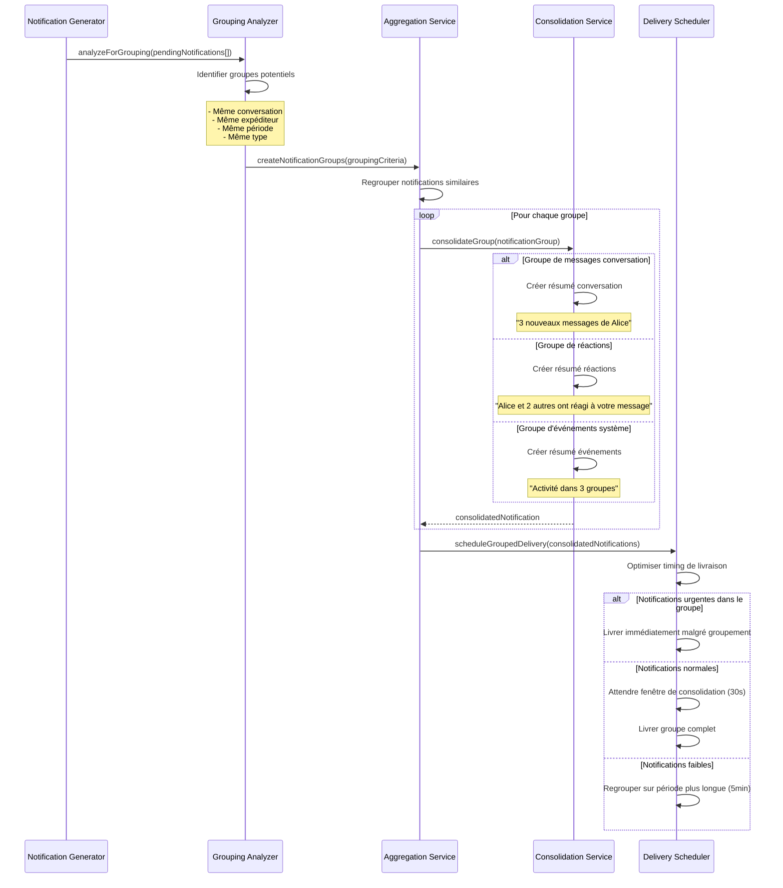
```mermaid
sequenceDiagram
    participant NG as Notification Generator
    participant GA as Grouping Analyzer
    participant AS as Aggregation Service
    participant CS as Consolidation Service
    participant DS as Delivery Scheduler
    
    NG->>GA: analyzeForGrouping(pendingNotifications[])
    GA->>GA: Identifier groupes potentiels
    Note over GA: - Même conversation<br/>- Même expéditeur<br/>- Même période<br/>- Même type
    
    GA->>AS: createNotificationGroups(groupingCriteria)
    AS->>AS: Regrouper notifications similaires
    
    loop Pour chaque groupe
        AS->>CS: consolidateGroup(notificationGroup)
        
        alt Groupe de messages conversation
            CS->>CS: Créer résumé conversation
            Note over CS: "3 nouveaux messages de Alice"
            
        else Groupe de réactions
            CS->>CS: Créer résumé réactions
            Note over CS: "Alice et 2 autres ont réagi à votre message"
            
        else Groupe d'événements système
            CS->>CS: Créer résumé événements
            Note over CS: "Activité dans 3 groupes"
        end
        
        CS-->>AS: consolidatedNotification
    end
    
    AS->>DS: scheduleGroupedDelivery(consolidatedNotifications)
    DS->>DS: Optimiser timing de livraison
    
    alt Notifications urgentes dans le groupe
        DS->>DS: Livrer immédiatement malgré groupement
        
    else Notifications normales
        DS->>DS: Attendre fenêtre de consolidation (30s)
        DS->>DS: Livrer groupe complet
        
    else Notifications faibles
        DS->>DS: Regrouper sur période plus longue (5min)
    end
```

### 6.2 Optimisation temporelle

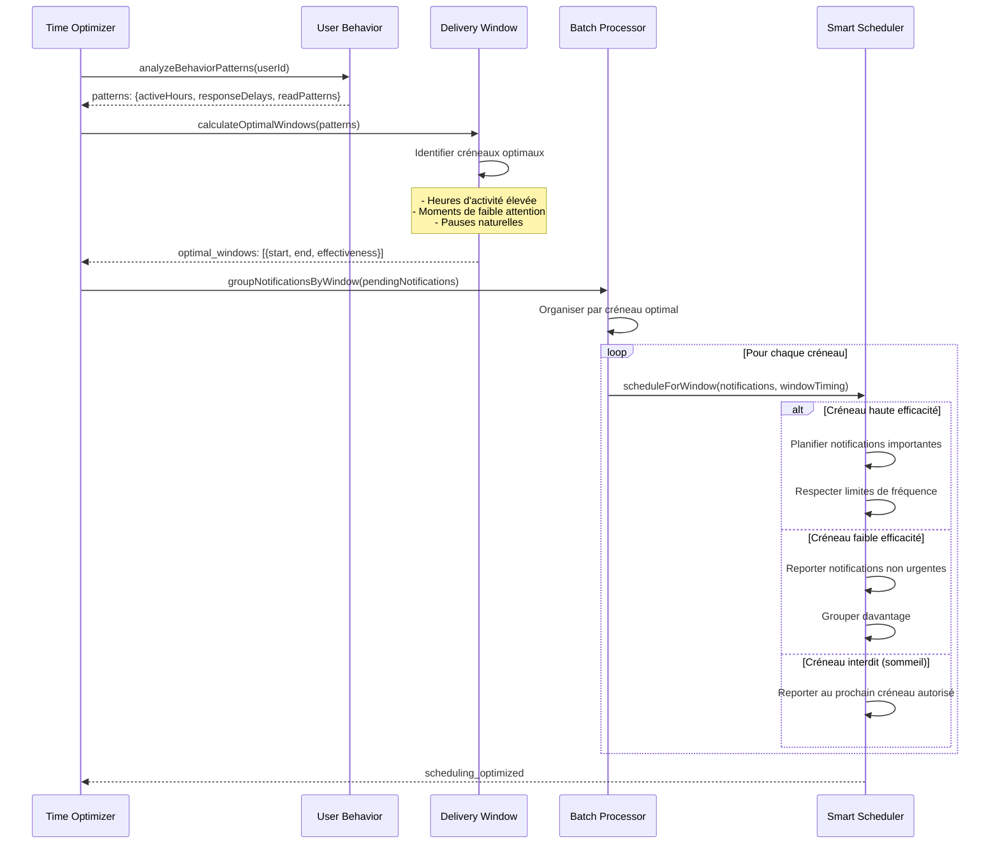
```mermaid
sequenceDiagram
    participant TimeOptimizer as Time Optimizer
    participant UserBehavior as User Behavior
    participant DeliveryWindow as Delivery Window
    participant BatchProcessor as Batch Processor
    participant SmartScheduler as Smart Scheduler
    
    TimeOptimizer->>UserBehavior: analyzeBehaviorPatterns(userId)
    UserBehavior-->>TimeOptimizer: patterns: {activeHours, responseDelays, readPatterns}
    
    TimeOptimizer->>DeliveryWindow: calculateOptimalWindows(patterns)
    DeliveryWindow->>DeliveryWindow: Identifier créneaux optimaux
    Note over DeliveryWindow: - Heures d'activité élevée<br/>- Moments de faible attention<br/>- Pauses naturelles
    
    DeliveryWindow-->>TimeOptimizer: optimal_windows: [{start, end, effectiveness}]
    
    TimeOptimizer->>BatchProcessor: groupNotificationsByWindow(pendingNotifications)
    BatchProcessor->>BatchProcessor: Organiser par créneau optimal
    
    loop Pour chaque créneau
        BatchProcessor->>SmartScheduler: scheduleForWindow(notifications, windowTiming)
        
        alt Créneau haute efficacité
            SmartScheduler->>SmartScheduler: Planifier notifications importantes
            SmartScheduler->>SmartScheduler: Respecter limites de fréquence
            
        else Créneau faible efficacité
            SmartScheduler->>SmartScheduler: Reporter notifications non urgentes
            SmartScheduler->>SmartScheduler: Grouper davantage
            
        else Créneau interdit (sommeil)
            SmartScheduler->>SmartScheduler: Reporter au prochain créneau autorisé
        end
    end
    
    SmartScheduler-->>TimeOptimizer: scheduling_optimized
```

### 6.3 Adaptation dynamique selon l'engagement

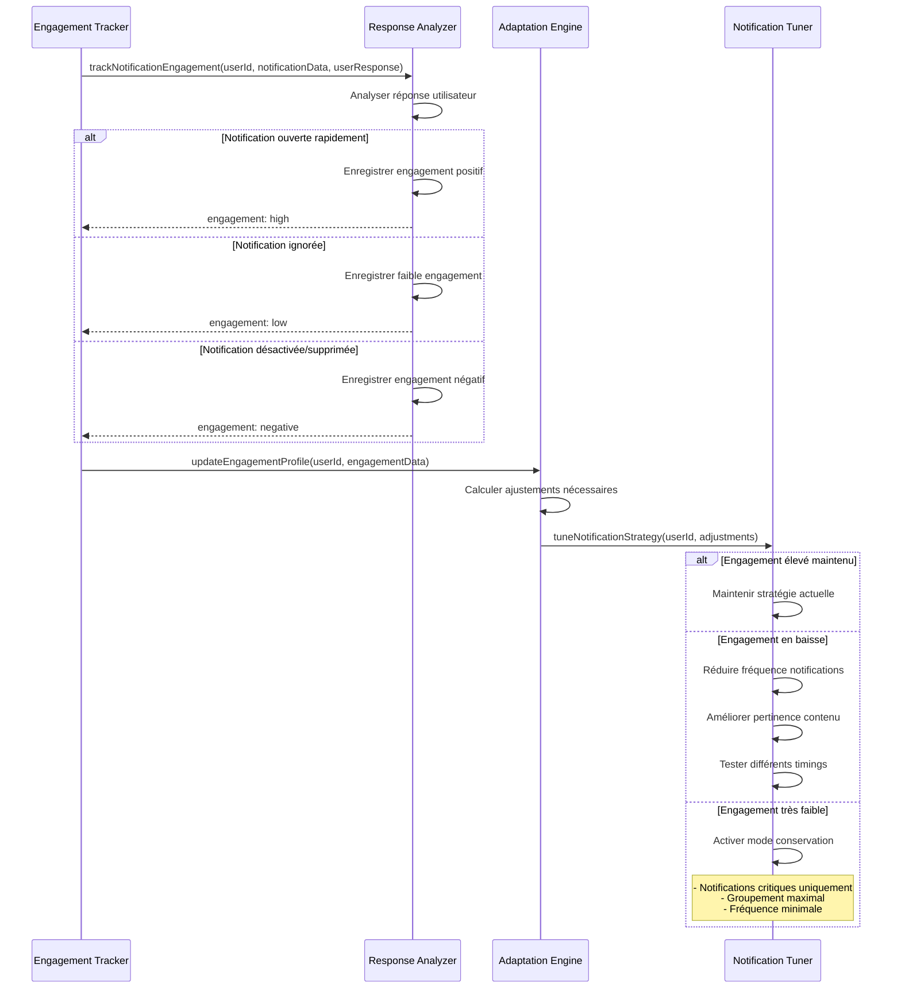
```mermaid
sequenceDiagram
    participant EngagementTracker as Engagement Tracker
    participant ResponseAnalyzer as Response Analyzer
    participant AdaptationEngine as Adaptation Engine
    participant NotificationTuner as Notification Tuner
    
    EngagementTracker->>ResponseAnalyzer: trackNotificationEngagement(userId, notificationData, userResponse)
    ResponseAnalyzer->>ResponseAnalyzer: Analyser réponse utilisateur
    
    alt Notification ouverte rapidement
        ResponseAnalyzer->>ResponseAnalyzer: Enregistrer engagement positif
        ResponseAnalyzer-->>EngagementTracker: engagement: high
        
    else Notification ignorée
        ResponseAnalyzer->>ResponseAnalyzer: Enregistrer faible engagement
        ResponseAnalyzer-->>EngagementTracker: engagement: low
        
    else Notification désactivée/supprimée
        ResponseAnalyzer->>ResponseAnalyzer: Enregistrer engagement négatif
        ResponseAnalyzer-->>EngagementTracker: engagement: negative
    end
    
    EngagementTracker->>AdaptationEngine: updateEngagementProfile(userId, engagementData)
    AdaptationEngine->>AdaptationEngine: Calculer ajustements nécessaires
    
    AdaptationEngine->>NotificationTuner: tuneNotificationStrategy(userId, adjustments)
    
    alt Engagement élevé maintenu
        NotificationTuner->>NotificationTuner: Maintenir stratégie actuelle
        
    else Engagement en baisse
        NotificationTuner->>NotificationTuner: Réduire fréquence notifications
        NotificationTuner->>NotificationTuner: Améliorer pertinence contenu
        NotificationTuner->>NotificationTuner: Tester différents timings
        
    else Engagement très faible
        NotificationTuner->>NotificationTuner: Activer mode conservation
        Note over NotificationTuner: - Notifications critiques uniquement<br/>- Groupement maximal<br/>- Fréquence minimale
    end
```

## 7. Intégration avec les services

### 7.1 Interface avec Messaging Service

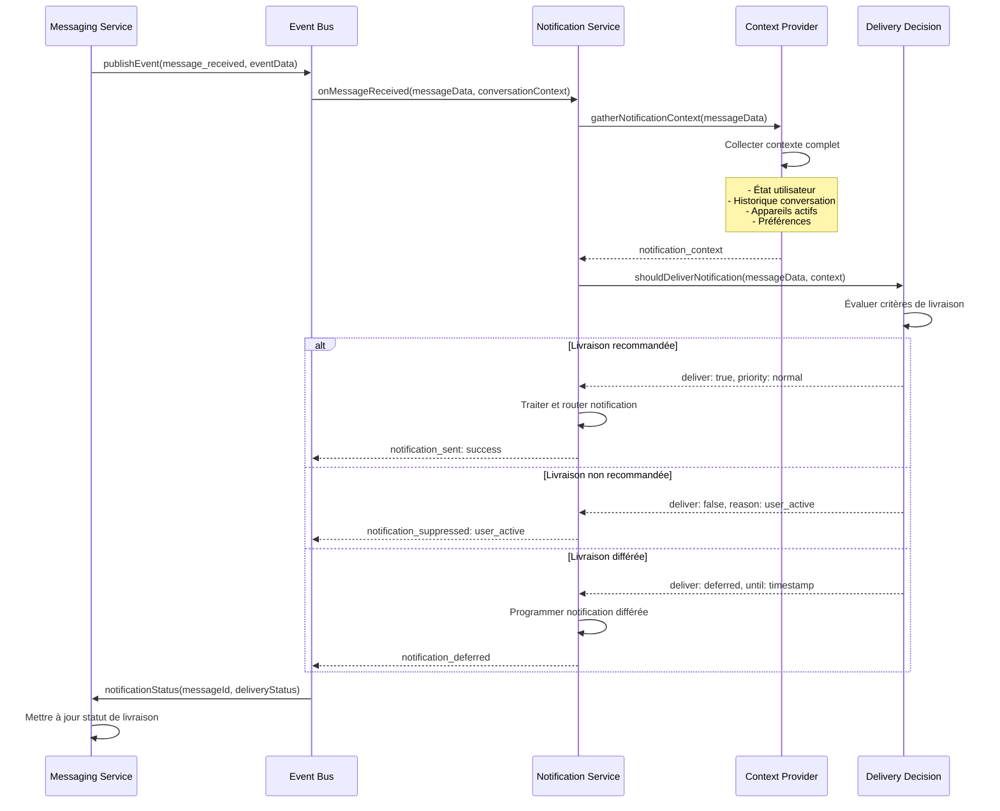
```mermaid
sequenceDiagram
    participant MS as Messaging Service
    participant EventBus as Event Bus
    participant NS as Notification Service
    participant ContextProvider as Context Provider
    participant DeliveryDecision as Delivery Decision
    
    MS->>EventBus: publishEvent(message_received, eventData)
    EventBus->>NS: onMessageReceived(messageData, conversationContext)
    
    NS->>ContextProvider: gatherNotificationContext(messageData)
    ContextProvider->>ContextProvider: Collecter contexte complet
    Note over ContextProvider: - État utilisateur<br/>- Historique conversation<br/>- Appareils actifs<br/>- Préférences
    
    ContextProvider-->>NS: notification_context
    
    NS->>DeliveryDecision: shouldDeliverNotification(messageData, context)
    DeliveryDecision->>DeliveryDecision: Évaluer critères de livraison
    
    alt Livraison recommandée
        DeliveryDecision-->>NS: deliver: true, priority: normal
        NS->>NS: Traiter et router notification
        NS-->>EventBus: notification_sent: success
        
    else Livraison non recommandée
        DeliveryDecision-->>NS: deliver: false, reason: user_active
        NS-->>EventBus: notification_suppressed: user_active
        
    else Livraison différée
        DeliveryDecision-->>NS: deliver: deferred, until: timestamp
        NS->>NS: Programmer notification différée
        NS-->>EventBus: notification_deferred
    end
    
    EventBus->>MS: notificationStatus(messageId, deliveryStatus)
    MS->>MS: Mettre à jour statut de livraison
```

### 7.2 Interface avec User Service

```mermaid
sequenceDiagram
    participant NS as Notification Service
    participant US as User Service
    participant PP as Preference Provider
    participant RS as Relationship Service
    participant PS as Privacy Service
    
    NS->>US: requestNotificationContext(recipientId, senderId)
    US->>PP: getUserNotificationPreferences(recipientId)
    PP-->>US: preferences: {global, conversation_specific, time_based}
    
    US->>RS: checkRelationship(recipientId, senderId)
    RS->>RS: Analyser relation entre utilisateurs
    RS-->>US: relationship: {type: "contact", blocked: false, favorite: true}
    
    US->>PS: checkPrivacySettings(recipientId, notification_context)
    PS->>PS: Évaluer paramètres de confidentialité
    PS-->>US: privacy_settings: {allow_content_preview: true, show_sender: true}
    
    US->>US: Consolider contexte de notification
    US-->>NS: notification_context: {
        preferences: preferences,
        relationship: relationship,
        privacy: privacy_settings,
        overrides: conversation_specific_settings
    }
    
    NS->>NS: Appliquer contexte à la notification
```

### 7.3 Interface avec Device Registry

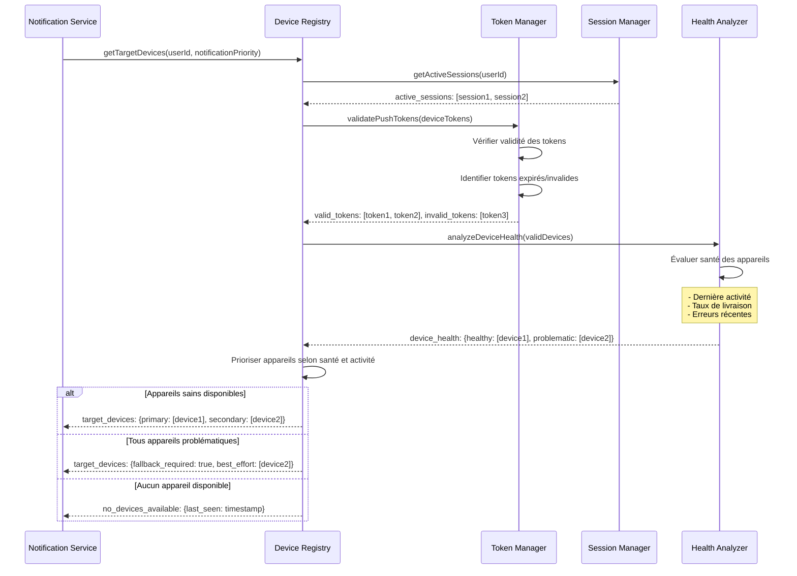
```mermaid
sequenceDiagram
    participant NS as Notification Service
    participant DR as Device Registry
    participant TM as Token Manager
    participant SM as Session Manager
    participant HA as Health Analyzer
    
    NS->>DR: getTargetDevices(userId, notificationPriority)
    DR->>SM: getActiveSessions(userId)
    SM-->>DR: active_sessions: [session1, session2]
    
    DR->>TM: validatePushTokens(deviceTokens)
    TM->>TM: Vérifier validité des tokens
    TM->>TM: Identifier tokens expirés/invalides
    TM-->>DR: valid_tokens: [token1, token2], invalid_tokens: [token3]
    
    DR->>HA: analyzeDeviceHealth(validDevices)
    HA->>HA: Évaluer santé des appareils
    Note over HA: - Dernière activité<br/>- Taux de livraison<br/>- Erreurs récentes
    
    HA-->>DR: device_health: {healthy: [device1], problematic: [device2]}
    
    DR->>DR: Prioriser appareils selon santé et activité
    
    alt Appareils sains disponibles
        DR-->>NS: target_devices: {primary: [device1], secondary: [device2]}
        
    else Tous appareils problématiques
        DR-->>NS: target_devices: {fallback_required: true, best_effort: [device2]}
        
    else Aucun appareil disponible
        DR-->>NS: no_devices_available: {last_seen: timestamp}
    end
```

## 8. Considérations techniques

### 8.1 Architecture de données

#### Tables de gestion des notifications
```sql
-- Préférences de notification par utilisateur
CREATE TABLE notification_preferences (
    id UUID PRIMARY KEY DEFAULT uuid_generate_v4(),
    user_id UUID NOT NULL,
    global_enabled BOOLEAN DEFAULT TRUE,
    message_notifications BOOLEAN DEFAULT TRUE,
    group_notifications BOOLEAN DEFAULT TRUE,
    reaction_notifications BOOLEAN DEFAULT FALSE,
    system_notifications BOOLEAN DEFAULT TRUE,
    quiet_hours_start TIME,
    quiet_hours_end TIME,
    quiet_days INTEGER[], -- Jours de la semaine (0-6)
    preview_content BOOLEAN DEFAULT TRUE,
    show_sender BOOLEAN DEFAULT TRUE,
    custom_sound VARCHAR(100),
    vibration_enabled BOOLEAN DEFAULT TRUE,
    updated_at TIMESTAMP NOT NULL DEFAULT NOW(),
    UNIQUE(user_id)
);

-- Préférences par conversation
CREATE TABLE conversation_notification_preferences (
    id UUID PRIMARY KEY DEFAULT uuid_generate_v4(),
    user_id UUID NOT NULL,
    conversation_id UUID NOT NULL,
    notifications_enabled BOOLEAN DEFAULT TRUE,
    mention_only BOOLEAN DEFAULT FALSE,
    custom_sound VARCHAR(100),
    muted_until TIMESTAMP,
    priority_level VARCHAR(20) DEFAULT 'normal',
    created_at TIMESTAMP NOT NULL DEFAULT NOW(),
    updated_at TIMESTAMP NOT NULL DEFAULT NOW(),
    UNIQUE(user_id, conversation_id)
);

-- Tokens de notification par appareil
CREATE TABLE device_notification_tokens (
    id UUID PRIMARY KEY DEFAULT uuid_generate_v4(),
    user_id UUID NOT NULL,
    device_id VARCHAR(100) NOT NULL,
    platform VARCHAR(20) NOT NULL, -- 'ios', 'android', 'web'
    push_token VARCHAR(500) NOT NULL,
    token_valid BOOLEAN DEFAULT TRUE,
    last_used TIMESTAMP DEFAULT NOW(),
    created_at TIMESTAMP NOT NULL DEFAULT NOW(),
    updated_at TIMESTAMP NOT NULL DEFAULT NOW(),
    UNIQUE(user_id, device_id)
);

-- Historique des notifications envoyées
CREATE TABLE notification_history (
    id UUID PRIMARY KEY DEFAULT uuid_generate_v4(),
    user_id UUID NOT NULL,
    message_id UUID,
    notification_type VARCHAR(50) NOT NULL,
    platform VARCHAR(20) NOT NULL,
    sent_at TIMESTAMP NOT NULL DEFAULT NOW(),
    delivered_at TIMESTAMP,
    read_at TIMESTAMP,
    failed_at TIMESTAMP,
    failure_reason TEXT,
    retry_count INTEGER DEFAULT 0
);

-- Métriques d'engagement
CREATE TABLE notification_engagement (
    id UUID PRIMARY KEY DEFAULT uuid_generate_v4(),
    user_id UUID NOT NULL,
    notification_type VARCHAR(50) NOT NULL,
    total_sent INTEGER DEFAULT 0,
    total_delivered INTEGER DEFAULT 0,
    total_opened INTEGER DEFAULT 0,
    total_dismissed INTEGER DEFAULT 0,
    avg_response_time INTERVAL,
    last_updated TIMESTAMP NOT NULL DEFAULT NOW(),
    UNIQUE(user_id, notification_type)
);
```

#### Index d'optimisation
```sql
-- Optimisations pour récupération des préférences
CREATE INDEX idx_notification_preferences_user ON notification_preferences(user_id);
CREATE INDEX idx_conv_notif_prefs_user_conv ON conversation_notification_preferences(user_id, conversation_id);

-- Optimisations pour gestion des tokens
CREATE INDEX idx_device_tokens_user_platform ON device_notification_tokens(user_id, platform);
CREATE INDEX idx_device_tokens_valid ON device_notification_tokens(token_valid, last_used);

-- Optimisations pour historique et métriques
CREATE INDEX idx_notification_history_user_sent ON notification_history(user_id, sent_at DESC);
CREATE INDEX idx_notification_engagement_user ON notification_engagement(user_id);
```

### 8.2 Cache Redis pour optimisation

#### Structures de cache
```redis
# Cache des préférences utilisateur (TTL: 1 heure)
notif:prefs:user:{userId} = {
  "globalEnabled": true,
  "messageNotifications": true,
  "quietHours": {"start": "22:00", "end": "08:00"},
  "previewContent": true,
  "customSound": "default"
}

# Cache des tokens d'appareil (TTL: 6 heures)
notif:tokens:user:{userId} = [
  {
    "deviceId": "device_123",
    "platform": "ios",
    "token": "apns_token_here",
    "valid": true,
    "lastUsed": "2025-05-25T10:30:00Z"
  }
]

# File d'attente des notifications en attente (TTL: 24 heures)
notif:queue:user:{userId} = [
  {
    "notificationId": "notif_456",
    "priority": 1,
    "scheduledFor": "2025-05-25T10:35:00Z",
    "content": {...}
  }
]

# Métriques d'engagement temps réel (TTL: 1 semaine)
notif:engagement:{userId} = {
  "totalSent": 150,
  "totalOpened": 120,
  "engagementRate": 0.8,
  "lastInteraction": "2025-05-25T09:45:00Z"
}
```

### 8.3 Workers Elixir pour traitement asynchrone

#### Worker de traitement des notifications
```elixir
defmodule WhisprNotification.NotificationWorker do
  use GenServer
  
  def init(_) do
    schedule_processing()
    {:ok, %{queue: [], processing: false}}
  end
  
  def handle_cast({:queue_notification, notification}, state) do
    new_queue = [notification | state.queue]
    {:noreply, %{state | queue: new_queue}}
  end
  
  def handle_info(:process_queue, state) do
    if not state.processing and length(state.queue) > 0 do
      spawn(fn -> process_notification_batch(state.queue) end)
      schedule_processing()
      {:noreply, %{queue: [], processing: true}}
    else
      schedule_processing()
      {:noreply, state}
    end
  end
  
  defp process_notification_batch(notifications) do
    notifications
    |> Enum.group_by(&group_key/1)
    |> Enum.each(&process_group/1)
  end
  
  defp schedule_processing do
    Process.send_after(self(), :process_queue, 5_000) # 5 secondes
  end
end
```

#### Worker de retry et gestion d'échecs
```elixir
defmodule WhisprNotification.RetryWorker do
  use GenServer
  
  def handle_info(:retry_failed_notifications, state) do
    failed_notifications = get_failed_notifications()
    
    Enum.each(failed_notifications, fn notification ->
      case should_retry?(notification) do
        true -> retry_notification(notification)
        false -> mark_as_permanently_failed(notification)
      end
    end)
    
    schedule_next_retry()
    {:noreply, state}
  end
  
  defp should_retry?(notification) do
    notification.retry_count < 5 and 
    is_transient_error?(notification.failure_reason)
  end
  
  defp retry_notification(notification) do
    delay = calculate_backoff_delay(notification.retry_count)
    Process.send_after(self(), {:retry, notification.id}, delay)
  end
  
  defp calculate_backoff_delay(retry_count) do
    # Backoff exponentiel: 1s, 5s, 25s, 125s, 625s
    trunc(:math.pow(5, retry_count) * 1000)
  end
end
```

### 8.4 Intégration avec les services push

#### Configuration Firebase FCM
```elixir
defmodule WhisprNotification.FCMClient do
  @fcm_url "https://fcm.googleapis.com/v1/projects/whispr-app/messages:send"
  
  def send_notification(device_token, notification_data) do
    payload = %{
      message: %{
        token: device_token,
        notification: %{
          title: notification_data.title,
          body: notification_data.body,
          image: notification_data.image_url
        },
        data: %{
          conversation_id: notification_data.conversation_id,
          message_id: notification_data.message_id,
          action_token: notification_data.action_token
        },
        android: %{
          priority: "high",
          notification: %{
            channel_id: "whispr_messages",
            sound: notification_data.custom_sound || "default"
          }
        }
      }
    }
    
    headers = [
      {"Authorization", "Bearer #{get_access_token()}"},
      {"Content-Type", "application/json"}
    ]
    
    case HTTPoison.post(@fcm_url, Jason.encode!(payload), headers) do
      {:ok, %{status_code: 200}} -> :ok
      {:ok, %{status_code: status, body: body}} -> 
        {:error, "FCM error: #{status} - #{body}"}
      {:error, reason} -> 
        {:error, "Network error: #{reason}"}
    end
  end
end
```

## 9. Endpoints API

| Endpoint | Méthode | Description | Paramètres |
|----------|---------|-------------|------------|
| `/api/v1/notifications/preferences` | GET | Obtenir préférences notification | - |
| `/api/v1/notifications/preferences` | PUT | Modifier préférences globales | Corps avec nouveaux paramètres |
| `/api/v1/notifications/conversations/{id}/preferences` | PUT | Paramètres par conversation | Corps avec préférences spécifiques |
| `/api/v1/notifications/devices` | GET | Lister appareils enregistrés | - |
| `/api/v1/notifications/devices` | POST | Enregistrer token d'appareil | `platform`, `token`, `device_id` |
| `/api/v1/notifications/devices/{id}` | DELETE | Supprimer appareil | - |
| `/api/v1/notifications/test` | POST | Envoyer notification de test | `device_id`, `content` |
| `/api/v1/notifications/history` | GET | Historique des notifications | `limit`, `offset`, `since` |
| `/api/v1/notifications/engagement` | GET | Métriques d'engagement | `period` |
| `/api/v1/notifications/quiet-hours` | PUT | Configurer heures silencieuses | `start_time`, `end_time`, `days` |

## 10. Tests et validation

### 10.1 Tests fonctionnels
- **Déclenchement contextuel**: Validation des règles de déclenchement selon le contexte
- **Sécurité du contenu**: Vérification de la protection de la confidentialité
- **Préférences utilisateur**: Application correcte des paramètres personnalisés
- **Multi-plateforme**: Cohérence entre iOS, Android et Web

### 10.2 Tests de performance
- **Latence de livraison**: Temps entre événement et réception notification
- **Débit de traitement**: Nombre de notifications traitées par seconde
- **Optimisation groupement**: Efficacité de l'agrégation des notifications
- **Cache performance**: Taux de hit/miss pour les données de préférence

### 10.3 Tests d'intégration
- **Services externes**: FCM, APNS, Web Push
- **Messaging service**: Déclenchement lors de nouveaux messages
- **User service**: Application des relations et préférences
- **Multi-appareils**: Coordination entre appareils d'un même utilisateur

### 10.4 Tests de résilience
- **Échecs de livraison**: Gestion des erreurs et mécanismes de retry
- **Services indisponibles**: Comportement lors de panne des services push
- **Charge élevée**: Performance lors de pics de notifications
- **Tokens invalides**: Gestion des tokens expirés ou révoqués

## 11. Livrables

1. **Service de notifications Elixir** comprenant :
   - Système de déclenchement contextuel intelligent
   - Protection de la confidentialité dans les notifications
   - Routage multi-plateforme optimisé
   - Groupement et optimisation temporelle des notifications

2. **SDK client multi-plateforme** pour :
   - Enregistrement et gestion des tokens push
   - Configuration des préférences utilisateur
   - Actions rapides depuis les notifications
   - Gestion des notifications en arrière-plan

3. **Interface de configuration** :
   - Paramètres détaillés de notification
   - Aperçu en temps réel des notifications
   - Métriques d'engagement et efficacité
   - Tests et diagnostics des notifications

4. **Infrastructure de monitoring** :
   - Métriques de livraison et engagement
   - Alertes sur échecs de notification
   - Tableaux de bord de performance
   - Outils de diagnostic et dépannage

5. **Documentation complète** :
   - Guide d'implémentation par plateforme
   - Meilleures pratiques de notification
   - Procédures de configuration et maintenance
   - Tests automatisés et validation de performance