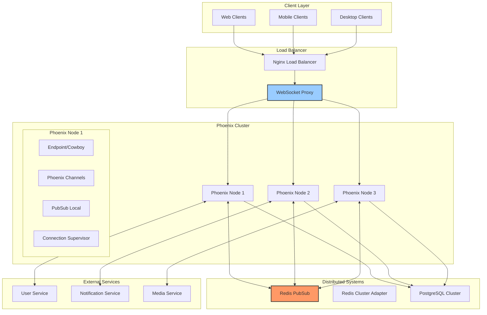
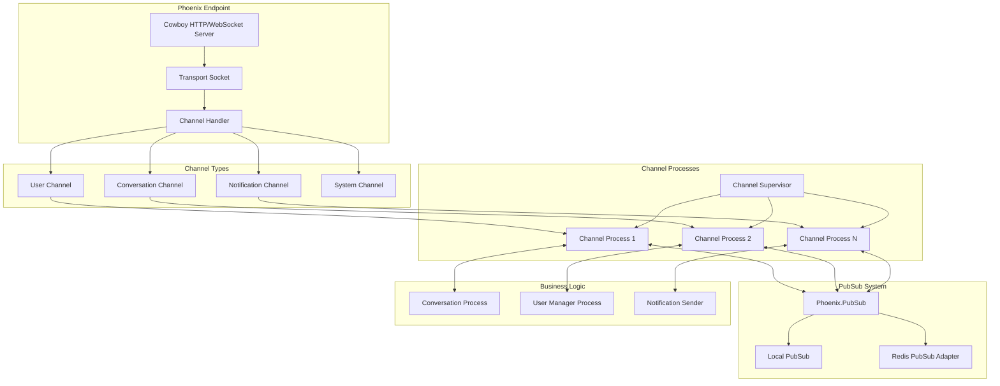
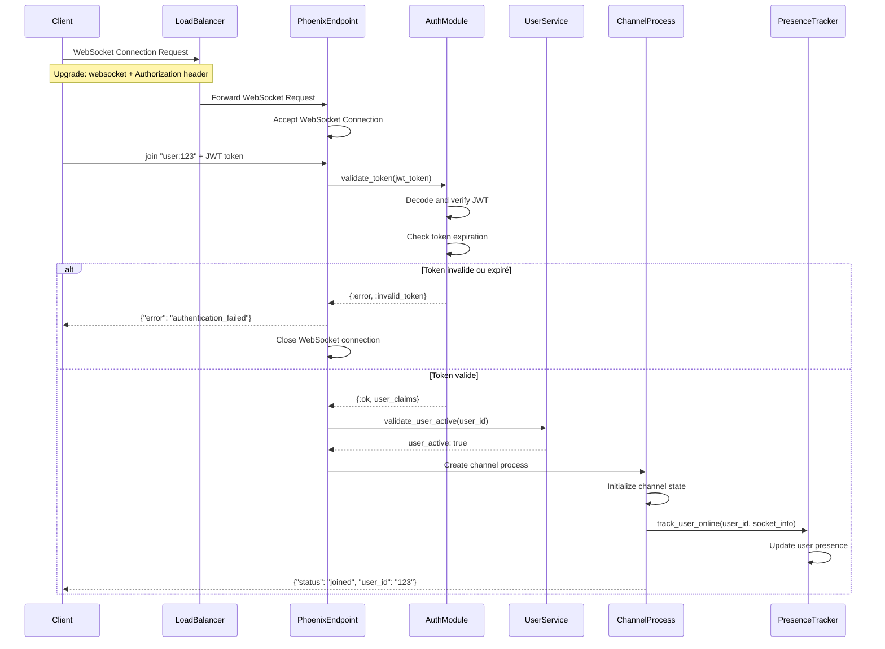
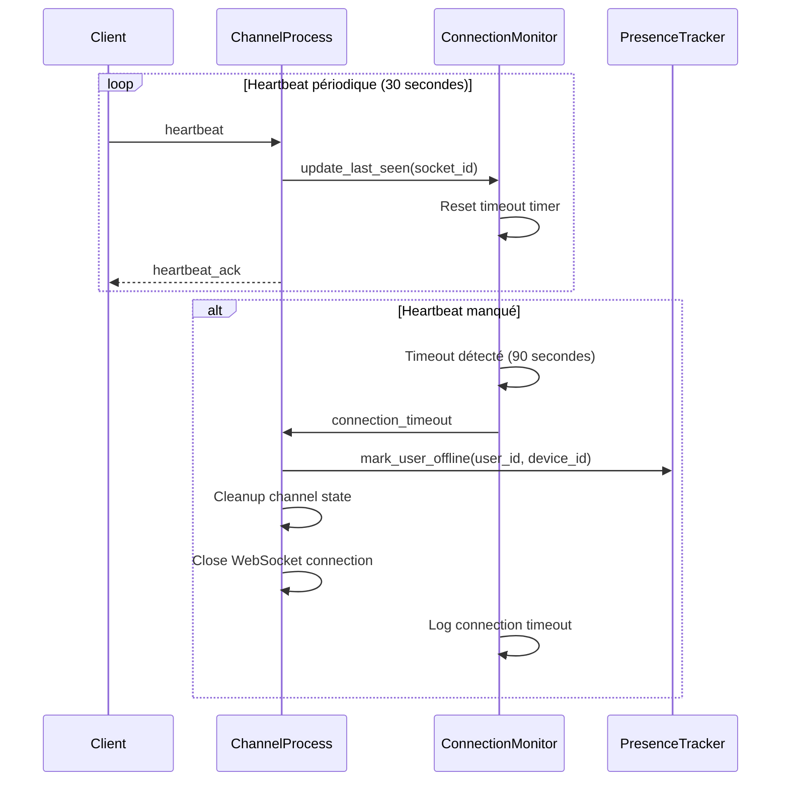
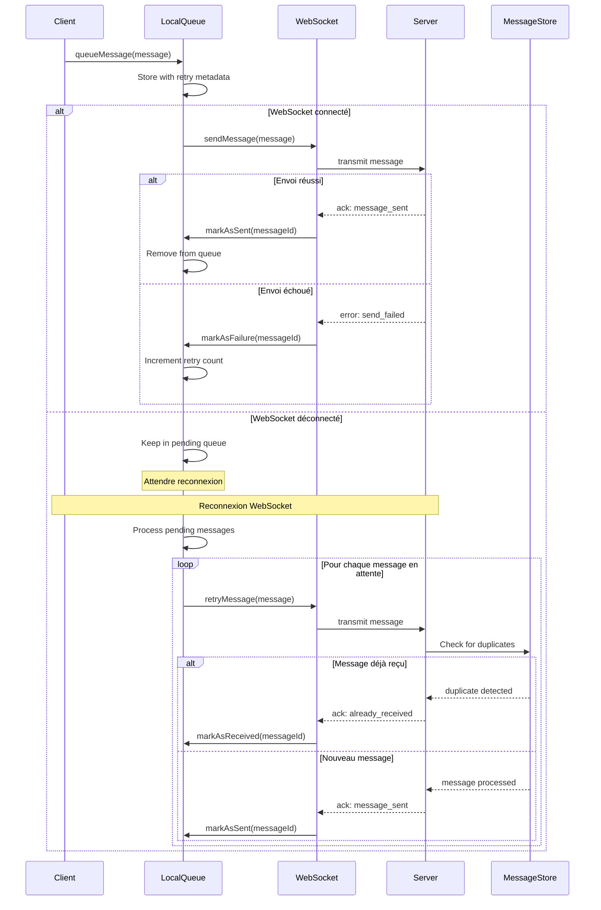
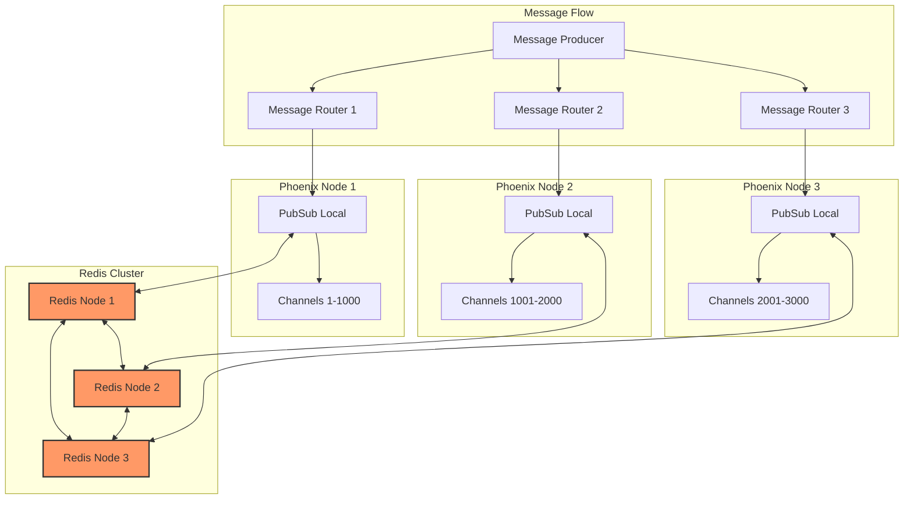
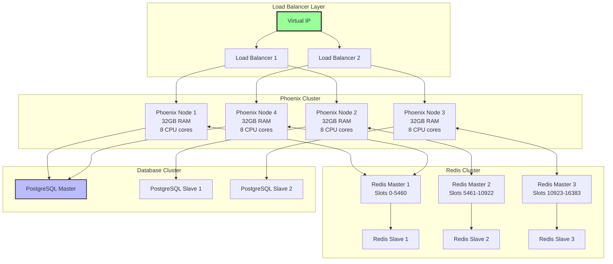
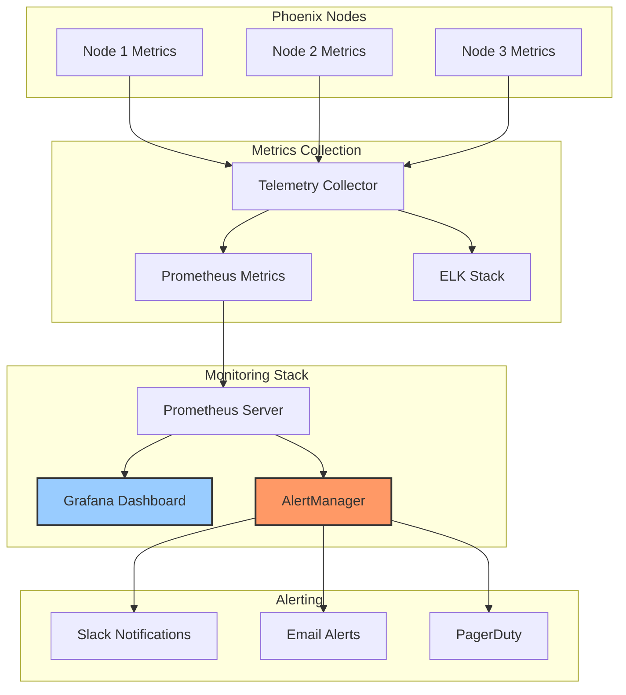

# Spécification Fonctionnelle - WebSockets et Communication Temps Réel

## 1. Vue d'ensemble

### 1.1 Objectif

Cette spécification détaille l'infrastructure de communication bidirectionnelle temps réel de l'application Whispr basée sur Phoenix Channels et WebSockets. Elle couvre l'établissement des connexions, la gestion des sessions, la distribution des messages, les stratégies de scaling et de résilience nécessaires pour assurer une expérience de messagerie fluide et fiable.

### 1.2 Principes architecturaux

- **Communication bidirectionnelle**: WebSockets pour interaction temps réel entre client et serveur
- **Haute disponibilité**: Architecture distribuée avec basculement automatique
- **Scalabilité horizontale**: Capacité à gérer des milliers de connexions simultanées
- **Résilience**: Récupération automatique après déconnexions et pannes
- **Performance optimale**: Latence minimale pour les communications critiques
- **Sécurité renforcée**: Authentification et autorisation pour toutes les connexions
- **Monitoring complet**: Observabilité totale des flux de communication

### 1.3 Architecture générale



### 1.4 Composants fonctionnels

Le système WebSocket comprend neuf processus principaux :
1. **Établissement de connexion**: Authentification et initialisation des canaux
2. **Gestion des sessions**: Maintien et suivi des connexions actives
3. **Distribution des messages**: Routage temps réel des communications
4. **Gestion multi-appareils**: Coordination entre sessions utilisateur
5. **Reconnexion automatique**: Récupération après déconnexions
6. **Scaling horizontal**: Répartition de charge entre nœuds
7. **Monitoring et métriques**: Surveillance de la santé du système
8. **Sécurité et autorisation**: Protection des canaux de communication
9. **Optimisation des performances**: Minimisation de la latence

## 2. Architecture Phoenix Channels

### 2.1 Structure des canaux



### 2.2 Définition des canaux

#### User Channel - Canal utilisateur principal
```elixir
defmodule WhisprMessaging.UserChannel do
  use Phoenix.Channel
  
  @impl true
  def join("user:" <> user_id, _payload, socket) do
    if authorized?(socket, user_id) do
      # Enregistrer présence utilisateur
      Phoenix.Presence.track(socket, user_id, %{
        online_at: inspect(System.system_time(:second)),
        device_type: socket.assigns.device_type
      })
      
      {:ok, assign(socket, :user_id, user_id)}
    else
      {:error, %{reason: "unauthorized"}}
    end
  end
  
  @impl true
  def handle_in("heartbeat", _payload, socket) do
    {:reply, {:ok, %{status: "alive"}}, socket}
  end
  
  @impl true
  def handle_info({:new_message, message}, socket) do
    push(socket, "new_message", message)
    {:noreply, socket}
  end
end
```

#### Conversation Channel - Canal de conversation
```elixir
defmodule WhisprMessaging.ConversationChannel do
  use Phoenix.Channel
  
  @impl true
  def join("conversation:" <> conversation_id, _payload, socket) do
    if member_of_conversation?(socket.assigns.user_id, conversation_id) do
      # Enregistrer participation à la conversation
      {:ok, assign(socket, :conversation_id, conversation_id)}
    else
      {:error, %{reason: "not_member"}}
    end
  end
  
  @impl true
  def handle_in("send_message", payload, socket) do
    case MessagingService.send_message(payload, socket.assigns) do
      {:ok, message} ->
        broadcast!(socket, "new_message", message)
        {:reply, {:ok, %{message_id: message.id}}, socket}
      {:error, reason} ->
        {:reply, {:error, %{reason: reason}}, socket}
    end
  end
  
  @impl true
  def handle_in("typing_start", _payload, socket) do
    broadcast_from!(socket, "user_typing", %{
      user_id: socket.assigns.user_id,
      typing: true
    })
    {:noreply, socket}
  end
end
```

### 2.3 Supervision et tolérance aux pannes

```elixir
defmodule WhisprMessaging.ChannelSupervisor do
  use Supervisor
  
  def start_link(init_arg) do
    Supervisor.start_link(__MODULE__, init_arg, name: __MODULE__)
  end
  
  @impl true
  def init(_init_arg) do
    children = [
      # Supervision des canaux utilisateur
      {DynamicSupervisor, name: WhisprMessaging.UserChannelSupervisor, strategy: :one_for_one},
      
      # Supervision des canaux de conversation
      {DynamicSupervisor, name: WhisprMessaging.ConversationChannelSupervisor, strategy: :one_for_one},
      
      # Gestionnaire de présence
      WhisprMessaging.Presence,
      
      # Gestionnaire de connexions
      WhisprMessaging.ConnectionManager,
      
      # Moniteur de santé des connexions
      WhisprMessaging.ConnectionMonitor
    ]
    
    Supervisor.init(children, strategy: :one_for_one)
  end
end
```

## 3. Établissement et authentification des connexions

### 3.1 Processus d'authentification WebSocket



### 3.2 Configuration de l'endpoint Phoenix

```elixir
defmodule WhisprMessaging.Endpoint do
  use Phoenix.Endpoint, otp_app: :whispr_messaging
  
  # Configuration WebSocket
  socket "/socket", WhisprMessaging.UserSocket,
    websocket: [
      timeout: 45_000,
      transport_log: false,
      compress: true,
      check_origin: ["https://whispr.app", "https://api.whispr.app"]
    ],
    longpoll: false
  
  # Configuration CORS pour WebSocket
  plug Corsica,
    origins: ["https://whispr.app", "https://api.whispr.app"],
    allow_headers: ["authorization", "content-type"],
    allow_methods: ["GET", "POST", "PUT", "DELETE", "OPTIONS"]
  
  # Plug d'authentification
  plug WhisprMessaging.AuthPlug
end
```

### 3.3 Gestion des sessions utilisateur

```elixir
defmodule WhisprMessaging.UserSocket do
  use Phoenix.Socket
  
  channel "user:*", WhisprMessaging.UserChannel
  channel "conversation:*", WhisprMessaging.ConversationChannel
  channel "notification:*", WhisprMessaging.NotificationChannel
  
  @impl true
  def connect(%{"token" => token}, socket, _connect_info) do
    case WhisprMessaging.Auth.verify_token(token) do
      {:ok, %{"user_id" => user_id, "device_id" => device_id}} ->
        socket = socket
          |> assign(:user_id, user_id)
          |> assign(:device_id, device_id)
          |> assign(:connected_at, System.system_time(:millisecond))
        
        {:ok, socket}
      {:error, _reason} ->
        :error
    end
  end
  
  @impl true
  def connect(_params, _socket, _connect_info), do: :error
  
  @impl true
  def id(socket), do: "user_socket:#{socket.assigns.user_id}:#{socket.assigns.device_id}"
end
```

## 4. Maintien de session et gestion des états

### 4.1 Système de heartbeat



### 4.2 Gestionnaire de connexions

```elixir
defmodule WhisprMessaging.ConnectionManager do
  use GenServer
  
  @timeout_interval 90_000  # 90 secondes
  @cleanup_interval 300_000 # 5 minutes
  
  def start_link(_opts) do
    GenServer.start_link(__MODULE__, %{}, name: __MODULE__)
  end
  
  @impl true
  def init(state) do
    :timer.send_interval(@cleanup_interval, :cleanup_stale_connections)
    {:ok, %{connections: %{}, last_seen: %{}}}
  end
  
  def register_connection(socket_id, user_id, device_id) do
    GenServer.call(__MODULE__, {:register, socket_id, user_id, device_id})
  end
  
  def update_heartbeat(socket_id) do
    GenServer.cast(__MODULE__, {:heartbeat, socket_id})
  end
  
  @impl true
  def handle_call({:register, socket_id, user_id, device_id}, _from, state) do
    connection_info = %{
      user_id: user_id,
      device_id: device_id,
      connected_at: System.system_time(:millisecond),
      last_heartbeat: System.system_time(:millisecond)
    }
    
    new_state = %{
      state | 
      connections: Map.put(state.connections, socket_id, connection_info),
      last_seen: Map.put(state.last_seen, socket_id, System.system_time(:millisecond))
    }
    
    {:reply, :ok, new_state}
  end
  
  @impl true
  def handle_cast({:heartbeat, socket_id}, state) do
    new_last_seen = Map.put(state.last_seen, socket_id, System.system_time(:millisecond))
    {:noreply, %{state | last_seen: new_last_seen}}
  end
  
  @impl true
  def handle_info(:cleanup_stale_connections, state) do
    current_time = System.system_time(:millisecond)
    
    {active_connections, stale_sockets} = 
      Enum.split_with(state.last_seen, fn {_socket_id, last_seen} ->
        current_time - last_seen < @timeout_interval
      end)
    
    # Nettoyer les connexions obsolètes
    Enum.each(stale_sockets, fn {socket_id, _} ->
      cleanup_stale_connection(socket_id, state.connections[socket_id])
    end)
    
    new_state = %{
      connections: Map.drop(state.connections, Enum.map(stale_sockets, &elem(&1, 0))),
      last_seen: Map.new(active_connections)
    }
    
    {:noreply, new_state}
  end
  
  defp cleanup_stale_connection(socket_id, connection_info) do
    if connection_info do
      # Marquer utilisateur comme hors ligne
      WhisprMessaging.Presence.untrack_user(connection_info.user_id, connection_info.device_id)
      
      # Logger déconnexion
      Logger.info("Cleaned up stale connection for user #{connection_info.user_id}")
    end
  end
end
```

### 4.3 Suivi de présence distribuée

```elixir
defmodule WhisprMessaging.Presence do
  use Phoenix.Presence, 
    otp_app: :whispr_messaging,
    pubsub_server: WhisprMessaging.PubSub
  
  def track_user_online(user_id, device_id, socket) do
    track(socket, "users", user_id, %{
      device_id: device_id,
      online_at: System.system_time(:second),
      device_type: socket.assigns[:device_type] || "unknown"
    })
  end
  
  def get_user_presence(user_id) do
    list("users")
    |> Map.get(user_id, %{metas: []})
    |> Map.get(:metas)
  end
  
  def is_user_online?(user_id) do
    get_user_presence(user_id) != []
  end
  
  def get_online_devices(user_id) do
    get_user_presence(user_id)
    |> Enum.map(& &1.device_id)
  end
  
  def untrack_user(user_id, device_id) do
    # Trouver et supprimer la présence spécifique à l'appareil
    presences = get_user_presence(user_id)
    
    Enum.find(presences, fn meta -> 
      meta.device_id == device_id 
    end)
    |> case do
      nil -> :ok
      meta -> 
        # Logique de suppression spécifique
        :ok
    end
  end
end
```

## 5. Gestion des déconnexions et reconnexions

### 5.1 Stratégie de reconnexion côté client

```javascript
class WhisprWebSocket {
  constructor(url, options = {}) {
    this.url = url;
    this.options = {
      maxReconnectAttempts: 10,
      reconnectInterval: 1000,
      maxReconnectInterval: 30000,
      reconnectBackoffRate: 1.5,
      ...options
    };
    
    this.reconnectAttempts = 0;
    this.reconnectTimer = null;
    this.isReconnecting = false;
    this.socket = null;
    this.channels = new Map();
    
    this.connect();
  }
  
  connect() {
    try {
      this.socket = new Phoenix.Socket(this.url, {
        params: { token: this.getAuthToken() },
        transport: window.WebSocket,
        heartbeatIntervalMs: 30000,
        rejoinAfterMs: (tries) => {
          return [1000, 2000, 5000, 10000][tries - 1] || 10000;
        }
      });
      
      this.socket.onOpen(() => {
        console.log('WebSocket connected');
        this.reconnectAttempts = 0;
        this.isReconnecting = false;
        this.onConnected();
      });
      
      this.socket.onClose((event) => {
        console.log('WebSocket disconnected:', event);
        this.handleDisconnection(event);
      });
      
      this.socket.onError((error) => {
        console.error('WebSocket error:', error);
        this.handleError(error);
      });
      
      this.socket.connect();
      
    } catch (error) {
      console.error('Failed to create WebSocket connection:', error);
      this.scheduleReconnect();
    }
  }
  
  handleDisconnection(event) {
    // Codes de fermeture qui ne nécessitent pas de reconnexion
    const noReconnectCodes = [1000, 1001, 3000]; // Normal, Going Away, Unauthorized
    
    if (noReconnectCodes.includes(event.code)) {
      console.log('WebSocket closed normally, no reconnection needed');
      return;
    }
    
    if (!this.isReconnecting && this.reconnectAttempts < this.options.maxReconnectAttempts) {
      this.scheduleReconnect();
    } else if (this.reconnectAttempts >= this.options.maxReconnectAttempts) {
      console.error('Max reconnection attempts reached');
      this.onReconnectFailed();
    }
  }
  
  scheduleReconnect() {
    if (this.isReconnecting) return;
    
    this.isReconnecting = true;
    this.reconnectAttempts++;
    
    const delay = Math.min(
      this.options.reconnectInterval * Math.pow(this.options.reconnectBackoffRate, this.reconnectAttempts - 1),
      this.options.maxReconnectInterval
    );
    
    console.log(`Scheduling reconnection attempt ${this.reconnectAttempts} in ${delay}ms`);
    
    this.reconnectTimer = setTimeout(() => {
      this.reconnectTimer = null;
      this.connect();
    }, delay);
  }
  
  joinChannel(topic, payload = {}) {
    if (!this.socket) {
      throw new Error('Socket not connected');
    }
    
    const channel = this.socket.channel(topic, payload);
    
    channel.join()
      .receive("ok", resp => {
        console.log(`Joined channel ${topic}`, resp);
        this.channels.set(topic, channel);
      })
      .receive("error", resp => {
        console.error(`Failed to join channel ${topic}`, resp);
      });
    
    return channel;
  }
  
  // Gestionnaires d'événements
  onConnected() {
    // Rejoindre automatiquement les canaux précédents
    this.rejoinChannels();
    
    // Synchroniser l'état après reconnexion
    this.syncStateAfterReconnection();
  }
  
  rejoinChannels() {
    // Logic to rejoin channels that were active before disconnection
    const activeChannels = this.getActiveChannels();
    activeChannels.forEach(channelInfo => {
      this.joinChannel(channelInfo.topic, channelInfo.payload);
    });
  }
  
  syncStateAfterReconnection() {
    // Synchroniser les messages manqués
    this.emit('sync_required', {
      lastSyncTimestamp: this.getLastSyncTimestamp()
    });
  }
}
```

### 5.2 Gestion des messages en attente



### 5.3 Queue de messages côté serveur

```elixir
defmodule WhisprMessaging.OfflineMessageQueue do
  use GenServer
  
  @default_ttl 86400 # 24 heures en secondes
  
  def start_link(_opts) do
    GenServer.start_link(__MODULE__, %{}, name: __MODULE__)
  end
  
  def queue_message(user_id, message) do
    GenServer.cast(__MODULE__, {:queue_message, user_id, message})
  end
  
  def get_pending_messages(user_id) do
    GenServer.call(__MODULE__, {:get_pending, user_id})
  end
  
  def mark_delivered(user_id, message_id) do
    GenServer.cast(__MODULE__, {:mark_delivered, user_id, message_id})
  end
  
  @impl true
  def init(_) do
    # Programmer nettoyage périodique
    :timer.send_interval(3600_000, :cleanup_expired) # Chaque heure
    {:ok, %{}}
  end
  
  @impl true
  def handle_cast({:queue_message, user_id, message}, state) do
    # Stocker dans Redis avec TTL
    Redis.lpush("offline_messages:#{user_id}", Jason.encode!(message))
    Redis.expire("offline_messages:#{user_id}", @default_ttl)
    
    {:noreply, state}
  end
  
  @impl true
  def handle_call({:get_pending, user_id}, _from, state) do
    messages = case Redis.lrange("offline_messages:#{user_id}", 0, -1) do
      {:ok, encoded_messages} ->
        Enum.map(encoded_messages, &Jason.decode!/1)
      _ ->
        []
    end
    
    {:reply, messages, state}
  end
  
  @impl true
  def handle_cast({:mark_delivered, user_id, message_id}, state) do
    # Retirer le message spécifique de la queue
    key = "offline_messages:#{user_id}"
    messages = Redis.lrange(key, 0, -1)
    
    case messages do
      {:ok, encoded_messages} ->
        remaining_messages = 
          encoded_messages
          |> Enum.map(&Jason.decode!/1)
          |> Enum.reject(fn msg -> msg["id"] == message_id end)
          |> Enum.map(&Jason.encode!/1)
        
        # Remplacer la liste
        Redis.del(key)
        if remaining_messages != [] do
          Redis.lpush(key, remaining_messages)
          Redis.expire(key, @default_ttl)
        end
      _ ->
        :ok
    end
    
    {:noreply, state}
  end
  
  @impl true
  def handle_info(:cleanup_expired, state) do
    # Redis TTL s'occupe du nettoyage automatique
    {:noreply, state}
  end
end
```

## 6. Distribution et routage des messages

### 6.1 Architecture PubSub distribuée



### 6.2 Routage des messages par conversation

```elixir
defmodule WhisprMessaging.MessageRouter do
  @moduledoc """
  Router intelligent pour distribuer les messages aux bons canaux
  """
  
  def route_message(%{conversation_id: conversation_id} = message) do
    # Identifier les participants de la conversation
    participants = get_conversation_participants(conversation_id)
    
    # Distribuer à tous les appareils connectés des participants
    Enum.each(participants, fn participant ->
      route_to_user_devices(participant.user_id, message)
    end)
  end
  
  defp route_to_user_devices(user_id, message) do
    # Obtenir tous les appareils connectés de l'utilisateur
    connected_devices = WhisprMessaging.Presence.get_online_devices(user_id)
    
    case connected_devices do
      [] ->
        # Utilisateur hors ligne - stocker pour livraison différée
        WhisprMessaging.OfflineMessageQueue.queue_message(user_id, message)
        
      devices ->
        # Distribuer à tous les appareils connectés
        Enum.each(devices, fn device_id ->
          topic = "user:#{user_id}:#{device_id}"
          Phoenix.PubSub.broadcast(
            WhisprMessaging.PubSub,
            topic,
            {:new_message, message}
          )
        end)
    end
  end
  
  defp get_conversation_participants(conversation_id) do
    # Query pour récupérer les participants actifs
    from(cm in ConversationMember,
      where: cm.conversation_id == ^conversation_id and cm.is_active == true,
      select: %{user_id: cm.user_id}
    )
    |> Repo.all()
  end
end
```

### 6.3 Optimisation du routage pour les groupes

```elixir
defmodule WhisprMessaging.GroupMessageRouter do
  @moduledoc """
  Routage optimisé pour les messages de groupe
  """
  
  def route_group_message(%{conversation_id: conversation_id} = message) do
    # Utiliser le cache pour éviter les requêtes répétées
    participants = get_cached_participants(conversation_id)
    
    # Grouper les participants par nœud Phoenix pour optimiser
    participants_by_node = group_participants_by_node(participants)
    
    # Distribuer par nœud pour minimiser le trafic inter-nœuds
    Enum.each(participants_by_node, fn {node, node_participants} ->
      if node == Node.self() do
        # Distribution locale
        route_locally(node_participants, message)
      else
        # Distribution distante via RPC
        :rpc.cast(node, __MODULE__, :route_locally, [node_participants, message])
      end
    end)
  end
  
  def route_locally(participants, message) do
    Enum.each(participants, fn participant ->
      connected_devices = WhisprMessaging.Presence.get_online_devices(participant.user_id)
      
      Enum.each(connected_devices, fn device_id ->
        topic = "user:#{participant.user_id}:#{device_id}"
        Phoenix.PubSub.broadcast(
          WhisprMessaging.PubSub,
          topic,
          {:new_message, message}
        )
      end)
    end)
  end
  
  defp get_cached_participants(conversation_id) do
    cache_key = "conversation_participants:#{conversation_id}"
    
    case Redis.get(cache_key) do
      {:ok, nil} ->
        # Cache miss - récupérer de la base
        participants = get_conversation_participants(conversation_id)
        Redis.setex(cache_key, 300, Jason.encode!(participants)) # Cache 5 minutes
        participants
        
      {:ok, cached_data} ->
        Jason.decode!(cached_data, keys: :atoms)
    end
  end
  
  defp group_participants_by_node(participants) do
    # Logique pour déterminer sur quel nœud chaque utilisateur est connecté
    participants
    |> Enum.group_by(fn participant ->
      # Utiliser consistent hashing ou registry distribué
      determine_user_node(participant.user_id)
    end)
  end
  
  defp determine_user_node(user_id) do
    # Consistent hashing pour déterminer le nœud responsable
    hash = :erlang.phash2(user_id, length(Node.list([:visible]) ++ [Node.self()]))
    Enum.at(Node.list([:visible]) ++ [Node.self()], hash)
  end
end
```

## 7. Scaling et haute disponibilité

### 7.1 Stratégie de scaling horizontal



### 7.2 Configuration de clustering Elixir

```elixir
# config/prod.exs
config :whispr_messaging, WhisprMessaging.Endpoint,
  # Configuration cluster
  server: true,
  root: ".",
  version: Application.spec(:whispr_messaging, :vsn),
  cache_static_manifest: "priv/static/cache_manifest.json"

# Configuration libcluster pour discovery automatique
config :libcluster,
  topologies: [
    whispr_cluster: [
      strategy: Cluster.Strategy.Kubernetes,
      config: [
        mode: :dns,
        kubernetes_node_basename: "whispr-messaging",
        kubernetes_selector: "app=whispr-messaging",
        kubernetes_namespace: "production",
        polling_interval: 10_000
      ]
    ]
  ]

# Configuration Phoenix PubSub avec Redis
config :whispr_messaging, WhisprMessaging.PubSub,
  adapter: Phoenix.PubSub.Redis,
  redis_url: System.get_env("REDIS_URL"),
  node_name: System.get_env("NODE_NAME")
```

### 7.3 Gestion automatique des nœuds

```elixir
defmodule WhisprMessaging.ClusterManager do
  use GenServer
  require Logger
  
  @node_health_check_interval 30_000 # 30 secondes
  
  def start_link(_opts) do
    GenServer.start_link(__MODULE__, %{}, name: __MODULE__)
  end
  
  @impl true
  def init(_state) do
    # Démarrer les vérifications de santé
    :timer.send_interval(@node_health_check_interval, :health_check)
    
    # S'abonner aux événements de cluster
    :net_kernel.monitor_nodes(true)
    
    {:ok, %{nodes: [], last_health_check: System.system_time(:millisecond)}}
  end
  
  @impl true
  def handle_info({:nodeup, node}, state) do
    Logger.info("Node #{node} joined the cluster")
    
    # Redistribuer les connexions si nécessaire
    rebalance_connections()
    
    new_nodes = [node | state.nodes] |> Enum.uniq()
    {:noreply, %{state | nodes: new_nodes}}
  end
  
  @impl true
  def handle_info({:nodedown, node}, state) do
    Logger.warn("Node #{node} left the cluster")
    
    # Gérer le basculement des connexions
    handle_node_failure(node)
    
    new_nodes = List.delete(state.nodes, node)
    {:noreply, %{state | nodes: new_nodes}}
  end
  
  @impl true
  def handle_info(:health_check, state) do
    # Vérifier la santé du nœud actuel
    health_status = check_node_health()
    
    case health_status do
      :healthy ->
        :ok
      {:unhealthy, reason} ->
        Logger.error("Node health check failed: #{reason}")
        # Signaler aux autres nœuds de prendre le relais
        notify_cluster_of_degradation(reason)
    end
    
    {:noreply, %{state | last_health_check: System.system_time(:millisecond)}}
  end
  
  defp check_node_health do
    checks = [
      {:memory, check_memory_usage()},
      {:cpu, check_cpu_usage()},
      {:connections, check_websocket_connections()},
      {:database, check_database_connectivity()},
      {:redis, check_redis_connectivity()}
    ]
    
    failed_checks = Enum.filter(checks, fn {_name, result} -> result != :ok end)
    
    case failed_checks do
      [] -> :healthy
      failures -> {:unhealthy, failures}
    end
  end
  
  defp rebalance_connections do
    # Logique de redistribution des connexions
    # Implémenter consistent hashing pour minimiser les déplacements
    active_nodes = [Node.self() | Node.list()]
    total_connections = get_total_connections()
    target_per_node = div(total_connections, length(active_nodes))
    
    current_connections = get_current_node_connections()
    
    if current_connections > target_per_node * 1.2 do
      # Nœud surchargé - rediriger nouvelles connexions
      set_connection_redirect_mode(true)
    else
      set_connection_redirect_mode(false)
    end
  end
  
  defp handle_node_failure(failed_node) do
    # Récupérer les utilisateurs connectés sur le nœud défaillant
    failed_connections = get_connections_for_node(failed_node)
    
    # Redistribuer aux nœuds survivants
    Enum.each(failed_connections, fn connection ->
      # Notifier le client de se reconnecter
      notify_client_reconnection_needed(connection)
    end)
  end
end
```

### 7.4 Métriques de performance et auto-scaling

```elixir
defmodule WhisprMessaging.MetricsCollector do
  use GenServer
  
  @metrics_interval 10_000 # 10 secondes
  
  def start_link(_opts) do
    GenServer.start_link(__MODULE__, %{}, name: __MODULE__)
  end
  
  @impl true
  def init(_state) do
    :timer.send_interval(@metrics_interval, :collect_metrics)
    {:ok, %{}}
  end
  
  @impl true
  def handle_info(:collect_metrics, state) do
    metrics = %{
      timestamp: System.system_time(:millisecond),
      node: Node.self(),
      websocket_connections: count_websocket_connections(),
      memory_usage: get_memory_usage(),
      cpu_usage: get_cpu_usage(),
      message_throughput: get_message_throughput(),
      average_latency: get_average_latency(),
      error_rate: get_error_rate()
    }
    
    # Publier métriques pour monitoring
    publish_metrics(metrics)
    
    # Déclencher auto-scaling si nécessaire
    check_scaling_triggers(metrics)
    
    {:noreply, state}
  end
  
  defp check_scaling_triggers(metrics) do
    cond do
      metrics.websocket_connections > 8000 ->
        trigger_scale_up("High connection count: #{metrics.websocket_connections}")
        
      metrics.cpu_usage > 80 ->
        trigger_scale_up("High CPU usage: #{metrics.cpu_usage}%")
        
      metrics.memory_usage > 85 ->
        trigger_scale_up("High memory usage: #{metrics.memory_usage}%")
        
      metrics.average_latency > 500 ->
        trigger_scale_up("High latency: #{metrics.average_latency}ms")
        
      true ->
        :ok
    end
  end
  
  defp trigger_scale_up(reason) do
    Logger.info("Triggering scale up: #{reason}")
    
    # Appel API Kubernetes pour scaling
    K8s.Client.patch(
      "apps/v1",
      "deployments",
      namespace: "production",
      name: "whispr-messaging",
      body: %{
        spec: %{
          replicas: get_current_replicas() + 1
        }
      }
    )
  end
end
```

## 8. Surveillance et monitoring

### 8.1 Métriques WebSocket critiques

```elixir
defmodule WhisprMessaging.Telemetry do
  @moduledoc """
  Collecte et expose les métriques critiques pour les WebSockets
  """
  
  def setup_metrics do
    # Métriques de connexion
    :telemetry.execute([:websocket, :connection, :established], %{count: 1})
    :telemetry.execute([:websocket, :connection, :closed], %{count: 1})
    
    # Métriques de messages
    :telemetry.execute([:websocket, :message, :sent], %{count: 1, size: message_size})
    :telemetry.execute([:websocket, :message, :received], %{count: 1, latency: latency})
    
    # Métriques d'erreur
    :telemetry.execute([:websocket, :error], %{count: 1}, %{type: error_type})
  end
  
  # Handlers pour Prometheus/Grafana
  def handle_event([:websocket, :connection, :established], measurements, metadata, _config) do
    :prometheus_counter.inc(:websocket_connections_total, [metadata.node])
    :prometheus_gauge.inc(:websocket_connections_active, [metadata.node])
  end
  
  def handle_event([:websocket, :connection, :closed], measurements, metadata, _config) do
    :prometheus_gauge.dec(:websocket_connections_active, [metadata.node])
    :prometheus_histogram.observe(
      :websocket_connection_duration_seconds,
      [metadata.node],
      metadata.duration / 1000
    )
  end
  
  def handle_event([:websocket, :message, :sent], measurements, metadata, _config) do
    :prometheus_counter.inc(:websocket_messages_total, [metadata.node, "sent"])
    :prometheus_histogram.observe(
      :websocket_message_size_bytes,
      [metadata.node, "sent"],
      measurements.size
    )
  end
end
```

### 8.2 Dashboard de monitoring



### 8.3 Alertes critiques

```yaml
# alertmanager.yml
groups:
  - name: websocket_alerts
    rules:
      - alert: HighWebSocketConnections
        expr: websocket_connections_active > 8000
        for: 2m
        labels:
          severity: warning
        annotations:
          summary: "High number of WebSocket connections"
          description: "Node {{ $labels.node }} has {{ $value }} active connections"
      
      - alert: WebSocketConnectionFailureRate
        expr: rate(websocket_connection_errors_total[5m]) > 0.1
        for: 1m
        labels:
          severity: critical
        annotations:
          summary: "High WebSocket connection failure rate"
          description: "Connection failure rate is {{ $value }} per second"
      
      - alert: WebSocketHighLatency
        expr: websocket_message_latency_p95 > 500
        for: 2m
        labels:
          severity: warning
        annotations:
          summary: "High WebSocket message latency"
          description: "95th percentile latency is {{ $value }}ms"
      
      - alert: NodeDown
        expr: up{job="phoenix-nodes"} == 0
        for: 30s
        labels:
          severity: critical
        annotations:
          summary: "Phoenix node is down"
          description: "Node {{ $labels.instance }} has been down for more than 30 seconds"
```

## 9. Sécurité et authentification

### 9.1 Authentification JWT pour WebSockets

```elixir
defmodule WhisprMessaging.Auth do
  @moduledoc """
  Module d'authentification pour les connexions WebSocket
  """
  
  def verify_token(token) when is_binary(token) do
    case Guardian.decode_and_verify(WhisprMessaging.Guardian, token) do
      {:ok, claims} ->
        {:ok, claims}
      {:error, reason} ->
        {:error, reason}
    end
  end
  
  def verify_token(_), do: {:error, :invalid_token}
  
  def authorize_channel_access(user_id, channel_topic) do
    case parse_channel_topic(channel_topic) do
      {:user_channel, target_user_id} ->
        user_id == target_user_id
        
      {:conversation_channel, conversation_id} ->
        ConversationMember.exists?(user_id, conversation_id)
        
      {:notification_channel, target_user_id} ->
        user_id == target_user_id
        
      _ ->
        false
    end
  end
  
  defp parse_channel_topic("user:" <> user_id), do: {:user_channel, user_id}
  defp parse_channel_topic("conversation:" <> conv_id), do: {:conversation_channel, conv_id}
  defp parse_channel_topic("notification:" <> user_id), do: {:notification_channel, user_id}
  defp parse_channel_topic(_), do: {:unknown, nil}
end
```

### 9.2 Protection contre les attaques

```elixir
defmodule WhisprMessaging.SecurityMiddleware do
  @moduledoc """
  Middleware de sécurité pour les connexions WebSocket
  """
  
  @max_connections_per_ip 10
  @max_message_rate 100 # messages par minute
  @max_message_size 10_000 # bytes
  
  def check_connection_limits(remote_ip) do
    current_connections = count_connections_for_ip(remote_ip)
    
    if current_connections >= @max_connections_per_ip do
      {:error, :too_many_connections}
    else
      :ok
    end
  end
  
  def check_rate_limit(user_id, message_type \\ :default) do
    rate_key = "rate_limit:#{user_id}:#{message_type}"
    current_count = Redis.get(rate_key) |> parse_count()
    
    if current_count >= @max_message_rate do
      {:error, :rate_limit_exceeded}
    else
      Redis.incr(rate_key)
      Redis.expire(rate_key, 60) # 1 minute
      :ok
    end
  end
  
  def validate_message_size(message) do
    message_size = byte_size(message)
    
    if message_size > @max_message_size do
      {:error, :message_too_large}
    else
      :ok
    end
  end
  
  def detect_suspicious_activity(user_id, activity_data) do
    patterns = [
      check_message_spam(activity_data),
      check_connection_abuse(activity_data),
      check_channel_hopping(activity_data)
    ]
    
    case Enum.find(patterns, fn result -> result != :ok end) do
      nil -> :ok
      {:suspicious, reason} -> {:block, reason}
    end
  end
  
  defp check_message_spam(%{message_count: count, time_window: window}) 
       when count > 50 and window < 60 do
    {:suspicious, :message_spam}
  end
  
  defp check_connection_abuse(%{connection_attempts: attempts, time_window: window})
       when attempts > 20 and window < 300 do
    {:suspicious, :connection_abuse}
  end
  
  defp check_channel_hopping(%{channel_joins: joins, time_window: window})
       when joins > 30 and window < 60 do
    {:suspicious, :channel_hopping}
  end
  
  defp check_message_spam(_), do: :ok
  defp check_connection_abuse(_), do: :ok
  defp check_channel_hopping(_), do: :ok
end
```

### 9.3 Audit et journalisation de sécurité

```elixir
defmodule WhisprMessaging.SecurityAudit do
  require Logger
  
  def log_connection_attempt(remote_ip, user_agent, result) do
    Logger.info("WebSocket connection attempt", 
      remote_ip: remote_ip,
      user_agent: user_agent,
      result: result,
      timestamp: System.system_time(:millisecond)
    )
  end
  
  def log_authentication_failure(token_hash, reason, remote_ip) do
    Logger.warn("WebSocket authentication failure",
      token_hash: token_hash,
      reason: reason,
      remote_ip: remote_ip,
      timestamp: System.system_time(:millisecond)
    )
  end
  
  def log_rate_limit_exceeded(user_id, message_type, remote_ip) do
    Logger.warn("Rate limit exceeded",
      user_id: user_id,
      message_type: message_type,
      remote_ip: remote_ip,
      timestamp: System.system_time(:millisecond)
    )
  end
  
  def log_suspicious_activity(user_id, activity_type, details) do
    Logger.error("Suspicious activity detected",
      user_id: user_id,
      activity_type: activity_type,
      details: details,
      timestamp: System.system_time(:millisecond)
    )
  end
end
```

## 10. Gestion des erreurs et résilience

### 10.1 Circuit breaker pour services externes

```elixir
defmodule WhisprMessaging.CircuitBreaker do
  use GenServer
  
  @failure_threshold 5
  @recovery_timeout 30_000 # 30 secondes
  @half_open_max_calls 3
  
  defstruct state: :closed,
            failure_count: 0,
            last_failure_time: nil,
            half_open_calls: 0
  
  def start_link(service_name) do
    GenServer.start_link(__MODULE__, %__MODULE__{}, name: via_tuple(service_name))
  end
  
  def call(service_name, fun) when is_function(fun, 0) do
    GenServer.call(via_tuple(service_name), {:call, fun})
  end
  
  @impl true
  def init(state) do
    {:ok, state}
  end
  
  @impl true
  def handle_call({:call, fun}, _from, %{state: :open} = state) do
    if should_attempt_reset?(state) do
      handle_call({:call, fun}, _from, %{state | state: :half_open, half_open_calls: 0})
    else
      {:reply, {:error, :circuit_open}, state}
    end
  end
  
  def handle_call({:call, fun}, _from, %{state: :half_open} = state) do
    if state.half_open_calls >= @half_open_max_calls do
      {:reply, {:error, :circuit_open}, %{state | state: :open}}
    else
      execute_call(fun, %{state | half_open_calls: state.half_open_calls + 1})
    end
  end
  
  def handle_call({:call, fun}, _from, %{state: :closed} = state) do
    execute_call(fun, state)
  end
  
  defp execute_call(fun, state) do
    try do
      result = fun.()
      new_state = handle_success(state)
      {:reply, {:ok, result}, new_state}
    rescue
      error ->
        new_state = handle_failure(state)
        {:reply, {:error, error}, new_state}
    end
  end
  
  defp handle_success(%{state: :half_open} = state) do
    %{state | state: :closed, failure_count: 0, half_open_calls: 0}
  end
  
  defp handle_success(state) do
    %{state | failure_count: 0}
  end
  
  defp handle_failure(state) do
    failure_count = state.failure_count + 1
    
    if failure_count >= @failure_threshold do
      %{state | 
        state: :open, 
        failure_count: failure_count,
        last_failure_time: System.system_time(:millisecond)
      }
    else
      %{state | failure_count: failure_count}
    end
  end
  
  defp should_attempt_reset?(%{last_failure_time: last_failure_time}) do
    System.system_time(:millisecond) - last_failure_time > @recovery_timeout
  end
  
  defp via_tuple(service_name) do
    {:via, Registry, {WhisprMessaging.CircuitBreakerRegistry, service_name}}
  end
end
```

### 10.2 Supervision et récupération des processus

```elixir
defmodule WhisprMessaging.ChannelSupervisor do
  use DynamicSupervisor
  
  def start_link(init_arg) do
    DynamicSupervisor.start_link(__MODULE__, init_arg, name: __MODULE__)
  end
  
  @impl true
  def init(_init_arg) do
    DynamicSupervisor.init(
      strategy: :one_for_one,
      max_restarts: 3,
      max_seconds: 60
    )
  end
  
  def start_channel(channel_module, channel_args) do
    child_spec = %{
      id: channel_module,
      start: {channel_module, :start_link, [channel_args]},
      restart: :transient,
      shutdown: 5000,
      type: :worker
    }
    
    DynamicSupervisor.start_child(__MODULE__, child_spec)
  end
  
  def stop_channel(pid) do
    DynamicSupervisor.terminate_child(__MODULE__, pid)
  end
end

# Supervisor principal avec stratégie rest_for_one
defmodule WhisprMessaging.Supervisor do
  use Supervisor
  
  def start_link(opts) do
    Supervisor.start_link(__MODULE__, :ok, opts)
  end
  
  @impl true
  def init(:ok) do
    children = [
      # Registry pour les processus nommés
      {Registry, keys: :unique, name: WhisprMessaging.Registry},
      
      # PubSub pour la communication inter-processus
      {Phoenix.PubSub, name: WhisprMessaging.PubSub, adapter: Phoenix.PubSub.Redis},
      
      # Gestionnaire de présence
      WhisprMessaging.Presence,
      
      # Gestionnaire de connexions
      WhisprMessaging.ConnectionManager,
      
      # Superviseur de canaux
      WhisprMessaging.ChannelSupervisor,
      
      # Circuit breakers
      {Registry, keys: :unique, name: WhisprMessaging.CircuitBreakerRegistry},
      
      # Endpoint Phoenix (doit être en dernier)
      WhisprMessaging.Endpoint
    ]
    
    Supervisor.init(children, strategy: :rest_for_one)
  end
end
```

## 11. Performance et optimisations

### 11.1 Optimisations mémoire

```elixir
defmodule WhisprMessaging.MemoryOptimizer do
  @moduledoc """
  Optimisations mémoire pour les processus WebSocket
  """
  
  def optimize_channel_process(pid) do
    # Configurer la garbage collection
    :erlang.process_flag(pid, :min_heap_size, 4096)
    :erlang.process_flag(pid, :min_bin_vheap_size, 4096)
    
    # Hibernation des processus inactifs
    schedule_hibernation(pid)
  end
  
  defp schedule_hibernation(pid) do
    Process.send_after(pid, :hibernate_if_idle, 300_000) # 5 minutes
  end
  
  def handle_hibernation_check(socket) do
    last_activity = socket.assigns[:last_activity] || 0
    current_time = System.system_time(:millisecond)
    
    if current_time - last_activity > 300_000 do # 5 minutes
      :proc_lib.hibernate(GenServer, :enter_loop, [
        __MODULE__,
        [],
        socket
      ])
    end
  end
  
  def cleanup_stale_data do
    # Nettoyer les caches expirés
    Redis.eval("""
      local keys = redis.call('keys', 'websocket:*')
      for i=1,#keys do
        if redis.call('ttl', keys[i]) == -1 then
          redis.call('del', keys[i])
        end
      end
    """, [])
  end
end
```

### 11.2 Optimisations réseau

```elixir
defmodule WhisprMessaging.NetworkOptimizer do
  @moduledoc """
  Optimisations réseau pour les WebSockets
  """
  
  def configure_socket_options(socket) do
    :inet.setopts(socket, [
      {:nodelay, true},           # Désactiver l'algorithme de Nagle
      {:send_timeout, 30000},     # Timeout d'envoi 30s
      {:send_timeout_close, true}, # Fermer en cas de timeout
      {:keepalive, true},         # Activer keepalive TCP
      {:reuseaddr, true},         # Réutiliser l'adresse
      {:backlog, 1024}           # Queue de connexions en attente
    ])
  end
  
  def compress_message(message) when byte_size(message) > 1024 do
    # Compression pour les gros messages
    :zlib.compress(message)
  end
  
  def compress_message(message), do: message
  
  def batch_messages(messages) when length(messages) > 1 do
    # Regrouper plusieurs petits messages
    Jason.encode!(%{
      type: "batch",
      messages: messages,
      count: length(messages)
    })
  end
  
  def batch_messages([message]), do: message
  
  def optimize_json_encoding(data) do
    # Utiliser un encodeur JSON optimisé
    case Jason.encode(data) do
      {:ok, json} -> json
      {:error, _} -> Jason.encode!(%{error: "encoding_failed"})
    end
  end
end
```

### 11.3 Pool de connexions optimisé

```elixir
defmodule WhisprMessaging.ConnectionPool do
  use GenServer
  
  @pool_size 1000
  @max_overflow 200
  
  def start_link(_opts) do
    GenServer.start_link(__MODULE__, %{}, name: __MODULE__)
  end
  
  @impl true
  def init(_state) do
    # Configurer pool de connexions Ecto optimisé
    config = [
      pool: Ecto.Adapters.SQL.Sandbox,
      pool_size: @pool_size,
      max_overflow: @max_overflow,
      timeout: 15_000,
      ownership_timeout: 20_000,
      pool_timeout: 5_000,
      
      # Optimisations PostgreSQL
      parameters: [
        {"work_mem", "32MB"},
        {"effective_cache_size", "4GB"},
        {"maintenance_work_mem", "256MB"},
        {"shared_preload_libraries", "pg_stat_statements"}
      ]
    ]
    
    {:ok, %{config: config}}
  end
  
  def get_optimized_connection do
    # Obtenir une connexion avec retry et circuit breaker
    WhisprMessaging.CircuitBreaker.call(:database, fn ->
      Ecto.Adapters.SQL.checkout(WhisprMessaging.Repo, [], fn conn ->
        # Optimiser la connexion pour les WebSockets
        Ecto.Adapters.SQL.query!(conn, "SET statement_timeout = '30s'")
        Ecto.Adapters.SQL.query!(conn, "SET lock_timeout = '10s'")
        conn
      end)
    end)
  end
end
```

## 12. Tests et validation

### 12.1 Tests de charge WebSocket

```elixir
defmodule WhisprMessaging.LoadTest do
  @moduledoc """
  Tests de charge pour les connexions WebSocket
  """
  
  def run_connection_test(num_connections \\ 1000) do
    # Créer des connexions simultanées
    tasks = Enum.map(1..num_connections, fn i ->
      Task.async(fn ->
        simulate_user_connection(i)
      end)
    end)
    
    # Attendre que toutes les connexions soient établies
    results = Task.await_many(tasks, 30_000)
    
    # Analyser les résultats
    analyze_connection_results(results)
  end
  
  defp simulate_user_connection(user_id) do
    start_time = System.monotonic_time(:millisecond)
    
    # Établir connexion WebSocket
    {:ok, socket} = Phoenix.ChannelsClient.Socket.start_link()
    
    # S'authentifier
    Phoenix.ChannelsClient.Socket.connect(socket, %{
      "token" => generate_test_token(user_id)
    })
    
    # Rejoindre canal utilisateur
    {:ok, channel} = Phoenix.ChannelsClient.Channel.join(socket, "user:#{user_id}")
    
    # Envoyer des messages de test
    send_test_messages(channel, 10)
    
    end_time = System.monotonic_time(:millisecond)
    
    %{
      user_id: user_id,
      connection_time: end_time - start_time,
      status: :success
    }
  rescue
    error ->
      %{
        user_id: user_id,
        status: :error,
        error: error
      }
  end
  
  defp send_test_messages(channel, count) do
    Enum.each(1..count, fn i ->
      Phoenix.ChannelsClient.Channel.push(channel, "test_message", %{
        sequence: i,
        timestamp: System.system_time(:millisecond)
      })
      
      :timer.sleep(100) # 100ms entre les messages
    end)
  end
  
  def run_latency_test do
    # Test de latence message round-trip
    {:ok, socket} = Phoenix.ChannelsClient.Socket.start_link()
    Phoenix.ChannelsClient.Socket.connect(socket, %{"token" => generate_test_token(1)})
    {:ok, channel} = Phoenix.ChannelsClient.Channel.join(socket, "user:1")
    
    latencies = Enum.map(1..100, fn _i ->
      start_time = System.monotonic_time(:microsecond)
      
      Phoenix.ChannelsClient.Channel.push(channel, "ping", %{})
      receive do
        "pong" -> System.monotonic_time(:microsecond) - start_time
      after
        5000 -> :timeout
      end
    end)
    
    valid_latencies = Enum.reject(latencies, &(&1 == :timeout))
    
    %{
      avg_latency: Enum.sum(valid_latencies) / length(valid_latencies) / 1000,
      min_latency: Enum.min(valid_latencies) / 1000,
      max_latency: Enum.max(valid_latencies) / 1000,
      timeout_rate: (length(latencies) - length(valid_latencies)) / length(latencies)
    }
  end
end
```

### 12.2 Tests de résilience

```elixir
defmodule WhisprMessaging.ResilienceTest do
  @moduledoc """
  Tests de résilience pour vérifier la robustesse du système
  """
  
  def test_node_failure_recovery do
    # Simuler une panne de nœud
    initial_connections = count_active_connections()
    
    # Tuer un nœud du cluster
    target_node = Enum.random(Node.list())
    :rpc.call(target_node, System, :halt, [])
    
    # Attendre la détection de la panne
    :timer.sleep(5000)
    
    # Vérifier la redistribution des connexions
    Process.sleep(10000)
    final_connections = count_active_connections()
    
    recovery_rate = final_connections / initial_connections
    
    assert recovery_rate > 0.95, "Recovery rate too low: #{recovery_rate}"
  end
  
  def test_database_failure_resilience do
    # Simuler une panne de base de données
    original_config = Application.get_env(:whispr_messaging, WhisprMessaging.Repo)
    
    # Modifier la config pour pointer vers un serveur inexistant
    Application.put_env(:whispr_messaging, WhisprMessaging.Repo, [
      hostname: "nonexistent-host",
      port: 5432
    ])
    
    # Redémarrer le repo
    Supervisor.terminate_child(WhisprMessaging.Supervisor, WhisprMessaging.Repo)
    Supervisor.restart_child(WhisprMessaging.Supervisor, WhisprMessaging.Repo)
    
    # Tester que les connexions WebSocket restent actives
    connections_before = count_active_connections()
    :timer.sleep(30000) # Attendre 30 secondes
    connections_after = count_active_connections()
    
    # Restaurer la configuration
    Application.put_env(:whispr_messaging, WhisprMessaging.Repo, original_config)
    Supervisor.terminate_child(WhisprMessaging.Supervisor, WhisprMessaging.Repo)
    Supervisor.restart_child(WhisprMessaging.Supervisor, WhisprMessaging.Repo)
    
    connection_retention = connections_after / connections_before
    assert connection_retention > 0.90, "Too many connections lost during DB failure"
  end
  
  def test_redis_failure_resilience do
    # Simuler une panne Redis
    Redis.command(["DEBUG", "SEGFAULT"]) # Force Redis crash in test env
    
    # Vérifier que les nouveaux messages continuent d'être traités localement
    {:ok, socket} = create_test_connection()
    {:ok, channel} = Phoenix.ChannelsClient.Channel.join(socket, "user:test")
    
    # Envoyer un message
    ref = Phoenix.ChannelsClient.Channel.push(channel, "test_message", %{content: "test"})
    
    receive do
      {:ok, ^ref} -> :ok
      {:error, ^ref, reason} -> flunk("Message failed during Redis outage: #{reason}")
    after
      5000 -> flunk("Message timeout during Redis outage")
    end
  end
end
```

## 13. Configuration de déploiement

### 13.1 Configuration Kubernetes

```yaml
# websocket-deployment.yaml
apiVersion: apps/v1
kind: Deployment
metadata:
  name: whispr-websocket
  namespace: production
spec:
  replicas: 3
  selector:
    matchLabels:
      app: whispr-websocket
  template:
    metadata:
      labels:
        app: whispr-websocket
    spec:
      containers:
      - name: websocket
        image: whispr/messaging:latest
        ports:
        - containerPort: 4000
        env:
        - name: NODE_NAME
          valueFrom:
            fieldRef:
              fieldPath: metadata.name
        - name: REDIS_URL
          value: "redis://redis-cluster:6379"
        - name: DATABASE_URL
          valueFrom:
            secretKeyRef:
              name: postgres-credentials
              key: url
        resources:
          requests:
            memory: "2Gi"
            cpu: "1000m"
          limits:
            memory: "4Gi"
            cpu: "2000m"
        livenessProbe:
          httpGet:
            path: /health
            port: 4000
          initialDelaySeconds: 30
          periodSeconds: 10
        readinessProbe:
          httpGet:
            path: /ready
            port: 4000
          initialDelaySeconds: 5
          periodSeconds: 5
---
apiVersion: v1
kind: Service
metadata:
  name: whispr-websocket
  namespace: production
spec:
  selector:
    app: whispr-websocket
  ports:
  - port: 4000
    targetPort: 4000
  type: ClusterIP
---
apiVersion: networking.k8s.io/v1
kind: Ingress
metadata:
  name: whispr-websocket-ingress
  namespace: production
  annotations:
    nginx.ingress.kubernetes.io/proxy-read-timeout: "3600"
    nginx.ingress.kubernetes.io/proxy-send-timeout: "3600"
    nginx.ingress.kubernetes.io/websocket-services: "whispr-websocket"
spec:
  rules:
  - host: ws.whispr.app
    http:
      paths:
      - path: /socket
        pathType: Prefix
        backend:
          service:
            name: whispr-websocket
            port:
              number: 4000
```

### 13.2 Configuration Nginx

```nginx
# nginx.conf
upstream websocket_backend {
    least_conn;
    server websocket-1:4000 max_fails=3 fail_timeout=30s;
    server websocket-2:4000 max_fails=3 fail_timeout=30s;
    server websocket-3:4000 max_fails=3 fail_timeout=30s;
}

server {
    listen 443 ssl http2;
    server_name ws.whispr.app;
    
    # SSL configuration
    ssl_certificate /etc/ssl/certs/whispr.crt;
    ssl_certificate_key /etc/ssl/private/whispr.key;
    ssl_protocols TLSv1.2 TLSv1.3;
    
    # WebSocket specific configuration
    location /socket {
        proxy_pass http://websocket_backend;
        proxy_http_version 1.1;
        proxy_set_header Upgrade $http_upgrade;
        proxy_set_header Connection "upgrade";
        proxy_set_header Host $host;
        proxy_set_header X-Real-IP $remote_addr;
        proxy_set_header X-Forwarded-For $proxy_add_x_forwarded_for;
        proxy_set_header X-Forwarded-Proto $scheme;
        
        # Timeouts for WebSocket
        proxy_connect_timeout 30s;
        proxy_send_timeout 86400s;
        proxy_read_timeout 86400s;
        
        # Buffer settings
        proxy_buffering off;
        proxy_cache off;
    }
    
    # Health check endpoint
    location /health {
        proxy_pass http://websocket_backend;
        proxy_set_header Host $host;
        access_log off;
    }
}
```

## 14. Livrables

1. **Infrastructure WebSocket complète** comprenant :
   - Architecture Phoenix Channels scalable
   - Système d'authentification et autorisation
   - Gestion avancée des sessions et reconnexions
   - Distribution intelligente des messages

2. **Système de monitoring et alertes** :
   - Métriques détaillées de performance
   - Dashboards Grafana temps réel
   - Alertes automatiques sur incidents critiques
   - Outils de diagnostic et dépannage

3. **Stratégies de scaling et haute disponibilité** :
   - Configuration de clustering Elixir
   - Load balancing intelligent
   - Basculement automatique des connexions
   - Auto-scaling basé sur la charge

4. **Sécurité et résilience** :
   - Protection contre les attaques DDoS et spam
   - Circuit breakers pour services externes
   - Système de récupération automatique
   - Audit complet des connexions

5. **Documentation opérationnelle** :
   - Guide de déploiement et configuration
   - Procédures de monitoring et maintenance
   - Plans de récupération après sinistre
   - Bonnes pratiques de performance et sécurité